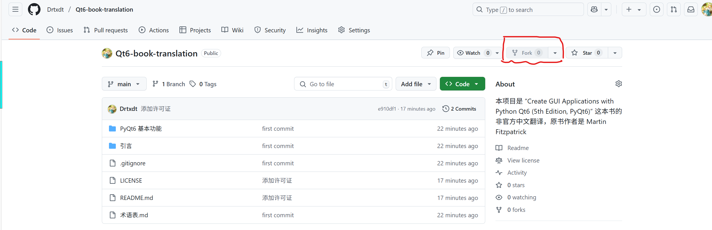

# 贡献指南

首先，十分感谢您愿意为本项目做出贡献！以下的内容请您务必知晓

**请您务必了解许可证 [CC BY-NC-SA 4.0](https://creativecommons.org/licenses/by-nc-sa/4.0/) 的内容并承诺遵守许可证条款**

## 有关翻译错误

请您具体指出错误的位置和内容。这将包括：具体的文件名，原书对应位置的页码。如果可以的话，请您将您认为合理的翻译版本和原文以及我们目前版本进行可视化的对比。例如：

```text
# 原书内容 P43 line 11
Modify the code to add .setScaledContents(True) to the label —

# 目前的版本
修改代码，在标签中添加 `.setScaledContents(True)` ——

# 修改版
请您修改代码，在标签中添加 `.setScaledContents(True)` ——
```

如果您有更好的展示方法也可以采用您的展示模板

## 我想认领某一部分的翻译

您可以通过电子邮件与我联系！我的邮箱是：

```text
lhtshuai@126.com
```

我每天都会检查邮箱！如果我和您协商一致，您就可以翻译您的部分啦

另外，还请您遵循以下规范：

- **尽量**保持和原书一致的格式
- 代码块缩进使用**四个空格**而不是制表符`Tab`
- 与术语表尽量保持一致
- 请手动测试一下代码块看看是否可以正常运行，以防复制粘贴时的错误
- 图片请务必使用不带`./`的相对路径

## Bug修复

后期可以会出现某些技术类的Bug。您在提交时请务必列出Bug类型、复现过程以及您的解决方案

## 标准协作流程

以下是Github的标准协作流程。如果您是大佬，您可以忽略以下内容

### Fork（复刻）本仓库

在本仓库的右上角，您可以找到Fork按钮。



您只需此按钮单击右侧的三角打开下拉菜单，点击 `Create a new Fork`，您就成功将它fork到您的账户下了

### 配置本地环境

请在本地的任意位置打开终端

```bash
# 克隆您的Fork仓库
# 替换为你的GitHub用户名
git clone https://github.com/<你的用户名>/Qt6-book-translation.git
cd Qt6-book-translation

# 添加上游仓库(关联原项目)
git remote add upstream https://github.com/Drtxdt/Qt6-book-translation.git

# 同步最新代码(避免过期)
git fetch upstream
git checkout main  # 切换到主分支
git merge upstream/main  # 合并上游更新
git push origin main  # 推送到你的Fork

# 创建新的分支
# 推荐格式 <种类>/<简略描述>
git checkout -b <type>/<description>
```

### 开始您的工作

您可以按照您的想法随意编辑文件。请定期进行提交：

```bash
git add <your file>
git commit -m "........"
```

您也可以准备完整提交：

```bash
# 完整检查后提交所有修改
git add --update  # 添加所有修改文件
git commit -m "............."
```

### 将分支推送到您的Fork

```bash
git push -u origin <type>/<description>
```

### 创建Pull Request（PR，拉取请求）

请您登录Github并选择您的分支，然后单击按钮 `Create Pull Request`。请你按照上文的约定编写PR描述。我会定期查看，并且回复您的PR