# PyQt6 基本功能

现在是时候迈出使用PyQt6创建图形用户界面的第一步了！

在本章中，您将学习PyQt6的基础知识，这些知识是您创建任何应用程序的基础。我们将开发一个简单的桌面窗口应用程序。我们将添加控件，使用布局进行排列并将这些控件与函数连接，使您能够通过图形用户界面触发应用程序的行为。

请以提供的代码为指导，但还请随时自己动手尝试。 这就是学习这些代码如何工作的最好方法。


> 在我们开始之前，您需要安装一个可以正常运行的 PyQt6。如果您还没有安装，请查看 附录A：安装 PyQt6。


> 不要忘记下载本书的源代码[http://www.pythonguis.com/d/pyqt6-source.zip](http://www.pythonguis.com/d/pyqt6-source.zip)!

## 3. 我的第一个应用程序

让我们来创建第一个应用程序！首先，创建一个新的 Python 文件——您可以随意将其命名为您喜欢的任何名字（例如：`myapp.py`），然后将它保存在一个可以访问的地方。 我们将在这个文件中编写我们的简单应用程序。


> 我们将在此文件中进行编辑，您可能想要回到代码的早期版本，所以记得定期备份。

### 创建您的应用程序

我们的第一个应用程序的源代码如下所示。 请您逐词键入，注意不要出错。 如果您弄错了，Python 会告诉您哪里出错了。 如果您不想全部手动键入，这个文件包含在这本书的源代码中.

*Listing 1. basic/creating_a_window_1.py*

```python
from PyQt6.QtWidgets import QApplication, QWidget
# 仅用于访问命令行参数
import sys

# 每个应用程序需要一个（且只有一个）QApplication 实例
# 输入 sys.argv，这可以允许应用程序使用命令行参数
# 如果知道不会使用命令行参数,也可以使用 QApplication([])
app = QApplication(sys.argv)

# 创建一个 Qt widget作为我们的窗口。
window = QWidget()
window.show() # 这很重要!!!!! 默认情况下，窗口是隐藏的。

# 开始事件循环
app.exec()

# 您的应用程序不会到达这里，直到您退出并且事件循环终止
```

首先，启动您的应用程序。 您可以像任何其他 Python 脚本一样从命令行运行它，例如

```bash
python MyApp.py
```

或者，对于 Python 3

```bash
python3 MyApp.py
```

从现在起，您将看到下面的提示框，提示您运行应用程序并提示您接下来将看到什么。

> 🚀 **运行它吧!** 现在您将看到您的窗口。 Qt 会自动创建一个窗口，您可以拖动它并调整其大小,就像您见过的其他窗口那样。

您看到的内容取决于运行这个示例的平台。下图展示了在 *Windows*、*macOS* 和 *Linux (Ubuntu）*上显示的窗口。
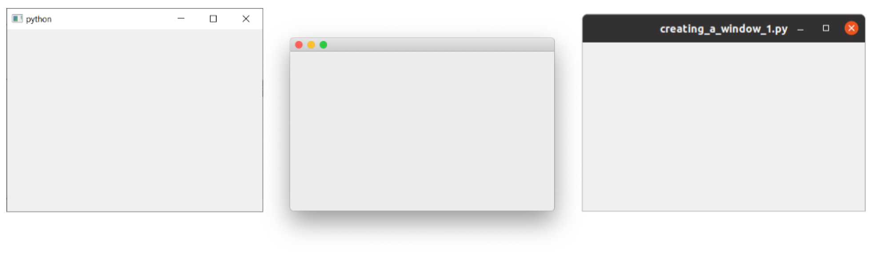

> 图三: 我们分别在*Windows*、*macOS* 和 *Linux (Ubuntu）*上显示的窗口

### 代码中的步骤

让我们逐行地查看代码，以便准确地理解到底发生了什么。

首先，我们导入应用程序所需的 PyQt6 类。 这里我们导入 `QApplication`（应用程序处理程序）和 `QWidget`（基本的空 GUI控件)，这两个类都来自 `QtWidgets` 模块。

```python
from PyQt6.QtWidgets import QApplication, QWidget
```

Qt 的主要模块包括 `QtWidgets`、`QtGui` 和 `QtCore`。


> 您可以使用 `from <module> import *`，但这种全局导入在 Python 中通常是不受欢迎的，所以在这里我们将避免使用它

接下来，我们创建一个`QApplication` 实例，传入 `sys.arg`，即包含传递给应用程序的命令行参数的 Python列表

```python
app = QApplication(sys.argv)
```

如果您不会使用命令行参数来控制 Qt，您可以传递一个空列表，例如

```python
app = QApplication([])
```

接下来，我们使用变量名 `window` 来创建一个 `QWidget` 实例。

```python
window = QWidget()
window.show()
```

在 Qt 中，*所有* 顶层部件都是窗口，也就是说，它们没有父控件，也不嵌套在另一个控件或布局中。这意味着您可以在技术上使用任何您喜欢的控件来创建一个窗口。

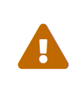

> 我看不到我的窗口!
> 没有父类的小工具默认是不可见的。 因此，在窗口对象后，我们必须始终调用 `.show()` 来使其可见。 您可以移除 .show() 并运行应用程序，但您会无法退出！


> 什么是窗口？
> - 保存应用程序的用户界面
> - 每个应用程序至少需要一个（......但也可以有更多）
> - 默认情况下，当最后一个窗口关闭时，应用程序将退出

最后，我们调用 `app.exec()` 来开始事件循环。

### 什么是事件循环?

在屏幕上显示窗口之前，有几个有关 Qt 世界中应用程序的组织方式的关键概念需要介绍一下.如果您已经熟悉事件循环，就可以放心地跳到下一节。

每个 Qt 应用程序的核心都是 `QApplication` 类。 每个应用程序需要一个，且只需要一个 `QApplication` 对象才可以运行。 该对象包含应用程序的**事件循环**——管理所有图形用户界面交互的核心循环。

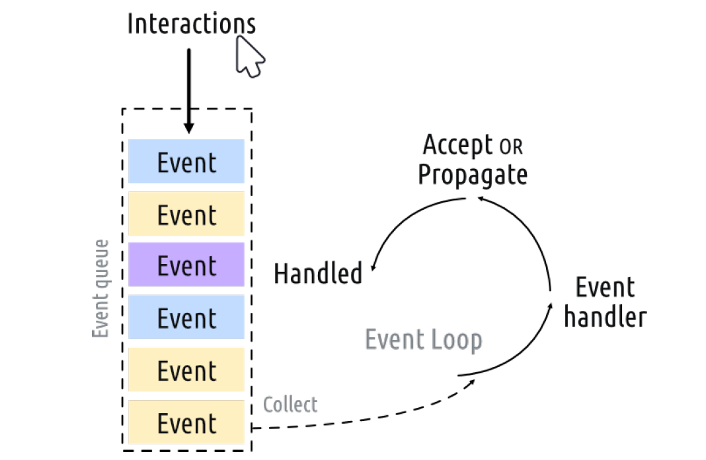

> 图4:Qt中的事件循环

与应用程序的每次交互——无论是按键、点击鼠标还是移动鼠标——都会产生一个事件，该事件被置于**事件队列**中。在事件循环中，每次迭代都会对队列进行检查，如果发现正在等侯的事件，程序就会将事件和控制权传递给特定的事件处理程序。事件处理程序会处理事件，然后将控制权传递回事件循环，等待处理更多事件。 每个应用程序只能由**一个**事件循环


> 有关`QApplication` 类……
>
> - `QApplication` 包含 Qt 事件循环
> - 需要一个 `QApplication` 实例
> - 您的应用程序将在事件循环中等待，直到有操作执行
> - 任何时候都只有**一个**事件循环

### `QMainWindow`

正如我们在上一部分中所发现的，在 Qt 中任何控件都可以是窗口。 例如，如果您使用 `QPushButton` 代替 `QtWidget`。 在下面的示例中，您将得到一个有一个可按下的按钮的窗口。

*Listing 2. basic/creating_a_window_2.py*

```python
import sys
from PyQt6.QtWidgets import QApplication, QPushButton

app = QApplication(sys.argv)

window = QPushButton("Push Me")
window.show()

app.exec()
```

这太棒啦，但其实用处不大——您很少需要一个只有一个控件的用户界面！ 但是，正如我们接下来会发现的，使用布局将部件嵌套到其他部件中的功能着您可以在一个空的 `QWidget`中构建复杂的用户界面。

不过，Qt 已经为您提供了解决方案——`QMainWindow`。 这是一个预制的窗口部件，它提供了大量您可能会使用的标准窗口功能，包括工具栏、菜单、状态栏、可停靠控件等。

我们稍后会了解这些高级功能，但现在，我们将为我们的应用程序添加一个简单的空白`QMainWindow` 窗口。

*Listing 3. basic/creating_a_window_3.py*

```python
from PyQt6.QtWidgets import QApplication, QMainWindow
import sys

app = QApplication(sys.argv)

window = QMainWindow()
window.show() # 这很重要!!!!! 默认情况下，窗口是隐藏的

# 开始事件循环
app.exec()
```

> 🚀 **运行它吧！** 您会看到您的主窗口。它看上去和之前的那个完全一致！

目前我们的 `QMainWindow` 并不太有趣。我们可以添加一些内容来改善它。如果您想创建一个自定义窗口，最好的方法是继承 `QMainWindow`，然后在 `__init__` 块中包含窗口的设置。这使得窗口的行为可以自包含。我们可以添加我们自己的 `QMainWindow` 子类——为了简单起见，我们称它为 `MainWindow`。

*Listing 4. basic/creating_a_window_4.py*

```python
import sys
from PyQt6.QtCore import QSize, Qt
from PyQt6.QtWidgets import (
    QApplication,
    QMainWindow,
    QPushButton,
) #1

# 创建子类 QMainWindow 来自定义您的应用程序的主窗口
class MainWindow(QMainWindow):
    def __init__(self):
        super().__init__() #2
        
        self.setWindowTitle("My App")
        
        button = QPushButton("Press Me!")
        
        # 设置窗口的中心控件
        self.setCentralWidget(button) #3
        
        
app = QApplication(sys.argv)

window = MainWindow()
window.show()

app.exec()
```

> 1. 常用的 Qt 控件总是从 `QtWidgets` 命名空间导入。
> 2. 我们必须始终调用 `super()` 类的 `__init__`方法。
> 3. 使用 `.setCentralWidget` 在 `QMainWindow` 中放置一个控件。


> 当您子类化一个 Qt 类时，您必须始终调用`super`函数`__init__`以便 Qt 设置对象。

在我们的 `__init__` 块中，我们首先使用 `.setWindowTitle()` 来更改我们主窗口的标题。 然后，我们将第一个窗口控件——一个 `QPushButton` 添加到窗口中间。这是 Qt 中可用的基本部件之一。 在创建按钮时，您可以输入希望按钮显示的文本。

最后，我们在窗口上调用 `.setCentralWidget()`。 这是 `QMainWindow` 特有的函数，用于设置窗口中间的控件。

> 🚀 **运行它吧！** 您会再一次看到您的主窗口，但是这次`QPushButton`控件会显示在中央。按下按钮，但是什么也不会发生，我们将会稍后来调整

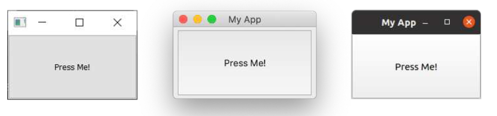

> 图五：显示在*Windows*，*macOS*和*Linux*上面的含有一个`QPushButton`的`QMainWindow`


> 渴望使用控件？
> 我们稍后会详细介绍更多控件，但如果您没有耐心，想先睹为快的话，可以看看[QWidget 文档](http://doc.qt.io/qt-5/widget-classes.html#basic-widget-classes)。 尝试将不同的控件添加到您的窗口！

### 调整窗口和控件的大小

当前窗口可自由调整大小——您只需用鼠标抓住窗口任何一个角，即可拖动并调整窗口大小至任意尺寸。虽然允许用户调整应用程序大小是件好事，但有时您可能需要对最小或最大尺寸设置限制，或将窗口锁定为固定大小。

在 Qt 中，尺寸通过 `QSize `对象进行定义。该对象依次接受宽度和高度参数。例如，以下代码将创建一个固定尺寸的 400x300 像素窗口。

*Listing 5. basic/creating_a_window_end.py*

```python
import sys

from PyQt6.QtCore import QSize, Qt
from PyQt6.QtWidgets import QApplication, QMainWindow, QPushButton

# 创建子类 QMainWindow 来自定义您的应用程序的主窗口
class MainWindow(QMainWindow):
    def __init__(self):
        super().__init__()
        
        self.setWindowTitle("My App")
        
        button = QPushButton("Press Me!")
        
        self.setFixedSize(QSize(400, 300)) #1
        
        # 设置窗口的中心控件
        self.setCentralWidget(button)
        
app = QApplication(sys.argv)

window = MainWindow()
window.show()

app.exec()
```

> 1. 设置窗口大小

> 🚀 **运行它吧！** 您会看到一个固定大小的窗口——试着去调整大小吧，这不会成功的

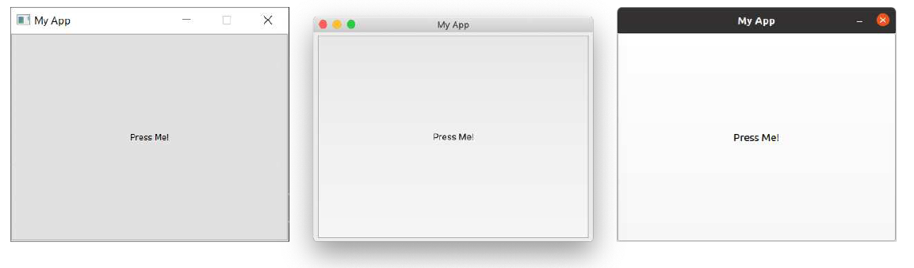

> 图六：我们的固定大小的窗口，注意最大化控件在*Windows* 和 *Linux* 上被禁用。 在 *macOS* 上，您可以将应用程序最大化以填满屏幕，但是
> 中央控件不会被调整大小。

除了可以调用 `.setFixedSize()` 方法外，您还可以调用 `.setMinimumSize()` 和`.setMaximumSize() `方法分别设置窗口的最小和最大尺寸。您不妨亲自尝试一下！


> 您可以用在任意控件中使用这种方法

在本节中，我们介绍了 `QApplication` 类、`QMainWindow` 类、事件循环，并尝试将一个简单的控件添加到窗口中。在下一节中，我们将了解 Qt 为控件和窗口之间以及控件和窗口与您自己的代码之间的通信提供的机制。


> 请将文件的副本保存为 `myapp.py`，我们稍后还会用到它。

## 4. 信号与槽

到目前为止，我们已经创建了一个窗口，并添加了一个简单的按钮控件，但该按钮没有任何功能。这完全没有用啊——当您创建图形用户界面应用程序时，通常一定希望它们能够执行某些操作！我们需要一种方法，将按下按钮的操作与执行某些操作联系起来。在Qt 中，信号和槽提供了这种功能。

信号是控件在发生某些事件时发出的通知。这些事件可以是按下按钮、输入框中文本的变化、窗口文本的变化等等任何事情。许多信号是由用户操作触发的，但这并不是一条死板的规则。

除了通知发生的事件外，信号还可以发送数据，并提供有关发生的事件的更多背景信息。


>  您还可以创建自己的自定义信号，我们将在之后的“32. 扩展信号”中进行探讨。

槽是 Qt 用于接收信号的名称。在 Python 中，应用程序中的任何函数（或方法）都可以用作槽——只需将信号连接到它即可。如果信号发送数据，则接收函数也会接收到该数据。许多 Qt 控件也有自己的内置槽，这意味着您可以直接将 Qt 控件连接在一起。

让我们来看看 Qt 信号的基本知识以及如何使用它们将控件连接起来以便在应用程序中实现各种功能。


> 请加载一份新的 `myapp.py` 文件用于本节内容并以新名称保存

### `QPushButton`的信号

我们简单的应用程序目前有一个 `QMainWindow`，其中 `QPushButton` 被设置为中央控件。首先，我们将这个按钮与一个自定义的 Python 方法连接起来。在这里，我们创建了一个名为 `the_button_was_clicked` 的简单自定义槽，它接受来自 `QPushButton` 的点击信号。

*Listing 6. basic/signals_and_slots_1.py*

```python
from PyQt6.QtWidgets import (
    QApplication,
    QMainWindow,
    QPushButton,
) #1

import sys

class MainWindow(QMainWindow):
    def __init__(self):
        super().__init__() #2
        
        self.setWindowTitle("My App")
        
        button = QPushButton("Press Me!")
        button.setCheckable(True)
        button.clicked.connect(self.the_button_was_clicked)
        
		# 设置窗口的中心控件
        self.setCentralWidget(button)
        
	def the_button_was_clicked(self):
        print("Clicked!")
        
        
app = QApplication(sys.argv)

window = MainWindow()
window.show()

app.exec()
```

> 🚀 **运行它吧！** 如果您点击这个按钮您将会在控制台中看到文本”Clicked!“

*控制台输出*

```text
Clicked!
Clicked!
Clicked!
Clicked!
```

### 接收数据

这真是一个很好的开始！我们已经知道信号还可以发送**数据**，以提供更多关于刚刚发生的事件的信息。`.clicked` 信号也不例外，它还提供了按钮的选中（或切换）状态。对于普通按钮，该状态始终为 `False`，因此我们的第一个槽忽略了这些数据。但是，我们可以让按钮**可选中**，然后看看效果。

在下面的示例中，我们将添加第二个槽用于输出**检查状态**。

*Listing 7. basic/signals_and_slots_1b.py*

```python
import sys

from PyQt6.QtWidgets import (
	QApplication,
	QMainWindow,
	QPushButton,
) #1

class MainWindow(QMainWindow):
    def __init__(self):
        super().__init__() #2
        
        self.setWindowTitle("My App")
        
        button = QPushButton("Press Me!")
        button.setCheckable(True)
        button.clicked.connect(self.the_button_was_clicked)
        button.clicked.connect(self.the_button_was_toggled)
        
        # 设置窗口的中心控件
        self.setCentralWidget(button)
        
    def the_button_was_clicked(self):
        print("Clicked!")
        
    def the_button_was_toggled(self, checked):
        print("Checked?", checked)
        
        
app = QApplication(sys.argv)

window = MainWindow()
window.show()

app.exec()
```

> 🚀 **运行它吧！** 如果您点击了这个按钮，您将会看到它在被点击之后高亮了。请再次点击它然后松开，并在控制台中检查状态

*控制台输出*

```text
Clicked!
Checked? True
Clicked!
Checked? False
Clicked!
Checked? True
Clicked!
Checked? False
Clicked!
Checked? True
```

您可以将任意数量的槽连接到一个信号，并可以在槽上同时响应不同版本的信号。

### 存储数据

通常，将控件的当前状态存储在 Python 变量中非常有用。这样就可以像处理其他 Python 变量一样处理这些值而无需访问原始控件。您可以将这些值存储为单独的变量，或者根据需要使用字典。在下一个示例中，我们将按钮的选中值存储在名为 `button_is_checked` 的变量中。

*Listing 8. basic/signals_and_slots_1c.py*

```python
class MainWindow(QMainWindow):
    def __init__(self):
        super().__init__()
        
        self.button_is_checked = True #1
        
        self.setWindowTitle("My App")
        
        button = QPushButton("Press Me!")
        button.setCheckable(True)
        button.clicked.connect(self.the_button_was_toggled)
        button.setChecked(self.button_is_checked) #2
        
        # 设置窗口的中心控件
        self.setCentralWidget(button)
        
    def the_button_was_toggled(self, checked):
        self.button_is_checked = checked #3
        
        print(self.button_is_checked)
```

> 1. 为变量设置默认值。
> 2. 使用默认值设置控件的初始状态。
> 3. 当控件状态发生变化时，更新变量以匹配。

您可以对任何 PyQt6 控件使用相同的模式。如果控件未提供发送当前状态的信号，则您需要在处理程序中直接从控件检索该值。例如，这里我们正在检查按下处理程序中的**选中**状态。

*Listing 9. basic/signals_and_slots_1d.py*

```python
class MainWindow(QMainWindow):
    def __init__(self):
        super().__init__()
        
        self.button_is_checked = True
        
        self.setWindowTitle("My App")
        
        self.button = QPushButton("Press Me!") #1
        self.button.setCheckable(True)
        self.button.released.connect(
            self.the_button_was_released
        ) #2
        self.button.setChecked(self.button_is_checked)
        
        # 设置窗口的中心控件
        self.setCentralWidget(self.button)
        
    def the_button_was_released(self):
        self.button_is_checked = self.button.isChecked() #3
        
        print(self.button_is_checked)
```

> 1. 我们需要保留对按钮的引用，以便在我们的槽中访问它。
> 2. 释放信号在按钮释放时触发，但不会发送检查状态。
> 3.  `.isChecked()` 返回按钮的检查状态。

### 更改界面

到目前为止，我们已经了解了如何接受信号并将输出打印到控制台。但是，当我们点击按钮时，如何在界面中触发某些操作呢？让我们更新槽方法来修改按钮，更改文本并禁用按钮，使其不再可点击。我们还将暂时删除可选状态。

*Listing 10. basic/signals_and_slots_2.py*

```python
from PyQt6.QtWidgets import QApplication, QMainWindow, QPushButton

import sys

class MainWindow(QMainWindow):
    def __init__(self):
        super().__init__()
        
        self.setWindowTitle("My App")
        
        self.button = QPushButton("Press Me!") #1
        self.button.clicked.connect(self.the_button_was_clicked)
        
        # 设置窗口的中心控件
        self.setCentralWidget(self.button)
        
    def the_button_was_clicked(self):
        self.button.setText("You already clicked me.") #2
        self.button.setEnabled(False) #3
        
        # 我们也来更改窗口标题
        self.setWindowTitle("My Oneshot App")
        
        
app = QApplication(sys.argv)

window = MainWindow()
window.show()

app.exec()
```

> 1. 我们需要在 `the_button_was_clicked` 方法中访问该按钮，因此我们将其引用保存在 `self` 中。
> 2. 您可以通过向 `.setText()` 方法传递一个字符串来更改按钮的文本。
> 3. 要禁用按钮，请调用 `.setEnabled()` 方法并传入 False。

> 🚀 **运行它吧！** 如果您单击按钮，文本将发生变化并且按钮将将变得不可点击。

您并不局限于更改触发信号的按钮，您可以在槽方法中做任何您想做的事情。例如，尝试将以下行添加到 `_button_was_clicked` 方法中，以同时更改窗口标题。

```python
self.setWindowTitle("A new window title")
```

大多数控件都有自己的信号，我们用于窗口的 `QMainWindow` 也不例外。

在下面的更复杂的示例中，我们将 `QMainWindow` 上的 `.windowTitleChanged` 信号连接到自定义槽方法 `the_window_title_changed`。该槽还会接收新窗口标题。

*Listing 11. basic/signals_and_slots_3.py*

```python
from PyQt6.QtWidgets import QApplication, QMainWindow, QPushButton

import sys
from random import choice

window_titles = [ 
    "My App",
    "My App",
    "Still My App",
    "Still My App",
    "What on earth",
    "What on earth",
    "This is surprising",
    "This is surprising",
    "Something went wrong",
] #1


class MainWindow(QMainWindow):
    def __init__(self):
        super().__init__()
        
        self.n_times_clicked = 0
        
        self.button = QPushButton("Press Me!")
        self.button.clicked.connect(self.the_button_was_clicked)
        
        self.windowTitleChanged.connect(
            self.the_window_title_changed
        ) #2
        
        # 设置窗口的中心控件
        self.setCentralWidget(self.button)
        
    def the_button_was_clicked(self):
        print("Clicked.")
        new_window_title = choice(window_titles)
        print("Setting title: %s" % new_window_title)
        self.setWindowTitle(new_window_title) #3
        
    def the_window_title_changed(self, window_title):
        print("Window title changed: %s" % window_title) #4
        
        if window_title == "Something went wrong":
            self.button.setDisabled(True)
            
            
app = QApplication(sys.argv)

window = MainWindow()
window.show()

app.exec()
```

> 1. 使用 random.choice() 从窗口标题列表中进行选择。
> 2. 将我们的自定义槽方法 `the_window_title_changed` 连接到 windows的`.windowTitleChanged` 信号。
> 3. 将窗口标题设置为新标题。
> 4. 如果新窗口标题为“Something went wrong”（出现错误），则禁用该按钮。

> 🚀 **运行它吧！** 反复点击按钮，直到标题变为“Something went wrong”（出现错误）且按钮失效。

在这个例子中有几点值得注意。

首先，在设置窗口标题时，`windowTitleChanged` 信号**并不总是**被发出。只有当新标题与之前的标题**不同**时，该信号才会被触发。如果您多次设置相同的标题，该信号只会第一次被触发。


> 请务必仔细检查信号触发的条件，以免在应用程序中使用时出现意外。

其次，请注意我们如何使用信号将事物链接在一起。一个事件的发生——按下按钮——可以触发其他多个事件的发生。这些后续效应无需知道是什么原因导致它们发生，而是简单地遵循一些简单的规则。将效应与触发它们的原因分离是构建图形用户界面应用程序时需要考虑的关键因素之一。我们将在本书中多次提及这一点！

在本节中，我们介绍了信号和槽。我们演示了一些简单的信号，以及如何使用它们在应用程序中传递数据和状态。接下来，我们将介绍 Qt 为您的应用程序提供的控件以及它们提供的信号。

### 将控件直接连接在一起

到目前为止，我们已经看到了将控件信号连接到 Python 方法的示例。当控件触发信号时，我们的 Python 方法会被调用，并接收来自信号的数据。但您并不总是需要使用 Python 函数来处理信号——您也可以将 Qt 控件直接相互连接。

在下面的示例中，我们将一个 `QLineEdit` 控件和一个 `QLabel` 添加到窗口中。在窗口的 `__init__` 中，我们将我们的行编辑 `.textChanged` 信号连接到 `QLabel` 上的 `.setText` 方法。现在，每当 `QLineEdit` 中的文本发生更改时，`QLabel` 都会将该文本发送到其 `.setText` 方法。

*Listing 12. basic/signals_and_slots_4.py*

```python
from PyQt6.QtWidgets import (
    QApplication,
    QMainWindow,
    QLabel,
    QLineEdit,
    QVBoxLayout,
    QWidget,
)

import sys


class MainWindow(QMainWindow):
    def __init__(self):
        super().__init__()
        
        self.setWindowTitle("My App")
        
        self.label = QLabel()
        self.input = QLineEdit()
        self.input.textChanged.connect(self.label.setText) #1
        
        layout = QVBoxLayout() #2
        layout.addWidget(self.input)
        layout.addWidget(self.label)
        
        # 设置窗口的中心控件
        self.setCentralWidget(container)
        
        
app = QApplication(sys.argv)

window = MainWindow()
window.show()

app.exec()
```

> 1. 请注意，要将输入与标签连接起来，输入和标签都必须被定义。
> 2. 此代码将两个控件添加到布局中，并将其设置在窗口上。我们将在后续章节中详细介绍这一点，现在可以先忽略它。

> 🚀 **运行它吧！** 请在上方的方框中键入一些文字，您就会看到它立即出现在标签上。

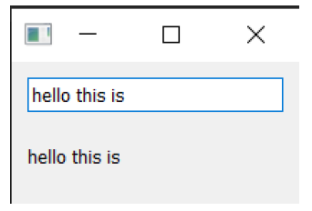

> 图七：任何输入进来的文本都会在标签上立即显示

大多数 Qt 控件都有可用的槽，您可以将任何发出与它接受的**类型相同**的信号连接到该槽。控件文档在“公共槽”下列出了每个控件的槽。例如，请参阅 [QLabel](https://doc.qt.io/qt-5/qlabel.html#public-slots)。

## 5. 控件

在 Qt 中，**控件**是指用户可以与之交互的用户界面（UI）组件。用户界面由多个控件组成，这些控件被排列在窗口内。Qt 提供了大量可用的控件，甚至允许您创建自己的自定义控件。

在本书的代码示例中，有一个名为 `basic/widgets_list.py` 的文件，您可以运行它来在窗口中显示一组控件。它使用了一些我们稍后会介绍的复杂技巧，所以，现在先不要担心代码的问题。

> 🚀**运行它吧！** 您将会看到一个包含多个交互式控件的窗口。

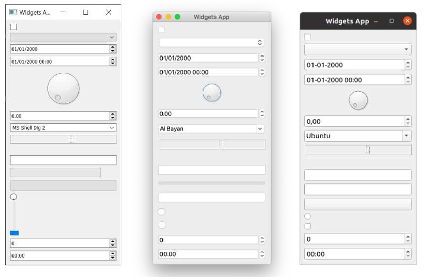

> 图八：在*Windows*，*macOS* 和 *Linux(Ubuntu)* 上面展示的控件应用程序的例子

示例中显示的控件如下所示，从上到下依次为：

| 控件             | 作用                     |
| ---------------- | ------------------------ |
| `QCheckbox`      | 复选框                   |
| `QComboBox`      | 下拉列表框               |
| `QDateEdit`      | 编辑日期                 |
| `QDateTimeEdit`  | 编辑日期和时间           |
| `QDial`          | 可旋转表盘               |
| `QDoubleSpinbox` | 浮点数微调框             |
| `QFontComboBox`  | 字体列表                 |
| `QLCDNumber`     | 相当难看的 LCD 显示屏    |
| `QLabel`         | 不能互动的标签           |
| `QLineEdit`      | 输入一行文本             |
| `QProgressBar`   | 进度条                   |
| `QPushButton`    | 按钮                     |
| `QRadioButton`   | 仅有一个有效选项的选项组 |
| `QSlider`        | 滑块                     |
| `QSpinBox`       | 整数微调框               |
| `QTimeEdit`      | 编辑时间                 |

还有更多控件，但它们并不太适合在这里全部展示！完整的列表请参阅 [Qt 文档](https://doc.qt.io/qt-5/qtwidgets-module.html)。下面我们将仔细看看一些最有用的控件。


> 请打开一个新的 `myapp.py` 文件并以新名称保存以完成本节内容。

### `QLabel`

我们将从 `QLabel `开始介绍，它可以说是 Qt 工具箱中最简单的控件之一。这是一个简单的单行文本，您可以将其放置在应用程序中。您可以在创建时通过传递字符串来设置文本——

```python
widget = QLabel("Hello")
```

或者，通过使用 `.setText()` 方法——

```python
widget = QLabel("1") # 创建的标签文本为 1
widget.setText("2")  # 标签现在显示 2
```

您还可以调整字体参数，例如控件中文本的大小或对齐方式。

*Listing 13. basic/widgets_1.py*

```python
import sys

from PyQt6.QtCore import Qt
from PyQt6.QtWidgets import QApplication, QLabel, QMainWindow


class MainWindow(QMainWindow):
    def __init__(self):
        super().__init__()
        
        self.setWindowTitle("My App")
        
        widget = QLabel("Hello")
        font = widget.font() #1
        font.setPointSize(30)
        widget.setFont(font)
        widget.setAlignment(
            Qt.AlignmentFlag.AlignHCenter
            | Qt.AlignmentFlag.AlignVCenter
        ) #2
        
        self.setCentralWidget(widget)
        
        
app = QApplication(sys.argv)

window = MainWindow()
window.show()

app.exec()
```

> 1. 我们使用 `<widget>.font()` 获取当前字体，对其进行修改，然后将其应用回去。这样可以确保字体与系统字体样式保持一致。
> 2. 对齐方式通过 `Qt.`命名空间中的标志来指定。

> 🚀 **运行它吧！** 调整字体参数并查看效果。

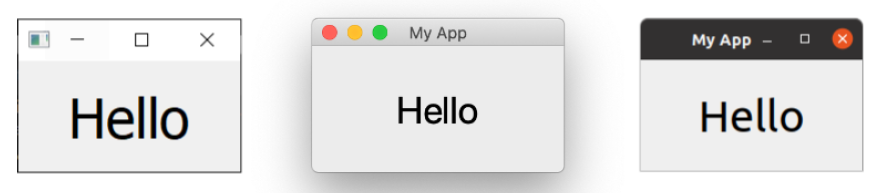

> 图九：在 *Windows*，*macOS* 和 *Linux(Ubuntu)* 上面的 `QLabel`


Qt 命名空间 (`Qt.`) 中包含各种属性，您可以使用这些属性来定制和控制 Qt 控件。我们将在后面的 “35. 枚举和 Qt 命名空间” 中详细介绍这一点。

用于水平对齐的标志包括——

| 标志                            | 行为                       |
| ------------------------------- | -------------------------- |
| `Qt.AlignmentFlag.AlignLeft`    | 与左边缘对齐               |
| `Qt.AlignmentFlag.AlignRight`   | 与右边缘对齐               |
| `Qt.AlignmentFlag.AlignHCenter` | 在可用空间内水平居中       |
| `Qt.AlignmentFlag.AlignJustify` | 在可用空间内对文字进行调整 |

用于垂直对齐的标志包括——

| 标志                            | 行为                 |
| ------------------------------- | -------------------- |
| `Qt.AlignmentFlag.AlignTop`     | 与顶部对齐           |
| `Qt.AlignmentFlag.AlignBottom`  | 与底部对齐           |
| `Qt.AlignmentFlag.AlignVCenter` | 在可用空间中垂直居中 |

您可以使用管道符（`|`）将多个标志组合在一起，但请注意，每次只能使用一个垂直或水平对齐标志。

```python
align_top_left = Qt.AlignmentFlag.AlignLeft | Qt.AlignmentFlag.AlignTop
```

> 🚀 **运行它吧！** 尝试组合不同的对齐标志并观察其对文本位置的影响。


> **Qt 标志**

> 请注意，您使用了或运算符 (`|`) 按照惯例将两个标志组合在一起。这些标志是非重叠的位掩码。例如，`Qt.AlignmentFlag.AlignLeft` 的二进制值为 `0b0001`，而`Qt.AlignmentFlag.AlignBottom` 的二进制值为 `0b0100`。通过按位或运算，我们得到值 `0b0101`，表示“底部左侧”。

> 我们将在后续的 “35. 枚举与 Qt 命名空间” 章节中对 Qt 命名空间和 Qt 标志进行更详细的探讨。

最后，还有一个简写标志，它同时在两个方向上居中——

| 标志                           | 行为               |
| ------------------------------ | ------------------ |
| `Qt.AlignmentFlag.AlignCenter` | 水平**和**垂直居中 |

有趣的是，您也可以使用 `QLabel` 通过 `.setPixmap()` 方法显示一张图片。该方法接受一个像素图（像素数组），您可以通过将图片文件名传递给 `QPixmap` 来创建它。在随本书提供的示例文件中，您可以找到一个名为 `otje.jpg` 的文件，您可以按照以下方式在窗口中显示它：

*Listing 14. basic/widgets_2a.py*

```python
import sys

from PyQt6.QtGui import QPixmap
from PyQt6.QtWidgets import QApplication, QLabel, QMainWindow

class MainWindow(QMainWindow):
    def __init__(self):
        super().__init__()
        
        self.setWindowTitle("My App")
        
        widget = QLabel("Hello")
        widget.setPixmap(QPixmap("otje.jpg"))
        
        self.setCentralWidget(widget)
        
        
app = QApplication(sys.argv)

window = MainWindow()
window.show()

app.exec()
```

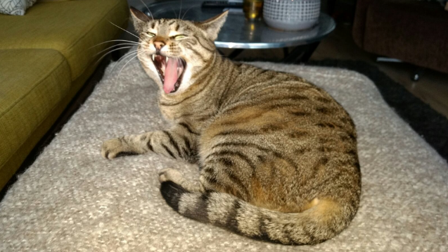

> 图十：叫做“Otje”的猫，太可爱啦

> 🚀 **运行它吧！** 调整窗口大小后，图像会被空白区域包围。


> 没看见图片？继续往下读读看！

在上面的示例中，我们仅使用文件名 `otje.jpg` 来指定要加载的文件。这意味着当应用程序运行时，文件将从当前文件夹中加载。然而，当前文件夹并不一定是脚本所在的文件夹——您可以从任何位置运行脚本。

如果你切换到上级目录（使用 `cd ..`）并再次运行脚本，文件将无法被找到，图像也无法加载。我的老天啊！

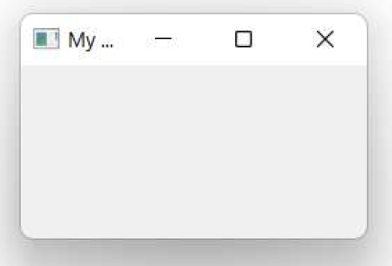

> 图十一：猫 Otje 不见了


> 这也是在从IDE运行脚本时常见的问题，因为IDE会根据当前激活的项目来设置路径。

要解决这个问题，我们可以获取当前脚本文件的路径，并利用该路径确定脚本所在的文件夹。我们的图像文件存储在同一文件夹中（或相对于此位置的某个文件夹中），这样也能确定该文件的位置。

文件内置变量 `file` 为我们提供了当前文件的路径。`os.dirname()` 函数从该路径中获取文件夹（或**目录**名称），然后我们使用 `os.path.join` 函数来构建文件的新路径。

*Listing 15. basic/widgets_2b.py*

```python
import os
import sys

from PyQt6.QtGui import QPixmap
from PyQt6.QtWidgets import QApplication, QLabel, QMainWindow

basedir = os.path.dirname(__file__)
print("Current working folder:", os.getcwd()) #1
print("Paths are relative to:", basedir) #2


class MainWindow(QMainWindow):
    def __init__(self):
        super().__init__()
        
        self.setWindowTitle("My App")
        
        widget = QLabel("Hello")
        widget.setPixmap(QPixmap(os.path.join(basedir, "otje.jpg")))
        
        self.setCentralWidget(widget)
        
        
app = QApplication(sys.argv)

window = MainWindow()
window.show()

app.exec()
```

> 1. 当前工作目录。
> 2. 我们的基础路径（相对于此文件）。


> 如果您现在还不完全理解，请不要担心，我们将在后面详细说明。

如果您现在运行这个脚本，图像将如预期显示——无论您从哪里运行脚本。脚本还会输出路径（以及当前工作目录），以帮助调试问题。在从应用程序加载任何外部文件时，请务必记住这一点。有关数据文件路径处理的更详细信息，请参阅 "33. 使用相对路径"。

默认情况下，图像在缩放时会保持其宽高比。如果您希望它拉伸并缩放以完全填充窗口，您可以在 `QLabel`中设置 `.setScaledContents(True)` 方法。

请修改代码，在标签中添加 `.setScaledContents(True)` ——

*Listing 16. basic/widgets_2b.py*

```python
widget.setPixmap(QPixmap(os.path.join(basedir, "otje.jpg")))
widget.setScaledContents(True)
```

> 🚀 **运行它吧！** 调整窗口大小，图片就会变形来自动适应大小。

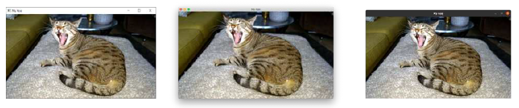

> 图十二：在 *Windows*，*macOS* 和 *Linux(Ubuntu)* 上面使用 `Qlabel`展示的像素图

### `QCheckBox`

下一个要介绍的控件是 `QCheckBox`，顾名思义，它为用户提供了一个可选框。然而，与所有 Qt 控件一样，它也有许多可配置的选项来更改控件的行为。

*Listing 17. basic/widgets_3.py*

```python
import sys

from PyQt6.QtCore import Qt
from PyQt6.QtWidgets import QApplication, QCheckBox, QMainWindow


class MainWindow(QMainWindow):
    def __init__(self):
        super().__init__()
        
        self.setWindowTitle("My App")
        
        widget = QCheckBox("This is a checkbox")
        widget.setCheckState(Qt.CheckState.Checked)
        
        # 对于三态：widget.setCheckState(Qt.PartiallyChecked)
        # 或：widget.setTristate(True)
        widget.stateChanged.connect(self.show_state)
        
        self.setCentralWidget(widget)
        
    def show_state(self, s):
        print(Qt.CheckState(s) == Qt.CheckState.Checked)
        print(s)
        
        
app = QApplication(sys.argv)

window = MainWindow()
window.show()

app.exec()
```

> 🚀 **运行它吧！** 您将会看到一个有标签文本的复选框

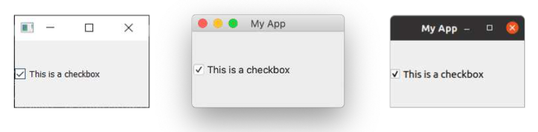

> 图十三：在 *Windows*，*macOS* 和 *Linux(Ubuntu)* 上面的`QCheckBox`

您可以使用 `.setChecked` 或 `.setCheckState` 通过编程方式设置复选框状态。前者接受 `True` 或 `False`，分别代表已选中或未选中。但是，使用 `.setCheckState` 时，您还可以使用 `Qt.`命名空间标志指定部分选中状态。

| 标志                             | 行为         |
| -------------------------------- | ------------ |
| `Qt.CheckState.Checked`          | 该项已选中   |
| `Qt.CheckState.Unchecked`        | 该项未选中   |
| `Qt.CheckState.PartiallyChecked` | 该项部分选中 |

支持部分选中状态（`Qt.CheckState.PartiallyChecked`）的复选框通常被称为“三态复选框”，即既非选中也非未选中。处于此状态的复选框通常显示为灰色复选框，并常用于分层复选框布局中，其中子项与父级复选框相关联。

如果您将值设置为 `Qt.CheckState.PartiallyChecked`，复选框将变为**三态**——即具有三种可能的状态。您还可以通过使用 `.setTristate(True)`来达到相同的效果


> 您可能会注意到，当脚本运行时，当前状态的编号以整数形式显示，其中已选中 = 2，未选中 = 0，部分选中 = 1。您无需记住这些值——它们只是这些相应标志的内部值。您可以通过 `state == Qt.CheckState.Checked` 来测试状态。

### `QComboBox`

`QComboBox` 是一个下拉列表，默认情况下处于关闭状态，需要点击箭头才能打开。您可以从列表中选择一个项目，当前选中的项目将作为标签显示在控件上。组合框适用于从长列表中选择一个选项。


> 您可能在文字处理应用程序中见过用于选择字体样式或字号的组合框。尽管 Qt实际上提供了一个专门用于字体选择的组合框，即 `QFontComboBox`。

您可以通过向 `.addItems() `方法传递一个字符串列表来向 QComboBox 添加项。项将按您提供的顺序依次添加。

*Listing 18. basic/widgets_4.py*

```python
import sys

from PyQt6.QtCore import Qt
from PyQt6.QtWidgets import QApplication, QComboBox, QMainWindow

class MainWindow(QMainWindow):
    def __init__(self):
        super().__init__()
        
        self.setWindowTitle("My App")
        
        widget = QComboBox()
        widget.addItems(["One", "Two", "Three"])
        
        widget.currentIndexChanged.connect(self.index_changed)
        widget.currentTextChanged.connect(self.text_changed)
        
        self.setCentralWidget(widget)
        
    def index_changed(self, i): # i是一个int型整数
        print(i)
        
    def text_changed(self, s): # s是一个str型的字符串
        print(s)
        

app = QApplication(sys.argv)

window = MainWindow()
window.show()

app.exec()
```

> 🚀 **运行它吧！** 您将看到一个包含3个选项的下拉列表框。选择其中一项后，该选项将显示在输入框中。

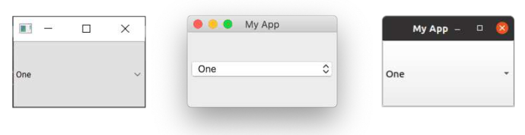

> 图十四：在 *Windows*，*macOS* 和 *Linux(Ubuntu)* 上面的`QComboBox`

当当前选中的项目被更新时，会触发 `.currentIndexChanged` 信号，默认情况下会传递列表中选中项目的索引。还有一个 `.currentTextChanged` 信号，它提供当前选中项目的标签，这个通常会更加实用。

`QComboBox` 也可以设置为可编辑模式，允许用户输入列表中不存在的值，并可选择将这些值插入列表或直接作为选中项使用。要启用可编辑模式，请加入这行代码：

```python
widget.setEditable(True)
```

您还可以设置标志来确定插入操作的处理方式。这些标志存储在 `QComboBox` 类本身中，具体列表如下：

| 标志                                          | 行为               |
| --------------------------------------------- | ------------------ |
| `QComboBox.InsertPolicy.NoInsert`             | 不允许插入         |
| `QComboBox.InsertPolicy.InsertAtTop`          | 插入为第一个项     |
| `QComboBox.InsertPolicy.InsertAtCurrent`      | 替换当前选中的项   |
| `QComboBox.InsertPolicy.InsertAtBottom`       | 在最后一项之后插入 |
| `QComboBox.InsertPolicy.InsertAfterCurrent`   | 在当前项之后插入   |
| `QComboBox.InsertPolicy.InsertBeforeCurrent`  | 在当前项之前插入   |
| `QComboBox.InsertPolicy.InsertAlphabetically` | 按字母顺序插入     |

要使用这些选项，请按以下方式应用标志：

```python
widget.setInsertPolicy(QComboBox.InsertPolicy.InsertAlphabetically)
```

您还可以通过调用 `.setMaxCount` 方法来限制盒子中允许的项目数量,例如：

```python
widget.setMaxCount(10)
```

### `QListWidget`

接下来是 `QListWidget`。该控件与 `QComboBox` 类似，只是选项以可滚动列表的形式呈现。它还支持同时选择多个项目。`QListWidget` 提供了一个 `currentItemChanged` 信号，该信号发送 `QListItem`（列表控件的元素），以及一个 `currentTextChanged` 信号，该信号发送当前项目的文本。

*Listing 19. basic/widgets_5.py*

```python
import sys

from PyQt6.QtWidgets import QApplication, QListWidget, QMainWindow

class MainWindow(QMainWindow):
    def __init__(self):
        super().__init__()
        
        self.setWindowTitle("My App")
        
        widget = QListWidget()
        widget.addItems(["One", "Two", "Three"])
        
        widget.currentItemChanged.connect(self.index_changed)
        widget.currentTextChanged.connect(self.text_changed)
        
        self.setCentralWidget(widget)
        
    def index_changed(self, i): #不是索引，i 是 QListItem
        print(i.text())
        
    def text_changed(self, s): # s是一个str型的字符串
        print(s)
        
        
app = QApplication(sys.argv)

window = MainWindow()
window.show()

app.exec()
```

> 🚀 **运行它吧！** 您将看到相同的三个项，现在以列表形式显示。选中的项（如果有的话）将被高亮显示。

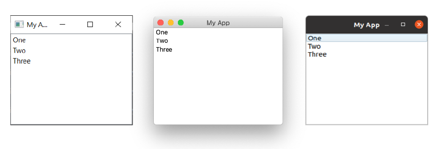

> 图十五：在 *Windows*，*macOS* 和 *Linux(Ubuntu)* 上面的`QListWidget`

### `QLineEdit`

`QLineEdit` 控件是一个简单的单行文本编辑框，用户可以在其中输入内容。这些控件用于表单字段或没有限制有效输入列表的设置。例如，输入电子邮件地址或计算机名称时。

*Listing 20. basic/widgets_6.py*

```python
import sys

from PyQt6.QtCore import Qt
from PyQt6.QtWidgets import QApplication, QLineEdit, QMainWindow

class MainWindow(QMainWindow):
    def __init__(self):
        super().__init__()
        
        self.setWindowTitle("My App")
        
        widget = QLineEdit()
        widget.setMaxLength(10)
        widget.setPlaceholderText("Enter your text")
        
        # widget.setReadOnly(True) # 取消注释该行以设置为只读模式
        
        widget.returnPressed.connect(self.return_pressed)
        widget.selectionChanged.connect(self.selection_changed)
        widget.textChanged.connect(self.text_changed)
        widget.textEdited.connect(self.text_edited)
        
        self.setCentralWidget(widget)
        
    def return_pressed(self):
        print("Return pressed!")
        self.centralWidget().setText("BOOM!")
        
    def selection_changed(self):
        print("Selection changed")
        print(self.centralWidget().selectedText())
        
    def text_changed(self, s):
        print("Text changed...")
        print(s)
        
    def text_edited(self, s):
        print("Text edited...")
        print(s)
        
        
app = QApplication(sys.argv)

window = MainWindow()
window.show()

app.exec()
```

> 🚀 **运行它吧！** 您将看到一个带有提示的简单文本输入框。

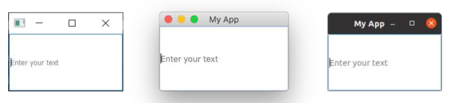

> 图十六：在 *Windows*，*macOS* 和 *Linux(Ubuntu)* 上面的`QLineEdit`

如以上代码所示，您可以通过使用 `.setMaxLength` 方法为文本字段设置最大长度。占位符文本（即在用户输入内容前显示的文本）可通过 `.setPlaceholderText` 方法添加。

`QLineEdit` 为不同的编辑事件提供了一系列信号，包括（用户）按下回车键时、用户选择发生更改时。另外还有两个编辑信号，一个用于框中的文本被编辑的时候，另一个用于文本被更改的时候。这里的区别在于用户编辑和程序更改。只有当用户编辑文本时，才会发送 `textEdited` 信号。

此外，还可以使用输入掩码进行输入验证，以定义支持哪些字符以及在何处支持。这可以应用于字段如下：

```python
widget.setInputMask('000.000.000.000;_')
```

上述规则允许使用以句点分隔的3位数字序列，因此可用于验证IPv4地址。

### `QSpinBox` 和 `QDoubleSpinBox`

`QSpinBox` 提供了一个带箭头的小数字输入框，用于增加和减少值。`QSpinBox` 支持整数，而相关的控件`QDoubleSpinBox` 支持浮点数。


> 双精度(`double`)或双精度浮点数(double float)是 C++ 类型，相当于Python 自己的浮点数(`float`)类型，因此该控件以此命名。

*Listing 21. basic/widgets_7.py*

```python
import sys

from PyQt6.QtWidgets import QApplication, QMainWindow, QSpinBox

class MainWindow(QMainWindow):
    def __init__(self):
        super().__init__()
        
        self.setWindowTitle("My App")
        
        widget = QSpinBox()
        # 或者: widget = QDoubleSpinBox()
        
        widget.setMinimum(-10)
        widget.setMaximum(3)
        # 或者: widget.setRange(-10,3)
        
        widget.setPrefix("$")
        widget.setSuffix("c")
        widget.setSingleStep(3) # 或者，对于QDoubleSpinBox，使用0.5
        widget.valueChanged.connect(self.value_changed)
        widget.textChanged.connect(self.value_changed_str)
        
        self.setCentralWidget(widget)
        
    def value_changed(self, i):
        print(i)
        
    def value_changed_str(self, s):
        print(s)
        
        
app = QApplication(sys.argv)

window = MainWindow()
window.show()

app.exec()
```

> 🚀**运行它吧！** 您将看到一个数字输入框。该值显示前缀和后缀单位，且范围限定在+3到-10之间。

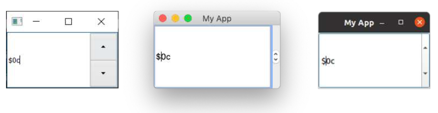

> 图十七：在 *Windows*，*macOS* 和 *Linux(Ubuntu)* 上面的`QSpinBox`

上面的演示代码展示了该控件可用的各种功能。

要设置可接受值的范围，您可以使用 `setMinimum` 和 `setMaximum`，或者使用 `setRange` 同时设置两者。值类型的标注支持在数字前添加前缀或在数字后添加后缀，例如使用 `.setPrefix` 和 `.setSuffix` 分别设置货币标记或单位。

点击控件上的向上和向下箭头可增加或减少控件中的值，该值可使用 `.setSingleStep` 进行设置。请注意，这不会对控件可接受的值产生任何影响。

`QSpinBox` 和 `QDoubleSpinBox` 都具有 `.valueChanged` 信号，该信号在其值发生改变时触发。`.valueChanged` 信号发送数字值（整数或浮点数），而单独的 `.textChanged` 信号则将值作为字符串发送，包括前缀和后缀字符。

### `QSlider`

`QSlider` 提供了一个滑动条控件，其内部功能与 `QDoubleSpinBox` 非常相似。它不会以数字形式显示当前值，而是通过滑块在控件长度上的位置来表示。当需要在两个极端值之间进行调整，但不需要绝对精确度时，此控件非常有用。此类控件最常见的用途是音量控制。

还有一个额外的每当滑块移动位置时触发的 `.sliderMoved` 信号，以及一个每当滑块被点击时发出的 `.sliderPressed` 信号。

*Listing 22. basic/widgets_8.py*

```python
import sys

from PyQt6.QtCore import Qt
from PyQt6.QtWidgets import QApplication, QMainWindow, QSlider


class MainWindow(QMainWindow):
    def __init__(self):
        super().__init__()
        
        self.setWindowTitle("My App")
        
        widget = QSlider()
        
        widget.setMinimum(-10)
        widget.setMaximum(3)
        # 或者: widget.setRange(-10,3)
        
        widget.setSingleStep(3)
        widget.valueChanged.connect(self.value_changed)
        widget.sliderMoved.connect(self.slider_position)
        widget.sliderPressed.connect(self.slider_pressed)
        widget.sliderReleased.connect(self.slider_released)
        
        self.setCentralWidget(widget)
        
    def value_changed(self, i):
        print(i)
    
    def slider_position(self, p):
        print("position", p)
        
    def slider_pressed(self):
        print("Pressed!")
        
    def slider_released(self):
        print("Released")
        
        
app = QApplication(sys.argv)

window = MainWindow()
window.show()

app.exec()
```

> 🚀 **运行它吧！** 您将看到一个滑块控件。拖动滑块即可更改数值。

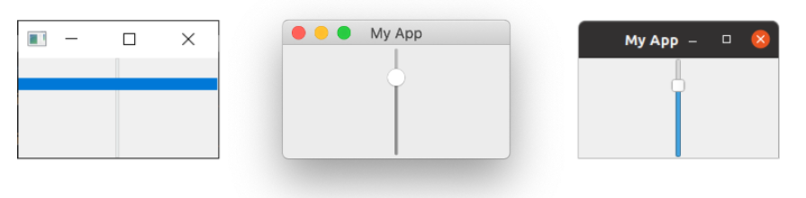

> 图十八：在 *Windows*，*macOS* 和 *Linux(Ubuntu)* 上面的`QSlider`。在 *Windows*  中手柄会扩展到控件的大小。

您还可以通过在创建时传递方向来构建垂直或水平方向的滑块。方向标志在 Qt.命名空间中定义。例如——

```python
widget.QSlider(Qt.Orientiation.Vertical)
```

或者——

```python
widget.QSlider(Qt.Orientiation.Horizontal)
```

### `QDial`

最后，`QDial` 是一个可旋转的控件，功能与滑块相同，但外观为模拟拨盘。它看起来很不错，但从 UI 角度来看并不特别用户友好。然而，它们通常在音频应用程序中用作现实世界中的模拟拨盘的表示。

*Listing 23. basic/widgets_9.py*

```python
import sys

from PyQt6.QtCore import Qt
from PyQt6.QtWidgets import QApplication, QDial, QMainWindow


class MainWindow(QMainWindow):
    def __init__(self):
        super().__init__()
        
        self.setWindowTitle("My App")
        
        widget = QDial()
        widget.setRange(-10, 100)
        widget.setSingleStep(1)
        
        widget.valueChanged.connect(self.value_changed)
        widget.sliderMoved.connect(self.slider_position)
        widget.sliderPressed.connect(self.slider_pressed)
        widget.sliderReleased.connect(self.slider_released)
        
        self.setCentralWidget(widget)
        
    def value_changed(self, i):
        print(i)
        
    def slider_position(self, p):
        print("position", p)
        
    def slider_pressed(self):
        print("Pressed!")
        
    def slider_released(self):
        print("Released")
        
        
app = QApplication(sys.argv)

window = MainWindow()
window.show()

app.exec()
```

> 🚀 **运行它吧！** 您会看到一个旋钮，请旋转它以从范围内选择一个数字。

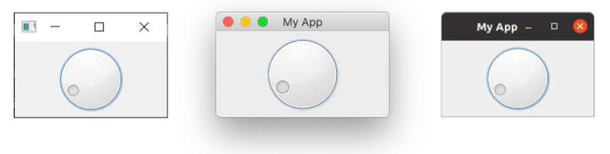

> 图十九：在 *Windows*，*macOS* 和 *Linux(Ubuntu)* 上面的`QDial`

这些信号与 `QSlider` 的信号相同，并保留了相同的名称（例如 `.sliderMoved`）。

以上就是对 PyQt6 中可用的 Qt 控件的简要介绍。要查看可用的控件的完整列表，包括所有信号和属性，请参阅 [Qt 文档](http://doc.qt.io/qt-5/)。

### `QWidget`

我们的演示中有一个 QWidget，但您看不到它。我们之前在第一个示例中使用 `QWidge`t 创建了一个空窗口。但 `QWidget` 还可以与 [布局](#6.-布局) 一起用作其他控件的容器，以构建窗口或复合控件。我们将在后面更详细地介绍创建自定义控件(22. 自定义控件)。

请记住 `QWidget`，因为您将会频繁地使用它！

## 6. 布局

到目前为止，我们已经成功创建了一个窗口，并向其中添加了一个控件。但是，通常情况下，您会希望在窗口中添加多个控件，并对添加的控件的位置进行一些控制。在 Qt 中，我们使用布局来排列控件。Qt 中提供了 4 种基本布局，如下表所示。

| 布局             | 行为                |
| ---------------- | ------------------- |
| `QHBoxLayout`    | 线性水平布局        |
| `QVBoxLayout`    | 线性垂直布局        |
| `QGridLayout`    | 在可索引网格XxY中   |
| `QStackedLayout` | 堆叠（z）在彼此之前 |

Qt 中提供了三种二维布局： `QVBoxLayout`、`QHBoxLayout` 和 `QGridLayout`。此外，还有 `QStackedLayout`，它允许您在同一空间内将控件一个叠放在另一个之上，但每次只显示一个控件。

在本章中，我们将依次介绍这些布局，并展示如何使用它们来定位应用程序中的控件。


> *Qt Designer*
>
> 您实际上可以使用Qt Designer以图形方式设计和布局界面，我们将在后续内容中详细介绍。在此我们使用代码，因为这样更便于理解和实验底层系统。

### 占位符控件


> 请加载一份新的 myapp.py，并将它以新的名字保存下来以供本节使用。

为了更方便地可视化布局，我们将首先创建一个简单的自定义控件来显示我们选择的纯色。这有助于区分我们添加到布局中的控件。请您在与脚本相同的文件夹中创建一个新文件，并将其命名为` layout_colorwidget.py`，并添加以下代码。我们将在下一个示例中将此代码导入到我们的应用程序中。

*Listing 24. basic/layout_colorwidget.py*

```python
from PyQt6.QtGui import QColor, QPalette
from PyQt6.QtWidgets import QWidget

class Color(QWidget):
    def __init__(self, color):
        super().__init__()
        self.setAutoFillBackground(True)
        
        palette = self.palette()
        palette.setColor(QPalette.ColorRole.Window, QColor(color))
        self.setPalette(palette)
```

在此代码中，我们子类化 `QWidget` 以创建自己的自定义控件 `Color`。创建控件时，我们接受一个参数——颜色（一个字符串）。首先，我们将 `.setAutoFillBackground` 设置为 `True`，以指示控件自动用窗口颜色填充其背景。接下来，我们将控件的 `QPalette.Window` 颜色更改为我们提供的值 `color` 所描述的新 `QColor`。最后，我们将该调色板应用回控件。最终结果是一个填充了纯色的控件，该颜色是在创建控件时指定的。

如果您觉得以上内容有些难以理解，请不要担心！我们将在后面详细介绍如何创建自定义控件和调色板。目前，您只需了解以下代码即可创建一个实心填充的红色控件即可——

```python
Color('red')
```

首先，让我们使用新创建的“颜色”控件将整个窗口填充为单一颜色来测试这个控件。完成之后，我们可以使用 `.setCentralWidget` 将它添加到主窗口，这样就得到了一个纯红色的窗口。

*Listing 25. basic/layout_1.py*

```python
import sys

from PyQt6.QtCore import Qt
from PyQt6.QtWidgets import QApplication, QMainWindow

from layout_colorwidget import Color


class MainWindow(QMainWindow):
    def __init__(self):
        super().__init__()
        
        self.setWindowTitle("My App")
        
        widget = Color("red")
        self.setCentralWidget(widget)
        
        
app = QApplication(sys.argv)

window = MainWindow()
window.show()

app.exec()
```

> 🚀 **运行它吧！** 窗口将出现并被完全地填充为红色。请您注意控件如何扩展以填充所有的可用空间。

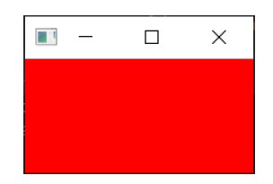

> 图二十：我们的 `Color`控件，填充为纯红色。

接下来，我们将依次查看所有可用的 Qt 布局。请注意，要将布局添加到窗口中，我们需要一个占位 `QWidget` 来容纳布局。

### `QVBoxLayout` 垂直排列控件

使用 `QVBoxLayout`，您可以将控件线性地排列在彼此之上。添加一个控件会将其添加到列的底部。

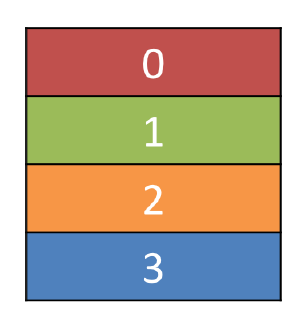

> 图二十一：一个按照从上往下顺序填充的 `QVBoxLayout`

将我们的控件添加到布局中。请注意，为了将布局添加到 `QMainWindow`，我们需要将其应用到占位的 `QWidget`。这样，我们就可以使用 `.setCentralWidget` 将控件（和布局）应用到窗口中。我们的彩色控件将在布局中排列，包含在窗口中的 `QWidge`  中。首先，我们像之前一样添加红色控件。

*Listing 26. basic/layout_2a.py*

```python
import sys

from PyQt6.QtCore import Qt
from PyQt6.QtWidgets import (
    QApplication,
    QMainWindow,
    QVBoxLayout,
    QWidget,
)

from layout_colorwidget import Color

class MainWindow(QMainWindow):
    def __init__(self):
        super().__init__()
        
        self.setWindowTitle("My App")
        
        layout = QVBoxLayout()
        
        layout.addWidget(Color("red"))
        
        widget = QWidget()
        widget.setLayout(layout)
        self.setCentralWidget(widget)
        
        
app = QApplication(sys.argv)

window = MainWindow()
window.show()

app.exec()
```

> 🚀 **运行它吧！** 请注意，现在红色控件周围显示了边框。这就是布局间距——我们稍后会介绍如何调整它。

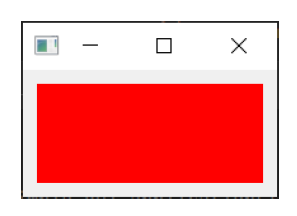

> 图二十二：我们在布局中的 `Color` 控件

接下来，在布局中添加一些彩色控件：

*Listing 27. basic/layout_2b.py*

```python
import sys

from PyQt6.QtCore import Qt
from PyQt6.QtWidgets import (
    QApplication,
    QMainWindow,
    QVBoxLayout,
    QWidget,
)

from layout_colorwidget import Color

class MainWindow(QMainWindow):
    def __init__(self):
        super().__init__()
        
        self.setWindowTitle("My App")
        
        layout = QVBoxLayout()
        
        layout.addWidget(Color("red"))
        layout.addWidget(Color("green"))
        layout.addWidget(Color("blue"))
        
        widget = QWidget()
        widget.setLayout(layout)
        self.setCentralWidget(widget)
        
        
app = QApplication(sys.argv)

window = MainWindow()
window.show()

app.exec()
```

当我们添加控件时，它们会按照添加的顺序垂直排列。

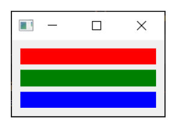

> 图二十三：三个 `Color` 控件在一个 `QVBoxLayout` 布局中垂直排列

### `QHBoxLayout` 水平排列控件

`QHBoxLayout` 与之相同，只是水平移动。添加控件会将其添加到右侧。

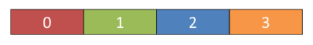

> 图二十四：一个从左往右填充的 `QHBoxLayout`

要使用它，我们可以简单地将 `QVBoxLayout` 改为 `QHBoxLayout`。现在，这些框会从左到右排列。

*Listing 28. basic/layout_3.py*

```python
import sys

from PyQt6.QtCore import Qt
from PyQt6.QtWidgets import (
    QApplication,
    QHBoxLayout,
    QLabel,
    QMainWindow,
    QWidget,
)

from layout_colorwidget import Color

class MainWindow(QMainWindow):
    def __init__(self):
        super().__init__()
        
        self.setWindowTitle("My App")
        
        layout = QVBoxLayout()
        
        layout.addWidget(Color("red"))
        layout.addWidget(Color("green"))
        layout.addWidget(Color("blue"))
        
        widget = QWidget()
        widget.setLayout(layout)
        self.setCentralWidget(widget)
        
        
app = QApplication(sys.argv)

window = MainWindow()
window.show()

app.exec()
```

> 🚀 **运行它吧！** 控件应水平排列

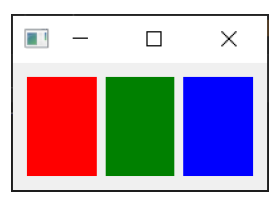

> 图二十五：三个 `Color` 控件在一个 `QVBoxLayout` 布局中水平排列

### 嵌套布局

对于更复杂的布局，您可以使用 `.addLayout` 在布局中嵌套布局。下面，我们将 `QVBoxLayout` 添加到主 `QHBoxLayout` 中。如果我们将一些控件添加到 `QVBoxLayout`，它们将垂直排列在父布局的第一个槽中。

*Listing 29. basic/layout_4.py*

```python
import sys

from PyQt6.QtCore import Qt
from PyQt6.QtWidgets import (
    QApplication,
    QHBoxLayout,
    QLabel,
    QMainWindow,
    QVBoxLayout,
    QWidget,
)

from layout_colorwidget import Color


class MainWindow(QMainWindow):
    def __init__(self):
        super().__init__()
        
        self.setWindowTitle("My App")
        
        layout1 = QHBoxLayout()
        layout2 = QVBoxLayout()
        layout3 = QVBoxLayout()
        
        layout2.addWidget(Color("red"))
        layout2.addWidget(Color("yellow"))
        layout2.addWidget(Color("purple"))
        
        layout1.addLayout(layout2)
        layout1.addWidget(Color("green"))
        
        layout3.addWidget(Color("red"))
        layout3.addWidget(Color("purple"))
        
        layout1.addLayout(layout3)
        
        widget = QWidget()
        widget.setLayout(layout1)
        self.setCentralWidget(widget)
        
        
app = QApplication(sys.argv)

window = MainWindow()
window.show()

app.exec()
```

> 🚀 **运行它吧！** 控件应水平排列成 3 列，第一列还应包含 3 个垂直堆叠的控件。请尝试一下吧！

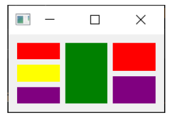

> 图二十六：嵌套的 `QHBoxLayout` 和 `QVBoxLayout` 布局。

您可以使用 `.setContentMargins` 设置布局周围的间距，或使用 `.setSpacing` 设置元素之间的间距。

```python
layout1.setContentsMargins(0,0,0,0)
layout1.setSpacing(20)
```

以下代码显示了嵌套控件与布局边距和间距的组合。

*Listing 30. basic/layout_5.py*

```python
import sys

from PyQt6.QtCore import Qt
from PyQt6.QtWidgets import (
    QApplication,
    QHBoxLayout,
    QLabel,
    QMainWindow,
    QVBoxLayout,
    QWidget,
)

from layout_colorwidget import Color

class MainWindow(QMainWindow):
    def __init__(self):
        super().__init__()
        
        self.setWindowTitle("My App")
        
        layout1 = QHBoxLayout()
        layout2 = QVBoxLayout()
        layout3 = QVBoxLayout()
        
        layout1.setContentsMargins(0,0,0,0)
        layout1.setSpacing(20)
        
        layout2.addWidget(Color("red"))
        layout2.addWidget(Color("yellow"))
        layout2.addWidget(Color("purple"))
        
        layout1.addLayout(layout2)
        layout1.addWidget(Color("green"))
        
        layout3.addWidget(Color("red"))
        layout3.addWidget(Color("purple"))
        
        layout1.addLayout(layout3)
        
        widget = QWidget()
        widget.setLayout(layout1)
        self.setCentralWidget(widget)
        
        
app = QApplication(sys.argv)

window = MainWindow()
window.show()

app.exec()
```

> 🚀 **运行它吧！** 您应该观察间距和边距的效果。请您尝试调整数值，直到您对它们有了一定的把握。

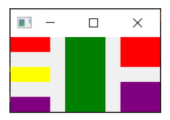

> 图二十七：嵌套的 `QHBoxLayout` 和 `QVBoxLayout` 布局，在控件周围留有间距和边距

### `QGridLayout` 控件以网格形式排列

尽管它们非常有用，但如果您尝试使用 `QVBoxLayout` 和 `QHBoxLayout` 来布局多个元素（例如表单），您会发现很难确保不同大小的控件对齐。解决此问题的办法是使用 `QGridLayout`。

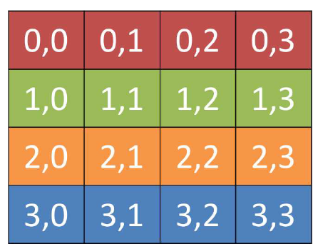

> 图二十八：一个用于显示每个位置的网格位置的 `QGridLayout` 

`QGridLayout` 允许您在网格中特定地放置项目。您可以为每个控件指定行和列位置。您可以跳过某些元素，它们将被留空。

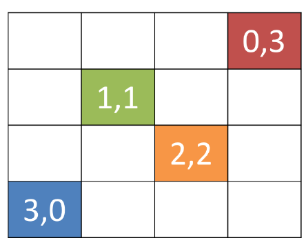

> 图二十九：有未填充槽的 `QGridLayout`

*Listing 31. basic/layout_6.py*

```python
import sys

from PyQt6.QtCore import Qt
from PyQt6.QtWidgets import (
    QApplication,
    QGridLayout,
    QLabel,
    QMainWindow,
    QWidget,
)

from layout_colorwidget import Color


class MainWindow(QMainWindow):
    def __init__(self):
        super().__init__()

        self.setWindowTitle("My App")

        layout = QGridLayout()

        layout.addWidget(Color("red"), 0, 0)
        layout.addWidget(Color("green"), 1, 0)
        layout.addWidget(Color("blue"), 1, 1)
        layout.addWidget(Color("purple"), 2, 1)

        widget = QWidget()
        widget.setLayout(layout)
        self.setCentralWidget(widget)
        
        
app = QApplication(sys.argv)

window = MainWindow()
window.show()

app.exec()
```

> 🚀 **运行它吧！** 您应该看到控件以网格形式排列，尽管缺少条目，但仍然对齐。

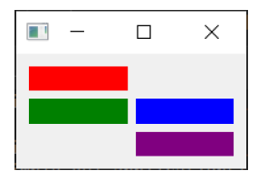

> 图三十：在一个 `QGridLayout` 的四个 `Color` 控件

### `QStackedLayout` 在同一空间中放置多个控件

我们将介绍的最后一种布局是 `QStackedLayout`。如上所述，这种布局允许您将元素直接放置在彼此前面。然后，您可以选择要显示的控件。您可以在图形应用程序中使用它来绘制图层，或模仿标签式界面。请注意，还有 `QStackedWidget`，这是一个完全以相同方式工作的容器控件。如果您希望直接将一个栈添加到 `QMainWindow` 中，可以使用 `.setCentralWidget` 方法。

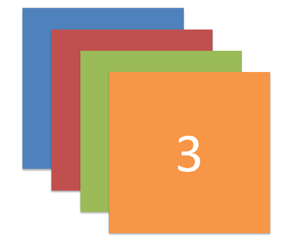

> 图三十一：`QStackedLayout` —— 使用时，只有最上面的控件可见，默认情况下，这是添加到布局中的第一个控件。


> 图三十二：`QStackedLayout`，可以选择第二个（图中标号为1）控件并将其置于最前面。

*Listing 32. basic/layout_7.py*

```python
import sys

from PyQt6.QtCore import Qt
from PyQt6.QtWidgets import (
    QApplication,
    QLabel,
    QMainWindow,
    QStackedLayout,
    QWidget,
)

from layout_colorwidget import Color


class MainWindow(QMainWindow):
    def __init__(self):
        super().__init__()
        
        self.setWindowTitle("My App")
        
        layout = QStackedLayout()
        
        layout.addWidget(Color("red"))
        layout.addWidget(Color("green"))
        layout.addWidget(Color("blue"))
        layout.addWidget(Color("yellow"))
        
        layout.setCurrentIndex(3)
        
        widget = QWidget()
        widget.setLayout(layout)
        self.setCentralWidget(widget)
        
        
app = QApplication(sys.argv)

window = MainWindow()
window.show()

app.exec()
```

> 🚀 **运行它吧！** 您只会看到最后添加的控件。

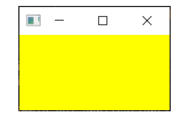

> 图三十三：堆栈控件，仅显示一个控件（最后添加的控件）。

`QStackedWidget` 是应用程序中标签视图的工作方式。任何时候只能看到一个视图（“标签”）。您可以随时使用 `.setCurrentIndex()` 或 `.setCurrentWidget()` 通过索引（按控件添加的顺序）或控件本身来设置项目，从而控制要显示的控件。

以下是一个简短的演示，使用 `QStackedLayout` 与`QButton` 结合，为应用程序提供一个类似标签页的界面——

*Listing 33. basic/layout_8.py*

```python
import sys

from PyQt6.QtCore import Qt
from PyQt6.QtWidgets import (
    QApplication,
    QHBoxLayout,
    QLabel,
    QMainWindow,
    QPushButton,
    QStackedLayout,
    QVBoxLayout,
    QWidget,
)

from layout_colorwidget import Color


class MainWindow(QMainWindow):
    def __init__(self):
        super().__init__()

        self.setWindowTitle("My App")

        pagelayout = QVBoxLayout()
        button_layout = QHBoxLayout()
        self.stacklayout = QStackedLayout()

        pagelayout.addLayout(button_layout)
        pagelayout.addLayout(self.stacklayout)

        btn = QPushButton("red")
        btn.pressed.connect(self.activate_tab_1)
        button_layout.addWidget(btn)
        self.stacklayout.addWidget(Color("red"))

        btn = QPushButton("green")
        btn.pressed.connect(self.activate_tab_2)
        button_layout.addWidget(btn)
        self.stacklayout.addWidget(Color("green"))

        btn = QPushButton("yellow")
        btn.pressed.connect(self.activate_tab_3)
        button_layout.addWidget(btn)
        self.stacklayout.addWidget(Color("yellow"))

        widget = QWidget()
        widget.setLayout(pagelayout)
        self.setCentralWidget(widget)
        
    def activate_tab_1(self):
        self.stacklayout.setCurrentIndex(0)
        
    def activate_tab_2(self):
        self.stacklayout.setCurrentIndex(1)
        
    def activate_tab_3(self):
        self.stacklayout.setCurrentIndex(2)
        
        
app = QApplication(sys.argv)

window = MainWindow()
window.show()

app.exec()
```

> 🚀 **运行它吧！** 现在，您可以使用按钮更改可见控件。

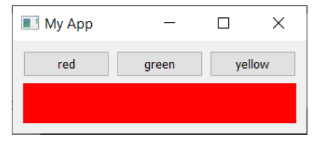

> 图三十四：一个堆栈控件，带有用于控制活动控件的按钮。

Qt 提供了一个内置的选项卡控件，可以提供这种布局，非常方便——尽管它实际上是一个控件，而不是一个布局。下面的选项卡演示是使用 `QTabWidget` 重新创建的——

*Listing 34. basic/layout_9.py*

```python
import sys

from PyQt6.QtCore import Qt
from PyQt6.QtWidgets import (
    QApplication,
    QLabel,
    QMainWindow,
    QPushButton,
    QTabWidget,
    QWidget,
)

from layout_colorwidget import Color


class MainWindow(QMainWindow):
    def __init__(self):
        super().__init__()

        self.setWindowTitle("My App")

        tabs = QTabWidget()
        tabs.setTabPosition(QTabWidget.TabPosition.West)
        tabs.setMovable(True)

        for n, color in enumerate(["red", "green", "blue", "yellow"]):
            tabs.addTab(Color(color), color)
            
        self.setCentralWidget(tabs)
        
        
app = QApplication(sys.argv)

window = MainWindow()
window.show()

app.exec()
```

如您所见，这种方式更加直观——也更具吸引力！您可以通过设置方向来调整标签的位置，并通过 `.setMoveable` 方法切换标签是否可移动。

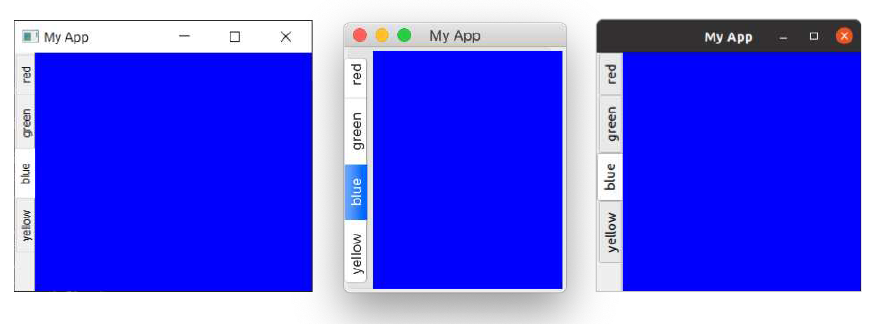

> 图三十五：包含我们控件的 QTabWidget，标签显示在左侧（西侧）。屏幕截图显示了在 *Windows*、*macOS* 和 *Ubuntu* 上的外观。

您会发现 macOS 标签栏与其他平台的标签栏外观差异显著——在macOS 系统中，标签默认采用药丸形或气泡形样式。在 macOS 系统中，此样式通常用于标签式配置面板。对于文档，您可以启用文档模式，以获得与其他平台类似的纤薄标签样式。此选项对其他平台无影响。

*Listing 35. basic/layout_9b.py*

```python
        tabs = QTabWidget()
        tabs.setDocumentMode(True)
```

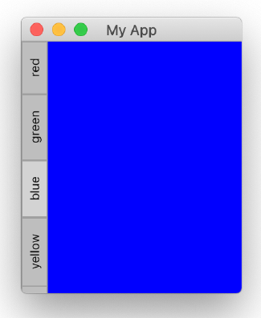

> 图三十六：在 macOS 上，`QTabWidget` 的文档模式设置为 `True`。

## 7. 操作、工具栏与菜单
