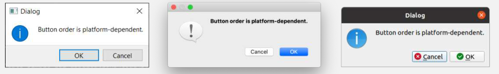

# PyQt6 基本功能

现在是时候迈出使用PyQt6创建图形用户界面的第一步了！

在本章中，您将学习PyQt6的基础知识，这些知识是您创建任何应用程序的基础。我们将开发一个简单的桌面窗口应用程序。我们将添加控件，使用布局进行排列并将这些控件与函数连接，使您能够通过图形用户界面触发应用程序的行为。

请以提供的代码为指导，但还请随时自己动手尝试。 这就是学习这些代码如何工作的最好方法。


> 在我们开始之前，您需要安装一个可以正常运行的 PyQt6。如果您还没有安装，请查看 附录A：安装 PyQt6。


> 不要忘记下载本书的源代码[http://www.pythonguis.com/d/pyqt6-source.zip](http://www.pythonguis.com/d/pyqt6-source.zip)!

## 3. 我的第一个应用程序

让我们来创建第一个应用程序！首先，创建一个新的 Python 文件——您可以随意将其命名为您喜欢的任何名字（例如：`myapp.py`），然后将它保存在一个可以访问的地方。 我们将在这个文件中编写我们的简单应用程序。


> 我们将在此文件中进行编辑，您可能想要回到代码的早期版本，所以记得定期备份。

### 创建您的应用程序

我们的第一个应用程序的源代码如下所示。 请您逐词键入，注意不要出错。 如果您弄错了，Python 会告诉您哪里出错了。 如果您不想全部手动键入，这个文件包含在这本书的源代码中.

*Listing 1. basic/creating_a_window_1.py*

```python
from PyQt6.QtWidgets import QApplication, QWidget
# 仅用于访问命令行参数
import sys

# 每个应用程序需要一个（且只有一个）QApplication 实例
# 输入 sys.argv，这可以允许应用程序使用命令行参数
# 如果知道不会使用命令行参数,也可以使用 QApplication([])
app = QApplication(sys.argv)

# 创建一个 Qt widget作为我们的窗口。
window = QWidget()
window.show() # 这很重要!!!!! 默认情况下，窗口是隐藏的。

# 开始事件循环
app.exec()

# 您的应用程序不会到达这里，直到您退出并且事件循环终止
```

首先，启动您的应用程序。 您可以像任何其他 Python 脚本一样从命令行运行它，例如

```bash
python MyApp.py
```

或者，对于 Python 3

```bash
python3 MyApp.py
```

从现在起，您将看到下面的提示框，提示您运行应用程序并提示您接下来将看到什么。

> 🚀 **运行它吧!** 现在您将看到您的窗口。 Qt 会自动创建一个窗口，您可以拖动它并调整其大小,就像您见过的其他窗口那样。

您看到的内容取决于运行这个示例的平台。下图展示了在 *Windows*、*macOS* 和 *Linux (Ubuntu）*上显示的窗口。


> 图三: 我们分别在*Windows*、*macOS* 和 *Linux (Ubuntu）*上显示的窗口

### 代码中的步骤

让我们逐行地查看代码，以便准确地理解到底发生了什么。

首先，我们导入应用程序所需的 PyQt6 类。 这里我们导入 `QApplication`（应用程序处理程序）和 `QWidget`（基本的空 GUI控件)，这两个类都来自 `QtWidgets` 模块。

```python
from PyQt6.QtWidgets import QApplication, QWidget
```

Qt 的主要模块包括 `QtWidgets`、`QtGui` 和 `QtCore`。


> 您可以使用 `from <module> import *`，但这种全局导入在 Python 中通常是不受欢迎的，所以在这里我们将避免使用它

接下来，我们创建一个`QApplication` 实例，传入 `sys.arg`，即包含传递给应用程序的命令行参数的 Python列表

```python
app = QApplication(sys.argv)
```

如果您不会使用命令行参数来控制 Qt，您可以传递一个空列表，例如

```python
app = QApplication([])
```

接下来，我们使用变量名 `window` 来创建一个 `QWidget` 实例。

```python
window = QWidget()
window.show()
```

在 Qt 中，*所有* 顶层部件都是窗口，也就是说，它们没有父控件，也不嵌套在另一个控件或布局中。这意味着您可以在技术上使用任何您喜欢的控件来创建一个窗口。


> 我看不到我的窗口!
> 没有父类的小工具默认是不可见的。 因此，在窗口对象后，我们必须始终调用 `.show()` 来使其可见。 您可以移除 .show() 并运行应用程序，但您会无法退出！


> 什么是窗口？
> - 保存应用程序的用户界面
> - 每个应用程序至少需要一个（......但也可以有更多）
> - 默认情况下，当最后一个窗口关闭时，应用程序将退出

最后，我们调用 `app.exec()` 来开始事件循环。

### 什么是事件循环?

在屏幕上显示窗口之前，有几个有关 Qt 世界中应用程序的组织方式的关键概念需要介绍一下.如果您已经熟悉事件循环，就可以放心地跳到下一节。

每个 Qt 应用程序的核心都是 `QApplication` 类。 每个应用程序需要一个，且只需要一个 `QApplication` 对象才可以运行。 该对象包含应用程序的**事件循环**——管理所有图形用户界面交互的核心循环。


> 图4:Qt中的事件循环

与应用程序的每次交互——无论是按键、点击鼠标还是移动鼠标——都会产生一个事件，该事件被置于**事件队列**中。在事件循环中，每次迭代都会对队列进行检查，如果发现正在等侯的事件，程序就会将事件和控制权传递给特定的事件处理程序。事件处理程序会处理事件，然后将控制权传递回事件循环，等待处理更多事件。 每个应用程序只能由**一个**事件循环


> 有关`QApplication` 类……
>
> - `QApplication` 包含 Qt 事件循环
> - 需要一个 `QApplication` 实例
> - 您的应用程序将在事件循环中等待，直到有操作执行
> - 任何时候都只有**一个**事件循环

### `QMainWindow`

正如我们在上一部分中所发现的，在 Qt 中任何控件都可以是窗口。 例如，如果您使用 `QPushButton` 代替 `QtWidget`。 在下面的示例中，您将得到一个有一个可按下的按钮的窗口。

*Listing 2. basic/creating_a_window_2.py*

```python
import sys
from PyQt6.QtWidgets import QApplication, QPushButton

app = QApplication(sys.argv)

window = QPushButton("Push Me")
window.show()

app.exec()
```

这太棒啦，但其实用处不大——您很少需要一个只有一个控件的用户界面！ 但是，正如我们接下来会发现的，使用布局将部件嵌套到其他部件中的功能着您可以在一个空的 `QWidget`中构建复杂的用户界面。

不过，Qt 已经为您提供了解决方案——`QMainWindow`。 这是一个预制的窗口部件，它提供了大量您可能会使用的标准窗口功能，包括工具栏、菜单、状态栏、可停靠控件等。

我们稍后会了解这些高级功能，但现在，我们将为我们的应用程序添加一个简单的空白`QMainWindow` 窗口。

*Listing 3. basic/creating_a_window_3.py*

```python
from PyQt6.QtWidgets import QApplication, QMainWindow
import sys

app = QApplication(sys.argv)

window = QMainWindow()
window.show() # 这很重要!!!!! 默认情况下，窗口是隐藏的

# 开始事件循环
app.exec()
```

> 🚀 **运行它吧！** 您会看到您的主窗口。它看上去和之前的那个完全一致！

目前我们的 `QMainWindow` 并不太有趣。我们可以添加一些内容来改善它。如果您想创建一个自定义窗口，最好的方法是继承 `QMainWindow`，然后在 `__init__` 块中包含窗口的设置。这使得窗口的行为可以自包含。我们可以添加我们自己的 `QMainWindow` 子类——为了简单起见，我们称它为 `MainWindow`。

*Listing 4. basic/creating_a_window_4.py*

```python
import sys
from PyQt6.QtCore import QSize, Qt
from PyQt6.QtWidgets import (
    QApplication,
    QMainWindow,
    QPushButton,
) #1

# 创建子类 QMainWindow 来自定义您的应用程序的主窗口
class MainWindow(QMainWindow):
    def __init__(self):
        super().__init__() #2
        
        self.setWindowTitle("My App")
        
        button = QPushButton("Press Me!")
        
        # 设置窗口的中心控件
        self.setCentralWidget(button) #3
        
        
app = QApplication(sys.argv)

window = MainWindow()
window.show()

app.exec()
```

> 1. 常用的 Qt 控件总是从 `QtWidgets` 命名空间导入。
> 2. 我们必须始终调用 `super()` 类的 `__init__`方法。
> 3. 使用 `.setCentralWidget` 在 `QMainWindow` 中放置一个控件。


> 当您子类化一个 Qt 类时，您必须始终调用`super`函数`__init__`以便 Qt 设置对象。

在我们的 `__init__` 块中，我们首先使用 `.setWindowTitle()` 来更改我们主窗口的标题。 然后，我们将第一个窗口控件——一个 `QPushButton` 添加到窗口中间。这是 Qt 中可用的基本部件之一。 在创建按钮时，您可以输入希望按钮显示的文本。

最后，我们在窗口上调用 `.setCentralWidget()`。 这是 `QMainWindow` 特有的函数，用于设置窗口中间的控件。

> 🚀 **运行它吧！** 您会再一次看到您的主窗口，但是这次`QPushButton`控件会显示在中央。按下按钮，但是什么也不会发生，我们将会稍后来调整


> 图五：显示在*Windows*，*macOS*和*Linux*上面的含有一个`QPushButton`的`QMainWindow`


> 渴望使用控件？
> 我们稍后会详细介绍更多控件，但如果您没有耐心，想先睹为快的话，可以看看[QWidget 文档](http://doc.qt.io/qt-5/widget-classes.html#basic-widget-classes)。 尝试将不同的控件添加到您的窗口！

### 调整窗口和控件的大小

当前窗口可自由调整大小——您只需用鼠标抓住窗口任何一个角，即可拖动并调整窗口大小至任意尺寸。虽然允许用户调整应用程序大小是件好事，但有时您可能需要对最小或最大尺寸设置限制，或将窗口锁定为固定大小。

在 Qt 中，尺寸通过 `QSize `对象进行定义。该对象依次接受宽度和高度参数。例如，以下代码将创建一个固定尺寸的 400x300 像素窗口。

*Listing 5. basic/creating_a_window_end.py*

```python
import sys

from PyQt6.QtCore import QSize, Qt
from PyQt6.QtWidgets import QApplication, QMainWindow, QPushButton

# 创建子类 QMainWindow 来自定义您的应用程序的主窗口
class MainWindow(QMainWindow):
    def __init__(self):
        super().__init__()
        
        self.setWindowTitle("My App")
        
        button = QPushButton("Press Me!")
        
        self.setFixedSize(QSize(400, 300)) #1
        
        # 设置窗口的中心控件
        self.setCentralWidget(button)
        
app = QApplication(sys.argv)

window = MainWindow()
window.show()

app.exec()
```

> 1. 设置窗口大小

> 🚀 **运行它吧！** 您会看到一个固定大小的窗口——试着去调整大小吧，这不会成功的


> 图六：我们的固定大小的窗口，注意最大化控件在*Windows* 和 *Linux* 上被禁用。 在 *macOS* 上，您可以将应用程序最大化以填满屏幕，但是
> 中央控件不会被调整大小。

除了可以调用 `.setFixedSize()` 方法外，您还可以调用 `.setMinimumSize()` 和`.setMaximumSize() `方法分别设置窗口的最小和最大尺寸。您不妨亲自尝试一下！


> 您可以用在任意控件中使用这种方法

在本节中，我们介绍了 `QApplication` 类、`QMainWindow` 类、事件循环，并尝试将一个简单的控件添加到窗口中。在下一节中，我们将了解 Qt 为控件和窗口之间以及控件和窗口与您自己的代码之间的通信提供的机制。


> 请将文件的副本保存为 `myapp.py`，我们稍后还会用到它。

## 4. 信号与槽

到目前为止，我们已经创建了一个窗口，并添加了一个简单的按钮控件，但该按钮没有任何功能。这完全没有用啊——当您创建图形用户界面应用程序时，通常一定希望它们能够执行某些操作！我们需要一种方法，将按下按钮的操作与执行某些操作联系起来。在Qt 中，信号和槽提供了这种功能。

信号是控件在发生某些事件时发出的通知。这些事件可以是按下按钮、输入框中文本的变化、窗口文本的变化等等任何事情。许多信号是由用户操作触发的，但这并不是一条死板的规则。

除了通知发生的事件外，信号还可以发送数据，并提供有关发生的事件的更多背景信息。


>  您还可以创建自己的自定义信号，我们将在之后的“32. 扩展信号”中进行探讨。

槽是 Qt 用于接收信号的名称。在 Python 中，应用程序中的任何函数（或方法）都可以用作槽——只需将信号连接到它即可。如果信号发送数据，则接收函数也会接收到该数据。许多 Qt 控件也有自己的内置槽，这意味着您可以直接将 Qt 控件连接在一起。

让我们来看看 Qt 信号的基本知识以及如何使用它们将控件连接起来以便在应用程序中实现各种功能。


> 请加载一份新的 `myapp.py` 文件用于本节内容并以新名称保存

### `QPushButton`的信号

我们简单的应用程序目前有一个 `QMainWindow`，其中 `QPushButton` 被设置为中央控件。首先，我们将这个按钮与一个自定义的 Python 方法连接起来。在这里，我们创建了一个名为 `the_button_was_clicked` 的简单自定义槽，它接受来自 `QPushButton` 的点击信号。

*Listing 6. basic/signals_and_slots_1.py*

```python
from PyQt6.QtWidgets import (
    QApplication,
    QMainWindow,
    QPushButton,
) #1

import sys

class MainWindow(QMainWindow):
    def __init__(self):
        super().__init__() #2
        
        self.setWindowTitle("My App")
        
        button = QPushButton("Press Me!")
        button.setCheckable(True)
        button.clicked.connect(self.the_button_was_clicked)
        
		# 设置窗口的中心控件
        self.setCentralWidget(button)
        
	def the_button_was_clicked(self):
        print("Clicked!")
        
        
app = QApplication(sys.argv)

window = MainWindow()
window.show()

app.exec()
```

> 🚀 **运行它吧！** 如果您点击这个按钮您将会在控制台中看到文本”Clicked!“

*控制台输出*

```text
Clicked!
Clicked!
Clicked!
Clicked!
```

### 接收数据

这真是一个很好的开始！我们已经知道信号还可以发送**数据**，以提供更多关于刚刚发生的事件的信息。`.clicked` 信号也不例外，它还提供了按钮的选中（或切换）状态。对于普通按钮，该状态始终为 `False`，因此我们的第一个槽忽略了这些数据。但是，我们可以让按钮**可选中**，然后看看效果。

在下面的示例中，我们将添加第二个槽用于输出**检查状态**。

*Listing 7. basic/signals_and_slots_1b.py*

```python
import sys

from PyQt6.QtWidgets import (
	QApplication,
	QMainWindow,
	QPushButton,
) #1

class MainWindow(QMainWindow):
    def __init__(self):
        super().__init__() #2
        
        self.setWindowTitle("My App")
        
        button = QPushButton("Press Me!")
        button.setCheckable(True)
        button.clicked.connect(self.the_button_was_clicked)
        button.clicked.connect(self.the_button_was_toggled)
        
        # 设置窗口的中心控件
        self.setCentralWidget(button)
        
    def the_button_was_clicked(self):
        print("Clicked!")
        
    def the_button_was_toggled(self, checked):
        print("Checked?", checked)
        
        
app = QApplication(sys.argv)

window = MainWindow()
window.show()

app.exec()
```

> 🚀 **运行它吧！** 如果您点击了这个按钮，您将会看到它在被点击之后高亮了。请再次点击它然后松开，并在控制台中检查状态

*控制台输出*

```text
Clicked!
Checked? True
Clicked!
Checked? False
Clicked!
Checked? True
Clicked!
Checked? False
Clicked!
Checked? True
```

您可以将任意数量的槽连接到一个信号，并可以在槽上同时响应不同版本的信号。

### 存储数据

通常，将控件的当前状态存储在 Python 变量中非常有用。这样就可以像处理其他 Python 变量一样处理这些值而无需访问原始控件。您可以将这些值存储为单独的变量，或者根据需要使用字典。在下一个示例中，我们将按钮的选中值存储在名为 `button_is_checked` 的变量中。

*Listing 8. basic/signals_and_slots_1c.py*

```python
class MainWindow(QMainWindow):
    def __init__(self):
        super().__init__()
        
        self.button_is_checked = True #1
        
        self.setWindowTitle("My App")
        
        button = QPushButton("Press Me!")
        button.setCheckable(True)
        button.clicked.connect(self.the_button_was_toggled)
        button.setChecked(self.button_is_checked) #2
        
        # 设置窗口的中心控件
        self.setCentralWidget(button)
        
    def the_button_was_toggled(self, checked):
        self.button_is_checked = checked #3
        
        print(self.button_is_checked)
```

> 1. 为变量设置默认值。
> 2. 使用默认值设置控件的初始状态。
> 3. 当控件状态发生变化时，更新变量以匹配。

您可以对任何 PyQt6 控件使用相同的模式。如果控件未提供发送当前状态的信号，则您需要在处理程序中直接从控件检索该值。例如，这里我们正在检查按下处理程序中的**选中**状态。

*Listing 9. basic/signals_and_slots_1d.py*

```python
class MainWindow(QMainWindow):
    def __init__(self):
        super().__init__()
        
        self.button_is_checked = True
        
        self.setWindowTitle("My App")
        
        self.button = QPushButton("Press Me!") #1
        self.button.setCheckable(True)
        self.button.released.connect(
            self.the_button_was_released
        ) #2
        self.button.setChecked(self.button_is_checked)
        
        # 设置窗口的中心控件
        self.setCentralWidget(self.button)
        
    def the_button_was_released(self):
        self.button_is_checked = self.button.isChecked() #3
        
        print(self.button_is_checked)
```

> 1. 我们需要保留对按钮的引用，以便在我们的槽中访问它。
> 2. 释放信号在按钮释放时触发，但不会发送检查状态。
> 3.  `.isChecked()` 返回按钮的检查状态。

### 更改界面

到目前为止，我们已经了解了如何接受信号并将输出打印到控制台。但是，当我们点击按钮时，如何在界面中触发某些操作呢？让我们更新槽方法来修改按钮，更改文本并禁用按钮，使其不再可点击。我们还将暂时删除可选状态。

*Listing 10. basic/signals_and_slots_2.py*

```python
from PyQt6.QtWidgets import QApplication, QMainWindow, QPushButton

import sys

class MainWindow(QMainWindow):
    def __init__(self):
        super().__init__()
        
        self.setWindowTitle("My App")
        
        self.button = QPushButton("Press Me!") #1
        self.button.clicked.connect(self.the_button_was_clicked)
        
        # 设置窗口的中心控件
        self.setCentralWidget(self.button)
        
    def the_button_was_clicked(self):
        self.button.setText("You already clicked me.") #2
        self.button.setEnabled(False) #3
        
        # 我们也来更改窗口标题
        self.setWindowTitle("My Oneshot App")
        
        
app = QApplication(sys.argv)

window = MainWindow()
window.show()

app.exec()
```

> 1. 我们需要在 `the_button_was_clicked` 方法中访问该按钮，因此我们将其引用保存在 `self` 中。
> 2. 您可以通过向 `.setText()` 方法传递一个字符串来更改按钮的文本。
> 3. 要禁用按钮，请调用 `.setEnabled()` 方法并传入 False。

> 🚀 **运行它吧！** 如果您单击按钮，文本将发生变化并且按钮将将变得不可点击。

您并不局限于更改触发信号的按钮，您可以在槽方法中做任何您想做的事情。例如，尝试将以下行添加到 `_button_was_clicked` 方法中，以同时更改窗口标题。

```python
self.setWindowTitle("A new window title")
```

大多数控件都有自己的信号，我们用于窗口的 `QMainWindow` 也不例外。

在下面的更复杂的示例中，我们将 `QMainWindow` 上的 `.windowTitleChanged` 信号连接到自定义槽方法 `the_window_title_changed`。该槽还会接收新窗口标题。

*Listing 11. basic/signals_and_slots_3.py*

```python
from PyQt6.QtWidgets import QApplication, QMainWindow, QPushButton

import sys
from random import choice

window_titles = [ 
    "My App",
    "My App",
    "Still My App",
    "Still My App",
    "What on earth",
    "What on earth",
    "This is surprising",
    "This is surprising",
    "Something went wrong",
] #1


class MainWindow(QMainWindow):
    def __init__(self):
        super().__init__()
        
        self.n_times_clicked = 0
        
        self.button = QPushButton("Press Me!")
        self.button.clicked.connect(self.the_button_was_clicked)
        
        self.windowTitleChanged.connect(
            self.the_window_title_changed
        ) #2
        
        # 设置窗口的中心控件
        self.setCentralWidget(self.button)
        
    def the_button_was_clicked(self):
        print("Clicked.")
        new_window_title = choice(window_titles)
        print("Setting title: %s" % new_window_title)
        self.setWindowTitle(new_window_title) #3
        
    def the_window_title_changed(self, window_title):
        print("Window title changed: %s" % window_title) #4
        
        if window_title == "Something went wrong":
            self.button.setDisabled(True)
            
            
app = QApplication(sys.argv)

window = MainWindow()
window.show()

app.exec()
```

> 1. 使用 random.choice() 从窗口标题列表中进行选择。
> 2. 将我们的自定义槽方法 `the_window_title_changed` 连接到 windows的`.windowTitleChanged` 信号。
> 3. 将窗口标题设置为新标题。
> 4. 如果新窗口标题为“Something went wrong”（出现错误），则禁用该按钮。

> 🚀 **运行它吧！** 反复点击按钮，直到标题变为“Something went wrong”（出现错误）且按钮失效。

在这个例子中有几点值得注意。

首先，在设置窗口标题时，`windowTitleChanged` 信号**并不总是**被发出。只有当新标题与之前的标题**不同**时，该信号才会被触发。如果您多次设置相同的标题，该信号只会第一次被触发。


> 请务必仔细检查信号触发的条件，以免在应用程序中使用时出现意外。

其次，请注意我们如何使用信号将事物链接在一起。一个事件的发生——按下按钮——可以触发其他多个事件的发生。这些后续效应无需知道是什么原因导致它们发生，而是简单地遵循一些简单的规则。将效应与触发它们的原因分离是构建图形用户界面应用程序时需要考虑的关键因素之一。我们将在本书中多次提及这一点！

在本节中，我们介绍了信号和槽。我们演示了一些简单的信号，以及如何使用它们在应用程序中传递数据和状态。接下来，我们将介绍 Qt 为您的应用程序提供的控件以及它们提供的信号。

### 将控件直接连接在一起

到目前为止，我们已经看到了将控件信号连接到 Python 方法的示例。当控件触发信号时，我们的 Python 方法会被调用，并接收来自信号的数据。但您并不总是需要使用 Python 函数来处理信号——您也可以将 Qt 控件直接相互连接。

在下面的示例中，我们将一个 `QLineEdit` 控件和一个 `QLabel` 添加到窗口中。在窗口的 `__init__` 中，我们将我们的行编辑 `.textChanged` 信号连接到 `QLabel` 上的 `.setText` 方法。现在，每当 `QLineEdit` 中的文本发生更改时，`QLabel` 都会将该文本发送到其 `.setText` 方法。

*Listing 12. basic/signals_and_slots_4.py*

```python
from PyQt6.QtWidgets import (
    QApplication,
    QMainWindow,
    QLabel,
    QLineEdit,
    QVBoxLayout,
    QWidget,
)

import sys


class MainWindow(QMainWindow):
    def __init__(self):
        super().__init__()
        
        self.setWindowTitle("My App")
        
        self.label = QLabel()
        self.input = QLineEdit()
        self.input.textChanged.connect(self.label.setText) #1
        
        layout = QVBoxLayout() #2
        layout.addWidget(self.input)
        layout.addWidget(self.label)
        
        # 设置窗口的中心控件
        self.setCentralWidget(container)
        
        
app = QApplication(sys.argv)

window = MainWindow()
window.show()

app.exec()
```

> 1. 请注意，要将输入与标签连接起来，输入和标签都必须被定义。
> 2. 此代码将两个控件添加到布局中，并将其设置在窗口上。我们将在后续章节中详细介绍这一点，现在可以先忽略它。

> 🚀 **运行它吧！** 请在上方的方框中键入一些文字，您就会看到它立即出现在标签上。


> 图七：任何输入进来的文本都会在标签上立即显示

大多数 Qt 控件都有可用的槽，您可以将任何发出与它接受的**类型相同**的信号连接到该槽。控件文档在“公共槽”下列出了每个控件的槽。例如，请参阅 [QLabel](https://doc.qt.io/qt-5/qlabel.html#public-slots)。

## 5. 控件

在 Qt 中，**控件**是指用户可以与之交互的用户界面（UI）组件。用户界面由多个控件组成，这些控件被排列在窗口内。Qt 提供了大量可用的控件，甚至允许您创建自己的自定义控件。

在本书的代码示例中，有一个名为 `basic/widgets_list.py` 的文件，您可以运行它来在窗口中显示一组控件。它使用了一些我们稍后会介绍的复杂技巧，所以，现在先不要担心代码的问题。

> 🚀**运行它吧！** 您将会看到一个包含多个交互式控件的窗口。


> 图八：在*Windows*，*macOS* 和 *Linux(Ubuntu)* 上面展示的控件应用程序的例子

示例中显示的控件如下所示，从上到下依次为：

| 控件             | 作用                     |
| ---------------- | ------------------------ |
| `QCheckbox`      | 复选框                   |
| `QComboBox`      | 下拉列表框               |
| `QDateEdit`      | 编辑日期                 |
| `QDateTimeEdit`  | 编辑日期和时间           |
| `QDial`          | 可旋转表盘               |
| `QDoubleSpinbox` | 浮点数微调框             |
| `QFontComboBox`  | 字体列表                 |
| `QLCDNumber`     | 相当难看的 LCD 显示屏    |
| `QLabel`         | 不能互动的标签           |
| `QLineEdit`      | 输入一行文本             |
| `QProgressBar`   | 进度条                   |
| `QPushButton`    | 按钮                     |
| `QRadioButton`   | 仅有一个有效选项的选项组 |
| `QSlider`        | 滑块                     |
| `QSpinBox`       | 整数微调框               |
| `QTimeEdit`      | 编辑时间                 |

还有更多控件，但它们并不太适合在这里全部展示！完整的列表请参阅 [Qt 文档](https://doc.qt.io/qt-5/qtwidgets-module.html)。下面我们将仔细看看一些最有用的控件。


> 请打开一个新的 `myapp.py` 文件并以新名称保存以完成本节内容。

### `QLabel`

我们将从 `QLabel `开始介绍，它可以说是 Qt 工具箱中最简单的控件之一。这是一个简单的单行文本，您可以将其放置在应用程序中。您可以在创建时通过传递字符串来设置文本——

```python
widget = QLabel("Hello")
```

或者，通过使用 `.setText()` 方法——

```python
widget = QLabel("1") # 创建的标签文本为 1
widget.setText("2")  # 标签现在显示 2
```

您还可以调整字体参数，例如控件中文本的大小或对齐方式。

*Listing 13. basic/widgets_1.py*

```python
import sys

from PyQt6.QtCore import Qt
from PyQt6.QtWidgets import QApplication, QLabel, QMainWindow


class MainWindow(QMainWindow):
    def __init__(self):
        super().__init__()
        
        self.setWindowTitle("My App")
        
        widget = QLabel("Hello")
        font = widget.font() #1
        font.setPointSize(30)
        widget.setFont(font)
        widget.setAlignment(
            Qt.AlignmentFlag.AlignHCenter
            | Qt.AlignmentFlag.AlignVCenter
        ) #2
        
        self.setCentralWidget(widget)
        
        
app = QApplication(sys.argv)

window = MainWindow()
window.show()

app.exec()
```

> 1. 我们使用 `<widget>.font()` 获取当前字体，对其进行修改，然后将其应用回去。这样可以确保字体与系统字体样式保持一致。
> 2. 对齐方式通过 `Qt.`命名空间中的标志来指定。

> 🚀 **运行它吧！** 调整字体参数并查看效果。


> 图九：在 *Windows*，*macOS* 和 *Linux(Ubuntu)* 上面的 `QLabel`


Qt 命名空间 (`Qt.`) 中包含各种属性，您可以使用这些属性来定制和控制 Qt 控件。我们将在后面的 “35. 枚举和 Qt 命名空间” 中详细介绍这一点。

用于水平对齐的标志包括——

| 标志                            | 行为                       |
| ------------------------------- | -------------------------- |
| `Qt.AlignmentFlag.AlignLeft`    | 与左边缘对齐               |
| `Qt.AlignmentFlag.AlignRight`   | 与右边缘对齐               |
| `Qt.AlignmentFlag.AlignHCenter` | 在可用空间内水平居中       |
| `Qt.AlignmentFlag.AlignJustify` | 在可用空间内对文字进行调整 |

用于垂直对齐的标志包括——

| 标志                            | 行为                 |
| ------------------------------- | -------------------- |
| `Qt.AlignmentFlag.AlignTop`     | 与顶部对齐           |
| `Qt.AlignmentFlag.AlignBottom`  | 与底部对齐           |
| `Qt.AlignmentFlag.AlignVCenter` | 在可用空间中垂直居中 |

您可以使用管道符（`|`）将多个标志组合在一起，但请注意，每次只能使用一个垂直或水平对齐标志。

```python
align_top_left = Qt.AlignmentFlag.AlignLeft | Qt.AlignmentFlag.AlignTop
```

> 🚀 **运行它吧！** 尝试组合不同的对齐标志并观察其对文本位置的影响。


> **Qt 标志**

> 请注意，您使用了或运算符 (`|`) 按照惯例将两个标志组合在一起。这些标志是非重叠的位掩码。例如，`Qt.AlignmentFlag.AlignLeft` 的二进制值为 `0b0001`，而`Qt.AlignmentFlag.AlignBottom` 的二进制值为 `0b0100`。通过按位或运算，我们得到值 `0b0101`，表示“底部左侧”。

> 我们将在后续的 “35. 枚举与 Qt 命名空间” 章节中对 Qt 命名空间和 Qt 标志进行更详细的探讨。

最后，还有一个简写标志，它同时在两个方向上居中——

| 标志                           | 行为               |
| ------------------------------ | ------------------ |
| `Qt.AlignmentFlag.AlignCenter` | 水平**和**垂直居中 |

有趣的是，您也可以使用 `QLabel` 通过 `.setPixmap()` 方法显示一张图片。该方法接受一个像素图（像素数组），您可以通过将图片文件名传递给 `QPixmap` 来创建它。在随本书提供的示例文件中，您可以找到一个名为 `otje.jpg` 的文件，您可以按照以下方式在窗口中显示它：

*Listing 14. basic/widgets_2a.py*

```python
import sys

from PyQt6.QtGui import QPixmap
from PyQt6.QtWidgets import QApplication, QLabel, QMainWindow

class MainWindow(QMainWindow):
    def __init__(self):
        super().__init__()
        
        self.setWindowTitle("My App")
        
        widget = QLabel("Hello")
        widget.setPixmap(QPixmap("otje.jpg"))
        
        self.setCentralWidget(widget)
        
        
app = QApplication(sys.argv)

window = MainWindow()
window.show()

app.exec()
```


> 图十：叫做“Otje”的猫，太可爱啦

> 🚀 **运行它吧！** 调整窗口大小后，图像会被空白区域包围。


> 没看见图片？继续往下读读看！

在上面的示例中，我们仅使用文件名 `otje.jpg` 来指定要加载的文件。这意味着当应用程序运行时，文件将从当前文件夹中加载。然而，当前文件夹并不一定是脚本所在的文件夹——您可以从任何位置运行脚本。

如果你切换到上级目录（使用 `cd ..`）并再次运行脚本，文件将无法被找到，图像也无法加载。我的老天啊！


> 图十一：猫 Otje 不见了


> 这也是在从IDE运行脚本时常见的问题，因为IDE会根据当前激活的项目来设置路径。

要解决这个问题，我们可以获取当前脚本文件的路径，并利用该路径确定脚本所在的文件夹。我们的图像文件存储在同一文件夹中（或相对于此位置的某个文件夹中），这样也能确定该文件的位置。

文件内置变量 `file` 为我们提供了当前文件的路径。`os.dirname()` 函数从该路径中获取文件夹（或**目录**名称），然后我们使用 `os.path.join` 函数来构建文件的新路径。

*Listing 15. basic/widgets_2b.py*

```python
import os
import sys

from PyQt6.QtGui import QPixmap
from PyQt6.QtWidgets import QApplication, QLabel, QMainWindow

basedir = os.path.dirname(__file__)
print("Current working folder:", os.getcwd()) #1
print("Paths are relative to:", basedir) #2


class MainWindow(QMainWindow):
    def __init__(self):
        super().__init__()
        
        self.setWindowTitle("My App")
        
        widget = QLabel("Hello")
        widget.setPixmap(QPixmap(os.path.join(basedir, "otje.jpg")))
        
        self.setCentralWidget(widget)
        
        
app = QApplication(sys.argv)

window = MainWindow()
window.show()

app.exec()
```

> 1. 当前工作目录。
> 2. 我们的基础路径（相对于此文件）。


> 如果您现在还不完全理解，请不要担心，我们将在后面详细说明。

如果您现在运行这个脚本，图像将如预期显示——无论您从哪里运行脚本。脚本还会输出路径（以及当前工作目录），以帮助调试问题。在从应用程序加载任何外部文件时，请务必记住这一点。有关数据文件路径处理的更详细信息，请参阅 "33. 使用相对路径"。

默认情况下，图像在缩放时会保持其宽高比。如果您希望它拉伸并缩放以完全填充窗口，您可以在 `QLabel`中设置 `.setScaledContents(True)` 方法。

请修改代码，在标签中添加 `.setScaledContents(True)` ——

*Listing 16. basic/widgets_2b.py*

```python
widget.setPixmap(QPixmap(os.path.join(basedir, "otje.jpg")))
widget.setScaledContents(True)
```

> 🚀 **运行它吧！** 调整窗口大小，图片就会变形来自动适应大小。


> 图十二：在 *Windows*，*macOS* 和 *Linux(Ubuntu)* 上面使用 `Qlabel`展示的像素图

### `QCheckBox`

下一个要介绍的控件是 `QCheckBox`，顾名思义，它为用户提供了一个可选框。然而，与所有 Qt 控件一样，它也有许多可配置的选项来更改控件的行为。

*Listing 17. basic/widgets_3.py*

```python
import sys

from PyQt6.QtCore import Qt
from PyQt6.QtWidgets import QApplication, QCheckBox, QMainWindow


class MainWindow(QMainWindow):
    def __init__(self):
        super().__init__()
        
        self.setWindowTitle("My App")
        
        widget = QCheckBox("This is a checkbox")
        widget.setCheckState(Qt.CheckState.Checked)
        
        # 对于三态：widget.setCheckState(Qt.PartiallyChecked)
        # 或：widget.setTristate(True)
        widget.stateChanged.connect(self.show_state)
        
        self.setCentralWidget(widget)
        
    def show_state(self, s):
        print(Qt.CheckState(s) == Qt.CheckState.Checked)
        print(s)
        
        
app = QApplication(sys.argv)

window = MainWindow()
window.show()

app.exec()
```

> 🚀 **运行它吧！** 您将会看到一个有标签文本的复选框


> 图十三：在 *Windows*，*macOS* 和 *Linux(Ubuntu)* 上面的`QCheckBox`

您可以使用 `.setChecked` 或 `.setCheckState` 通过编程方式设置复选框状态。前者接受 `True` 或 `False`，分别代表已选中或未选中。但是，使用 `.setCheckState` 时，您还可以使用 `Qt.`命名空间标志指定部分选中状态。

| 标志                             | 行为         |
| -------------------------------- | ------------ |
| `Qt.CheckState.Checked`          | 该项已选中   |
| `Qt.CheckState.Unchecked`        | 该项未选中   |
| `Qt.CheckState.PartiallyChecked` | 该项部分选中 |

支持部分选中状态（`Qt.CheckState.PartiallyChecked`）的复选框通常被称为“三态复选框”，即既非选中也非未选中。处于此状态的复选框通常显示为灰色复选框，并常用于分层复选框布局中，其中子项与父级复选框相关联。

如果您将值设置为 `Qt.CheckState.PartiallyChecked`，复选框将变为**三态**——即具有三种可能的状态。您还可以通过使用 `.setTristate(True)`来达到相同的效果


> 您可能会注意到，当脚本运行时，当前状态的编号以整数形式显示，其中已选中 = 2，未选中 = 0，部分选中 = 1。您无需记住这些值——它们只是这些相应标志的内部值。您可以通过 `state == Qt.CheckState.Checked` 来测试状态。

### `QComboBox`

`QComboBox` 是一个下拉列表，默认情况下处于关闭状态，需要点击箭头才能打开。您可以从列表中选择一个项目，当前选中的项目将作为标签显示在控件上。组合框适用于从长列表中选择一个选项。


> 您可能在文字处理应用程序中见过用于选择字体样式或字号的组合框。尽管 Qt实际上提供了一个专门用于字体选择的组合框，即 `QFontComboBox`。

您可以通过向 `.addItems() `方法传递一个字符串列表来向 QComboBox 添加项。项将按您提供的顺序依次添加。

*Listing 18. basic/widgets_4.py*

```python
import sys

from PyQt6.QtCore import Qt
from PyQt6.QtWidgets import QApplication, QComboBox, QMainWindow

class MainWindow(QMainWindow):
    def __init__(self):
        super().__init__()
        
        self.setWindowTitle("My App")
        
        widget = QComboBox()
        widget.addItems(["One", "Two", "Three"])
        
        widget.currentIndexChanged.connect(self.index_changed)
        widget.currentTextChanged.connect(self.text_changed)
        
        self.setCentralWidget(widget)
        
    def index_changed(self, i): # i是一个int型整数
        print(i)
        
    def text_changed(self, s): # s是一个str型的字符串
        print(s)
        

app = QApplication(sys.argv)

window = MainWindow()
window.show()

app.exec()
```

> 🚀 **运行它吧！** 您将看到一个包含3个选项的下拉列表框。选择其中一项后，该选项将显示在输入框中。


> 图十四：在 *Windows*，*macOS* 和 *Linux(Ubuntu)* 上面的`QComboBox`

当当前选中的项目被更新时，会触发 `.currentIndexChanged` 信号，默认情况下会传递列表中选中项目的索引。还有一个 `.currentTextChanged` 信号，它提供当前选中项目的标签，这个通常会更加实用。

`QComboBox` 也可以设置为可编辑模式，允许用户输入列表中不存在的值，并可选择将这些值插入列表或直接作为选中项使用。要启用可编辑模式，请加入这行代码：

```python
widget.setEditable(True)
```

您还可以设置标志来确定插入操作的处理方式。这些标志存储在 `QComboBox` 类本身中，具体列表如下：

| 标志                                          | 行为               |
| --------------------------------------------- | ------------------ |
| `QComboBox.InsertPolicy.NoInsert`             | 不允许插入         |
| `QComboBox.InsertPolicy.InsertAtTop`          | 插入为第一个项     |
| `QComboBox.InsertPolicy.InsertAtCurrent`      | 替换当前选中的项   |
| `QComboBox.InsertPolicy.InsertAtBottom`       | 在最后一项之后插入 |
| `QComboBox.InsertPolicy.InsertAfterCurrent`   | 在当前项之后插入   |
| `QComboBox.InsertPolicy.InsertBeforeCurrent`  | 在当前项之前插入   |
| `QComboBox.InsertPolicy.InsertAlphabetically` | 按字母顺序插入     |

要使用这些选项，请按以下方式应用标志：

```python
widget.setInsertPolicy(QComboBox.InsertPolicy.InsertAlphabetically)
```

您还可以通过调用 `.setMaxCount` 方法来限制盒子中允许的项目数量,例如：

```python
widget.setMaxCount(10)
```

### `QListWidget`

接下来是 `QListWidget`。该控件与 `QComboBox` 类似，只是选项以可滚动列表的形式呈现。它还支持同时选择多个项目。`QListWidget` 提供了一个 `currentItemChanged` 信号，该信号发送 `QListItem`（列表控件的元素），以及一个 `currentTextChanged` 信号，该信号发送当前项目的文本。

*Listing 19. basic/widgets_5.py*

```python
import sys

from PyQt6.QtWidgets import QApplication, QListWidget, QMainWindow

class MainWindow(QMainWindow):
    def __init__(self):
        super().__init__()
        
        self.setWindowTitle("My App")
        
        widget = QListWidget()
        widget.addItems(["One", "Two", "Three"])
        
        widget.currentItemChanged.connect(self.index_changed)
        widget.currentTextChanged.connect(self.text_changed)
        
        self.setCentralWidget(widget)
        
    def index_changed(self, i): #不是索引，i 是 QListItem
        print(i.text())
        
    def text_changed(self, s): # s是一个str型的字符串
        print(s)
        
        
app = QApplication(sys.argv)

window = MainWindow()
window.show()

app.exec()
```

> 🚀 **运行它吧！** 您将看到相同的三个项，现在以列表形式显示。选中的项（如果有的话）将被高亮显示。


> 图十五：在 *Windows*，*macOS* 和 *Linux(Ubuntu)* 上面的`QListWidget`

### `QLineEdit`

`QLineEdit` 控件是一个简单的单行文本编辑框，用户可以在其中输入内容。这些控件用于表单字段或没有限制有效输入列表的设置。例如，输入电子邮件地址或计算机名称时。

*Listing 20. basic/widgets_6.py*

```python
import sys

from PyQt6.QtCore import Qt
from PyQt6.QtWidgets import QApplication, QLineEdit, QMainWindow

class MainWindow(QMainWindow):
    def __init__(self):
        super().__init__()
        
        self.setWindowTitle("My App")
        
        widget = QLineEdit()
        widget.setMaxLength(10)
        widget.setPlaceholderText("Enter your text")
        
        # widget.setReadOnly(True) # 取消注释该行以设置为只读模式
        
        widget.returnPressed.connect(self.return_pressed)
        widget.selectionChanged.connect(self.selection_changed)
        widget.textChanged.connect(self.text_changed)
        widget.textEdited.connect(self.text_edited)
        
        self.setCentralWidget(widget)
        
    def return_pressed(self):
        print("Return pressed!")
        self.centralWidget().setText("BOOM!")
        
    def selection_changed(self):
        print("Selection changed")
        print(self.centralWidget().selectedText())
        
    def text_changed(self, s):
        print("Text changed...")
        print(s)
        
    def text_edited(self, s):
        print("Text edited...")
        print(s)
        
        
app = QApplication(sys.argv)

window = MainWindow()
window.show()

app.exec()
```

> 🚀 **运行它吧！** 您将看到一个带有提示的简单文本输入框。


> 图十六：在 *Windows*，*macOS* 和 *Linux(Ubuntu)* 上面的`QLineEdit`

如以上代码所示，您可以通过使用 `.setMaxLength` 方法为文本字段设置最大长度。占位符文本（即在用户输入内容前显示的文本）可通过 `.setPlaceholderText` 方法添加。

`QLineEdit` 为不同的编辑事件提供了一系列信号，包括（用户）按下回车键时、用户选择发生更改时。另外还有两个编辑信号，一个用于框中的文本被编辑的时候，另一个用于文本被更改的时候。这里的区别在于用户编辑和程序更改。只有当用户编辑文本时，才会发送 `textEdited` 信号。

此外，还可以使用输入掩码进行输入验证，以定义支持哪些字符以及在何处支持。这可以应用于字段如下：

```python
widget.setInputMask('000.000.000.000;_')
```

上述规则允许使用以句点分隔的3位数字序列，因此可用于验证IPv4地址。

### `QSpinBox` 和 `QDoubleSpinBox`

`QSpinBox` 提供了一个带箭头的小数字输入框，用于增加和减少值。`QSpinBox` 支持整数，而相关的控件`QDoubleSpinBox` 支持浮点数。


> 双精度(`double`)或双精度浮点数(double float)是 C++ 类型，相当于Python 自己的浮点数(`float`)类型，因此该控件以此命名。

*Listing 21. basic/widgets_7.py*

```python
import sys

from PyQt6.QtWidgets import QApplication, QMainWindow, QSpinBox

class MainWindow(QMainWindow):
    def __init__(self):
        super().__init__()
        
        self.setWindowTitle("My App")
        
        widget = QSpinBox()
        # 或者: widget = QDoubleSpinBox()
        
        widget.setMinimum(-10)
        widget.setMaximum(3)
        # 或者: widget.setRange(-10,3)
        
        widget.setPrefix("$")
        widget.setSuffix("c")
        widget.setSingleStep(3) # 或者，对于QDoubleSpinBox，使用0.5
        widget.valueChanged.connect(self.value_changed)
        widget.textChanged.connect(self.value_changed_str)
        
        self.setCentralWidget(widget)
        
    def value_changed(self, i):
        print(i)
        
    def value_changed_str(self, s):
        print(s)
        
        
app = QApplication(sys.argv)

window = MainWindow()
window.show()

app.exec()
```

> 🚀**运行它吧！** 您将看到一个数字输入框。该值显示前缀和后缀单位，且范围限定在+3到-10之间。


> 图十七：在 *Windows*，*macOS* 和 *Linux(Ubuntu)* 上面的`QSpinBox`

上面的演示代码展示了该控件可用的各种功能。

要设置可接受值的范围，您可以使用 `setMinimum` 和 `setMaximum`，或者使用 `setRange` 同时设置两者。值类型的标注支持在数字前添加前缀或在数字后添加后缀，例如使用 `.setPrefix` 和 `.setSuffix` 分别设置货币标记或单位。

点击控件上的向上和向下箭头可增加或减少控件中的值，该值可使用 `.setSingleStep` 进行设置。请注意，这不会对控件可接受的值产生任何影响。

`QSpinBox` 和 `QDoubleSpinBox` 都具有 `.valueChanged` 信号，该信号在其值发生改变时触发。`.valueChanged` 信号发送数字值（整数或浮点数），而单独的 `.textChanged` 信号则将值作为字符串发送，包括前缀和后缀字符。

### `QSlider`

`QSlider` 提供了一个滑动条控件，其内部功能与 `QDoubleSpinBox` 非常相似。它不会以数字形式显示当前值，而是通过滑块在控件长度上的位置来表示。当需要在两个极端值之间进行调整，但不需要绝对精确度时，此控件非常有用。此类控件最常见的用途是音量控制。

还有一个额外的每当滑块移动位置时触发的 `.sliderMoved` 信号，以及一个每当滑块被点击时发出的 `.sliderPressed` 信号。

*Listing 22. basic/widgets_8.py*

```python
import sys

from PyQt6.QtCore import Qt
from PyQt6.QtWidgets import QApplication, QMainWindow, QSlider


class MainWindow(QMainWindow):
    def __init__(self):
        super().__init__()
        
        self.setWindowTitle("My App")
        
        widget = QSlider()
        
        widget.setMinimum(-10)
        widget.setMaximum(3)
        # 或者: widget.setRange(-10,3)
        
        widget.setSingleStep(3)
        widget.valueChanged.connect(self.value_changed)
        widget.sliderMoved.connect(self.slider_position)
        widget.sliderPressed.connect(self.slider_pressed)
        widget.sliderReleased.connect(self.slider_released)
        
        self.setCentralWidget(widget)
        
    def value_changed(self, i):
        print(i)
    
    def slider_position(self, p):
        print("position", p)
        
    def slider_pressed(self):
        print("Pressed!")
        
    def slider_released(self):
        print("Released")
        
        
app = QApplication(sys.argv)

window = MainWindow()
window.show()

app.exec()
```

> 🚀 **运行它吧！** 您将看到一个滑块控件。拖动滑块即可更改数值。


> 图十八：在 *Windows*，*macOS* 和 *Linux(Ubuntu)* 上面的`QSlider`。在 *Windows*  中手柄会扩展到控件的大小。

您还可以通过在创建时传递方向来构建垂直或水平方向的滑块。方向标志在 Qt.命名空间中定义。例如——

```python
widget.QSlider(Qt.Orientiation.Vertical)
```

或者——

```python
widget.QSlider(Qt.Orientiation.Horizontal)
```

### `QDial`

最后，`QDial` 是一个可旋转的控件，功能与滑块相同，但外观为模拟拨盘。它看起来很不错，但从 UI 角度来看并不特别用户友好。然而，它们通常在音频应用程序中用作现实世界中的模拟拨盘的表示。

*Listing 23. basic/widgets_9.py*

```python
import sys

from PyQt6.QtCore import Qt
from PyQt6.QtWidgets import QApplication, QDial, QMainWindow


class MainWindow(QMainWindow):
    def __init__(self):
        super().__init__()
        
        self.setWindowTitle("My App")
        
        widget = QDial()
        widget.setRange(-10, 100)
        widget.setSingleStep(1)
        
        widget.valueChanged.connect(self.value_changed)
        widget.sliderMoved.connect(self.slider_position)
        widget.sliderPressed.connect(self.slider_pressed)
        widget.sliderReleased.connect(self.slider_released)
        
        self.setCentralWidget(widget)
        
    def value_changed(self, i):
        print(i)
        
    def slider_position(self, p):
        print("position", p)
        
    def slider_pressed(self):
        print("Pressed!")
        
    def slider_released(self):
        print("Released")
        
        
app = QApplication(sys.argv)

window = MainWindow()
window.show()

app.exec()
```

> 🚀 **运行它吧！** 您会看到一个旋钮，请旋转它以从范围内选择一个数字。


> 图十九：在 *Windows*，*macOS* 和 *Linux(Ubuntu)* 上面的`QDial`

这些信号与 `QSlider` 的信号相同，并保留了相同的名称（例如 `.sliderMoved`）。

以上就是对 PyQt6 中可用的 Qt 控件的简要介绍。要查看可用的控件的完整列表，包括所有信号和属性，请参阅 [Qt 文档](http://doc.qt.io/qt-5/)。

### `QWidget`

我们的演示中有一个 QWidget，但您看不到它。我们之前在第一个示例中使用 `QWidge`t 创建了一个空窗口。但 `QWidget` 还可以与 [布局](#6.-布局) 一起用作其他控件的容器，以构建窗口或复合控件。我们将在后面更详细地介绍创建自定义控件(22. 自定义控件)。

请记住 `QWidget`，因为您将会频繁地使用它！

## 6. 布局

到目前为止，我们已经成功创建了一个窗口，并向其中添加了一个控件。但是，通常情况下，您会希望在窗口中添加多个控件，并对添加的控件的位置进行一些控制。在 Qt 中，我们使用布局来排列控件。Qt 中提供了 4 种基本布局，如下表所示。

| 布局             | 行为                |
| ---------------- | ------------------- |
| `QHBoxLayout`    | 线性水平布局        |
| `QVBoxLayout`    | 线性垂直布局        |
| `QGridLayout`    | 在可索引网格XxY中   |
| `QStackedLayout` | 堆叠（z）在彼此之前 |

Qt 中提供了三种二维布局： `QVBoxLayout`、`QHBoxLayout` 和 `QGridLayout`。此外，还有 `QStackedLayout`，它允许您在同一空间内将控件一个叠放在另一个之上，但每次只显示一个控件。

在本章中，我们将依次介绍这些布局，并展示如何使用它们来定位应用程序中的控件。


> *Qt Designer*
>
> 您实际上可以使用Qt Designer以图形方式设计和布局界面，我们将在后续内容中详细介绍。在此我们使用代码，因为这样更便于理解和实验底层系统。

### 占位符控件


> 请加载一份新的 myapp.py，并将它以新的名字保存下来以供本节使用。

为了更方便地可视化布局，我们将首先创建一个简单的自定义控件来显示我们选择的纯色。这有助于区分我们添加到布局中的控件。请您在与脚本相同的文件夹中创建一个新文件，并将其命名为` layout_colorwidget.py`，并添加以下代码。我们将在下一个示例中将此代码导入到我们的应用程序中。

*Listing 24. basic/layout_colorwidget.py*

```python
from PyQt6.QtGui import QColor, QPalette
from PyQt6.QtWidgets import QWidget

class Color(QWidget):
    def __init__(self, color):
        super().__init__()
        self.setAutoFillBackground(True)
        
        palette = self.palette()
        palette.setColor(QPalette.ColorRole.Window, QColor(color))
        self.setPalette(palette)
```

在此代码中，我们子类化 `QWidget` 以创建自己的自定义控件 `Color`。创建控件时，我们接受一个参数——颜色（一个字符串）。首先，我们将 `.setAutoFillBackground` 设置为 `True`，以指示控件自动用窗口颜色填充其背景。接下来，我们将控件的 `QPalette.Window` 颜色更改为我们提供的值 `color` 所描述的新 `QColor`。最后，我们将该调色板应用回控件。最终结果是一个填充了纯色的控件，该颜色是在创建控件时指定的。

如果您觉得以上内容有些难以理解，请不要担心！我们将在后面详细介绍如何创建自定义控件和调色板。目前，您只需了解以下代码即可创建一个实心填充的红色控件即可——

```python
Color('red')
```

首先，让我们使用新创建的“颜色”控件将整个窗口填充为单一颜色来测试这个控件。完成之后，我们可以使用 `.setCentralWidget` 将它添加到主窗口，这样就得到了一个纯红色的窗口。

*Listing 25. basic/layout_1.py*

```python
import sys

from PyQt6.QtCore import Qt
from PyQt6.QtWidgets import QApplication, QMainWindow

from layout_colorwidget import Color


class MainWindow(QMainWindow):
    def __init__(self):
        super().__init__()
        
        self.setWindowTitle("My App")
        
        widget = Color("red")
        self.setCentralWidget(widget)
        
        
app = QApplication(sys.argv)

window = MainWindow()
window.show()

app.exec()
```

> 🚀 **运行它吧！** 窗口将出现并被完全地填充为红色。请您注意控件如何扩展以填充所有的可用空间。


> 图二十：我们的 `Color`控件，填充为纯红色。

接下来，我们将依次查看所有可用的 Qt 布局。请注意，要将布局添加到窗口中，我们需要一个占位 `QWidget` 来容纳布局。

### `QVBoxLayout` 垂直排列控件

使用 `QVBoxLayout`，您可以将控件线性地排列在彼此之上。添加一个控件会将其添加到列的底部。


> 图二十一：一个按照从上往下顺序填充的 `QVBoxLayout`

将我们的控件添加到布局中。请注意，为了将布局添加到 `QMainWindow`，我们需要将其应用到占位的 `QWidget`。这样，我们就可以使用 `.setCentralWidget` 将控件（和布局）应用到窗口中。我们的彩色控件将在布局中排列，包含在窗口中的 `QWidge`  中。首先，我们像之前一样添加红色控件。

*Listing 26. basic/layout_2a.py*

```python
import sys

from PyQt6.QtCore import Qt
from PyQt6.QtWidgets import (
    QApplication,
    QMainWindow,
    QVBoxLayout,
    QWidget,
)

from layout_colorwidget import Color

class MainWindow(QMainWindow):
    def __init__(self):
        super().__init__()
        
        self.setWindowTitle("My App")
        
        layout = QVBoxLayout()
        
        layout.addWidget(Color("red"))
        
        widget = QWidget()
        widget.setLayout(layout)
        self.setCentralWidget(widget)
        
        
app = QApplication(sys.argv)

window = MainWindow()
window.show()

app.exec()
```

> 🚀 **运行它吧！** 请注意，现在红色控件周围显示了边框。这就是布局间距——我们稍后会介绍如何调整它。


> 图二十二：我们在布局中的 `Color` 控件

接下来，在布局中添加一些彩色控件：

*Listing 27. basic/layout_2b.py*

```python
import sys

from PyQt6.QtCore import Qt
from PyQt6.QtWidgets import (
    QApplication,
    QMainWindow,
    QVBoxLayout,
    QWidget,
)

from layout_colorwidget import Color

class MainWindow(QMainWindow):
    def __init__(self):
        super().__init__()
        
        self.setWindowTitle("My App")
        
        layout = QVBoxLayout()
        
        layout.addWidget(Color("red"))
        layout.addWidget(Color("green"))
        layout.addWidget(Color("blue"))
        
        widget = QWidget()
        widget.setLayout(layout)
        self.setCentralWidget(widget)
        
        
app = QApplication(sys.argv)

window = MainWindow()
window.show()

app.exec()
```

当我们添加控件时，它们会按照添加的顺序垂直排列。


> 图二十三：三个 `Color` 控件在一个 `QVBoxLayout` 布局中垂直排列

### `QHBoxLayout` 水平排列控件

`QHBoxLayout` 与之相同，只是水平移动。添加控件会将其添加到右侧。


> 图二十四：一个从左往右填充的 `QHBoxLayout`

要使用它，我们可以简单地将 `QVBoxLayout` 改为 `QHBoxLayout`。现在，这些框会从左到右排列。

*Listing 28. basic/layout_3.py*

```python
import sys

from PyQt6.QtCore import Qt
from PyQt6.QtWidgets import (
    QApplication,
    QHBoxLayout,
    QLabel,
    QMainWindow,
    QWidget,
)

from layout_colorwidget import Color

class MainWindow(QMainWindow):
    def __init__(self):
        super().__init__()
        
        self.setWindowTitle("My App")
        
        layout = QVBoxLayout()
        
        layout.addWidget(Color("red"))
        layout.addWidget(Color("green"))
        layout.addWidget(Color("blue"))
        
        widget = QWidget()
        widget.setLayout(layout)
        self.setCentralWidget(widget)
        
        
app = QApplication(sys.argv)

window = MainWindow()
window.show()

app.exec()
```

> 🚀 **运行它吧！** 控件应水平排列


> 图二十五：三个 `Color` 控件在一个 `QVBoxLayout` 布局中水平排列

### 嵌套布局

对于更复杂的布局，您可以使用 `.addLayout` 在布局中嵌套布局。下面，我们将 `QVBoxLayout` 添加到主 `QHBoxLayout` 中。如果我们将一些控件添加到 `QVBoxLayout`，它们将垂直排列在父布局的第一个槽中。

*Listing 29. basic/layout_4.py*

```python
import sys

from PyQt6.QtCore import Qt
from PyQt6.QtWidgets import (
    QApplication,
    QHBoxLayout,
    QLabel,
    QMainWindow,
    QVBoxLayout,
    QWidget,
)

from layout_colorwidget import Color


class MainWindow(QMainWindow):
    def __init__(self):
        super().__init__()
        
        self.setWindowTitle("My App")
        
        layout1 = QHBoxLayout()
        layout2 = QVBoxLayout()
        layout3 = QVBoxLayout()
        
        layout2.addWidget(Color("red"))
        layout2.addWidget(Color("yellow"))
        layout2.addWidget(Color("purple"))
        
        layout1.addLayout(layout2)
        layout1.addWidget(Color("green"))
        
        layout3.addWidget(Color("red"))
        layout3.addWidget(Color("purple"))
        
        layout1.addLayout(layout3)
        
        widget = QWidget()
        widget.setLayout(layout1)
        self.setCentralWidget(widget)
        
        
app = QApplication(sys.argv)

window = MainWindow()
window.show()

app.exec()
```

> 🚀 **运行它吧！** 控件应水平排列成 3 列，第一列还应包含 3 个垂直堆叠的控件。请尝试一下吧！


> 图二十六：嵌套的 `QHBoxLayout` 和 `QVBoxLayout` 布局。

您可以使用 `.setContentMargins` 设置布局周围的间距，或使用 `.setSpacing` 设置元素之间的间距。

```python
layout1.setContentsMargins(0,0,0,0)
layout1.setSpacing(20)
```

以下代码显示了嵌套控件与布局边距和间距的组合。

*Listing 30. basic/layout_5.py*

```python
import sys

from PyQt6.QtCore import Qt
from PyQt6.QtWidgets import (
    QApplication,
    QHBoxLayout,
    QLabel,
    QMainWindow,
    QVBoxLayout,
    QWidget,
)

from layout_colorwidget import Color

class MainWindow(QMainWindow):
    def __init__(self):
        super().__init__()
        
        self.setWindowTitle("My App")
        
        layout1 = QHBoxLayout()
        layout2 = QVBoxLayout()
        layout3 = QVBoxLayout()
        
        layout1.setContentsMargins(0,0,0,0)
        layout1.setSpacing(20)
        
        layout2.addWidget(Color("red"))
        layout2.addWidget(Color("yellow"))
        layout2.addWidget(Color("purple"))
        
        layout1.addLayout(layout2)
        layout1.addWidget(Color("green"))
        
        layout3.addWidget(Color("red"))
        layout3.addWidget(Color("purple"))
        
        layout1.addLayout(layout3)
        
        widget = QWidget()
        widget.setLayout(layout1)
        self.setCentralWidget(widget)
        
        
app = QApplication(sys.argv)

window = MainWindow()
window.show()

app.exec()
```

> 🚀 **运行它吧！** 您应该观察间距和边距的效果。请您尝试调整数值，直到您对它们有了一定的把握。


> 图二十七：嵌套的 `QHBoxLayout` 和 `QVBoxLayout` 布局，在控件周围留有间距和边距

### `QGridLayout` 控件以网格形式排列

尽管它们非常有用，但如果您尝试使用 `QVBoxLayout` 和 `QHBoxLayout` 来布局多个元素（例如表单），您会发现很难确保不同大小的控件对齐。解决此问题的办法是使用 `QGridLayout`。


> 图二十八：一个用于显示每个位置的网格位置的 `QGridLayout` 

`QGridLayout` 允许您在网格中特定地放置项目。您可以为每个控件指定行和列位置。您可以跳过某些元素，它们将被留空。


> 图二十九：有未填充槽的 `QGridLayout`

*Listing 31. basic/layout_6.py*

```python
import sys

from PyQt6.QtCore import Qt
from PyQt6.QtWidgets import (
    QApplication,
    QGridLayout,
    QLabel,
    QMainWindow,
    QWidget,
)

from layout_colorwidget import Color


class MainWindow(QMainWindow):
    def __init__(self):
        super().__init__()

        self.setWindowTitle("My App")

        layout = QGridLayout()

        layout.addWidget(Color("red"), 0, 0)
        layout.addWidget(Color("green"), 1, 0)
        layout.addWidget(Color("blue"), 1, 1)
        layout.addWidget(Color("purple"), 2, 1)

        widget = QWidget()
        widget.setLayout(layout)
        self.setCentralWidget(widget)
        
        
app = QApplication(sys.argv)

window = MainWindow()
window.show()

app.exec()
```

> 🚀 **运行它吧！** 您应该看到控件以网格形式排列，尽管缺少条目，但仍然对齐。


> 图三十：在一个 `QGridLayout` 的四个 `Color` 控件

### `QStackedLayout` 在同一空间中放置多个控件

我们将介绍的最后一种布局是 `QStackedLayout`。如上所述，这种布局允许您将元素直接放置在彼此前面。然后，您可以选择要显示的控件。您可以在图形应用程序中使用它来绘制图层，或模仿标签式界面。请注意，还有 `QStackedWidget`，这是一个完全以相同方式工作的容器控件。如果您希望直接将一个栈添加到 `QMainWindow` 中，可以使用 `.setCentralWidget` 方法。


> 图三十一：`QStackedLayout` —— 使用时，只有最上面的控件可见，默认情况下，这是添加到布局中的第一个控件。


> 图三十二：`QStackedLayout`，可以选择第二个（图中标号为1）控件并将其置于最前面。

*Listing 32. basic/layout_7.py*

```python
import sys

from PyQt6.QtCore import Qt
from PyQt6.QtWidgets import (
    QApplication,
    QLabel,
    QMainWindow,
    QStackedLayout,
    QWidget,
)

from layout_colorwidget import Color


class MainWindow(QMainWindow):
    def __init__(self):
        super().__init__()
        
        self.setWindowTitle("My App")
        
        layout = QStackedLayout()
        
        layout.addWidget(Color("red"))
        layout.addWidget(Color("green"))
        layout.addWidget(Color("blue"))
        layout.addWidget(Color("yellow"))
        
        layout.setCurrentIndex(3)
        
        widget = QWidget()
        widget.setLayout(layout)
        self.setCentralWidget(widget)
        
        
app = QApplication(sys.argv)

window = MainWindow()
window.show()

app.exec()
```

> 🚀 **运行它吧！** 您只会看到最后添加的控件。


> 图三十三：堆栈控件，仅显示一个控件（最后添加的控件）。

`QStackedWidget` 是应用程序中标签视图的工作方式。任何时候只能看到一个视图（“标签”）。您可以随时使用 `.setCurrentIndex()` 或 `.setCurrentWidget()` 通过索引（按控件添加的顺序）或控件本身来设置项目，从而控制要显示的控件。

以下是一个简短的演示，使用 `QStackedLayout` 与`QButton` 结合，为应用程序提供一个类似标签页的界面——

*Listing 33. basic/layout_8.py*

```python
import sys

from PyQt6.QtCore import Qt
from PyQt6.QtWidgets import (
    QApplication,
    QHBoxLayout,
    QLabel,
    QMainWindow,
    QPushButton,
    QStackedLayout,
    QVBoxLayout,
    QWidget,
)

from layout_colorwidget import Color


class MainWindow(QMainWindow):
    def __init__(self):
        super().__init__()

        self.setWindowTitle("My App")

        pagelayout = QVBoxLayout()
        button_layout = QHBoxLayout()
        self.stacklayout = QStackedLayout()

        pagelayout.addLayout(button_layout)
        pagelayout.addLayout(self.stacklayout)

        btn = QPushButton("red")
        btn.pressed.connect(self.activate_tab_1)
        button_layout.addWidget(btn)
        self.stacklayout.addWidget(Color("red"))

        btn = QPushButton("green")
        btn.pressed.connect(self.activate_tab_2)
        button_layout.addWidget(btn)
        self.stacklayout.addWidget(Color("green"))

        btn = QPushButton("yellow")
        btn.pressed.connect(self.activate_tab_3)
        button_layout.addWidget(btn)
        self.stacklayout.addWidget(Color("yellow"))

        widget = QWidget()
        widget.setLayout(pagelayout)
        self.setCentralWidget(widget)
        
    def activate_tab_1(self):
        self.stacklayout.setCurrentIndex(0)
        
    def activate_tab_2(self):
        self.stacklayout.setCurrentIndex(1)
        
    def activate_tab_3(self):
        self.stacklayout.setCurrentIndex(2)
        
        
app = QApplication(sys.argv)

window = MainWindow()
window.show()

app.exec()
```

> 🚀 **运行它吧！** 现在，您可以使用按钮更改可见控件。


> 图三十四：一个堆栈控件，带有用于控制活动控件的按钮。

Qt 提供了一个内置的选项卡控件，可以提供这种布局，非常方便——尽管它实际上是一个控件，而不是一个布局。下面的选项卡演示是使用 `QTabWidget` 重新创建的——

*Listing 34. basic/layout_9.py*

```python
import sys

from PyQt6.QtCore import Qt
from PyQt6.QtWidgets import (
    QApplication,
    QLabel,
    QMainWindow,
    QPushButton,
    QTabWidget,
    QWidget,
)

from layout_colorwidget import Color


class MainWindow(QMainWindow):
    def __init__(self):
        super().__init__()

        self.setWindowTitle("My App")

        tabs = QTabWidget()
        tabs.setTabPosition(QTabWidget.TabPosition.West)
        tabs.setMovable(True)

        for n, color in enumerate(["red", "green", "blue", "yellow"]):
            tabs.addTab(Color(color), color)
            
        self.setCentralWidget(tabs)
        
        
app = QApplication(sys.argv)

window = MainWindow()
window.show()

app.exec()
```

如您所见，这种方式更加直观——也更具吸引力！您可以通过设置方向来调整标签的位置，并通过 `.setMoveable` 方法切换标签是否可移动。


> 图三十五：包含我们控件的 QTabWidget，标签显示在左侧（西侧）。屏幕截图显示了在 *Windows*、*macOS* 和 *Ubuntu* 上的外观。

您会发现 macOS 标签栏与其他平台的标签栏外观差异显著——在macOS 系统中，标签默认采用药丸形或气泡形样式。在 macOS 系统中，此样式通常用于标签式配置面板。对于文档，您可以启用文档模式，以获得与其他平台类似的纤薄标签样式。此选项对其他平台无影响。

*Listing 35. basic/layout_9b.py*

```python
        tabs = QTabWidget()
        tabs.setDocumentMode(True)
```


> 图三十六：在 macOS 上，`QTabWidget` 的文档模式设置为 `True`。

## 7. 操作、工具栏与菜单

接下来，我们将探讨一些常见的用户界面元素，这些元素您可能在许多其他应用程序中都见过——工具栏和菜单。我们还将探索Qt提供的用于减少不同用户界面区域之间重复性的便捷系统—— `QAction`。

### 工具栏

最常见的用户界面元素之一是工具栏。工具栏是由图标和/或文本组成的条形控件，用于在应用程序中执行常见任务，而通过菜单访问这些任务会显得繁琐。它们是许多应用程序中最为常见的用户界面功能之一。尽管一些复杂的应用程序，特别是微软Office套件中的应用程序，已迁移到基于上下文的“功能区”界面，但对于您将创建的大多数应用程序而言，标准工具栏已足够使用。


> 图三十七：标准图形用户界面元素——工具栏

Qt 工具栏支持显示图标、文本，还可以包含任何标准的 Qt 控件。但是，对于按钮而言，最好的方法是利用 `QAction` 系统将按钮放置在工具栏上。

让我们先为应用程序添加一个工具栏。


> 请您加载一个全新的 `myapp.py` 副本，并将其保存为新名称以供本节使用。

在 Qt 中，工具栏是通过 `QToolBar` 类创建的。首先，您需要创建该类的一个实例，然后调用 `QMainWindow` 的 `.addToolbar` 方法。将一个字符串作为第一个参数传递给 `QToolBar` 类，即可设置工具栏的名称，该名称将用于在用户界面中识别该工具栏。

*Listing 36. basic/toolbars_and_menus_1.py*

```python
class MainWindow(QMainWindow):
    def __init__(self):
        super().__init__()

        self.setWindowTitle("My App")

        label = QLabel("Hello!")
        label.setAlignment(Qt.AlignmentFlag.AlignCenter)

        self.setCentralWidget(label)

        toolbar = QToolBar("My main toolbar")
        self.addToolBar(toolbar)
        
    def onMyToolBarButtonClick(self, s):
        print("click", s)
```

> 🚀 **运行它吧！** 您会在窗口顶部看到一条细长的灰色条。这就是您的工具栏。右键点击并点击名称即可将其关闭。 


> 图三十八：一个带有工具栏的窗口


> 我无法恢复我的工具栏了！？
>
> 不幸的是，一旦您移除了工具栏，现在就没有地方可以右键点击来重新添加它。因此，作为一个通用的规则，您应该要么保留一个不可移除的工具栏，要么提供一个替代界面来开启或关闭工具栏。

让我们让工具栏变得更有趣一些。我们只需添加一个 `QButton` 控件即可，但 Qt 中还有一种更好的方法可以为您提供一些很酷的功能——那就是通过 `QAction`。`QAction` 是一个提供描述抽象用户界面的方法的类。这意味着，您可以在一个对象中定义多个界面元素，并通过与该元素交互的效果将它们统一起来。例如，工具栏和菜单中通常都会出现一些功能，例如“编辑→剪切”，它既存在于“编辑”菜单中，也以剪刀图标的形式出现在工具栏上，同时还支持键盘快捷键 `Ctrl-X`（macOS 上为 `Cmd-X`）.

如果没有 `QAction`，您必须在多个地方定义此操作。但使用 `QAction` ，您就可以只定义一个 `QAction`，定义触发操作，然后将此操作添加到菜单和工具栏中。每个 `QAction` 都有名称、状态消息、图标和可连接的信号（以及更多内容）。

请参阅下面的代码，了解如何添加您的第一个 `QAction`。

*Listing 37. basic/toolbars_and_menus_2.py*

```python
class MainWindow(QMainWindow):
    def __init__(self):
        super().__init__()

        self.setWindowTitle("My App")

        label = QLabel("Hello!")
        label.setAlignment(Qt.AlignmentFlag.AlignCenter)

        self.setCentralWidget(label)

        toolbar = QToolBar("My main toolbar")
        self.addToolBar(toolbar)

        button_action = QAction("Your button", self)
        button_action.setStatusTip("This is your button")
        button_action.triggered.connect(self.onMyToolBarButtonClick)
        toolbar.addAction(button_action)
        
    def onMyToolBarButtonClick(self, s):
        print("click", s)
```

首先，我们创建一个函数来接受来自 `QAction` 的信号，以便查看它是否正常工作。接下来，我们定义 `QAction` 本身。在创建实例时，我们可以传递一个动作标签和/或图标。你还必须传递任何 `QObject` 作为动作的父对象——这里我们传递 self 作为对主窗口的引用。对于 `QAction` 来说，父对象作为最后一个参数传递，这有点奇怪。

接下来，我们可以选择设置一个状态提示——一旦有状态栏，该文本就会显示在状态栏上。最后，我们将 `.triggered` 信号连接到自定义函数。每当 `QAction` 被“触发”（或激活）时，该信号就会触发。

> 🚀 **运行它吧！** 您应该看到带有您定义的标签的按钮。如果您点击它，我们的自定义函数就会触发“点击”事件并返回按钮的状态。


> 图三十九：我们的 `QAction` 按钮在工具栏中显示出来了


> 为什么信号总是为假？
>
> 传递的信号表明该操作是否被选中，而由于我们的按钮不能被选中——只能点击——因此它总是为假。这就像我们之前看到的 `QPushButton` 一样。

让我们添加一个状态栏。

我们通过调用 `QStatusBar` 并将其结果传递给 `.setStatusBar` 来创建状态栏对象。由于我们不需要修改状态栏设置，因此可以在创建时直接将其传递进去。我们可以在一行代码中创建并定义状态栏：

*Listing 38. basic/toolbars_and_menus_3.py*

```python
class MainWindow(QMainWindow):
    def __init__(self):
        super().__init__()

        self.setWindowTitle("My App")

        label = QLabel("Hello!")
        label.setAlignment(Qt.AlignmentFlag.AlignCenter)

        self.setCentralWidget(label)

        toolbar = QToolBar("My main toolbar")
        self.addToolBar(toolbar)

        button_action = QAction("Your button", self)
        button_action.setStatusTip("This is your button")
        button_action.triggered.connect(self.onMyToolBarButtonClick)
        toolbar.addAction(button_action)
        
        self.setStatusBar(QStatusBar(self))
        
    def onMyToolBarButtonClick(self, s):
        print("click", s)
```

> 🚀 **运行它吧！** 将鼠标悬停在工具栏按钮上，您将看到状态文本在窗口底部的状态栏中显示。


> 图四十：状态栏文本会在我们悬停操作时更新。

接下来，我们将把 `QAction` 设置为可切换的——点击一次会将其打开，再次点击会将其关闭。要实现这一点，我们只需在 `QAction` 对象上调用 `setCheckable(True)` 方法。

*Listing 39. basic/toolbars_and_menus_4.py*

```python
class MainWindow(QMainWindow):
    def __init__(self):
        super().__init__()

        self.setWindowTitle("My App")

        label = QLabel("Hello!")
        label.setAlignment(Qt.AlignmentFlag.AlignCenter)

        self.setCentralWidget(label)

        toolbar = QToolBar("My main toolbar")
        self.addToolBar(toolbar)

        button_action = QAction("Your button", self)
        button_action.setStatusTip("This is your button")
        button_action.triggered.connect(self.onMyToolBarButtonClick)
        button_action.setCheckable(True)
        toolbar.addAction(button_action)
        
        self.setStatusBar(QStatusBar(self))
        
    def onMyToolBarButtonClick(self, s):
        print("click", s)
```

> 🚀 **运行它吧！** 请您点击按钮，查看它从选中状态切换到未选中状态。请注意，我们现在创建的自定义槽函数交替输出 `True` 和 `False`。


> 图四十一：工具栏按钮已启用


> `.toggled` 信号
>
> 还有一个 `.toggled` 信号，只有在按钮被切换时才会发出信号。但效果相同，因此基本上毫无意义。

目前看起来有点无聊，所以让我们给按钮添加一个图标。为此，我推荐设计师Yusuke Kamiyamane设计的 [Fugue图标集](http://p.yusukekamiyamane.com/)。这是一个非常棒的16x16像素图标集，可以为你的应用程序增添专业气质。该图标集可免费使用，只需在分发应用程序时注明出处即可——不过我相信，如果条件允许，设计师也会很乐意收到你的捐赠。


> 图四十二：设计师 Yusuke Kamiyamane 的作品：Fugue图标集

从图像集（在此示例中我选择了文件 `bug.png`）中选择一张图像，并将它复制到与源代码相同的文件夹中。我们可以创建一个 `QIcon` 对象，通过将文件路径传递给该类来实现。我们使用在 [“控件”](#5.-控件) 一章中学习到的 `basedir` 技术加载图标。这确保无论您从何处运行脚本，都能找到该文件。最后，要将图标添加到 `QAction`（以及按钮）中，只需在创建 `QAction` 时将其作为第一个参数传递即可。

您还需要让工具栏知道你的图标大小，否则您的图标周围会出现大量填充。您可以通过调用 `.setIconSize()` 并传入一个 `QSize` 对象来实现这一点。

*Listing 40. basic/toolbars_and_menus_5.py*

```python
import os
import sys

from PyQt6.QtCore import QSize, Qt
from PyQt6.QtGui import QAction, QIcon
from PyQt6.QtWidgets import (
    QApplication,
    QLabel,
    QMainWindow,
    QStatusBar,
    QToolBar,
)

basedir = os.path.dirname(__file__)

# tag::MainWindow[]
class MainWindow(QMainWindow):
    def __init__(self):
        super().__init__()

        self.setWindowTitle("My App")

        label = QLabel("Hello!")
        label.setAlignment(Qt.AlignmentFlag.AlignCenter)

        self.setCentralWidget(label)

        toolbar = QToolBar("My main toolbar")
        toolbar.setIconSize(QSize(16, 16))
        self.addToolBar(toolbar)

        button_action = QAction(
            QIcon(os.path.join(basedir, "bug.png")),
            "Your button",
            self,
        )
        button_action.setStatusTip("This is your button")
        button_action.triggered.connect(self.onMyToolBarButtonClick)
        button_action.setCheckable(True)
        toolbar.addAction(button_action)
        
        self.setStatusBar(QStatusBar(self))
        
    def onMyToolBarButtonClick(self, s):
        print("click", s)
        
        
# end::MainWindow[]

app = QApplication(sys.argv)

window = MainWindow()
window.show()

app.exec()
```

> 🚀 **运行它吧！** `QAction` 现在以图标形式显示。所有功能均与之前完全相同。


> 图四十三：我们带有一个图标的操作按钮

请注意，Qt 使用操作系统的默认设置来确定是否在工具栏中显示图标、文本或图标和文本。但您可以使用 `.setToolButtonStyle` 覆盖此设置。该槽接受来自 `Qt.`命名空间的以下任何标志：

| 标志                                          | 行为                                 |
| --------------------------------------------- | ------------------------------------ |
| `Qt.ToolButtonStyle.ToolButtonIconOnly`       | 仅有图标，没有文本                   |
| `Qt.ToolButtonStyle.ToolButtonTextOnly`       | 仅有文本，没有图标                   |
| `Qt.ToolButtonStyle.ToolButtonTextBesideIcon` | 同时存在文本和图标，且文本在图标旁边 |
| `Qt.ToolButtonStyle.ToolButtonTextUnderIcon`  | 同时存在文本和图标，且文本在图标下面 |
| `Qt.ToolButtonStyle.ToolButtonFollowStyle`    | 跟随本地桌面的样式                   |


> 我应该使用哪种样式？
>
> 默认值为 `Qt.ToolButtonStyle.ToolButtonFollowStyle`，这意味着您的应用程序将默认遵循应用程序运行所在桌面的标准/全局设置。这通常被推荐以使您的应用程序尽可能地与**系统风格**一致。

接下来，我们将向工具栏添加一些其他元素。我们将添加第二个按钮和复选框控件。如前所述，您可以在此处添加任何控件，因此请随意发挥创意。

*Listing 41. basic/toolbars_and_menus_6.py*

```python
class MainWindow(QMainWindow):
    def __init__(self):
        super().__init__()

        self.setWindowTitle("My App")

        label = QLabel("Hello!")
        label.setAlignment(Qt.AlignmentFlag.AlignCenter)

        self.setCentralWidget(label)

        toolbar = QToolBar("My main toolbar")
        toolbar.setIconSize(QSize(16, 16))
        self.addToolBar(toolbar)

        button_action = QAction(
            QIcon(os.path.join(basedir, "bug.png")),
            "Your button",
            self,
        )
        button_action.setStatusTip("This is your button")
        button_action.triggered.connect(self.onMyToolBarButtonClick)
        button_action.setCheckable(True)
        toolbar.addAction(button_action)

        toolbar.addSeparator()

        button_action2 = QAction(
            QIcon(os.path.join(basedir, "bug.png")),
            "Your button2",
            self,
        )
        button_action2.setStatusTip("This is your button2")
        button_action2.triggered.connect(self.onMyToolBarButtonClick)
        button_action2.setCheckable(True)
        toolbar.addAction(button_action2)
        
        toolbar.addWidget(QLabel("Hello"))
        toolbar.addWidget(QCheckBox())

        self.setStatusBar(QStatusBar(self))

    def onMyToolBarButtonClick(self, s):
        print("click", s)
```

> 🚀 **运行它吧！** 现在您可以看到多个按钮和一个复选框。


> 图四十四：带有一个操作和两个控件的工具栏。

### 菜单

菜单是用户界面的另一个标准组件。通常它们位于窗口顶部，或在macOS系统中位于屏幕顶部。它们允许访问所有标准应用程序功能。存在一些标准菜单——例如文件、编辑、帮助。菜单可以嵌套以创建功能的分层树结构，并且它们通常支持并显示键盘快捷键以快速访问其功能。


> 图四十五：标准图形用户界面元素——菜单

要创建菜单，我们需要在 `QMainWindow` 上调用 `.menuBar()` 方法来创建菜单栏。我们通过调用 `.addMenu()` 方法并传入菜单名称来在菜单栏上添加菜单。我将其命名为 `‘&File’`。这里的 `&` 符号定义了快捷键，按下 Alt 键时可快速跳转到该菜单。


> macOS 上的快捷键
>
> 这在 macOS 上是不可见的。请注意，这与键盘快捷键不同——我们稍后会详细介绍。

这就是操作功能发挥作用的地方。我们可以复用已有的 `QAction` 来为菜单添加相同的功能。要添加操作，只需调用 `.addAction` 并传入我们定义的操作之一。

*Listing 42. basic/toolbars_and_menus_7.py*

```python
class MainWindow(QMainWindow):
    def __init__(self):
        super().__init__()

        self.setWindowTitle("My App")

        label = QLabel("Hello!")
        label.setAlignment(Qt.AlignmentFlag.AlignCenter)

        self.setCentralWidget(label)

        toolbar = QToolBar("My main toolbar")
        toolbar.setIconSize(QSize(16, 16))
        self.addToolBar(toolbar)

        button_action = QAction(
            QIcon(os.path.join(basedir, "bug.png")),
            "&Your button",
            self,
        )
        button_action.setStatusTip("This is your button")
        button_action.triggered.connect(self.onMyToolBarButtonClick)
        button_action.setCheckable(True)
        toolbar.addAction(button_action)

        toolbar.addSeparator()

        button_action2 = QAction(
            QIcon(os.path.join(basedir, "bug.png")),
            "Your &button2",
            self,
        )
        button_action2.setStatusTip("This is your button2")
        button_action2.triggered.connect(self.onMyToolBarButtonClick)
        button_action2.setCheckable(True)
        toolbar.addAction(button_action2)

        toolbar.addWidget(QLabel("Hello"))
        toolbar.addWidget(QCheckBox())
        
        self.setStatusBar(QStatusBar(self))
        
        menu = self.menuBar()
        
        file_menu = menu.addMenu("&File")
        file_menu.addAction(button_action)
        
    def onMyToolBarButtonClick(self, s):
        print("click", s)
```

点击菜单中的选项时，您会发现该选项可切换状态——它继承了 `QAction` 的特性。


> 图四十六：窗口上显示的菜单 — 在 *macOS* 上，该菜单将位于屏幕顶部。

让我们在菜单中添加更多内容。这里我们将为菜单添加一个分隔符，它将在菜单中显示为一条水平线，然后添加我们创建的第二个 `QAction` 。

*Listing 43. basic/toolbars_and_menus_8.py*

```	python
class MainWindow(QMainWindow):
    def __init__(self):
        super().__init__()

        self.setWindowTitle("My App")

        label = QLabel("Hello!")
        label.setAlignment(Qt.AlignmentFlag.AlignCenter)

        self.setCentralWidget(label)

        toolbar = QToolBar("My main toolbar")
        toolbar.setIconSize(QSize(16, 16))
        self.addToolBar(toolbar)

        button_action = QAction(
            QIcon(os.path.join(basedir, "bug.png")),
            "&Your button",
            self,
        )
        button_action.setStatusTip("This is your button")
        button_action.triggered.connect(self.onMyToolBarButtonClick)
        button_action.setCheckable(True)
        toolbar.addAction(button_action)

        toolbar.addSeparator()

        button_action2 = QAction(
            QIcon(os.path.join(basedir, "bug.png")),
            "Your &button2",
            self,
        )
        button_action2.setStatusTip("This is your button2")
        button_action2.triggered.connect(self.onMyToolBarButtonClick)
        button_action2.setCheckable(True)
        toolbar.addAction(button_action2)

        toolbar.addWidget(QLabel("Hello"))
        toolbar.addWidget(QCheckBox())
        
        self.setStatusBar(QStatusBar(self))
        
        menu = self.menuBar()
        
        file_menu = menu.addMenu("&File")
        file_menu.addAction(button_action)
        file_menu.addSeparator()
        file_menu.addAction(button_action2)
        
    def onMyToolBarButtonClick(self, s):
        print("click", s)
```

> 🚀 **运行它吧！** 您应该看到两个菜单项，它们之间应该会有一条分隔线。


> 图四十七：我们的操作在菜单中显示出来了

您还可以使用“&”符号为菜单添加快捷键，以便在菜单打开时，只需按下一个键即可跳转到菜单项。同样，此功能在 macOS 上不适用。

要添加子菜单，只需通过调用父菜单的 addMenu() 方法创建一个新菜单。然后您可以像往常一样向其中添加操作项。例如：

*Listing 44. basic/toolbars_and_menus_9.py*

```python
class MainWindow(QMainWindow):
    def __init__(self):
        super().__init__()

        self.setWindowTitle("My App")

        label = QLabel("Hello!")
        label.setAlignment(Qt.AlignmentFlag.AlignCenter)

        self.setCentralWidget(label)

        toolbar = QToolBar("My main toolbar")
        toolbar.setIconSize(QSize(16, 16))
        self.addToolBar(toolbar)

        button_action = QAction(
            QIcon(os.path.join(basedir, "bug.png")),
            "&Your button",
            self,
        )
        button_action.setStatusTip("This is your button")
        button_action.triggered.connect(self.onMyToolBarButtonClick)
        button_action.setCheckable(True)
        toolbar.addAction(button_action)

        toolbar.addSeparator()

        button_action2 = QAction(
            QIcon(os.path.join(basedir, "bug.png")),
            "Your &button2",
            self,
        )
        button_action2.setStatusTip("This is your button2")
        button_action2.triggered.connect(self.onMyToolBarButtonClick)
        button_action2.setCheckable(True)
        toolbar.addAction(button_action2)

        toolbar.addWidget(QLabel("Hello"))
        toolbar.addWidget(QCheckBox())
        
        self.setStatusBar(QStatusBar(self))
        
        menu = self.menuBar()
        
        file_menu = menu.addMenu("&File")
        file_menu.addAction(button_action)
        file_menu.addSeparator()
        
        file_submenu = file_menu.addMenu("Submenu")
        file_submenu.addAction(button_action2)
        
    def onMyToolBarButtonClick(self, s):
        print("click", s)
```

如果您现在运行这个示例，并将鼠标悬停在文件菜单中的子菜单条目上，您会看到一个单条目子菜单出现，其中包含我们的第二个操作。您可以继续向这个子菜单添加条目，与添加顶级菜单条目时的方式相同。


> 图四十八：文件菜单中的嵌套子菜单。

最后，我们将为 `QAction` 添加一个键盘快捷键。您可以通过调用 `setKeySequence()` 并传入键盘序列来定义键盘快捷键。任何已定义的键盘序列都将显示在菜单中。


> 隐藏的快捷键
>
> 请注意，键盘快捷键与`QAction` 相关联，无论 `QAction` 是否被添加到菜单或工具栏中，它都有效。

键序列可以通过多种方式定义——作为文本传递、使用Qt 命名空间中的键名，或者使用Qt 命名空间中定义的键序列。请您尽可能使用后一种方式，以确保符合操作系统标准。

以下是完成后的代码，显示了工具栏按钮和菜单。

*Listing 45. basic/toolbars_and_menus_end.py*

```python
class MainWindow(QMainWindow):
    def __init__(self):
        super().__init__()

        self.setWindowTitle("My App")

        label = QLabel("Hello!")
        # Qt 命名空间有许多用于自定义控件的属性。参见：http://doc.qt.io/qt-5/qt.html
        label.setAlignment(Qt.AlignmentFlag.AlignCenter)

        # 设置窗口的中央控件。默认情况下，控件将扩展以占据窗口中的所有空间。
        self.setCentralWidget(label)

        toolbar = QToolBar("My main toolbar")
        toolbar.setIconSize(QSize(16, 16))
        self.addToolBar(toolbar)

        button_action = QAction(
            QIcon(os.path.join(basedir, "bug.png")),
            "&Your button",
            self,
        )
        button_action.setStatusTip("This is your button")
        button_action.triggered.connect(self.onMyToolBarButtonClick)
        button_action.setCheckable(True)

        # 您可以使用键盘名称输入快捷键，例如Ctrl+p
        # Qt.命名空间标识符（例如 Qt.CTRL + Qt.Key_P）
        # 或系统无关标识符（例如 QKeySequence.Print）
        button_action.setShortcut(QKeySequence("Ctrl+p"))
        toolbar.addAction(button_action)

        toolbar.addSeparator()

        button_action2 = QAction(
            QIcon(os.path.join(basedir, "bug.png")),
            "Your &button2",
            self,
        )
        button_action2.setStatusTip("This is your button2")
        button_action2.triggered.connect(self.onMyToolBarButtonClick)
        button_action2.setCheckable(True)
        toolbar.addAction(button_action)

        toolbar.addWidget(QLabel("Hello"))
        toolbar.addWidget(QCheckBox())
        self.setStatusBar(QStatusBar(self))

        menu = self.menuBar()
        
        file_menu = menu.addMenu("&File")
        file_menu.addAction(button_action)
        
        file_menu.addSeparator()
        
        file_submenu = file_menu.addMenu("Submenu")
        
        file_submenu.addAction(button_action2)
        
    def onMyToolBarButtonClick(self, s):
        print("click", s)
```

### 菜单与工具栏的组织管理

如果用户无法找到应用程序的操作，他们就无法充分发挥应用程序的全部功能。让操作易于发现是创建用户友好型应用程序的关键。一个常见的错误是试图通过在应用程序的各个地方添加操作来解决这个问题，结果反而让用户感到困惑和不知所措。

请您将常见且必要的操作放在首位，确保它们易于查找和回忆。想想大多数编辑应用程序中的“文件”>“新建”选项。它位于“文件”菜单顶部，并绑定了一个简单的键盘快捷键 **Ctrl + N**。如果 “新建文档…” **需要通过“文件”>“常用操作”>“文件操作”>“当前文档”>“新建”**或快捷键 **Ctrl +Alt + J** 才能访问，用户将难以找到它。


> Qt Creator 中的文件菜单部分，请注意常见操作位于顶部，不常用的操作则位于下方。

如果您把“文件”>“保存”菜单隐藏得像这样，您的用户就更不可能保存他们的作品，而更有可能丢失它们——这是字面意义上和比喻意义上的！请您看看您电脑上现有的应用程序，来获取灵感。但您要保持批判性眼光，因为市面上充斥着大量设计糟糕的软件。

请您在菜单和工具栏中使用逻辑分组，这样可以更轻松地找到所需内容。在少数几个选项中找到某物比在长列表中更容易。


> Qt Designer 中的分组工具栏

避免在多个菜单中重复相同操作，因为这会让它们的用途变得模糊——“这些操作是不是做同样的事情？”——即使它们的标签完全相同。最后，不要试图通过动态隐藏/移除菜单项来简化菜单。这会导致用户在寻找不存在的选项时感到困惑“……刚才还在这里”。不同状态应通过禁用菜单项、使用独立窗口、清晰区分的界面模式或对话框来表示。

---

**请**将菜单按层次结构组织，并逻辑地分组操作。  

**请**将最常用的功能复制到工具栏上。

**请**在菜单中禁用无法使用的项目。  

**请勿**将同一操作添加到多个菜单中。  

**请勿**将所有菜单操作都添加到工具栏上。  

**请勿**在不同位置使用相同操作的不同名称或图标。  

**请勿**从菜单中删除项目——而是禁用它们。

## 8. 对话框

对话框是图形用户界面中的有用组件，可让您与用户进行交流（因此得名“对话框”）。它们通常用于文件打开/保存、设置、首选项或应用程序主用户界面中无法容纳的功能。它们是小型模态（或阻塞）窗口，会始终显示在主应用程序窗口前，直到被关闭。Qt实际上为最常见的使用场景提供了多种“特殊”对话框，使您能够提供平台原生的用户体验，从而提升用户体验。


> 图四十九：标准图形用户界面功能——搜索对话框


> 图五十：标准图形用户界面功能——文件打开对话框

在 Qt 中，对话框由 `QDialog` 类处理。要创建一个新的对话框只需创建一个 `QDialog` 类型的对象，并将其父控件（例如`QMainWindow`）作为其父对象传递给该对象即可。

让我们创建自己的 `QDialog`。首先，我们从一个简单的框架应用程序开始，该应用程序有一个按钮，该按钮与槽方法相连。

*Listing 46. basic/dialogs_start.py*

```python
import sys

from PyQt6.QtWidgets import QApplication, QMainWindow, QPushButton

class MainWindow(QMainWindow):
    def __init__(self):
        super().__init__()

        self.setWindowTitle("My App")

        button = QPushButton("Press me for a dialog!")
        button.clicked.connect(self.button_clicked)
        self.setCentralWidget(button)
        
    def button_clicked(self, s):
        print("click", s)
        
        
app = QApplication(sys.argv)

window = MainWindow()
window.show()

app.exec()
```

在槽 `button_clicked`（接收按钮按下的信号）中，我们创建对话框实例，并将我们的 `QMainWindow` 实例作为父窗口传递。这将使对话框成为 `QMainWindow` 的模态窗口。这意味着对话框将完全阻止与父窗口的交互。

*Listing 47. basic/dialogs_1.py*

```python
import sys

from PyQt6.QtWidgets import (
    QApplication,
    QDialog,
    QMainWindow,
    QPushButton,
)

class MainWindow(QMainWindow):
    def __init__(self):
        super().__init__()

        self.setWindowTitle("My App")

        button = QPushButton("Press me for a dialog!")
        button.clicked.connect(self.button_clicked)
        self.setCentralWidget(button)
        
    def button_clicked(self, s):
        print("click", s)
        
        dlg = QDialog(self)
        dlg.setWindowTitle("?")
        dlg.exec()
        
        
app = QApplication(sys.argv)

window = MainWindow()
window.show()

app.exec()
```

> 🚀 **运行它吧！** 点击按钮后，您将看到一个空的对话框弹出。

一旦创建了对话框，我们使用 `exec()` 函数启动它——就像我们之前使用 `QApplication` 创建应用程序的主事件循环一样。这并非巧合：当您执行 `QDialog` 时，会为对话框专门创建一个全新的事件循环。


> 一个事件循环统领一切
>
> 还记得我提到过，任何时候只能有一个 Qt 事件循环在运行吗？我是认真的！`QDialog` 会完全阻塞你的应用程序执行。不要在启动对话框的同时，还期望应用程序的其他部分继续运行。
>
> 我们稍后将探讨如何利用多线程技术来解决这一难题。


> 图五十一：我们的空对话框覆盖在窗口上。

就像我们的第一个窗口一样，这个窗口也不太有趣。让我们通过添加一个对话框标题和一组“确定”和“取消”按钮来解决这个问题，以便用户可以接受或拒绝该模态窗口。

要自定义 `QDialog`，我们可以继承它。

*Listing 48. basic/dialogs_2a.py*

```python
class CustomDialog(QDialog):
    def __init__(self):
        super().__init__()

        self.setWindowTitle("HELLO!")
        
        buttons = (
            QDialogButtonBox.StandardButton.Ok
            | QDialogButtonBox.StandardButton.Cancel
        )
        
        self.buttonBox = QDialogButtonBox(buttons)
        self.buttonBox.accepted.connect(self.accept)
        self.buttonBox.rejected.connect(self.reject)
        
        self.layout = QVBoxLayout()
        message = QLabel("Something happened, is that OK?")
        self.layout.addWidget(message)
        self.layout.addWidget(self.buttonBox)
        self.setLayout(self.layout)
```

在上述代码中，我们首先创建了 `QDialog` 的子类，并将其命名为 `CustomDialog` 。对于 `QMainWindow`，我们在类中的 `__init__` 块中应用自定义设置，以便在对象创建时应用这些自定义设置。首先，我们使用 `.setWindowTitle()` 为 `QDialog` 设置标题，与我们为主窗口设置标题的方式完全相同。

下一段代码涉及创建和显示对话框按钮。这可能比您预期的要复杂一些。然而，这是由于Qt在不同平台上处理对话框按钮位置时具有灵活性。


> 轻松解决？
>
> 当然，您可以选择忽略这一点，使用布局中的标准 `QButton`，但本文所述的方法可确保对话框遵循主机桌面标准（例如“确定”按钮位于左侧而非右侧）。随意更改这些行为可能会让用户感到极其烦躁，因此我不建议这样做。

创建对话框按钮框的第一步是使用 `QDialogButtonBox` 的命名空间属性定义要显示的按钮。可用的按钮完整列表如下：

*Table 1. `QDialogButtonBox` available button types.*

| 按键类型                           |
| ---------------------------------- |
| `QDialogButtonBox.Ok`              |
| `QDialogButtonBox.Open`            |
| `QDialogButtonBox.Save`            |
| `QDialogButtonBox.Cancel`          |
| `QDialogButtonBox.Close`           |
| `QDialogButtonBox.Discard`         |
| `QDialogButtonBox.Apply`           |
| `QDialogButtonBox.Reset`           |
| `QDialogButtonBox.RestoreDefaults` |
| `QDialogButtonBox.Help`            |
| `QDialogButtonBox.SaveAll`         |
| `QDialogButtonBox.Yes`             |
| `QDialogButtonBox.YesToAll`        |
| `QDialogButtonBox.No`              |
| `QDialogButtonBox.NoToAll`         |
| `QDialogButtonBox.Abort`           |
| `QDialogButtonBox.Retry`           |
| `QDialogButtonBox.Ignore`          |
| `QDialogButtonBox.NoButton`        |

这些应该足以创建任何你能想到的对话框。您可以通过使用管道符 (|) 将多个按钮进行或运算来构建多按钮行。Qt会根据平台标准自动处理按钮的顺序。例如，要显示“确定”和“取消”按钮，我们使用了：

```python
buttons = QDialogButtonBox.Ok | QDialogButtonBox.Cancel
```

变量按钮现在包含一个整数值，代表这两个按钮。接下来，我们必须创建一个 QDialogButtonBox 实例来容纳这些按钮。按钮的显示标志作为第一个参数传递。

为了使按钮产生效果，您必须将正确的 `QDialogButtonBox` 信号连接到对话框上的槽。在本例中，我们将 `QDialogButtonBox` 的 `.accepted` 和 `.rejected` 信号连接到 `QDialog` 子类的`.accept()` 和 `.reject()` 处理程序。

最后，为了使 `QDialogButtonBox` 出现在我们的对话框中，我们必须将其添加到对话框布局中。因此，对于主窗口，我们创建一个布局，并将我们的 `QDialogButtonBox`  添加到其中（`QDialogButtonBox` 是一个控件），然后将该布局设置到我们的对话框上。

最终，我们在 `MainWindow.button_clicked` 槽中启动 `CustomDialog`。

*Listing 49. basic/dialogs_2a.py*

```python
    def button_clicked(self, s):
        print("click", s)
    
        dlg = CustomDialog()
        if dlg.exec():
            print("Success!")
        else:
            print("Cancel!")
```

> 🚀 **运行它吧！** 点击以启动对话框，您将看到一个包含按钮的对话框。


> 图五十二：我们与标签和按钮的对话框。

当您点击按钮以启动对话框时，可能会发现它出现在父窗口之外——通常位于屏幕中央。通常您希望对话框出现在其启动窗口之上，以便用户更容易找到。要实现这一点，我们需要为对话框指定一个父窗口。如果我们将主窗口作为**父窗口**传递给 Qt，Qt 会将新对话框的位置调整为对话框的中心与窗口的中心对齐。

我们可以修改我们的 `CustomDialog` 类，使其接受一个 `parent` 参数。

*Listing 50. basic/dialogs_2b.py*

```python
class CustomDialog(QDialog):
    def __init__(self, parent=None): #1
        super().__init__(parent)

        self.setWindowTitle("HELLO!")
        
        buttons = (
            QDialogButtonBox.StandardButton.Ok
            | QDialogButtonBox.StandardButton.Cancel
        )
        
        self.buttonBox = QDialogButtonBox(buttons)
        self.buttonBox.accepted.connect(self.accept)
        self.buttonBox.rejected.connect(self.reject)
        
        self.layout = QVBoxLayout()
        message = QLabel("Something happened, is that OK?")
        self.layout.addWidget(message)
        self.layout.addWidget(self.buttonBox)
        self.setLayout(self.layout)
```

> 1. 我们设置默认值为 `None`，这样我们就可以省略父对象。

然后，当我们创建自定义对话框的实例时，可以将主窗口作为参数传递进去。在我们的 `button_clicked` 方法中，`self` 就是我们的主窗口对象。

*Listing 51. basic/dialogs_2b.py*

```python
    def button_clicked(self, s):
        print("click", s)
        
        dlg = CustomDialog(self)
        if dlg.exec():
            print("Success!")
        else:
            print("Cancel!")
```

> 🚀 **运行它吧！** 点击以启动对话框，您应该会在父窗口正中央看到对话框弹出。


> 图五十三：我们的对话框位于父窗口的中央。

恭喜！您已成功创建了第一个对话框。当然，您可以继续向对话框中添加任何其他内容。只需像往常一样将其插入到布局中即可。

大多数应用程序都需要一些常见的对话框。虽然您可以自行构建这些对话框，但Qt也提供了许多内置对话框供你使用。这些对话框为您处理了大量工作，设计合理且符合平台标准。

### 使用 `QMessageBox` 显示消息对话框

我们将首先介绍的内置对话框类型是 `QMessageBox`。它可用于创建信息、警告、关于或问题对话框——类似于我们手动创建的对话框。下面的示例创建了一个简单的 `QMessageBox` 并显示它。

*Listing 52. basic/dialogs_3.py*

```python
    def button_clicked(self, s):
        dlg = QMessageBox(self)
        dlg.setWindowTitle("I have a question!")
        dlg.setText("This is a simple dialog")
        button = dlg.exec()
        
        # 查找按钮枚举项以获取结果。
        button = QMessageBox.StandardButton(button)
        
        if button == QMessageBox.StandardButton.Ok:
            print("OK!")
```

> 🚀 **运行它吧！** 您将看到一个带有“确定”按钮的简单对话框。


> 图五十四：一个 `QMessageBox` 对话框。

与我们之前讨论的对话框按钮框类似， `QMessageBox` 上显示的按钮也通过一组常量进行配置，这些常量可以使用 `|` 符号组合以显示多个按钮。可用按钮类型的完整列表如下所示：

*Table 2. `QMessageBox` available button types.*

| 按键类型                      |
| ----------------------------- |
| `QMessageBox.Ok`              |
| `QMessageBox.Open`            |
| `QMessageBox.Save`            |
| `QMessageBox.Cancel`          |
| `QMessageBox.Close`           |
| `QMessageBox.Discard`         |
| `QMessageBox.Apply`           |
| `QMessageBox.Reset`           |
| `QMessageBox.RestoreDefaults` |
| `QMessageBox.Help`            |
| `QMessageBox.SaveAll`         |
| `QMessageBox.Yes`             |
| `QMessageBox.YesToAll`        |
| `QMessageBox.No`              |
| `QMessageBox.NoToAll`         |
| `QMessageBox.Abort`           |
| `QMessageBox.Retry`           |
| `QMessageBox.Ignore`          |
| `QMessageBox.NoButton`        |

您还可以通过设置以下其中一个图标来调整对话框中显示的图标：

*Table 3. QMessageBox icon constants.*

| 图标状态                  | Description                |
| ------------------------- | -------------------------- |
| `QMessageBox.NoIcon`      | 消息框没有图标             |
| `QMessageBox.Question`    | 这条消息是在提问           |
| `QMessageBox.Information` | 该信息仅供参考             |
| `QMessageBox.Warning`     | 该消息为警告信息           |
| `QMessageBox.Critical`    | 该消息表明存在一个严重问题 |

例如，以下代码创建一个带有“**是**”和“**否**”按钮的对话框。

*Listing 53. basic/dialogs_4.py*

```python
from PyQt6.QtWidgets import (
    QApplication,
    QDialog,
    QMainWindow,
    QMessageBox,
    QPushButton,
)

class MainWindow(QMainWindow):
    # __init__ 方法已省略，以提高可读性
    def button_clicked(self, s):
        dlg = QMessageBox(self)
        dlg.setWindowTitle("I have a question!")
        dlg.setText("This is a question dialog")
        dlg.setStandardButtons(
            QMessageBox.StandardButton.Yes
            | QMessageBox.StandardButton.No
        )
        dlg.setIcon(QMessageBox.Icon.Question)
        button = dlg.exec()
        
        # 查找按钮枚举项以获取结果
        button = QMessageBox.StandardButton(button)
        
        if button == QMessageBox.StandardButton.Yes:
            print("Yes!")
        else:
            print("No!")
```

> 🚀 **运行它吧！** 您将看到一个带有“是”和“否”按钮的对话框。


> 图五十五：使用 `QMessageBox` 创建的对话框。

### 标准的 `QMessageBox` 对话框

为了进一步简化操作，`QMessageBox` 还提供了一系列静态方法，这些方法可用于直接显示此类消息对话框，而无需先创建 `QMessageBox` 实例。这些方法如下所示：

```python
QMessageBox.about(parent, title, message)
QMessageBox.critical(parent, title, message)
QMessageBox.information(parent, title, message)
QMessageBox.question(parent, title, message)
QMessageBox.warning(parent, title, message)
```

`parent` 参数是对话框所属的父窗口。如果您是从主窗口启动对话框，可以使用 `self` 引用主窗口对象。以下示例创建一个问题对话框，与之前示例类似，包含“是”和“否”按钮。

*Listing 54. basic/dialogs_5.py*

```python
    def button_clicked(self, s):
        button = QMessageBox.question(
            self, "Question dialog", "The longer message"
        )
        
        if button == QMessageBox.StandardButton.Yes:
            print("Yes!")
        else:
            print("No!")
```

> 🚀 **运行它吧！** 您会看到相同的结果，这次使用的是内置的 `.question()`方法。


> 图五十六：内置的提问对话框

请注意，我们现在不再调用 `exec()` 函数，而是直接调用对话框方法，对话框便会被创建。每个方法的返回值都是被按下的按钮。我们可以通过将返回值与标准按钮常量进行比较，来检测被按下的按钮。

四个信息、问题、警告和关键方法也支持可选的按钮和默认按钮参数，这些参数可用于调整对话框中显示的按钮并默认选择其中一个。不过通常情况下，您可能并不希望更改默认设置。

*Listing 55. basic/dialogs_6.py*

```python
    def button_clicked(self, s):
        button = QMessageBox.critical(
            self,
            "Oh dear!",
            "Something went very wrong.",
            buttons=QMessageBox.StandardButton.Discard
            | QMessageBox.StandardButton.NoToAll
            | QMessageBox.StandardButton.Ignore,
            defaultButton=QMessageBox.StandardButton.Discard,
        )
        
        if button == QMessageBox.StandardButton.Discard:
            print("Discard!")
        elif button == QMessageBox.StandardButton.NoToAll:
            print("No to all!")
        else:
            print("Ignore!")
```

> 🚀 **运行它吧！** 您将看到一个带有自定义按钮的确认对话框


> 图五十七：严重错误！这是一个糟糕的对话框。

### 请求单个值

有时您会需要从用户获取单个参数，并希望能够显示一个简单的输入对话框来获取该参数。对于此用例，`PyQt6` 提供了`QInputDialog` 类。该类可用于获取不同类型的数据，同时还可以对用户输入的值设置限制。

静态方法都接受一个父控件的父参数（通常为 `self` ）、一个对话框窗口标题的标题参数以及一个显示在输入框旁边的标签，以及其他类型特定的控件。调用这些方法时，它们会显示一个对话框，关闭后返回一个值和 `ok` 的元组，告知您是否按下了“确定”按钮。如果 `ok` 为 `False`，则对话框已关闭。

首先，我们来看一个最简单的例子——一个按钮，它会弹出一个对话框，从用户那里获取一个整数值。它使用了 `QDialog.get_int()` 静态方法，传递了父级 `self`、窗口标题和输入控件旁边显示的提示信息。

*Listing 56. basic/dialogs_input_1.py*

```python
import sys

from PyQt6.QtWidgets import (
    QApplication,
    QInputDialog,
    QMainWindow,
    QPushButton,
)


class MainWindow(QMainWindow):
    def __init__(self):
        super().__init__()
        
        self.setWindowTitle("My App")
        
        button1 = QPushButton("Integer")
        button1.clicked.connect(self.get_an_int)
        
        self.setCentralWidget(button1)
    
    def get_an_int(self):
        my_int_value, ok = QInputDialog.getInt(
            self, "Get an integer", "Enter a number"
        )
        print("Result:", ok, my_int_value)
        
        
app = QApplication(sys.argv)

window = MainWindow()
window.show()

app.exec()
```

> 🚀 **运行它吧！** 您将看到一个按钮。按下它后，系统会提示您输入一个数字。

到目前为止，一切都很令人兴奋。让我们扩展这个例子，添加一些按钮，以及它们的处理方法。我们将先将按钮的信号连接到方法槽，然后逐步实现每个输入方法。

*Listing 57. basic/dialogs_input_2.py*

```python
import sys

from PyQt6.QtWidgets import (
    QApplication,
    QInputDialog,
    QLineEdit,
    QMainWindow,
    QPushButton,
    QVBoxLayout,
    QWidget,
)


class MainWindow(QMainWindow):
    def __init__(self):
        super().__init__()

        self.setWindowTitle("My App")

        layout = QVBoxLayout()

        button1 = QPushButton("Integer")
        button1.clicked.connect(self.get_an_int)
        layout.addWidget(button1)

        button2 = QPushButton("Float")
        button2.clicked.connect(self.get_a_float)
        layout.addWidget(button2)

        button3 = QPushButton("Select")
        button3.clicked.connect(self.get_a_str_from_a_list)
        layout.addWidget(button3)

        button4 = QPushButton("String")
        button4.clicked.connect(self.get_a_str)
        layout.addWidget(button4)

        button5 = QPushButton("Text")
        button5.clicked.connect(self.get_text)
        layout.addWidget(button5)
        
        container = QWidget()
        container.setLayout(layout)
        self.setCentralWidget(container)
        
    def get_an_int(self):
        my_int_value, ok = QInputDialog.getInt(
            self, "Get an integer", "Enter a number"
        )
        print("Result:", ok, my_int_value)
        
    def get_a_float(self):
        pass
    
    def get_a_str_from_a_list(self):
        pass
    
    def get_a_str(self):
        pass
    
    def get_text(self):
        pass
    
    
app = QApplication(sys.argv)

window = MainWindow()
window.show()

app.exec()
```

> 🚀 **运行它吧！** 您将看到一组按钮，可用于启动输入功能，但目前仅支持整数输入。


> 图五十八：对话框启动器演示。点击按钮以启动对话框并输入值。

按下按钮将调用我们定义的输入方法之一，让我们接下来实现它们。我们将依次遍历每个 `QInputDialog` 方法，查看可用的配置选项并将其添加到示例中。

#### 整数

如前所述，要从用户获取整数值，可以使用 `QInputDialog.getInt()` 方法。该方法会在对话框中显示一个标准的 Qt `QDoubleSpinBox` 控件。您可以指定初始值、输入的最小值和最大值范围，以及使用箭头控件时的步长。

*Listing 58. basic/dialogs_input_3.py*

```python
    def get_an_int(self):
        title = "Enter an integer"
        label = "Type your integer here"
        my_int_value, ok = QInputDialog.getInt(
            self, title, label, value=0, min=-5, max=5, step=1
        )
        print("Result:", ok, my_int_value)
```


> 图五十九：整数输入的对话框


> 即使用户点击“取消”按钮退出对话框，输入的值仍会被返回。在使用该值之前，您应始终先检查 `ok` 返回参数的值。

#### 浮点数

对于浮点数类型，您可以使用 `QInputDialog.getDouble()` 方法—— Python中的 `float` 类型对应着 C++ 中的 `double` 类型。这与上文的 `getInt` 输入完全相同，只是增加了 `decimals` 参数来控制显示的小数位数。

*Listing 59. basic/dialogs_input_3.py*

```python
   def get_a_float(self):
       title = "Enter a float"
       label = "Type your float here"
       my_float_value, ok = QInputDialog.getDouble(
           self,
           title,
           label,
           value=0,
           min=-5.3,
           max=5.7,
           decimals=2,
       )
       print("Result:", ok, my_float_value)
```


> 图六十：浮点数输入的对话框

#### 从字符串列表中选择

要从字符串列表中选择一个项，可以使用 `QInputDialog.getItem()` 方法。要选择的字符串列表通过 `items` 参数提供。您可以通过将 `current` 参数设置为所选项的索引，来指定初始选中的项。默认情况下，该列表是可编辑的，即用户可以根据需要向列表中添加新项。您可以通过传递 `editable=False` 来禁用此行为。

*Listing 60. basic/dialogs_input_3.py*

```python
    def get_a_str_from_a_list(self):
        title = "Select a string"
        label = "Select a fruit from the list"
        items = ["apple", "pear", "orange", "grape"]
        initial_selection = 2  # orange，从 0 开始索引
        my_selected_str, ok = QInputDialog.getItem(
            self,
            title,
            label,
            items,
            current=initial_selection,
            editable=False,
        )
        print("Result:", ok, my_selected_str)
```


> 图六十一：从字符串列表中选择输入的对话框

#### 单行文本

要从用户获取一行文本，您可以使用 `QInputDialog.getText` 。您可以通过将文本作为参数传递来提供输入的初始内容。模式参数允许您在正常模式和密码模式之间切换，其中输入的文本以星号显示，分别传递 `QLineEdit.EchoMode.Normal` 或 `QLineEdit.EchoMode.Password`。

*Listing 61. basic/dialogs_input_3.py*

```python
    def get_a_str(self):
        title = "Enter a string"
        label = "Type your password"
        text = "my secret password"
        mode = QLineEdit.EchoMode.Password
        my_selected_str, ok = QInputDialog.getText(
            self, title, label, mode, text
        )
        print("Result:", ok, my_selected_str)
```


> 图六十二：单行文本输入对话框，密码模式。

#### 多行文本

最后，要输入多行文本，您可以使用 `QLineEdit.getMultiLineText()` 方法。该方法仅接受文本的初始状态。

*Listing 62. basic/dialogs_input_3.py*

```python
    def get_text(self):
        title = "Enter text"
        label = "Type your novel here"
        text = "Once upon a time..."
        my_selected_str, ok = QInputDialog.getMultiLineText(
            self, title, label, text
        )
        print("Result:", ok, my_selected_str)
```


> 图六十三：多行文本输入的对话框

> 🚀 **运行它吧！** 在所有输入方法都已实现后，您现在可以点击每个按钮，查看不同的输入对话框出现。

#### 使用 QInputDialog 实例

上述静态方法适用于大多数使用场景。然而，如果您希望对 `QInputDialog` 的行为进行更精细的控制，您可以创建一个 `QInputDialog` 的实例并在显示前对其进行配置——就像其他对话框类一样。以下是相同的示例，但采用这种方法。

*Listing 63. basic/dialogs_input_instance.py*

```python
import sys

from PyQt6.QtWidgets import (
    QApplication,
    QInputDialog,
    QLineEdit,
    QMainWindow,
    QPushButton,
    QVBoxLayout,
    QWidget,
)


class MainWindow(QMainWindow):
    def __init__(self):
        super().__init__()

        self.setWindowTitle("My App")

        layout = QVBoxLayout()

        button1 = QPushButton("Integer")
        button1.clicked.connect(self.get_an_int)
        layout.addWidget(button1)

        button2 = QPushButton("Float")
        button2.clicked.connect(self.get_a_float)
        layout.addWidget(button2)

        button3 = QPushButton("Select")
        button3.clicked.connect(self.get_a_str_from_a_list)
        layout.addWidget(button3)

        button4 = QPushButton("String")
        button4.clicked.connect(self.get_a_str)
        layout.addWidget(button4)

        button5 = QPushButton("Text")
        button5.clicked.connect(self.get_text)
        layout.addWidget(button5)
        
        container = QWidget()
        container.setLayout(layout)
        self.setCentralWidget(container)
        
    def get_an_int(self):
        dialog = QInputDialog(self)
        dialog.setWindowTitle("Enter an integer")
        dialog.setLabelText("Type your integer here")
        dialog.setIntValue(0)
        dialog.setIntMinimum(-5)
        dialog.setIntMaximum(5)
        dialog.setIntStep(1)
        
        ok = dialog.exec()
        print("Result:", ok, dialog.intValue())
        
    def get_a_float(self):
        dialog = QInputDialog(self)
        dialog.setWindowTitle("Enter a float")
        dialog.setLabelText("Type your float here")
        dialog.setDoubleValue(0.1)
        dialog.setDoubleMinimum(-5.3)
        dialog.setDoubleMaximum(5.7)
        dialog.setDoubleStep(1.4)
        dialog.setDoubleDecimals(2)
        
        ok = dialog.exec()
        print("Result:", ok, dialog.doubleValue())
    
    def get_a_str_from_a_list(self):
        dialog = QInputDialog(self)
        dialog.setWindowTitle("Select a string")
        dialog.setLabelText("Select a fruit from the list")
        dialog.setComboBoxItems(["apple", "pear", "orange", "grape"])
        dialog.setComboBoxEditable(False)
        dialog.setTextValue("orange")
        
        ok = dialog.exec()
        print("Result:", ok, dialog.textValue())
    
    def get_a_str(self):
        dialog = QInputDialog(self)
        dialog.setWindowTitle("Enter a string")
        dialog.setLabelText("Type your password")
        dialog.setTextValue("my secret password")
        dialog.setTextEchoMode(QLineEdit.EchoMode.Password)
        
        ok = dialog.exec()
        print("Result:", ok, dialog.textValue())
    
    def get_text(self):
        dialog = QInputDialog(self)
        dialog.setWindowTitle("Enter text")
        dialog.setLabelText("Type your novel here")
        dialog.setTextValue("Once upon a time...")
        dialog.setOption(
            QInputDialog.InputDialogOption.UsePlainTextEditForTextInput,
            True,
        )
        
        ok = dialog.exec()
        print("Result:", ok, dialog.textValue())
    
    
app = QApplication(sys.argv)

window = MainWindow()
window.show()

app.exec()
```

> 🚀 **运行它吧！** 它应该像以前一样工作——请随意调整参数来调整它的行为！

有几点需要注意。首先，当您调用 `exec()` 时，返回值等同于之前返回的 `ok` 值（1 表示 `True`，0 表示 `False`）。要获取实际输入的值，您需要使用对话框对象的类型特定方法，例如 `.doubleValue()` 。其次，对于 `QComboBox` 从字符串列表中选择项时，您使用与行输入或文本输入相同的 `.setTextValue()`（设置）和 `.textValue()`（获取）方法。

### 文件对话框

应用程序中对话框最常见的用途之一是处理文件——无论是应用程序生成的文档，还是希望在应用程序使用之间保留的配置设置。幸运的是，PyQt6内置了用于打开文件、选择文件夹和保存文件的对话框。

如前所述，如果您使用 Qt 的内置对话框工具，您的应用程序将遵循平台标准。在文件对话框的情况下，PyQt6 更进一步，将使用平台的内置对话框进行这些操作，可以确保您的应用程序对用户来说是熟悉的。


> 创建良好的文件对话框非常困难，因此我不建议您尝试自行开发。

在 PyQt6 中，文件对话框是通过 `QFileDialog` 类创建的。为了方便起见，它提供了一系列静态方法，您可以调用这些方法来显示特定的对话框，而无需进行过多配置。以下是一个使用 `QFileDialog.getOpenFileName()` 静态方法获取要打开的文件名的示例。

*Listing 64. basic/dialogs_file_1.py*

```python
import sys

from PyQt6.QtWidgets import (
    QApplication,
    QFileDialog,
    QMainWindow,
    QPushButton,
)


class MainWindow(QMainWindow):
    def __init__(self):
        super().__init__()
        
        self.setWindowTitle("My App")
        
        button1 = QPushButton("Open file")
        button1.clicked.connect(self.get_filename)
        
        self.setCentralWidget(button1)
        
    def get_filename(self):
        filename, selected_filter = QFileDialog.getOpenFileName(self)
        print("Result:", filename, selected_filter)
        
        
app = QApplication(sys.argv)

window = MainWindow()
window.show()

app.exec()
```

> 🚀 **运行它吧！** 点击按钮以打开文件选择对话框。选择一个文件并点击 **[确定]** 或 **[取消]** 按钮以查看返回的结果。

如您所见，`QFileDialog.getOpenFilename()` 方法会返回两个值。第一个值是所选文件的名称（如果对话框被取消，则为空字符串）。第二个值是当前活动的文件过滤器——用于过滤对话框中可见的文件。默认情况下，该过滤器为“所有文件 (*)”，所有文件均可见。

基于文件的对话框（打开和保存）都接受一个过滤器参数，该参数是一个用分号分隔的过滤器定义字符串列表——这有点奇怪！还有一个 `initialFilter` ，它是对话框首次打开时活动的过滤器字符串。让我们看看这些过滤器是如何定义的，以及如何最好地使用它们。

#### 文件过滤器

Qt 文件过滤器的标准格式是一个字符串，其格式如下：用户友好名称可以是任意文本，而 `*.ext` 则是文件匹配过滤器和文件扩展名。该扩展名应在过滤器字符串末尾用括号括起。

```python
"User-friendly name (*.ext)"
```

如果您想提供多个过滤器，可以使用 `;;` (两个分号) 将它们分隔开。以下是一个示例，其中包括一个“* 所有文件”过滤器。

```python
"Portable Network Graphics Image (*.png);;Comma Separated files(*.csv);;All files (*)"
```

接下来我们会更新示例，以将上述示例过滤器提供给 `QFileDialog.getOpenFilename()` 方法。

*Listing 65. basic/dialogs_file_2.py*

```python
    def get_filename(self):
        filters = "Portable Network Graphics files (*.png);;CommaSeparated Values (*.csv);;All files (*)"
        print("Filters are:", filters)
        filename, selected_filter = QFileDialog.getOpenFileName(
            self,
            filter=filters,
        )
        print("Result:", filename, selected_filter)
```


> 您通常会看到 `*.*` 用于所有文件过滤器，但在 Qt 中这不会匹配没有扩展名的文件。

您可以将过滤器写入字符串中，但这样做可能会变得有些繁琐。如果您希望在初始状态下选择特定的过滤器，则需要复制该字符串中的文本（或从中提取）。相反，我建议您将文件过滤器定义存储为字符串列表，然后在传递给对话框方法之前使用 `;;` 将列表连接起来。这样做的好处是，初始过滤器可以通过索引从该列表中选择。

```python
FILE_FILTERS = [
    "Portable Network Graphics files (*.png)",
    "Text files (*.txt)",
    "Comma Separated Values (*.csv)",
    "All files (*.*)",
]

initial_filter = FILE_FILTERS[2] # *.csv
# 构建以 ;; 分隔的过滤字符串
filters = ';;'.join(FILE_FILTERS)
```

我们的示例已更新为使用此方法，其中 `FILE_FILTERS` 在文件顶部定义，以便所有文件方法均可使用。

*Listing 66. basic/dialogs_file_2b.py*

```python
import sys

from PyQt6.QtWidgets import (
    QApplication,
    QFileDialog,
    QMainWindow,
    QPushButton,
)

FILE_FILTERS = [
    "Portable Network Graphics files (*.png)",
    "Text files (*.txt)",
    "Comma Separated Values (*.csv)",
    "All files (*.*)",
]


class MainWindow(QMainWindow):
    def __init__(self):
        super().__init__()
        
        self.setWindowTitle("My App")
        
        button1 = QPushButton("Open file")
        button1.clicked.connect(self.get_filename)
        
        self.setCentralWidget(button1)
        
    def get_filename(self):
        initial_filter = FILE_FILTERS[3] # 从列表中选择一个
        filters = ";;".join(FILE_FILTERS)
        print("Filters are:", filters)
        print("Initial filter:", initial_filter)
        
        filename, selected_filter = QFileDialog.getOpenFileName(
            self,
            filter=filters,
            initialFilter=initial_filter,
        )
        print("Result:", filename, selected_filter)
        
app = QApplication(sys.argv)

window = MainWindow()
window.show()

app.exec()
```

#### 配置文件对话框

现在我们已经了解了过滤器，让我们扩展我们的示例，为更多类型的文件操作添加处理程序。然后，我们将逐步介绍每个 `QFileDialog` 方法，以了解其他可用的配置选项。下面，我们将会添加一系列按钮，并将它们连接到文件方法槽，以处理显示不同的对话框。

*Listing 67. basic/dialogs_file_3.py*

```python
import sys

from PyQt6.QtWidgets import (
    QApplication,
    QFileDialog,
    QMainWindow,
    QPushButton,
    QVBoxLayout,
    QWidget,
)

FILE_FILTERS = [
    "Portable Network Graphics files (*.png)",
    "Text files (*.txt)",
    "Comma Separated Values (*.csv)",
    "All files (*.*)",
]


class MainWindow(QMainWindow):
    def __init__(self):
        super().__init__()
        
        self.setWindowTitle("My App")
        
        layout = QVBoxLayout()
        
        button1 = QPushButton("Open file")
        button1.clicked.connect(self.get_filename)
        layout.addWidget(button1)
        
        button2 = QPushButton("Open files")
        button2.clicked.connect(self.get_filenames)
        layout.addWidget(button2)
        
        button3 = QPushButton("Save file")
        button3.clicked.connect(self.get_save_filename)
        layout.addWidget(button3)
        
        button4 = QPushButton("Select folder")
        button4.clicked.connect(self.get_folder)
        layout.addWidget(button4)
        
        container = QWidget()
        container.setLayout(layout)
        self.setCentralWidget(container)
        
    def get_filename(self):
        initial_filter = FILE_FILTERS[3] # 从列表中选择一个
        filters = ";;".join(FILE_FILTERS)
        print("Filters are:", filters)
        print("Initial filter:", initial_filter)
        
        filename, selected_filter = QFileDialog.getOpenFileName(
            self,
            filter=filters,
            initialFilter=initial_filter,
        )
        print("Result:", filename, selected_filter)
        
    def get_filenames(self):
        pass
    
    def get_save_filename(self):
        pass
    
    def get_folder(self):
        pass
        
app = QApplication(sys.argv)

window = MainWindow()
window.show()

app.exec()
```

> 🚀 **运行它吧！** 您将看到一组可用于运行文件方法的按钮——目前仅“打开文件”功能可用


> 图六十四：文件对话框启动器演示。

让我们依次逐一查看每个文件方法，并将它们添加到我们的示例中。

#### 打开一个文件

要选择单个文件名以打开文件，可以使用 `QFileDialog.getOpenFileName()` 方法。

静态方法都接受一个父控件的父参数（通常为 `self` ）和一个对话框标题的标题参数。它们还接受一个目录参数，该参数是对话框将打开的初始目录。标题和目录都可以是空字符串，在这种情况下，将使用默认标题，对话框将在当前文件夹中打开。

除了 `caption` 和 'directory' 外，该方法还接受 `filter` 和 `initialFilter` 参数来配置文件过滤器。完成后，它返回所选文件作为字符串（包含完整路径）以及当前选定的过滤器。

*Listing 68. basic/dialogs_file_4.py*

```python
    def get_filename(self):
        caption = "" # 空值使用默认标题。
        initial_dir = "" # 空文件夹使用当前文件夹。
        initial_filter = FILE_FILTERS[3] # 从列表中选择一个。
        filters = ";;".join(FILE_FILTERS)
        print("Filters are:", filters)
        print("Initial filter:", initial_filter)
        
        filename, selected_filter = QFileDialog.getOpenFileName(
            self,
            caption=caption,
            directory=initial_dir,
            filter=filters,
            initialFilter=initial_filter,
        )
        print("Result:", filename, selected_filter)
```


> 图六十五：标准的Windows打开对话框，处于深色模式。

一旦获得文件名，即可使用标准 Python 进行加载。如果对话框已关闭，文件名变量将为空字符串。

*Listing 69. basic/dialogs_file_4b.py*

```python
        if filename:
            with open(filename, "r") as f:
                file_contents = f.read()
```

#### 打开多个文件

有时您希望用户能够一次加载多个文件——例如将一组数据文件加载到应用程序中。`QFileDialog.getOpenFileNames()` 方法可实现此功能。该方法与上述单文件方法使用相同的参数，唯一区别在于它返回所选文件路径的字符串列表。

*Listing 70. basic/dialogs_file_4.py*

```python
    def get_filenames(self):
        caption = "" # 空值使用默认标题。
        initial_dir = "" # 空文件夹使用当前文件夹。
        initial_filter = FILE_FILTERS[1] # 从列表中选择一个。
        filters = ";;".join(FILE_FILTERS)
        print("Filters are:", filters)
        print("Initial filter:", initial_filter)
        
        filename, selected_filter = QFileDialog.getOpenFileNames(
            self,
            caption=caption,
            directory=initial_dir,
            filter=filters,
            initialFilter=initial_filter,
        )
        print("Result:", filenames, selected_filter)
```

您可以通过遍历并加载文件名中的文件，就像在前一个示例中一样。选择单个文件仍然可行，并将返回一个包含单个条目的列表。如果在未选择文件的情况下关闭对话框，文件名将是一个空列表。

*Listing 71. basic/dialogs_file_4b.py*

```python
        for filename in filenames:
            with open(filename, "r") as f:
                file_contents = f.read()
```

#### 保存一个文件

要保存文件，您可以使用 `QFileDialog.getSaveFileName()` 方法。

*Listing 72. basic/dialogs_file_4.py*

```python
    def get_save_filename(self):
        caption = "" # 空值使用默认标题。
        initial_dir = "" # 空文件夹使用当前文件夹。
        initial_filter = FILE_FILTERS[2] # 从列表中选择一个。
        filters = ";;".join(FILE_FILTERS)
        print("Filters are:", filters)
        print("Initial filter:", initial_filter)
        
        filename, selected_filter = QFileDialog.getSaveFileName(
            self,
            caption=caption,
            directory=initial_dir,
            filter=filters,
            initialFilter=initial_filter,
        )
        print("Result:", filename, selected_filter)
```

同样，您可以使用文件名变量通过标准的 Python 保存到文件。如果对话框在未选择文件的情况下关闭，文件名变量将为空字符串。如果文件已存在，它将被覆盖且现有内容会丢失。

您应始终确认用户是否确实希望覆盖文件。在下面的示例中，我们使用 `os.path.exists() `函数检查文件是否存在，然后显示一个 `QMessageBox` 对话框，询问用户是否继续覆盖现有文件。如果用户回答“否”，则不会写入文件。如果文件不存在，或用户回答“是”，则写入文件。

*Listing 73. basic/dialogs_file_4b.py*

```python
import os

       if filename:
           if os.path.exists(filename):
                # 已存在文件，请用户确认。
                write_confirmed = QMessageBox.question(
                   self,
                   "Overwrite file?",
                   f"The file {filename} exists. Are you sure youwant to overwrite it?", 
                )
            else:
                # 文件不存在，始终确认
                write_confirmed = True
                
            if write_confirmed:
                with open(filename, "w") as f:
                    file_content = "YOUR FILE CONTENT"
                    f.write(file_content)
```


> 始终尝试考虑用户可能犯的错误——例如在保存对话框中点击了错误的文件——并给他们机会自行挽救。

#### 选择一个文件夹

要选择一个现有文件夹，您可以使用 `QFileDialog.getExistingDirectory()` 方法。

```python
folder_path = QFileDialog.getExistingDirectory(parent, caption="", directory="", options=ShowDirsOnly)
```

默认情况下，`QFileDialog.getExistingDirectory` 只会显示文件夹。您可以通过传入参数来更改此设置。


> 还有一些静态方法可用于加载远程文件，这些方法返回 `QUrl` 对象。这些方法包括 `QFileDialog.getSaveFileUrl()`、`QFileDialog.getOpenFileUrls()` 、`QFileDialog.getOpenFileUrl()` ，以及用于文件夹的`QFileDialog.getExistingDirectoryUrl()`。有关详细信息，请参阅 Qt文档。

如果您希望对文件对话框的行为有更多控制权，可以创建一个 `QFileDialog` 实例并使用配置方法。以下是相同的文件对话框演示，但与使用上述静态方法不同，我们创建了一个  `QFileDialog` 实例并在启动对话框前对其进行配置。

*Listing 74. basic/dialogs_file_2.py*

```python
import sys

from PyQt6.QtWidgets import (
    QApplication,
    QFileDialog,
    QLineEdit,
    QMainWindow,
    QPushButton,
    QVBoxLayout,
    QWidget,
)

FILE_FILTERS = [
    "Portable Network Graphics files (*.png)",
    "Text files (*.txt)",
    "Comma Separated Values (*.csv)",
    "All files (*.*)",
]


class MainWindow(QMainWindow):
    def __init__(self):
        super().__init__()
        
        self.setWindowTitle("My App")
        
        layout = QVBoxLayout()
        
        button1 = QPushButton("Open file")
        button1.clicked.connect(self.get_filename)
        layout.addWidget(button1)
        
        button2 = QPushButton("Open files")
        button2.clicked.connect(self.get_filenames)
        layout.addWidget(button2)
        
        button3 = QPushButton("Save file")
        button3.clicked.connect(self.get_save_filename)
        layout.addWidget(button3)
        
        button4 = QPushButton("Select folder")
        button4.clicked.connect(self.get_folder)
        layout.addWidget(button4)
        
        container = QWidget()
        container.setLayout(layout)
        self.setCentralWidget(container)
        
    def get_filename(self):
        caption = "Open file"
        initial_dir = "" # 空文件夹使用当前文件夹。
        initial_filter = FILE_FILTERS[3] # 从列表中选择一个
        
        dialog = QFileDialog()
        dialog.setWindowTitle(caption)
        dialog.setDirectory(initial_dir)
        dialog.setNameFilters(FILE_FILTERS)
        dialog.selectNameFilter(initial_filter)
        dialog.setFileMode(QFileDialog.FileMode.ExistingFile)
        
        ok = dialog.exec()
        print(
            "Result:",
            ok,
            dialog.selectedFiles(),
            dialog.selectedNameFilter(),
        )
        
    def get_filenames(self):
        caption = "Open files"
        initial_dir = "" # 空文件夹使用当前文件夹。
        initial_filter = FILE_FILTERS[1] # 从列表中选择一个
        
        dialog = QFileDialog()
        dialog.setWindowTitle(caption)
        dialog.setDirectory(initial_dir)
        dialog.setNameFilters(FILE_FILTERS)
        dialog.selectNameFilter(initial_filter)
        dialog.setFileMode(QFileDialog.FileMode.ExistingFile)
        
        ok = dialog.exec()
        print(
            "Result:",
            ok,
            dialog.selectedFiles(),
            dialog.selectedNameFilter(),
        )
    
    def get_save_filename(self):
        caption = "Save As"
        initial_dir = "" # 空文件夹使用当前文件夹。
        initial_filter = FILE_FILTERS[1] # 从列表中选择一个
        
        dialog = QFileDialog()
        dialog.setWindowTitle(caption)
        dialog.setDirectory(initial_dir)
        dialog.setNameFilters(FILE_FILTERS)
        dialog.selectNameFilter(initial_filter)
        dialog.setFileMode(QFileDialog.FileMode.AnyFile)
        
        ok = dialog.exec()
        print(
            "Result:",
            ok,
            dialog.selectedFiles(),
            dialog.selectedNameFilter(),
        )
    
    def get_folder(self):
        caption = "Select folder"
        initial_dir = "" # 空文件夹使用当前文件夹。
        
        dialog = QFileDialog()
        dialog.setWindowTitle(caption)
        dialog.setDirectory(initial_dir)
        dialog.setFileMode(QFileDialog.FileMode.Directory)
        
        ok = dialog.exec()
        print(
            "Result:",
            ok,
            dialog.selectedFiles(),
            dialog.selectedNameFilter(),
        )
        
app = QApplication(sys.argv)

window = MainWindow()
window.show()

app.exec()
```

> 🚀 **运行它吧！** 您将看到与之前相同的对话框启动程序，其中包含相同的按钮。

您会发现，采用这种方法时，对话框之间几乎没有区别——您只需设置适当的模式和窗口标题即可。在所有情况下，我们都通过 `dialog.selectedFiles()` 方法获取选中的文件，该方法返回一个列表，即使只选中了一个文件也是如此。最后，请注意，使用这种方法您可以将过滤器作为字符串列表传递给 `dialog.setNameFilters()`，而不是使用 `;;` 连接它们，尽管如果您更喜欢这种方式的话，您仍然可以使用 `dialog.setNameFilter()` 以 `;;` 连接的方式传递。

您可以选择任何您喜欢的方法。与之前一样，自定义的 `QFileDialog` 实例具有更高的可配置性（我们在这里只是略微涉及了部分内容）然而，静态方法具有非常合理的默认值，这将为您节省一些时间。

有了这些方法，您应该能够创建应用程序所需的任何对话框了！


> Qt 还提供了一些不太常用的对话框，用于显示进度条（ `QProgressDialog` ）、一次性错误消息（`QErrorMessage` ）、选择颜色（`QColorDialog` ）、选择字体（`QFontDialog` ）以及显示向导以引导用户完成任务（`QWizard` ）。有关详细信息，请参阅 Qt 文档。

### 用户友好的对话框

创建糟糕的对话框特别容易。从让用户陷入困惑的选项中无法脱身的对话框，到层层嵌套的无休止弹出窗口，伤害用户的方式不胜枚举。


> 一些糟糕的对话示例——您发现第4个地方有什么问题了吗？默认操作具有破坏性！

**对话框按钮**由系统标准定义。您可能从未注意到 macOS 和 Linux 上的“确定”和“取消”按钮与 Windows 上的位置相反，但您的大脑已经注意到了！



> 对话框按钮的排列顺序取决于平台。

如果您不遵循标准，将会让用户感到困惑并导致他们犯错。使用Qt时，您在使用内置控件时可以免费获得这种一致性。**请务必使用它们**！


> 来自Adobe Acrobat Reader的真实对话框

**错误对话框**总是让用户感到烦躁。当您显示一个错误对话框时，您是在向用户传达坏消息。当您向某人传达坏消息时，您需要考虑它对他们的影响。

上面是Adobe Acrobat Reader中一个真实的错误对话框。请注意它如何解释存在错误、可能的后果以及潜在的解决方法。但它仍然不够完美。错误以信息对话框的形式显示，且该对话框在每页都会弹出。在文档中移动时无法抑制重复的消息。对话框文本也可进一步优化，以明确指出该错误无法恢复。


> Adobe Acrobat Reader DC 对话框的改进版本

良好的错误信息应说明——

- 发生了什么

- 哪些内容受到了影响

- 由此产生的后果是什么

- 可以采取哪些措施来解决

---

**请务必**花时间确保对话框设计合理。

**请务必**使用真实用户测试错误信息并根据反馈进行优化。

**请勿**假设用户能够理解编程术语或错误信息。

## 9. 窗口

在上一章中，我们探讨了如何打开对话框窗口。这些是特殊类型的窗口，默认情况下会捕获用户的焦点，并运行自己的事件循环，从而有效地阻塞应用程序其他部分的执行。

然而，在许多情况下，您可能希望在应用程序中打开第二个窗口，同时不阻塞主窗口——例如，用于显示某个长时间运行的进程的输出，或展示图表或其他可视化内容。或者，您可能希望创建一个应用程序，允许您同时处理多个文档，每个文档都在自己的窗口中。

在 PyQt6 中打开新窗口相对简单，但有几点需要注意以确保其正常工作。在本教程中，我们将逐步演示如何创建新窗口以及如何按需显示和隐藏外部窗口。

### 创建一个新窗口

要在 PyQt6 中创建一个新窗口，只需创建一个没有父对象的控件对象的新实例即可。该控件可以是任何控件（从技术上讲，可以是 `QWidget` 的任何子类），包括另一个 `QMainWindow`（如果您愿意的话）。


> `QMainWindow` 实例的数量没有限制，如果您需要在第二个窗口上使用工具栏或菜单，您也需要使用 `QMainWindow` 来实现。

与主窗口一样，创建窗口是不够的，您还必须显示它。

*Listing 75. basic/windows_1.py*

```python
import sys
from PyQt6.QtWidgets import (
    QApplication,
    QLabel,
    QMainWindow,
    QPushButton,
    QVBoxLayout,
    QWidget,
)


class AnotherWindow(QWidget):
    """
    此“窗口”是一个QWidget。如果它没有父窗口，它将以自由浮动窗口的形式显示。
    """
    def __init__(self):
        super().__init__()
        layout = QVBoxLayout()
        self.label = QLabel("Another Window")
        layout.addWidget(self.label)
        self.setLayout(layout)
        
        
class MainWindow(QMainWindow):
    def __init__(self):
        super().__init__()
        self.button = QPushButton("Push for Window")
        self.button.clicked.connect(self.show_new_window)
        self.setCentralWidget(self.button)
        
    def show_new_window(self, checked):
        w = AnotherWindow()
        w.show()
        
        
app = QApplication(sys.argv)

window = MainWindow()
window.show()

app.exec()
```

您运行这个程序，您会看到主窗口。点击按钮可能会显示第二个窗口，但如果您看到它，它只会显示一瞬间。发生了什么？

```python
    def show_new_window(self, checked):
        w = AnotherWindow()
        w.show()
```

我们在该方法内创建第二个窗口，将其存储在变量 `w` 中并显示出来。然而，一旦离开该方法，Python 会清理 `w` 变量，导致窗口被销毁。为解决此问题，我们需要将窗口的引用保存在某个位置——例如主窗口的 `self` 对象中。

*Listing 76. basic/windows_1b.py*

```python
    def show_new_window(self, checked):
        self.w = AnotherWindow()
        self.w.show()
```

现在，当您点击按钮以显示新窗口时，该窗口将保持打开状态。


> 图六十六：第二个窗口持续存在。

然而，如果您再次点击按钮会发生什么？窗口将被重新创建！这个新窗口将替换 `self.w` 变量中的旧窗口，而之前的窗口将被销毁。如果您将 `AnotherWindow` 的定义修改为每次创建时在标签中显示一个随机数，您将更清楚地看到这一点。

*Listing 77. basic/windows_2.py*

```python
from random import randint

from PyQt6.QtWidgets import (
    QApplication,
    QLabel,
    QMainWindow,
    QPushButton,
    QVBoxLayout,
    QWidget,
)

class AnotherWindow(QWidget):
    """
    此“窗口”是一个QWidget。如果它没有父窗口，它将以自由浮动窗口的形式显示。
    """
    
    def __init__(self):
        super().__init__()
        layout = QVBoxLayout()
        self.label = QLabel("Another Window % d" % randint(0, 100))
        layout.addWidget(self.label)
        self.setLayout(layout)
```

`__init__ `块仅在创建窗口时执行。如果您继续点击按钮，数字会发生变化，表明窗口正在被重新创建。


> 图六十七：如果再次按下按钮，数字将会改变。

一种解决方案是，在创建窗口之前，先检查该窗口是否已经存在。下面的完整示例展示了这一过程。

*Listing 78. basic/windows_3.py*

```python
class MainWindow(QMainWindow):
    def __init__(self):
        super().__init__()
        self.w = None # 目前尚未设置外部窗口。
        self.button = QPushButton("Push for Window")
        self.button.clicked.connect(self.show_new_window)
        self.setCentralWidget(self.button)
        
    def show_new_window(self, checked):
        if self.w is None:
            self.w = AnotherWindow()
            self.w.show()
```

这种方法适用于临时创建的窗口，或需要根据程序当前状态进行更改的窗口——例如，您想显示特定的图表或日志输出。然而，对于许多应用程序而言，您可能需要一些标准窗口，希望能够按需显示或隐藏。

在接下来的部分中，我们将探讨如何处理此类窗口。

### 关闭一个窗口

如前所述，如果没有对窗口的引用被保留，它将被丢弃（并关闭）。我们可以利用这种行为来关闭窗口，将前一个示例中的 `show_new_window` 方法替换为 

*Listing 79. basic/windows_4.py*

```python
    def show_new_window(self, checked):
        if self.w is None:
            self.w = AnotherWindow()
            self.w.show()
        else:
            self.w = None # 取消引用，关闭窗口
```

通过将 `self.w` 设置为 `None`（或任何其他值），对窗口的现有引用将被丢失，窗口将关闭。然而，如果我们将它设置为除 None 以外的任何其他值，第一个测试将不再通过，我们将无法重新创建一个窗口。

这仅在您未在其他地方保留此窗口的引用时有效。为了确保窗口无论如何都会关闭，您可能需要显式调用 `.close()` 方法。

*Listing 80. basic/windows_4b.py*

```python
    def show_new_window(self, checked):
        if self.w is None:
            self.w = AnotherWindow()
            self.w.show()
            
        else:
            self.w.close()
            self.w = None # 取消引用，关闭窗口
```

### 持久窗口

到目前为止，我们已经探讨了如何按需创建新窗口。然而，有时您会遇到多个标准应用程序窗口的情况。在这种情况下，通常更合理的方法是先创建这些额外窗口，然后在需要时使用 `.show()` 方法将其显示出来。

在以下示例中，我们在主窗口的 `__init__` 块中创建外部窗口，然后我们的  `show_new_window`方法只需调用 `self.w.show()` 即可显示它。

*Listing 81. basic/windows_5.py*

```python
import sys
from random import randint

from PyQt6.QtWidgets import (
    QApplication,
    QLabel,
    QMainWindow,
    QPushButton,
    QVBoxLayout,
    QWidget,
)

class AnotherWindow(QWidget):
    """
    此“窗口”是一个QWidget。如果它没有父窗口，它将以自由浮动窗口的形式显示。
    """

    def __init__(self):
        super().__init__()
        layout = QVBoxLayout()
        self.label = QLabel("Another Window % d" % randint(0, 100))
        layout.addWidget(self.label)
        self.setLayout(layout)
            
            
class MainWindow(QMainWindow):
    def __init__(self):
        super().__init__()
        self.w = AnotherWindow()
        self.button = QPushButton("Push for Window")
        self.button.clicked.connect(self.show_new_window)
        self.setCentralWidget(self.button)
        
    def show_new_window(self, checked):
        self.w.show()
        
        
app = QApplication(sys.argv)

window = MainWindow()
window.show()

app.exec()
```

如果您运行这个程序，点击按钮会像之前一样显示窗口。注意，窗口只创建一次，对已经可见的窗口调用 `.show()` 方法不会产生任何效果。

### 显示与隐藏窗口

一旦您创建了持久窗口，您就可在不重新创建的情况下显示或隐藏它。隐藏后，窗口仍存在但不可见，且不会响应鼠标或其他输入。然而，您仍可继续调用该窗口的方法并更新其状态——包括更改其外观。重新显示后，所有更改将立即生效。

下面我们更新主窗口，创建一个 `toggle_window` 方法，该方法使用 `.isVisible()` 方法检查窗口是否当前可见。如果不可见，则使用 `.show()` 方法显示它；如果已可见，则使用 `.hide()` 方法隐藏它。

```python
class MainWindow(QMainWindow):
    
    def __init__(self):
        super().__init__()
        self.w = AnotherWindow()
        self.button = QPushButton("Push for Window")
        self.button.clicked.connect(self.toggle_window)
        self.setCentralWidget(self.button)
        
    def toggle_window(self, checked):
        if self.w.isVisible():
            self.w.hide()
            
        else:
            self.w.show()
```

以下是此持久窗口及显示/隐藏状态切换的完整示例：

*Listing 82. basic/windows_6.py*

```python
import sys
from random import randint

from PyQt6.QtWidgets import (
    QApplication,
    QLabel,
    QMainWindow,
    QPushButton,
    QVBoxLayout,
    QWidget,
)

class AnotherWindow(QWidget):
    """
    此“窗口”是一个QWidget。如果它没有父窗口，它将以自由浮动窗口的形式显示。
    """

    def __init__(self):
        super().__init__()
        layout = QVBoxLayout()
        self.label = QLabel("Another Window % d" % randint(0, 100))
        layout.addWidget(self.label)
        self.setLayout(layout)
            
            
class MainWindow(QMainWindow):
    
    def __init__(self):
        super().__init__()
        self.w = AnotherWindow()
        self.button = QPushButton("Push for Window")
        self.button.clicked.connect(self.toggle_window)
        self.setCentralWidget(self.button)
        
    def toggle_window(self, checked):
        if self.w.isVisible():
            self.w.hide()
            
        else:
            self.w.show()
        
        
app = QApplication(sys.argv)

window = MainWindow()
window.show()

app.exec()
```

同样，窗口仅创建一次——窗口的 `__init__` 块不会在每次重新显示窗口时重新运行（因此标签中的数字不会改变）。

### 连接窗口之间的信号

在信号一章中，我们看到了如何直接使用信号和槽将控件连接在一起。我们只需要创建目标控件，并通过变量引用它即可。连接跨窗口的信号时，同样的原则也适用——您可以将一个窗口中的信号连接到另一个窗口中的槽，也就是说，您只需要能够访问该槽即可。

在下面的示例中，我们将主窗口上的文本输入框连接到子窗口上的 `QLabel` 控件。

*Listing 83. basic/windows_7.py*

```python
import sys
from random import randint

from PyQt6.QtWidgets import (
    QApplication,
    QLabel,
    QMainWindow,
    QPushButton,
    QVBoxLayout,
    QWidget,
    QLineEdit,
)


class AnotherWindow(QWidget):
    """
    此“窗口”是一个QWidget。如果它没有父窗口，它将以自由浮动窗口的形式显示。
    """
    
    def __init__(self):
        super().__init__()
        layout = QVBoxLayout()
        self.label = QLabel("Another Window") #2
        layout.addWidget(self.label)
        self.setLayout(layout)
        
        
class MainWindow(QMainWindow):
    def __init__(self):
        super().__init__()
        self.w = AnotherWindow()
        self.button = QPushButton("Push for Window")
        self.button.clicked.connect(self.toggle_window)
        
        self.input = QLineEdit()
        self.input.textChanged.connect(self.w.label.setText) #1
        layout = QVBoxLayout()
        layout.addWidget(self.button)
        layout.addWidget(self.input)
        container = QWidget()
        container.setLayout(layout)
        
        self.setCentralWidget(container)
        
    def toggle_window(self, checked):
        if self.w.isVisible():
            self.w.hide()
            
        else:
            self.w.show()
            
            
app = QApplication(sys.argv)

w = MainWindow()
w.show()

app.exec()
```

> 1. `AnotherWindow` 窗口对象可通过变量 `self.w` 访问。`QLabel` 可通过 `self.w.label` 和 `.setText` 槽通过 `self.w.label.setText` 访问。
> 2. 当创建 `QLabel` 时，我们将对其的引用存储在 `self` 上作为 `self.label`，因此可以在对象外部访问它。

> 🚀 **运行它吧！** 在上方框中输入一些文本，您会看到它立即出现在标签上。即使窗口被隐藏，文本也会更新——控件状态的更新并不依赖于它们是否可见。

当然，您也可以将一个窗口上的信号连接到另一个窗口上的方法。只要可以访问，任何操作都是可行的。确保组件可以相互导入和访问是构建逻辑项目结构的一个很好的动机。通常，在主窗口/模块中集中连接组件是合理的，这样可以避免交叉导入所有内容。

## 10. 事件

用户与 Qt 应用程序之间的每次交互都是一个事件。事件有多种类型，每种类型代表一种不同的交互类型。Qt 使用事件对象来表示这些事件，事件对象打包了关于发生事件的信息。这些事件被传递到发生交互的控件上的特定事件处理程序。

通过定义自定义事件处理程序，您可以更改控件对这些事件的响应方式。事件处理程序与其他方法一样进行定义，但名称是根据它们处理的事件类型来指定的。

控件接收的主要事件之一是 `QMouseEvent` 。`QMouseEvent` 事件是在控件上每次鼠标移动和按钮点击时创建的。以下事件处理程序可用于处理鼠标事件：

| 事件处理器              | 被更改的事件   |
| ----------------------- | -------------- |
| `mouseMoveEvent`        | 鼠标移动       |
| `mousePressEvent`       | 鼠标按钮被按下 |
| `mouseReleaseEvent`     | 鼠标按钮被松开 |
| `mouseDoubleClickEvent` | 检测到双击     |

例如，单击一个控件会触发一个 `QMouseEvent` 事件，该事件将被发送给该控件的 `.mousePressEvent`事件处理程序。该处理程序可以使用事件对象来查找发生的事情的相关信息，例如触发该事件的原因以及具体发生的位置。

您可以通过继承类并重写处理方法来拦截事件。您可以选择过滤、修改或忽略事件，并将它们传递给事件的正常处理程序，方法是调用父类函数并使用 `super()` 。这些可以添加到您的主窗口类中，如下例所示。在每种情况下，参数 `e` 将接收传入的事件。

*Listing 84. basic/events_1.py*

```python
import sys
from PyQt6.QtCore import Qt
from PyQt6.QtWidgets import (
    QApplication,
    QLabel,
    QMainWindow,
    QTextEdit,
)


class MainWindow(QMainWindow):
    def __init__(self):
        super().__init__()
        self.label = QLabel("Click in this window")
        self.setCentralWidget(self.label)
        
    def mouseMoveEvent(self, e):
        self.label.setText("mouseMoveEvent")
        
    def mousePressEvent(self, e):
        self.label.setText("mousePressEvent")
        
    def mouseReleaseEvent(self, e):
        self.label.setText("mouseReleaseEvent")
        
    def mouseDoubleClickEvent(self, e):
        self.label.setText("mouseDoubleClickEvent")
        
        
app = QApplication(sys.argv)

window = MainWindow()
window.show()

app.exec()
```

> 🚀 **运行它吧！** 请您尝试在窗口中移动和点击（以及双击），观察事件的出现。

您会发现，鼠标移动事件仅会在按下按钮时触发。您可以通过调用 `self.setMouseTracking(True)`方法在窗口上更改此行为。您还可能注意到，按下（点击）和双击事件在按下按钮时均会触发。仅在释放按钮时触发释放事件。通常，要注册用户的点击事件，您应该监听鼠标按下和释放两个事件。

在事件处理程序中，您可以访问一个事件对象。该对象包含有关事件的信息，并可根据具体发生的情况采取不同的响应方式。接下来我们将探讨鼠标事件对象。

### 鼠标事件

Qt 中所有鼠标事件均通过 `QMouseEvent` 对象进行跟踪，相关事件信息可通过以下事件方法进行读取。

| 方法         | 返回的结果                           |
| ------------ | ------------------------------------ |
| `.button()`  | 触发此事件的特定按钮                 |
| `.buttons()` | 所有鼠标按钮的状态（或运算标志）     |
| `.position() | 控件的相对位置，以 `QPoint` 整数表示 |

您可以在事件处理程序中使用这些方法来对不同的事件做出不同的响应，或者完全忽略它们。 `.position()` 方法以` QPoint` 对象的形式提供控件的相对位置信息，而按钮则使用 Qt 命名空间中的鼠标按钮类型进行报告。

例如，以下代码允许我们对窗口的左键、右键或中键点击做出不同的响应。

*Listing 85. basic/events_2.py*

```python
    def mousePressEvent(self, e):
        if e.button() == Qt.MouseButton.LeftButton:
            # 在此处理左键按下事件
            self.label.setText("mousePressEvent LEFT")
            
        elif e.button() == Qt.MouseButton.MiddleButton:
            # 在此处理中间按钮的按下操作
            self.label.setText("mousePressEvent MIDDLE")
            
        elif e.button() == Qt.MouseButton.RightButton:
            # 在此处处理右键按下事件
            self.label.setText("mousePressEvent RIGHT")
            
    def mouseReleaseEvent(self, e):
        if e.button() == Qt.MouseButton.LeftButton:
            self.label.setText("mouseReleaseEvent LEFT")
            
        elif e.button() == Qt.MouseButton.MiddleButton:
            self.label.setText("mouseReleaseEvent MIDDLE")
            
        elif e.button() == Qt.MouseButton.RightButton:
            self.label.setText("mouseReleaseEvent RIGHT")
            
    def mouseDoubleClickEvent(self, e):
        if e.button() == Qt.MouseButton.LeftButton:
            self.label.setText("mouseDoubleClickEvent LEFT")
            
        elif e.button() == Qt.MouseButton.MiddleButton:
            self.label.setText("mouseDoubleClickEvent MIDDLE")
            
        elif e.button() == Qt.MouseButton.RightButton:
            self.label.setText("mouseDoubleClickEvent RIGHT")
```

按钮标识符在 Qt 命名空间中定义，如下所示：

| 标识符                         | 值(二进制) | 代表的事件                           |
| ------------------------------ | ---------- | ------------------------------------ |
| `Qt.MouseButtons.NoButton`     | 0(`000`)   | 未按下按钮，或该事件与按下按钮无关。 |
| `Qt.MouseButtons.LeftButton`   | 1(`001`)   | 左键被按下                           |
| `Qt.MouseButtons.RightButton`  | 2(`010`)   | 右键被按下                           |
| `Qt.MouseButtons.MiddleButton` | 3(`100`)   | 中间的按键被按下                     |


> 对于右手鼠标，左右按钮的位置是相反的，即按下最右边的按钮将返回 `Qt.MouseButtons.LeftButton` 。这意味着您无需在代码中考虑鼠标的方向。


> 要更深入地了解这一切的工作原理，请参阅后文的 “35. 枚举和 Qt 命名空间”。

### 上下文菜单

上下文菜单是小型上下文相关菜单，通常在右键单击窗口时出现。Qt 支持生成这些菜单，并且控件有一个用于触发它们的特定事件。在下面的示例中，我们将拦截  `QMainWindow` 的 `.contextMenuEvent` 。每当上下文菜单即将显示时，都会触发此事件，并传递一个类型为 `QContextMenuEvent` 的单一值事件。

要拦截该事件，我们只需用我们的新方法覆盖对象方法，该方法具有相同的名称。因此，在这种情况下，我们可以在 `MainWindow` 子类中创建一个名为 `contextMenuEvent` 的方法，它将接收所有此类型的事件。

*Listing 86. basic/events_3.py*

```python
import sys

from PyQt6.QtCore import Qt
from PyQt6.QtGui import QAction
from PyQt6.QtWidgets import (
    QApplication,
    QLabel,
    QMainWindow,
    QMenu,
)


class MainWindow(QMainWindow):
    def __init__(self):
        super().__init__()
        
    def contextMenuEvent(self, e):
        context = QMenu(self)
        context.addAction(QAction("test 1", self))
        context.addAction(QAction("test 2", self))
        context.addAction(QAction("test 3", self))
        context.exec(e.globalPos())
        
app = QApplication(sys.argv)

window = MainWindow()
window.show()

app.exec()
```

如果运行上述代码并在窗口内右键单击，您会看到一个上下文菜单出现。您可以像往常一样在菜单操作上设置 `.triggered` 槽（并重新使用为菜单和工具栏定义的操作）。


> 在将初始位置传递给 `exec()` 方法时，该位置必须相对于在定义时传递的父对象。在此情况下我们传递 `self` 作为父对象，因此可以使用全局位置。

为了完整起见，还有一种基于信号的方法来创建上下文菜单。

```python
class MainWindow(QMainWindow):
    def __init__(self):
        super().__init__()
        self.show()
        
        self.setContextMenuPolicy(
            Qt.ContextMenuPolicy.CustomContextMenu
        )
        self.customContextMenuRequested.connect(self.on_context_menu)
        
    def on_context_menu(self, pos):
        context = QMenu(self)
        context.addAction(QAction("test 1", self))
        context.addAction(QAction("test 2", self))
        context.addAction(QAction("test 3", self))
        context.exec(self.mapToGlobal(pos))
```

完全由您决定选择哪一个。

### 事件层次结构

在 pyqt6 中，每个控件都是两个不同层次结构的一部分：Python 对象层次结构和 Qt 布局层次结构。您对事件做出响应或忽略事件的方式会影响用户界面的行为。

#### Python 继承转发

通常情况下，您可能希望拦截一个事件，对其进行处理，但仍然触发默认事件处理行为。如果您的对象是从标准控件继承的，则它很可能默认实现了合理的行为。您可以通过调用 `super()` 调用父级实现来触发此行为。


> 这是 Python 的父类，而不是 pyqt6 的 `.parent()`。

```python
def mousePressEvent(self, event):
    print("Mouse pressed!")
    super(self, MainWindow).contextMenuEvent(event)
```

该事件将继续按正常方式运行，但您添加了部分不干扰的行为。

#### 布局转发

当您将控件添加到应用程序时，它也会从布局中获得另一个父级。可以通过调用 `.parent()` 来找到控件的父级。有时，您可以手动指定这些父级，例如对于 `QMenu` 或 `QDialog`，但通常情况下，这是自动完成的。例如，当您将控件添加到主窗口时，主窗口将成为该控件的父级。

当您为用户与用户界面的交互创建事件时，这些事件将传递到用户界面中最上面的控件。如果单击窗口中的按钮，该按钮将在窗口之前接收事件。如果第一个控件无法处理事件，或者选择不处理，则事件将向上传播到父控件，该控件将获得处理事件的机会。这种向上传播将一直持续到嵌套控件，直到事件被处理或到达主窗口。

在您自己的事件处理程序中，您可以选择通过调用 `.accept()` 方法将事件标记为已处理。

```python
    class CustomButton(Qbutton)
        def mousePressEvent(self, e):
            e.accept()
```

或者，您可以通过调用事件对象的 `.ignore()` 方法将其标记为未处理。在这种情况下，事件将继续向上级层级传递，就像冒泡一样。

```python
    class CustomButton(Qbutton)
        def mousePressEvent(self, e):
            e.ignore()
```

如果您希望控件对事件保持透明，则可以放心地忽略您已经以某种方式响应过的事件。同样，您也可以选择接受您未响应的事件，以让它们静默处理。


> 这可能会造成混淆，因为您可能会认为调用 `.ignore()` 会完全忽略该事件。但事实并非如此：您只是忽略了此控件的事件！
