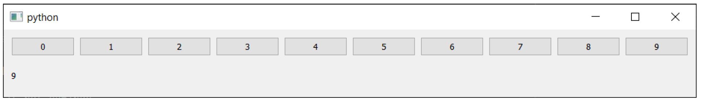
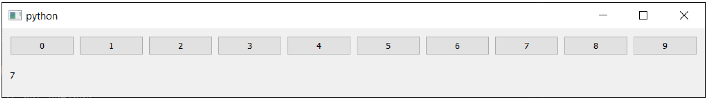
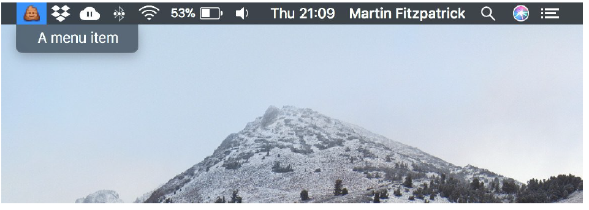
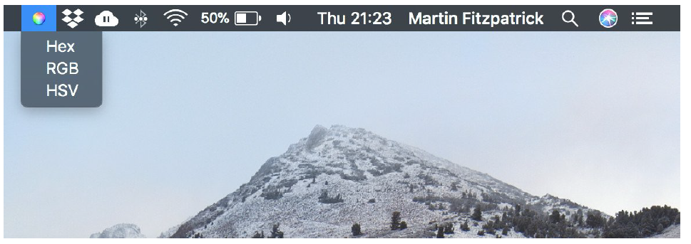
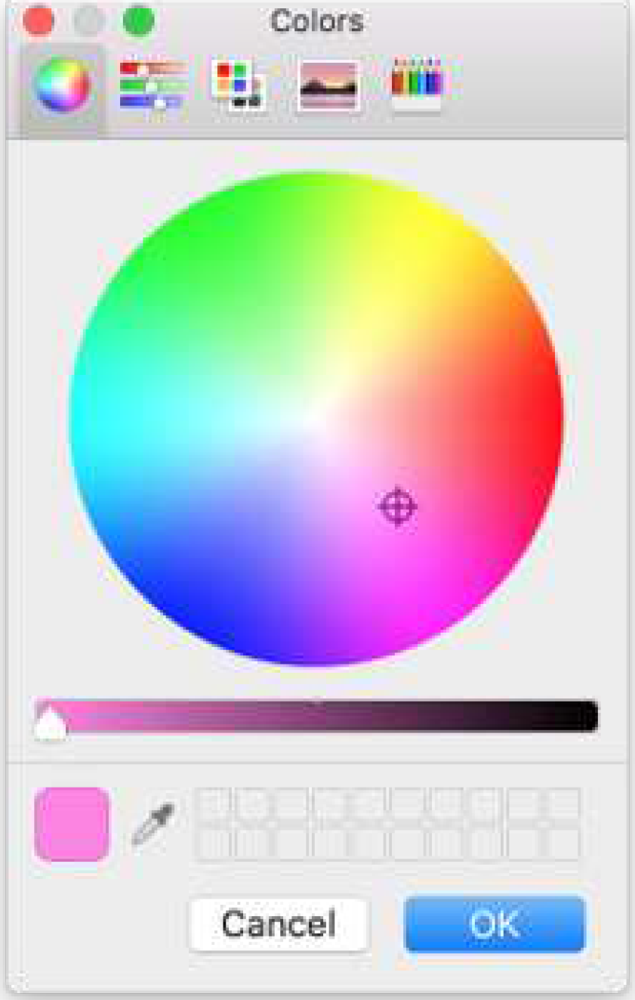
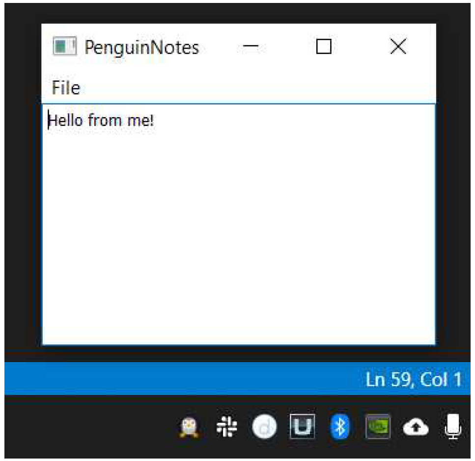
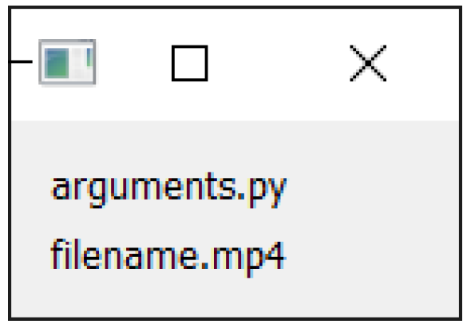

# PyQt6 的更多功能

到目前为止，我们所涵盖的主题已经足以使用PyQt6构建功能完善的桌面应用程序。在本章中，我们将探讨Qt框架中一些更具技术性且不太为人所知的方面，以加深对系统运作原理的理解。对于许多应用程序而言，本章所涉及的主题并非必要，但它们是工具箱中值得拥有的资源，以便在需要时随时调用！

## 31. 计时器

在应用程序中，您经常需要定期执行某些任务，甚至只是在未来某个时间点执行。在 PyQt6 中，这是通过使用定时器来实现的。`QTimer` 类为您提供两种不同类型的定时器——循环定时器或间隔定时器，以及单次定时器或一次性定时器。这两种定时器都可以与应用程序中的函数和方法关联，使其在需要时执行。在本章中，我们将探讨这两种定时器类型，并演示如何使用它们来自动化您的应用程序。

### 间隔计时器

使用 `QTimer` 类，您可以创建任何持续时间（以毫秒为单位）的间隔计时器。在每个指定的时间段，计时器都会超时。为了触发每次发生时都会发生的事情，您可以将计时器的超时信号连接到您想要执行的任何操作——就像处理其他信号一样。

在下面的示例中，我们设置了一个定时器，每 100 毫秒运行一次，该定时器旋转一个刻度盘。

*Listing 232. further/timers_1.py*

```python
import sys

from PyQt6.QtCore import QTimer
from PyQt6.QtWidgets import QApplication, QDial, QMainWindow


class MainWindow(QMainWindow):
    def __init__(self):
        super().__init__()
        
        self.dial = QDial()
        self.dial.setRange(0, 100)
        self.dial.setValue(0)
        
        self.timer = QTimer()
        self.timer.setInterval(10)
        self.timer.timeout.connect(self.update_dial)
        self.timer.start()
        
        self.setCentralWidget(self.dial)
        
    def update_dial(self):
        value = self.dial.value()
        value += 1 # 递增
        if value > 100:
            value = 0
        self.dial.setValue(value)
        
        
app = QApplication(sys.argv)
w = MainWindow()
w.show()

app.exec()
```

这只是一个简单的例子——您可以在连接的方法中做任何您想做的事情。但是，标准事件循环规则仍然适用，触发任务应快速返回，以避免阻塞图形用户界面。如果您需要执行定期的长期任务，可以使用计时器触发一个单独的线程或进程。


> 您**必须**在计时器运行期间始终保留对创建的计时器对象的引用。如果未保留引用，计时器对象将被删除，计时器将停止运行——且不会有任何警告。如果您创建了计时器但它似乎无法正常工作，请检查是否已保留对该对象的引用。

如果计时器的精度很重要，您可以通过将一个 `Qt.QTimerType` 值传递给 `timer.setTimerType` 来调整它。

*Listing 233. further/timers_1b.py*

```python
        self.timer.setTimerType(Qt.TimerType.PreciseTimer)
```

可用的选项如下所示。不要让计时器比实际需要的更精确，否则可能会阻塞重要的 UI 更新。

| 计时器类型                     | 值   | 描述                                       |
| ------------------------------ | ---- | ------------------------------------------ |
| `Qt.TimerType.PreciseTimer`    | 0    | 精准计时器力求保持毫秒级精度               |
| `Qt.TimerType.CoarseTimer`     | 1    | 粗略计时器试图将精度保持在目标间隔的5%以内 |
| `Qt.TimerType.VeryCoarseTimer` | 2    | 非常粗糙的计时器仅能保持整秒精度           |

请注意，即使是最精确的计时器也只能保持毫秒级的精度。图形用户界面线程中的任何内容都可能被 UI 更新和您自己的 Python 代码阻塞。如果精度非常重要，请将工作放在另一个线程或您完全控制的进程中。

### 单次计时器

如果您想触发某个操作，但只希望它发生一次，可以使用单次触发定时器。这些定时器是通过 `QTimer` 对象的静态方法构建的。最简单的形式只需接受一个以毫秒为单位的时间参数，以及您希望在定时器触发时调用的可调用对象——例如，您希望运行的方法。

在下面的示例中，我们使用单次计时器在按下可切换的按钮后取消其选中状态。

*Listing 234. further/timers_2.py*

```python
import sys

from PyQt6.QtCore import QTimer
from PyQt6.QtWidgets import QApplication, QMainWindow, QPushButton

class MainWindow(QMainWindow):
    def __init__(self):
        super().__init__()
        
        self.button = QPushButton("Press me!")
        self.button.setCheckable(True)
        self.button.setStyleSheet(
            # 将复选框状态设置为红色，以便更容易辨识.
            "QPushButton:checked { background-color: red; }"
        )
        self.button.toggled.connect(self.button_checked)
        
        self.setCentralWidget(self.button)
        
    def button_checked(self):
        print("Button checked")
        QTimer.singleShot(1000, self.uncheck_button) #1
        
    def uncheck_button(self):
        print("Button unchecked")
        self.button.setChecked(False)
        
        
app = QApplication(sys.argv)
w = MainWindow()
w.show()
app.exec()
```

> 1. `uncheck_button` 方法将在 1000 毫秒后被调用。

运行此示例并按下按钮后，您会看到按钮被选中并变为红色——这是使用了自定义样式。一秒钟后，按钮将恢复为未选中状态。

为了实现这一点，我们使用单次计时器将两个自定义方法链接在一起。首先，我们将按钮的切换信号连接到方法 `button_checked`。这会触发单次计时器。当计时器超时时，它会调用 `uncheck_button`，该方法实际上会取消选中该按钮。这使我们能够将取消选中该按钮的时间推迟到可配置的时间。

与间隔定时器不同，您无需保留创建的定时器（QTimer）的引用 —— `QTimer.singleShot()` 方法不会返回定时器引用。

### 通过事件队列进行延迟处理

您可以使用零延迟单次定时器通过事件队列延迟操作。当定时器触发时，定时器事件会被添加到事件队列的末尾（因为它是新事件），并且只有在所有现有事件都被处理完毕后才会被处理。

请记住，信号（和事件）只有在您将控制权从 Python 返回事件循环后才会被处理。如果您在一个方法中触发了一系列信号，并且希望在它们发生后执行某些操作，则不能直接在同一个方法中执行。该方法中的代码将在信号生效之前被执行。

```python
def my_method(self):
    self.some_signal.emit()
    self.some_other_signal.emit()
    do_something_here() #1
```

> 1. 该函数将在两个信号生效之前执行。

通过使用单次计时器，您可以将后续操作推送到事件队列的末尾，并确保它最后执行。

```python
def my_method(self):
    self.some_signal.emit()
    self.some_other_signal.emit()
    QTimer.singleShot(0, do_something_here) #1
```

> 1. 这将在信号的效果执行之后执行。


> 此技术仅保证 `do_something_here` 函数在先前的信号之后执行，而不保证这些信号的任何下游效果。不要试图通过增加 `msecs` 的值来解决这个问题，因为这会使您的应用程序依赖于系统计时。

## 32. 自定义信号

我们已经对信号进行了基本介绍，但这只是冰山一角。在本章中，我们将探讨如何创建自己的信号并自定义随信号发送的数据。

### 定制信号

到目前为止，我们只看了 Qt 本身在内置控件上提供的信号。不过，您也可以在自己的代码中使用自定义信号。这是将应用程序的模块部分解耦的好方法，这意味着应用程序的部分可以响应其他地方发生的事情，而无需了解应用程序的结构。


> 需要将应用程序的各个部分分离的一个明显迹象是，使用 `.parent()` 来访问其他无关控件上的数据。但它也适用于任何通过其他对象引用对象的地方，例如：`self.my_other_window.dialog.some_method`。此类代码在修改或重构应用程序时，容易在多个地方出现故障。尽可能避免使用此类代码！

将这些更新放入事件队列中，还可以帮助您保持应用程序的响应性——与使用一个大型更新方法相比，您可以将工作分成多个槽方法，并使用一个信号触发所有这些方法。

您可以使用 PyQt6 提供的 `pyqtSignal` 方法定义自己的信号。信号被定义为类属性，传递 Python 类型（或类型），这些类型将随信号一起发出。您可以为信号选择任何有效的 Python 变量名，并为信号类型选择任何 Python 类型。

*Listing 235. further/signals_custom.py*

```python
import sys

from PyQt6.QtCore import pyqtSignal
from PyQt6.QtWidgets import QApplication, QMainWindow


class MainWindow(QMainWindow):
    
    message = pyqtSignal(str) #1
    value = pyqtSignal(int, str, int) #2
    another = pyqtSignal(list) #3
    onemore = pyqtSignal(dict) #4
    anything = pyqtSignal(object) #5
    
    def __init__(self):
        super().__init__()
        
        self.message.connect(self.custom_slot)
        self.value.connect(self.custom_slot)
        self.another.connect(self.custom_slot)
        self.onemore.connect(self.custom_slot)
        self.anything.connect(self.custom_slot)
        
        self.message.emit("my message")
        self.value.emit(23, "abc", 1)
        self.another.emit([1, 2, 3, 4, 5])
        self.onemore.emit({"a": 2, "b": 7})
        self.anything.emit(1223)
        
    def custom_slot(self, *args):
        print(args)
        
        
app = QApplication(sys.argv)
window = MainWindow()
window.show()

app.exec()
```

> 1. 发出字符串的信号。
> 2. 发出 3 种不同类型的信号。
> 3. 发出列表的信号。
> 4. 发出字典的信号。
> 5. 发出任何东西的信号。

如您所见，信号可以正常连接和发射。您可以发送任何 Python 类型，包括多种类型和复合类型（例如字典、列表）。

如果您将信号定义为 `pyqtSignal(object)`，它将能够传输任何绝对 Python 类型。但通常情况下，这并不是一个好主意，因为接收槽将需要处理所有类型


> 您可以对 QObject 的任何子类创建信号。这包括所有控件，包括主窗口和对话框。

### 修改信号数据

信号连接到槽，槽是每次信号触发时都会运行的函数（或方法）。许多信号还会传输数据，提供有关状态变化或触发信号的控件的信息。接收槽可以使用这些数据对同一信号执行不同的操作。

但是，有一个限制——信号只能发出其设计时指定的数据。以 `QPushButton.clicked` 信号为例，该信号在按钮被点击时触发。*clicked+* 信号会发出单个数据——按钮被点击后的 `_checked` 状态。


> 对于不可选中的按钮，此值始终为 `False`。

槽接收这些数据，但仅此而已。它不知道是哪一个控件触发了它，也不知道该控件的任何信息。通常情况下，这没毛病。您可以将一个特定的控件与一个独特的功能绑定，该功能可以精确地完成该控件所需的操作。但有时，您可能希望添加额外的数据，以便槽方法能够更智能一些。有一个巧妙的小技巧可以做到这一点。

您发送的附加数据可以是触发控件本身，也可以是槽执行信号预期结果所需的一些相关元数据。

#### 拦截信号

您无需将信号直接连接到目标槽函数，而是使用一个中间函数来拦截信号，修改信号数据，然后将数据转发到目标槽。如果您在能够访问发出信号的控件的上下文中定义中间函数，则可以将该函数与信号一起传递。

此槽函数必须接受信号发送的值（此处为检查状态），然后调用实际槽，并将任何附加数据作为参数传递。

```python
def fn(checked):
    self.button_clicked(checked, <additional args>)
```

与其像这样定义这个中间函数，您也可以使用 `lambda` 函数在线实现相同的功能。如上所述，它接受一个参数 `checked`，然后调用真正的槽。

```python
lambda checked: self.button_clicked(checked, <additional args>)
```

在这两个示例中，`<additional args>` 可以替换为任何您想要转发到槽的内容。在下面的示例中，我们将 `QPushButton` 对象的 `action` 转发到接收槽。

```python
btn = QPushButton()
btn.clicked.connect( lambda checked: self.button_clicked(checked, btn))
```

我们的 `button_clicked` 槽方法将接收原始的选中值和 `QPushButton` 对象。我们的接收槽可能看起来像这样

```python
# 类方法.
def button_clicked(self, checked, btn):
    # 在此处执行操作.
```


> 您可以重新排列中间函数中的参数顺序，如果您喜欢的话

以下示例展示了实际应用情况，我们的 `button_clicked` 槽接收检查状态和控件对象。在此示例中，我们在处理程序中隐藏了按钮，因此您无法再次点击它！

*Listing 236. further/signals_extra_1.py*

```python
import sys

from PyQt6.QtWidgets import QApplication, QMainWindow, QPushButton


class MainWindow(QMainWindow):
    def __init__(self):
        super().__init__()
        
        btn = QPushButton("Press me")
        btn.setCheckable(True)
        btn.clicked.connect(
            lambda checked: self.button_clicked(checked, btn)
        )
        
        self.setCentralWidget(btn)
        
    def button_clicked(self, checked, btn):
        print(btn, checked)
        btn.hide()
        
        
app = QApplication(sys.argv)

window = MainWindow()
window.show()
app.exec()
```

#### 循环问题

以这种方式连接信号的一个常见原因是，当您在循环中构建一系列控件并通过编程连接信号时。遗憾的是，事情并不总是那么简单。

如果您在循环中构建了拦截信号，并希望将循环变量传递给接收槽，您会遇到一个问题。例如，在下面的示例中，我们创建了一系列按钮，并尝试将序列号与信号一起传递。点击按钮应使用按钮的值更新标签

*Listing 237. further/signals_extra_2.py*

```python
import sys

from PyQt6.QtWidgets import (
    QApplication,
    QHBoxLayout,
    QLabel,
    QMainWindow,
    QPushButton,
    QVBoxLayout,
    QWidget,
)


class MainWindow(QMainWindow):
    def __init__(self):
        super().__init__()
        
        v = QVBoxLayout()
        h = QHBoxLayout()
        
        for a in range(10):
            button = QPushButton(str(a))
            button.clicked.connect(
                lambda checked: self.button_clicked(a)
            ) #1
            h.addWidget(button)
        v.addLayout(h)
        self.label = QLabel("")
        v.addWidget(self.label)
        w = QWidget()
        w.setLayout(v)
        self.setCentralWidget(w)
        
    def button_clicked(self, n):
        self.label.setText(str(n))
        
        
app = QApplication(sys.argv)
window = MainWindow()
window.show()
app.exec()
```

> 1. 我们在 `lambda` 表达式中接受 `check` 变量，但会丢弃它。此按钮不可选中，因此它将始终为 `False`。

如果您运行这个程序，您应该会看到问题——无论您点击哪个按钮，标签上显示的都是相同的数字（9）。为什么是9？因为它是循环的最后一个值。



> 图234：无论您按下哪个按钮，标签上始终显示9。

问题就在这里——

```python
for a in range(10):
    button = QPushButton(str(a))
    button.clicked.connect(
        lambda checked: self.button_clicked(a)
    )
```

问题出在行 `lambda: self.button_clicked(a)` 上，我们在这里定义了对最终槽的调用。这里我们传递了 `a`，但它仍然与循环变量绑定。当 `lambda` 被评估时（当信号触发时），`a` 的值将是它在循环结束时的值，因此点击任何一个都会导致发送相同的值（这里为 9）。

解决方案是将值作为命名参数传递。通过这种方式，值在 `lambda` 表达式创建时就被绑定，并且在循环的每次迭代中都会保持 `a` 的值。这样可以确保在每次调用时都使用正确的值。


> 如果这听起来像天书，别担心！只需记住，在使用中间函数时，始终使用命名参数。

```python
lambda checked, a=a: self.button_clicked(a) 
```


> 您不必使用相同的变量名，您可以使用 `lambda val=a: self.button_clicked(val)` 如果更喜欢这样。关键是使用命名参数。

将此内容放入我们的循环中，效果如下：

*Listing 238. further/signals_extra_3.py*

```python
        for a in range(10):
        button = QPushButton(str(a))
        button.clicked.connect(
            lambda checked, a=a: self.button_clicked(a)
        ) #1
        h.addWidget(button)
```

如果您现在运行此操作，您将看到预期行为——单击按钮时，标签中将显示正确值。



> 图235：当您按下按钮时，所按的数字会显示在下方。

以下是使用内联 `lambda` 函数修改 `MainWindow.windowTitleChanged` 信号发送的数据的几个示例。当到达 `.setWindowTitle` 行时，它们都会触发，`my_custom_fn` 槽将输出它们接收到的内容。

*Listing 239. further/signals_extra_4.py*

```python
import sys

from PyQt6.QtWidgets import QApplication, QMainWindow


class MainWindow(QMainWindow):
    def __init__(self):
        super().__init__()
        # SIGNAL：每当窗口标题发生改变时，将调用连接的功能。新标题将传递给该函数.
        self.windowTitleChanged.connect(self.on_window_title_changed)
        # SIGNAL：每当窗口标题发生变化时，都会调用连接的功能。新标题在lambda中被丢弃，该功能在没有参数的情况下被调用.
        self.windowTitleChanged.connect(lambda x: self.my_custom_fn())
        # SIGNAL: 当窗口标题发生变化时，将调用该连接函数。新标题将作为参数传递给该函数，并替换默认参数.
        self.windowTitleChanged.connect(lambda x: self.my_custom_fn(x))
        # SIGNAL: 当窗口标题发生变化时，将调用该连接函数。新标题将传递给该函数并替换默认参数。额外数据将从lambda内部传递.
        self.windowTitleChanged.connect(
            lambda x: self.my_custom_fn(x, 25)
        )
        # 这将设置窗口标题，该标题将触发所有上述信号，将新标题作为第一个参数发送给附加函数或lambda表达式.
        self.setWindowTitle("This will trigger all the signals.")
        # SLOT: 该函数接受一个字符串（例如窗口标题），并将其打印出来.
    def on_window_title_changed(self, s):
        print(s)
        # SLOT: 该函数具有默认参数，因此可以不传入值直接调用.
    def my_custom_fn(self, a="HELLLO!", b=5):
        print(a, b)
        
        
app = QApplication(sys.argv)

window = MainWindow()
window.show()
app.exec()
```

## 33. 使用相对路径

路径描述了文件在文件系统中的位置。

当我们将外部数据文件加载到应用程序中时，通常会使用路径来完成这一操作。虽然从理论上讲这很简单，但实际操作中可能会遇到一些问题。随着应用程序规模的扩大，维护这些路径可能会变得有些繁琐，因此值得退一步考虑实施一个更可靠的系统。

### 相对路径

路径有两种类型——绝对路径和相对路径。绝对路径描述了从文件系统根目录（底部）开始的完整路径，而相对路径则描述了从当前文件系统位置开始的路径（或相对于当前位置的路径）。

这并不明显，但当您仅提供文件名时，例如：`hello.jpg`，这实际上是一个相对路径。当文件被加载时，它是相对于当前活动文件夹加载的。令人困惑的是，当前活动文件夹并不一定就是您的脚本所在的文件夹。

在“控件”一章中，我们介绍了一种处理加载图像时出现此问题的简单方法。我们使用内置函数 `__file__` 获取当前正在运行的脚本（我们的应用程序）的路径，然后使用 `os` 函数首先获取脚本的目录，再用该目录构建完整路径。

*Listing 240. basic/widgets_2b.py*

```python
import os
import sys

from PyQt6.QtGui import QPixmap
from PyQt6.QtWidgets import QApplication, QLabel, QMainWindow

basedir = os.path.dirname(__file__)
print("Current working folder:", os.getcwd()) #1
print("Paths are relative to:", basedir) #2


class MainWindow(QMainWindow):
    def __init__(self):
        super().__init__()
        
        self.setWindowTitle("My App")
        
        widget = QLabel("Hello")
        widget.setPixmap(QPixmap(os.path.join(basedir, "otje.jpg")))
        
        self.setCentralWidget(widget)
        
        
app = QApplication(sys.argv)
window = MainWindow()
window.show()
app.exec()
```

对于简单应用程序而言，这种方法效果良好，尤其是当您仅有一个主脚本且需要加载的文件较少时。然而，在加载每个文件时都需要重复计算基目录，并使用 `os.path.join` 方法在各处构建路径，这很快就会变成维护噩梦。如果您需要重新组织项目中的文件结构，那将是一场噩梦。幸运的是，有一种更简单的方法！


> 为什么不直接使用绝对路径呢？因为它们只适用于您的文件系统，或者结构完全相同的文件系统。如果我在自己的主目录中开发应用程序，并使用绝对路径来引用文件，例如：`/home/martin/myapp/images/somefile.png`，那么它只会在其他也拥有名为 `martin` 的主目录并将其放置在该目录下的人的系统上生效。这会有点奇怪。

### 使用 Paths 类

应用程序需要加载的数据文件通常具有一定的结构——加载的文件类型通常较为常见，或者加载这些文件的目的是为了实现常见的功能。通常，您会将相关的文件存储在相关的文件夹中，以便于管理。我们可以利用这种现有的结构，建立一种常规的方法来构建文件的路径。

要实现这一点，我们可以创建一个自定义的 `Paths` 类，该类通过结合使用属性与方法来分别构建文件夹和文件路径。其核心逻辑与上述使用的 `os.path.dirname(__file__)` 和 `os.path.join()` 方法相同，但具有更高的自包含性且易于修改。

现在请您将以下代码添加到项目根目录下的一个名为 `paths.py` 的文件中。

*Listing 241. further/paths.py*

```python
import os


class Paths:
    
    base = os.path.dirname(__file__)
    ui_files = os.path.join(base, "ui")
    images = os.path.join(base, "images")
    icons = os.path.join(images, "icons")
    data = os.path.join(base, "images")
    
    # 文件加载器.
    @classmethod
    def ui_file(cls, filename):
        return os.path.join(cls.ui_files, filename)
    
    @classmethod
    def icon(cls, filename):
        return os.path.join(cls.icons, filename)
    
    @classmethod
    def image(cls, filename):
        return os.path.join(cls.images, filename)
    
    @classmethod
    def data(cls, filename):
        return os.path.join(cls.data, filename)
```


> 要尝试使用 paths 模块，您可以启动一个 Python 解释器，位于您的项目根目录下，并使用 `from paths import Paths`

现在，在应用程序的任何位置，您都可以导入 Paths 类并直接使用它。属性 `base`、`ui_files`、`icons`、`images` 和 `data` 均返回其对应文件夹在 `base` 文件夹下的路径。请注意 `icons` 文件夹是如何从 `images` 路径构建的——将该文件夹嵌套在该路径下。


> 您可以自由地自定义路径的名称和结构等，以匹配您自己项目中的文件夹结构。

```bash
>>> from paths import Paths
>>> Paths.ui_files
'U:\\home\\martin\\books\\create-simple-gui-applications\\code\\further\\ui'
>>> Paths.icons
'U:\\home\\martin\\books\\create-simple-gui-applications\\code\\further\\images\\icons'
```


> 我们**不会**从这个类创建对象实例——我们不会调用 `Paths()`——因为我们不需要它。路径是静态且不变的，因此无需通过创建对象来管理内部状态。注意，方法必须使用 `@classmethod` 装饰器才能在类本身访问。

方法 `ui_file`、`icon`、`image` 和 `data` 用于生成包含文件名的路径。在每种情况下，您都需要调用该方法并传入要添加到路径末尾的文件名。这些方法均依赖于上述描述的文件夹属性。例如，如果您想加载特定的图标，可以调用 `Paths.icon()` 方法，传入图标名称，以获取完整的路径。

```bash
>>> Paths.icon('bug.png')
'U:\\home\\martin\\books\\create-simple-gui-applications\\code\\further\\images\\icons\\bug.png'
```

在您的应用程序代码中，您可以按照以下方式构建路径并加载图标：

```python
QIcon(Paths.icon('bug.png'))
```

这使得您的代码更加整洁，有助于确保路径正确，并且如果您以后想重新组织文件的存储方式，会变得更加容易。例如，假设您想将图标移动到顶级文件夹：现在您只需修改 `paths.py` 中的定义，所有图标仍可正常工作。

```python
    icons = os.path.join(images, 'icons')
    # 要提升到顶层，请让图标从基类继承。
    icons = os.path.join(base, 'icons')
```

## 34. 系统托盘与 macOS 菜单

系统托盘应用程序（或菜单栏应用程序）可用于通过少量点击即可访问常见功能。对于完整的桌面应用程序，它们是控制应用程序的便捷方式，无需打开整个窗口。

Qt 提供了一个简单的接口，用于构建跨平台的系统托盘（Windows）或菜单栏（macOS）应用程序。以下是一个最小的可工作示例，用于在工具栏/系统托盘中显示一个图标并附带一个菜单。菜单中的操作尚未连接，因此目前还不会执行任何操作。

*Listing 242. further/systray.py*

```python
import os
import sys

from PyQt6.QtGui import QIcon
from PyQt6.QtWidgets import (
    QAction,
    QApplication,
    QColorDialog,
    QMenu,
    QSystemTrayIcon,
)

basedir = os.path.dirname(__file__)

app = QApplication(sys.argv)
app.setQuitOnLastWindowClosed(False)

# 创建图标
icon = QIcon(os.path.join(basedir, "icon.png"))

# 创建托盘
tray = QSystemTrayIcon()
tray.setIcon(icon)
tray.setVisible(True)

# 创建菜单
menu = QMenu()
action = QAction("A menu item")
menu.addAction(action)

# 在菜单中加入退出选项.
quit = QAction("Quit")
quit.triggered.connect(app.quit)
menu.addAction(quit)

# 将菜单添加到托盘
tray.setContextMenu(menu)

app.exec()
```

您会发现这里没有 `QMainWindow`，因为我们根本没有窗口需要显示。您可以像往常一样创建一个窗口，而不会影响系统托盘图标的行为。


> Qt 的默认行为是在所有活动窗口关闭后关闭应用程序。这不会影响这个示例，但在创建窗口后再关闭它们的应用程序中会成为问题。您可以设置`app.setQuitOnLastWindowClosed(False)` 可阻止此行为，并确保应用程序继续运行。

提供的图标会显示在工具栏中（您可以在系统托盘或菜单栏右侧的图标组左侧看到它）。


> 图236：菜单栏上显示的图标

单击（或在 Windows 上右键单击）图标会显示添加的菜单。



> 图237：菜单栏应用程序菜单

目前这个应用程序还什么都不做，所以在接下来的部分，我们将扩展这个示例，创建一个小型颜色选择器。

以下是一个更完整的示例，使用Qt内置的 `QColorDialog` 来提供一个可通过工具栏访问的颜色选择器。该菜单允许您选择以HTML格式 `#RRGGBB` 、`rgb(R,G,B)` 或 `hsv(H,S,V)` 格式获取所选颜色。

*ing 243. further/systray_color.py*

```python
import os
import sys

from PyQt6.QtGui import QIcon
from PyQt6.QtWidgets import (
    QAction,
    QApplication,
    QColorDialog,
    QMenu,
    QSystemTrayIcon,
)

basedir = os.path.dirname(__file__)


app = QApplication(sys.argv)
app.setQuitOnLastWindowClosed(False)

# 创建图标
icon = QIcon(os.path.join(basedir, "color.png"))

clipboard = QApplication.clipboard()
dialog = QColorDialog()


def copy_color_hex():
    if dialog.exec():
        color = dialog.currentColor()
        clipboard.setText(color.name())
        
        
def copy_color_rgb():
    if dialog.exec():
        color = dialog.currentColor()
        clipboard.setText(
            "rgb(%d, %d, %d)"
            % (color.red(), color.green(), color.blue())
        )
        
        
def copy_color_hsv():
    if dialog.exec():
        color = dialog.currentColor()
        clipboard.setText(
            "hsv(%d, %d, %d)"
            % (color.hue(), color.saturation(), color.value())
        )
        
        
# 创建托盘
tray = QSystemTrayIcon()
tray.setIcon(icon)
tray.setVisible(True)

# 创建菜单
menu = QMenu()
action1 = QAction("Hex")
action1.triggered.connect(copy_color_hex)
menu.addAction(action1)

action2 = QAction("RGB")
action2.triggered.connect(copy_color_rgb)
menu.addAction(action2)

action3 = QAction("HSV")
action3.triggered.connect(copy_color_hsv)
menu.addAction(action3)

quit = QAction("Quit")
quit.triggered.connect(app.quit)
menu.addAction(quit)

# 将菜单添加到托盘中
tray.setContextMenu(menu)

app.exec()
```

与前一个示例类似，本示例中也没有 `QMainWindow`。菜单的创建方式与之前相同，但新增了 3 个用于不同输出格式的操作项。每个操作项都与代表其格式的特定处理函数相连。每个处理函数会显示一个对话框，如果用户选择了颜色，则将该颜色以指定格式复制到剪贴板中。

与之前一样，该图标会出现在工具栏中。


> 图238：工具栏上的颜色选择器

点击图标会显示一个菜单，从中您可以选择要返回的图像格式。



> 图239：颜色选择器菜单

选择格式后，您将看到标准的Qt颜色选择器窗口。



> 图240：系统颜色选择器窗口

选择您想要的颜色并点击确定。所选颜色将以您请求的格式复制到剪贴板。可用的格式将产生以下输出：

| 值                 | 范围  |
| ------------------ | ----- |
| `#a2b3cc`          | 00-FF |
| `rgb(25, 28, 29)`  | 0-255 |
| `hsv(14, 93, 199)` | 0-255 |

### 为完整应用程序添加系统托盘图标

到目前为止，我们已经展示了如何创建一个没有主窗口的独立系统托盘应用程序。然而，有时您可能希望同时拥有一个系统托盘图标和一个窗口。当这样做时，通常可以通过托盘图标打开和关闭（隐藏）主窗口，而无需关闭应用程序。在本节中，我们将探讨如何使用Qt5构建此类应用程序。

原则上来说，这非常简单——创建主窗口，并将一个动作的信号连接到窗口的 `.show()` 方法。

以下是一个名为“PenguinNotes”的小型便签应用程序。运行时，它会在系统托盘或 macOS 工具栏中显示一个小企鹅图标。

点击托盘中的小企鹅图标将显示窗口。该窗口包含一个 `QTextEdit` 编辑器，您可以在其中输入笔记。您可以像往常一样关闭该窗口，或再次点击托盘图标关闭。应用程序将持续在托盘中运行。要关闭应用程序，您可以使用“File › Close“关闭”选项，关闭时将自动保存笔记。

*Listing 244. further/systray_window.py*

```python
import os
import sys

from PyQt6.QtGui import QIcon
from PyQt6.QtWidgets import (
    QAction,
    QApplication,
    QMainWindow,
    QMenu,
    QSystemTrayIcon,
    QTextEdit,
)

basedir = os.path.dirname(__file__)

app = QApplication(sys.argv)
app.setQuitOnLastWindowClosed(False)

# 创建图标
icon = QIcon(os.path.join(basedir, "animal-penguin.png"))

# 创建托盘
tray = QSystemTrayIcon()
tray.setIcon(icon)
tray.setVisible(True)


class MainWindow(QMainWindow):
    def __init__(self):
        super().__init__()
        
        self.editor = QTextEdit()
        self.load() # Load up the text from file.
        
        menu = self.menuBar()
        file_menu = menu.addMenu("&File")
        
        self.reset = QAction("&Reset")
        self.reset.triggered.connect(self.editor.clear)
        file_menu.addAction(self.reset)
        
        self.quit = QAction("&Quit")
        self.quit.triggered.connect(app.quit)
        file_menu.addAction(self.quit)
        
        self.setCentralWidget(self.editor)
        
        self.setWindowTitle("PenguinNotes")
        
    def load(self):
        with open("notes.txt", "r") as f:
            text = f.read()
        self.editor.setPlainText(text)
        
    def save(self):
        text = self.editor.toPlainText()
        with open("notes.txt", "w") as f:
            f.write(text)
            
    def activate(self, reason):
        if (
            reason == QSystemTrayIcon.ActivationReason.Trigger
        ): # 图标被点击.
            self.show()


w = MainWindow()

tray.activated.connect(w.activate)
app.aboutToQuit.connect(w.save)

app.exec()
```


> 在 macOS 上，“退出”操作会出现在应用程序菜单中（位于最左侧，与应用程序名称并列），而非文件菜单。如果我们没有同时添加“File › Reset”操作，文件菜单将为空且隐藏（您不妨试试看！）

以下是笔记应用程序的屏幕截图，窗口处于打开状态。



> 图241：笔记编辑器窗口

显示和隐藏窗口的控制通过我们的 `QMainWindow` 上的 `activate` 方法滑块来实现。这与代码底部的托盘图标 `.activated` 信号相连，使用 `tray.activated.connect(w.activate)` 实现。

```python
    def activate(self, reason):
        if reason == QSystemTrayIcon.Trigger: # 图标被点击.
            if self.isVisible():
                self.hide()
            else:
                self.show()
```

该信号在许多不同情况下都会被触发，因此我们必须首先检查以确保我们只使用 `QSystemTrayIcon.Trigger`。

| 原因                          | 值   | 描述                                                         |
| ----------------------------- | ---- | ------------------------------------------------------------ |
| `QSystemTrayIcon.Unknown`     | 0    | 未知原因                                                     |
| `QSystemTrayIcon.Context`     | 1    | 上下文菜单请求（macOS为单击，Windows为右键单击）             |
| `QSystemTrayIcon.DoubleClick` | 2    | 图标被双击。在 macOS 上，双击仅在未设置上下文菜单时触发，因为菜单在单击时打开。 |
| `QSystemTrayIcon.Trigger`     | 3    | 图标被单击一次                                               |
| `QSystemTrayIcon.MiddleClick` | 4    | 图标被鼠标中键点击                                           |

通过监听这些事件，您应该能够构建任何类型的系统托盘行为。然而，请务必在所有目标平台上测试该行为。

## 35. 枚举与 Qt 命名空间

当您在应用程序中看到类似以下的代码时，您可能会想知道 `Qt.ItemDataRole.DisplayRole` 或 `Qt.ItemDataRole.CheckStateRole` 对象究竟是什么。


> 在 PyQt 的早期版本中，也存在诸如 `Qt.DisplayRole` 之类的快捷名称，因此您在代码中仍可能看到这些名称。在 PyQt6 中，您必须始终使用完整名称。本书中的所有示例均使用完全限定名称。

```python
    def data(self, role, index):
        
        if role == Qt.ItemDataRole.DisplayRole:
            # 做些什么
```

Qt 在代码中广泛使用这些类型来表示有意义的常量。其中许多在 Qt 命名空间中可用，即 `Qt.<something>`，尽管还有一些对象特定的类型，例如 `QDialogButtonBox.StandardButton.Ok`，它们的工作方式完全相同。

但它们是如何工作的呢？在本章中，我们将详细探讨这些常量是如何形成的，以及如何有效地使用它们。为此，我们需要涉及一些基础知识，如二进制数。但深入理解这些内容并非本章的必要条件——正如往常一样，我们将重点放在如何在学习过程中应用所学知识上。

### 这不过是一些数字而已

如果您查看一个标志的类型（`type()`），您会看到一个类的名称。这些类是该标志所属的组。例如，`Qt.ItemDataRole.DecorationRole` 的类型是 `Qt.ItemDataRole`—— 您可以在 [Qt 文档](https://doc.qt.io/qt-5/qt.html#ItemDataRole-enum)中看到这些组。


> 您可以在 Python  Shell 中运行以下代码，只需先使用 `from PyQt6.QtCore import Qt` 导入 Qt 命名空间即可。

```bash
>>> type(Qt.ItemDataRole.DecorationRole)
<enum 'ItemDataRole'>
```

这些类型是枚举类型——一种将值限制为一组预定义值的类型。在 PyQt6 中，它们被定义为 Python 枚举 (`Enum`) 类型。

这些值实际上都是简单的整数。`Qt.ItemDataRole.DisplayRole` 的值为 0，而 `Qt.ItemDataRole.EditRole` 的值为 2。这些整数值本身没有意义，但在它们被使用的特定上下文中具有意义。

```bash
>>> int(Qt.ItemDataRole.DecorationRole)
1
```

例如，您是否认为以下代码会评估为 True？

```bash
>>> Qt.ItemDataRole.DecorationRole == Qt.AlignmentFlag.AlignLeft
True
```

可能不是。但 `Qt.ItemDataRole.DecorationRole` 和 `Qt.AlignmentFlag.AlignLeft` 的整数值均为 1，因此在数值上是相等的。这些数值通常可以忽略。只要在适当的上下文中使用这些常量，它们就会始终按预期工作。

*Table 8. Values given in the documentation can be in decimal or binary*

| 标识符                           | 值（十六进制） | 值（十进制） | 描述                   |
| -------------------------------- | -------------- | ------------ | ---------------------- |
| `Qt.AlignmentFlag.AlignLeft`     | `0x0001`       | 1            | 与左侧对齐             |
| `Qt.AlignmentFlag.AlignRight`    | `0x0002`       | 2            | 与右侧对齐             |
| `Qt.AlignmentFlag.AlignHCenter`  | `0x0004`       | 4            | 在可用空间中水平居中   |
| `Qt.AlignmentFlag.AlignJustify`  | `0x0008`       | 8            | 在可用空间内对齐文本。 |
| `Qt.AlignmentFlag.AlignTop`      | `0x0020`       | 32           | 与顶部对齐             |
| `Qt.AlignmentFlag.AlignBottom`   | `0x0040`       | 64           | 与底部对齐             |
| `Qt.AlignmentFlag.AlignVCenter`  | `0x0080`       | 128          | 在可用空间中垂直居中   |
| `Qt.AlignmentFlag.AlignBaseline` | `0x0100`       | 256          | 与基准线对齐           |

如果您查看上表中的数字，可能会发现一些异常。首先，这些数字并非每次增加1，而是每次翻倍。其次，水平对齐的十六进制数字都集中在同一列，而垂直对齐的数字则分布在另一列。

这种数字模式是故意设计的，它使我们能够做一件非常巧妙的事情——将标志位组合在一起以创建复合标志位。要理解这一点，我们需要快速了解计算机如何表示整数。

### 二进制与十六进制

当我们进行常规计数时，使用的是十进制（基数为10）的数字系统。该系统包含10个数字，从0到9，且十进制数字中的每个数字的值是其前一个数字的10倍。例如，数字1251由1×1000、2×100、5×10和1×1组成。

| 1000 | 100  | 10   | 1    |
| ---- | ---- | ---- | ---- |
| 1    | 2    | 5    | 1    |

计算机以二进制形式存储数据，即一系列开和关的状态，以1和0的形式表示。二进制是一种以2为基数的数制。它有2个数字，从0到1，二进制数中的每个数字的值是前一个数字的2倍。在以下示例中，数字5由1×4和1×1组成。

| 8    | 4    | 2    | 1    | 十进制 |
| ---- | ---- | ---- | ---- | ------ |
| 0    | 1    | 0    | 1    | 5      |

二进制数书写起来很快就会变得繁琐——5893的二进制形式是 `1011100000101` ——但将其与十进制数来回转换也并不方便。为了更方便地处理二进制数，十六进制在计算机领域中被广泛使用。这是一种由16个数字（0-9A-F）组成的数制。每个十六进制数字的值在0-15（0-A）之间，相当于4个二进制位。这使得在两者之间进行转换变得直观。

下表显示了数字0-15，以及它们在二进制和十六进制中的对应值。一个给定的二进制数的值可以通过将每列顶部含有1的数字相加来计算。

| 8    | 4    | 2    | 1    | 十六进制 | 十进制 |
| ---- | ---- | ---- | ---- | -------- | ------ |
| 0    | 0    | 0    | 0    | 0        | 0      |
| 0    | 0    | 0    | 1    | 1        | 1      |
| 0    | 0    | 1    | 0    | 2        | 2      |
| 0    | 0    | 1    | 1    | 3        | 3      |
| 0    | 1    | 0    | 0    | 4        | 4      |
| 0    | 1    | 0    | 1    | 5        | 5      |
| 0    | 1    | 1    | 0    | 6        | 6      |
| 0    | 1    | 1    | 1    | 7        | 7      |
| 1    | 0    | 0    | 0    | 8        | 8      |
| 1    | 0    | 0    | 1    | 9        | 9      |
| 1    | 0    | 1    | 0    | A        | 10     |
| 1    | 0    | 1    | 1    | B        | 11     |
| 1    | 1    | 0    | 0    | C        | 12     |
| 1    | 1    | 0    | 1    | D        | 13     |
| 1    | 1    | 1    | 0    | E        | 14     |
| 1    | 1    | 1    | 1    | F        | 15     |

这种模式在更大的数字中继续适用。例如，下图是数字25的二进制表示，由16×1、8×1和1×1组成。

| 16   | 8    | 4    | 2    | 1    |
| ---- | ---- | ---- | ---- | ---- |
| 1    | 1    | 0    | 0    | 1    |

由于二进制值中的每个数字要么是1，要么是0（`True` 或 `False`），我们可以将二进制数字用作布尔标志——状态标记，这些标记要么处于开启状态，要么处于关闭状态。一个整数值可以存储多个标志，每个标志使用唯一的二进制数字。每个标志都会根据其设置为1的二进制数字的位置拥有自己的数值。

这就是 Qt 标志的工作原理。再次查看我们的对齐标志，我们现在可以理解为什么选择这些数字——每个标志都是一个唯一的、不重叠的位。标志的值来自标志设置为 1 的二进制位。

| `Qt.AlignmentFlag.AlignLeft`    | 1    | `00000001` |
| ------------------------------- | ---- | ---------- |
| `Qt.AlignmentFlag.AlignRight`   | 2    | `00000010` |
| `Qt.AlignmentFlag.AlignHCenter` | 4    | `00000100` |
| `Qt.AlignmentFlag.AlignJustify` | 8    | `00001000` |
| `Qt.AlignmentFlag.AlignTop`     | 32   | `00100000` |
| `Qt.AlignmentFlag.AlignBottom`  | 64   | `01000000` |
| `Qt.AlignmentFlag.AlignVCenter` | 128  | `10000000` |

当直接使用 `==` 运算符测试这些标志时，您无需担心这些问题。但这种值的排列方式解锁了将标志组合在一起的能力，以创建复合标志，这些标志同时代表多个状态。这使您能够使用单个标志变量表示，例如，左对齐和底对齐。

### 位或运算（`|`）组合

任何两个二进制表示不重叠的数字都可以相加，同时保持其原有的二进制位不变。例如，下图中我们对1和2进行相加，得到3 —

*Table 9. Add*

| `001` | 1    |
| ----- | ---- |
| `010` | + 2  |
| `011` | = 3  |

原始数字中的1位数在输出中得以保留。相比之下，如果我们将1和3相加得到4，原始数字中的1位数在结果中不存在——两者现在都是零。

| `001` | 1    |
| ----- | ---- |
| `011` | + 3  |
| `100` | = 4  |


> 在十进制中也能观察到相同的效果——您可以比较将100和50相加得到150，与将161和50相加得到211的情况。

由于我们在特定二进制位置使用1值来表示某种含义，这会造成问题。例如，如果我们将对齐标志的值添加两次，我们将得到一个在数学上完全正确但意义上完全错误的结果。

*Table 10. Add*

| `00000001` | 1    | `Qt.AlignmentFlag.AlignLeft`    |
| ---------- | ---- | ------------------------------- |
| `00000001` | + 1  | `+ Qt.AlignmentFlag.AlignLeft`  |
| `00000010` | = 2  | `= Qt.AlignmentFlag.AlignRight` |

```bash
>>> Qt.AlignmentFlag.AlignLeft + Qt.AlignmentFlag.AlignLeft == Qt.AlignmentFlag.AlignRight
True
```

因此，在处理二进制标志时，我们使用位或运算将它们组合起来。在 Python 中，位或运算使用 `|`（管道）运算符实现。在位或运算中，我们通过在二进制级别比较两个数来将它们组合在一起。结果是一个新数，其中二进制位如果在任一输入中为 1，则设置为 1。但重要的是，位不被传递，也不影响相邻位。


> 当数字不重叠时，按位或运算等同于加法（+）。

| `Qt.AlignmentFlag.AlignLeft` | `00000001` |
| ---------------------------- | ---------- |
| `Qt.AlignmentFlag.AlignTop`  | `00100000` |

使用上述两个对齐常量，我们可以将它们的值结合起来，使用位或运算生成输出，以实现顶部左对齐。

*Table 11. Bitwise OR*

| `00000001` | 1     | `Qt.AlignmentFlag.AlignLeft`                             |
| ---------- | ----- | -------------------------------------------------------- |
| `00100000` | OR 32 | `| Qt.AlignmentFlag.AlignTop`                            |
| `00100001` | = 33  | `Qt.AlignmentFlag.AlignLeft | Qt.AlignmentFlag.AlignTop` |

```bash
>>> int(Qt.AlignmentFlag.AlignLeft | Qt.AlignmentFlag.AlignTop)
33
```

因此，如果我们将 32 与 1 相加，结果是 33。这应该不会太令人惊讶。但是，如果我们不小心多次添加 `Qt.AlignmentFlag.AlignLeft`，会发生什么情况？

```bash
>>> int(Qt.AlignmentFlag.AlignLeft | Qt.AlignmentFlag.AlignLeft | Qt.AlignmentFlag.AlignTop)
33
```

我们得到了相同的结果！位或运算在二进制位置上输出1，只要输入中任何一个位置有1。它不会将它们相加，也不会将任何内容进位或溢出到其他位——这意味着您可以多次对同一个值进行位或运算，最终得到的只是您最初的值。

```bash
>>> int(Qt.AlignmentFlag.AlignLeft | Qt.AlignmentFlag.AlignLeft | Qt.AlignmentFlag.AlignLeft)
1
```

或者，用二进制表示——

*Table 12. Bitwise OR*

| `00000001` | 1    | `Qt.AlignmentFlag.AlignLeft`   |
| ---------- | ---- | ------------------------------ |
| `00000001` | OR 1 | `| Qt.AlignmentFlag.AlignLeft` |
| `00000001` | = 1  | `= Qt.AlignmentFlag.AlignLeft` |

最后，比较这些值。

```bash
>>> Qt.AlignmentFlag.AlignLeft | Qt.AlignmentFlag.AlignLeft == Qt.AlignmentFlag.AlignLeft
True

>>> Qt.AlignmentFlag.AlignLeft | Qt.AlignmentFlag.AlignLeft == Qt.AlignmentFlag.AlignRight
False
```

### 检查组合标志

我们可以直接比较标志本身来检查简单的标志，正如我们已经看到的——

```bash
>>> align = Qt.AlignmentFlag.AlignLeft
>>> align == Qt.AlignmentFlag.AlignLeft
True
```

对于组合标志，我们还可以检查与标志组合的相等性

```bash
>>> align = Qt.AlignmentFlag.AlignLeft | Qt.AlignmentFlag.AlignTop
>>> align == Qt.AlignmentFlag.AlignLeft | Qt.AlignmentFlag.AlignTop
True
```

但有时，您可能想知道某个变量是否包含特定标志。例如，我们可能想知道 `align` 是否设置了 `align left` 标志，而与其他对齐状态无关。

一旦与另一个元素合并后，如何判断一个元素是否应用了 `Qt.AlignmentFlag.AlignLeft` 属性？在这种情况下，使用 a `==` 比较不会生效，因为它们在数值上并不相等。

```bash
>> alignment = Qt.AlignmentFlag.AlignLeft | Qt.AlignmentFlag.AlignTop
>> alignment == Qt.AlignmentFlag.AlignLeft # 33 == 1
False
```

我们需要一种方法来比较 `Qt.AlignmentFlag.AlignLeft` 标志与我们的复合标志的位。为此，我们可以使用位与运算。

### 位与运算（`&`）检查

在 Python 中，位与运算使用 & 运算符进行。

在上一步骤中，我们结合了 `Qt.AlignmentFlag.AlignLeft` (1) 和 `Qt.AlignmentFlag.AlignTop`(32) 以生成 “Top Left” (33)。现在，我们需要检查组合后的对齐标志是否设置了左对齐标志。为了进行测试，我们需要使用位与运算，该运算逐位检查两个输入值是否均为 1，如果为真，则在该位置返回 1。

*Table 13. Bitwise AND*

| `00100001` | 33    | `Qt.AlignmentFlag.AlignLeft | Qt.AlignmentFlag.AlignTop` |
| ---------- | ----- | -------------------------------------------------------- |
| `00100001` | AND 1 | `& Qt.AlignmentFlag.AlignLeft`                           |
| `00100001` | = 1   | `= Qt.AlignmentFlag.AlignLeft`                           |

这会过滤输入变量中的位，仅保留那些在目标标志 `Qt.AlignmentFlag.AlignLeft` 中设置的位。如果该位被设置，结果为非零值；如果未设置，结果为 0。

```bash
>>> int(alignment & Qt.AlignmentFlag.AlignLeft)
1 # 结果是标志的数值，这里是1.
```

例如，如果我们将对齐变量与 `Qt.AlignmentFlag.AlignRight` 进行测试，结果为 0

| `00100001` | 33   | `Qt.AlignmentFlag.AlignLeft | Qt.AlignmentFlag.AlignTop` |
| ---------- | ---- | -------------------------------------------------------- |
| `00000010` | 2    | `& Qt.AlignmentFlag.AlignRight`                          |
| `00000000` | 0    | `= Qt.AlignmentFlag.AlignLeft`                           |

```bash
>>> int(alignment & Qt.AlignmentFlag.AlignRight)
0
```

因为在 Python 中，0 等于 `False`，而其他任何值都等于 `True`。这意味着，当使用位与运算符对两个数字进行比较时，如果它们有任何位是相同的，结果将大于 0，并且为 `True`。

通过结合位运算的或运算和与运算，您应该能够利用Qt标志实现所需的所有功能。

## 36. 使用命令行参数

如果您创建了一个与特定文件类型配合使用的应用程序——例如一个视频编辑器，它可以打开视频文件，一个文档编辑器，它可以打开文档文件——让您的应用程序自动打开这些文件可能会很有用。在所有平台上，当您告诉操作系统使用特定的应用程序打开一个文件时，要打开的文件名会被作为命令行参数传递给该应用程序。

当您的应用程序运行时，传递给应用程序的参数始终可在 `sys.argv` 中找到。要自动打开文件，你可以在启动时检查 `sys.argv` 的值，如果其中包含文件名，则打开该文件。

以下应用程序运行时将打开一个窗口，显示所有接收到的命令行参数。

*Listing 245. further/arguments.py*

```python
from PyQt6.QtWidgets import (
    QApplication,
    QWidget,
    QLabel,
    QVBoxLayout,
)

import sys


class Window(QWidget):
    def __init__(self):
        super().__init__()
        
        layout = QVBoxLayout()
        
        for arg in sys.argv: #1
            l = QLabel(arg)
            layout.addWidget(l)
            
        self.setLayout(layout)
        self.setWindowTitle("Arguments")
        
        
app = QApplication(sys.argv)
w = Window()
w.show()

app.exec()
```

> 1. `sys.argv` 是一个字符串列表。所有参数都是字符串。

从命令行运行此应用程序，并传入一个文件名（您可以随意编造，我们不会加载它）。您可以传入任意数量的参数，多或少都行。

参数以字符串列表的形式传递给您的应用程序。所有参数都是字符串，即使是数值参数也是如此。您可以使用常规列表索引访问任何参数——例如，`sys.argv[1]` 将返回第二个参数。

您可以尝试运行上述脚本，并使用以下内容：

```bash
python arguments.py filename.mp4
```

这将生成下面的窗口。请注意，当使用 Python 运行时，第一个参数实际上是正在执行的 Python 文件。



> 图242：窗口打开，显示命令行参数。

如果您将应用程序打包用于分发，情况可能不再是这样——第一个参数现在可能是您正在打开的文件，因为没有作为参数传递的 Python 文件。这可能会导致问题，但一个简单的解决方法是将传递给应用程序的最后一个参数用作文件名，例如：

```python
if len(sys.argv) > 0:
    filename_to_open = sys.argv[-1]
```

或者，您可以从列表中移除当前正在执行的脚本名称。当前正在执行的 Python 脚本名称始终可在 `__file__` 中获取。

```python
if __file__ in sys.argv:
    sys.argv.remove(__file__)
```


> 它将始终出现在列表中，除非您已打包您的应用程序。

以下是一个进一步的示例，其中我们在命令行上接受一个文件名，然后打开该文本文件并在`QTextEdit`中显示。

*Listing 246. further/arguments_open.py*

```python
from PyQt6.QtWidgets import QApplication, QMainWindow, QTextEdit

import sys


class MainWindow(QMainWindow):
    def __init__(self):
        super().__init__()
        
        self.editor = QTextEdit()
        
        if __file__ in sys.argv: #1
            sys.argv.remove(__file__)
                            
        if sys.argv: #2
            filename = sys.argv[0] #3
            self.open_file(filename)
                            
        self.setCentralWidget(self.editor)
        self.setWindowTitle("Text viewer")
        
    def open_file(self, fn):
                            
        with open(fn, "r") as f:
            text = f.read()
                            
        self.editor.setPlainText(text)
                            
                            
app = QApplication(sys.argv)
w = MainWindow()
w.show()

app.exec()
```

> 1. 如果脚本名称在 `sys.argv` 中，则将其移除。
> 2. 如果 `sys.argv` 中仍有内容（不为空）。
> 3. 将第一个参数作为要打开的文件名。

您可以按照以下方式运行此命令，以查看传入的文本文件。

```bash
python arguments_open.py notes.txt
```

