# Qt Designer(Qt设计师)

到目前为止，我们一直使用 Python 创建应用程序。在许多情况下，这很有效，但随着应用程序的规模越来越大，或者界面越来越复杂，通过编程来定义所有控件会变得有些繁琐。好消息是，Qt 附带了一个图形化编辑器——Qt Designer——其中包含一个拖放式用户界面编辑器。使用 Qt Designer ，您可以可视化地定义你的用户界面，然后只需在后续阶段将应用程序逻辑与之关联即可。

在本章中，我们将介绍使用 Qt Designer  创建用户界面的基础知识、原理、布局和控件都是相同的，因此您可以应用已经学到的所有知识。您还需要了解 Python API，以便稍后连接应用程序逻辑。

## 11. 下载 Qt Designer

Qt Designer 包含在 Qt 的安装包中，可从 Qt下载页面获取。请您下载并运行适用于您系统的相应安装程序，并按照以下平台特定的说明操作。安装 Qt Designer 不会影响您的 PyQt6 安装。


> Qt Creator 与 Qt Designer
>
> 您可能还会看到关于 Qt Creator 的提及。Qt Creator 是一个功能齐全的Qt 项目集成开发环境（IDE），而 Qt Designer 是用户界面设计组件。Qt Designer 包含在 Qt Creator 中，因此您可以选择安装它，尽管它对 Python 项目没有额外价值。

### Windows系统

Qt Designer 在 Windows Qt 安装程序中未被提及，但会在安装任何版本的 Qt 核心库时自动安装。例如，在以下截图中，我们选择了安装 MSVC 2017 64 位版本的Qt —— 您的选择不会影响 Designer 的安装。

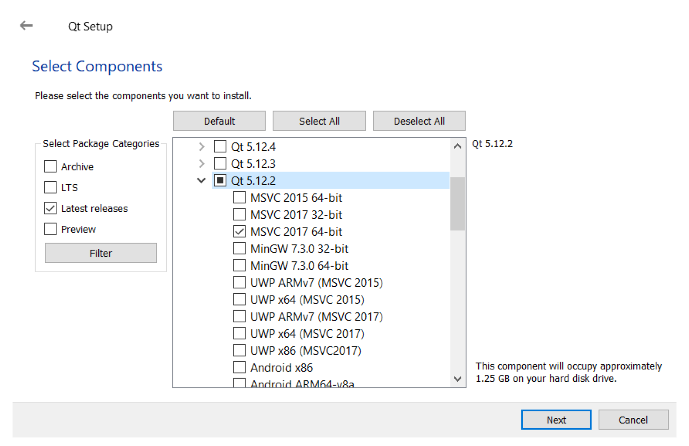

> 图六十八：安装 Qt 时，也会一并安装 Qt Designer。

如果您想安装 Qt Creator，它列在“开发者和设计师工具”类别下。令人困惑的是，Qt Designer 并未包含在此类别中。


> 图六十九：正在安装 Qt Creator 组件

### macOS系统

Qt Designer 在 macOS Qt 安装程序中未被提及，但会在安装任何版本的 Qt 核心库时自动安装。请从 Qt 官网下载安装程序——您可以选择开源版本。

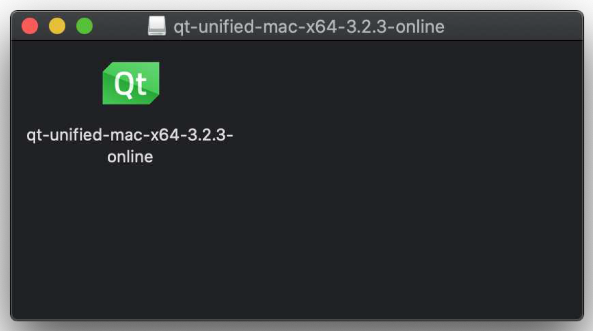

> 图七十：您会在下载的 `.dmg` 文件中找到安装程序。

请您打开安装程序以开始安装。继续操作直至出现选择安装组件的界面。然后，在最新版本的Qt下选择macOS安装包。


> 图七十一：您只需使用最新版本的macOS安装包即可。

安装完成后，请打开您安装 Qt 的文件夹。Designer 的启动程序位于 `<版本>/clang_64/bin` 目录下。您会发现 QtCreator 也安装在 Qt 安装文件夹的根目录中。

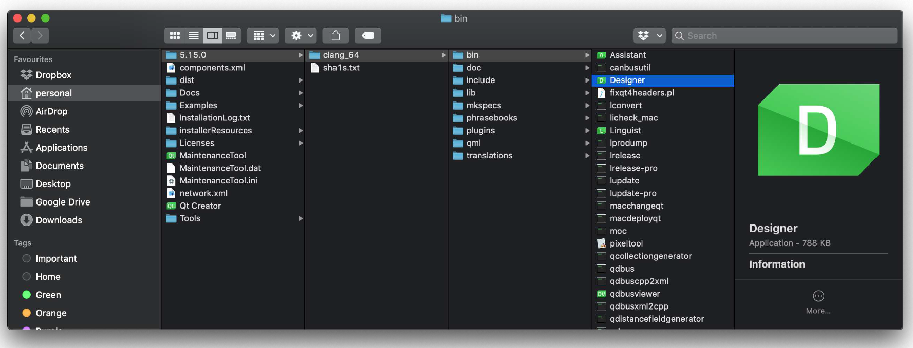

> 图七十二：您可以在 `<版本>/clang_64/bin` 文件夹下找到Designer启动器。

您可以直接从当前位置运行Designer，或将其移动到Applications文件夹中，以便通过macOS启动台启动。

### Linux (Ubuntu & Debian)

您可以通过包管理器安装 Qt Designer。根据您的发行版和版本，您可以使用 Qt5 Designer 或 Qt6 Designer。您可以使用其中任何一个来开发 PyQt6 的用户界面设计。

您可以使用以下命令安装 Qt5 Designer：

```bash
sudo apt-get install qttools5-dev-tools
```

同理，您也可以安装Qt6 Designer，这次用：

```bash
sudo apt-get install designer-qt6
```

安装完成后，Qt Designer 将出现在启动器中。

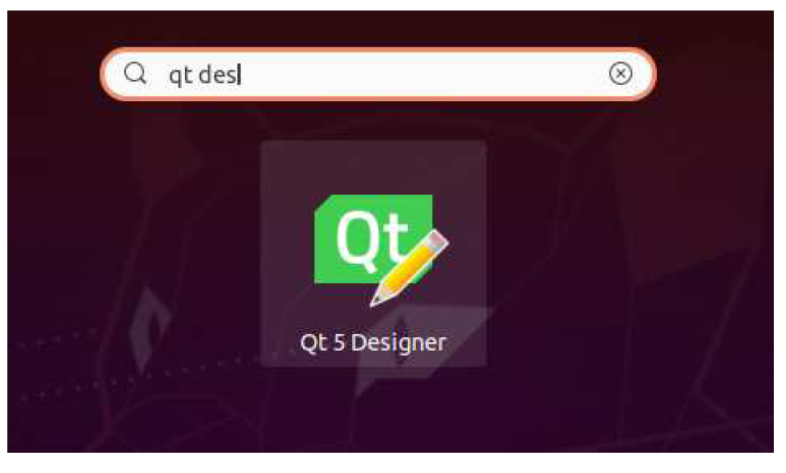

> 图七十三：在 Ubuntu 启动器中的Qt Designer 

## 12. 开始使用 Qt Designer

在本章中，我们将快速了解如何使用 Qt Designer 设计用户界面，并将其导出以在您的 PyQt6 应用程序中使用。这里我们仅会简要介绍Qt Designer 的基本功能。一旦您掌握了基础知识，便可以自行进一步探索和尝试。

打开 Qt Designer，您将看到主窗口。设计器可通过左侧的选项卡访问。然而，要激活此功能，您首先需要开始创建一个 `.ui` 文件。

### Qt Designer

Qt Designer 启动时会显示“新建表单”对话框。在这里，您可以选择要构建的界面类型——这决定了您将构建界面的基础控件。如果您要启动一个应用程序，则“主窗口”通常是正确的选择。但是，您也可以为对话框和自定义复合控件创建 `.ui` 文件。


> 表单是用户界面布局的术语，因为许多用户界面与带有各种输入框的纸质表单相似。

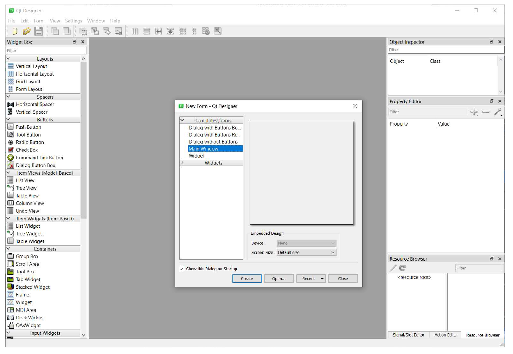

> 图七十四：Qt Designer 界面

点击“Create”，将创建一个新用户界面，其中包含一个空的控件。现在，您可以开始设计应用程序了。

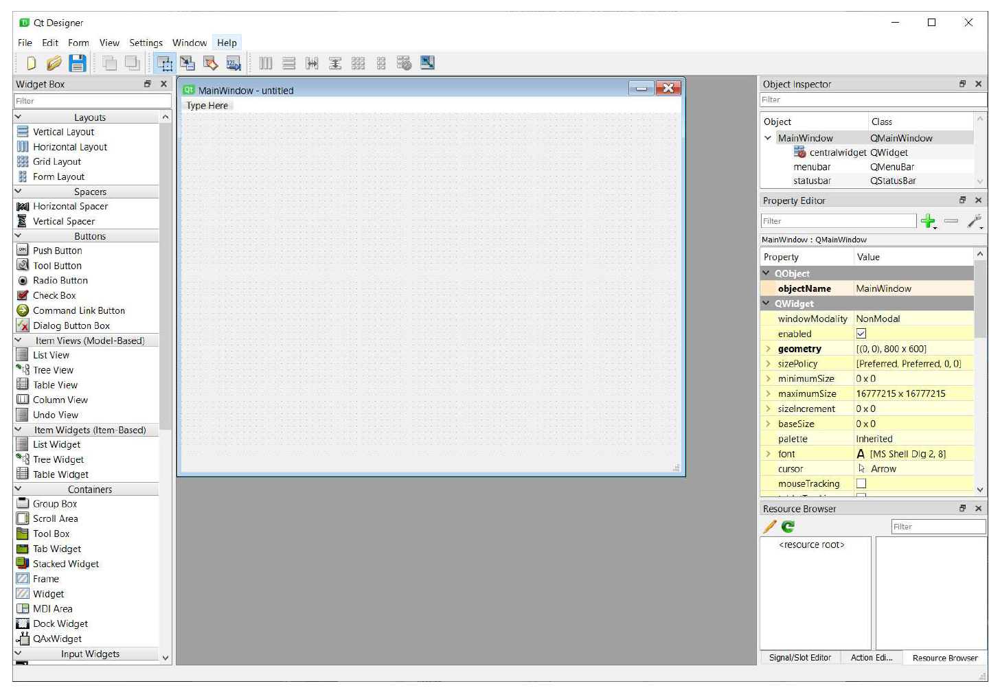

> 图七十五：Qt Designer 编辑器界面，其中包含一个空的 `QMainWindow` 控件。

### Qt Creator

如果您已安装 Qt Creator，界面和流程会略有不同。左侧有一个类似标签的界面，您可以从中选择应用程序的各种组件。其中之一是“Design”，它会在主面板中显示 Qt Designer。

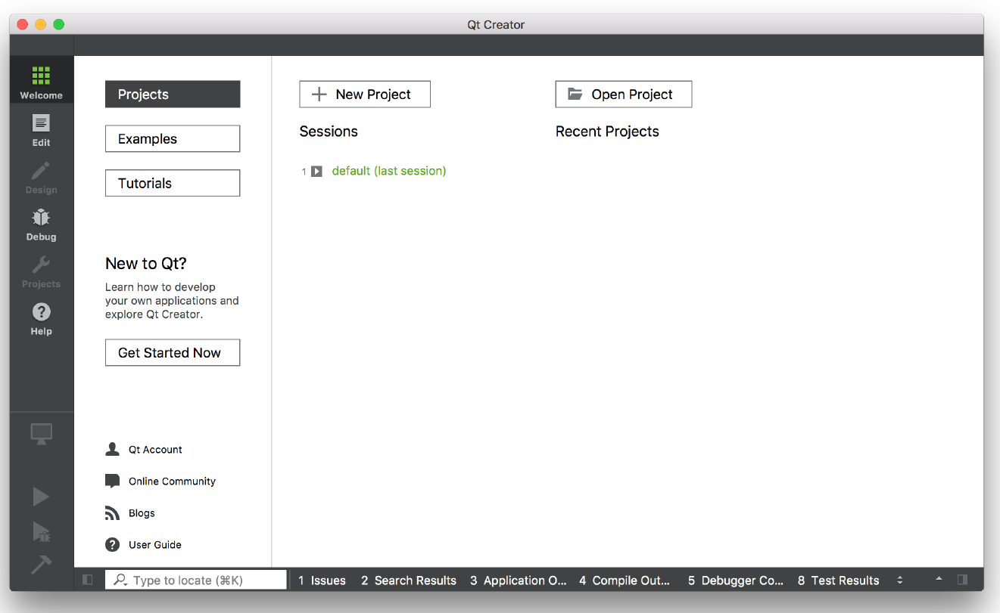

> 图七十六：Qt Creator 界面，左侧选中“Design”部分。QtDesigner 界面与嵌套的 Designer 界面完全相同。


> Qt Designer 的所有功能均可在 Qt Creator 中使用，但用户界面的某些方面有所不同。

要创建一个 `.ui` 文件，请转到“File → New File”或"Project…"在弹出的窗口中在左侧的“Files and Classes”下选择“Qt”，然后在右侧选择“Qt Designer Form”。您会注意到图标上标有“ui”，表明您正在创建的文件类型。

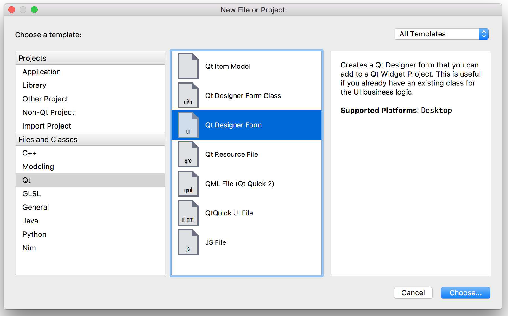

> 图七十七：创建一个新的 Qt .ui 文件。

下一步，系统会询问您要创建哪种类型的用户界面。对于大多数应用程序而言，主窗口"Main Window"是正确的选择。但是，您也可以为其他对话框创建 .ui文件，或使用 `QWidget`（列为“Widget”）构建自定义控件。

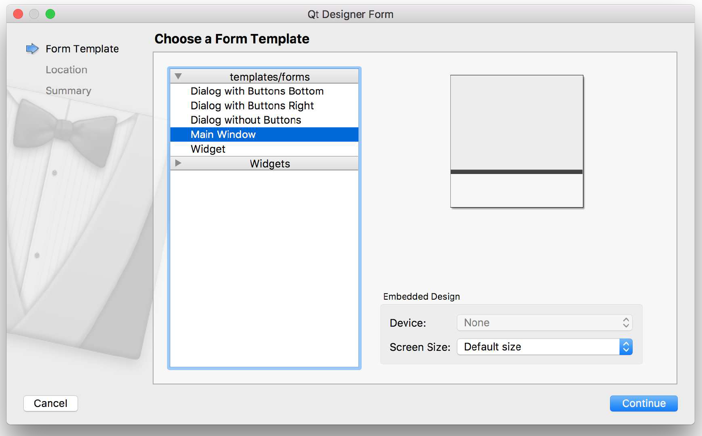

> 图七十八：选择要创建的控件类型，对于大多数应用程序而言，此选项为“Main Window”

接下来，您应该为您的文件选择一个文件名和保存文件夹。将您的 `.ui` 文件保存为与您将要创建的类相同的名称，这样可以使后续命令更加简单。

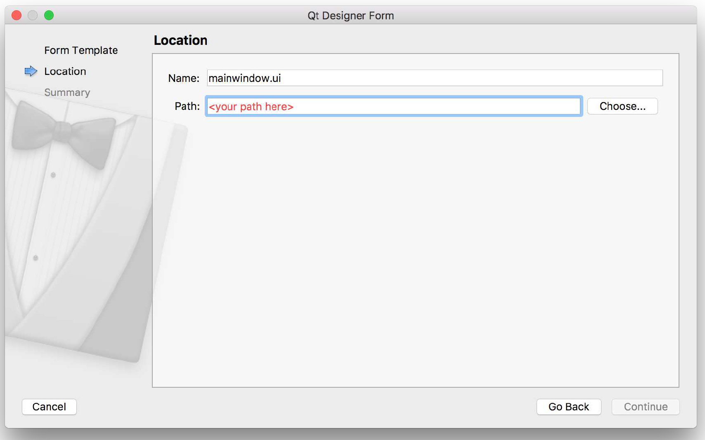

> 图七十九：选择文件的保存名称和文件夹。

最后，如果您正在使用版本控制系统，您可以选择将文件添加到其中。您可以跳过这一步——这不会影响您的用户界面。

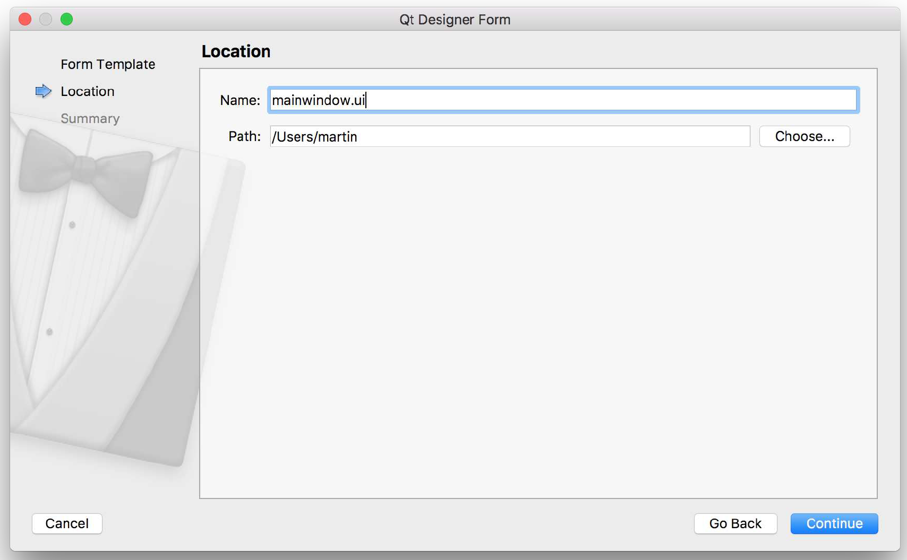

> 图八十：可以选择将文件添加到您的版本控制系统中，例如 Git。

### 设计您的主窗口布局

您将在用户界面设计器中看到新创建的主窗口。初始状态下没什么可看的，只有一个灰色工作区代表窗口，以及窗口菜单栏的初步框架。

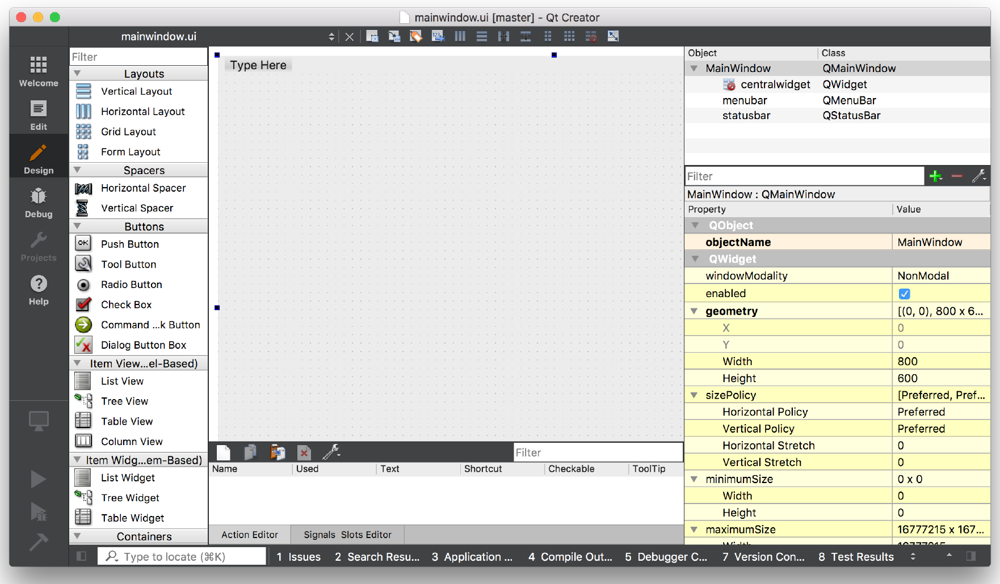

> 图八十一：创建的主窗口的初始视图。

您可以通过点击窗口并拖动每个角落的蓝色手柄来调整窗口大小。

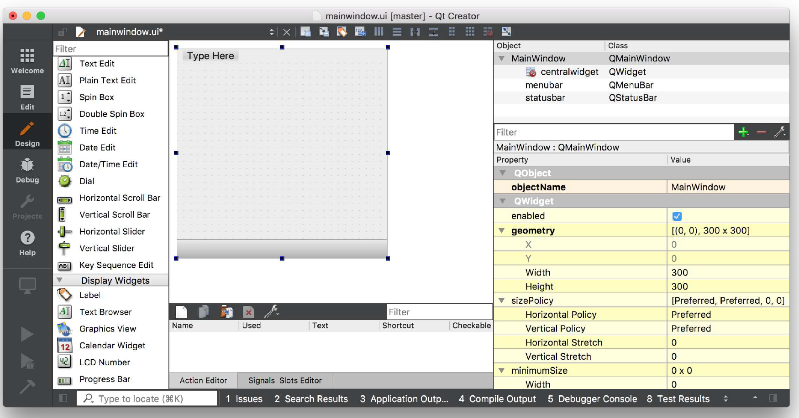

> 图八十二：主窗口的尺寸被调整为300×300像素。

构建应用程序的第一步是向窗口添加一些控件。在我们的第一个应用程序中，我们了解到，要设置 `QMainWindow` 的中央控件，需要使用 `.setCentralWidget()`。我们还了解到，要添加多个控件并使用布局，需要一个中间 `QWidget` 来应用布局，而不是直接将布局添加到窗口。

Qt Designer 会自动为您处理这一点，尽管它并不特别明显地显示出来。

要将多个控件以布局形式添加到主窗口，首先您应该将控件拖到 `QMainWindow` 上。这里我们拖了一个 `QLabel` 和一个 `QPushButton`，将它们放在哪里并不重要。

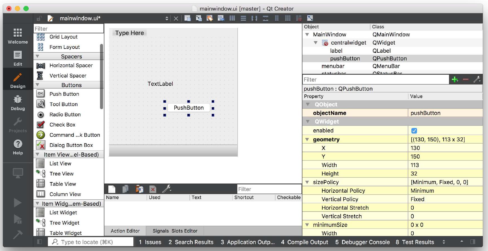

> 图八十三：主窗口已添加1个标签和1个按钮。

我们将 2 个控件拖到窗口中，这样它们就成为了窗口的子元素。现在，我们可以应用一个布局了。

在右侧面板中找到 `QMainWindow`（它应该位于最上方）。在其下方，您会看到代表窗口中央控件的 `centralwidget`。中央控件的图标显示了当前应用的布局。最初，该图标上有一条红色的圆圈交叉线，表明没有激活的布局。右键单击`QMainWindow` 对象，并在弹出的下拉菜单中找到“布局”。

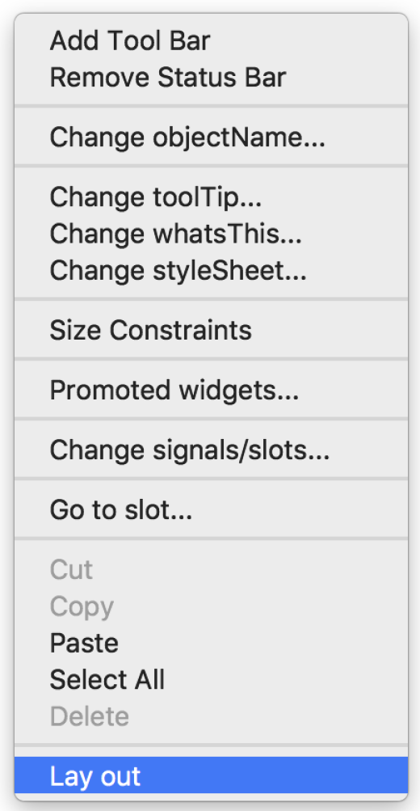

> 图八十四：请您右键点击主窗口，然后选择"lay out."。

接下来，您将看到可应用于窗口的布局列表。选择“Lay Out Horizontally”，该布局将应用于控件。

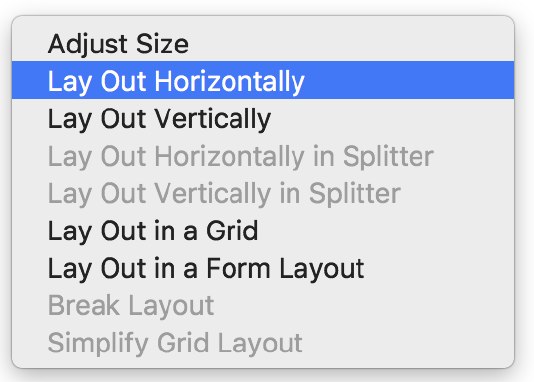

> 图八十五：选择要应用于主窗口的布局。

所选布局将应用于 `QMainWindow` 的中央控件，然后将控件添加到布局中，并根据布局进行布局。

请注意，您可以在布局中拖动和重新排列控件，它们会根据布局限制进行切换和移动。您还可以选择完全不同的布局，这对于原型设计和尝试新想法非常方便。


> 不要在没有控件的情况下尝试添加布局。布局将缩小到零大小，无法选择！

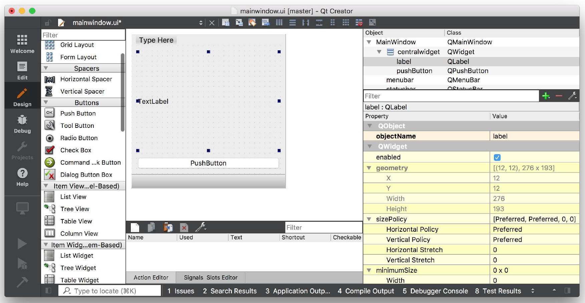

> 图八十六：垂直布局应用于主窗口上的控件。

我们已经使用Qt Designer创建了一个非常简单的用户界面。下一步是将这个用户界面集成到我们的Python代码中，并利用它来构建一个可运行的应用程序。

首先保存您的 `.ui` 文件——默认情况下，它将保存为您在创建时选择的位置，尽管您可以选择其他位置。 `.ui` 文件采用XML 格式。要在 Python 中使用我们的 UI，我们可以直接从 Python 加载它，或首先使用 `pyuic6` 工具将其转换为 Python `.py` 文件。

### 在 Python 中加载您的 `.ui` 文件

要加载 `.ui` 文件，我们可以使用 PyQt6 附带的 `uic` 模块，具体来说是`uic.loadUI()` 方法。该方法接受 UI 文件的文件名，并加载它以创建一个功能完整的 PyQt6 对象。

*Listing 88. designer/example_1.py*

```python
import os
import sys

from PyQt6 import QtWidgets, uic

basedir = os.path.dirname(__file__)

app = QtWidgets.QApplication(sys.argv)

window = uic.loadUi(os.path.join(basedir, "mainwindow.ui"))
window.show()
app.exec()
```

要从现有控件（例如 `QMainWindow`）的 `__init__` 块加载用户界面，可以使用 `uic.loadUI(filename, self)`。

*Listing 89. designer/example_2.py*

```python
import os
import sys

from PyQt6 import QtCore, QtGui, QtWidgets, uic

basedir = os.path.dirname(__file__)


class MainWindow(QtWidgets.QMainWindow):
    def __init__(self, *args, **kwargs):
        super().__init__(*args, **kwargs)
        uic.loadUi(os.path.join(basedir, "mainwindow.ui"), self)
        
        
app = QtWidgets.QApplication(sys.argv)
window = MainWindow()
window.show()
app.exec()
```

### 将您的 `.ui` 文件转换为 Python 文件

要生成 Python 输出文件，我们可以使用 PyQt6 命令行工具 `pyuic6` 。我们运行此工具时，需要传入 `.ui` 文件的文件名以及输出目标文件名，并使用 `-o` 参数。以下命令将生成一个名为 `MainWindow.py` 的 Python 文件，其中包含我们创建的 UI。我使用驼峰命名法（CamelCase）来提醒自己这是一个 PyQt6 类文件。

```bash
pyuic6 mainwindow.ui -o MainWindow.py
```

您可以使用编辑器打开生成的 `MainWindow.py` 文件进行查看，不过不建议您修改此文件——若您进行修改，当您通过 Qt Designer 重新生成用户界面时，所有更改都将丢失。使用 Qt Designer 的优势在于，您可以边开发边对应用程序进行编辑和更新。

### 构建您的应用程序

导入生成的 Python 文件与导入其他文件的方式相同。您可以按照以下方式导入您的类。`pyuic6` 工具会在 Qt Designer 中定义的对象名称前添加 `Ui_`，而您需要导入的正是这个对象。

```python
from MainWindow import Ui_MainWindow
```

要创建应用程序的主窗口，请像往常一样创建一个类，但需要同时继承自 `QMainWindow` 和您导入的 `Ui_MainWindow` 类。最后，在` __init__` 方法中调用 `self.setupUi(self)` 以触发界面设置。

就是这样。您的窗口现已完全设置完毕。

### 添加应用程序逻辑

您可以像使用代码创建的控件一样，与通过 Qt Designer 创建的控件进行交互。为了简化操作，`pyuic6` 将所有控件都添加到窗口对象中。


> 对象的名称可以通过Qt Designer找到。您只需在编辑器窗口中单击该对象，然后在属性面板中查找 `objectName` 。

在下面的示例中，我们将使用生成的主窗口类构建一个可工作的应用程序。

*Listing 90. designer/compiled_example.py*

```python
import random
import sys

from PyQt6.QtCore import Qt
from PyQt6.QtWidgets import QApplication, QMainWindow

from MainWindow import Ui_MainWindow


class MainWindow(QMainWindow, Ui_MainWindow):
    def __init__(self):
        super().__init__()
        self.setupUi(self)
        self.show()

        # 您仍然可以在代码中覆盖 UI 文件中的值
        # 如果可能的话，请在 Qt Creator 中进行设置。请查看属性面板
        f = self.label.font()
        f.setPointSize(25)
        self.label.setAlignment(
            Qt.AlignmentFlag.AlignHCenter
            | Qt.AlignmentFlag.AlignVCenter
        )
        self.label.setFont(f)
        
        # UI 控件的信号可以照常连接。
        self.pushButton.pressed.connect(self.update_label)
        
    def update_label(self):
        n = random.randint(1, 6)
        self.label.setText("%d" % n)
        
        
app = QApplication(sys.argv)
w = MainWindow()
app.exec()
```

请注意，由于我们在 Qt Designer `.ui` 定义中未设置字体大小和对齐方式，因此必须使用代码手动设置。您可以像之前一样，通过这种方式更改任何控件参数。但是，通常最好在 Qt Designer 本身中配置这些内容。

您可以通过窗口右下角的属性面板设置任何控件属性。大多数控件属性都显示在此处，例如，下面我们正在更新 `QLabel` 控件上的字体大小——

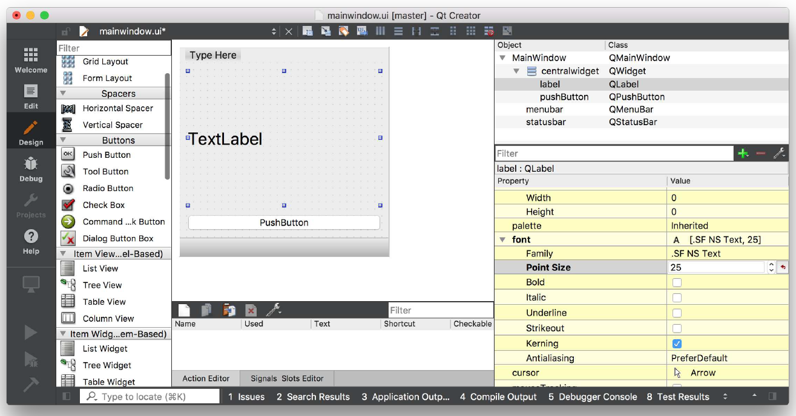

> 图八十七：设置QLabel的字体大小。

您还可以配置对齐方式。对于复合属性（您可以设置多个值，例如左对齐 + 中间对齐），它们是嵌套的。

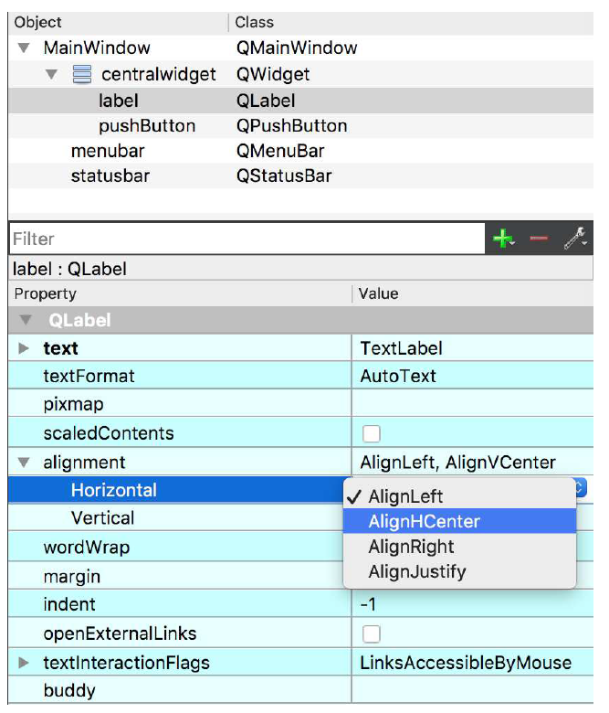

> 图八十八：详细字体属性。

所有对象属性均可在两个地方进行编辑——具体选择权在您手中，您可以选择在代码中进行特定修改，或在Qt Designer中进行修改。作为一般原则，建议将动态更改保留在代码中，而将基础或默认状态保留在设计的用户界面中。

本介绍仅涉及 Qt Designer 功能的一小部分。我强烈建议您深入探索并尝试——请记住，您仍然可以在之后通过代码添加或调整控件。

### 美学

如果您不是设计师，创建吸引人且直观的界面可能会很困难，甚至您可能不知道它们是什么。幸运的是，有一些简单的规则您可以遵循来创建界面，即使它们不一定漂亮，至少不会难看。关键概念是——对齐、分组和空间。

**对齐**是为了减少视觉噪声。将控件的角视为对齐点，并尽量减少用户界面中不和谐的对齐点数量。实际上，这意味着确保界面中元素的边缘相互对齐。

如果输入大小不同，请您将它们与读取的边缘对齐。

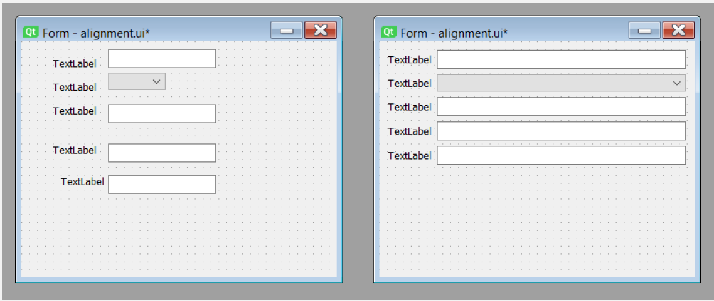

> 对齐对界面清晰度的影响

*英语是左至右书写的语言，因此如果您的应用程序使用英语，请将文本对齐到左侧。*

相关控件**组**会获得上下文，这样会使其更易于理解。所以，在您构建界面时，请将相关元素放在一起。

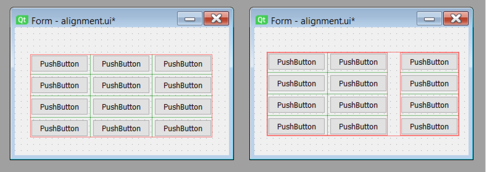

> 分组元素并在组之间添加间隔

**空间**是创建界面中视觉上区分的区域的关键——如果没有空间来分隔组件，就无法形成组件！请您务必保持间距的一致性和合理性。

---

**请务必**使用对齐功能来减少界面中的视觉干扰。

**请务必**将相关的控件分组到逻辑集里。

**请务必**在组之间添加一致的间距，以明确结构。