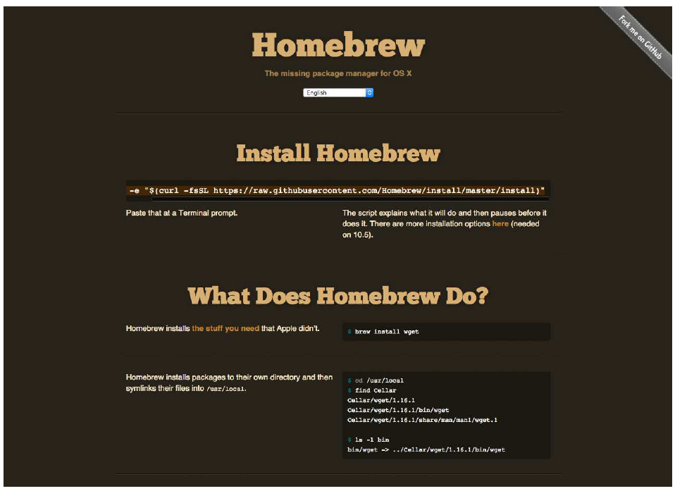

---
prev:
  text: '42. Moonsweeper'
  link: '/ExampleApplications/42'
next:
  text: '附录B：将 C++ 示例翻译为 Python'
  link: '/Appendix/B'
---

## 附录A：安装 PyQt6

在开始编码之前，您需要先在系统上安装好 PyQt6。如果尚未安装 PyQt6，以下各节将指导您在 Windows、macOS 和 Linux 系统上完成安装。


> 请注意，以下说明**仅**适用于安装**GPL 许可**版本的 PyQt。如果您需要在非 GPL 项目中使用 PyQt，您需要从 [Riverbank Computing](https://www.riverbankcomputing.com/) 购买替代许可以发布您的软件。

## 在 Windows 系统上的安装

PyQt6 对于 Windows 系统的安装方式与其他应用程序或库类似。自 Qt 5.6 起，可通过 Python 包存档（PyPi）安装 PyQt6。要从 Python 3 安装 PyQt6，只需运行以下命令：

```bash
pip3 install pyqt6
```

安装完成后，您应该能够运行 Python 并导入 PyQt6。

请注意，如果您想使用 Qt Designer 或 Qt Creator，您需要从 [Qt 下载网站](https://qt.io/download) 下载这些工具。

## 在 macOS 系统上的安装

如果您已经在 macOS 上安装了可用的 Python 3，您可以继续安装 PyQt6，就像安装其他 Python 包一样，使用以下命令：

```bash
pip3 install pyqt6
```

如果您尚未安装 Python 3，则需要先进行安装。您可以从 [Python 官方网站](https://www.python.org/) 下载适用于 macOS 的 Python 3 安装程序。安装完成后，您应能够使用上述 `pip3 install` 命令安装PyQt6。

另一个选择是使用Homebrew。Homebrew是macOS上用于管理命令行软件的包管理器。Homebrew的仓库中同时提供了Python 3和PyQt6。



> 图274：Homebrew — macOS 系统中缺失的包管理器

要安装 Homebrew，请在命令行中执行以下操作：

```bash
ruby -e "$(curl -fsSL https://raw.githubusercontent.com/Homebrew/install/master/install)"
```


> 您也可以从Homebrew的官网复制并粘贴此内容。

安装 Homebrew 后，您可以使用以下命令安装 Python：

```bash
brew install python3
```

安装 Python 后，您可以像往常一样安装 PyQt6，使用 `pip3 install pyqt6`，或者选择使用 Homebrew 进行安装，使用：

```bash
brew install pyqt6
```

## 在 Linux 系统上的安装

在 Linux 上安装 PyQt6 的最简单方法是使用 Python 的 pip 包管理工具，与安装其他包的方式相同。对于 Python 3 安装，我们通常称为 pip3。

```bash
pip3 install pyqt6
```

安装完成后，您应该能够运行 python3（或 python，具体取决于您的系统）并导入 PyQt6。
