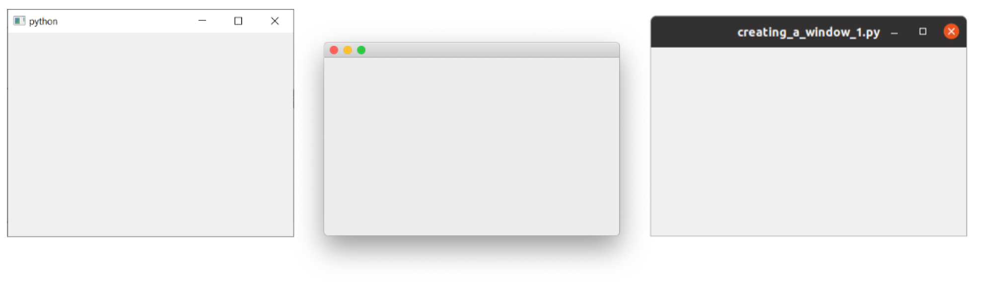
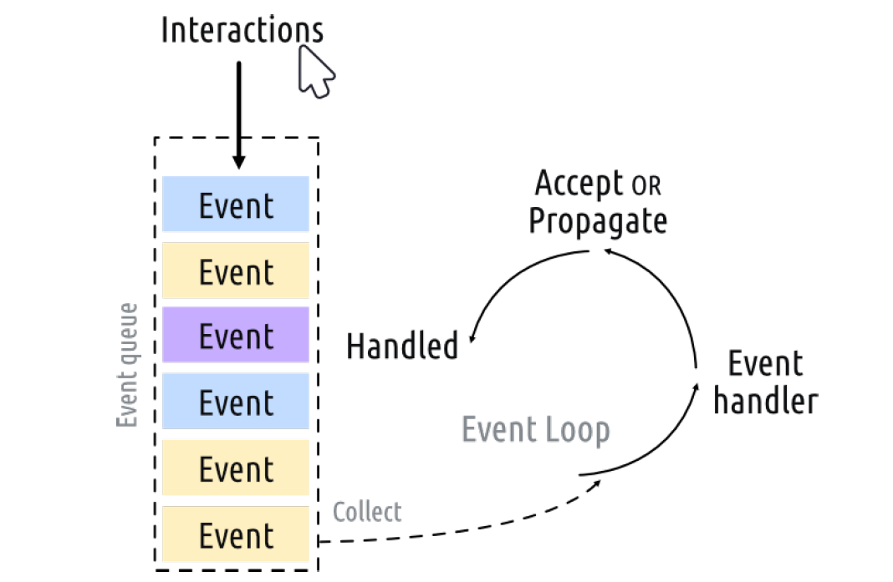
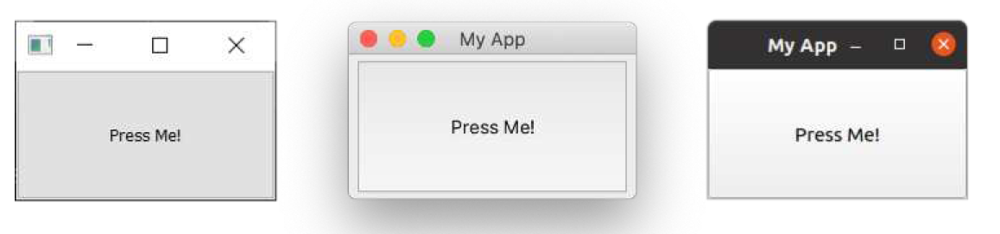

---
prev:
  text: '2. 关于Qt的一点小知识'
  link: '/Introduction/2'
next:
  text: '4. 信号与槽'
  link: '/BasicPyQt6Features/4'
---

# PyQt6 基本功能

现在是时候迈出使用PyQt6创建图形用户界面的第一步了！

在本章中，您将学习PyQt6的基础知识，这些知识是您创建任何应用程序的基础。我们将开发一个简单的桌面窗口应用程序。我们将添加控件，使用布局进行排列并将这些控件与函数连接，使您能够通过图形用户界面触发应用程序的行为。

请以提供的代码为指导，但还请随时自己动手尝试。 这就是学习这些代码如何工作的最好方法。


> 在我们开始之前，您需要安装一个可以正常运行的 PyQt6。如果您还没有安装，请查看 附录A：安装 PyQt6。


> 不要忘记下载本书的源代码[http://www.pythonguis.com/d/pyqt6-source.zip](http://www.pythonguis.com/d/pyqt6-source.zip)!

## 3. 我的第一个应用程序

让我们来创建第一个应用程序！首先，创建一个新的 Python 文件——您可以随意将其命名为您喜欢的任何名字（例如：`myapp.py`），然后将它保存在一个可以访问的地方。 我们将在这个文件中编写我们的简单应用程序。


> 我们将在此文件中进行编辑，您可能想要回到代码的早期版本，所以记得定期备份。

### 创建您的应用程序

我们的第一个应用程序的源代码如下所示。 请您逐词键入，注意不要出错。 如果您弄错了，Python 会告诉您哪里出错了。 如果您不想全部手动键入，这个文件包含在这本书的源代码中.

*Listing 1. basic/creating_a_window_1.py*

```python
from PyQt6.QtWidgets import QApplication, QWidget
# 仅用于访问命令行参数
import sys

# 每个应用程序需要一个（且只有一个）QApplication 实例
# 输入 sys.argv，这可以允许应用程序使用命令行参数
# 如果知道不会使用命令行参数,也可以使用 QApplication([])
app = QApplication(sys.argv)

# 创建一个 Qt widget作为我们的窗口。
window = QWidget()
window.show() # 这很重要!!!!! 默认情况下，窗口是隐藏的。

# 开始事件循环
app.exec()

# 您的应用程序不会到达这里，直到您退出并且事件循环终止
```

首先，启动您的应用程序。 您可以像任何其他 Python 脚本一样从命令行运行它，例如

```bash
python MyApp.py
```

或者，对于 Python 3

```bash
python3 MyApp.py
```

从现在起，您将看到下面的提示框，提示您运行应用程序并提示您接下来将看到什么。

> 🚀 **运行它吧!** 现在您将看到您的窗口。 Qt 会自动创建一个窗口，您可以拖动它并调整其大小,就像您见过的其他窗口那样。

您看到的内容取决于运行这个示例的平台。下图展示了在 *Windows*、*macOS* 和 *Linux (Ubuntu）*上显示的窗口。


> 图三: 我们分别在*Windows*、*macOS* 和 *Linux (Ubuntu）*上显示的窗口

### 代码中的步骤

让我们逐行地查看代码，以便准确地理解到底发生了什么。

首先，我们导入应用程序所需的 PyQt6 类。 这里我们导入 `QApplication`（应用程序处理程序）和 `QWidget`（基本的空 GUI控件)，这两个类都来自 `QtWidgets` 模块。

```python
from PyQt6.QtWidgets import QApplication, QWidget
```

Qt 的主要模块包括 `QtWidgets`、`QtGui` 和 `QtCore`。


> 您可以使用 `from <module> import *`，但这种全局导入在 Python 中通常是不受欢迎的，所以在这里我们将避免使用它

接下来，我们创建一个`QApplication` 实例，传入 `sys.arg`，即包含传递给应用程序的命令行参数的 Python列表

```python
app = QApplication(sys.argv)
```

如果您不会使用命令行参数来控制 Qt，您可以传递一个空列表，例如

```python
app = QApplication([])
```

接下来，我们使用变量名 `window` 来创建一个 `QWidget` 实例。

```python
window = QWidget()
window.show()
```

在 Qt 中，*所有* 顶层部件都是窗口，也就是说，它们没有父控件，也不嵌套在另一个控件或布局中。这意味着您可以在技术上使用任何您喜欢的控件来创建一个窗口。


> 我看不到我的窗口!
> 没有父类的小工具默认是不可见的。 因此，在窗口对象后，我们必须始终调用 `.show()` 来使其可见。 您可以移除 .show() 并运行应用程序，但您会无法退出！


> 什么是窗口？
>
> - 保存应用程序的用户界面
> - 每个应用程序至少需要一个（......但也可以有更多）
> - 默认情况下，当最后一个窗口关闭时，应用程序将退出

最后，我们调用 `app.exec()` 来开始事件循环。

### 什么是事件循环?

在屏幕上显示窗口之前，有几个有关 Qt 世界中应用程序的组织方式的关键概念需要介绍一下.如果您已经熟悉事件循环，就可以放心地跳到下一节。

每个 Qt 应用程序的核心都是 `QApplication` 类。 每个应用程序需要一个，且只需要一个 `QApplication` 对象才可以运行。 该对象包含应用程序的**事件循环**——管理所有图形用户界面交互的核心循环。



> 图4:Qt中的事件循环

与应用程序的每次交互——无论是按键、点击鼠标还是移动鼠标——都会产生一个事件，该事件被置于**事件队列**中。在事件循环中，每次迭代都会对队列进行检查，如果发现正在等侯的事件，程序就会将事件和控制权传递给特定的事件处理程序。事件处理程序会处理事件，然后将控制权传递回事件循环，等待处理更多事件。 每个应用程序只能由**一个**事件循环


> 有关`QApplication` 类……
>
> - `QApplication` 包含 Qt 事件循环
> - 需要一个 `QApplication` 实例
> - 您的应用程序将在事件循环中等待，直到有操作执行
> - 任何时候都只有**一个**事件循环

### `QMainWindow`

正如我们在上一部分中所发现的，在 Qt 中任何控件都可以是窗口。 例如，如果您使用 `QPushButton` 代替 `QtWidget`。 在下面的示例中，您将得到一个有一个可按下的按钮的窗口。

*Listing 2. basic/creating_a_window_2.py*

```python
import sys
from PyQt6.QtWidgets import QApplication, QPushButton

app = QApplication(sys.argv)

window = QPushButton("Push Me")
window.show()

app.exec()
```

这太棒啦，但其实用处不大——您很少需要一个只有一个控件的用户界面！ 但是，正如我们接下来会发现的，使用布局将部件嵌套到其他部件中的功能着您可以在一个空的 `QWidget`中构建复杂的用户界面。

不过，Qt 已经为您提供了解决方案——`QMainWindow`。 这是一个预制的窗口部件，它提供了大量您可能会使用的标准窗口功能，包括工具栏、菜单、状态栏、可停靠控件等。

我们稍后会了解这些高级功能，但现在，我们将为我们的应用程序添加一个简单的空白`QMainWindow` 窗口。

*Listing 3. basic/creating_a_window_3.py*

```python
from PyQt6.QtWidgets import QApplication, QMainWindow
import sys

app = QApplication(sys.argv)

window = QMainWindow()
window.show() # 这很重要!!!!! 默认情况下，窗口是隐藏的

# 开始事件循环
app.exec()
```

> 🚀 **运行它吧！** 您会看到您的主窗口。它看上去和之前的那个完全一致！

目前我们的 `QMainWindow` 并不太有趣。我们可以添加一些内容来改善它。如果您想创建一个自定义窗口，最好的方法是继承 `QMainWindow`，然后在 `__init__` 块中包含窗口的设置。这使得窗口的行为可以自包含。我们可以添加我们自己的 `QMainWindow` 子类——为了简单起见，我们称它为 `MainWindow`。

*Listing 4. basic/creating_a_window_4.py*

```python
import sys
from PyQt6.QtCore import QSize, Qt
from PyQt6.QtWidgets import (
    QApplication,
    QMainWindow,
    QPushButton,
) #1

# 创建子类 QMainWindow 来自定义您的应用程序的主窗口
class MainWindow(QMainWindow):
    def __init__(self):
        super().__init__() #2
        
        self.setWindowTitle("My App")
        
        button = QPushButton("Press Me!")
        
        # 设置窗口的中心控件
        self.setCentralWidget(button) #3
        
        
app = QApplication(sys.argv)

window = MainWindow()
window.show()

app.exec()
```

> 1. 常用的 Qt 控件总是从 `QtWidgets` 命名空间导入。
> 2. 我们必须始终调用 `super()` 类的 `__init__`方法。
> 3. 使用 `.setCentralWidget` 在 `QMainWindow` 中放置一个控件。


> 当您子类化一个 Qt 类时，您必须始终调用`super`函数`__init__`以便 Qt 设置对象。

在我们的 `__init__` 块中，我们首先使用 `.setWindowTitle()` 来更改我们主窗口的标题。 然后，我们将第一个窗口控件——一个 `QPushButton` 添加到窗口中间。这是 Qt 中可用的基本部件之一。 在创建按钮时，您可以输入希望按钮显示的文本。

最后，我们在窗口上调用 `.setCentralWidget()`。 这是 `QMainWindow` 特有的函数，用于设置窗口中间的控件。

> 🚀 **运行它吧！** 您会再一次看到您的主窗口，但是这次`QPushButton`控件会显示在中央。按下按钮，但是什么也不会发生，我们将会稍后来调整



> 图五：显示在*Windows*，*macOS*和*Linux*上面的含有一个`QPushButton`的`QMainWindow`


> 渴望使用控件？
> 我们稍后会详细介绍更多控件，但如果您没有耐心，想先睹为快的话，可以看看[QWidget 文档](http://doc.qt.io/qt-5/widget-classes.html#basic-widget-classes)。 尝试将不同的控件添加到您的窗口！

### 调整窗口和控件的大小

当前窗口可自由调整大小——您只需用鼠标抓住窗口任何一个角，即可拖动并调整窗口大小至任意尺寸。虽然允许用户调整应用程序大小是件好事，但有时您可能需要对最小或最大尺寸设置限制，或将窗口锁定为固定大小。

在 Qt 中，尺寸通过 `QSize `对象进行定义。该对象依次接受宽度和高度参数。例如，以下代码将创建一个固定尺寸的 400x300 像素窗口。

*Listing 5. basic/creating_a_window_end.py*

```python
import sys

from PyQt6.QtCore import QSize, Qt
from PyQt6.QtWidgets import QApplication, QMainWindow, QPushButton

# 创建子类 QMainWindow 来自定义您的应用程序的主窗口
class MainWindow(QMainWindow):
    def __init__(self):
        super().__init__()
        
        self.setWindowTitle("My App")
        
        button = QPushButton("Press Me!")
        
        self.setFixedSize(QSize(400, 300)) #1
        
        # 设置窗口的中心控件
        self.setCentralWidget(button)
        
app = QApplication(sys.argv)

window = MainWindow()
window.show()

app.exec()
```

> 1. 设置窗口大小

> 🚀 **运行它吧！** 您会看到一个固定大小的窗口——试着去调整大小吧，这不会成功的


> 图六：我们的固定大小的窗口，注意最大化控件在*Windows* 和 *Linux* 上被禁用。 在 *macOS* 上，您可以将应用程序最大化以填满屏幕，但是
> 中央控件不会被调整大小。

除了可以调用 `.setFixedSize()` 方法外，您还可以调用 `.setMinimumSize()` 和`.setMaximumSize() `方法分别设置窗口的最小和最大尺寸。您不妨亲自尝试一下！


> 您可以用在任意控件中使用这种方法

在本节中，我们介绍了 `QApplication` 类、`QMainWindow` 类、事件循环，并尝试将一个简单的控件添加到窗口中。在下一节中，我们将了解 Qt 为控件和窗口之间以及控件和窗口与您自己的代码之间的通信提供的机制。


> 请将文件的副本保存为 `myapp.py`，我们稍后还会用到它。