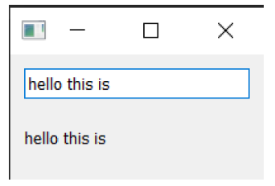

---
prev:
  text: '3. 我的第一个应用程序'
  link: '/BasicPyQt6Features/3'
next:
  text: '5. 控件'
  link: '/BasicPyQt6Features/5'
---

## 4. 信号与槽

到目前为止，我们已经创建了一个窗口，并添加了一个简单的按钮控件，但该按钮没有任何功能。这完全没有用啊——当您创建图形用户界面应用程序时，通常一定希望它们能够执行某些操作！我们需要一种方法，将按下按钮的操作与执行某些操作联系起来。在Qt 中，信号和槽提供了这种功能。

信号是控件在发生某些事件时发出的通知。这些事件可以是按下按钮、输入框中文本的变化、窗口文本的变化等等任何事情。许多信号是由用户操作触发的，但这并不是一条死板的规则。

除了通知发生的事件外，信号还可以发送数据，并提供有关发生的事件的更多背景信息。


>  您还可以创建自己的自定义信号，我们将在之后的“32. 扩展信号”中进行探讨。

槽是 Qt 用于接收信号的名称。在 Python 中，应用程序中的任何函数（或方法）都可以用作槽——只需将信号连接到它即可。如果信号发送数据，则接收函数也会接收到该数据。许多 Qt 控件也有自己的内置槽，这意味着您可以直接将 Qt 控件连接在一起。

让我们来看看 Qt 信号的基本知识以及如何使用它们将控件连接起来以便在应用程序中实现各种功能。


> 请加载一份新的 `myapp.py` 文件用于本节内容并以新名称保存

### `QPushButton`的信号

我们简单的应用程序目前有一个 `QMainWindow`，其中 `QPushButton` 被设置为中央控件。首先，我们将这个按钮与一个自定义的 Python 方法连接起来。在这里，我们创建了一个名为 `the_button_was_clicked` 的简单自定义槽，它接受来自 `QPushButton` 的点击信号。

*Listing 6. basic/signals_and_slots_1.py*

```python
from PyQt6.QtWidgets import (
    QApplication,
    QMainWindow,
    QPushButton,
) #1

import sys

class MainWindow(QMainWindow):
    def __init__(self):
        super().__init__() #2
        
        self.setWindowTitle("My App")
        
        button = QPushButton("Press Me!")
        button.setCheckable(True)
        button.clicked.connect(self.the_button_was_clicked)
        
		# 设置窗口的中心控件
        self.setCentralWidget(button)
        
	def the_button_was_clicked(self):
        print("Clicked!")
        
        
app = QApplication(sys.argv)

window = MainWindow()
window.show()

app.exec()
```

> 🚀 **运行它吧！** 如果您点击这个按钮您将会在控制台中看到文本”Clicked!“

*控制台输出*

```text
Clicked!
Clicked!
Clicked!
Clicked!
```

### 接收数据

这真是一个很好的开始！我们已经知道信号还可以发送**数据**，以提供更多关于刚刚发生的事件的信息。`.clicked` 信号也不例外，它还提供了按钮的选中（或切换）状态。对于普通按钮，该状态始终为 `False`，因此我们的第一个槽忽略了这些数据。但是，我们可以让按钮**可选中**，然后看看效果。

在下面的示例中，我们将添加第二个槽用于输出**检查状态**。

*Listing 7. basic/signals_and_slots_1b.py*

```python
import sys

from PyQt6.QtWidgets import (
	QApplication,
	QMainWindow,
	QPushButton,
) #1

class MainWindow(QMainWindow):
    def __init__(self):
        super().__init__() #2
        
        self.setWindowTitle("My App")
        
        button = QPushButton("Press Me!")
        button.setCheckable(True)
        button.clicked.connect(self.the_button_was_clicked)
        button.clicked.connect(self.the_button_was_toggled)
        
        # 设置窗口的中心控件
        self.setCentralWidget(button)
        
    def the_button_was_clicked(self):
        print("Clicked!")
        
    def the_button_was_toggled(self, checked):
        print("Checked?", checked)
        
        
app = QApplication(sys.argv)

window = MainWindow()
window.show()

app.exec()
```

> 🚀 **运行它吧！** 如果您点击了这个按钮，您将会看到它在被点击之后高亮了。请再次点击它然后松开，并在控制台中检查状态

*控制台输出*

```text
Clicked!
Checked? True
Clicked!
Checked? False
Clicked!
Checked? True
Clicked!
Checked? False
Clicked!
Checked? True
```

您可以将任意数量的槽连接到一个信号，并可以在槽上同时响应不同版本的信号。

### 存储数据

通常，将控件的当前状态存储在 Python 变量中非常有用。这样就可以像处理其他 Python 变量一样处理这些值而无需访问原始控件。您可以将这些值存储为单独的变量，或者根据需要使用字典。在下一个示例中，我们将按钮的选中值存储在名为 `button_is_checked` 的变量中。

*Listing 8. basic/signals_and_slots_1c.py*

```python
class MainWindow(QMainWindow):
    def __init__(self):
        super().__init__()
        
        self.button_is_checked = True #1
        
        self.setWindowTitle("My App")
        
        button = QPushButton("Press Me!")
        button.setCheckable(True)
        button.clicked.connect(self.the_button_was_toggled)
        button.setChecked(self.button_is_checked) #2
        
        # 设置窗口的中心控件
        self.setCentralWidget(button)
        
    def the_button_was_toggled(self, checked):
        self.button_is_checked = checked #3
        
        print(self.button_is_checked)
```

> 1. 为变量设置默认值。
> 2. 使用默认值设置控件的初始状态。
> 3. 当控件状态发生变化时，更新变量以匹配。

您可以对任何 PyQt6 控件使用相同的模式。如果控件未提供发送当前状态的信号，则您需要在处理程序中直接从控件检索该值。例如，这里我们正在检查按下处理程序中的**选中**状态。

*Listing 9. basic/signals_and_slots_1d.py*

```python
class MainWindow(QMainWindow):
    def __init__(self):
        super().__init__()
        
        self.button_is_checked = True
        
        self.setWindowTitle("My App")
        
        self.button = QPushButton("Press Me!") #1
        self.button.setCheckable(True)
        self.button.released.connect(
            self.the_button_was_released
        ) #2
        self.button.setChecked(self.button_is_checked)
        
        # 设置窗口的中心控件
        self.setCentralWidget(self.button)
        
    def the_button_was_released(self):
        self.button_is_checked = self.button.isChecked() #3
        
        print(self.button_is_checked)
```

> 1. 我们需要保留对按钮的引用，以便在我们的槽中访问它。
> 2. 释放信号在按钮释放时触发，但不会发送检查状态。
> 3. `.isChecked()` 返回按钮的检查状态。

### 更改界面

到目前为止，我们已经了解了如何接受信号并将输出打印到控制台。但是，当我们点击按钮时，如何在界面中触发某些操作呢？让我们更新槽方法来修改按钮，更改文本并禁用按钮，使其不再可点击。我们还将暂时删除可选状态。

*Listing 10. basic/signals_and_slots_2.py*

```python
from PyQt6.QtWidgets import QApplication, QMainWindow, QPushButton

import sys

class MainWindow(QMainWindow):
    def __init__(self):
        super().__init__()
        
        self.setWindowTitle("My App")
        
        self.button = QPushButton("Press Me!") #1
        self.button.clicked.connect(self.the_button_was_clicked)
        
        # 设置窗口的中心控件
        self.setCentralWidget(self.button)
        
    def the_button_was_clicked(self):
        self.button.setText("You already clicked me.") #2
        self.button.setEnabled(False) #3
        
        # 我们也来更改窗口标题
        self.setWindowTitle("My Oneshot App")
        
        
app = QApplication(sys.argv)

window = MainWindow()
window.show()

app.exec()
```

> 1. 我们需要在 `the_button_was_clicked` 方法中访问该按钮，因此我们将其引用保存在 `self` 中。
> 2. 您可以通过向 `.setText()` 方法传递一个字符串来更改按钮的文本。
> 3. 要禁用按钮，请调用 `.setEnabled()` 方法并传入 False。

> 🚀 **运行它吧！** 如果您单击按钮，文本将发生变化并且按钮将将变得不可点击。

您并不局限于更改触发信号的按钮，您可以在槽方法中做任何您想做的事情。例如，尝试将以下行添加到 `_button_was_clicked` 方法中，以同时更改窗口标题。

```python
self.setWindowTitle("A new window title")
```

大多数控件都有自己的信号，我们用于窗口的 `QMainWindow` 也不例外。

在下面的更复杂的示例中，我们将 `QMainWindow` 上的 `.windowTitleChanged` 信号连接到自定义槽方法 `the_window_title_changed`。该槽还会接收新窗口标题。

*Listing 11. basic/signals_and_slots_3.py*

```python
from PyQt6.QtWidgets import QApplication, QMainWindow, QPushButton

import sys
from random import choice

window_titles = [ 
    "My App",
    "My App",
    "Still My App",
    "Still My App",
    "What on earth",
    "What on earth",
    "This is surprising",
    "This is surprising",
    "Something went wrong",
] #1


class MainWindow(QMainWindow):
    def __init__(self):
        super().__init__()
        
        self.n_times_clicked = 0
        
        self.button = QPushButton("Press Me!")
        self.button.clicked.connect(self.the_button_was_clicked)
        
        self.windowTitleChanged.connect(
            self.the_window_title_changed
        ) #2
        
        # 设置窗口的中心控件
        self.setCentralWidget(self.button)
        
    def the_button_was_clicked(self):
        print("Clicked.")
        new_window_title = choice(window_titles)
        print("Setting title: %s" % new_window_title)
        self.setWindowTitle(new_window_title) #3
        
    def the_window_title_changed(self, window_title):
        print("Window title changed: %s" % window_title) #4
        
        if window_title == "Something went wrong":
            self.button.setDisabled(True)
            
            
app = QApplication(sys.argv)

window = MainWindow()
window.show()

app.exec()
```

> 1. 使用 random.choice() 从窗口标题列表中进行选择。
> 2. 将我们的自定义槽方法 `the_window_title_changed` 连接到 windows的`.windowTitleChanged` 信号。
> 3. 将窗口标题设置为新标题。
> 4. 如果新窗口标题为“Something went wrong”（出现错误），则禁用该按钮。

> 🚀 **运行它吧！** 反复点击按钮，直到标题变为“Something went wrong”（出现错误）且按钮失效。

在这个例子中有几点值得注意。

首先，在设置窗口标题时，`windowTitleChanged` 信号**并不总是**被发出。只有当新标题与之前的标题**不同**时，该信号才会被触发。如果您多次设置相同的标题，该信号只会第一次被触发。


> 请务必仔细检查信号触发的条件，以免在应用程序中使用时出现意外。

其次，请注意我们如何使用信号将事物链接在一起。一个事件的发生——按下按钮——可以触发其他多个事件的发生。这些后续效应无需知道是什么原因导致它们发生，而是简单地遵循一些简单的规则。将效应与触发它们的原因分离是构建图形用户界面应用程序时需要考虑的关键因素之一。我们将在本书中多次提及这一点！

在本节中，我们介绍了信号和槽。我们演示了一些简单的信号，以及如何使用它们在应用程序中传递数据和状态。接下来，我们将介绍 Qt 为您的应用程序提供的控件以及它们提供的信号。

### 将控件直接连接在一起

到目前为止，我们已经看到了将控件信号连接到 Python 方法的示例。当控件触发信号时，我们的 Python 方法会被调用，并接收来自信号的数据。但您并不总是需要使用 Python 函数来处理信号——您也可以将 Qt 控件直接相互连接。

在下面的示例中，我们将一个 `QLineEdit` 控件和一个 `QLabel` 添加到窗口中。在窗口的 `__init__` 中，我们将我们的行编辑 `.textChanged` 信号连接到 `QLabel` 上的 `.setText` 方法。现在，每当 `QLineEdit` 中的文本发生更改时，`QLabel` 都会将该文本发送到其 `.setText` 方法。

*Listing 12. basic/signals_and_slots_4.py*

```python
from PyQt6.QtWidgets import (
    QApplication,
    QMainWindow,
    QLabel,
    QLineEdit,
    QVBoxLayout,
    QWidget,
)

import sys


class MainWindow(QMainWindow):
    def __init__(self):
        super().__init__()
        
        self.setWindowTitle("My App")
        
        self.label = QLabel()
        self.input = QLineEdit()
        self.input.textChanged.connect(self.label.setText) #1
        
        layout = QVBoxLayout() #2
        layout.addWidget(self.input)
        layout.addWidget(self.label)
        
        # 设置窗口的中心控件
        self.setCentralWidget(container)
        
        
app = QApplication(sys.argv)

window = MainWindow()
window.show()

app.exec()
```

> 1. 请注意，要将输入与标签连接起来，输入和标签都必须被定义。
> 2. 此代码将两个控件添加到布局中，并将其设置在窗口上。我们将在后续章节中详细介绍这一点，现在可以先忽略它。

> 🚀 **运行它吧！** 请在上方的方框中键入一些文字，您就会看到它立即出现在标签上。



> 图七：任何输入进来的文本都会在标签上立即显示

大多数 Qt 控件都有可用的槽，您可以将任何发出与它接受的**类型相同**的信号连接到该槽。控件文档在“公共槽”下列出了每个控件的槽。例如，请参阅 [QLabel](https://doc.qt.io/qt-5/qlabel.html#public-slots)。