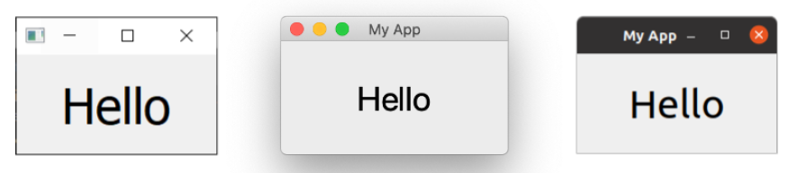
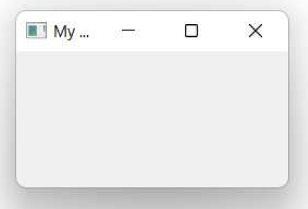
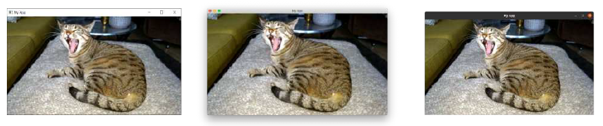
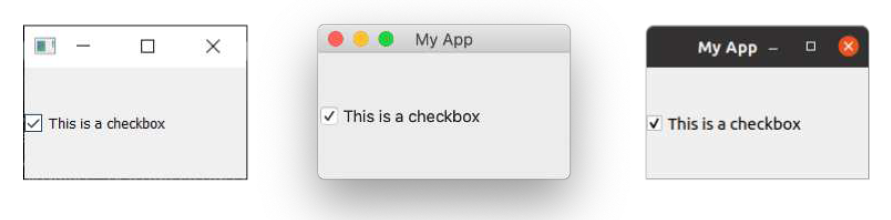
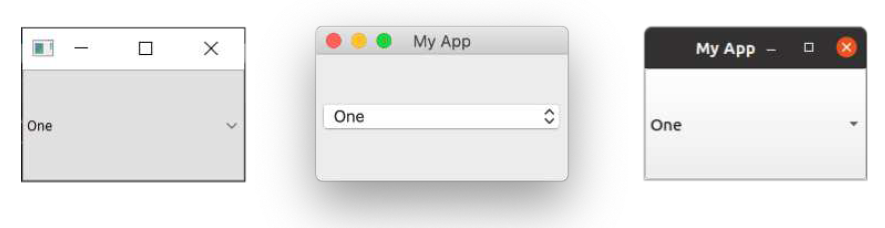
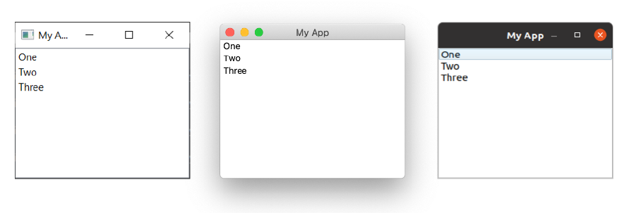
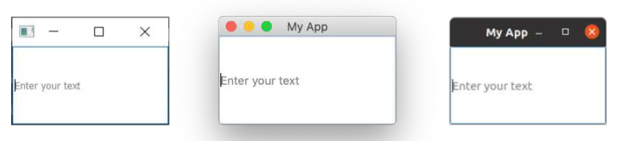
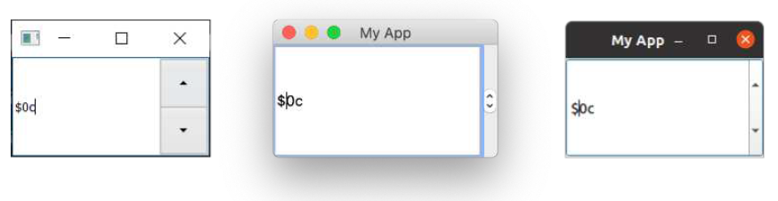
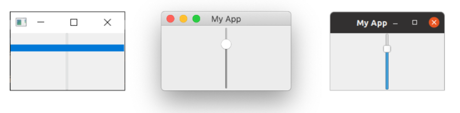
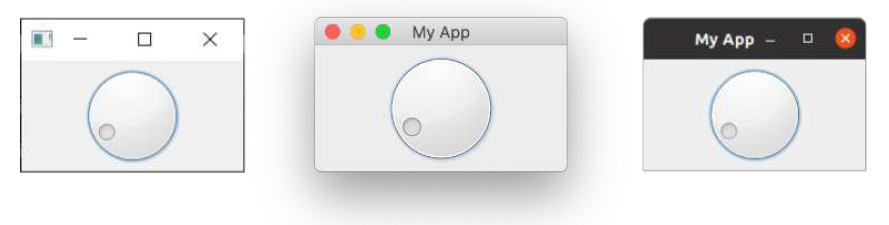

---
prev:
  text: '4. 信号与槽'
  link: '/BasicPyQt6Features/4'
next:
  text: '6. 布局'
  link: '/BasicPyQt6Features/6'
---

## 5. 控件

在 Qt 中，**控件**是指用户可以与之交互的用户界面（UI）组件。用户界面由多个控件组成，这些控件被排列在窗口内。Qt 提供了大量可用的控件，甚至允许您创建自己的自定义控件。

在本书的代码示例中，有一个名为 `basic/widgets_list.py` 的文件，您可以运行它来在窗口中显示一组控件。它使用了一些我们稍后会介绍的复杂技巧，所以，现在先不要担心代码的问题。

> 🚀**运行它吧！** 您将会看到一个包含多个交互式控件的窗口。


> 图八：在*Windows*，*macOS* 和 *Linux(Ubuntu)* 上面展示的控件应用程序的例子

示例中显示的控件如下所示，从上到下依次为：

| 控件             | 作用                     |
| ---------------- | ------------------------ |
| `QCheckbox`      | 复选框                   |
| `QComboBox`      | 下拉列表框               |
| `QDateEdit`      | 编辑日期                 |
| `QDateTimeEdit`  | 编辑日期和时间           |
| `QDial`          | 可旋转表盘               |
| `QDoubleSpinbox` | 浮点数微调框             |
| `QFontComboBox`  | 字体列表                 |
| `QLCDNumber`     | 相当难看的 LCD 显示屏    |
| `QLabel`         | 不能互动的标签           |
| `QLineEdit`      | 输入一行文本             |
| `QProgressBar`   | 进度条                   |
| `QPushButton`    | 按钮                     |
| `QRadioButton`   | 仅有一个有效选项的选项组 |
| `QSlider`        | 滑块                     |
| `QSpinBox`       | 整数微调框               |
| `QTimeEdit`      | 编辑时间                 |

还有更多控件，但它们并不太适合在这里全部展示！完整的列表请参阅 [Qt 文档](https://doc.qt.io/qt-5/qtwidgets-module.html)。下面我们将仔细看看一些最有用的控件。


> 请打开一个新的 `myapp.py` 文件并以新名称保存以完成本节内容。

### `QLabel`

我们将从 `QLabel `开始介绍，它可以说是 Qt 工具箱中最简单的控件之一。这是一个简单的单行文本，您可以将其放置在应用程序中。您可以在创建时通过传递字符串来设置文本——

```python
widget = QLabel("Hello")
```

或者，通过使用 `.setText()` 方法——

```python
widget = QLabel("1") # 创建的标签文本为 1
widget.setText("2")  # 标签现在显示 2
```

您还可以调整字体参数，例如控件中文本的大小或对齐方式。

*Listing 13. basic/widgets_1.py*

```python
import sys

from PyQt6.QtCore import Qt
from PyQt6.QtWidgets import QApplication, QLabel, QMainWindow


class MainWindow(QMainWindow):
    def __init__(self):
        super().__init__()
        
        self.setWindowTitle("My App")
        
        widget = QLabel("Hello")
        font = widget.font() #1
        font.setPointSize(30)
        widget.setFont(font)
        widget.setAlignment(
            Qt.AlignmentFlag.AlignHCenter
            | Qt.AlignmentFlag.AlignVCenter
        ) #2
        
        self.setCentralWidget(widget)
        
        
app = QApplication(sys.argv)

window = MainWindow()
window.show()

app.exec()
```

> 1. 我们使用 `<widget>.font()` 获取当前字体，对其进行修改，然后将其应用回去。这样可以确保字体与系统字体样式保持一致。
> 2. 对齐方式通过 `Qt.`命名空间中的标志来指定。

> 🚀 **运行它吧！** 调整字体参数并查看效果。



> 图九：在 *Windows*，*macOS* 和 *Linux(Ubuntu)* 上面的 `QLabel`


Qt 命名空间 (`Qt.`) 中包含各种属性，您可以使用这些属性来定制和控制 Qt 控件。我们将在后面的 “35. 枚举和 Qt 命名空间” 中详细介绍这一点。

用于水平对齐的标志包括——

| 标志                            | 行为                       |
| ------------------------------- | -------------------------- |
| `Qt.AlignmentFlag.AlignLeft`    | 与左边缘对齐               |
| `Qt.AlignmentFlag.AlignRight`   | 与右边缘对齐               |
| `Qt.AlignmentFlag.AlignHCenter` | 在可用空间内水平居中       |
| `Qt.AlignmentFlag.AlignJustify` | 在可用空间内对文字进行调整 |

用于垂直对齐的标志包括——

| 标志                            | 行为                 |
| ------------------------------- | -------------------- |
| `Qt.AlignmentFlag.AlignTop`     | 与顶部对齐           |
| `Qt.AlignmentFlag.AlignBottom`  | 与底部对齐           |
| `Qt.AlignmentFlag.AlignVCenter` | 在可用空间中垂直居中 |

您可以使用管道符（`|`）将多个标志组合在一起，但请注意，每次只能使用一个垂直或水平对齐标志。

```python
align_top_left = Qt.AlignmentFlag.AlignLeft | Qt.AlignmentFlag.AlignTop
```

> 🚀 **运行它吧！** 尝试组合不同的对齐标志并观察其对文本位置的影响。


> **Qt 标志**

> 请注意，您使用了或运算符 (`|`) 按照惯例将两个标志组合在一起。这些标志是非重叠的位掩码。例如，`Qt.AlignmentFlag.AlignLeft` 的二进制值为 `0b0001`，而`Qt.AlignmentFlag.AlignBottom` 的二进制值为 `0b0100`。通过按位或运算，我们得到值 `0b0101`，表示“底部左侧”。

> 我们将在后续的 “35. 枚举与 Qt 命名空间” 章节中对 Qt 命名空间和 Qt 标志进行更详细的探讨。

最后，还有一个简写标志，它同时在两个方向上居中——

| 标志                           | 行为               |
| ------------------------------ | ------------------ |
| `Qt.AlignmentFlag.AlignCenter` | 水平**和**垂直居中 |

有趣的是，您也可以使用 `QLabel` 通过 `.setPixmap()` 方法显示一张图片。该方法接受一个像素图（像素数组），您可以通过将图片文件名传递给 `QPixmap` 来创建它。在随本书提供的示例文件中，您可以找到一个名为 `otje.jpg` 的文件，您可以按照以下方式在窗口中显示它：

*Listing 14. basic/widgets_2a.py*

```python
import sys

from PyQt6.QtGui import QPixmap
from PyQt6.QtWidgets import QApplication, QLabel, QMainWindow

class MainWindow(QMainWindow):
    def __init__(self):
        super().__init__()
        
        self.setWindowTitle("My App")
        
        widget = QLabel("Hello")
        widget.setPixmap(QPixmap("otje.jpg"))
        
        self.setCentralWidget(widget)
        
        
app = QApplication(sys.argv)

window = MainWindow()
window.show()

app.exec()
```


> 图十：叫做“Otje”的猫，太可爱啦

> 🚀 **运行它吧！** 调整窗口大小后，图像会被空白区域包围。


> 没看见图片？继续往下读读看！

在上面的示例中，我们仅使用文件名 `otje.jpg` 来指定要加载的文件。这意味着当应用程序运行时，文件将从当前文件夹中加载。然而，当前文件夹并不一定是脚本所在的文件夹——您可以从任何位置运行脚本。

如果你切换到上级目录（使用 `cd ..`）并再次运行脚本，文件将无法被找到，图像也无法加载。我的老天啊！



> 图十一：猫 Otje 不见了


> 这也是在从IDE运行脚本时常见的问题，因为IDE会根据当前激活的项目来设置路径。

要解决这个问题，我们可以获取当前脚本文件的路径，并利用该路径确定脚本所在的文件夹。我们的图像文件存储在同一文件夹中（或相对于此位置的某个文件夹中），这样也能确定该文件的位置。

文件内置变量 `file` 为我们提供了当前文件的路径。`os.dirname()` 函数从该路径中获取文件夹（或**目录**名称），然后我们使用 `os.path.join` 函数来构建文件的新路径。

*Listing 15. basic/widgets_2b.py*

```python
import os
import sys

from PyQt6.QtGui import QPixmap
from PyQt6.QtWidgets import QApplication, QLabel, QMainWindow

basedir = os.path.dirname(__file__)
print("Current working folder:", os.getcwd()) #1
print("Paths are relative to:", basedir) #2


class MainWindow(QMainWindow):
    def __init__(self):
        super().__init__()
        
        self.setWindowTitle("My App")
        
        widget = QLabel("Hello")
        widget.setPixmap(QPixmap(os.path.join(basedir, "otje.jpg")))
        
        self.setCentralWidget(widget)
        
        
app = QApplication(sys.argv)

window = MainWindow()
window.show()

app.exec()
```

> 1. 当前工作目录。
> 2. 我们的基础路径（相对于此文件）。


> 如果您现在还不完全理解，请不要担心，我们将在后面详细说明。

如果您现在运行这个脚本，图像将如预期显示——无论您从哪里运行脚本。脚本还会输出路径（以及当前工作目录），以帮助调试问题。在从应用程序加载任何外部文件时，请务必记住这一点。有关数据文件路径处理的更详细信息，请参阅 "33. 使用相对路径"。

默认情况下，图像在缩放时会保持其宽高比。如果您希望它拉伸并缩放以完全填充窗口，您可以在 `QLabel`中设置 `.setScaledContents(True)` 方法。

请修改代码，在标签中添加 `.setScaledContents(True)` ——

*Listing 16. basic/widgets_2b.py*

```python
widget.setPixmap(QPixmap(os.path.join(basedir, "otje.jpg")))
widget.setScaledContents(True)
```

> 🚀 **运行它吧！** 调整窗口大小，图片就会变形来自动适应大小。



> 图十二：在 *Windows*，*macOS* 和 *Linux(Ubuntu)* 上面使用 `Qlabel`展示的像素图

### `QCheckBox`

下一个要介绍的控件是 `QCheckBox`，顾名思义，它为用户提供了一个可选框。然而，与所有 Qt 控件一样，它也有许多可配置的选项来更改控件的行为。

*Listing 17. basic/widgets_3.py*

```python
import sys

from PyQt6.QtCore import Qt
from PyQt6.QtWidgets import QApplication, QCheckBox, QMainWindow


class MainWindow(QMainWindow):
    def __init__(self):
        super().__init__()
        
        self.setWindowTitle("My App")
        
        widget = QCheckBox("This is a checkbox")
        widget.setCheckState(Qt.CheckState.Checked)
        
        # 对于三态：widget.setCheckState(Qt.PartiallyChecked)
        # 或：widget.setTristate(True)
        widget.stateChanged.connect(self.show_state)
        
        self.setCentralWidget(widget)
        
    def show_state(self, s):
        print(Qt.CheckState(s) == Qt.CheckState.Checked)
        print(s)
        
        
app = QApplication(sys.argv)

window = MainWindow()
window.show()

app.exec()
```

> 🚀 **运行它吧！** 您将会看到一个有标签文本的复选框



> 图十三：在 *Windows*，*macOS* 和 *Linux(Ubuntu)* 上面的`QCheckBox`

您可以使用 `.setChecked` 或 `.setCheckState` 通过编程方式设置复选框状态。前者接受 `True` 或 `False`，分别代表已选中或未选中。但是，使用 `.setCheckState` 时，您还可以使用 `Qt.`命名空间标志指定部分选中状态。

| 标志                             | 行为         |
| -------------------------------- | ------------ |
| `Qt.CheckState.Checked`          | 该项已选中   |
| `Qt.CheckState.Unchecked`        | 该项未选中   |
| `Qt.CheckState.PartiallyChecked` | 该项部分选中 |

支持部分选中状态（`Qt.CheckState.PartiallyChecked`）的复选框通常被称为“三态复选框”，即既非选中也非未选中。处于此状态的复选框通常显示为灰色复选框，并常用于分层复选框布局中，其中子项与父级复选框相关联。

如果您将值设置为 `Qt.CheckState.PartiallyChecked`，复选框将变为**三态**——即具有三种可能的状态。您还可以通过使用 `.setTristate(True)`来达到相同的效果


> 您可能会注意到，当脚本运行时，当前状态的编号以整数形式显示，其中已选中 = 2，未选中 = 0，部分选中 = 1。您无需记住这些值——它们只是这些相应标志的内部值。您可以通过 `state == Qt.CheckState.Checked` 来测试状态。

### `QComboBox`

`QComboBox` 是一个下拉列表，默认情况下处于关闭状态，需要点击箭头才能打开。您可以从列表中选择一个项目，当前选中的项目将作为标签显示在控件上。组合框适用于从长列表中选择一个选项。


> 您可能在文字处理应用程序中见过用于选择字体样式或字号的组合框。尽管 Qt实际上提供了一个专门用于字体选择的组合框，即 `QFontComboBox`。

您可以通过向 `.addItems() `方法传递一个字符串列表来向 QComboBox 添加项。项将按您提供的顺序依次添加。

*Listing 18. basic/widgets_4.py*

```python
import sys

from PyQt6.QtCore import Qt
from PyQt6.QtWidgets import QApplication, QComboBox, QMainWindow

class MainWindow(QMainWindow):
    def __init__(self):
        super().__init__()
        
        self.setWindowTitle("My App")
        
        widget = QComboBox()
        widget.addItems(["One", "Two", "Three"])
        
        widget.currentIndexChanged.connect(self.index_changed)
        widget.currentTextChanged.connect(self.text_changed)
        
        self.setCentralWidget(widget)
        
    def index_changed(self, i): # i是一个int型整数
        print(i)
        
    def text_changed(self, s): # s是一个str型的字符串
        print(s)
        

app = QApplication(sys.argv)

window = MainWindow()
window.show()

app.exec()
```

> 🚀 **运行它吧！** 您将看到一个包含3个选项的下拉列表框。选择其中一项后，该选项将显示在输入框中。



> 图十四：在 *Windows*，*macOS* 和 *Linux(Ubuntu)* 上面的`QComboBox`

当当前选中的项目被更新时，会触发 `.currentIndexChanged` 信号，默认情况下会传递列表中选中项目的索引。还有一个 `.currentTextChanged` 信号，它提供当前选中项目的标签，这个通常会更加实用。

`QComboBox` 也可以设置为可编辑模式，允许用户输入列表中不存在的值，并可选择将这些值插入列表或直接作为选中项使用。要启用可编辑模式，请加入这行代码：

```python
widget.setEditable(True)
```

您还可以设置标志来确定插入操作的处理方式。这些标志存储在 `QComboBox` 类本身中，具体列表如下：

| 标志                                          | 行为               |
| --------------------------------------------- | ------------------ |
| `QComboBox.InsertPolicy.NoInsert`             | 不允许插入         |
| `QComboBox.InsertPolicy.InsertAtTop`          | 插入为第一个项     |
| `QComboBox.InsertPolicy.InsertAtCurrent`      | 替换当前选中的项   |
| `QComboBox.InsertPolicy.InsertAtBottom`       | 在最后一项之后插入 |
| `QComboBox.InsertPolicy.InsertAfterCurrent`   | 在当前项之后插入   |
| `QComboBox.InsertPolicy.InsertBeforeCurrent`  | 在当前项之前插入   |
| `QComboBox.InsertPolicy.InsertAlphabetically` | 按字母顺序插入     |

要使用这些选项，请按以下方式应用标志：

```python
widget.setInsertPolicy(QComboBox.InsertPolicy.InsertAlphabetically)
```

您还可以通过调用 `.setMaxCount` 方法来限制盒子中允许的项目数量,例如：

```python
widget.setMaxCount(10)
```

### `QListWidget`

接下来是 `QListWidget`。该控件与 `QComboBox` 类似，只是选项以可滚动列表的形式呈现。它还支持同时选择多个项目。`QListWidget` 提供了一个 `currentItemChanged` 信号，该信号发送 `QListItem`（列表控件的元素），以及一个 `currentTextChanged` 信号，该信号发送当前项目的文本。

*Listing 19. basic/widgets_5.py*

```python
import sys

from PyQt6.QtWidgets import QApplication, QListWidget, QMainWindow

class MainWindow(QMainWindow):
    def __init__(self):
        super().__init__()
        
        self.setWindowTitle("My App")
        
        widget = QListWidget()
        widget.addItems(["One", "Two", "Three"])
        
        widget.currentItemChanged.connect(self.index_changed)
        widget.currentTextChanged.connect(self.text_changed)
        
        self.setCentralWidget(widget)
        
    def index_changed(self, i): #不是索引，i 是 QListItem
        print(i.text())
        
    def text_changed(self, s): # s是一个str型的字符串
        print(s)
        
        
app = QApplication(sys.argv)

window = MainWindow()
window.show()

app.exec()
```

> 🚀 **运行它吧！** 您将看到相同的三个项，现在以列表形式显示。选中的项（如果有的话）将被高亮显示。



> 图十五：在 *Windows*，*macOS* 和 *Linux(Ubuntu)* 上面的`QListWidget`

### `QLineEdit`

`QLineEdit` 控件是一个简单的单行文本编辑框，用户可以在其中输入内容。这些控件用于表单字段或没有限制有效输入列表的设置。例如，输入电子邮件地址或计算机名称时。

*Listing 20. basic/widgets_6.py*

```python
import sys

from PyQt6.QtCore import Qt
from PyQt6.QtWidgets import QApplication, QLineEdit, QMainWindow

class MainWindow(QMainWindow):
    def __init__(self):
        super().__init__()
        
        self.setWindowTitle("My App")
        
        widget = QLineEdit()
        widget.setMaxLength(10)
        widget.setPlaceholderText("Enter your text")
        
        # widget.setReadOnly(True) # 取消注释该行以设置为只读模式
        
        widget.returnPressed.connect(self.return_pressed)
        widget.selectionChanged.connect(self.selection_changed)
        widget.textChanged.connect(self.text_changed)
        widget.textEdited.connect(self.text_edited)
        
        self.setCentralWidget(widget)
        
    def return_pressed(self):
        print("Return pressed!")
        self.centralWidget().setText("BOOM!")
        
    def selection_changed(self):
        print("Selection changed")
        print(self.centralWidget().selectedText())
        
    def text_changed(self, s):
        print("Text changed...")
        print(s)
        
    def text_edited(self, s):
        print("Text edited...")
        print(s)
        
        
app = QApplication(sys.argv)

window = MainWindow()
window.show()

app.exec()
```

> 🚀 **运行它吧！** 您将看到一个带有提示的简单文本输入框。



> 图十六：在 *Windows*，*macOS* 和 *Linux(Ubuntu)* 上面的`QLineEdit`

如以上代码所示，您可以通过使用 `.setMaxLength` 方法为文本字段设置最大长度。占位符文本（即在用户输入内容前显示的文本）可通过 `.setPlaceholderText` 方法添加。

`QLineEdit` 为不同的编辑事件提供了一系列信号，包括（用户）按下回车键时、用户选择发生更改时。另外还有两个编辑信号，一个用于框中的文本被编辑的时候，另一个用于文本被更改的时候。这里的区别在于用户编辑和程序更改。只有当用户编辑文本时，才会发送 `textEdited` 信号。

此外，还可以使用输入掩码进行输入验证，以定义支持哪些字符以及在何处支持。这可以应用于字段如下：

```python
widget.setInputMask('000.000.000.000;_')
```

上述规则允许使用以句点分隔的3位数字序列，因此可用于验证IPv4地址。

### `QSpinBox` 和 `QDoubleSpinBox`

`QSpinBox` 提供了一个带箭头的小数字输入框，用于增加和减少值。`QSpinBox` 支持整数，而相关的控件`QDoubleSpinBox` 支持浮点数。


> 双精度(`double`)或双精度浮点数(double float)是 C++ 类型，相当于Python 自己的浮点数(`float`)类型，因此该控件以此命名。

*Listing 21. basic/widgets_7.py*

```python
import sys

from PyQt6.QtWidgets import QApplication, QMainWindow, QSpinBox

class MainWindow(QMainWindow):
    def __init__(self):
        super().__init__()
        
        self.setWindowTitle("My App")
        
        widget = QSpinBox()
        # 或者: widget = QDoubleSpinBox()
        
        widget.setMinimum(-10)
        widget.setMaximum(3)
        # 或者: widget.setRange(-10,3)
        
        widget.setPrefix("$")
        widget.setSuffix("c")
        widget.setSingleStep(3) # 或者，对于QDoubleSpinBox，使用0.5
        widget.valueChanged.connect(self.value_changed)
        widget.textChanged.connect(self.value_changed_str)
        
        self.setCentralWidget(widget)
        
    def value_changed(self, i):
        print(i)
        
    def value_changed_str(self, s):
        print(s)
        
        
app = QApplication(sys.argv)

window = MainWindow()
window.show()

app.exec()
```

> 🚀**运行它吧！** 您将看到一个数字输入框。该值显示前缀和后缀单位，且范围限定在+3到-10之间。



> 图十七：在 *Windows*，*macOS* 和 *Linux(Ubuntu)* 上面的`QSpinBox`

上面的演示代码展示了该控件可用的各种功能。

要设置可接受值的范围，您可以使用 `setMinimum` 和 `setMaximum`，或者使用 `setRange` 同时设置两者。值类型的标注支持在数字前添加前缀或在数字后添加后缀，例如使用 `.setPrefix` 和 `.setSuffix` 分别设置货币标记或单位。

点击控件上的向上和向下箭头可增加或减少控件中的值，该值可使用 `.setSingleStep` 进行设置。请注意，这不会对控件可接受的值产生任何影响。

`QSpinBox` 和 `QDoubleSpinBox` 都具有 `.valueChanged` 信号，该信号在其值发生改变时触发。`.valueChanged` 信号发送数字值（整数或浮点数），而单独的 `.textChanged` 信号则将值作为字符串发送，包括前缀和后缀字符。

### `QSlider`

`QSlider` 提供了一个滑动条控件，其内部功能与 `QDoubleSpinBox` 非常相似。它不会以数字形式显示当前值，而是通过滑块在控件长度上的位置来表示。当需要在两个极端值之间进行调整，但不需要绝对精确度时，此控件非常有用。此类控件最常见的用途是音量控制。

还有一个额外的每当滑块移动位置时触发的 `.sliderMoved` 信号，以及一个每当滑块被点击时发出的 `.sliderPressed` 信号。

*Listing 22. basic/widgets_8.py*

```python
import sys

from PyQt6.QtCore import Qt
from PyQt6.QtWidgets import QApplication, QMainWindow, QSlider


class MainWindow(QMainWindow):
    def __init__(self):
        super().__init__()
        
        self.setWindowTitle("My App")
        
        widget = QSlider()
        
        widget.setMinimum(-10)
        widget.setMaximum(3)
        # 或者: widget.setRange(-10,3)
        
        widget.setSingleStep(3)
        widget.valueChanged.connect(self.value_changed)
        widget.sliderMoved.connect(self.slider_position)
        widget.sliderPressed.connect(self.slider_pressed)
        widget.sliderReleased.connect(self.slider_released)
        
        self.setCentralWidget(widget)
        
    def value_changed(self, i):
        print(i)
    
    def slider_position(self, p):
        print("position", p)
        
    def slider_pressed(self):
        print("Pressed!")
        
    def slider_released(self):
        print("Released")
        
        
app = QApplication(sys.argv)

window = MainWindow()
window.show()

app.exec()
```

> 🚀 **运行它吧！** 您将看到一个滑块控件。拖动滑块即可更改数值。



> 图十八：在 *Windows*，*macOS* 和 *Linux(Ubuntu)* 上面的`QSlider`。在 *Windows*  中手柄会扩展到控件的大小。

您还可以通过在创建时传递方向来构建垂直或水平方向的滑块。方向标志在 Qt.命名空间中定义。例如——

```python
widget.QSlider(Qt.Orientiation.Vertical)
```

或者——

```python
widget.QSlider(Qt.Orientiation.Horizontal)
```

### `QDial`

最后，`QDial` 是一个可旋转的控件，功能与滑块相同，但外观为模拟拨盘。它看起来很不错，但从 UI 角度来看并不特别用户友好。然而，它们通常在音频应用程序中用作现实世界中的模拟拨盘的表示。

*Listing 23. basic/widgets_9.py*

```python
import sys

from PyQt6.QtCore import Qt
from PyQt6.QtWidgets import QApplication, QDial, QMainWindow


class MainWindow(QMainWindow):
    def __init__(self):
        super().__init__()
        
        self.setWindowTitle("My App")
        
        widget = QDial()
        widget.setRange(-10, 100)
        widget.setSingleStep(1)
        
        widget.valueChanged.connect(self.value_changed)
        widget.sliderMoved.connect(self.slider_position)
        widget.sliderPressed.connect(self.slider_pressed)
        widget.sliderReleased.connect(self.slider_released)
        
        self.setCentralWidget(widget)
        
    def value_changed(self, i):
        print(i)
        
    def slider_position(self, p):
        print("position", p)
        
    def slider_pressed(self):
        print("Pressed!")
        
    def slider_released(self):
        print("Released")
        
        
app = QApplication(sys.argv)

window = MainWindow()
window.show()

app.exec()
```

> 🚀 **运行它吧！** 您会看到一个旋钮，请旋转它以从范围内选择一个数字。



> 图十九：在 *Windows*，*macOS* 和 *Linux(Ubuntu)* 上面的`QDial`

这些信号与 `QSlider` 的信号相同，并保留了相同的名称（例如 `.sliderMoved`）。

以上就是对 PyQt6 中可用的 Qt 控件的简要介绍。要查看可用的控件的完整列表，包括所有信号和属性，请参阅 [Qt 文档](http://doc.qt.io/qt-5/)。

### `QWidget`

我们的演示中有一个 QWidget，但您看不到它。我们之前在第一个示例中使用 `QWidge`t 创建了一个空窗口。但 `QWidget` 还可以与 [布局](/BasicPyQt6Features/6) 一起用作其他控件的容器，以构建窗口或复合控件。我们将在后面更详细地介绍创建自定义控件(22. 自定义控件)。

请记住 `QWidget`，因为您将会频繁地使用它！