---
prev:
  text: '5. 控件'
  link: '/BasicPyQt6Features/5'
next:
  text: '7. 操作、工具栏与菜单'
  link: '/BasicPyQt6Features/7'
---

## 6. 布局

到目前为止，我们已经成功创建了一个窗口，并向其中添加了一个控件。但是，通常情况下，您会希望在窗口中添加多个控件，并对添加的控件的位置进行一些控制。在 Qt 中，我们使用布局来排列控件。Qt 中提供了 4 种基本布局，如下表所示。

| 布局             | 行为                |
| ---------------- | ------------------- |
| `QHBoxLayout`    | 线性水平布局        |
| `QVBoxLayout`    | 线性垂直布局        |
| `QGridLayout`    | 在可索引网格XxY中   |
| `QStackedLayout` | 堆叠（z）在彼此之前 |

Qt 中提供了三种二维布局： `QVBoxLayout`、`QHBoxLayout` 和 `QGridLayout`。此外，还有 `QStackedLayout`，它允许您在同一空间内将控件一个叠放在另一个之上，但每次只显示一个控件。

在本章中，我们将依次介绍这些布局，并展示如何使用它们来定位应用程序中的控件。


> *Qt Designer*
>
> 您实际上可以使用Qt Designer以图形方式设计和布局界面，我们将在后续内容中详细介绍。在此我们使用代码，因为这样更便于理解和实验底层系统。

## 占位符控件


> 请加载一份新的 myapp.py，并将它以新的名字保存下来以供本节使用。

为了更方便地可视化布局，我们将首先创建一个简单的自定义控件来显示我们选择的纯色。这有助于区分我们添加到布局中的控件。请您在与脚本相同的文件夹中创建一个新文件，并将其命名为` layout_colorwidget.py`，并添加以下代码。我们将在下一个示例中将此代码导入到我们的应用程序中。

*Listing 24. basic/layout_colorwidget.py*

```python
from PyQt6.QtGui import QColor, QPalette
from PyQt6.QtWidgets import QWidget

class Color(QWidget):
    def __init__(self, color):
        super().__init__()
        self.setAutoFillBackground(True)
        
        palette = self.palette()
        palette.setColor(QPalette.ColorRole.Window, QColor(color))
        self.setPalette(palette)
```

在此代码中，我们子类化 `QWidget` 以创建自己的自定义控件 `Color`。创建控件时，我们接受一个参数——颜色（一个字符串）。首先，我们将 `.setAutoFillBackground` 设置为 `True`，以指示控件自动用窗口颜色填充其背景。接下来，我们将控件的 `QPalette.Window` 颜色更改为我们提供的值 `color` 所描述的新 `QColor`。最后，我们将该调色板应用回控件。最终结果是一个填充了纯色的控件，该颜色是在创建控件时指定的。

如果您觉得以上内容有些难以理解，请不要担心！我们将在后面详细介绍如何创建自定义控件和调色板。目前，您只需了解以下代码即可创建一个实心填充的红色控件即可——

```python
Color('red')
```

首先，让我们使用新创建的“颜色”控件将整个窗口填充为单一颜色来测试这个控件。完成之后，我们可以使用 `.setCentralWidget` 将它添加到主窗口，这样就得到了一个纯红色的窗口。

*Listing 25. basic/layout_1.py*

```python
import sys

from PyQt6.QtCore import Qt
from PyQt6.QtWidgets import QApplication, QMainWindow

from layout_colorwidget import Color


class MainWindow(QMainWindow):
    def __init__(self):
        super().__init__()
        
        self.setWindowTitle("My App")
        
        widget = Color("red")
        self.setCentralWidget(widget)
        
        
app = QApplication(sys.argv)

window = MainWindow()
window.show()

app.exec()
```

> 🚀 **运行它吧！** 窗口将出现并被完全地填充为红色。请您注意控件如何扩展以填充所有的可用空间。

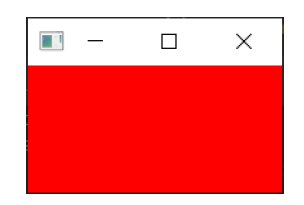

> 图二十：我们的 `Color`控件，填充为纯红色。

接下来，我们将依次查看所有可用的 Qt 布局。请注意，要将布局添加到窗口中，我们需要一个占位 `QWidget` 来容纳布局。

## `QVBoxLayout` 垂直排列控件

使用 `QVBoxLayout`，您可以将控件线性地排列在彼此之上。添加一个控件会将其添加到列的底部。

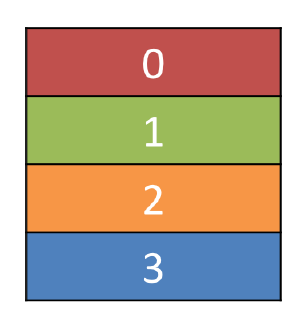

> 图二十一：一个按照从上往下顺序填充的 `QVBoxLayout`

将我们的控件添加到布局中。请注意，为了将布局添加到 `QMainWindow`，我们需要将其应用到占位的 `QWidget`。这样，我们就可以使用 `.setCentralWidget` 将控件（和布局）应用到窗口中。我们的彩色控件将在布局中排列，包含在窗口中的 `QWidge`  中。首先，我们像之前一样添加红色控件。

*Listing 26. basic/layout_2a.py*

```python
import sys

from PyQt6.QtCore import Qt
from PyQt6.QtWidgets import (
    QApplication,
    QMainWindow,
    QVBoxLayout,
    QWidget,
)

from layout_colorwidget import Color

class MainWindow(QMainWindow):
    def __init__(self):
        super().__init__()
        
        self.setWindowTitle("My App")
        
        layout = QVBoxLayout()
        
        layout.addWidget(Color("red"))
        
        widget = QWidget()
        widget.setLayout(layout)
        self.setCentralWidget(widget)
        
        
app = QApplication(sys.argv)

window = MainWindow()
window.show()

app.exec()
```

> 🚀 **运行它吧！** 请注意，现在红色控件周围显示了边框。这就是布局间距——我们稍后会介绍如何调整它。

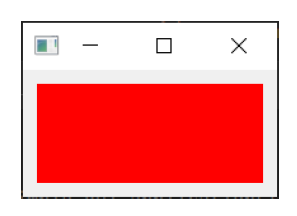

> 图二十二：我们在布局中的 `Color` 控件

接下来，在布局中添加一些彩色控件：

*Listing 27. basic/layout_2b.py*

```python
import sys

from PyQt6.QtCore import Qt
from PyQt6.QtWidgets import (
    QApplication,
    QMainWindow,
    QVBoxLayout,
    QWidget,
)

from layout_colorwidget import Color

class MainWindow(QMainWindow):
    def __init__(self):
        super().__init__()
        
        self.setWindowTitle("My App")
        
        layout = QVBoxLayout()
        
        layout.addWidget(Color("red"))
        layout.addWidget(Color("green"))
        layout.addWidget(Color("blue"))
        
        widget = QWidget()
        widget.setLayout(layout)
        self.setCentralWidget(widget)
        
        
app = QApplication(sys.argv)

window = MainWindow()
window.show()

app.exec()
```

当我们添加控件时，它们会按照添加的顺序垂直排列。

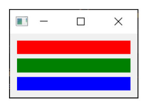

> 图二十三：三个 `Color` 控件在一个 `QVBoxLayout` 布局中垂直排列

## `QHBoxLayout` 水平排列控件

`QHBoxLayout` 与之相同，只是水平移动。添加控件会将其添加到右侧。

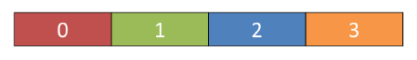

> 图二十四：一个从左往右填充的 `QHBoxLayout`

要使用它，我们可以简单地将 `QVBoxLayout` 改为 `QHBoxLayout`。现在，这些框会从左到右排列。

*Listing 28. basic/layout_3.py*

```python
import sys

from PyQt6.QtCore import Qt
from PyQt6.QtWidgets import (
    QApplication,
    QHBoxLayout,
    QLabel,
    QMainWindow,
    QWidget,
)

from layout_colorwidget import Color

class MainWindow(QMainWindow):
    def __init__(self):
        super().__init__()
        
        self.setWindowTitle("My App")
        
        layout = QVBoxLayout()
        
        layout.addWidget(Color("red"))
        layout.addWidget(Color("green"))
        layout.addWidget(Color("blue"))
        
        widget = QWidget()
        widget.setLayout(layout)
        self.setCentralWidget(widget)
        
        
app = QApplication(sys.argv)

window = MainWindow()
window.show()

app.exec()
```

> 🚀 **运行它吧！** 控件应水平排列

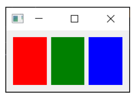

> 图二十五：三个 `Color` 控件在一个 `QVBoxLayout` 布局中水平排列

## 嵌套布局

对于更复杂的布局，您可以使用 `.addLayout` 在布局中嵌套布局。下面，我们将 `QVBoxLayout` 添加到主 `QHBoxLayout` 中。如果我们将一些控件添加到 `QVBoxLayout`，它们将垂直排列在父布局的第一个槽中。

*Listing 29. basic/layout_4.py*

```python
import sys

from PyQt6.QtCore import Qt
from PyQt6.QtWidgets import (
    QApplication,
    QHBoxLayout,
    QLabel,
    QMainWindow,
    QVBoxLayout,
    QWidget,
)

from layout_colorwidget import Color


class MainWindow(QMainWindow):
    def __init__(self):
        super().__init__()
        
        self.setWindowTitle("My App")
        
        layout1 = QHBoxLayout()
        layout2 = QVBoxLayout()
        layout3 = QVBoxLayout()
        
        layout2.addWidget(Color("red"))
        layout2.addWidget(Color("yellow"))
        layout2.addWidget(Color("purple"))
        
        layout1.addLayout(layout2)
        layout1.addWidget(Color("green"))
        
        layout3.addWidget(Color("red"))
        layout3.addWidget(Color("purple"))
        
        layout1.addLayout(layout3)
        
        widget = QWidget()
        widget.setLayout(layout1)
        self.setCentralWidget(widget)
        
        
app = QApplication(sys.argv)

window = MainWindow()
window.show()

app.exec()
```

> 🚀 **运行它吧！** 控件应水平排列成 3 列，第一列还应包含 3 个垂直堆叠的控件。请尝试一下吧！

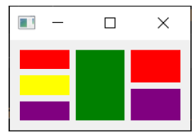

> 图二十六：嵌套的 `QHBoxLayout` 和 `QVBoxLayout` 布局。

您可以使用 `.setContentMargins` 设置布局周围的间距，或使用 `.setSpacing` 设置元素之间的间距。

```python
layout1.setContentsMargins(0,0,0,0)
layout1.setSpacing(20)
```

以下代码显示了嵌套控件与布局边距和间距的组合。

*Listing 30. basic/layout_5.py*

```python
import sys

from PyQt6.QtCore import Qt
from PyQt6.QtWidgets import (
    QApplication,
    QHBoxLayout,
    QLabel,
    QMainWindow,
    QVBoxLayout,
    QWidget,
)

from layout_colorwidget import Color

class MainWindow(QMainWindow):
    def __init__(self):
        super().__init__()
        
        self.setWindowTitle("My App")
        
        layout1 = QHBoxLayout()
        layout2 = QVBoxLayout()
        layout3 = QVBoxLayout()
        
        layout1.setContentsMargins(0,0,0,0)
        layout1.setSpacing(20)
        
        layout2.addWidget(Color("red"))
        layout2.addWidget(Color("yellow"))
        layout2.addWidget(Color("purple"))
        
        layout1.addLayout(layout2)
        layout1.addWidget(Color("green"))
        
        layout3.addWidget(Color("red"))
        layout3.addWidget(Color("purple"))
        
        layout1.addLayout(layout3)
        
        widget = QWidget()
        widget.setLayout(layout1)
        self.setCentralWidget(widget)
        
        
app = QApplication(sys.argv)

window = MainWindow()
window.show()

app.exec()
```

> 🚀 **运行它吧！** 您应该观察间距和边距的效果。请您尝试调整数值，直到您对它们有了一定的把握。

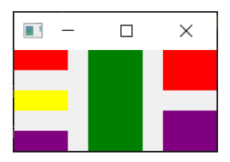

> 图二十七：嵌套的 `QHBoxLayout` 和 `QVBoxLayout` 布局，在控件周围留有间距和边距

## `QGridLayout` 控件以网格形式排列

尽管它们非常有用，但如果您尝试使用 `QVBoxLayout` 和 `QHBoxLayout` 来布局多个元素（例如表单），您会发现很难确保不同大小的控件对齐。解决此问题的办法是使用 `QGridLayout`。

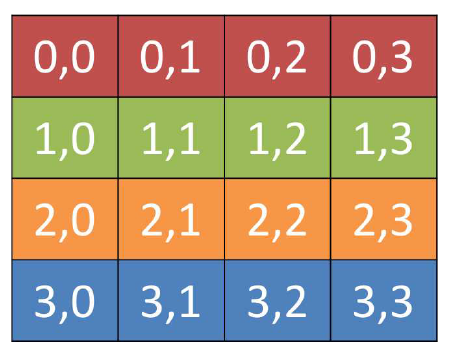

> 图二十八：一个用于显示每个位置的网格位置的 `QGridLayout` 

`QGridLayout` 允许您在网格中特定地放置项目。您可以为每个控件指定行和列位置。您可以跳过某些元素，它们将被留空。

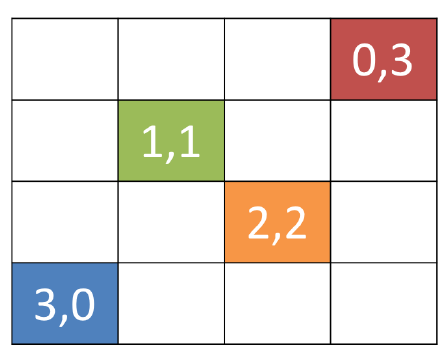

> 图二十九：有未填充槽的 `QGridLayout`

*Listing 31. basic/layout_6.py*

```python
import sys

from PyQt6.QtCore import Qt
from PyQt6.QtWidgets import (
    QApplication,
    QGridLayout,
    QLabel,
    QMainWindow,
    QWidget,
)

from layout_colorwidget import Color


class MainWindow(QMainWindow):
    def __init__(self):
        super().__init__()

        self.setWindowTitle("My App")

        layout = QGridLayout()

        layout.addWidget(Color("red"), 0, 0)
        layout.addWidget(Color("green"), 1, 0)
        layout.addWidget(Color("blue"), 1, 1)
        layout.addWidget(Color("purple"), 2, 1)

        widget = QWidget()
        widget.setLayout(layout)
        self.setCentralWidget(widget)
        
        
app = QApplication(sys.argv)

window = MainWindow()
window.show()

app.exec()
```

> 🚀 **运行它吧！** 您应该看到控件以网格形式排列，尽管缺少条目，但仍然对齐。

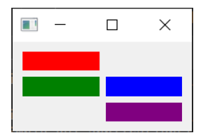

> 图三十：在一个 `QGridLayout` 的四个 `Color` 控件

## `QStackedLayout` 在同一空间中放置多个控件

我们将介绍的最后一种布局是 `QStackedLayout`。如上所述，这种布局允许您将元素直接放置在彼此前面。然后，您可以选择要显示的控件。您可以在图形应用程序中使用它来绘制图层，或模仿标签式界面。请注意，还有 `QStackedWidget`，这是一个完全以相同方式工作的容器控件。如果您希望直接将一个栈添加到 `QMainWindow` 中，可以使用 `.setCentralWidget` 方法。

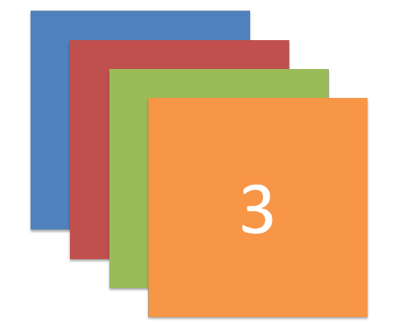

> 图三十一：`QStackedLayout` —— 使用时，只有最上面的控件可见，默认情况下，这是添加到布局中的第一个控件。

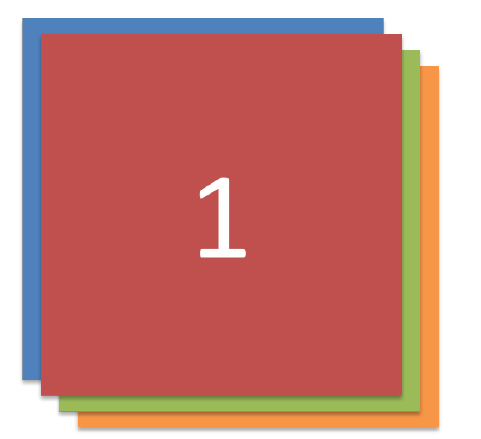

> 图三十二：`QStackedLayout`，可以选择第二个（图中标号为1）控件并将其置于最前面。

*Listing 32. basic/layout_7.py*

```python
import sys

from PyQt6.QtCore import Qt
from PyQt6.QtWidgets import (
    QApplication,
    QLabel,
    QMainWindow,
    QStackedLayout,
    QWidget,
)

from layout_colorwidget import Color


class MainWindow(QMainWindow):
    def __init__(self):
        super().__init__()
        
        self.setWindowTitle("My App")
        
        layout = QStackedLayout()
        
        layout.addWidget(Color("red"))
        layout.addWidget(Color("green"))
        layout.addWidget(Color("blue"))
        layout.addWidget(Color("yellow"))
        
        layout.setCurrentIndex(3)
        
        widget = QWidget()
        widget.setLayout(layout)
        self.setCentralWidget(widget)
        
        
app = QApplication(sys.argv)

window = MainWindow()
window.show()

app.exec()
```

> 🚀 **运行它吧！** 您只会看到最后添加的控件。

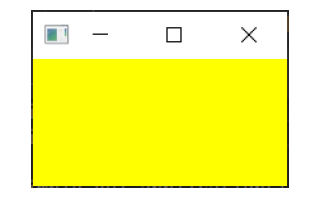

> 图三十三：堆栈控件，仅显示一个控件（最后添加的控件）。

`QStackedWidget` 是应用程序中标签视图的工作方式。任何时候只能看到一个视图（“标签”）。您可以随时使用 `.setCurrentIndex()` 或 `.setCurrentWidget()` 通过索引（按控件添加的顺序）或控件本身来设置项目，从而控制要显示的控件。

以下是一个简短的演示，使用 `QStackedLayout` 与`QButton` 结合，为应用程序提供一个类似标签页的界面——

*Listing 33. basic/layout_8.py*

```python
import sys

from PyQt6.QtCore import Qt
from PyQt6.QtWidgets import (
    QApplication,
    QHBoxLayout,
    QLabel,
    QMainWindow,
    QPushButton,
    QStackedLayout,
    QVBoxLayout,
    QWidget,
)

from layout_colorwidget import Color


class MainWindow(QMainWindow):
    def __init__(self):
        super().__init__()

        self.setWindowTitle("My App")

        pagelayout = QVBoxLayout()
        button_layout = QHBoxLayout()
        self.stacklayout = QStackedLayout()

        pagelayout.addLayout(button_layout)
        pagelayout.addLayout(self.stacklayout)

        btn = QPushButton("red")
        btn.pressed.connect(self.activate_tab_1)
        button_layout.addWidget(btn)
        self.stacklayout.addWidget(Color("red"))

        btn = QPushButton("green")
        btn.pressed.connect(self.activate_tab_2)
        button_layout.addWidget(btn)
        self.stacklayout.addWidget(Color("green"))

        btn = QPushButton("yellow")
        btn.pressed.connect(self.activate_tab_3)
        button_layout.addWidget(btn)
        self.stacklayout.addWidget(Color("yellow"))

        widget = QWidget()
        widget.setLayout(pagelayout)
        self.setCentralWidget(widget)
        
    def activate_tab_1(self):
        self.stacklayout.setCurrentIndex(0)
        
    def activate_tab_2(self):
        self.stacklayout.setCurrentIndex(1)
        
    def activate_tab_3(self):
        self.stacklayout.setCurrentIndex(2)
        
        
app = QApplication(sys.argv)

window = MainWindow()
window.show()

app.exec()
```

> 🚀 **运行它吧！** 现在，您可以使用按钮更改可见控件。

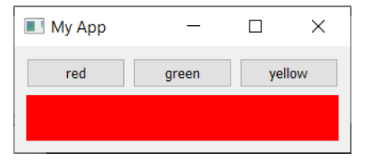

> 图三十四：一个堆栈控件，带有用于控制活动控件的按钮。

Qt 提供了一个内置的选项卡控件，可以提供这种布局，非常方便——尽管它实际上是一个控件，而不是一个布局。下面的选项卡演示是使用 `QTabWidget` 重新创建的——

*Listing 34. basic/layout_9.py*

```python
import sys

from PyQt6.QtCore import Qt
from PyQt6.QtWidgets import (
    QApplication,
    QLabel,
    QMainWindow,
    QPushButton,
    QTabWidget,
    QWidget,
)

from layout_colorwidget import Color


class MainWindow(QMainWindow):
    def __init__(self):
        super().__init__()

        self.setWindowTitle("My App")

        tabs = QTabWidget()
        tabs.setTabPosition(QTabWidget.TabPosition.West)
        tabs.setMovable(True)

        for n, color in enumerate(["red", "green", "blue", "yellow"]):
            tabs.addTab(Color(color), color)
            
        self.setCentralWidget(tabs)
        
        
app = QApplication(sys.argv)

window = MainWindow()
window.show()

app.exec()
```

如您所见，这种方式更加直观——也更具吸引力！您可以通过设置方向来调整标签的位置，并通过 `.setMoveable` 方法切换标签是否可移动。

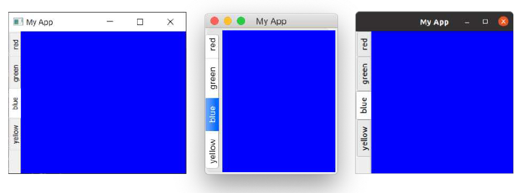

> 图三十五：包含我们控件的 QTabWidget，标签显示在左侧（西侧）。屏幕截图显示了在 *Windows*、*macOS* 和 *Ubuntu* 上的外观。

您会发现 macOS 标签栏与其他平台的标签栏外观差异显著——在macOS 系统中，标签默认采用药丸形或气泡形样式。在 macOS 系统中，此样式通常用于标签式配置面板。对于文档，您可以启用文档模式，以获得与其他平台类似的纤薄标签样式。此选项对其他平台无影响。

*Listing 35. basic/layout_9b.py*

```python
        tabs = QTabWidget()
        tabs.setDocumentMode(True)
```

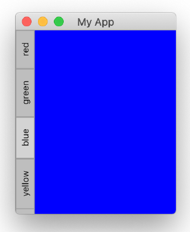

> 图三十六：在 macOS 上，`QTabWidget` 的文档模式设置为 `True`。