---
prev:
  text: '6. 布局'
  link: '/BasicPyQt6Features/6'
next:
  text: '8. 对话框'
  link: '/BasicPyQt6Features/8'
---

## 7. 操作、工具栏与菜单

接下来，我们将探讨一些常见的用户界面元素，这些元素您可能在许多其他应用程序中都见过——工具栏和菜单。我们还将探索Qt提供的用于减少不同用户界面区域之间重复性的便捷系统—— `QAction`。

## 工具栏

最常见的用户界面元素之一是工具栏。工具栏是由图标和/或文本组成的条形控件，用于在应用程序中执行常见任务，而通过菜单访问这些任务会显得繁琐。它们是许多应用程序中最为常见的用户界面功能之一。尽管一些复杂的应用程序，特别是微软Office套件中的应用程序，已迁移到基于上下文的“功能区”界面，但对于您将创建的大多数应用程序而言，标准工具栏已足够使用。

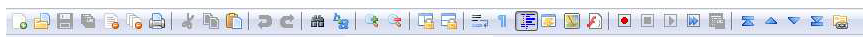

> 图三十七：标准图形用户界面元素——工具栏

Qt 工具栏支持显示图标、文本，还可以包含任何标准的 Qt 控件。但是，对于按钮而言，最好的方法是利用 `QAction` 系统将按钮放置在工具栏上。

让我们先为应用程序添加一个工具栏。


> 请您加载一个全新的 `myapp.py` 副本，并将其保存为新名称以供本节使用。

在 Qt 中，工具栏是通过 `QToolBar` 类创建的。首先，您需要创建该类的一个实例，然后调用 `QMainWindow` 的 `.addToolbar` 方法。将一个字符串作为第一个参数传递给 `QToolBar` 类，即可设置工具栏的名称，该名称将用于在用户界面中识别该工具栏。

*Listing 36. basic/toolbars_and_menus_1.py*

```python
class MainWindow(QMainWindow):
    def __init__(self):
        super().__init__()

        self.setWindowTitle("My App")

        label = QLabel("Hello!")
        label.setAlignment(Qt.AlignmentFlag.AlignCenter)

        self.setCentralWidget(label)

        toolbar = QToolBar("My main toolbar")
        self.addToolBar(toolbar)
        
    def onMyToolBarButtonClick(self, s):
        print("click", s)
```

> 🚀 **运行它吧！** 您会在窗口顶部看到一条细长的灰色条。这就是您的工具栏。右键点击并点击名称即可将其关闭。 

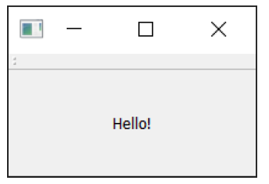

> 图三十八：一个带有工具栏的窗口


> 我无法恢复我的工具栏了！？
>
> 不幸的是，一旦您移除了工具栏，现在就没有地方可以右键点击来重新添加它。因此，作为一个通用的规则，您应该要么保留一个不可移除的工具栏，要么提供一个替代界面来开启或关闭工具栏。

让我们让工具栏变得更有趣一些。我们只需添加一个 `QButton` 控件即可，但 Qt 中还有一种更好的方法可以为您提供一些很酷的功能——那就是通过 `QAction`。`QAction` 是一个提供描述抽象用户界面的方法的类。这意味着，您可以在一个对象中定义多个界面元素，并通过与该元素交互的效果将它们统一起来。例如，工具栏和菜单中通常都会出现一些功能，例如“编辑→剪切”，它既存在于“编辑”菜单中，也以剪刀图标的形式出现在工具栏上，同时还支持键盘快捷键 `Ctrl-X`（macOS 上为 `Cmd-X`）.

如果没有 `QAction`，您必须在多个地方定义此操作。但使用 `QAction` ，您就可以只定义一个 `QAction`，定义触发操作，然后将此操作添加到菜单和工具栏中。每个 `QAction` 都有名称、状态消息、图标和可连接的信号（以及更多内容）。

请参阅下面的代码，了解如何添加您的第一个 `QAction`。

*Listing 37. basic/toolbars_and_menus_2.py*

```python
class MainWindow(QMainWindow):
    def __init__(self):
        super().__init__()

        self.setWindowTitle("My App")

        label = QLabel("Hello!")
        label.setAlignment(Qt.AlignmentFlag.AlignCenter)

        self.setCentralWidget(label)

        toolbar = QToolBar("My main toolbar")
        self.addToolBar(toolbar)

        button_action = QAction("Your button", self)
        button_action.setStatusTip("This is your button")
        button_action.triggered.connect(self.onMyToolBarButtonClick)
        toolbar.addAction(button_action)
        
    def onMyToolBarButtonClick(self, s):
        print("click", s)
```

首先，我们创建一个函数来接受来自 `QAction` 的信号，以便查看它是否正常工作。接下来，我们定义 `QAction` 本身。在创建实例时，我们可以传递一个动作标签和/或图标。你还必须传递任何 `QObject` 作为动作的父对象——这里我们传递 self 作为对主窗口的引用。对于 `QAction` 来说，父对象作为最后一个参数传递，这有点奇怪。

接下来，我们可以选择设置一个状态提示——一旦有状态栏，该文本就会显示在状态栏上。最后，我们将 `.triggered` 信号连接到自定义函数。每当 `QAction` 被“触发”（或激活）时，该信号就会触发。

> 🚀 **运行它吧！** 您应该看到带有您定义的标签的按钮。如果您点击它，我们的自定义函数就会触发“点击”事件并返回按钮的状态。

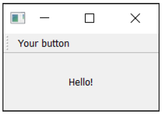

> 图三十九：我们的 `QAction` 按钮在工具栏中显示出来了


> 为什么信号总是为假？
>
> 传递的信号表明该操作是否被选中，而由于我们的按钮不能被选中——只能点击——因此它总是为假。这就像我们之前看到的 `QPushButton` 一样。

让我们添加一个状态栏。

我们通过调用 `QStatusBar` 并将其结果传递给 `.setStatusBar` 来创建状态栏对象。由于我们不需要修改状态栏设置，因此可以在创建时直接将其传递进去。我们可以在一行代码中创建并定义状态栏：

*Listing 38. basic/toolbars_and_menus_3.py*

```python
class MainWindow(QMainWindow):
    def __init__(self):
        super().__init__()

        self.setWindowTitle("My App")

        label = QLabel("Hello!")
        label.setAlignment(Qt.AlignmentFlag.AlignCenter)

        self.setCentralWidget(label)

        toolbar = QToolBar("My main toolbar")
        self.addToolBar(toolbar)

        button_action = QAction("Your button", self)
        button_action.setStatusTip("This is your button")
        button_action.triggered.connect(self.onMyToolBarButtonClick)
        toolbar.addAction(button_action)
        
        self.setStatusBar(QStatusBar(self))
        
    def onMyToolBarButtonClick(self, s):
        print("click", s)
```

> 🚀 **运行它吧！** 将鼠标悬停在工具栏按钮上，您将看到状态文本在窗口底部的状态栏中显示。

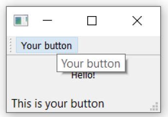

> 图四十：状态栏文本会在我们悬停操作时更新。

接下来，我们将把 `QAction` 设置为可切换的——点击一次会将其打开，再次点击会将其关闭。要实现这一点，我们只需在 `QAction` 对象上调用 `setCheckable(True)` 方法。

*Listing 39. basic/toolbars_and_menus_4.py*

```python
class MainWindow(QMainWindow):
    def __init__(self):
        super().__init__()

        self.setWindowTitle("My App")

        label = QLabel("Hello!")
        label.setAlignment(Qt.AlignmentFlag.AlignCenter)

        self.setCentralWidget(label)

        toolbar = QToolBar("My main toolbar")
        self.addToolBar(toolbar)

        button_action = QAction("Your button", self)
        button_action.setStatusTip("This is your button")
        button_action.triggered.connect(self.onMyToolBarButtonClick)
        button_action.setCheckable(True)
        toolbar.addAction(button_action)
        
        self.setStatusBar(QStatusBar(self))
        
    def onMyToolBarButtonClick(self, s):
        print("click", s)
```

> 🚀 **运行它吧！** 请您点击按钮，查看它从选中状态切换到未选中状态。请注意，我们现在创建的自定义槽函数交替输出 `True` 和 `False`。

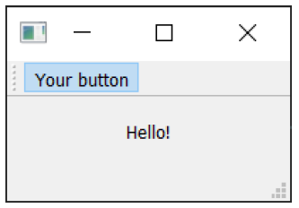

> 图四十一：工具栏按钮已启用


> `.toggled` 信号
>
> 还有一个 `.toggled` 信号，只有在按钮被切换时才会发出信号。但效果相同，因此基本上毫无意义。

目前看起来有点无聊，所以让我们给按钮添加一个图标。为此，我推荐设计师Yusuke Kamiyamane设计的 [Fugue图标集](http://p.yusukekamiyamane.com/)。这是一个非常棒的16x16像素图标集，可以为你的应用程序增添专业气质。该图标集可免费使用，只需在分发应用程序时注明出处即可——不过我相信，如果条件允许，设计师也会很乐意收到你的捐赠。

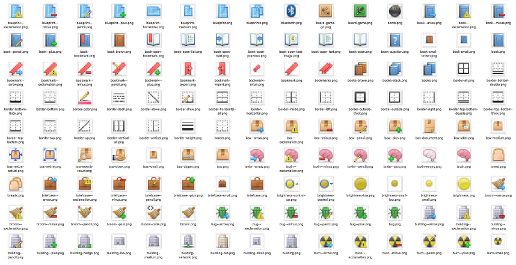

> 图四十二：设计师 Yusuke Kamiyamane 的作品：Fugue图标集

从图像集（在此示例中我选择了文件 `bug.png`）中选择一张图像，并将它复制到与源代码相同的文件夹中。我们可以创建一个 `QIcon` 对象，通过将文件路径传递给该类来实现。我们使用在 [“控件”](#5.-控件) 一章中学习到的 `basedir` 技术加载图标。这确保无论您从何处运行脚本，都能找到该文件。最后，要将图标添加到 `QAction`（以及按钮）中，只需在创建 `QAction` 时将其作为第一个参数传递即可。

您还需要让工具栏知道你的图标大小，否则您的图标周围会出现大量填充。您可以通过调用 `.setIconSize()` 并传入一个 `QSize` 对象来实现这一点。

*Listing 40. basic/toolbars_and_menus_5.py*

```python
import os
import sys

from PyQt6.QtCore import QSize, Qt
from PyQt6.QtGui import QAction, QIcon
from PyQt6.QtWidgets import (
    QApplication,
    QLabel,
    QMainWindow,
    QStatusBar,
    QToolBar,
)

basedir = os.path.dirname(__file__)

# tag::MainWindow[]
class MainWindow(QMainWindow):
    def __init__(self):
        super().__init__()

        self.setWindowTitle("My App")

        label = QLabel("Hello!")
        label.setAlignment(Qt.AlignmentFlag.AlignCenter)

        self.setCentralWidget(label)

        toolbar = QToolBar("My main toolbar")
        toolbar.setIconSize(QSize(16, 16))
        self.addToolBar(toolbar)

        button_action = QAction(
            QIcon(os.path.join(basedir, "bug.png")),
            "Your button",
            self,
        )
        button_action.setStatusTip("This is your button")
        button_action.triggered.connect(self.onMyToolBarButtonClick)
        button_action.setCheckable(True)
        toolbar.addAction(button_action)
        
        self.setStatusBar(QStatusBar(self))
        
    def onMyToolBarButtonClick(self, s):
        print("click", s)
        
        
# end::MainWindow[]

app = QApplication(sys.argv)

window = MainWindow()
window.show()

app.exec()
```

> 🚀 **运行它吧！** `QAction` 现在以图标形式显示。所有功能均与之前完全相同。

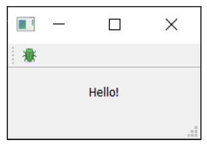

> 图四十三：我们带有一个图标的操作按钮

请注意，Qt 使用操作系统的默认设置来确定是否在工具栏中显示图标、文本或图标和文本。但您可以使用 `.setToolButtonStyle` 覆盖此设置。该槽接受来自 `Qt.`命名空间的以下任何标志：

| 标志                                          | 行为                                 |
| --------------------------------------------- | ------------------------------------ |
| `Qt.ToolButtonStyle.ToolButtonIconOnly`       | 仅有图标，没有文本                   |
| `Qt.ToolButtonStyle.ToolButtonTextOnly`       | 仅有文本，没有图标                   |
| `Qt.ToolButtonStyle.ToolButtonTextBesideIcon` | 同时存在文本和图标，且文本在图标旁边 |
| `Qt.ToolButtonStyle.ToolButtonTextUnderIcon`  | 同时存在文本和图标，且文本在图标下面 |
| `Qt.ToolButtonStyle.ToolButtonFollowStyle`    | 跟随本地桌面的样式                   |


> 我应该使用哪种样式？
>
> 默认值为 `Qt.ToolButtonStyle.ToolButtonFollowStyle`，这意味着您的应用程序将默认遵循应用程序运行所在桌面的标准/全局设置。这通常被推荐以使您的应用程序尽可能地与**系统风格**一致。

接下来，我们将向工具栏添加一些其他元素。我们将添加第二个按钮和复选框控件。如前所述，您可以在此处添加任何控件，因此请随意发挥创意。

*Listing 41. basic/toolbars_and_menus_6.py*

```python
class MainWindow(QMainWindow):
    def __init__(self):
        super().__init__()

        self.setWindowTitle("My App")

        label = QLabel("Hello!")
        label.setAlignment(Qt.AlignmentFlag.AlignCenter)

        self.setCentralWidget(label)

        toolbar = QToolBar("My main toolbar")
        toolbar.setIconSize(QSize(16, 16))
        self.addToolBar(toolbar)

        button_action = QAction(
            QIcon(os.path.join(basedir, "bug.png")),
            "Your button",
            self,
        )
        button_action.setStatusTip("This is your button")
        button_action.triggered.connect(self.onMyToolBarButtonClick)
        button_action.setCheckable(True)
        toolbar.addAction(button_action)

        toolbar.addSeparator()

        button_action2 = QAction(
            QIcon(os.path.join(basedir, "bug.png")),
            "Your button2",
            self,
        )
        button_action2.setStatusTip("This is your button2")
        button_action2.triggered.connect(self.onMyToolBarButtonClick)
        button_action2.setCheckable(True)
        toolbar.addAction(button_action2)
        
        toolbar.addWidget(QLabel("Hello"))
        toolbar.addWidget(QCheckBox())

        self.setStatusBar(QStatusBar(self))

    def onMyToolBarButtonClick(self, s):
        print("click", s)
```

> 🚀 **运行它吧！** 现在您可以看到多个按钮和一个复选框。

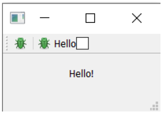

> 图四十四：带有一个操作和两个控件的工具栏。

## 菜单

菜单是用户界面的另一个标准组件。通常它们位于窗口顶部，或在macOS系统中位于屏幕顶部。它们允许访问所有标准应用程序功能。存在一些标准菜单——例如文件、编辑、帮助。菜单可以嵌套以创建功能的分层树结构，并且它们通常支持并显示键盘快捷键以快速访问其功能。

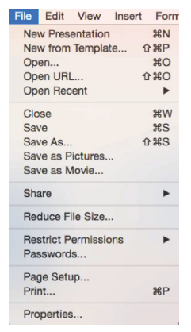

> 图四十五：标准图形用户界面元素——菜单

要创建菜单，我们需要在 `QMainWindow` 上调用 `.menuBar()` 方法来创建菜单栏。我们通过调用 `.addMenu()` 方法并传入菜单名称来在菜单栏上添加菜单。我将其命名为 `‘&File’`。这里的 `&` 符号定义了快捷键，按下 Alt 键时可快速跳转到该菜单。


> macOS 上的快捷键
>
> 这在 macOS 上是不可见的。请注意，这与键盘快捷键不同——我们稍后会详细介绍。

这就是操作功能发挥作用的地方。我们可以复用已有的 `QAction` 来为菜单添加相同的功能。要添加操作，只需调用 `.addAction` 并传入我们定义的操作之一。

*Listing 42. basic/toolbars_and_menus_7.py*

```python
class MainWindow(QMainWindow):
    def __init__(self):
        super().__init__()

        self.setWindowTitle("My App")

        label = QLabel("Hello!")
        label.setAlignment(Qt.AlignmentFlag.AlignCenter)

        self.setCentralWidget(label)

        toolbar = QToolBar("My main toolbar")
        toolbar.setIconSize(QSize(16, 16))
        self.addToolBar(toolbar)

        button_action = QAction(
            QIcon(os.path.join(basedir, "bug.png")),
            "&Your button",
            self,
        )
        button_action.setStatusTip("This is your button")
        button_action.triggered.connect(self.onMyToolBarButtonClick)
        button_action.setCheckable(True)
        toolbar.addAction(button_action)

        toolbar.addSeparator()

        button_action2 = QAction(
            QIcon(os.path.join(basedir, "bug.png")),
            "Your &button2",
            self,
        )
        button_action2.setStatusTip("This is your button2")
        button_action2.triggered.connect(self.onMyToolBarButtonClick)
        button_action2.setCheckable(True)
        toolbar.addAction(button_action2)

        toolbar.addWidget(QLabel("Hello"))
        toolbar.addWidget(QCheckBox())
        
        self.setStatusBar(QStatusBar(self))
        
        menu = self.menuBar()
        
        file_menu = menu.addMenu("&File")
        file_menu.addAction(button_action)
        
    def onMyToolBarButtonClick(self, s):
        print("click", s)
```

点击菜单中的选项时，您会发现该选项可切换状态——它继承了 `QAction` 的特性。

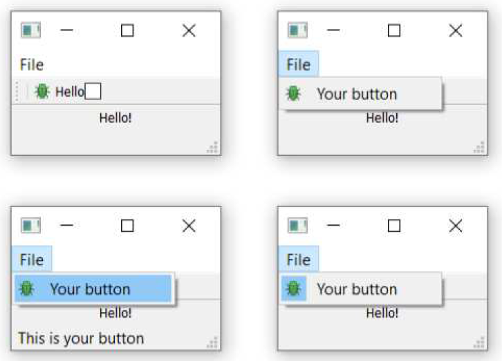

> 图四十六：窗口上显示的菜单 — 在 *macOS* 上，该菜单将位于屏幕顶部。

让我们在菜单中添加更多内容。这里我们将为菜单添加一个分隔符，它将在菜单中显示为一条水平线，然后添加我们创建的第二个 `QAction` 。

*Listing 43. basic/toolbars_and_menus_8.py*

```	python
class MainWindow(QMainWindow):
    def __init__(self):
        super().__init__()

        self.setWindowTitle("My App")

        label = QLabel("Hello!")
        label.setAlignment(Qt.AlignmentFlag.AlignCenter)

        self.setCentralWidget(label)

        toolbar = QToolBar("My main toolbar")
        toolbar.setIconSize(QSize(16, 16))
        self.addToolBar(toolbar)

        button_action = QAction(
            QIcon(os.path.join(basedir, "bug.png")),
            "&Your button",
            self,
        )
        button_action.setStatusTip("This is your button")
        button_action.triggered.connect(self.onMyToolBarButtonClick)
        button_action.setCheckable(True)
        toolbar.addAction(button_action)

        toolbar.addSeparator()

        button_action2 = QAction(
            QIcon(os.path.join(basedir, "bug.png")),
            "Your &button2",
            self,
        )
        button_action2.setStatusTip("This is your button2")
        button_action2.triggered.connect(self.onMyToolBarButtonClick)
        button_action2.setCheckable(True)
        toolbar.addAction(button_action2)

        toolbar.addWidget(QLabel("Hello"))
        toolbar.addWidget(QCheckBox())
        
        self.setStatusBar(QStatusBar(self))
        
        menu = self.menuBar()
        
        file_menu = menu.addMenu("&File")
        file_menu.addAction(button_action)
        file_menu.addSeparator()
        file_menu.addAction(button_action2)
        
    def onMyToolBarButtonClick(self, s):
        print("click", s)
```

> 🚀 **运行它吧！** 您应该看到两个菜单项，它们之间应该会有一条分隔线。

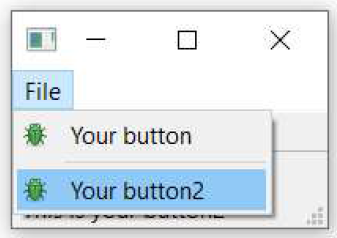

> 图四十七：我们的操作在菜单中显示出来了

您还可以使用“&”符号为菜单添加快捷键，以便在菜单打开时，只需按下一个键即可跳转到菜单项。同样，此功能在 macOS 上不适用。

要添加子菜单，只需通过调用父菜单的 addMenu() 方法创建一个新菜单。然后您可以像往常一样向其中添加操作项。例如：

*Listing 44. basic/toolbars_and_menus_9.py*

```python
class MainWindow(QMainWindow):
    def __init__(self):
        super().__init__()

        self.setWindowTitle("My App")

        label = QLabel("Hello!")
        label.setAlignment(Qt.AlignmentFlag.AlignCenter)

        self.setCentralWidget(label)

        toolbar = QToolBar("My main toolbar")
        toolbar.setIconSize(QSize(16, 16))
        self.addToolBar(toolbar)

        button_action = QAction(
            QIcon(os.path.join(basedir, "bug.png")),
            "&Your button",
            self,
        )
        button_action.setStatusTip("This is your button")
        button_action.triggered.connect(self.onMyToolBarButtonClick)
        button_action.setCheckable(True)
        toolbar.addAction(button_action)

        toolbar.addSeparator()

        button_action2 = QAction(
            QIcon(os.path.join(basedir, "bug.png")),
            "Your &button2",
            self,
        )
        button_action2.setStatusTip("This is your button2")
        button_action2.triggered.connect(self.onMyToolBarButtonClick)
        button_action2.setCheckable(True)
        toolbar.addAction(button_action2)

        toolbar.addWidget(QLabel("Hello"))
        toolbar.addWidget(QCheckBox())
        
        self.setStatusBar(QStatusBar(self))
        
        menu = self.menuBar()
        
        file_menu = menu.addMenu("&File")
        file_menu.addAction(button_action)
        file_menu.addSeparator()
        
        file_submenu = file_menu.addMenu("Submenu")
        file_submenu.addAction(button_action2)
        
    def onMyToolBarButtonClick(self, s):
        print("click", s)
```

如果您现在运行这个示例，并将鼠标悬停在文件菜单中的子菜单条目上，您会看到一个单条目子菜单出现，其中包含我们的第二个操作。您可以继续向这个子菜单添加条目，与添加顶级菜单条目时的方式相同。

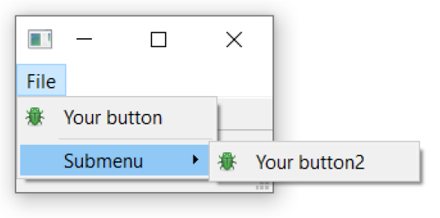

> 图四十八：文件菜单中的嵌套子菜单。

最后，我们将为 `QAction` 添加一个键盘快捷键。您可以通过调用 `setKeySequence()` 并传入键盘序列来定义键盘快捷键。任何已定义的键盘序列都将显示在菜单中。


> 隐藏的快捷键
>
> 请注意，键盘快捷键与`QAction` 相关联，无论 `QAction` 是否被添加到菜单或工具栏中，它都有效。

键序列可以通过多种方式定义——作为文本传递、使用Qt 命名空间中的键名，或者使用Qt 命名空间中定义的键序列。请您尽可能使用后一种方式，以确保符合操作系统标准。

以下是完成后的代码，显示了工具栏按钮和菜单。

*Listing 45. basic/toolbars_and_menus_end.py*

```python
class MainWindow(QMainWindow):
    def __init__(self):
        super().__init__()

        self.setWindowTitle("My App")

        label = QLabel("Hello!")
        # Qt 命名空间有许多用于自定义控件的属性。参见：http://doc.qt.io/qt-5/qt.html
        label.setAlignment(Qt.AlignmentFlag.AlignCenter)

        # 设置窗口的中央控件。默认情况下，控件将扩展以占据窗口中的所有空间。
        self.setCentralWidget(label)

        toolbar = QToolBar("My main toolbar")
        toolbar.setIconSize(QSize(16, 16))
        self.addToolBar(toolbar)

        button_action = QAction(
            QIcon(os.path.join(basedir, "bug.png")),
            "&Your button",
            self,
        )
        button_action.setStatusTip("This is your button")
        button_action.triggered.connect(self.onMyToolBarButtonClick)
        button_action.setCheckable(True)

        # 您可以使用键盘名称输入快捷键，例如Ctrl+p
        # Qt.命名空间标识符（例如 Qt.CTRL + Qt.Key_P）
        # 或系统无关标识符（例如 QKeySequence.Print）
        button_action.setShortcut(QKeySequence("Ctrl+p"))
        toolbar.addAction(button_action)

        toolbar.addSeparator()

        button_action2 = QAction(
            QIcon(os.path.join(basedir, "bug.png")),
            "Your &button2",
            self,
        )
        button_action2.setStatusTip("This is your button2")
        button_action2.triggered.connect(self.onMyToolBarButtonClick)
        button_action2.setCheckable(True)
        toolbar.addAction(button_action)

        toolbar.addWidget(QLabel("Hello"))
        toolbar.addWidget(QCheckBox())
        self.setStatusBar(QStatusBar(self))

        menu = self.menuBar()
        
        file_menu = menu.addMenu("&File")
        file_menu.addAction(button_action)
        
        file_menu.addSeparator()
        
        file_submenu = file_menu.addMenu("Submenu")
        
        file_submenu.addAction(button_action2)
        
    def onMyToolBarButtonClick(self, s):
        print("click", s)
```

## 菜单与工具栏的组织管理

如果用户无法找到应用程序的操作，他们就无法充分发挥应用程序的全部功能。让操作易于发现是创建用户友好型应用程序的关键。一个常见的错误是试图通过在应用程序的各个地方添加操作来解决这个问题，结果反而让用户感到困惑和不知所措。

请您将常见且必要的操作放在首位，确保它们易于查找和回忆。想想大多数编辑应用程序中的“文件”>“新建”选项。它位于“文件”菜单顶部，并绑定了一个简单的键盘快捷键 **Ctrl + N**。如果 “新建文档…” **需要通过“文件”>“常用操作”>“文件操作”>“当前文档”>“新建”**或快捷键 **Ctrl +Alt + J** 才能访问，用户将难以找到它。

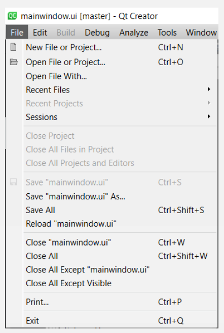

> Qt Creator 中的文件菜单部分，请注意常见操作位于顶部，不常用的操作则位于下方。

如果您把“文件”>“保存”菜单隐藏得像这样，您的用户就更不可能保存他们的作品，而更有可能丢失它们——这是字面意义上和比喻意义上的！请您看看您电脑上现有的应用程序，来获取灵感。但您要保持批判性眼光，因为市面上充斥着大量设计糟糕的软件。

请您在菜单和工具栏中使用逻辑分组，这样可以更轻松地找到所需内容。在少数几个选项中找到某物比在长列表中更容易。

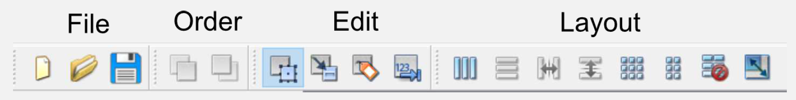

> Qt Designer 中的分组工具栏

避免在多个菜单中重复相同操作，因为这会让它们的用途变得模糊——“这些操作是不是做同样的事情？”——即使它们的标签完全相同。最后，不要试图通过动态隐藏/移除菜单项来简化菜单。这会导致用户在寻找不存在的选项时感到困惑“……刚才还在这里”。不同状态应通过禁用菜单项、使用独立窗口、清晰区分的界面模式或对话框来表示。

---

**请**将菜单按层次结构组织，并逻辑地分组操作。  

**请**将最常用的功能复制到工具栏上。

**请**在菜单中禁用无法使用的项目。  

**请勿**将同一操作添加到多个菜单中。  

**请勿**将所有菜单操作都添加到工具栏上。  

**请勿**在不同位置使用相同操作的不同名称或图标。  

**请勿**从菜单中删除项目——而是禁用它们。