---
prev:
  text: '7. 操作、工具栏与菜单'
  link: '/BasicPyQt6Features/7'
next:
  text: '9. 窗口'
  link: '/BasicPyQt6Features/9'
---

## 8. 对话框

对话框是图形用户界面中的有用组件，可让您与用户进行交流（因此得名“对话框”）。它们通常用于文件打开/保存、设置、首选项或应用程序主用户界面中无法容纳的功能。它们是小型模态（或阻塞）窗口，会始终显示在主应用程序窗口前，直到被关闭。Qt实际上为最常见的使用场景提供了多种“特殊”对话框，使您能够提供平台原生的用户体验，从而提升用户体验。

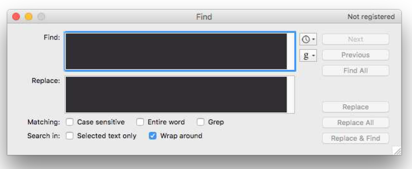

> 图四十九：标准图形用户界面功能——搜索对话框

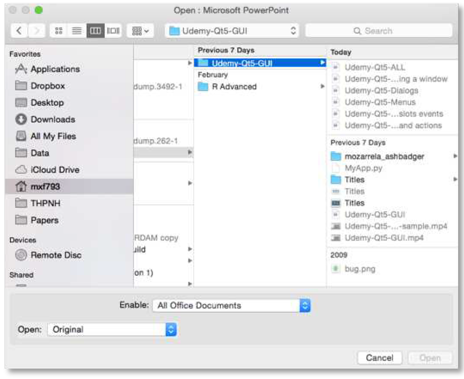

> 图五十：标准图形用户界面功能——文件打开对话框

在 Qt 中，对话框由 `QDialog` 类处理。要创建一个新的对话框只需创建一个 `QDialog` 类型的对象，并将其父控件（例如`QMainWindow`）作为其父对象传递给该对象即可。

让我们创建自己的 `QDialog`。首先，我们从一个简单的框架应用程序开始，该应用程序有一个按钮，该按钮与槽方法相连。

*Listing 46. basic/dialogs_start.py*

```python
import sys

from PyQt6.QtWidgets import QApplication, QMainWindow, QPushButton

class MainWindow(QMainWindow):
    def __init__(self):
        super().__init__()

        self.setWindowTitle("My App")

        button = QPushButton("Press me for a dialog!")
        button.clicked.connect(self.button_clicked)
        self.setCentralWidget(button)
        
    def button_clicked(self, s):
        print("click", s)
        
        
app = QApplication(sys.argv)

window = MainWindow()
window.show()

app.exec()
```

在槽 `button_clicked`（接收按钮按下的信号）中，我们创建对话框实例，并将我们的 `QMainWindow` 实例作为父窗口传递。这将使对话框成为 `QMainWindow` 的模态窗口。这意味着对话框将完全阻止与父窗口的交互。

*Listing 47. basic/dialogs_1.py*

```python
import sys

from PyQt6.QtWidgets import (
    QApplication,
    QDialog,
    QMainWindow,
    QPushButton,
)

class MainWindow(QMainWindow):
    def __init__(self):
        super().__init__()

        self.setWindowTitle("My App")

        button = QPushButton("Press me for a dialog!")
        button.clicked.connect(self.button_clicked)
        self.setCentralWidget(button)
        
    def button_clicked(self, s):
        print("click", s)
        
        dlg = QDialog(self)
        dlg.setWindowTitle("?")
        dlg.exec()
        
        
app = QApplication(sys.argv)

window = MainWindow()
window.show()

app.exec()
```

> 🚀 **运行它吧！** 点击按钮后，您将看到一个空的对话框弹出。

一旦创建了对话框，我们使用 `exec()` 函数启动它——就像我们之前使用 `QApplication` 创建应用程序的主事件循环一样。这并非巧合：当您执行 `QDialog` 时，会为对话框专门创建一个全新的事件循环。


> 一个事件循环统领一切
>
> 还记得我提到过，任何时候只能有一个 Qt 事件循环在运行吗？我是认真的！`QDialog` 会完全阻塞你的应用程序执行。不要在启动对话框的同时，还期望应用程序的其他部分继续运行。
>
> 我们稍后将探讨如何利用多线程技术来解决这一难题。

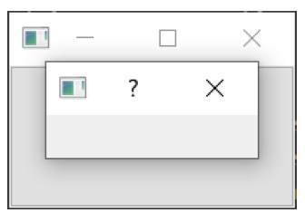

> 图五十一：我们的空对话框覆盖在窗口上。

就像我们的第一个窗口一样，这个窗口也不太有趣。让我们通过添加一个对话框标题和一组“确定”和“取消”按钮来解决这个问题，以便用户可以接受或拒绝该模态窗口。

要自定义 `QDialog`，我们可以继承它。

*Listing 48. basic/dialogs_2a.py*

```python
class CustomDialog(QDialog):
    def __init__(self):
        super().__init__()

        self.setWindowTitle("HELLO!")
        
        buttons = (
            QDialogButtonBox.StandardButton.Ok
            | QDialogButtonBox.StandardButton.Cancel
        )
        
        self.buttonBox = QDialogButtonBox(buttons)
        self.buttonBox.accepted.connect(self.accept)
        self.buttonBox.rejected.connect(self.reject)
        
        self.layout = QVBoxLayout()
        message = QLabel("Something happened, is that OK?")
        self.layout.addWidget(message)
        self.layout.addWidget(self.buttonBox)
        self.setLayout(self.layout)
```

在上述代码中，我们首先创建了 `QDialog` 的子类，并将其命名为 `CustomDialog` 。对于 `QMainWindow`，我们在类中的 `__init__` 块中应用自定义设置，以便在对象创建时应用这些自定义设置。首先，我们使用 `.setWindowTitle()` 为 `QDialog` 设置标题，与我们为主窗口设置标题的方式完全相同。

下一段代码涉及创建和显示对话框按钮。这可能比您预期的要复杂一些。然而，这是由于Qt在不同平台上处理对话框按钮位置时具有灵活性。


> 轻松解决？
>
> 当然，您可以选择忽略这一点，使用布局中的标准 `QButton`，但本文所述的方法可确保对话框遵循主机桌面标准（例如“确定”按钮位于左侧而非右侧）。随意更改这些行为可能会让用户感到极其烦躁，因此我不建议这样做。

创建对话框按钮框的第一步是使用 `QDialogButtonBox` 的命名空间属性定义要显示的按钮。可用的按钮完整列表如下：

*Table 1. `QDialogButtonBox` available button types.*

| 按键类型                           |
| ---------------------------------- |
| `QDialogButtonBox.Ok`              |
| `QDialogButtonBox.Open`            |
| `QDialogButtonBox.Save`            |
| `QDialogButtonBox.Cancel`          |
| `QDialogButtonBox.Close`           |
| `QDialogButtonBox.Discard`         |
| `QDialogButtonBox.Apply`           |
| `QDialogButtonBox.Reset`           |
| `QDialogButtonBox.RestoreDefaults` |
| `QDialogButtonBox.Help`            |
| `QDialogButtonBox.SaveAll`         |
| `QDialogButtonBox.Yes`             |
| `QDialogButtonBox.YesToAll`        |
| `QDialogButtonBox.No`              |
| `QDialogButtonBox.NoToAll`         |
| `QDialogButtonBox.Abort`           |
| `QDialogButtonBox.Retry`           |
| `QDialogButtonBox.Ignore`          |
| `QDialogButtonBox.NoButton`        |

这些应该足以创建任何你能想到的对话框。您可以通过使用管道符 (|) 将多个按钮进行或运算来构建多按钮行。Qt会根据平台标准自动处理按钮的顺序。例如，要显示“确定”和“取消”按钮，我们使用了：

```python
buttons = QDialogButtonBox.Ok | QDialogButtonBox.Cancel
```

变量按钮现在包含一个整数值，代表这两个按钮。接下来，我们必须创建一个 QDialogButtonBox 实例来容纳这些按钮。按钮的显示标志作为第一个参数传递。

为了使按钮产生效果，您必须将正确的 `QDialogButtonBox` 信号连接到对话框上的槽。在本例中，我们将 `QDialogButtonBox` 的 `.accepted` 和 `.rejected` 信号连接到 `QDialog` 子类的`.accept()` 和 `.reject()` 处理程序。

最后，为了使 `QDialogButtonBox` 出现在我们的对话框中，我们必须将其添加到对话框布局中。因此，对于主窗口，我们创建一个布局，并将我们的 `QDialogButtonBox`  添加到其中（`QDialogButtonBox` 是一个控件），然后将该布局设置到我们的对话框上。

最终，我们在 `MainWindow.button_clicked` 槽中启动 `CustomDialog`。

*Listing 49. basic/dialogs_2a.py*

```python
    def button_clicked(self, s):
        print("click", s)
    
        dlg = CustomDialog()
        if dlg.exec():
            print("Success!")
        else:
            print("Cancel!")
```

> 🚀 **运行它吧！** 点击以启动对话框，您将看到一个包含按钮的对话框。

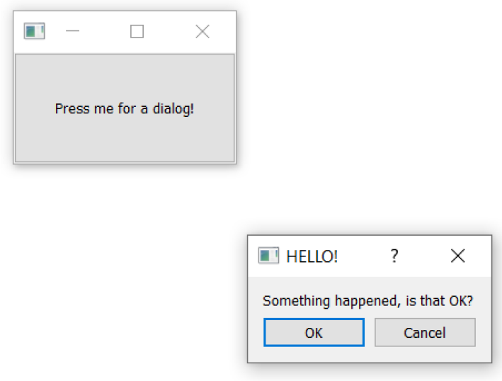

> 图五十二：我们与标签和按钮的对话框。

当您点击按钮以启动对话框时，可能会发现它出现在父窗口之外——通常位于屏幕中央。通常您希望对话框出现在其启动窗口之上，以便用户更容易找到。要实现这一点，我们需要为对话框指定一个父窗口。如果我们将主窗口作为**父窗口**传递给 Qt，Qt 会将新对话框的位置调整为对话框的中心与窗口的中心对齐。

我们可以修改我们的 `CustomDialog` 类，使其接受一个 `parent` 参数。

*Listing 50. basic/dialogs_2b.py*

```python
class CustomDialog(QDialog):
    def __init__(self, parent=None): #1
        super().__init__(parent)

        self.setWindowTitle("HELLO!")
        
        buttons = (
            QDialogButtonBox.StandardButton.Ok
            | QDialogButtonBox.StandardButton.Cancel
        )
        
        self.buttonBox = QDialogButtonBox(buttons)
        self.buttonBox.accepted.connect(self.accept)
        self.buttonBox.rejected.connect(self.reject)
        
        self.layout = QVBoxLayout()
        message = QLabel("Something happened, is that OK?")
        self.layout.addWidget(message)
        self.layout.addWidget(self.buttonBox)
        self.setLayout(self.layout)
```

> 1. 我们设置默认值为 `None`，这样我们就可以省略父对象。

然后，当我们创建自定义对话框的实例时，可以将主窗口作为参数传递进去。在我们的 `button_clicked` 方法中，`self` 就是我们的主窗口对象。

*Listing 51. basic/dialogs_2b.py*

```python
    def button_clicked(self, s):
        print("click", s)
        
        dlg = CustomDialog(self)
        if dlg.exec():
            print("Success!")
        else:
            print("Cancel!")
```

> 🚀 **运行它吧！** 点击以启动对话框，您应该会在父窗口正中央看到对话框弹出。

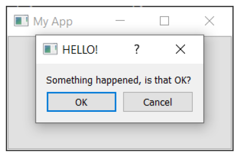

> 图五十三：我们的对话框位于父窗口的中央。

恭喜！您已成功创建了第一个对话框。当然，您可以继续向对话框中添加任何其他内容。只需像往常一样将其插入到布局中即可。

大多数应用程序都需要一些常见的对话框。虽然您可以自行构建这些对话框，但Qt也提供了许多内置对话框供你使用。这些对话框为您处理了大量工作，设计合理且符合平台标准。

### 使用 `QMessageBox` 显示消息对话框

我们将首先介绍的内置对话框类型是 `QMessageBox`。它可用于创建信息、警告、关于或问题对话框——类似于我们手动创建的对话框。下面的示例创建了一个简单的 `QMessageBox` 并显示它。

*Listing 52. basic/dialogs_3.py*

```python
    def button_clicked(self, s):
        dlg = QMessageBox(self)
        dlg.setWindowTitle("I have a question!")
        dlg.setText("This is a simple dialog")
        button = dlg.exec()
        
        # 查找按钮枚举项以获取结果。
        button = QMessageBox.StandardButton(button)
        
        if button == QMessageBox.StandardButton.Ok:
            print("OK!")
```

> 🚀 **运行它吧！** 您将看到一个带有“确定”按钮的简单对话框。

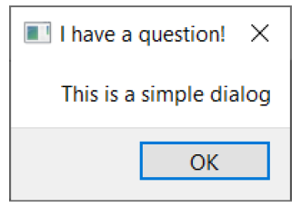

> 图五十四：一个 `QMessageBox` 对话框。

与我们之前讨论的对话框按钮框类似， `QMessageBox` 上显示的按钮也通过一组常量进行配置，这些常量可以使用 `|` 符号组合以显示多个按钮。可用按钮类型的完整列表如下所示：

*Table 2. `QMessageBox` available button types.*

| 按键类型                      |
| ----------------------------- |
| `QMessageBox.Ok`              |
| `QMessageBox.Open`            |
| `QMessageBox.Save`            |
| `QMessageBox.Cancel`          |
| `QMessageBox.Close`           |
| `QMessageBox.Discard`         |
| `QMessageBox.Apply`           |
| `QMessageBox.Reset`           |
| `QMessageBox.RestoreDefaults` |
| `QMessageBox.Help`            |
| `QMessageBox.SaveAll`         |
| `QMessageBox.Yes`             |
| `QMessageBox.YesToAll`        |
| `QMessageBox.No`              |
| `QMessageBox.NoToAll`         |
| `QMessageBox.Abort`           |
| `QMessageBox.Retry`           |
| `QMessageBox.Ignore`          |
| `QMessageBox.NoButton`        |

您还可以通过设置以下其中一个图标来调整对话框中显示的图标：

*Table 3. QMessageBox icon constants.*

| 图标状态                  | Description                |
| ------------------------- | -------------------------- |
| `QMessageBox.NoIcon`      | 消息框没有图标             |
| `QMessageBox.Question`    | 这条消息是在提问           |
| `QMessageBox.Information` | 该信息仅供参考             |
| `QMessageBox.Warning`     | 该消息为警告信息           |
| `QMessageBox.Critical`    | 该消息表明存在一个严重问题 |

例如，以下代码创建一个带有“**是**”和“**否**”按钮的对话框。

*Listing 53. basic/dialogs_4.py*

```python
from PyQt6.QtWidgets import (
    QApplication,
    QDialog,
    QMainWindow,
    QMessageBox,
    QPushButton,
)

class MainWindow(QMainWindow):
    # __init__ 方法已省略，以提高可读性
    def button_clicked(self, s):
        dlg = QMessageBox(self)
        dlg.setWindowTitle("I have a question!")
        dlg.setText("This is a question dialog")
        dlg.setStandardButtons(
            QMessageBox.StandardButton.Yes
            | QMessageBox.StandardButton.No
        )
        dlg.setIcon(QMessageBox.Icon.Question)
        button = dlg.exec()
        
        # 查找按钮枚举项以获取结果
        button = QMessageBox.StandardButton(button)
        
        if button == QMessageBox.StandardButton.Yes:
            print("Yes!")
        else:
            print("No!")
```

> 🚀 **运行它吧！** 您将看到一个带有“是”和“否”按钮的对话框。

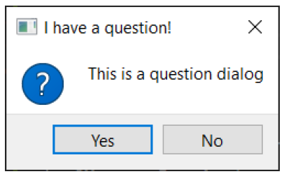

> 图五十五：使用 `QMessageBox` 创建的对话框。

### 标准的 `QMessageBox` 对话框

为了进一步简化操作，`QMessageBox` 还提供了一系列静态方法，这些方法可用于直接显示此类消息对话框，而无需先创建 `QMessageBox` 实例。这些方法如下所示：

```python
QMessageBox.about(parent, title, message)
QMessageBox.critical(parent, title, message)
QMessageBox.information(parent, title, message)
QMessageBox.question(parent, title, message)
QMessageBox.warning(parent, title, message)
```

`parent` 参数是对话框所属的父窗口。如果您是从主窗口启动对话框，可以使用 `self` 引用主窗口对象。以下示例创建一个问题对话框，与之前示例类似，包含“是”和“否”按钮。

*Listing 54. basic/dialogs_5.py*

```python
    def button_clicked(self, s):
        button = QMessageBox.question(
            self, "Question dialog", "The longer message"
        )
        
        if button == QMessageBox.StandardButton.Yes:
            print("Yes!")
        else:
            print("No!")
```

> 🚀 **运行它吧！** 您会看到相同的结果，这次使用的是内置的 `.question()`方法。

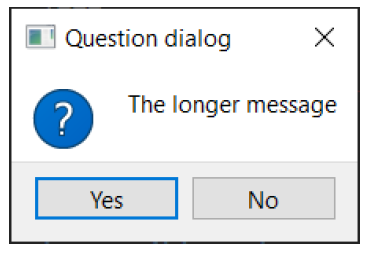

> 图五十六：内置的提问对话框

请注意，我们现在不再调用 `exec()` 函数，而是直接调用对话框方法，对话框便会被创建。每个方法的返回值都是被按下的按钮。我们可以通过将返回值与标准按钮常量进行比较，来检测被按下的按钮。

四个信息、问题、警告和关键方法也支持可选的按钮和默认按钮参数，这些参数可用于调整对话框中显示的按钮并默认选择其中一个。不过通常情况下，您可能并不希望更改默认设置。

*Listing 55. basic/dialogs_6.py*

```python
    def button_clicked(self, s):
        button = QMessageBox.critical(
            self,
            "Oh dear!",
            "Something went very wrong.",
            buttons=QMessageBox.StandardButton.Discard
            | QMessageBox.StandardButton.NoToAll
            | QMessageBox.StandardButton.Ignore,
            defaultButton=QMessageBox.StandardButton.Discard,
        )
        
        if button == QMessageBox.StandardButton.Discard:
            print("Discard!")
        elif button == QMessageBox.StandardButton.NoToAll:
            print("No to all!")
        else:
            print("Ignore!")
```

> 🚀 **运行它吧！** 您将看到一个带有自定义按钮的确认对话框


> 图五十七：严重错误！这是一个糟糕的对话框。

### 请求单个值

有时您会需要从用户获取单个参数，并希望能够显示一个简单的输入对话框来获取该参数。对于此用例，`PyQt6` 提供了`QInputDialog` 类。该类可用于获取不同类型的数据，同时还可以对用户输入的值设置限制。

静态方法都接受一个父控件的父参数（通常为 `self` ）、一个对话框窗口标题的标题参数以及一个显示在输入框旁边的标签，以及其他类型特定的控件。调用这些方法时，它们会显示一个对话框，关闭后返回一个值和 `ok` 的元组，告知您是否按下了“确定”按钮。如果 `ok` 为 `False`，则对话框已关闭。

首先，我们来看一个最简单的例子——一个按钮，它会弹出一个对话框，从用户那里获取一个整数值。它使用了 `QDialog.get_int()` 静态方法，传递了父级 `self`、窗口标题和输入控件旁边显示的提示信息。

*Listing 56. basic/dialogs_input_1.py*

```python
import sys

from PyQt6.QtWidgets import (
    QApplication,
    QInputDialog,
    QMainWindow,
    QPushButton,
)


class MainWindow(QMainWindow):
    def __init__(self):
        super().__init__()
        
        self.setWindowTitle("My App")
        
        button1 = QPushButton("Integer")
        button1.clicked.connect(self.get_an_int)
        
        self.setCentralWidget(button1)
    
    def get_an_int(self):
        my_int_value, ok = QInputDialog.getInt(
            self, "Get an integer", "Enter a number"
        )
        print("Result:", ok, my_int_value)
        
        
app = QApplication(sys.argv)

window = MainWindow()
window.show()

app.exec()
```

> 🚀 **运行它吧！** 您将看到一个按钮。按下它后，系统会提示您输入一个数字。

到目前为止，一切都很令人兴奋。让我们扩展这个例子，添加一些按钮，以及它们的处理方法。我们将先将按钮的信号连接到方法槽，然后逐步实现每个输入方法。

*Listing 57. basic/dialogs_input_2.py*

```python
import sys

from PyQt6.QtWidgets import (
    QApplication,
    QInputDialog,
    QLineEdit,
    QMainWindow,
    QPushButton,
    QVBoxLayout,
    QWidget,
)


class MainWindow(QMainWindow):
    def __init__(self):
        super().__init__()

        self.setWindowTitle("My App")

        layout = QVBoxLayout()

        button1 = QPushButton("Integer")
        button1.clicked.connect(self.get_an_int)
        layout.addWidget(button1)

        button2 = QPushButton("Float")
        button2.clicked.connect(self.get_a_float)
        layout.addWidget(button2)

        button3 = QPushButton("Select")
        button3.clicked.connect(self.get_a_str_from_a_list)
        layout.addWidget(button3)

        button4 = QPushButton("String")
        button4.clicked.connect(self.get_a_str)
        layout.addWidget(button4)

        button5 = QPushButton("Text")
        button5.clicked.connect(self.get_text)
        layout.addWidget(button5)
        
        container = QWidget()
        container.setLayout(layout)
        self.setCentralWidget(container)
        
    def get_an_int(self):
        my_int_value, ok = QInputDialog.getInt(
            self, "Get an integer", "Enter a number"
        )
        print("Result:", ok, my_int_value)
        
    def get_a_float(self):
        pass
    
    def get_a_str_from_a_list(self):
        pass
    
    def get_a_str(self):
        pass
    
    def get_text(self):
        pass
    
    
app = QApplication(sys.argv)

window = MainWindow()
window.show()

app.exec()
```

> 🚀 **运行它吧！** 您将看到一组按钮，可用于启动输入功能，但目前仅支持整数输入。

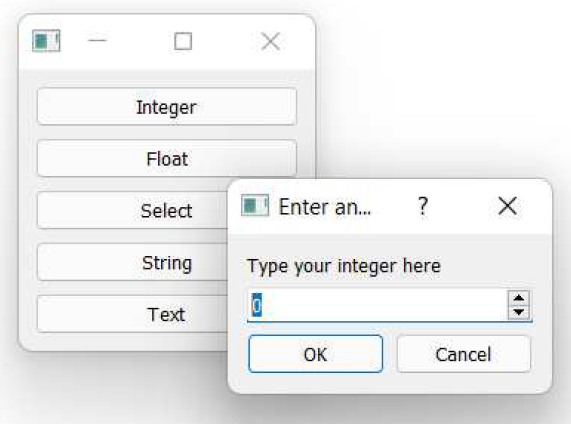

> 图五十八：对话框启动器演示。点击按钮以启动对话框并输入值。

按下按钮将调用我们定义的输入方法之一，让我们接下来实现它们。我们将依次遍历每个 `QInputDialog` 方法，查看可用的配置选项并将其添加到示例中。

#### 整数

如前所述，要从用户获取整数值，可以使用 `QInputDialog.getInt()` 方法。该方法会在对话框中显示一个标准的 Qt `QDoubleSpinBox` 控件。您可以指定初始值、输入的最小值和最大值范围，以及使用箭头控件时的步长。

*Listing 58. basic/dialogs_input_3.py*

```python
    def get_an_int(self):
        title = "Enter an integer"
        label = "Type your integer here"
        my_int_value, ok = QInputDialog.getInt(
            self, title, label, value=0, min=-5, max=5, step=1
        )
        print("Result:", ok, my_int_value)
```

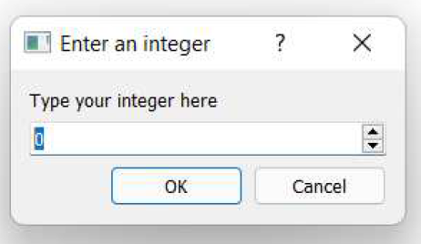

> 图五十九：整数输入的对话框


> 即使用户点击“取消”按钮退出对话框，输入的值仍会被返回。在使用该值之前，您应始终先检查 `ok` 返回参数的值。

#### 浮点数

对于浮点数类型，您可以使用 `QInputDialog.getDouble()` 方法—— Python中的 `float` 类型对应着 C++ 中的 `double` 类型。这与上文的 `getInt` 输入完全相同，只是增加了 `decimals` 参数来控制显示的小数位数。

*Listing 59. basic/dialogs_input_3.py*

```python
   def get_a_float(self):
       title = "Enter a float"
       label = "Type your float here"
       my_float_value, ok = QInputDialog.getDouble(
           self,
           title,
           label,
           value=0,
           min=-5.3,
           max=5.7,
           decimals=2,
       )
       print("Result:", ok, my_float_value)
```

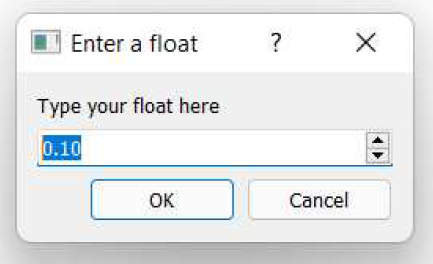

> 图六十：浮点数输入的对话框

#### 从字符串列表中选择

要从字符串列表中选择一个项，可以使用 `QInputDialog.getItem()` 方法。要选择的字符串列表通过 `items` 参数提供。您可以通过将 `current` 参数设置为所选项的索引，来指定初始选中的项。默认情况下，该列表是可编辑的，即用户可以根据需要向列表中添加新项。您可以通过传递 `editable=False` 来禁用此行为。

*Listing 60. basic/dialogs_input_3.py*

```python
    def get_a_str_from_a_list(self):
        title = "Select a string"
        label = "Select a fruit from the list"
        items = ["apple", "pear", "orange", "grape"]
        initial_selection = 2  # orange，从 0 开始索引
        my_selected_str, ok = QInputDialog.getItem(
            self,
            title,
            label,
            items,
            current=initial_selection,
            editable=False,
        )
        print("Result:", ok, my_selected_str)
```

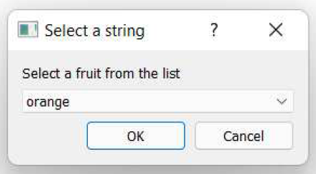

> 图六十一：从字符串列表中选择输入的对话框

#### 单行文本

要从用户获取一行文本，您可以使用 `QInputDialog.getText` 。您可以通过将文本作为参数传递来提供输入的初始内容。模式参数允许您在正常模式和密码模式之间切换，其中输入的文本以星号显示，分别传递 `QLineEdit.EchoMode.Normal` 或 `QLineEdit.EchoMode.Password`。

*Listing 61. basic/dialogs_input_3.py*

```python
    def get_a_str(self):
        title = "Enter a string"
        label = "Type your password"
        text = "my secret password"
        mode = QLineEdit.EchoMode.Password
        my_selected_str, ok = QInputDialog.getText(
            self, title, label, mode, text
        )
        print("Result:", ok, my_selected_str)
```

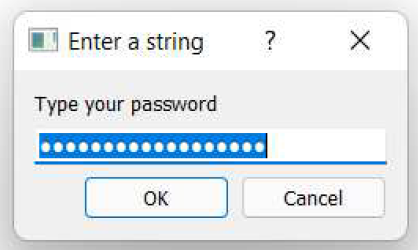

> 图六十二：单行文本输入对话框，密码模式。

#### 多行文本

最后，要输入多行文本，您可以使用 `QLineEdit.getMultiLineText()` 方法。该方法仅接受文本的初始状态。

*Listing 62. basic/dialogs_input_3.py*

```python
    def get_text(self):
        title = "Enter text"
        label = "Type your novel here"
        text = "Once upon a time..."
        my_selected_str, ok = QInputDialog.getMultiLineText(
            self, title, label, text
        )
        print("Result:", ok, my_selected_str)
```

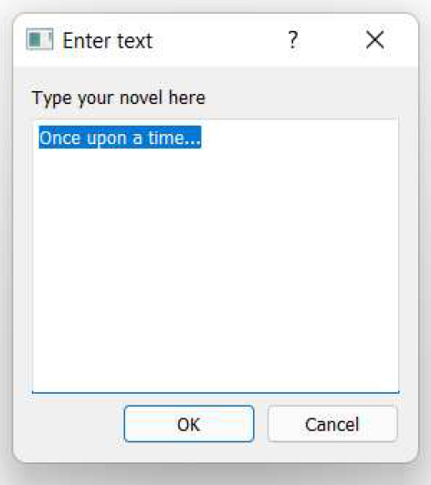

> 图六十三：多行文本输入的对话框

> 🚀 **运行它吧！** 在所有输入方法都已实现后，您现在可以点击每个按钮，查看不同的输入对话框出现。

#### 使用 QInputDialog 实例

上述静态方法适用于大多数使用场景。然而，如果您希望对 `QInputDialog` 的行为进行更精细的控制，您可以创建一个 `QInputDialog` 的实例并在显示前对其进行配置——就像其他对话框类一样。以下是相同的示例，但采用这种方法。

*Listing 63. basic/dialogs_input_instance.py*

```python
import sys

from PyQt6.QtWidgets import (
    QApplication,
    QInputDialog,
    QLineEdit,
    QMainWindow,
    QPushButton,
    QVBoxLayout,
    QWidget,
)


class MainWindow(QMainWindow):
    def __init__(self):
        super().__init__()

        self.setWindowTitle("My App")

        layout = QVBoxLayout()

        button1 = QPushButton("Integer")
        button1.clicked.connect(self.get_an_int)
        layout.addWidget(button1)

        button2 = QPushButton("Float")
        button2.clicked.connect(self.get_a_float)
        layout.addWidget(button2)

        button3 = QPushButton("Select")
        button3.clicked.connect(self.get_a_str_from_a_list)
        layout.addWidget(button3)

        button4 = QPushButton("String")
        button4.clicked.connect(self.get_a_str)
        layout.addWidget(button4)

        button5 = QPushButton("Text")
        button5.clicked.connect(self.get_text)
        layout.addWidget(button5)
        
        container = QWidget()
        container.setLayout(layout)
        self.setCentralWidget(container)
        
    def get_an_int(self):
        dialog = QInputDialog(self)
        dialog.setWindowTitle("Enter an integer")
        dialog.setLabelText("Type your integer here")
        dialog.setIntValue(0)
        dialog.setIntMinimum(-5)
        dialog.setIntMaximum(5)
        dialog.setIntStep(1)
        
        ok = dialog.exec()
        print("Result:", ok, dialog.intValue())
        
    def get_a_float(self):
        dialog = QInputDialog(self)
        dialog.setWindowTitle("Enter a float")
        dialog.setLabelText("Type your float here")
        dialog.setDoubleValue(0.1)
        dialog.setDoubleMinimum(-5.3)
        dialog.setDoubleMaximum(5.7)
        dialog.setDoubleStep(1.4)
        dialog.setDoubleDecimals(2)
        
        ok = dialog.exec()
        print("Result:", ok, dialog.doubleValue())
    
    def get_a_str_from_a_list(self):
        dialog = QInputDialog(self)
        dialog.setWindowTitle("Select a string")
        dialog.setLabelText("Select a fruit from the list")
        dialog.setComboBoxItems(["apple", "pear", "orange", "grape"])
        dialog.setComboBoxEditable(False)
        dialog.setTextValue("orange")
        
        ok = dialog.exec()
        print("Result:", ok, dialog.textValue())
    
    def get_a_str(self):
        dialog = QInputDialog(self)
        dialog.setWindowTitle("Enter a string")
        dialog.setLabelText("Type your password")
        dialog.setTextValue("my secret password")
        dialog.setTextEchoMode(QLineEdit.EchoMode.Password)
        
        ok = dialog.exec()
        print("Result:", ok, dialog.textValue())
    
    def get_text(self):
        dialog = QInputDialog(self)
        dialog.setWindowTitle("Enter text")
        dialog.setLabelText("Type your novel here")
        dialog.setTextValue("Once upon a time...")
        dialog.setOption(
            QInputDialog.InputDialogOption.UsePlainTextEditForTextInput,
            True,
        )
        
        ok = dialog.exec()
        print("Result:", ok, dialog.textValue())
    
    
app = QApplication(sys.argv)

window = MainWindow()
window.show()

app.exec()
```

> 🚀 **运行它吧！** 它应该像以前一样工作——请随意调整参数来调整它的行为！

有几点需要注意。首先，当您调用 `exec()` 时，返回值等同于之前返回的 `ok` 值（1 表示 `True`，0 表示 `False`）。要获取实际输入的值，您需要使用对话框对象的类型特定方法，例如 `.doubleValue()` 。其次，对于 `QComboBox` 从字符串列表中选择项时，您使用与行输入或文本输入相同的 `.setTextValue()`（设置）和 `.textValue()`（获取）方法。

### 文件对话框

应用程序中对话框最常见的用途之一是处理文件——无论是应用程序生成的文档，还是希望在应用程序使用之间保留的配置设置。幸运的是，PyQt6内置了用于打开文件、选择文件夹和保存文件的对话框。

如前所述，如果您使用 Qt 的内置对话框工具，您的应用程序将遵循平台标准。在文件对话框的情况下，PyQt6 更进一步，将使用平台的内置对话框进行这些操作，可以确保您的应用程序对用户来说是熟悉的。


> 创建良好的文件对话框非常困难，因此我不建议您尝试自行开发。

在 PyQt6 中，文件对话框是通过 `QFileDialog` 类创建的。为了方便起见，它提供了一系列静态方法，您可以调用这些方法来显示特定的对话框，而无需进行过多配置。以下是一个使用 `QFileDialog.getOpenFileName()` 静态方法获取要打开的文件名的示例。

*Listing 64. basic/dialogs_file_1.py*

```python
import sys

from PyQt6.QtWidgets import (
    QApplication,
    QFileDialog,
    QMainWindow,
    QPushButton,
)


class MainWindow(QMainWindow):
    def __init__(self):
        super().__init__()
        
        self.setWindowTitle("My App")
        
        button1 = QPushButton("Open file")
        button1.clicked.connect(self.get_filename)
        
        self.setCentralWidget(button1)
        
    def get_filename(self):
        filename, selected_filter = QFileDialog.getOpenFileName(self)
        print("Result:", filename, selected_filter)
        
        
app = QApplication(sys.argv)

window = MainWindow()
window.show()

app.exec()
```

> 🚀 **运行它吧！** 点击按钮以打开文件选择对话框。选择一个文件并点击 **[确定]** 或 **[取消]** 按钮以查看返回的结果。

如您所见，`QFileDialog.getOpenFilename()` 方法会返回两个值。第一个值是所选文件的名称（如果对话框被取消，则为空字符串）。第二个值是当前活动的文件过滤器——用于过滤对话框中可见的文件。默认情况下，该过滤器为“所有文件 (*)”，所有文件均可见。

基于文件的对话框（打开和保存）都接受一个过滤器参数，该参数是一个用分号分隔的过滤器定义字符串列表——这有点奇怪！还有一个 `initialFilter` ，它是对话框首次打开时活动的过滤器字符串。让我们看看这些过滤器是如何定义的，以及如何最好地使用它们。

#### 文件过滤器

Qt 文件过滤器的标准格式是一个字符串，其格式如下：用户友好名称可以是任意文本，而 `*.ext` 则是文件匹配过滤器和文件扩展名。该扩展名应在过滤器字符串末尾用括号括起。

```python
"User-friendly name (*.ext)"
```

如果您想提供多个过滤器，可以使用 `;;` (两个分号) 将它们分隔开。以下是一个示例，其中包括一个“* 所有文件”过滤器。

```python
"Portable Network Graphics Image (*.png);;Comma Separated files(*.csv);;All files (*)"
```

接下来我们会更新示例，以将上述示例过滤器提供给 `QFileDialog.getOpenFilename()` 方法。

*Listing 65. basic/dialogs_file_2.py*

```python
    def get_filename(self):
        filters = "Portable Network Graphics files (*.png);;CommaSeparated Values (*.csv);;All files (*)"
        print("Filters are:", filters)
        filename, selected_filter = QFileDialog.getOpenFileName(
            self,
            filter=filters,
        )
        print("Result:", filename, selected_filter)
```


> 您通常会看到 `*.*` 用于所有文件过滤器，但在 Qt 中这不会匹配没有扩展名的文件。

您可以将过滤器写入字符串中，但这样做可能会变得有些繁琐。如果您希望在初始状态下选择特定的过滤器，则需要复制该字符串中的文本（或从中提取）。相反，我建议您将文件过滤器定义存储为字符串列表，然后在传递给对话框方法之前使用 `;;` 将列表连接起来。这样做的好处是，初始过滤器可以通过索引从该列表中选择。

```python
FILE_FILTERS = [
    "Portable Network Graphics files (*.png)",
    "Text files (*.txt)",
    "Comma Separated Values (*.csv)",
    "All files (*.*)",
]

initial_filter = FILE_FILTERS[2] # *.csv
# 构建以 ;; 分隔的过滤字符串
filters = ';;'.join(FILE_FILTERS)
```

我们的示例已更新为使用此方法，其中 `FILE_FILTERS` 在文件顶部定义，以便所有文件方法均可使用。

*Listing 66. basic/dialogs_file_2b.py*

```python
import sys

from PyQt6.QtWidgets import (
    QApplication,
    QFileDialog,
    QMainWindow,
    QPushButton,
)

FILE_FILTERS = [
    "Portable Network Graphics files (*.png)",
    "Text files (*.txt)",
    "Comma Separated Values (*.csv)",
    "All files (*.*)",
]


class MainWindow(QMainWindow):
    def __init__(self):
        super().__init__()
        
        self.setWindowTitle("My App")
        
        button1 = QPushButton("Open file")
        button1.clicked.connect(self.get_filename)
        
        self.setCentralWidget(button1)
        
    def get_filename(self):
        initial_filter = FILE_FILTERS[3] # 从列表中选择一个
        filters = ";;".join(FILE_FILTERS)
        print("Filters are:", filters)
        print("Initial filter:", initial_filter)
        
        filename, selected_filter = QFileDialog.getOpenFileName(
            self,
            filter=filters,
            initialFilter=initial_filter,
        )
        print("Result:", filename, selected_filter)
        
app = QApplication(sys.argv)

window = MainWindow()
window.show()

app.exec()
```

#### 配置文件对话框

现在我们已经了解了过滤器，让我们扩展我们的示例，为更多类型的文件操作添加处理程序。然后，我们将逐步介绍每个 `QFileDialog` 方法，以了解其他可用的配置选项。下面，我们将会添加一系列按钮，并将它们连接到文件方法槽，以处理显示不同的对话框。

*Listing 67. basic/dialogs_file_3.py*

```python
import sys

from PyQt6.QtWidgets import (
    QApplication,
    QFileDialog,
    QMainWindow,
    QPushButton,
    QVBoxLayout,
    QWidget,
)

FILE_FILTERS = [
    "Portable Network Graphics files (*.png)",
    "Text files (*.txt)",
    "Comma Separated Values (*.csv)",
    "All files (*.*)",
]


class MainWindow(QMainWindow):
    def __init__(self):
        super().__init__()
        
        self.setWindowTitle("My App")
        
        layout = QVBoxLayout()
        
        button1 = QPushButton("Open file")
        button1.clicked.connect(self.get_filename)
        layout.addWidget(button1)
        
        button2 = QPushButton("Open files")
        button2.clicked.connect(self.get_filenames)
        layout.addWidget(button2)
        
        button3 = QPushButton("Save file")
        button3.clicked.connect(self.get_save_filename)
        layout.addWidget(button3)
        
        button4 = QPushButton("Select folder")
        button4.clicked.connect(self.get_folder)
        layout.addWidget(button4)
        
        container = QWidget()
        container.setLayout(layout)
        self.setCentralWidget(container)
        
    def get_filename(self):
        initial_filter = FILE_FILTERS[3] # 从列表中选择一个
        filters = ";;".join(FILE_FILTERS)
        print("Filters are:", filters)
        print("Initial filter:", initial_filter)
        
        filename, selected_filter = QFileDialog.getOpenFileName(
            self,
            filter=filters,
            initialFilter=initial_filter,
        )
        print("Result:", filename, selected_filter)
        
    def get_filenames(self):
        pass
    
    def get_save_filename(self):
        pass
    
    def get_folder(self):
        pass
        
app = QApplication(sys.argv)

window = MainWindow()
window.show()

app.exec()
```

> 🚀 **运行它吧！** 您将看到一组可用于运行文件方法的按钮——目前仅“打开文件”功能可用

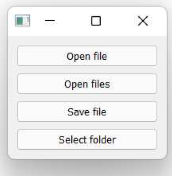

> 图六十四：文件对话框启动器演示。

让我们依次逐一查看每个文件方法，并将它们添加到我们的示例中。

#### 打开一个文件

要选择单个文件名以打开文件，可以使用 `QFileDialog.getOpenFileName()` 方法。

静态方法都接受一个父控件的父参数（通常为 `self` ）和一个对话框标题的标题参数。它们还接受一个目录参数，该参数是对话框将打开的初始目录。标题和目录都可以是空字符串，在这种情况下，将使用默认标题，对话框将在当前文件夹中打开。

除了 `caption` 和 'directory' 外，该方法还接受 `filter` 和 `initialFilter` 参数来配置文件过滤器。完成后，它返回所选文件作为字符串（包含完整路径）以及当前选定的过滤器。

*Listing 68. basic/dialogs_file_4.py*

```python
    def get_filename(self):
        caption = "" # 空值使用默认标题。
        initial_dir = "" # 空文件夹使用当前文件夹。
        initial_filter = FILE_FILTERS[3] # 从列表中选择一个。
        filters = ";;".join(FILE_FILTERS)
        print("Filters are:", filters)
        print("Initial filter:", initial_filter)
        
        filename, selected_filter = QFileDialog.getOpenFileName(
            self,
            caption=caption,
            directory=initial_dir,
            filter=filters,
            initialFilter=initial_filter,
        )
        print("Result:", filename, selected_filter)
```

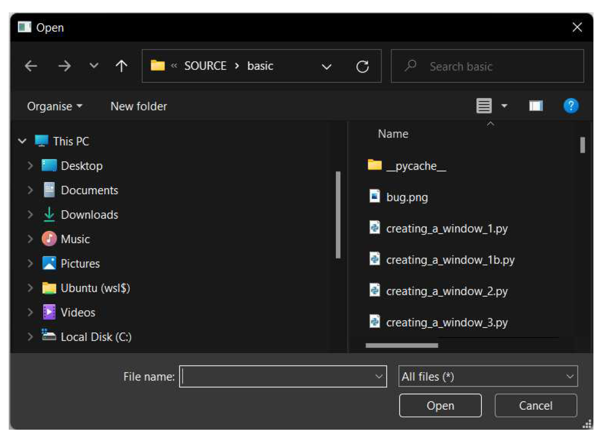

> 图六十五：标准的Windows打开对话框，处于深色模式。

一旦获得文件名，即可使用标准 Python 进行加载。如果对话框已关闭，文件名变量将为空字符串。

*Listing 69. basic/dialogs_file_4b.py*

```python
        if filename:
            with open(filename, "r") as f:
                file_contents = f.read()
```

#### 打开多个文件

有时您希望用户能够一次加载多个文件——例如将一组数据文件加载到应用程序中。`QFileDialog.getOpenFileNames()` 方法可实现此功能。该方法与上述单文件方法使用相同的参数，唯一区别在于它返回所选文件路径的字符串列表。

*Listing 70. basic/dialogs_file_4.py*

```python
    def get_filenames(self):
        caption = "" # 空值使用默认标题。
        initial_dir = "" # 空文件夹使用当前文件夹。
        initial_filter = FILE_FILTERS[1] # 从列表中选择一个。
        filters = ";;".join(FILE_FILTERS)
        print("Filters are:", filters)
        print("Initial filter:", initial_filter)
        
        filename, selected_filter = QFileDialog.getOpenFileNames(
            self,
            caption=caption,
            directory=initial_dir,
            filter=filters,
            initialFilter=initial_filter,
        )
        print("Result:", filenames, selected_filter)
```

您可以通过遍历并加载文件名中的文件，就像在前一个示例中一样。选择单个文件仍然可行，并将返回一个包含单个条目的列表。如果在未选择文件的情况下关闭对话框，文件名将是一个空列表。

*Listing 71. basic/dialogs_file_4b.py*

```python
        for filename in filenames:
            with open(filename, "r") as f:
                file_contents = f.read()
```

#### 保存一个文件

要保存文件，您可以使用 `QFileDialog.getSaveFileName()` 方法。

*Listing 72. basic/dialogs_file_4.py*

```python
    def get_save_filename(self):
        caption = "" # 空值使用默认标题。
        initial_dir = "" # 空文件夹使用当前文件夹。
        initial_filter = FILE_FILTERS[2] # 从列表中选择一个。
        filters = ";;".join(FILE_FILTERS)
        print("Filters are:", filters)
        print("Initial filter:", initial_filter)
        
        filename, selected_filter = QFileDialog.getSaveFileName(
            self,
            caption=caption,
            directory=initial_dir,
            filter=filters,
            initialFilter=initial_filter,
        )
        print("Result:", filename, selected_filter)
```

同样，您可以使用文件名变量通过标准的 Python 保存到文件。如果对话框在未选择文件的情况下关闭，文件名变量将为空字符串。如果文件已存在，它将被覆盖且现有内容会丢失。

您应始终确认用户是否确实希望覆盖文件。在下面的示例中，我们使用 `os.path.exists() `函数检查文件是否存在，然后显示一个 `QMessageBox` 对话框，询问用户是否继续覆盖现有文件。如果用户回答“否”，则不会写入文件。如果文件不存在，或用户回答“是”，则写入文件。

*Listing 73. basic/dialogs_file_4b.py*

```python
import os

       if filename:
           if os.path.exists(filename):
                # 已存在文件，请用户确认。
                write_confirmed = QMessageBox.question(
                   self,
                   "Overwrite file?",
                   f"The file {filename} exists. Are you sure youwant to overwrite it?", 
                )
            else:
                # 文件不存在，始终确认
                write_confirmed = True
                
            if write_confirmed:
                with open(filename, "w") as f:
                    file_content = "YOUR FILE CONTENT"
                    f.write(file_content)
```


> 始终尝试考虑用户可能犯的错误——例如在保存对话框中点击了错误的文件——并给他们机会自行挽救。

#### 选择一个文件夹

要选择一个现有文件夹，您可以使用 `QFileDialog.getExistingDirectory()` 方法。

```python
folder_path = QFileDialog.getExistingDirectory(parent, caption="", directory="", options=ShowDirsOnly)
```

默认情况下，`QFileDialog.getExistingDirectory` 只会显示文件夹。您可以通过传入参数来更改此设置。


> 还有一些静态方法可用于加载远程文件，这些方法返回 `QUrl` 对象。这些方法包括 `QFileDialog.getSaveFileUrl()`、`QFileDialog.getOpenFileUrls()` 、`QFileDialog.getOpenFileUrl()` ，以及用于文件夹的`QFileDialog.getExistingDirectoryUrl()`。有关详细信息，请参阅 Qt文档。

如果您希望对文件对话框的行为有更多控制权，可以创建一个 `QFileDialog` 实例并使用配置方法。以下是相同的文件对话框演示，但与使用上述静态方法不同，我们创建了一个  `QFileDialog` 实例并在启动对话框前对其进行配置。

*Listing 74. basic/dialogs_file_2.py*

```python
import sys

from PyQt6.QtWidgets import (
    QApplication,
    QFileDialog,
    QLineEdit,
    QMainWindow,
    QPushButton,
    QVBoxLayout,
    QWidget,
)

FILE_FILTERS = [
    "Portable Network Graphics files (*.png)",
    "Text files (*.txt)",
    "Comma Separated Values (*.csv)",
    "All files (*.*)",
]


class MainWindow(QMainWindow):
    def __init__(self):
        super().__init__()
        
        self.setWindowTitle("My App")
        
        layout = QVBoxLayout()
        
        button1 = QPushButton("Open file")
        button1.clicked.connect(self.get_filename)
        layout.addWidget(button1)
        
        button2 = QPushButton("Open files")
        button2.clicked.connect(self.get_filenames)
        layout.addWidget(button2)
        
        button3 = QPushButton("Save file")
        button3.clicked.connect(self.get_save_filename)
        layout.addWidget(button3)
        
        button4 = QPushButton("Select folder")
        button4.clicked.connect(self.get_folder)
        layout.addWidget(button4)
        
        container = QWidget()
        container.setLayout(layout)
        self.setCentralWidget(container)
        
    def get_filename(self):
        caption = "Open file"
        initial_dir = "" # 空文件夹使用当前文件夹。
        initial_filter = FILE_FILTERS[3] # 从列表中选择一个
        
        dialog = QFileDialog()
        dialog.setWindowTitle(caption)
        dialog.setDirectory(initial_dir)
        dialog.setNameFilters(FILE_FILTERS)
        dialog.selectNameFilter(initial_filter)
        dialog.setFileMode(QFileDialog.FileMode.ExistingFile)
        
        ok = dialog.exec()
        print(
            "Result:",
            ok,
            dialog.selectedFiles(),
            dialog.selectedNameFilter(),
        )
        
    def get_filenames(self):
        caption = "Open files"
        initial_dir = "" # 空文件夹使用当前文件夹。
        initial_filter = FILE_FILTERS[1] # 从列表中选择一个
        
        dialog = QFileDialog()
        dialog.setWindowTitle(caption)
        dialog.setDirectory(initial_dir)
        dialog.setNameFilters(FILE_FILTERS)
        dialog.selectNameFilter(initial_filter)
        dialog.setFileMode(QFileDialog.FileMode.ExistingFile)
        
        ok = dialog.exec()
        print(
            "Result:",
            ok,
            dialog.selectedFiles(),
            dialog.selectedNameFilter(),
        )
    
    def get_save_filename(self):
        caption = "Save As"
        initial_dir = "" # 空文件夹使用当前文件夹。
        initial_filter = FILE_FILTERS[1] # 从列表中选择一个
        
        dialog = QFileDialog()
        dialog.setWindowTitle(caption)
        dialog.setDirectory(initial_dir)
        dialog.setNameFilters(FILE_FILTERS)
        dialog.selectNameFilter(initial_filter)
        dialog.setFileMode(QFileDialog.FileMode.AnyFile)
        
        ok = dialog.exec()
        print(
            "Result:",
            ok,
            dialog.selectedFiles(),
            dialog.selectedNameFilter(),
        )
    
    def get_folder(self):
        caption = "Select folder"
        initial_dir = "" # 空文件夹使用当前文件夹。
        
        dialog = QFileDialog()
        dialog.setWindowTitle(caption)
        dialog.setDirectory(initial_dir)
        dialog.setFileMode(QFileDialog.FileMode.Directory)
        
        ok = dialog.exec()
        print(
            "Result:",
            ok,
            dialog.selectedFiles(),
            dialog.selectedNameFilter(),
        )
        
app = QApplication(sys.argv)

window = MainWindow()
window.show()

app.exec()
```

> 🚀 **运行它吧！** 您将看到与之前相同的对话框启动程序，其中包含相同的按钮。

您会发现，采用这种方法时，对话框之间几乎没有区别——您只需设置适当的模式和窗口标题即可。在所有情况下，我们都通过 `dialog.selectedFiles()` 方法获取选中的文件，该方法返回一个列表，即使只选中了一个文件也是如此。最后，请注意，使用这种方法您可以将过滤器作为字符串列表传递给 `dialog.setNameFilters()`，而不是使用 `;;` 连接它们，尽管如果您更喜欢这种方式的话，您仍然可以使用 `dialog.setNameFilter()` 以 `;;` 连接的方式传递。

您可以选择任何您喜欢的方法。与之前一样，自定义的 `QFileDialog` 实例具有更高的可配置性（我们在这里只是略微涉及了部分内容）然而，静态方法具有非常合理的默认值，这将为您节省一些时间。

有了这些方法，您应该能够创建应用程序所需的任何对话框了！


> Qt 还提供了一些不太常用的对话框，用于显示进度条（ `QProgressDialog` ）、一次性错误消息（`QErrorMessage` ）、选择颜色（`QColorDialog` ）、选择字体（`QFontDialog` ）以及显示向导以引导用户完成任务（`QWizard` ）。有关详细信息，请参阅 Qt 文档。

### 用户友好的对话框

创建糟糕的对话框特别容易。从让用户陷入困惑的选项中无法脱身的对话框，到层层嵌套的无休止弹出窗口，伤害用户的方式不胜枚举。

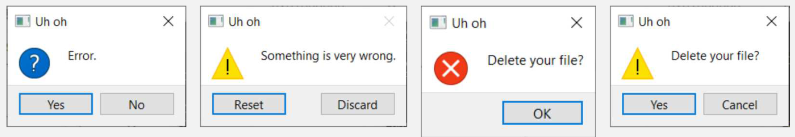

> 一些糟糕的对话示例——您发现第4个地方有什么问题了吗？默认操作具有破坏性！

**对话框按钮**由系统标准定义。您可能从未注意到 macOS 和 Linux 上的“确定”和“取消”按钮与 Windows 上的位置相反，但您的大脑已经注意到了！

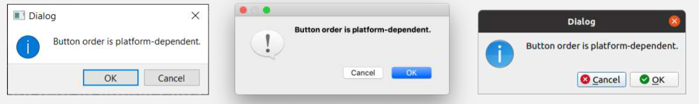

> 对话框按钮的排列顺序取决于平台。

如果您不遵循标准，将会让用户感到困惑并导致他们犯错。使用Qt时，您在使用内置控件时可以免费获得这种一致性。**请务必使用它们**！

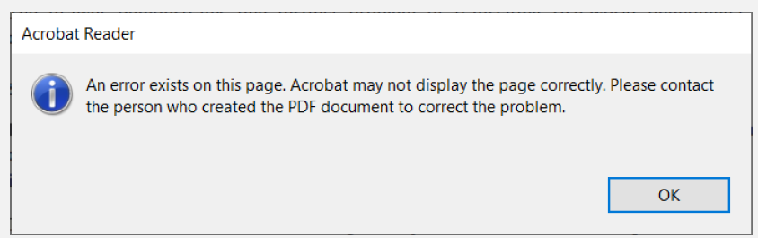

> 来自Adobe Acrobat Reader的真实对话框

**错误对话框**总是让用户感到烦躁。当您显示一个错误对话框时，您是在向用户传达坏消息。当您向某人传达坏消息时，您需要考虑它对他们的影响。

上面是Adobe Acrobat Reader中一个真实的错误对话框。请注意它如何解释存在错误、可能的后果以及潜在的解决方法。但它仍然不够完美。错误以信息对话框的形式显示，且该对话框在每页都会弹出。在文档中移动时无法抑制重复的消息。对话框文本也可进一步优化，以明确指出该错误无法恢复。

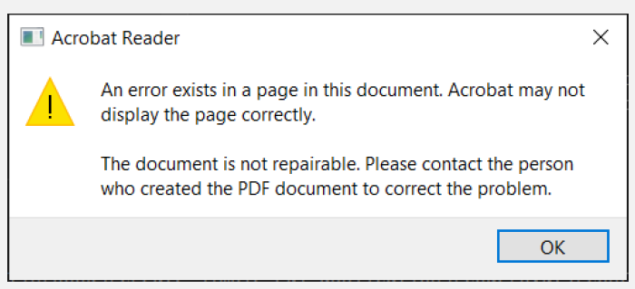

> Adobe Acrobat Reader DC 对话框的改进版本

良好的错误信息应说明——

- 发生了什么

- 哪些内容受到了影响

- 由此产生的后果是什么

- 可以采取哪些措施来解决

---

**请务必**花时间确保对话框设计合理。

**请务必**使用真实用户测试错误信息并根据反馈进行优化。

**请勿**假设用户能够理解编程术语或错误信息。