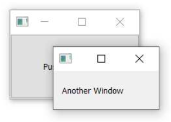
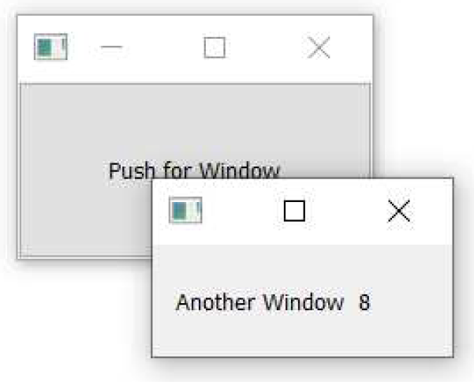

---
prev:
  text: '8. 对话框'
  link: '/BasicPyQt6Features/8'
next:
  text: '10. 事件'
  link: '/BasicPyQt6Features/10'
---

## 9. 窗口

在上一章中，我们探讨了如何打开对话框窗口。这些是特殊类型的窗口，默认情况下会捕获用户的焦点，并运行自己的事件循环，从而有效地阻塞应用程序其他部分的执行。

然而，在许多情况下，您可能希望在应用程序中打开第二个窗口，同时不阻塞主窗口——例如，用于显示某个长时间运行的进程的输出，或展示图表或其他可视化内容。或者，您可能希望创建一个应用程序，允许您同时处理多个文档，每个文档都在自己的窗口中。

在 PyQt6 中打开新窗口相对简单，但有几点需要注意以确保其正常工作。在本教程中，我们将逐步演示如何创建新窗口以及如何按需显示和隐藏外部窗口。

## 创建一个新窗口

要在 PyQt6 中创建一个新窗口，只需创建一个没有父对象的控件对象的新实例即可。该控件可以是任何控件（从技术上讲，可以是 `QWidget` 的任何子类），包括另一个 `QMainWindow`（如果您愿意的话）。


> `QMainWindow` 实例的数量没有限制，如果您需要在第二个窗口上使用工具栏或菜单，您也需要使用 `QMainWindow` 来实现。

与主窗口一样，创建窗口是不够的，您还必须显示它。

*Listing 75. basic/windows_1.py*

```python
import sys
from PyQt6.QtWidgets import (
    QApplication,
    QLabel,
    QMainWindow,
    QPushButton,
    QVBoxLayout,
    QWidget,
)


class AnotherWindow(QWidget):
    """
    此“窗口”是一个QWidget。如果它没有父窗口，它将以自由浮动窗口的形式显示。
    """
    def __init__(self):
        super().__init__()
        layout = QVBoxLayout()
        self.label = QLabel("Another Window")
        layout.addWidget(self.label)
        self.setLayout(layout)
        
        
class MainWindow(QMainWindow):
    def __init__(self):
        super().__init__()
        self.button = QPushButton("Push for Window")
        self.button.clicked.connect(self.show_new_window)
        self.setCentralWidget(self.button)
        
    def show_new_window(self, checked):
        w = AnotherWindow()
        w.show()
        
        
app = QApplication(sys.argv)

window = MainWindow()
window.show()

app.exec()
```

您运行这个程序，您会看到主窗口。点击按钮可能会显示第二个窗口，但如果您看到它，它只会显示一瞬间。发生了什么？

```python
    def show_new_window(self, checked):
        w = AnotherWindow()
        w.show()
```

我们在该方法内创建第二个窗口，将其存储在变量 `w` 中并显示出来。然而，一旦离开该方法，Python 会清理 `w` 变量，导致窗口被销毁。为解决此问题，我们需要将窗口的引用保存在某个位置——例如主窗口的 `self` 对象中。

*Listing 76. basic/windows_1b.py*

```python
    def show_new_window(self, checked):
        self.w = AnotherWindow()
        self.w.show()
```

现在，当您点击按钮以显示新窗口时，该窗口将保持打开状态。



> 图六十六：第二个窗口持续存在。

然而，如果您再次点击按钮会发生什么？窗口将被重新创建！这个新窗口将替换 `self.w` 变量中的旧窗口，而之前的窗口将被销毁。如果您将 `AnotherWindow` 的定义修改为每次创建时在标签中显示一个随机数，您将更清楚地看到这一点。

*Listing 77. basic/windows_2.py*

```python
from random import randint

from PyQt6.QtWidgets import (
    QApplication,
    QLabel,
    QMainWindow,
    QPushButton,
    QVBoxLayout,
    QWidget,
)

class AnotherWindow(QWidget):
    """
    此“窗口”是一个QWidget。如果它没有父窗口，它将以自由浮动窗口的形式显示。
    """
    
    def __init__(self):
        super().__init__()
        layout = QVBoxLayout()
        self.label = QLabel("Another Window % d" % randint(0, 100))
        layout.addWidget(self.label)
        self.setLayout(layout)
```

`__init__ `块仅在创建窗口时执行。如果您继续点击按钮，数字会发生变化，表明窗口正在被重新创建。



> 图六十七：如果再次按下按钮，数字将会改变。

一种解决方案是，在创建窗口之前，先检查该窗口是否已经存在。下面的完整示例展示了这一过程。

*Listing 78. basic/windows_3.py*

```python
class MainWindow(QMainWindow):
    def __init__(self):
        super().__init__()
        self.w = None # 目前尚未设置外部窗口。
        self.button = QPushButton("Push for Window")
        self.button.clicked.connect(self.show_new_window)
        self.setCentralWidget(self.button)
        
    def show_new_window(self, checked):
        if self.w is None:
            self.w = AnotherWindow()
            self.w.show()
```

这种方法适用于临时创建的窗口，或需要根据程序当前状态进行更改的窗口——例如，您想显示特定的图表或日志输出。然而，对于许多应用程序而言，您可能需要一些标准窗口，希望能够按需显示或隐藏。

在接下来的部分中，我们将探讨如何处理此类窗口。

## 关闭一个窗口

如前所述，如果没有对窗口的引用被保留，它将被丢弃（并关闭）。我们可以利用这种行为来关闭窗口，将前一个示例中的 `show_new_window` 方法替换为 

*Listing 79. basic/windows_4.py*

```python
    def show_new_window(self, checked):
        if self.w is None:
            self.w = AnotherWindow()
            self.w.show()
        else:
            self.w = None # 取消引用，关闭窗口
```

通过将 `self.w` 设置为 `None`（或任何其他值），对窗口的现有引用将被丢失，窗口将关闭。然而，如果我们将它设置为除 None 以外的任何其他值，第一个测试将不再通过，我们将无法重新创建一个窗口。

这仅在您未在其他地方保留此窗口的引用时有效。为了确保窗口无论如何都会关闭，您可能需要显式调用 `.close()` 方法。

*Listing 80. basic/windows_4b.py*

```python
    def show_new_window(self, checked):
        if self.w is None:
            self.w = AnotherWindow()
            self.w.show()
            
        else:
            self.w.close()
            self.w = None # 取消引用，关闭窗口
```

## 持久窗口

到目前为止，我们已经探讨了如何按需创建新窗口。然而，有时您会遇到多个标准应用程序窗口的情况。在这种情况下，通常更合理的方法是先创建这些额外窗口，然后在需要时使用 `.show()` 方法将其显示出来。

在以下示例中，我们在主窗口的 `__init__` 块中创建外部窗口，然后我们的  `show_new_window`方法只需调用 `self.w.show()` 即可显示它。

*Listing 81. basic/windows_5.py*

```python
import sys
from random import randint

from PyQt6.QtWidgets import (
    QApplication,
    QLabel,
    QMainWindow,
    QPushButton,
    QVBoxLayout,
    QWidget,
)

class AnotherWindow(QWidget):
    """
    此“窗口”是一个QWidget。如果它没有父窗口，它将以自由浮动窗口的形式显示。
    """

    def __init__(self):
        super().__init__()
        layout = QVBoxLayout()
        self.label = QLabel("Another Window % d" % randint(0, 100))
        layout.addWidget(self.label)
        self.setLayout(layout)
            
            
class MainWindow(QMainWindow):
    def __init__(self):
        super().__init__()
        self.w = AnotherWindow()
        self.button = QPushButton("Push for Window")
        self.button.clicked.connect(self.show_new_window)
        self.setCentralWidget(self.button)
        
    def show_new_window(self, checked):
        self.w.show()
        
        
app = QApplication(sys.argv)

window = MainWindow()
window.show()

app.exec()
```

如果您运行这个程序，点击按钮会像之前一样显示窗口。注意，窗口只创建一次，对已经可见的窗口调用 `.show()` 方法不会产生任何效果。

## 显示与隐藏窗口

一旦您创建了持久窗口，您就可在不重新创建的情况下显示或隐藏它。隐藏后，窗口仍存在但不可见，且不会响应鼠标或其他输入。然而，您仍可继续调用该窗口的方法并更新其状态——包括更改其外观。重新显示后，所有更改将立即生效。

下面我们更新主窗口，创建一个 `toggle_window` 方法，该方法使用 `.isVisible()` 方法检查窗口是否当前可见。如果不可见，则使用 `.show()` 方法显示它；如果已可见，则使用 `.hide()` 方法隐藏它。

```python
class MainWindow(QMainWindow):
    
    def __init__(self):
        super().__init__()
        self.w = AnotherWindow()
        self.button = QPushButton("Push for Window")
        self.button.clicked.connect(self.toggle_window)
        self.setCentralWidget(self.button)
        
    def toggle_window(self, checked):
        if self.w.isVisible():
            self.w.hide()
            
        else:
            self.w.show()
```

以下是此持久窗口及显示/隐藏状态切换的完整示例：

*Listing 82. basic/windows_6.py*

```python
import sys
from random import randint

from PyQt6.QtWidgets import (
    QApplication,
    QLabel,
    QMainWindow,
    QPushButton,
    QVBoxLayout,
    QWidget,
)

class AnotherWindow(QWidget):
    """
    此“窗口”是一个QWidget。如果它没有父窗口，它将以自由浮动窗口的形式显示。
    """

    def __init__(self):
        super().__init__()
        layout = QVBoxLayout()
        self.label = QLabel("Another Window % d" % randint(0, 100))
        layout.addWidget(self.label)
        self.setLayout(layout)
            
            
class MainWindow(QMainWindow):
    
    def __init__(self):
        super().__init__()
        self.w = AnotherWindow()
        self.button = QPushButton("Push for Window")
        self.button.clicked.connect(self.toggle_window)
        self.setCentralWidget(self.button)
        
    def toggle_window(self, checked):
        if self.w.isVisible():
            self.w.hide()
            
        else:
            self.w.show()
        
        
app = QApplication(sys.argv)

window = MainWindow()
window.show()

app.exec()
```

同样，窗口仅创建一次——窗口的 `__init__` 块不会在每次重新显示窗口时重新运行（因此标签中的数字不会改变）。

## 连接窗口之间的信号

在信号一章中，我们看到了如何直接使用信号和槽将控件连接在一起。我们只需要创建目标控件，并通过变量引用它即可。连接跨窗口的信号时，同样的原则也适用——您可以将一个窗口中的信号连接到另一个窗口中的槽，也就是说，您只需要能够访问该槽即可。

在下面的示例中，我们将主窗口上的文本输入框连接到子窗口上的 `QLabel` 控件。

*Listing 83. basic/windows_7.py*

```python
import sys
from random import randint

from PyQt6.QtWidgets import (
    QApplication,
    QLabel,
    QMainWindow,
    QPushButton,
    QVBoxLayout,
    QWidget,
    QLineEdit,
)


class AnotherWindow(QWidget):
    """
    此“窗口”是一个QWidget。如果它没有父窗口，它将以自由浮动窗口的形式显示。
    """
    
    def __init__(self):
        super().__init__()
        layout = QVBoxLayout()
        self.label = QLabel("Another Window") #2
        layout.addWidget(self.label)
        self.setLayout(layout)
        
        
class MainWindow(QMainWindow):
    def __init__(self):
        super().__init__()
        self.w = AnotherWindow()
        self.button = QPushButton("Push for Window")
        self.button.clicked.connect(self.toggle_window)
        
        self.input = QLineEdit()
        self.input.textChanged.connect(self.w.label.setText) #1
        layout = QVBoxLayout()
        layout.addWidget(self.button)
        layout.addWidget(self.input)
        container = QWidget()
        container.setLayout(layout)
        
        self.setCentralWidget(container)
        
    def toggle_window(self, checked):
        if self.w.isVisible():
            self.w.hide()
            
        else:
            self.w.show()
            
            
app = QApplication(sys.argv)

w = MainWindow()
w.show()

app.exec()
```

> 1. `AnotherWindow` 窗口对象可通过变量 `self.w` 访问。`QLabel` 可通过 `self.w.label` 和 `.setText` 槽通过 `self.w.label.setText` 访问。
> 2. 当创建 `QLabel` 时，我们将对其的引用存储在 `self` 上作为 `self.label`，因此可以在对象外部访问它。

> 🚀 **运行它吧！** 在上方框中输入一些文本，您会看到它立即出现在标签上。即使窗口被隐藏，文本也会更新——控件状态的更新并不依赖于它们是否可见。

当然，您也可以将一个窗口上的信号连接到另一个窗口上的方法。只要可以访问，任何操作都是可行的。确保组件可以相互导入和访问是构建逻辑项目结构的一个很好的动机。通常，在主窗口/模块中集中连接组件是合理的，这样可以避免交叉导入所有内容。