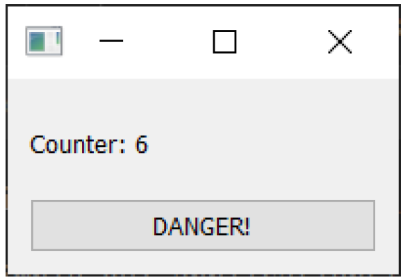

---
prev:
  text: '23. 在 Qt Designer 中使用自定义控件'
  link: '/CustomWidgets/23'
next:
  text: '25. 使用线程池'
  link: '/ConcurrentExecution/25'
---

> 计算机不应浪费您的时间，也不应要求您做超过严格必要的工作。
>
> ——Jef Raskin,，用户界面设计第二定律

通过调用 `QApplication` 对象上的 `.exec()` 启动的事件循环在与 Python 代码相同的线程中运行。运行此事件循环的线程（通常称为图形用户界面线程）还负责处理与主机操作系统之间的所有窗口通信。

默认情况下，事件循环触发的任何执行也将在该线程中同步运行。实际上，这意味着当您的 PyQt6 应用程序在代码中执行某项操作时，窗口通信和图形用户界面交互都会被冻结。

如果您正在执行的操作比较简单，并且能够快速将控制权返回给图形用户界面循环，那么用户不会察觉到这种冻结现象。但是，如果您需要执行较长时间的任务，例如打开/写入大文件、下载一些数据或渲染一些复杂的图像，就会出现问题。对于您的用户来说，应用程序似乎没有响应。由于您的应用程序不再与操作系统通信，操作系统会认为它已经崩溃——在 macOS 上，您会看到“死亡旋转轮”；在 Windows 上，您会看到“蓝屏”。这显然不是理想的用户体验。

解决方案很简单——将工作从图形用户界面线程中移出。PyQt6 提供了直观的界面来完成这项工作。

## 24. 线程与进程简介

以下是一个用于 PyQt6 的最小示例应用程序，它将使我们能够演示问题并随后进行修复。您可以将此代码复制并粘贴到一个新文件中，并将其保存为适当的文件名，例如 `concurrent.py`。

*Listing 171. bad_example_1.py*

```python
import sys
import time

from PyQt6.QtCore import QTimer
from PyQt6.QtWidgets import (
    QApplication,
    QLabel,
    QMainWindow,
    QPushButton,
    QVBoxLayout,
    QWidget,
)


class MainWindow(QMainWindow):
    def __init__(self):
        super().__init__()
        
        self.counter = 0
        
        layout = QVBoxLayout()
        self.l = QLabel("Start")
        b = QPushButton("DANGER!")
        b.pressed.connect(self.oh_no)
        
        layout.addWidget(self.l)
        layout.addWidget(b)
        
        w = QWidget()
        w.setLayout(layout)
        self.setCentralWidget(w)
        
        self.show()
        
        self.timer = QTimer()
        self.timer.setInterval(1000)
        self.timer.timeout.connect(self.recurring_timer)
        self.timer.start()
        
    def oh_no(self):
        time.sleep(5)
        
    def recurring_timer(self):
        self.counter += 1
        self.l.setText("Counter: %d" % self.counter)
        
        
app = QApplication(sys.argv)
window = MainWindow()
app.exec()
```

> 🚀 **运行它吧！** 将出现一个窗口，其中包含一个按钮和一个数字，该数字正在向上计数。



> 图198：该数字将以每秒增加1的速度持续增长，只要事件循环仍在运行。

这是由一个简单的定时器生成的，每秒触发一次。您可以将它视为我们的事件循环指示器——这是一种简单的方式，让我们知道应用程序正在正常运行。还有一个标有“危险！”的按钮。请您试着点击它。


> 图199：按下按钮！！

您会发现每次按下按钮时计数器都会停止计数，而您的应用程序会完全冻结。在Windows系统中，您可能会看到窗口变为浅色，表明其未响应，而在macOS系统中，您可能会看到旋转的“死亡之轮”。

看似冻结的界面实际上是由于 Qt 事件循环被阻塞，无法处理（并响应）窗口事件。您对窗口的点击仍会被宿主操作系统记录并发送至您的应用程序，但由于这些事件被卡在您代码中的时间延迟（`time.sleep`）部分，应用程序无法接受或响应这些事件。因此，应用程序无法响应，操作系统将其解读为冻结或卡死。

## 错误的方法

解决此问题的最简单方法是在代码内部处理事件。这将允许 Qt 继续响应主机操作系统，而您的应用程序将保持响应。您可以通过使用 `QApplication` 类的静态 `.processEvents()` 函数轻松实现这一点。只需在您的长运行代码块中的某个位置添加类似以下的代码行：

```python
QApplication.processEvents()
```

如果我们将长期运行的 `time.sleep` 代码分解为多个步骤，我们可以在其中插入 `.processEvents`。相应的代码如下：

```python
def oh_no(self):
    for n in range(5):
        QApplication.processEvents()
        time.sleep(1)
```

现在，当您按下按钮时，您的代码会像以前一样被执行。然而，现在`QApplication.processEvents()` 会间歇性地将控制权交还给 Qt，并允许它像往常一样响应操作系统事件。Qt 现在会接受事件并处理它们，然后返回运行您的其余代码。

这确实有效，但有几个原因让它变得糟糕。

首先，当您将控制权交还给 Qt 时，您的代码将不再运行。这意味着您试图执行的任何耗时操作都会花费更长时间。这可能不是您想要的结果。

其次，在主事件循环之外处理事件会导致您的应用程序在循环中分支到处理代码（例如，触发槽或事件）。如果您的代码依赖于/响应外部状态，这可能会导致未定义的行为。下面的代码演示了这种情况。

*Listing 172. bad_example_2.py*

```python
import sys
import time

from PyQt6.QtCore import QTimer
from PyQt6.QtWidgets import (
    QApplication,
    QLabel,
    QMainWindow,
    QPushButton,
    QVBoxLayout,
    QWidget,
)


class MainWindow(QMainWindow):
    def __init__(self):
        super().__init__()
        
        self.counter = 0
        
        layout = QVBoxLayout()
        
        self.l = QLabel("Start")
        b = QPushButton("DANGER!")
        b.pressed.connect(self.oh_no)
        
        c = QPushButton("?")
        c.pressed.connect(self.change_message)
        
        layout.addWidget(self.l)
        layout.addWidget(b)
        
        layout.addWidget(c)
        
        w = QWidget()
        w.setLayout(layout)
        
        self.setCentralWidget(w)
        
        self.show()
        
    def change_message(self):
        self.message = "OH NO"
        
    def oh_no(self):
        self.message = "Pressed"
        
        for _ in range(100):
            time.sleep(0.1)
            self.l.setText(self.message)
            QApplication.processEvents()
            
            
app = QApplication(sys.argv)
window = MainWindow()
app.exec()
```

如果您运行这段代码，您会看到计数器与之前相同。按下“DANGER!”按钮将将显示的文本更改为“Pressed”，正如在 `oh_no` 函数的入口处所定义的。然而，如果您在oh_no仍在运行时按下“?”按钮，您将看到消息发生变化。状态正在从循环外部进行更改。

这是一个简单的示例。然而，如果您在应用程序中有多个长时间运行的进程，每个进程都调用 `QApplication.processEvents()` 来保持系统运行，您的应用程序行为可能会迅速变得不可预测。

## 线程与进程

如果您退一步思考，想想您在应用程序中希望发生的事情，它可能可以概括为“在其他事情发生的同时发生的事情”。在计算机上运行独立任务有两种主要方法：线程和进程。

**线程**共享相同的内存空间，因此启动速度快且消耗的资源极少。共享内存使得在线程之间传递数据变得非常简单，然而，不同线程读写内存可能会导致竞争条件或段错误。然而，Python 还存在另一个问题，即多个线程受同一全局解释器锁（GIL）的限制——这意味着不释放 GIL 的 Python 代码只能在单个线程中执行。然而，对于 PyQt6 而言，这并非主要问题，因为大部分时间都花在 Python 之外。

**进程**使用独立的内存空间（以及完全独立的 Python 解释器）。这避免了与 GIL 相关的潜在问题，但代价是启动时间较长、内存开销较大以及在发送/接收数据时复杂性增加。

为了简化起见，通常使用线程是明智的选择。Qt中的进程更适合于运行和与外部程序通信。在本章中，我们将探讨在Qt内部可用的选项，以将工作转移到单独的线程和进程中。
