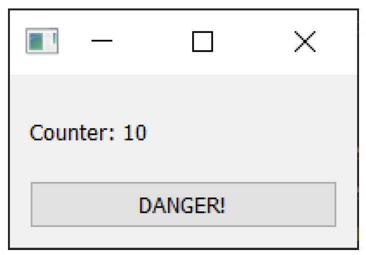

---
prev:
  text: '24. 线程与进程简介'
  link: '/ConcurrentExecution/24'
next:
  text: '26. QRunnable 示例'
  link: '/ConcurrentExecution/26'
---

## 25. 使用线程池

Qt 提供了一个非常简单的接口，用于在其他线程中运行任务，该接口在 PyQt6 中得到了很好的实现。该接口围绕两个类构建——`QRunnable` 和 `QThreadPool`。前者是用于存放您要执行的任务的容器，而后者则是管理您的工作线程的线程池。

使用 `QThreadPool` 的好处在于，它可以为您处理任务的排队和执行滑块。除了排队作业和检索结果外，几乎无需做其他事情。

## 使用 `QRunnable`

要定义自定义 `QRunnable`，您可以继承基础 `QRunnable` 类，然后将希望执行的代码放置在 `run()` 方法中。以下是将我们的长时间 `sleep` 任务实现为 `QRunnable` 的示例。将以下代码添加到 `MainWindow` 类定义之前。

*Listing 173. concurrent/qrunnable_1.py*

```python
class Worker(QRunnable):
    """
    工作线程
    """
    @pyqtSlot()
    def run(self):
        """
        您的代码应放置在此方法中
        """
        print("Thread start")
        time.sleep(5)
        print("Thread complete")
```

在另一个线程中执行我们的函数，只需创建一个 `Worker` 的实例，然后将其传递给我们的`QThreadPool` 实例即可。

我们在 `__init__` 块中创建一个线程池的实例。

*Listing 174. concurrent/qrunnable_1.py*

```python
class MainWindow(QMainWindow):
    def __init__(self):
        super().__init__()
        self.threadpool = QThreadPool()
        print(
            "Multithreading with maximum %d threads"
            % self.threadpool.maxThreadCount()
        )
```

最后，用以下代码替换 `oh_no` 方法，以创建并提交

*Listing 175. concurrent/qrunnable_1.py*

```python
    def oh_no(self):
        worker = Worker()
        self.threadpool.start(worker)
```

现在，点击按钮将创建一个工作进程来处理（长期运行的）进程，并通过 `QThreadPool` 池将其分拆到另一个线程中。如果没有足够的线程来处理传入的工作进程，它们将被排入队列，并在稍后按顺序执行。

> 🚀 **运行它吧！** 您会发现，现在应用程序可以处理您疯狂点击按钮的操作，而不会出现任何问题。



> 图200：简单的 `QRunnable` 示例应用程序。只要图形用户界面线程正在运行计数器就会每秒增加 1

请您查看控制台输出，以观察工作进程的启动和完成情况。

```bash
Multithreading with maximum 12 threads
Thread start
Thread start
Thread start
Thread complete
Thread complete
Thread complete
```

检查多次点击按钮时会发生什么。您应该看到您的线程立即执行，直到达到 `.maxThreadCount` 报告的数量。如果在已经存在此数量的活跃工作者后再次点击按钮，后续的工作者将被排队，直到有线程可用。

在此示例中，我们让 `QThreadPool` 决定理想的活跃线程数。这个数值在不同计算机上会有所不同，目的是实现最佳性能。然而，有时您可能需要指定特定的线程数——在这种情况下，您可以使用 `.setMaxThreadCount` 方法显式设置此值。此值是针对每个线程池的。

## 使用 `QThreadPool.start()`

在之前的示例中，我们自己创建了一个 `QRunnable` 对象，并将其传递给 `QThreadPool` 以进行执行。然而，对于简单的用例，Qt通过 `QThreadPool.start()` 提供了一个便捷的方法，该方法可以处理执行任意的 Python 函数和方法。Qt 会为您创建必要的 `QRunnable` 对象，并将它们排入队列。

在下面的示例中，我们将工作放在了 `do_some_work` 方法中，并修改了 `oh_no` 方法，将其传递给线程池的 `.start()` 方法。

*Listing 176. concurrent/qthreadpool_start_1.py*

```python
    def oh_no(self):
        self.threadpool.start(self.do_some_work)

    @pyqtSlot()
    def do_some_work(self):
        print("Thread start")
        time.sleep(5)
        print("Thread complete")
        
    def recurring_timer(self):
        self.counter += 1
        self.l.setText("Counter: %d" % self.counter)
```

按下按钮将执行我们在 `QThreadPool` 上定义的 `do_some_work` 方法。


> 您可以通过这种方式启动多个线程。尝试按下按钮，直到达到最大并发线程数。在线程池中有空闲空间之前，不会启动新的线程。

对于许多简单的任务来说，这种方法非常有效。在执行的函数中，您可以访问信号，并使用它们来发出数据。您无法接收信号——没有地方连接它们——但您可以通过 `self` 对象与变量进行交互。

更新代码以添加以下 `custom_signal`，并修改 `work` 方法以发出此信号并更新 `self.counter` 变量。

*Listing 177. concurrent/qthreadpool_start_2.py*

```python
class MainWindow(QMainWindow):
    
    custom_signal = pyqtSignal()
    
    def __init__(self):
        super().__init__()
        
        # 将我们的自定义信号连接到处理程序.
        self.custom_signal.connect(self.signal_handler)
        # etc.
    def oh_no(self):
        self.threadpool.start(self.do_some_work)
        
    @pyqtSlot()
    def do_some_work(self):
        print("Thread start")
        # 发出我们的定制信号.
        self.custom_signal.emit()
        for n in range(5):
            time.sleep(1)
        self.counter = self.counter - 10
        print("Thread complete")
        
    def signal_handler(self):
        print("Signal received!")

    def recurring_timer(self):
        self.counter += 1
        self.l.setText("Counter: %d" % self.counter)
```

运行此示例后，您会发现，虽然工作方法在另一个线程中运行（睡眠不会中断计数器），但我们仍然能够发出信号并修改 `self.counter` 变量。


> 您无法从另一个线程直接修改图形用户界面——尝试这样做会导致应用程序崩溃。


> 您可以使用信号修改图形用户界面。例如，尝试将 `str` 信号连接到标签的 `.setText` 方法。

虽然这是一个方便的小界面，但您经常会发现自己希望对正在运行的线程有更多的控制权，或者与它们进行更结构化的通信。接下来，我们将通过一些更复杂的示例，使用 `QRunnable` 来展示什么是可能的。

## 扩展 QRunnable

如果您想将自定义数据传递给执行函数，您可以配置您的运行器以接受参数或关键字，然后将这些数据存储在 `QRunnable`的 `self` 对象中。这些数据随后可以在 `run` 方法内部访问。

*Listing 178. concurrent/qrunnable_2.py*

```python
class Worker(QRunnable):
    """
    工作线程
    :param args: 传递给运行代码的参数
    :param kwargs: 传递给运行的关键字参数
    :code
    :
    """
    def __init__(self, *args, **kwargs):
        super().__init__()
        self.args = args
        self.kwargs = kwargs
            
    @pyqtSlot()
    def run(self):
    """
    使用传递的 self.args 初始化 runner 函数，
    """
        print(self.args, self.kwargs)
    
    def oh_no(self):
        worker = Worker("some", "arguments", keywords=2)
        self.threadpool.start(worker)
```


> 由于函数在 Python 中也是对象，您还可以将一个函数传递给运行器以执行。请参阅后文的通用示例来获取一个示例。

## 线程 I/O

有时，能够从运行中的工作者进程中传递状态和数据会非常有用。这可能包括计算结果、抛出的异常或正在进行的进度（例如进度条）。Qt 提供了信号和槽框架，允许您执行此操作，并且是线程安全的，允许从正在运行的线程直接与图形用户界面进行安全通信。信号允许您发出值，然后这些值由与 `.connect` 链接的槽函数在代码的其他位置拾取。

下面是一个简单的 `WorkerSignals` 类，它包含一些示例信号。信号。


> 自定义信号只能在从 `QObject` 派生的对象上定义。由于 `QRunnable` 并非从 `QObject` 派生，因此我们无法直接在其中定义信号。使用一个用于保存信号的自定义 `QObject` 是最简单的解决方案。

*Listing 179. concurrent/qrunnable_3.py*

```python
class WorkerSignals(QObject):
    """
    定义运行中的工作线程可用的信号。
    支持的信号包括：
    finished
        无数据
    error
        `str` 异常字符串
    result
        `dict` 处理返回的数据
    """
    finished = pyqtSignal()
    error = pyqtSignal(str)
    result = pyqtSignal(dict)
```

在这个例子中，我们定义了 3 个自定义信号：

1. **完成信号**，没有数据表明任务何时完成
2. **错误信号**，它接收一个由异常类型、异常值和格式化跟踪信息组成的元组。
3. **结果信号**，接收执行函数的任何对象类型

您可能并不需要所有这些信号，但它们被包括进来是为了表明其可能性。在下面的代码中，我们使用这些信号来通知一个简单的计算工作进程的完成和错误。

*Listing 180. concurrent/qrunnable_3.py*

```python
import random
import sys
import time

from PyQt6.QtCore import (
    QObject,
    QRunnable,
    QThreadPool,
    QTimer,
    pyqtSignal,
    pyqtSlot,
)
from PyQt6.QtWidgets import (
    QApplication,
    QLabel,
    QMainWindow,
    QPushButton,
    QVBoxLayout,
    QWidget,
)


class WorkerSignals(QObject):
    """
    定义运行中的工作线程可用的信号。
    支持的信号包括：
    finished
        无数据
    error
        `str` 异常字符串
    result
        `dict` 处理返回的数据
    """
    finished = pyqtSignal()
    error = pyqtSignal(str)
    result = pyqtSignal(dict)
    
    
class Worker(QRunnable):
    """
    工作线程
    :param args: 传递给运行代码的参数
    :param kwargs: 传递给运行的关键字参数
    :code
    :
    """
    def __init__(self, iterations=5):
        super().__init__()
        self.signals = (
            WorkerSignals()
        ) # 创建信号类的实例.
        self.iterations = iterations
            
    @pyqtSlot()
    def run(self):
    """
    使用传递的 self.args 初始化 runner 函数，
    """
        try:
            for n in range(self.iterations):
                time.sleep(0.01)
                v = 5 / (40 - n)
                
        except Exception as e:
            self.signals.error.emit(str(e))
            
        else:
            self.signals.finished.emit()
            self.signals.result.emit({"n": n, "value": v})
            
            
class MainWindow(QMainWindow):
    def __init__(self):
        super().__init__()
        
        self.threadpool = QThreadPool()
        print(
            "Multithreading with maximum %d threads"
            % self.threadpool.maxThreadCount()
        )
        
        self.counter = 0
        
        layout = QVBoxLayout()
        
        self.l = QLabel("Start")
        b = QPushButton("DANGER!")
        b.pressed.connect(self.oh_no)
        
        layout.addWidget(self.l)
        layout.addWidget(b)
        
        w = QWidget()
        w.setLayout(layout)
        
        self.setCentralWidget(w)
        
        self.show()
        
        self.timer = QTimer()
        self.timer.setInterval(1000)
        self.timer.timeout.connect(self.recurring_timer)
        self.timer.start()
        
    def oh_no(self):
        worker = Worker(iterations=random.randint(10, 50))
        worker.signals.result.connect(self.worker_output)
        worker.signals.finished.connect(self.worker_complete)
        worker.signals.error.connect(self.worker_error)
        self.threadpool.start(worker)
        
        
    def worker_output(self, s):
        print("RESULT", s)
        
    def worker_complete(self):
        print("THREAD COMPLETE!")
        
    def worker_error(self, t):
        print("ERROR: %s" % t)
        
    def recurring_timer(self):
        self.counter += 1
        self.l.setText("Counter: %d" % self.counter)
        
    
app = QApplication(sys.argv)
window = MainWindow()
app.exec()
```

您可以将自己的处理函数连接到这些信号，以接收线程完成（或结果）的通知。\该示例旨在偶尔抛出除以零异常，您将在输出中看到该异常。

```bash
Multithreading with maximum 12 threads
THREAD COMPLETE!
RESULT {'n': 16, 'value': 0.20833333333333334}
ERROR: division by zero
THREAD COMPLETE!
RESULT {'n': 11, 'value': 0.1724137931034483}
THREAD COMPLETE!
RESULT {'n': 22, 'value': 0.2777777777777778}
ERROR: division by zero
```

在下一节中，我们将探讨这种方法的几种不同变体，这些变体使您能够在自己的应用程序中使用 `QThreadPool` 实现一些有趣的功能。
