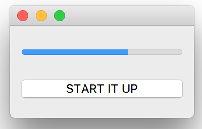
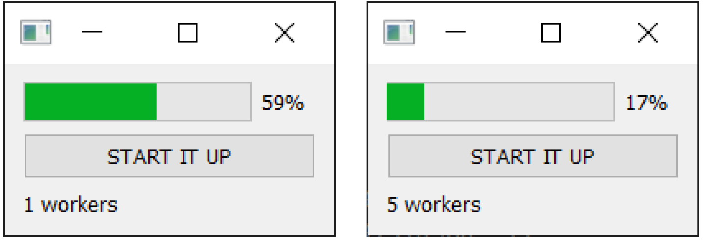
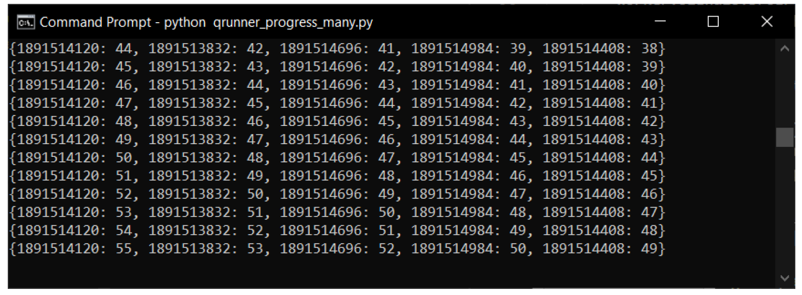
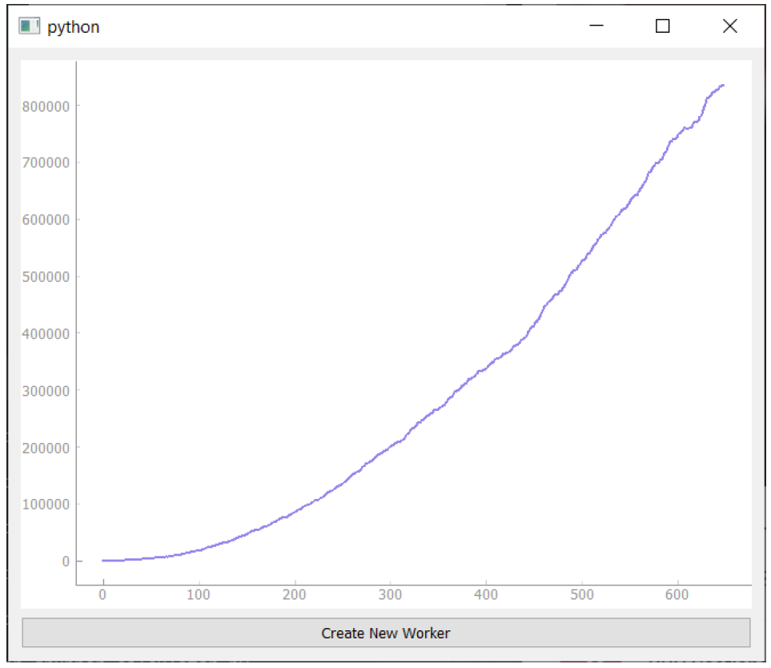
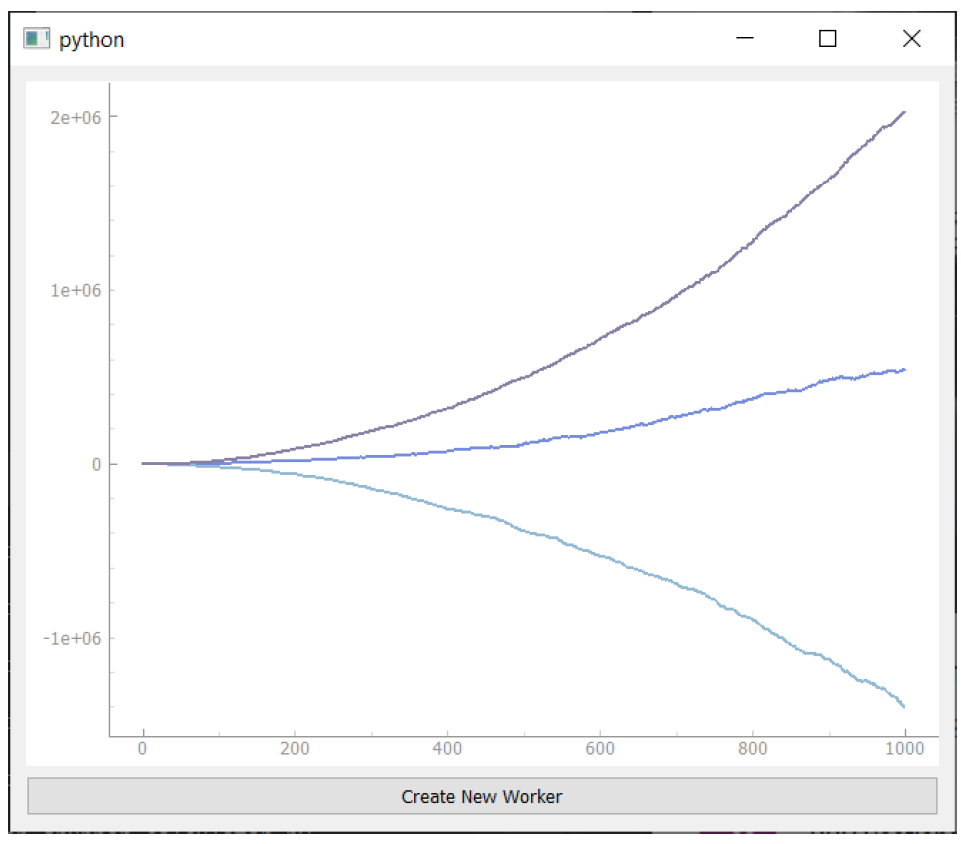
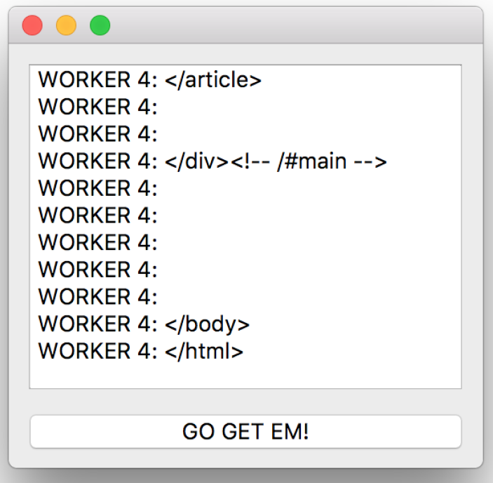
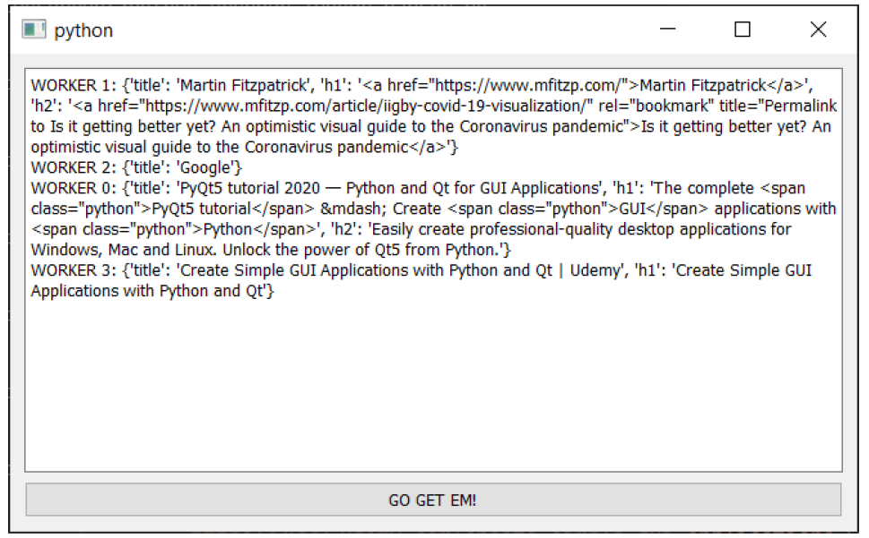
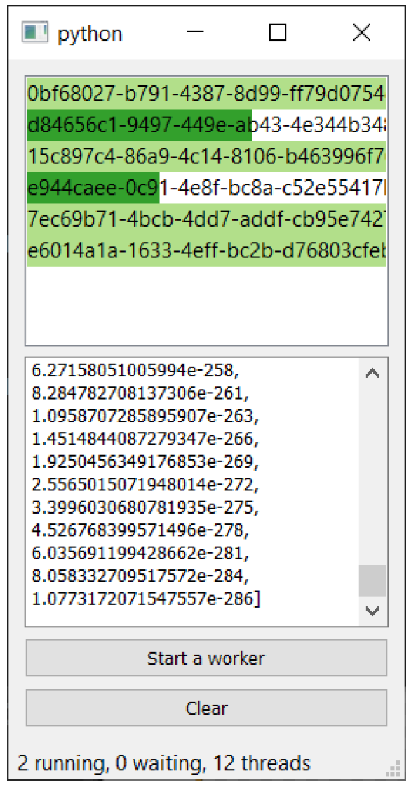
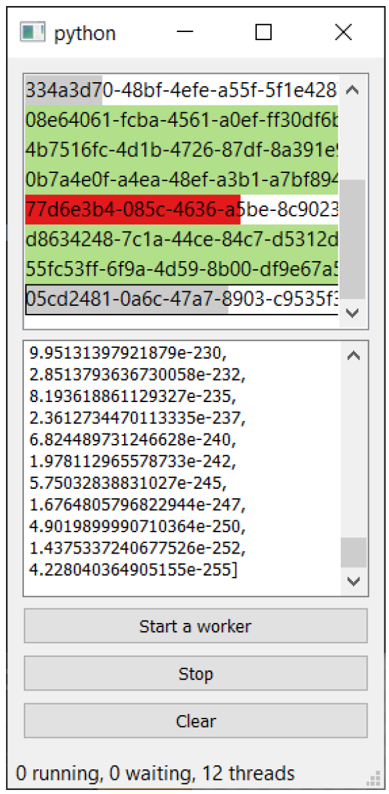

---
prev:
  text: '25. 使用线程池'
  link: '/ConcurrentExecution/25'
next:
  text: '27. 长期运行的线程'
  link: '/ConcurrentExecution/27'
---

## 26. QRunnable 示例

`QThreadPool` 和 `QRunnable` 是以其他线程运行程序的一种非常灵活的方式。通过调整信号和参数，您可以执行任何可以想象到的任务。在本章中，我们将介绍一些示例，说明如何为特定场景构建运行器。

所有示例都遵循相同的总体模式——一个自定义的 `QRunnable` 类，带有自定义的 `WorkerSignals`。区别在于我们传递给运行器的参数、运行器对这些参数的处理方式，以及我们如何连接信号。

*Listing 181. concurrent/qrunnable_base.py*

```python
import sys
import time
import traceback

from PyQt6.QtCore import (
    QObject,
    QRunnable,
    QThreadPool,
    pyqtSignal,
    pyqtSlot,
)
from PyQt6.QtWidgets import QApplication, QMainWindow


class WorkerSignals(QObject):
    pass


class Worker(QRunnable):
    def __init__(self, *args, **kwargs):
        super().__init__()
        # 存储构造函数参数（用于后续处理）
        self.args = args
        self.kwargs = kwargs
        self.signals = WorkerSignals()
       
    @pyqtSlot()
    def run(self):
        pass
    
    
class MainWindow(QMainWindow):
    def __init__(self):
        super().__init__()
        self.show()
        
        
app = QApplication(sys.argv)
window = MainWindow()
app.exec()
```

## 进度观察器

如果您正在使用线程来执行耗时较长的操作，您应该让用户了解任务的进展情况。一种常见的做法是通过显示一个进度条来实现，该进度条会以从左到右填充的方式，显示任务完成的进度。为了在任务中显示进度条，您需要从 `worker` 中发出当前的进度状态。

为此，我们可以在 `WorkerSignals` 对象上定义另一个名为 `progress` 的信号。该信号在每个循环中发出 0..100 之间的数字，以表示“任务”的进展。该进度信号的输出连接到主窗口状态栏上显示的标准 `QProgressBar`。

*Listing 182. concurrent/qrunnable_progress.py*

```python
import sys
import time

from PyQt6.QtCore import (
    QObject,
    QRunnable,
    QThreadPool,
    QTimer,
    pyqtSignal,
    pyqtSlot,
)
from PyQt6.QtWidgets import (
    QApplication,
    QLabel,
    QMainWindow,
    QProgressBar,
    QPushButton,
    QVBoxLayout,
    QWidget,
)


class WorkerSignals(QObject):
    """
    定义运行中的工作线程可用的信号
    progress
        int 进度完成度，范围为0到100
    """
    progress = pyqtSignal(int)
    
    
class Worker(QRunnable):
    """
    工作线程
    从 QRunnable 继承，用于处理工作线程的设置、信号和收尾工作。
    """
    def __init__(self):
        super().__init__()
        
        self.signals = WorkerSignals()
        
    @pyqtSlot()
    def run(self):
        total_n = 1000
        for n in range(total_n):
            progress_pc = int(
                100 * float(n + 1) / total_n
            ) # 进度 0-100% ,作为整数
            self.signals.progress.emit(progress_pc)
            time.sleep(0.01)
            
            
class MainWindow(QMainWindow):
    def __init__(self, *args, **kwargs):
        super().__init__(*args, **kwargs)
        
        layout = QVBoxLayout()
        
        self.progress = QProgressBar()
        
        button = QPushButton("START IT UP")
        button.pressed.connect(self.execute)
        layout.addWidget(self.progress)
        layout.addWidget(button)
        
        w = QWidget()
        w.setLayout(layout)
        
        self.setCentralWidget(w)
        
        self.show()
        
        self.threadpool = QThreadPool()
        print(
            "Multithreading with maximum %d threads"
            % self.threadpool.maxThreadCount()
        )
        
    def execute(self):
        worker = Worker()
        worker.signals.progress.connect(self.update_progress)
        # 执行
        self.threadpool.start(worker)
        
    def update_progress(self, progress):
        self.progress.setValue(progress)
        
        
app = QApplication(sys.argv)
window = MainWindow()
app.exec()
```



> 图201：进度条显示长期运行的任务的当前进度

如果您在另一个进程已经运行的情况下按下按钮，您会发现一个问题——两个进程会将它们的进度发送到同一个进度条，因此数值会来回跳动。

使用单个进度条跟踪多个工作者是可行的——我们只需要做两件事：一个用于存储每个工作者进度值的存储位置，以及一个每个工作者的唯一标识符。在每次进度更新时，我们可以计算所有工作者的平均进度，并显示该值。

*Listing 183. concurrent/qrunnable_progress_many.py*

```python
import random
import sys
import time
import uuid

from PyQt6.QtCore import (
    QObject,
    QRunnable,
    QThreadPool,
    QTimer,
    pyqtSignal,
    pyqtSlot,
)
from PyQt6.QtWidgets import (
    QApplication,
    QLabel,
    QMainWindow,
    QProgressBar,
    QPushButton,
    QVBoxLayout,
    QWidget,
)


class WorkerSignals(QObject):
    """
    定义运行中的工作线程可用的信号
    progress
        int 进度完成度，范围为0到100
    """
    progress = pyqtSignal(str, int)
    finished = pyqtSignal(str)
    
    
class Worker(QRunnable):
    """
    工作线程
    从 QRunnable 继承，用于处理工作线程的设置、信号和收尾工作。
    """
    def __init__(self):
        super().__init__()
        self.job_id = uuid.uuid4().hex #1
        self.signals = WorkerSignals()
        
    @pyqtSlot()
    def run(self):
        total_n = 1000
        delay = random.random() / 100 # 随机延迟值.
        for n in range(total_n):
            progress_pc = int(100 * float(n + 1) / total_n) #2
            self.signals.progress.emit(self.job_id, progress_pc)
            time.sleep(delay)
        
        self.signals.finished.emit(self.job_id)
        
        
class MainWindow(QMainWindow):
    def __init__(self):
        super().__init__()
        
        layout = QVBoxLayout()
        
        self.progress = QProgressBar()
        
        button = QPushButton("START IT UP")
        button.pressed.connect(self.execute)
        
        self.status = QLabel("0 workers")
        
        layout.addWidget(self.progress)
        layout.addWidget(button)
        layout.addWidget(self.status)
        
        w = QWidget()
        w.setLayout(layout)
        
        # 字典记录了当前工作器的工作进度。.
        self.worker_progress = {}
        
        self.setCentralWidget(w)
        
        self.show()
        
        self.threadpool = QThreadPool()
        print(
            "Multithreading with maximum %d threads"
            % self.threadpool.maxThreadCount()
        )
        
        self.timer = QTimer()
        self.timer.setInterval(100)
        self.timer.timeout.connect(self.refresh_progress)
        self.timer.start()
        
    def execute(self):
        worker = Worker()
        worker.signals.progress.connect(self.update_progress)
        worker.signals.finished.connect(self.cleanup) #3
        
        # 执行
        self.threadpool.start(worker)
        
    def cleanup(self, job_id):
        if job_id in self.worker_progress:
            del self.worker_progress[job_id] #4
            
            # 如果我们移除了某个值，请更新进度条
            self.refresh_progress()
            
    def update_progress(self, job_id, progress):
        self.worker_progress[job_id] = progress
        
    def calculate_progress(self):
        if not self.worker_progress:
            return 0
        
        return sum(v for v in self.worker_progress.values()) / len(
            self.worker_progress
        )
        
    def refresh_progress(self):
        # 计算总进度.
        progress = self.calculate_progress()
        print(self.worker_progress)
        self.progress.setValue(progress)
        self.status.setText("%d workers" % len(self.worker_progress))
        
        
app = QApplication(sys.argv)
window = MainWindow()
app.exec()
```

> 1. 为该任务执行器使用一个唯一的UUID4标识符。
> 2. 进度以0-100%的整数形式表示。
> 3. 当任务完成后，需要清理（删除）任务执行器的进度数据。
> 4. 删除已完成任务执行器的进度数据。

运行此代码后，您将看到全局进度条以及一个指示器，用于显示当前正在运行的活跃工作者数量。



> 图202：显示全局进度状态的窗口，以及活跃工作者的数量。

通过查看脚本的控制台输出，您可以查看每个独立工作节点的实际状态。



> 图203：查看 shell 输出以查看每个工作进程的进度。

立即移除工作者意味着进度会倒退。当任务完成时，从平均值计算中移除100会导致平均值下降。您可以推迟清理操作，例如以下代码仅在所有进度条达到100%时移除条目：

*Listing 184. concurrent/qrunnable_progress_many_2.py*

```python
import random
import sys
import time
import uuid

from PyQt6.QtCore import (
    QObject,
    QRunnable,
    QThreadPool,
    QTimer,
    pyqtSignal,
    pyqtSlot,
)
from PyQt6.QtWidgets import (
    QApplication,
    QLabel,
    QMainWindow,
    QProgressBar,
    QPushButton,
    QVBoxLayout,
    QWidget,
)


class WorkerSignals(QObject):
    """
    定义运行中的工作线程可用的信号
    progress
        int 进度完成度，范围为0到100
    """
    progress = pyqtSignal(str, int)
    finished = pyqtSignal(str)
    
    
class Worker(QRunnable):
    """
    工作线程
    从 QRunnable 继承，用于处理工作线程的设置、信号和收尾工作。
    """
    def __init__(self):
        super().__init__()
        self.job_id = uuid.uuid4().hex #1
        self.signals = WorkerSignals()
        
    @pyqtSlot()
    def run(self):
        total_n = 1000
        delay = random.random() / 100 # 随机延迟值.
        for n in range(total_n):
            progress_pc = int(100 * float(n + 1) / total_n) #2
            self.signals.progress.emit(self.job_id, progress_pc)
            time.sleep(delay)
        
        self.signals.finished.emit(self.job_id)
        
        
class MainWindow(QMainWindow):
    def __init__(self):
        super().__init__()
        
        layout = QVBoxLayout()
        
        self.progress = QProgressBar()
        
        button = QPushButton("START IT UP")
        button.pressed.connect(self.execute)
        
        self.status = QLabel("0 workers")
        
        layout.addWidget(self.progress)
        layout.addWidget(button)
        layout.addWidget(self.status)
        
        w = QWidget()
        w.setLayout(layout)
        
        # 字典记录了当前工作器的工作进度。.
        self.worker_progress = {}
        
        self.setCentralWidget(w)
        
        self.show()
        
        self.threadpool = QThreadPool()
        print(
            "Multithreading with maximum %d threads"
            % self.threadpool.maxThreadCount()
        )
        
        self.timer = QTimer()
        self.timer.setInterval(100)
        self.timer.timeout.connect(self.refresh_progress)
        self.timer.start()
        
    def execute(self):
        worker = Worker()
        worker.signals.progress.connect(self.update_progress)
        worker.signals.finished.connect(self.cleanup) #3
        
        # 执行
        self.threadpool.start(worker)
        
    def cleanup(self, job_id):
        if all(v == 100 for v in self.worker_progress.values()):
            self.worker_progress.clear() # 清空字典
            
            # 如果我们移除了某个值，请更新进度条
            self.refresh_progress()
            
    def update_progress(self, job_id, progress):
        self.worker_progress[job_id] = progress
        
    def calculate_progress(self):
        if not self.worker_progress:
            return 0
        
        return sum(v for v in self.worker_progress.values()) / len(
            self.worker_progress
        )
        
    def refresh_progress(self):
        # 计算总进度.
        progress = self.calculate_progress()
        print(self.worker_progress)
        self.progress.setValue(progress)
        self.status.setText("%d workers" % len(self.worker_progress))
        
        
app = QApplication(sys.argv)
window = MainWindow()
app.exec()
```

虽然这可以正常工作，对于简单的用例来说也没问题，但如果这个工作状态（和控制）能够被封装到它自己的管理器组件中，而不是通过主窗口来控制，那就更好了。请参阅后面的“管理器”部分，了解如何做到这一点。

## 计算器

当您需要执行复杂的计算时，多线程是一个不错的选择。如果您使用的是 Python numpy、scipy 或 pandas 库，那么这些计算也可能释放 Python 全局解释器锁 (GIL)，这意味着您的图形用户界面和计算线程都可以全速运行。

在本例中，我们将创建一些执行一些简单计算的作业。这些计算的结果将返回图形用户界面线程，并在图表中显示。


> 我们在后文的 使用PyQtGraph进行绘图 中对 PyQtGraph 进行详细介绍，目前仅需关注`QRunnable`。

*Listing 185. concurrent/qrunnable_calculator.py*

```python
import random
import sys
import time
import uuid

from PyQt6.QtCore import (
    QObject,
    QRunnable,
    QThreadPool,
    QTimer,
    pyqtSignal,
    pyqtSlot,
)
from PyQt6.QtWidgets import (
    QApplication,
    QMainWindow,
    QPushButton,
    QVBoxLayout,
    QWidget,
)
import pyqtgraph as pg


class WorkerSignals(QObject):
    """
    定义运行中的工作线程可用的信号
    
    data
        元组数据点 (worker_id, x, y)
    """
    data = pyqtSignal(tuple) #1
    
    
class Worker(QRunnable):
    """
    工作线程
    从 QRunnable 继承，用于处理工作线程的设置、信号和收尾工作。
    """
    def __init__(self):
        super().__init__()
        self.worker_id = uuid.uuid4().hex # 此项工作的唯一标识符
        self.signals = WorkerSignals()
        
    @pyqtSlot()
    def run(self):
        
        total_n = 1000
        y2 = random.randint(0, 10)
        delay = random.random() / 100 # 随机延迟值.
        value = 0
        
        for n in range(total_n):
            # 假设计算，每个工作将生产不同的结果值。
            # 由于y和y2的随机值.
            y = random.randint(0, 10)
            value += n * y2 - n * y
            
            self.signals.data.emit((self.worker_id, n, value)) #2
            time.sleep(delay)
            
            
class MainWindow(QMainWindow):
    def __init__(self):
        super().__init__()
        
        self.threadpool = QThreadPool()
        
        self.x = {} # 保持时间点.
        self.y = {} # 保留数据.
        self.lines = {} # 保留绘制线的引用，以便更新.
        
        layout = QVBoxLayout()
        self.graphWidget = pg.PlotWidget()
        self.graphWidget.setBackground("w")
        layout.addWidget(self.graphWidget)
        
        button = QPushButton("Create New Worker")
        button.pressed.connect(self.execute)
        
        # layout.addWidget(self.progress)
        layout.addWidget(button)
        
        w = QWidget()
        w.setLayout(layout)
        
        self.setCentralWidget(w)
        
        self.show()
        
    def execute(self):
        worker = Worker()
        worker.signals.data.connect(self.receive_data)
        
        # 执行
        self.threadpool.start(worker)
        
    def receive_data(self, data):
        worker_id, x, y = data #3
        
        if worker_id not in self.lines:
            self.x[worker_id] = [x]
            self.y[worker_id] = [y]
            # 生成一个随机颜色.
            pen = pg.mkPen(
                width=2,
                color=(
                    random.randint(100, 255),
                    random.randint(100, 255),
                    random.randint(100, 255),
                ),
            )
            self.lines[worker_id] = self.graphWidget.plot(
                self.x[worker_id], self.y[worker_id], pen=pen
            )
            return
        
        # 更新现有图例/数据
        self.x[worker_id].append(x)
        self.y[worker_id].append(y)
        
        self.lines[worker_id].setData(
            self.x[worker_id], self.y[worker_id]
        )
        
        
app = QApplication(sys.argv)
window = MainWindow()
app.exec()
```

> 1. 设置自定义信号以传递数据。使用元组可以发送任何数量的值，这些值被包装在元组中。
> 2. 这里，我们发出 worker_id、x 和 y 值。
> 3. 接收器槽解包数据。

一旦您从工作处获取了数据，您可以随心所欲地处理它——例如将其添加到表格或模型视图中。在这里，我们正在将 x 和 y 值存储在以 `worker_id` 为键的字典对象中。这样可以将每个工作的数据保持独立，并允许我们单独绘制它们。

如果您运行这个示例并按下按钮，您会在图表上看到一条线出现并逐渐延长。如果您再次按下按钮，另一个工作将开始运行，返回更多数据并在图表上添加另一条线。每个工作以不同的速率生成数据，每个工作生成100个值。



> 图204：在经过几次迭代后，从单个运行器中输出结果图。

您可以启动新任务，数量最多可达机器上可用的最大线程数。生成100个值后，任务将关闭，接下来排队的任务将启动并将其值作为新行添加。



> 图205：来自多个运行器的数据

当然，元组是可选的，如果您只有一个运行器，或者不需要将输出与源关联，您可以返回裸字符串。通过适当设置信号，您还可以发送字节字符串或任何其他类型的数据。

## 停止正在运行的QRunnable

一旦启动了 QRunnable，默认情况下无法停止它。从可用性角度来看，这并不理想——如果用户误启动了任务，他们就只能坐等任务完成。遗憾的是，无法直接终止运行器，但我们可以变相地请求其停止。在本示例中，我们将探讨如何通过设置标志位来指示运行器需要停止。


> 在计算中，标志是用于信号当前状态或状态变化的变量。想想船只如何使用旗帜进行通信。
>
> 
>
> 图206：旗语，“你应该立即停止你的船只。”

下面的代码实现了一个简单的运行器，带有进度条，该进度条每 0.01 秒从左向右增加，以及一个 [停止] 按钮。如果您点击 [停止]，该进程将退出，永久停止进度条。

*Listing 186. concurrent/qrunnable_stop.py*

```python
import sys
import time

from PyQt6.QtCore import (
    QObject,
    QRunnable,
    Qt,
    QThreadPool,
    pyqtSignal,
    pyqtSlot,
)
from PyQt6.QtWidgets import (
    QApplication,
    QHBoxLayout,
    QMainWindow,
    QProgressBar,
    QPushButton,
    QWidget,
)

class WorkerKilledException(Exception):
    pass


class WorkerSignals(QObject):
    progress = pyqtSignal(int)
    
    
class JobRunner(QRunnable):
    signals = WorkerSignals()
    def __init__(self):
        super().__init__()
        self.is_killed = False #1

    @pyqtSlot()
    def run(self):
        try:
            for n in range(100):
                self.signals.progress.emit(n + 1)
                time.sleep(0.1)
                
                if self.is_killed: #2
                    raise WorkerKilledException
                    
        except WorkerKilledException:
                pass #3
            
    def kill(self): #4
        self.is_killed = True
        
        
class MainWindow(QMainWindow):
    def __init__(self):
        super().__init__()
        
        # 一些按钮
        w = QWidget()
        l = QHBoxLayout()
        w.setLayout(l)
        
        btn_stop = QPushButton("Stop")
        
        l.addWidget(btn_stop)
        
        self.setCentralWidget(w)
        
        # 创建状态栏.
        self.status = self.statusBar()
        self.progress = QProgressBar()
        self.status.addPermanentWidget(self.progress)
        
        # 线程运行器
        self.threadpool = QThreadPool()
        
        # 创建一个运行器
        self.runner = JobRunner()
        self.runner.signals.progress.connect(self.update_progress)
        self.threadpool.start(self.runner)
        
        btn_stop.pressed.connect(self.runner.kill)
        
        self.show()
        
    def update_progress(self, n):
        self.progress.setValue(n)
        
        
app = QApplication(sys.argv)
w = MainWindow()
app.exec()
```

> 1. 用于指示是否应终止运行器的标志称为 `.is_killed`。
> 2. 在每个循环中，我们测试 `.is_killed` 是否为 `True`，如果是，则抛出异常。
> 3. 捕获异常，我们可以在这里发出完成或错误信号。
> 4. `.kill()` 是便利函数，这样我们就可以调用 `worker.kill()` 来终止它。

如果您想在不引发异常的情况下停止 `worker`，只需从 `run` 方法中直接返回，例如：

```python
    def run(self):
        for n in range(100):
            self.signals.progress.emit(n + 1)
            time.sleep(0)
            
        if self.is_killed:
            return
```

在上述示例中，我们只有一个工作。然而，在许多应用程序中，您会有更多的工作。当您有多个运行器在运行时，如何停止工作？

如果您希望停止所有工作进程，那么无需进行任何更改。您只需将所有工作进程连接到相同的“停止”信号，当该信号被触发时（例如按下一个按钮），所有工作进程都会同时停止。

如果您想能够停止单个工作，您需要在用户界面的某个位置为每个工作创建一个单独的按钮，或者实现一个管理器来跟踪工作并提供一个更友好的界面来终止它们。请查看后文的 管理器 以获取一个可工作的示例。

## 暂停一个运行器

暂停一个运行器是一种较少见的需求——通常您希望事情能尽可能快地进行。但有时您可能希望让一个工作进入“睡眠”状态，使其暂时停止从数据源读取数据。您可以通过对停止运行器的方法进行一些小修改来实现这一点。实现这一功能的代码如下所示。


> 暂停的运行程序仍然占用线程池中的一个槽，限制了可运行的并发任务的数量。请谨慎使用！

*Listing 187. concurrent/qrunnable_pause.py*

```python
import sys
import time

from PyQt6.QtCore import (
    QObject,
    QRunnable,
    Qt,
    QThreadPool,
    pyqtSignal,
    pyqtSlot,
)

from PyQt6.QtWidgets import (
    QApplication,
    QHBoxLayout,
    QMainWindow,
    QProgressBar,
    QPushButton,
    QWidget,
)


class WorkerKilledException(Exception):
    pass


class WorkerSignals(QObject):
    progress = pyqtSignal(int)
    
    
class JobRunner(QRunnable):
    
    signals = WorkerSignals()
    
    def __init__(self):
        super().__init__()
        self.is_paused = False
        self.is_killed = False
        
    @pyqtSlot()
    def run(self):
        for n in range(100):
            self.signals.progress.emit(n + 1)
            time.sleep(0.1)
            
            while self.is_paused:
                time.sleep(0) #1
                
            if self.is_killed:
                raise WorkerKilledException
                
    def pause(self):
        self.is_paused = True
        
    def resume(self):
        self.is_paused = False
        
    def kill(self):
        self.is_killed = True
        
        
class MainWindow(QMainWindow):
    def __init__(self):
        super().__init__()
        
        # 一些按钮
        w = QWidget()
        l = QHBoxLayout()
        w.setLayout(l)
        
        btn_stop = QPushButton("Stop")
        btn_pause = QPushButton("Pause")
        btn_resume = QPushButton("Resume")
        
        l.addWidget(btn_stop)
        l.addWidget(btn_pause)
        l.addWidget(btn_resume)
        self.setCentralWidget(w)
        
        # 创建状态栏.
        self.status = self.statusBar()
        self.progress = QProgressBar()
        self.status.addPermanentWidget(self.progress)
        
        # 线程运行器
        self.threadpool = QThreadPool()
        
        # 创建一个运行器
        self.runner = JobRunner()
        self.runner.signals.progress.connect(self.update_progress)
        self.threadpool.start(self.runner)
        
        btn_stop.pressed.connect(self.runner.kill)
        btn_pause.pressed.connect(self.runner.pause)
        btn_resume.pressed.connect(self.runner.resume)
        
        self.show()
        
    def update_progress(self, n):
        self.progress.setValue(n)
        
        
app = QApplication(sys.argv)
w = MainWindow()
app.exec()
```

> 1. 如果您不想频繁检查是否到了醒来的时间，可以在 `sleep` 调用中设置一个大于 `0` 的值。

如果您运行这个示例，您会看到一个进度条从左向右移动。如果您点击[暂停]，工作将暂停。如果您接下来点击[继续]，工作将从它开始的地方继续。如果您点击[停止]，工作将永久停止，就像以前一样。

在收到 `is_paused` 信号时，我们不会抛出异常，而是进入一个暂停循环。这会停止工作进程的执行，但不会退出 `run` 方法或终止工作进程。

通过使用 `while self.is_paused:` 循环，当 `worker` 恢复运行时，我们将立即退出循环，并继续之前的工作。


> 您必须包含 `time.sleep()` 调用。这个零秒暂停允许 Python 释放 GIL，因此该循环不会阻塞其他执行。如果没有这个 `sleep`，您将有一个忙循环，它会在不做任何事情的情况下浪费资源。如果您想更少地检查，请增加 `sleep` 值。

## 通信器

在运行线程时，您经常希望能够实时获取线程正在执行的内容的输出，即在执行过程中获取输出。  

在此示例中，我们将创建一个在单独线程中向远程服务器发起请求的运行器，并将其输出转发至日志记录器。我们还将探讨如何将自定义解析器传递给运行器，以从请求中提取我们感兴趣的额外数据。


> 如果您希望从外部进程而非线程中记录数据，请参阅 “运行外部进程” 和 “运行外部命令和进程” 。

### 数据导出

在这个第一个示例中，我们将使用自定义信号将每个请求的原始数据（HTML）转储到输出中。

*Listing 188. concurrent/qrunnable_io.py*

```python
import sys
import requests

from PyQt6.QtCore import (
    QObject,
    QRunnable,
    QThreadPool,
    QTimer,
    pyqtSignal,
    pyqtSlot,
)
from PyQt6.QtWidgets import (
    QApplication,
    QLabel,
    QMainWindow,
    QPlainTextEdit,
    QPushButton,
    QVBoxLayout,
    QWidget,
)


class WorkerSignals(QObject):
    """
    定义运行中的工作线程可用的信号。
    data
        元组 (identifier, data)
    """
    data = pyqtSignal(tuple)
    
    
class Worker(QRunnable):
    """
    工作线程
    从 QRunnable 继承，用于处理工作线程的设置、信号和收尾工作。
    
    :param id: 该工作节点的ID
    :param url: 用于获取数据的URL
    """
    
    def __init__(self, id, url):
        super().__init__()
        self.id = id
        self.url = url
        
        self.signals = WorkerSignals()
        
    @pyqtSlot()
    def run(self):
        r = requests.get(self.url)
        
        for line in r.text.splitlines():
            self.signals.data.emit((self.id, line))
            
            
class MainWindow(QMainWindow):
    def __init__(self):
        super().__init__()
        self.urls = [
            "https://www.pythonguis.com/",
            "https://www.mfitzp.com/",
            "https://www.google.com",
            "https://academy.pythonguis.com/",
        ]
        
        layout = QVBoxLayout()
        
        self.text = QPlainTextEdit()
        self.text.setReadOnly(True)
        
        button = QPushButton("GO GET EM!")
        button.pressed.connect(self.execute)
        
        layout.addWidget(self.text)
        layout.addWidget(button)
        
        w = QWidget()
        w.setLayout(layout)
        
        self.setCentralWidget(w)
        
        self.show()
        
        self.threadpool = QThreadPool()
        print(
            "Multithreading with maximum %d threads"
            % self.threadpool.maxThreadCount()
        )
        
    def execute(self):
        for n, url in enumerate(self.urls):
            worker = Worker(n, url)
            worker.signals.data.connect(self.display_output)
            
            # 执行
            self.threadpool.start(worker)
            
     def display_output(self, data):
        id, s = data
        self.text.appendPlainText("WORKER %d: %s" % (id, s))
        
        
app = QApplication(sys.argv)
window = MainWindow()
app.exec()
```

> 译者注：`self.urls`中的网站在国内访问基本都很不稳定，甚至您访问不了Google。您可以试试百度等国内公共网站，或者使用科学上网

如果您运行这个示例并点击按钮，您会看到来自多个网站的HTML输出，这些输出前面会加上获取它们的worker ID。请注意，来自不同工作的输出是交错显示的。



> 图207：将多个工作线程的输出日志显示在主窗口中

当然，元组是可选的，如果您只有一个运行器，或者不需要将输出与源关联，您可以返回裸字符串。通过适当设置信号，也可以发送字节字符串或任何其他类型的数据。

### 数据解析

通常，您对线程中的原始数据（无论是来自服务器还是其他外部设备）并不感兴趣，而是希望先对数据进行某种处理。在此示例中，我们创建自定义解析器，这些解析器可以从请求的页面中提取特定数据。我们可以创建多个工作者，每个工作者接收不同的网站列表和解析器。

*Listing 189. concurrent/qrunnable_io_parser.py*

```python
    self.parsers = { #1
                    # 正则表达式解析器，用于从HTML中提取数据。
                    "title": re.compile(
                        r"<title.*?>(.*?)<\/title>", re.M | re.S
                    ),
                    "h1": re.compile(r"<h1.*?>(.*?)<\/h1>", re.M | re.S),
                    "h2": re.compile(r"<h2.*?>(.*?)<\/h2>", re.M | re.S),
                   }
```

> 1. 解析器被定义为一系列编译后的正则表达式。但您可以按任何方式定义解析器

*Listing 190. concurrent/qrunnable_io_parser.py*

```python
    def execute(self):
        for n, url in enumerate(self.urls):
            worker = Worker(n, url, self.parsers) #1
            worker.signals.data.connect(self.display_output)
            # 执行
            self.threadpool.start(worker)
```

> 1. 将解析器列表传递给每个工作进程。

*Listing 191. concurrent/qrunnable_io_parser.py*

```python
class Worker(QRunnable):
    """
    工作线程
    从 QRunnable 继承，用于处理工作线程的设置、信号和收尾工作。
    :param id：该工作线程的 ID
    :param url：要检索的 URL
    """
    def __init__(self, id, url, parsers):
        super().__init__()
        self.id = id
        self.url = url
        self.parsers = parsers
        
        self.signals = WorkerSignals()
        
    @pyqtSlot()
    def run(self):
        r = requests.get(self.url)
        
        data = {}
        for name, parser in self.parsers.items(): #1
        m = parser.search(r.text)
        if m: #2
            data[name] = m.group(1).strip()
            
    self.signals.data.emit((self.id, data))
```

> 1. 遍历传递给工作线程的解析器列表。对该页面的数据运行每个解析器。
> 2. 如果正则表达式匹配，将数据添加到我们的数据字典中

运行此代码后，您将看到每个工作进程的输出，其中包含提取的H1、H2和TITLE标签。



> 图208：显示多个工作进程解析后的输出结果


> 如果您正在开发从网站提取数据的工具，建议您使用 [BeautifulSoup 4](https://www.crummy.com/software/BeautifulSoup/bs4/doc/)，它比使用正则表达式要强大得多。

## 通用化

您并不总是能提前知道需要让工作进程执行哪些任务。或者，您可能需要执行多个类似的函数，并希望有一个统一的 API 来运行它们。在这种情况下，您可以利用 Python 中函数是对象这一特性，构建一个通用运行器，该运行器不仅接受参数，还接受要执行的函数。

在下面的示例中，我们创建了一个单一的 Worker 类，然后使用它来运行多个不同的函数。通过这种设置，您可以传入任何 Python 函数，并在单独的线程中执行它。

以下给出了完整的工作示例，展示了自定义的 `QRunnable` 工作以及工作和进度信号。您应该能够将此代码应用于您开发的任何应用程序。

*Listing 192. concurrent/qrunnable_generic.py*

```python
import sys
import time
import traceback

from PyQt6.QtCore import (
    QObject,
    QRunnable,
    QThreadPool,
    QTimer,
    pyqtSignal,
    pyqtSlot,
)
from PyQt6.QtWidgets import (
    QApplication,
    QLabel,
    QMainWindow,
    QPushButton,
    QVBoxLayout,
    QWidget,
)

def execute_this_fn():
    for _ in range(0, 5):
        time.sleep(1)
    
    return "Done."


class WorkerSignals(QObject):
    """
    定义运行中的工作线程可用的信号
    支持的信号为：
    finished
        无数据
    error
        `元组` (异常类型, 值, traceback.format_exc() )
    result
        `对象` 处理后返回的数据，任何类型
    
    """
    finished = pyqtSignal()
    error = pyqtSignal(tuple)
    result = pyqtSignal(object)
    
    
class Worker(QRunnable):
    """
    工作线程
    从 QRunnable 继承，用于处理工作线程的设置、信号和收尾工作。
    :param callback: 在此工作线程上运行的回调函数。  
    :thread. 提供的 args 和 kwargs 将传递给运行器。  
    :type callback: 函数  
    :param args: 传递给回调函数的参数  
    :param kwargs: 传递给回调函数的关键字参数
    :
    """
    def __init__(self, fn, *args, **kwargs):
        super().__init__()
        
        # 拆分构造函数参数（用于后续处理）
        self.fn = fn
        self.args = args
        self.kwargs = kwargs
        self.signals = WorkerSignals()
        
    @pyqtSlot()
    def run(self):
        """
        使用传入的参数和关键字参数（args/kwargs）初始化运行器函数。
        """
        
        # 在此处获取参数（args/kwargs）；并使用它们触发处理流程。
        try:
            result = self.fn(*self.args, **self.kwargs)
        except:
            traceback.print_exc()
            exctype, value = sys.exc_info()[:2]
            self.signals.error.emit(
                (exctype, value, traceback.format_exc())
            )
        else:
            self.signals.result.emit(
                result
            ) # 返回处理结果
        finally:
            self.signals.finished.emit() # 完成
            
            
class MainWindow(QMainWindow):
    def __init__(self):
        super().__init__()
        
        self.counter = 0
        
        layout = QVBoxLayout()
        
        self.l = QLabel("Start")
        b = QPushButton("DANGER!")
        b.pressed.connect(self.oh_no)
        
        layout.addWidget(self.l)
        layout.addWidget(b)
        
        w = QWidget()
        w.setLayout(layout)
        
        self.setCentralWidget(w)
        
        self.show()
        
        self.threadpool = QThreadPool()
        print(
            "Multithreading with maximum %d threads"
            % self.threadpool.maxThreadCount()
        )
        
        self.timer = QTimer()
        self.timer.setInterval(1000)
        self.timer.timeout.connect(self.recurring_timer)
        self.timer.start()
        
    def print_output(self, s):
        print(s)
        
    def thread_complete(self):
        print("THREAD COMPLETE!")
        
    def oh_no(self):
        # 传递要执行的函数
        worker = Worker(
            execute_this_fn
        ) # 任何其他参数（args）和关键字参数（kwargs）都会传递给run函数。
        worker.signals.result.connect(self.print_output)
        worker.signals.finished.connect(self.thread_complete)
        
        # 执行
        self.threadpool.start(worker)
        
    def recurring_timer(self):
        self.counter += 1
        self.l.setText("Counter: %d" % self.counter)
        
        
app = QApplication(sys.argv)
window = MainWindow()
app.exec()
```

通用函数方法增加了一个可能并不明显的限制——运行函数无法访问运行器的 `self` 对象，因此无法访问信号来发出数据本身。我们只能在函数结束时发出函数的返回值。虽然您可以返回一个复合类型（如元组）来返回多个值，但您无法获得进度信号或正在处理的数据。

但是，有一个解决方法。由于您可以将任何内容传递到自定义函数，因此您也可以传递 `self` 或 `self.signals` 对象，以便使用它们。

*Listing 193. concurrent/qrunnable_generic_callback.py*

```python
import sys
import time
import traceback

from PyQt6.QtCore import (
    QObject,
    QRunnable,
    QThreadPool,
    QTimer,
    pyqtSignal,
    pyqtSlot,
)
from PyQt6.QtWidgets import (
    QApplication,
    QLabel,
    QMainWindow,
    QPushButton,
    QVBoxLayout,
    QWidget,
)


def execute_this_fn(signals):
    for n in range(0, 5):
        time.sleep(1)
        signals.progress.emit(n * 100 / 4)
        
    return "Done." 


class WorkerSignals(QObject):
    """
    定义运行中的工作线程可用的信号
    支持的信号为：
    finished
        无数据
    error
        `元组` (异常类型, 值, traceback.format_exc() )
    result
        `对象` 处理后返回的数据，任何类型
    progress
        `整形` indicating % progress
    
    """
    finished = pyqtSignal()
    error = pyqtSignal(tuple)
    result = pyqtSignal(object)
    progress = pyqtSignal(int)
    
    
class Worker(QRunnable):
    """
    工作线程
    从 QRunnable 继承，用于处理工作线程的设置、信号和收尾工作。
    :param callback: 在此工作线程上运行的回调函数。  
    :thread. 提供的 args 和 kwargs 将传递给运行器。  
    :type callback: 函数  
    :param args: 传递给回调函数的参数  
    :param kwargs: 传递给回调函数的关键字参数
    :
    """
    def __init__(self, fn, *args, **kwargs):
        super().__init__()
        # 拆分构造函数参数（用于后续处理）
        self.fn = fn
        self.args = args
        self.kwargs = kwargs
        self.signals = WorkerSignals()
        
        # 将回调函数添加到我们的关键字参数中
        kwargs["signals"] = self.signals
        
    @pyqtSlot()
     def run(self):
        """
        使用传入的参数和关键字参数（args/kwargs）初始化运行器函数。
        """
        
        # 在此处获取参数（args/kwargs）；并使用它们触发处理流程。
        try:
            result = self.fn(*self.args, **self.kwargs)
        except:
            traceback.print_exc()
            exctype, value = sys.exc_info()[:2]
            self.signals.error.emit(
                (exctype, value, traceback.format_exc())
            )
        else:
            self.signals.result.emit(
                result
            ) # 返回处理结果
        finally:
            self.signals.finished.emit() # 完成
            
            
class MainWindow(QMainWindow):
    def __init__(self):
        super().__init__()
        
        self.counter = 0
        
        layout = QVBoxLayout()
        
        self.l = QLabel("Start")
        b = QPushButton("DANGER!")
        b.pressed.connect(self.oh_no)
        
        layout.addWidget(self.l)
        layout.addWidget(b)
        
        w = QWidget()
        w.setLayout(layout)
        
        self.setCentralWidget(w)
        
        self.show()
        
        self.threadpool = QThreadPool()
        print(
            "Multithreading with maximum %d threads"
            % self.threadpool.maxThreadCount()
        )
        
        self.timer = QTimer()
        self.timer.setInterval(1000)
        self.timer.timeout.connect(self.recurring_timer)
        self.timer.start()
        
    def progress_fn(self, n):
        print("%d%% done" % n)
        
    def print_output(self, s):
        print(s)
        
    def thread_complete(self):
        print("THREAD COMPLETE!")
        
    def oh_no(self):
        # 传递要执行的函数
        worker = Worker(
            execute_this_fn
        ) # 任何其他参数（args）和关键字参数（kwargs）都会传递给run函数。
        worker.signals.result.connect(self.print_output)
        worker.signals.finished.connect(self.thread_complete)
        worker.signals.progress.connect(self.progress_fn)
        
        # 执行
        self.threadpool.start(worker)
        
    def recurring_timer(self):
        self.counter += 1
        self.l.setText("Counter: %d" % self.counter)        
        
        
app = QApplication(sys.argv)
window = MainWindow()
app.exec()
```

请注意，要使此功能正常工作，您的自定义函数必须能够接受额外的参数。您可以通过使用 `**kwargs` 定义函数来实现这一点，这样如果额外参数未被使用，它们将被静默地忽略。

```python
def execute_this_fn(**kwargs): #1
    for _ in range(0, 5):
        time.sleep(1)

    return "Done."
```

> `signals` 关键字参数被 `**kwargs` 吞噬（掩盖）

## 运行外部进程

到目前为止，我们已经探讨了如何在另一个线程中运行 Python 代码。然而，有时您需要在另一个进程中运行外部程序——例如命令行程序。

在使用 PyQt6 启动外部进程时，您实际上有多种选择。您可以使用 Python 的内置 `subprocess` 模块来启动进程，或者您可以使用 Qt 的 `QProcess`。


> 有关使用 `QProcess` 运行外部进程的更多信息，请参阅“运行外部命令和过程”章节。

启动新进程总会带来一些执行成本，并会暂时阻塞您的图形用户界面。这通常并不明显，但根据您的使用情况，可能会累积起来，并可能影响性能。您可以通过在另一个线程中启动进程来解决这个问题。

如果您想与进程进行实时通信，则需要一个单独的线程来避免阻塞图形用户界面。 `QProcess` 会在内部为您处理这个单独的线程，但使用Python子进程时，您需要自己完成这项工作。

在这个 `QRunnable` 示例中，我们使用 `worker` 的实例来通过 Python 子进程处理启动外部进程。这使进程的启动成本不会占用图形用户界面的线程，并且允许我们通过 Python 直接与进程交互。

*Listing 194. concurrent/qrunnable_process.py*

```python
import subprocess
import sys

from PyQt6.QtCore import (
    QObject,
    QRunnable,
    QThreadPool,
    pyqtSignal,
    pyqtSlot,
)
from PyQt6.QtWidgets import (
    QApplication,
    QMainWindow,
    QPlainTextEdit,
    QPushButton,
    QVBoxLayout,
    QWidget,
)


class WorkerSignals(QObject):
    """
    定义了运行中的工作线程可用的信号。
    支持的信号包括：
    
    finished: 没有数据
    result: str
    """
    result = pyqtSignal(
        str
    ) # 将进程的输出作为字符串返回。.
    finished = pyqtSignal()
    
    
class SubProcessWorker(QRunnable):
    """
    ProcessWorker 工作线程
    从 QRunnable 继承，用于处理工作线程的设置、信号和收尾工作。
    
    :param command: 使用 `subprocess` 执行的命令.
    """
    
    def __init__(self, command):
        super().__init__()
        # 存储构造函数参数（用于后续处理）。
        self.signals = WorkerSignals()
        # 要执行的命令.
        self.command = command
        
    @pyqtSlot()
    def run(self):
        """
        执行命令，返回结果
        """
        output = subprocess.getoutput(self.command)
        self.signals.result.emit(output)
        self.signals.finished.emit()
        
        
class MainWindow(QMainWindow):
    def __init__(self):
        super().__init__()
        
        # 一些按钮
        layout = QVBoxLayout()
        
        self.text = QPlainTextEdit()
        layout.addWidget(self.text)
        
        btn_run = QPushButton("Execute")
        btn_run.clicked.connect(self.start)
        layout.addWidget(btn_run)
        
        w = QWidget()
        w.setLayout(layout)
        self.setCentralWidget(w)
        
        # 线程运行器
        self.threadpool = QThreadPool()
        
        self.show()
        
    def start(self):
        # 创建一个运行器
        self.runner = SubProcessWorker("python dummy_script.py")
        self.runner.signals.result.connect(self.result)
        self.threadpool.start(self.runner)
        
    def result(self, s):
        self.text.appendPlainText(s)
        
        
app = QApplication(sys.argv)
w = MainWindow()
app.exec()
```


> 本示例中的“外部程序”是一个简单的 Python 脚本 `python dummy_script.py`。不过，您可以将其替换为任何其他您喜欢的程序。

运行中的进程有两个输出流——标准输出和标准错误。标准输出返回执行过程中的实际结果（如果有的话），而标准错误返回任何错误或日志信息。

在此示例中，我们使用 `subprocess.getoutput` 运行外部脚本。  这会运行外部程序，并在其完成后返回。一旦 程序完成，`getoutput` 会将标准输出和标准错误  一起作为一个字符串返回。

### 解析结果

您无需直接传递输出结果。如果您需要对命令的输出结果进行后处理，则可以在工作线程中处理该输出结果，以保持其独立性。然后，工作线程可以以结构化的格式将数据返回给图形用户界面线程，以便使用。

在下面的示例中，我们传递了一个函数来后处理示例脚本的结果，将感兴趣的值提取到字典中。这些数据用于更新图形用户界面的控件。

*Listing 195. concurrent/qrunnable_process_result.py*

```python
import subprocess
import sys
from collections import namedtuple

from PyQt6.QtCore import (
    QObject,
    QRunnable,
    QThreadPool,
    pyqtSignal,
    pyqtSlot,
)
from PyQt6.QtWidgets import (
    QApplication,
    QLineEdit,
    QMainWindow,
    QPushButton,
    QSpinBox,
    QVBoxLayout,
    QWidget,
)


def extract_vars(l):
    """
    从行中提取变量，查找包含等号的行，并将其拆分为键值对。
    """
    data = {}
    for s in l.splitlines():
        if "=" in s:
            name, value = s.split("=")
            data[name] = value
            
    data["number_of_lines"] = len(l)
    return data


class WorkerSignals(QObject):
    """
    定义运行中的工作线程可用的信号
    支持的信号为：
    finished: 没有数据
    result: 字典
    """
    
    result = pyqtSignal(dict) # 将输出作为字典返回.
    finished = pyqtSignal()
    
    
class SubProcessWorker(QRunnable):
    """
    ProcessWorker 工作线程
    从 QRunnable 继承，用于处理工作线程的设置、信号和收尾工作。
    
    :param command: 使用 `subprocess` 执行的命令.
    """
    
    def __init__(self, command):
        super().__init__()
        # 存储构造函数参数（用于后续处理）。
        self.signals = WorkerSignals()
        # 要执行的命令.
        self.command = command
        
        # 后处理函数
        self.process_result = process_result
        
    @pyqtSlot()
    def run(self):
        """
        执行命令，返回结果
        """
        output = subprocess.getoutput(self.command)
        
        if self.process_result:
            output = self.process_result(output)
            
        self.signals.result.emit(output)
        self.signals.finished.emit()
        
        
class MainWindow(QMainWindow):
    def __init__(self):
        super().__init__()
        
        # 一些按钮
        layout = QVBoxLayout()
        
        self.name = QLineEdit()
        layout.addWidget(self.name)
        
        self.country = QLineEdit()
        layout.addWidget(self.country)
        
        self.website = QLineEdit()
        layout.addWidget(self.website)
        
        self.number_of_lines = QSpinBox()
        layout.addWidget(self.number_of_lines)
        
        btn_run = QPushButton("Execute")
        btn_run.clicked.connect(self.start)
        
        layout.addWidget(btn_run)
        
        w = QWidget()
        w.setLayout(layout)
        self.setCentralWidget(w)
        
        # 线程运行器
        self.threadpool = QThreadPool()
        
        self.show()
        
    def start(self):
        # 创建一个运行器
        self.runner = SubProcessWorker(
            "python dummy_script.py", process_result=extract_vars
        )
        self.runner.signals.result.connect(self.result)
        self.threadpool.start(self.runner)
        
    def result(self, data):
        print(data)
        self.name.setText(data["name"])
        self.country.setText(data["country"])
        self.website.setText(data["website"])
        self.number_of_lines.setValue(data["number_of_lines"])
        
        
app = QApplication(sys.argv)
w = MainWindow()
app.exec()
```

在此情况下，简单的解析器会查找包含“=”的任何行，并以此为分隔符分割，以生成名称和值，然后将它们存储在字典中。然而，您可以使用任何您喜欢的工具从字符串输出中提取数据。

由于 `getoutput` 会阻塞直到程序完成，我们无法看到程序的运行情况——例如，获取进度信息。在接下来的示例中，我们将展示如何从正在运行的进程中获取实时输出。

### 跟踪进度

通常外部程序会将进度信息输出到控制台。您可能希望捕获这些信息，并将其显示给用户，或用于生成一个进度条。

对于执行结果，您通常需要捕获标准输出，对于进度，则需要捕获标准错误。在以下示例中，我们同时捕获两者。除了命令外，我们还向工作传递一个自定义解析函数，以捕获当前工作的进度并将其作为 0-99 之间的数字输出。

这个示例相当复杂。完整的源代码可在随书附带的源代码中找到，但这里我们将重点介绍与较简单版本的关键差异。

*Listing 196. concurrent/qrunnable_process_parser.py*

```python
    @pyqtSlot()
    def run(self):
        """
        使用传入的参数和关键字参数（args/kwargs）初始化运行器函数.
        """
        result = []
        
        with subprocess.Popen( #1
                              self.command,
                              bufsize=1,
                              stdout=subprocess.PIPE,
                              stderr=subprocess.STDOUT, #2
                              universal_newlines=True,
        ) as proc:
            while proc.poll() is None:
                data = proc.stdout.readline() #3
                result.append(data)
                if self.parser: #4
                    value = self.parser(data)
                    if value:
                        self.signals.progress.emit(value)
                        
        output = "".join(result)
        
        self.signals.result.emit(output)
```

> 1. 使用 Popen 运行以获取输出流的访问权限。
> 2. 我们将标准错误与标准输出一起重定向。
> 3. 从进程中读取一行（或等待一行）。
> 4. 将目前收集的所有数据传递给解析器。

解析由这个简单的解析器函数来完成，它接受一个字符串，并匹配正则表达式 ·Total complete: (\d+)%·。

*Listing 197. concurrent/qrunnable_process_parser.py*

```python
progress_re = re.compile("Total complete: (\d+)%")

def simple_percent_parser(output):
    """
    使用 progress_re 正则表达式匹配行，
    返回一个整数表示百分比进度。
    """
    m = progress_re.search(output)
    if m:
        pc_complete = m.group(1)
        return int(pc_complete)
```

解析器与命令一起传递给运行器——这意味着我们可以对所有子进程使用通用运行器，并针对不同的命令以不同的方式处理输出。

*Listing 198. concurrent/qrunnable_process_parser.py*

```python
    def start(self):
        # 创建一个运行器
        self.runner = SubProcessWorker(
            command="python dummy_script.py",
            parser=simple_percent_parser,
        )
        self.runner.signals.result.connect(self.result)
        self.runner.signals.progress.connect(self.progress.setValue)
        self.threadpool.start(self.runner)
```

在这个简单的示例中，我们仅传递进程中的最新一行，因为我们的自定义脚本会输出类似“总完成：25%”的行。这意味着我们只需最新一行即可计算当前进度。

然而，有时脚本可能不太实用。例如，`FFmpeg` 的视频编码器会在处理视频文件时，在开始时输出视频文件的总时长，然后输出当前已处理的时长。要计算进度百分比，您需要这两个值。

要实现这一点，您可以将收集到的输出传递给解析器。在随书附带的源代码中，有一个名为`concurrent/qrunnable_process_parser_elapsed.py` 的示例，演示了这一过程。

## 管理器

在之前的示例中，我们创建了多个不同的 `QRunnable` 实现，这些实现可以在应用程序中用于不同目的。在所有情况下，您可以根据需要在同一个或多个 `QThreadPool` 线程池中运行任意数量的这些线程。然而，有时您可能需要跟踪正在运行的线程，以便处理它们的输出，或直接为用户提供对线程的控制权。

`QThreadPool` 本身并不提供访问当前正在运行的线程的接口，因此我们需要自行创建一个管理器，通过该管理器来启动和控制我们的线程。

下面的示例将之前介绍的一些其他线程功能——进度、暂停和停止控制——与模型视图结合起来，以显示个别进度条。这个管理器很可能适用于您运行线程的大多数用例。


> 这是一个相当复杂的示例，完整的源代码可在书的资源中找到。这里我们将依次介绍 `QRunnable` 管理器的关键部分。

### 工作进程管理器

工作进程管理器类保存线程池、我们的工作进程及其进度和状态信息。它从 `QAbstractListModel` 派生而来，这意味着它也提供了一个类似于 Qt 模型的接口，可以作为 `QListView` 的模型使用，为每个工作进程提供进度条和状态指示器。状态跟踪通过许多内部信号来处理，这些信号会自动附加到每个添加的工作进程上。

*Listing 199. concurrent/qrunnable_manager.py*

```python
class WorkerManager(QAbstractListModel):
    """
    管理器，用于处理我们的工作队列和状态。
    还作为视图的 Qt 数据模型，显示每个工作进程的进度。
    """
    _workers = {}
    _state = {}
    status = pyqtSignal(str)
    
    def __init__(self):
        super().__init__()
        
        # 为我们的工作进程创建一个线程池.
        self.threadpool = QThreadPool()
        # self.threadpool.setMaxThreadCount(1)
        self.max_threads = self.threadpool.maxThreadCount()
        print(
            "Multithreading with maximum %d threads" % self
            .max_threads
        )
        
        self.status_timer = QTimer()
        self.status_timer.setInterval(100)
        self.status_timer.timeout.connect(self.notify_status)
        self.status_timer.start()
        
    def notify_status(self):
        n_workers = len(self._workers)
        running = min(n_workers, self.max_threads)
        waiting = max(0, n_workers - self.max_threads)
        self.status.emit(
            "{} running, {} waiting, {} threads".format(
                running, waiting, self.max_threads
            )
        )
        
    def enqueue(self, worker):
        """
        将一个工作进程加入队列，以便在某个时间点运行，方法是将其传递给 QThreadPool。
        """
        worker.signals.error.connect(self.receive_error)
        worker.signals.status.connect(self.receive_status)
        worker.signals.progress.connect(self.receive_progress)
        worker.signals.finished.connect(self.done)
        
        self.threadpool.start(worker)
        self._workers[worker.job_id] = worker
        
        # 将默认状态设置为等待，进度为0.
        self._state[worker.job_id] = DEFAULT_STATE.copy()
        
        self.layoutChanged.emit()
        
    def receive_status(self, job_id, status):
        self._state[job_id]["status"] = status
        self.layoutChanged.emit()
        
    def receive_progress(self, job_id, progress):
        self._state[job_id]["progress"] = progress
        self.layoutChanged.emit()
        
    def receive_error(self, job_id, message):
        print(job_id, message)
        
    def done(self, job_id):
        """
        任务/工作进程已完成。将其从活动工作进程字典中移除。
        我们将其保留在工作进程状态中，因为这用于显示过去/已完成的工作进程。
        """
        del self._workers[job_id]
        self.layoutChanged.emit()
        
    def cleanup(self):
        """
        从 worker_state 中移除所有已完成或失败的工作进程。
        """
        for job_id, s in list(self._state.items()):
            if s["status"] in (STATUS_COMPLETE, STATUS_ERROR):
                del self._state[job_id]
        self.layoutChanged.emit()
        
    # 模型接口
    def data(self, index, role):
        if role == Qt.ItemDataRole.DisplayRole:
            # 请参见下文的数据结构.
            job_ids = list(self._state.keys())
            job_id = job_ids[index.row()]
            return job_id, self._state[job_id]
        
    def rowCount(self, index):
        return len(self._state)
```

工作进程在管理器之外构建，并通过 `.enqueue()` 传递进来。这将连接所有信号，并将工作进程添加到线程池中。一旦有线程可用，它就会像正常一样被执行。

工作进程存储在内部字典 `_workers`中，该字典以任务ID为键。有一个独立的字典 `_state`，用于存储工作进程的状态和进度信息。我们将其分离存储，以便在任务完成后删除任务，保持准确的计数，同时继续显示已完成任务的信息，直到清除

每个提交的工作者的信号都连接到管理器的槽上，这些槽更新 `_state` 字典、打印错误消息或删除已完成的工作。一旦任何状态被更新，我们必须调用 `.layoutChanged()` 来触发模型视图的刷新。 `_clear_` 方法遍历 `\_state` 列表，并删除任何已完成或失败的项目。

最后，我们设置了一个定时器，定期触发一个方法，将当前线程数作为状态消息输出。活动线程数是 `_workers` 和 `max_threads` 中的较小值。等待线程数是 `_workers` 减去 `max_threads`（只要大于零）。该消息显示在主窗口的状态栏上。

### 工作进程

该工作进程本身与我们之前的所有示例遵循相同的模式。我们管理器的唯一要求是添加一个 `.job_id` 属性，该属性在创建工作进程时设置。

工作进程的信号必须包含此工作 ID，以便管理器知道哪个工作进程发送了信号——更新正确的状态、进度和完成状态。

该工作进程本身是一个简单的占位符工作进程，它会迭代100次（每次迭代对应1%的进度），并执行一个简单的计算。该工作进程的计算会生成一系列数字，但其设计会偶尔抛出除以零的错误。

*Listing 200. concurrent/qrunnable_manager.py*

```python
class WorkerSignals(QObject):
    """
    定义运行中的工作线程可用的信号。
    支持的信号为：
    finished
        没有数据
    
    error
        `元组` (exctype, value, traceback.format_exc() )
        
    result
        `object` data returned from processing, anything
        
    progress
        `int` indicating % progress
    """
    error = pyqtSignal(str, str)
    result = pyqtSignal(str, object) # 我们可以返回任何东西.
    
    finished = pyqtSignal(str)
    progress = pyqtSignal(str, int)
    status = pyqtSignal(str, str)
    
    
class Worker(QRunnable):
    """
    工作线程
    从 QRunnable 继承，用于处理工作线程的设置、信号和收尾工作。
    
    :param args: 需要传递给工作进程的参数
    :param kwargs: 需要传递给工作进程的关键字
    
    """
    
    def __init__(self, *args, **kwargs):
        super().__init__()
        
        # 存储构造函数参数（用于后续处理）.
        self.signals = WorkerSignals()
        
        # 为这个任务分配一个唯一的标识符.
        self.job_id = str(uuid.uuid4())
        
        # 工作进程的参数
        self.args = args
        self.kwargs = kwargs
        
        self.signals.status.emit(self.job_id, STATUS_WAITING)
        
    @pyqtSlot()
    def run(self):
        """
        使用传入的参数和关键字参数初始化运行器函数。
        """
        
        self.signals.status.emit(self.job_id, STATUS_RUNNING)
        
        x, y = self.args
        
        try:
            value = random.randint(0, 100) * x
            delay = random.random() / 10
            result = []
            
            for n in range(100):
                # 生成一些数字.
                value = value / y
                y -= 1
                
                # 以下情况有时会引发除以零错误
                result.append(value)
                
                # 分发当前进展情况.
                self.signals.progress.emit(self.job_id, n + 1)
                time.sleep(delay)
                
        except Exception as e:
            print(e)
            # 我们忽略了这个错误，继续前进.
            self.signals.error.emit(self.job_id, str(e))
            self.signals.status.emit(self.job_id, STATUS_ERROR)
            
        else:
            self.signals.result.emit(self.job_id, result)
            self.signals.status.emit(self.job_id, STATUS_COMPLETE)
            
        self.signals.finished.emit(self.job_id)
```

除了之前看到的进度信号外，我们还有一个状态信号，它会发出以下状态之一。异常被捕获，异常文本和错误状态都会通过错误和状态发出。

*Listing 201. concurrent/qrunnable_manager.py*

```python
STATUS_WAITING = "waiting"
STATUS_RUNNING = "running"
STATUS_ERROR = "error"
STATUS_COMPLETE = "complete"


STATUS_COLORS = {
    STATUS_RUNNING: "#33a02c",
    STATUS_ERROR: "#e31a1c",
    STATUS_COMPLETE: "#b2df8a",
}

DEFAULT_STATE = {"progress": 0, "status": STATUS_WAITING}
```

每个活动状态都分配了颜色，这些颜色将在绘制进度条时使用。

### 自定义行显示

我们使用 `QListView` 来显示进度条。通常，列表视图会显示每行简单的文本值。为了修改这一点，我们使用 `QItemDelegate`，它允许我们为每行绘制自定义控件。

*Listing 202. concurrent/qrunnable_manager.py*

```python
class ProgressBarDelegate(QStyledItemDelegate):
    def paint(self, painter, option, index):
        # data 是我们状态字典，包含进度、ID 和状态。
        job_id, data = index.model().data(
            index, Qt.ItemDataRole.DisplayRole
        )
        if data["progress"] > 0:
            color = QColor(STATUS_COLORS[data["status"]])
            
            brush = QBrush()
            brush.setColor(color)
            brush.setStyle(Qt.BrushStyle.SolidPattern)
            
            width = option.rect.width() * data["progress"] / 100
            
            rect = QRect(
                option.rect
            ) # rect 的副本，以便我们可以进行修改。.
            rect.setWidth(width)
            
            painter.fillRect(rect, brush)
            
        pen = QPen()
        pen.setColor(Qt.GlobalColor.black)
        painter.drawText(
            option.rect, Qt.AlignmentFlag.AlignLeft, job_id
        )
```

我们从模型中获取当前行的数据，使用 `index.model().data(index,Qt.ItemDataRole.DisplayRole)` 。这调用了 `.data()` 方法，传入索引和角色。在我们的 `.data()` 方法中，我们返回两部分数据—— `job_id` 和状态字典，其中包含 `progress` 和 `status` 键。

对于活跃任务（`progress > 0`），状态用于为条形图选择颜色。该条形图以项行大小 `option.rect()` 绘制为矩形，宽度根据完成百分比调整。最后，我们在条形图顶部显示 `job_id` 文本。

### 开始一个任务

一切就绪后，我们现在可以通过调用`.self.worker.enqueue()` 并向工作进程传递参数来排队任务。

*Listing 203. concurrent/qrunnable_manager.py*

```python
    def start_worker(self):
        x = random.randint(0, 1000)
        y = random.randint(0, 1000)
        
        w = Worker(x, y)
        w.signals.result.connect(self.display_result)
        w.signals.error.connect(self.display_result)
        
        self.workers.enqueue(w)
```

`.enqueue()` 方法接受一个构造的工作进程，并将内部信号附加到它以跟踪进度。但是，我们仍然可以附加任何其他我们想要的外部信号。



> 图209：管理器界面，您可以在这里启动新任务并查看进度。

此外，虽然此示例只有一个工作进程类，但只要其他从 `QRunnable` 派生的类具有相同的信号，您就可以使用相同的管理器。这意味着您可以使用一个工作进程管理器来管理应用程序中的所有工作进程。


> 您可以查看本书中的源文件以获取完整代码，并尝试根据需要修改管理器——例如，通用函数运行器尝试添加强制结束和暂停功能

### 结束任务

我们可以启动任务，其中一些任务可能会因错误而终止。但如果我们想停止那些耗时过长的任务呢？`QListView` 允许我们选择行，并通过选中的行终止特定的工作进程。下面的方法与一个按钮关联，并从列表中当前选中的项中查找工作进程。

*Listing 204. concurrent/qrunnable_manager_stop.py*

```python
    def stop_worker(self):
        selected = self.progress.selectedIndexes()
        for idx in selected:
            job_id, _ = self.workers.data(
                idx, Qt.ItemDataRole.DisplayRole
            )
            self.workers.kill(job_id)
```

除此之外，我们还需要修改委托以绘制当前选中的项，并更新工作进程和管理器以传递强制结束信号。请查看此示例的完整源代码，了解它们是如何配合在一起的。



> 图210：管理器，您可以选择一个任务来停止它。
