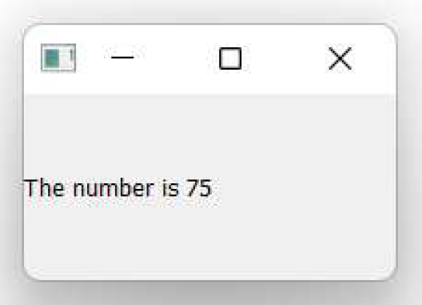
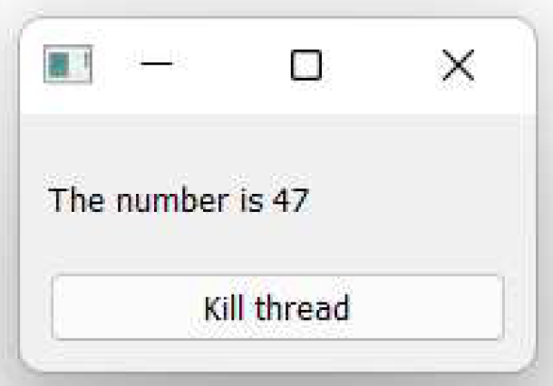
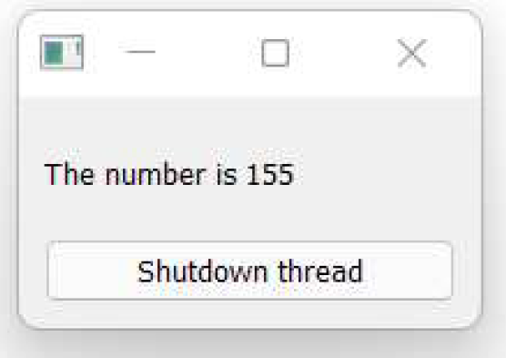
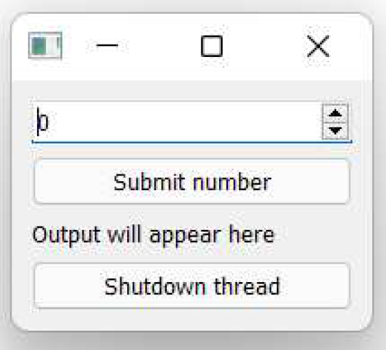
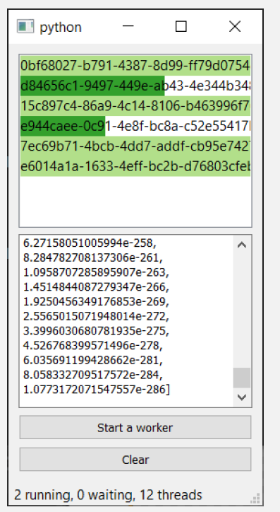

---
prev:
  text: '26. QRunnable 示例'
  link: '/ConcurrentExecution/26'
next:
  text: '28. 运行外部命令及进程'
  link: '/ConcurrentExecution/28'
---

## 27. 长期运行的线程

在迄今为止的示例中，我们一直使用 `QRunnable` 对象来使用 `QThreadPool` 执行任务。我们提交的任务由线程池按顺序处理，最大并发数由线程池限制。

但是，如果您希望某个任务立即执行，而不受其他任务的影响，该怎么办？或者，您可能希望在应用程序运行期间始终在后台保持一个线程运行，以与某个远程服务或硬件交互，或传输数据进行处理。在这种情况下，线程池架构可能并不合适。

在本章中，我们将探讨 PyQt6 的持久线程接口 `QThread`。它与您已经见过的 `QRunnable` 对象提供了非常相似的接口，但允许您完全控制线程的运行时间和方式。

## 使用 `QThread`

与 `QRunnable` 示例一样，`QThread` 类充当了您想要在另一个线程中执行的代码的包装器。它负责启动和将工作转移到单独的线程，以及在线程完成后进行管理和关闭。您只需提供要执行的代码即可。这可以通过子类化 `QThread` 并实现 `run()` 方法来完成。

### 一个简单的线程

让我们从一个简单的例子开始。下面，我们实现了一个工作线程，它可以为我们执行算术运算。我们为该线程添加了一个信号，我们可以使用它将数据从线程中发送出去。

*Listing 205. concurrent/qthread_1.py*

```python
import sys
import time

from PyQt6.QtCore import QThread, pyqtSignal, pyqtSlot
from PyQt6.QtWidgets import QApplication, QLabel, QMainWindow


class Thread(QThread):
    """
    工作线程
    """
    
    result = pyqtSignal(str) #1
    
    @pyqtSlot()
    def run(self):
        """
        您的代码应放置在此方法中
        """
        print("Thread start")
        counter = 0
        while True:
            time.sleep(0.1)
            # 将数字以格式化字符串的形式输出.
            self.result.emit(f"The number is {counter}")
            counter += 1
        print("Thread complete")
        
        
class MainWindow(QMainWindow):
    def __init__(self):
        super().__init__()
        
        # 创建线程并启动它.
        self.thread = Thread()
        self.thread.start() #2
        
        label = QLabel("Output will appear here")
        
        # 连接信号，这样输出就会出现在标签上.
        self.thread.result.connect(label.setText)
        
        self.setCentralWidget(label)
        self.show()
        
        
app = QApplication(sys.argv)
window = MainWindow()
app.exec()
```

> 1. 与 `QRunnable` 不同，`QThread` 类继承自 `QObject`，因此我们可以在线程对象本身定义信号。
> 2. 调用 `.start()` 而不是 `.run()` 来启动线程！

运行此示例后，您将在窗口中看到一个向上计数的数字。这看起来并不

这真的太令人兴奋啦！但计数是在与图形用户界面独立的线程中进行的，结果是通过信号输出的。这意味着图形用户界面不会被正在进行的工作阻塞（尽管正常的 Python GIL 规则仍然适用）。



> 图211：通过信号显示结果的 QThread 计数器

您可以尝试增加 `sleep()` 调用的持续时间，您应该会发现，即使线程被阻塞，主图形用户界面仍然正常运行。


> 如果您通常使用 `numpy` 或其他库，可以尝试使用它们在线程中进行更复杂的计算。


> 通常您会希望在线程中添加某种信号以实现通信。

线程控制

现在我们可以启动线程，但无法停止它。与 `QRunnable` 不同，`QThread` 类内置了 `.terminate()` 方法，可用于立即终止正在运行的线程。这并非干净的关闭操作——线程将直接停止当前执行位置，且不会抛出 Python 异常。

*Listing 206. concurrent/qthread_2.py*

```python
class MainWindow(QMainWindow):
    def __init__(self):
        super().__init__()
        
        # 创建线程并启动它.
        self.thread = Thread()
        self.thread.start()
        
        label = QLabel("Output will appear here")
        button = QPushButton("Kill thread")
        # 终止（立即杀死）线程.
        button.pressed.connect(self.thread.terminate)
        
        # 连接信号，这样输出就会出现在标签上.
        self.thread.result.connect(label.setText)
        container = QWidget()
        layout = QVBoxLayout()
        layout.addWidget(label)
        layout.addWidget(button)
        container.setLayout(layout)
        
        self.setCentralWidget(container)
        self.show()
```

如果您运行这个程序，您会发现我们在线程主循环后添加的“线程完成”消息从未显示。这是因为当我们调用 `.terminate()` 时，执行过程会立即停止，并且永远不会到达代码中的那个位置。



> 图212：可以通过按钮控制来终止该线程。

然而，`QThread` 有一个完成信号，可用于在线程完成后触发某些动作。无论线程是终止还是正常关闭，该信号都会被触发。

线程对象在线程完成运行后仍会保留，您可以使用它来查询线程状态。然而，请注意——如果线程被终止，与线程对象交互可能会导致您的应用程序崩溃。下面的示例通过尝试在线程被终止后打印一些关于线程对象的信息来演示这一点。

*Listing 207. concurrent/qthread_2b.py*

```python
class MainWindow(QMainWindow):
    def __init__(self):
        super().__init__()
        
        # 创建线程并启动它.
        self.thread = Thread()
        self.thread.start()
        
        label = QLabel("Output will appear here")
        button = QPushButton("Kill thread")
        # 终止（立即杀死）线程.
        button.pressed.connect(self.thread.terminate)
        
        # 连接信号，这样输出就会出现在标签上.
        self.thread.result.connect(label.setText)
        self.thread.finished.connect(self.thread_has_finished) #1
        
        container = QWidget()
        layout = QVBoxLayout()
        layout.addWidget(label)
        layout.addWidget(button)
        container.setLayout(layout)
        
        self.setCentralWidget(container)
        self.show()
        
    def thread_has_finished(self):
        print("Thread has finished.")
        print(
            self.thread,
            self.thread.isRunning(),
            self.thread.isFinished(),
        ) #2
```


> 1. 将完成的信号连接到我们的自定义槽。
> 2. 如果您终止线程，您的应用程序很可能会在此处崩溃。

虽然您可以从内部终止一个线程，但更干净利落的做法是从 `run()` 方法中返回。一旦您退出 `run()` 方法，线程就会自动结束并被安全地清理，并且完成信号会触发。

*Listing 208. concurrent/qthread_2c.py*

```python
class Thread(QThread):
    """
    工作线程
    """
    
    result = pyqtSignal(str) #1
    
    @pyqtSlot()
    def run(self):
        """
        您的代码应放置在此方法中
        """
        print("Thread start")
        counter = 0
        while True:
            time.sleep(0.1)
            # 将数字以格式化字符串的形式输出.
            self.result.emit(f"The number is {counter}")
            counter += 1
            if counter > 50:
                return #1
```

> 1. 在 `run()` 方法中调用 `return` 将退出并终止线程。

当您运行上述示例时，计数器将在 50 处停止，因为我们从 run() 方法返回。如果在此之后尝试按下终止按钮，请注意，您不会再次收到线程完成信号——线程已经关闭，因此无法终止。

### 发送数据

在前一个示例中，我们的线程正在运行，但无法接收任何来自外部的数据。通常，当您使用长时间运行的线程时，您会希望能够与它们进行通信，无论是为了传递工作，还是以其他方式控制它们的行为。

我们一直在讨论如何干净地关闭线程的重要性。那么，让我们先看看如何与线程通信，告诉它我们希望它关闭。与 `QRunnable` 示例类似，我们可以使用线程中的一个内部标志来控制主循环，只要该标志为 `True`，循环就会继续。

要关闭线程，我们需要修改这个标志的值。下面我们使用一个名为 `is_running` 的标志和自定义方法 `.stop()` 来实现这一点。当调用这个方法时，它会将 `is_running` 标志设置为 `False`。当标志设置为 `False` 时，主循环将结束，线程将退出 `run()` 方法，并关闭。

*Listing 209. concurrent/qthread_3.py*

```python
class Thread(QThread):
    """
    工作线程
    """
    result = pyqtSignal(str)
    
    @pyqtSlot()
    def run(self):
        """
        您的代码应放置在此方法中。
        """
        self.data = None
        self.is_running = True
        print("Thread start")
        counter = 0
        while self.is_running:
            time.sleep(0.1)
            # 将数字以格式化字符串的形式输出.
            self.result.emit(f"The number is {counter}")
            counter += 1
            
    def stop(self):
        self.is_running = False
```

然后我们可以修改按钮，使其调用自定义的 `stop()` 方法，而不是

*Listing 210. concurrent/qthread_3.py*

```python
        button = QPushButton("Shutdown thread")
        # 优雅地关闭线程.
        button.pressed.connect(self.thread.stop)
```

由于线程已干净地关闭，我们可以安全地访问线程对象，而无需担心它会崩溃。请您将打印语句重新添加到 `thread_has_finished` 方法中。

*Listing 211. concurrent/qthread_3.py*

```python
    def thread_has_finished(self):
        print("Thread has finished.")
        print(
            self.thread,
            self.thread.isRunning(),
            self.thread.isFinished(),
        )
```

如果您运行这个程序，您应该会看到数字像以前一样继续计数，但按下“停止”按钮会立即终止线程。请注意，我们在线程关闭后仍然能够显示该线程的元数据，因为该线程并未发生崩溃。



> 图213：现在可以使用按钮干净地关闭该线程。

我们可以使用相同的基本方法将任何数据发送到我们想要的线程中。下面我们扩展了自定义的 `Thread` 类，添加了一个 `send_data` 方法，该方法接受一个参数，并通过 `self` 将其内部存储在线程中。

使用此方法，我们可以向线程的 `run()` 方法中发送数据，并在该方法中访问这些数据，从而修改线程的行为。

*Listing 212. concurrent/qthread_4.py*

```python
import sys
import time

from PyQt6.QtCore import QThread, pyqtSignal, pyqtSlot
from PyQt6.QtWidgets import (
    QApplication,
    QLabel,
    QMainWindow,
    QPushButton,
    QSpinBox,
    QVBoxLayout,
    QWidget,
)


class Thread(QThread):
    """
    工作线程
    """
    result = pyqtSignal(str)
    
    @pyqtSlot()
    def run(self):
        """
        您的代码应放置在此方法中。
        """
        self.data = None
        self.is_running = True
        print("Thread start")
        counter = 0
        while self.is_running:
            while self.data is None:
                time.sleep(0.1) # 等待数据 <1>.
            # 将数字以格式化字符串的形式输出.
            counter += self.data
            self.result.emit(f"The cumulative total is {counter}")
            self.data = None
            
    def send_data(self, data):
        """
        将数据接收至内部变量
        """
        self.data = data
            
    def stop(self):
        self.is_running = False
        
        
class MainWindow(QMainWindow):
    def __init__(self):
        super().__init__()
        # 创建线程并启动它.
        self.thread = Thread()
        self.thread.start()
        
        self.numeric_input = QSpinBox()
        button_input = QPushButton("Submit number")
        
        label = QLabel("Output will appear here")
        
        button_stop = QPushButton("Shutdown thread")
        # 优雅地关闭线程.
        button_stop.pressed.connect(self.thread.stop)
        
        # 连接信号，这样它的输出就会出现在标签上.
        button_input.pressed.connect(self.submit_data)
        self.thread.result.connect(label.setText)
        self.thread.finished.connect(self.thread_has_finished)
        
        container = QWidget()
        layout = QVBoxLayout()
        layout.addWidget(self.numeric_input)
        layout.addWidget(button_input)
        layout.addWidget(label)
        layout.addWidget(button_stop)
        container.setLayout(layout)
        
        self.setCentralWidget(container)
        self.show()
        
    def submit_data(self):
        # 将数字输入控件中的值提交给线程
        self.thread.send_data(self.numeric_input.value())
        
    def thread_has_finished(self):
        print("Thread has finished.")
        
    
app = QApplication(sys.argv)
window = MainWindow()
app.exec()
```

如果您运行这个示例，您会看到以下窗口。您可以使用 `QSpinBox` 选择一个数字，然后点击按钮将其提交给线程。线程将把传入的数字加到当前计数器上并返回结果。



> 图214：现在，我们可以使用 `QSpinBox` 和按钮向我们的线程提交数据。

如果您使用“关闭线程”按钮来停止线程，您可能会注意到一些奇怪的地方。线程确实会关闭，但你可以在它关闭之前再提交一个数字，而计算仍然会进行——试试看！这是因为 `is_running` 检查是在循环的顶部进行的，然后线程会等待输入。

要解决这个问题，我们需要将对 `is_running` 标志的检查移至等待循环中。

*Listing 213. concurrent/qthread_4b.py*

```python
    @pyqtSlot()
    def run(self):
        """
        您的代码应放置在此方法中。
        """
        print("Thread start")
        self.data = None
        self.is_running = True
        counter = 0
        while True:
            while self.data is None:
                if not self.is_running:
                    return # Exit thread.
                time.sleep(0.1) # 等待数据 <1>.
                
                # 将数字以格式化字符串的形式输出.
                counter += self.data
                self.result.emit(f"The cumulative total is {counter}")
                self.data = None
```

如果您现在运行这个示例，您会发现，如果在线程等待时按下按钮，它将立即退出。


> 在您的线程中设置线程退出控制条件时，请务必谨慎，以避免任何意外的副作用。在执行任何新任务/计算之前，以及在输出任何数据之前，请务必进行检查。

通常，您还希望传递一些初始状态数据，例如用于控制后续线程运行的配置选项。我们可以像处理 `QRunnable` 一样，通过在 `__init__` 块中添加参数来传递这些数据。提供的参数必须存储在 `self` 对象中，以便在 `run()` 方法中使用。

*Listing 214. concurrent/qthread_5.py*

```python
class Thread(QThread):
    """
    工作线程
    """
    result = pyqtSignal(str)
    def __init__(self, initial_data):
        super().__init__()
        self.data = initial_data
        
        
class MainWindow(QMainWindow):
    def __init__(self):
        super().__init__()
        # 创建线程并启动它
        self.thread = Thread(500)
        self.thread.start()
        # ...
```

使用这两种方法，您可以向线程提供所需的任何数据。在线程中等待数据（使用 `sleep` 循环）、处理数据并通过信号返回数据的模式是 Qt 应用程序中处理长期运行的线程时最常见的模式。

让我们再扩展一个示例，以演示传递多种数据类型。在这个示例中，我们修改线程以使用一个显式锁，名为 `waiting_for_data`，我们可以将其在 `True` 和 `False` 之间切换。您可以使用这个

*Listing 215. concurrent/qthread_6.py*

```python
class Thread(QThread):
    """
    工作线程
    """
    result = pyqtSignal(str)
    def __init__(self, initial_counter):
        super().__init__()
        self.counter = initial_counter
        
    
    @pyqtSlot()
    def run(self):
        """
        您的代码应放置在此方法中。
        """
        print("Thread start")
        self.is_running = True
        self.waiting_for_data = True
        while True:
            while self.waiting_for_data:
                if not self.is_running:
                    return # Exit thread.
                time.sleep(0.1) # 等待数据 <1>.
                
            # 将数字以格式化字符串的形式输出.
            self.counter += self.input_add
            self.counter *= self.input_multiply
            self.result.emit(f"The cumulative total is {self.counter}
")
            self.waiting_for_data = True
            
    def send_data(self, add, multiply):
        """
        将数据接收至内部变量
        """
        self.input_add = add
        self.input_multiply = multiply
        self.waiting_for_data = False
        
    def stop(self):
        self.is_running = False
        
      
class MainWindow(QMainWindow):
    def __init__(self):
        super().__init__()
        # 创建线程并启动它.
        self.thread = Thread(500)
        self.thread.start()
        
        self.add_input = QSpinBox()
        self.mult_input = QSpinBox()
        button_input = QPushButton("Submit number")
        
        label = QLabel("Output will appear here")
        
        button_stop = QPushButton("Shutdown thread")
        # 优雅地关闭线程.
        button_stop.pressed.connect(self.thread.stop)
        
        # 连接信号，这样它的输出就会出现在标签上.
        button_input.pressed.connect(self.submit_data)
        self.thread.result.connect(label.setText)
        self.thread.finished.connect(self.thread_has_finished)
        
        container = QWidget()
        layout = QVBoxLayout()
        layout.addWidget(self.add_input)
        layout.addWidget(self.mult_input)
        layout.addWidget(button_input)
        layout.addWidget(label)
        layout.addWidget(button_stop)
        container.setLayout(layout)
        
        self.setCentralWidget(container)
        self.show()
        
    def submit_data(self):
        # 将数字输入控件中的值提交给线程
        self.thread.send_data(
            self.add_input.value(), self.mult_input.value()
        )
        
    def thread_has_finished(self):
        print("Thread has finished.")
        
    
app = QApplication(sys.argv)
window = MainWindow()
app.exec()
```

您还可以将提交数据的方法拆分为每个值的独立方法，并实现一个显式的计算方法来释放锁。这种方法特别适合在您不需要始终更新所有值的情况下使用。例如，当您从外部服务或硬件读取数据时。

*Listing 216. concurrent/qthread_6b.py*

```python
class Thread(QThread):
    def send_add(self, add):
        self.input_add = add
        
    def send_multiply(self, multiply):
        self.input_multiply = multiply
        
    def calculate(self):
        self.waiting_for_data = False # 解锁并计算.
class MainWindow(QMainWindow):
    def submit_data(self):
        # 将数字输入控件中的值提交给线程.
        self.thread.send_add(self.add_input.value())
        self.thread.send_multiply(self.mult_input.value())
        self.thread.calculate()
```

如果您运行这个示例，您应该会看到与之前完全相同的行为。哪种方法您你的应用程序中最有意义，将取决于该线程正在做什么。


> 不要害怕混合使用您学到的各种线程技术。例如，在某些应用程序中，使用持久线程运行应用程序的某些部分，而使用线程池运行其他部分是有意义的。

## 使用过程的感受

当用户在应用程序中执行某项操作时，该操作的后果应立即显现——无论是通过操作本身的结果，还是通过某种指示，表明正在进行的操作将产生相应结果。这一点对于耗时较长的任务（如计算或网络请求）尤为重要，因为缺乏反馈可能导致用户反复点击按钮却得不到任何响应。


> 旋转图标或加载图标可以用于以下情况：当任务的持续时间未知或非常短时。

一种简单的方法是在操作被触发后禁用按钮。但没有其他指示器时，这看起来就像是故障。更好的替代方案是更新按钮，显示“正在处理”的提示，并添加一个活跃的进度指示器，如附近的旋转图标。

进度条是一种常见的方法，用于向用户显示当前正在进行的操作，以及预计需要多长时间。但不要陷入认为进度条总是有用的陷阱！它们只应在能够直观展示任务的线性进展时使用。



> 一些复杂的应用程序可能包含多个并发任务

---

进度条如果出现以下情况则毫无帮助： 

- 进度条会倒退或前进
- 进度条的增长并非与进度成线性关系
- 进度条完成得太快

---

如果没有这些提示，可能会比完全没有信息更令人沮丧。这些行为可能会让用户感到事情不对劲，从而导致沮丧和困惑——“我错过了哪个对话框？！”这些都不是让用户感到愉快的体验，因此应尽可能避免。

请记住，您的用户并不知道应用程序内部发生了什么——他们唯一的了解渠道是您提供的数据。分享对用户有帮助的数据，并隐藏其他所有内容。如果您需要调试输出，可以将其放在菜单后面。

---

**请务必**为耗时较长的任务提供进度条。

**请务必**在适当情况下提供子任务的详细信息。

**请务必**在可能的情况下估算任务所需时间。

**不要**假设用户知道哪些任务耗时长或短。

**不要**使用上下移动或不规则移动的进度条。
