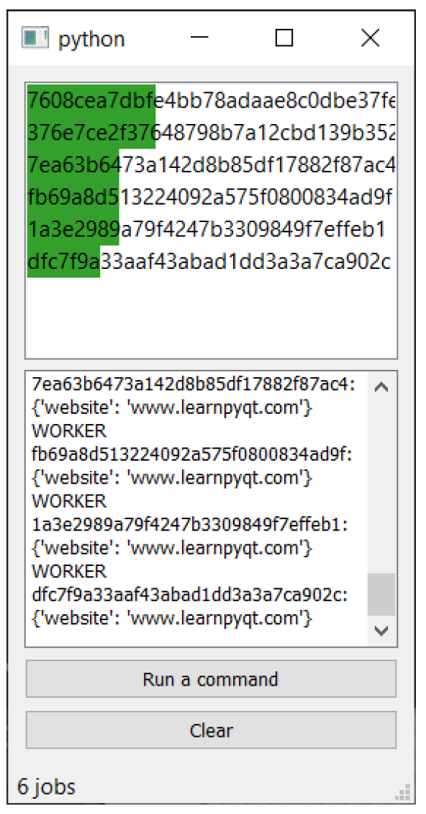

---
prev:
  text: '27. 长期运行的线程'
  link: '/ConcurrentExecution/27'
next:
  text: '29. 使用 PyQtGraph 进行数据可视化'
  link: '/Plotting/29'
---

## 28. 运行外部命令及进程

到目前为止，我们已经探讨了如何在单独的线程中运行程序，包括使用Python的 `subprocess` 模块来运行外部程序。但在PyQt6中，我们还可以利用基于Qt的系统来运行外部程序，即`QProcess`。使用 `QProcess` 创建并执行任务相对简单。

最简单的示例如下所示——我们创建一个 `QProcess` 对象，然后调用 `.start` 方法，传入要执行的命令和一个字符串参数列表。在此示例中，我们正在运行自定义演示脚本，使用 Python 命令：`python dummy_script.py`。

```python
p = QProcess()
p.start("python", ["dummy_script.py"])
```


> 根据您的环境，您可能需要指定 `python3` 而不是 `python`


> 您需要在 `QProcess` 实例运行期间，将其引用保存在 `self` 或其他位置。

如果您只是想运行一个程序，而不关心它会发生什么，那么这个简单的例子就足够了。但是，如果您想更多地了解程序在做什么，`QProcess` 提供了一些信号，可以用来跟踪进程的进度和状态。

最有用的事件是 `.readyReadStandardOutput` 和 `.readyReadStandardError`，这些事件会在进程中标准输出和标准错误准备好被读取时触发。所有运行的进程都有两个输出流——标准输出和标准错误。标准输出返回执行结果（如果有），而标准错误返回任何错误或异常。

```python
p = QProcess()
p.readyReadStandardOutput.connect(self.handle_stdout)
p.readyReadStandardError.connect(self.handle_stderr)
p.stateChanged.connect(self.handle_state)
p.finished.connect(self.cleanup)
p.start("python", ["dummy_script.py"])
```

此外，还有一个在进程完成时触发的 `.finished` 信号，以及一个在进程状态发生变化时触发的 `.stateChanged` 信号。有效值（在 `QProcess.ProcessState` 枚举中定义）如下所示。

| 常量                | 值   | 描述                                   |
| ------------------- | ---- | -------------------------------------- |
| QProcess.NotRunning | 0    | 该进程未运行                           |
| QProcess.Starting   | 1    | 进程已启动，但程序尚未被调用           |
| QProcess.Running    | 2    | 该进程正在运行，并已准备好进行读写操作 |

在下面的示例中，我们将这个基本的 `QProcess` 设置扩展，为标准输出和标准错误添加处理程序。通知数据可用的信号连接到这些处理程序，并使用 `.readAllStandardError()` 和 `.readAllStandardOutput()` 触发对进程数据的请求。


> 这些方法输出原始字节，因此您需要先对其进行解码。

在此示例中，我们的演示脚本 `dummy_script.py` 返回一系列字符串，这些字符串会被解析以提供进度信息和结构化数据。过程的状态也会显示在状态栏上。

完整的代码如下所示：

*Listing 217. concurrent/qprocess.py*

```python
import re
import sys

from PyQt6.QtCore import QProcess
from PyQt6.QtWidgets import (
    QApplication,
    QMainWindow,
    QPlainTextEdit,
    QProgressBar,
    QPushButton,
    QVBoxLayout,
    QWidget,
)

STATES = {
    QProcess.ProcessState.NotRunning: "Not running",
    QProcess.ProcessState.Starting: "Starting...",
    QProcess.ProcessState.Running: "Running...",
}

progress_re = re.compile("Total complete: (\d+)%")


def simple_percent_parser(output):
    """
    使用 progress_re 正则表达式匹配行，
    返回一个整数表示百分比进度。
    """
    m = progress_re.search(output)
    if m:
        pc_complete = m.group(1)
        return int(pc_complete)
    
    
def extract_vars(l):
    """
    从行中提取变量，查找包含等号的行，并拆分为键值对。
    """
    data = {}
    for s in l.splitlines():
        if "=" in s:
            name, value = s.split("=")
            data[name] = value
    return data


class MainWindow(QMainWindow):
    def __init__(self):
        super().__init__()
        
        # 保持进程引用.
        self.p = None
        
        layout = QVBoxLayout()
        
        self.text = QPlainTextEdit()
        layout.addWidget(self.text)
        
        self.progress = QProgressBar()
        layout.addWidget(self.progress)
        
        btn_run = QPushButton("Execute")
        btn_run.clicked.connect(self.start)
        
        layout.addWidget(btn_run)
        
        w = QWidget()
        w.setLayout(layout)
        self.setCentralWidget(w)
        
        self.show()
        
    def start(self):
        if self.p is not None:
            return
        
        self.p = QProcess()
        self.p.readyReadStandardOutput.connect(self.handle_stdout)
        self.p.readyReadStandardError.connect(self.handle_stderr)
        self.p.stateChanged.connect(self.handle_state)
        self.p.finished.connect(self.cleanup)
        self.p.start("python", ["dummy_script.py"])
        
    def handle_stderr(self):
        result = bytes(self.p.readAllStandardError()).decode("utf8")
        progress = simple_percent_parser(result)
        
        self.progress.setValue(progress)
        
    def handle_stdout(self):
        result = bytes(self.p.readAllStandardOutput()).decode("utf8")
        data = extract_vars(result)
        
        self.text.appendPlainText(str(data))
        
    def handle_state(self, state):
        self.statusBar().showMessage(STATES[state])
        
    def cleanup(self):
        self.p = None
        
        
app = QApplication(sys.argv)
w = MainWindow()
app.exec()
```

在此示例中，我们将进程的引用存储在 `self.p` 中，这意味着我们一次只能运行一个进程。但您可以自由地与应用程序一起运行任意多个进程。如果您不需要跟踪来自这些进程的信息，您可以简单地将进程的引用存储在列表中。

但是，如果您想跟踪进度并单独解析工作进程的输出，您可能需要考虑创建一个管理类来滑块和跟踪所有进程。本书的源文件中有一个示例，名为 `qprocess_manager.py`。

示例的完整源代码可在本书的源代码中找到，但下面我们将重点探讨 `JobManager` 类本身。

*Listing 218. concurrent/qprocess_manager.py*

```python
class JobManager(QAbstractListModel):
    """
    管理器，用于处理活动作业、标准输出、标准错误和进度解析器。
    还作为视图的 Qt 数据模型，显示每个进程的进度。
    """
    _jobs = {}
    _state = {}
    _parsers = {}

    status = pyqtSignal(str)
    result = pyqtSignal(str, object)
    progress = pyqtSignal(str, int)

    def __init__(self):
        super().__init__()
        
        self.status_timer = QTimer()
        self.status_timer.setInterval(100)
        self.status_timer.timeout.connect(self.notify_status)
        self.status_timer.start()
        
        # 内部信号，通过解析器触发进度更新.
        self.progress.connect(self.handle_progress)
        
    def notify_status(self):
        n_jobs = len(self._jobs)
        self.status.emit("{} jobs".format(n_jobs))
        
    def execute(self, command, arguments, parsers=None):
        """
        通过启动一个新进程来执行命令
        """
        job_id = uuid.uuid4().hex
        
        # 默认情况下，信号无法访问发送它的进程的任何信息。因此，我们使用此构造函数为每个信号添加 job_id 注释。
        
        def fwd_signal(target):
            return lambda *args: target(job_id, *args)
        
        self._parsers[job_id] = parsers or []
        
        # 将默认状态设置为等待，进度为0。
        self._state[job_id] = DEFAULT_STATE.copy()
        
        p = QProcess()
        p.readyReadStandardOutput.connect(
            fwd_signal(self.handle_output)
        )
        p.readyReadStandardError.connect(fwd_signal(self.
                                                    handle_output))
        p.stateChanged.connect(fwd_signal(self.handle_state))
        p.finished.connect(fwd_signal(self.done))
        
        self._jobs[job_id] = p
        
        p.start(command, arguments)
        
        self.layoutChanged.emit()
        
    def handle_output(self, job_id):
        p = self._jobs[job_id]
        stderr = bytes(p.readAllStandardError()).decode("utf8")
        stdout = bytes(p.readAllStandardOutput()).decode("utf8")
        output = stderr + stdout
        
        parsers = self._parsers.get(job_id)
        for parser, signal_name in parsers:
            # 依次使用每个解析器对数据进行解析.
            result = parser(output)
            if result:
                # 按名称（使用 signal_name）查找信号，并输出解析结果.
                signal = getattr(self, signal_name)
                signal.emit(job_id, result)
                
    def handle_progress(self, job_id, progress):
        self._state[job_id]["progress"] = progress
        self.layoutChanged.emit()
        
    def handle_state(self, job_id, state):
        self._state[job_id]["status"] = state
        self.layoutChanged.emit()
        
    def done(self, job_id, exit_code, exit_status):
        """
        任务/工作进程已完成。将其从活动工作者字典中移除。
        我们将其保留在工作进程状态中，因为这用于显示过去/已完成的工作进程。
        """
        del self._jobs[job_id]
        self.layoutChanged.emit()
        
    def cleanup(self):
        """
        从 worker_state 中移除所有已完成或失败的任务。
        """
        for job_id, s in list(self._state.items()):
            if s["status"] == QProcess.ProcessState.NotRunning:
                del self._state[job_id]
        self.layoutChanged.emit()
        
    # 模型接口
    def data(self, index, role):
        if role == Qt.ItemDataRole.DisplayRole:
            # 请参见下文的数据结构.
            job_ids = list(self._state.keys())
            job_id = job_ids[index.row()]
            return job_id, self._state[job_id]
        
    def rowCount(self, index):
        return len(self._state)
```

本类提供了一个模型视图接口，使其可作为 `QListView` 的基础。自定义委托 `ProgressBarDelegate` 委托为每个项绘制进度条，并显示任务标识符。进度条的颜色由进程状态决定——若处于活动状态则为深绿色，若已完成则为浅绿色。

在此设置中，解析来自工作进程的进度信息比较棘手，因为 `.readyReadStandardError` 和 `.readyReadStandardOutput` 信号不会传递数据或关于已准备就绪的工作的信息。为了解决这个问题，我们定义了自定义的 `job_id`，并拦截信号以将此数据添加到它们中。

解析器在执行命令时被传递进来并存储在 `_parsers` 中。每个任务接收的输出会通过相应的解析器处理，用于输出数据或更新任务的进度。我们定义了两个简单的解析器：一个用于提取当前进度，另一个用于获取输出数据。

*Listing 219. concurrent/qprocess_manager.py*

```python
progress_re = re.compile("Total complete: (\d+)%", re.M)

def simple_percent_parser(output):
    """
    使用 progress_re 正则表达式匹配行，
    返回一个整数表示百分比进度。
    """
    m = progress_re.search(output)
    if m:
        pc_complete = m.group(1)
        return int(pc_complete)
    
def extract_vars(l):
    """
    从行中提取变量，查找包含等号的行，并拆分为键值对。
    """
    data = {}
    for s in l.splitlines():
        if "=" in s:
            name, value = s.split("=")
            data[name] = value
    return data
```

解析器作为一个简单的元组列表传递，该列表包含用作解析器的函数和要发出的信号的名称。信号通过在 `JobManager` 上使用 `getattr` 根据名称进行查找。在示例中，我们只定义了 2 个信号，一个用于数据/结果输出，另一个用于进度。但您可以根据需要添加任意数量的信号和解析器。使用这种方法，您可以根据需要选择省略某些任务的某些解析器（例如，没有进度信息的情况下）。

您可以运行示例代码，并在另一个进程中运行任务。您可以启动多个任务，并观察它们的完成情况，同时实时更新其当前进度。尝试为自己的任务添加额外的命令和解析器。



> 图215：进程管理器，显示正在运行的进程和进度
