---
prev:
  text: '20. 使用Qt模型查询SQL数据库'
  link: '/ModelViewArchitecture/20'
next:
  text: '22. 创建自定义控件'
  link: '/CustomWidgets/22'
---

如我们所见，Qt 内置了各种控件，您可以使用这些控件来构建应用程序。即使如此，有时这些简单的控件还是不够用——也许您需要一些自定义类型的输入，或者希望以独特的方式可视化数据。在 Qt 中，您可以自由创建自己的控件，无论是从头开始创建，还是组合现有控件。

在本章中，我们将了解如何使用位图图形和自定义信号来创建您自己的控件

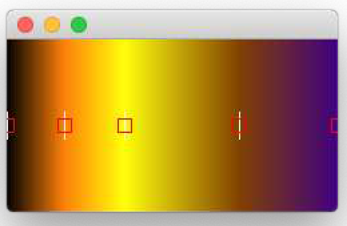

> 图160：自定义颜色渐变输入，我们库中的控件之一


> 您可能还想查看我们的 [自定义控件库](https://www.pythonguis.com/widgets/)。

## 21. Qt 中的位图图形

在 PyQt6 中创建自定义控件的第一步是了解位图（基于像素）图形操作。所有标准控件都以位图的形式绘制在构成控件形状的矩形“画布”上。一旦您了解了其工作原理，就可以绘制任何您喜欢的自定义控件！

位图是由像素组成的矩形网格，其中每个像素（及其颜色）由一定数量的“位”来表示。它们与矢量图形不同，矢量图形中图像以一系列线条（或矢量）绘图形状的形式存储，这些形状用于构成图像。如果您在屏幕上查看矢量图形，它们正在被栅格化——转换为位图图像——以像素形式显示在屏幕上。

在本教程中，我们将介绍 `QPainter`，这是 Qt 用于执行位图图形操作的 API，也是绘制您自己的控件的基础。我们将介绍一些基本的绘图操作，最后将它们整合在一起，创建我们自己的小绘图应用程序。

## `QPainter`

Qt 中的位图绘图操作通过 `QPainter` 类进行处理。这是一个通用接口，可用于在各种表面上绘图，包括 `QPixmap` 等。在本章中，我们将介绍 `QPainter` 的绘图方法，首先在 `QPixmap` 表面上使用基本操作，然后利用所学知识构建一个简单的 Paint 应用程序。

为了便于演示，我们将使用以下存根应用程序，该应用程序负责创建容器（`QLabel`）、创建像素图画布、将像素图画布设置到容器中，并将容器添加到主窗口。

*Listing 131. bitmap/stub.py*

```python
import sys

from PyQt6.QtCore import Qt
from PyQt6.QtGui import QPixmap
from PyQt6.QtWidgets import QApplication, QLabel, QMainWindow


class MainWindow(QMainWindow):
    def __init__(self):
        super().__init__()
        
        self.label = QLabel()
        self.canvas = QPixmap(400, 300) #1
        self.canvas.fill(Qt.GlobalColor.white) #2
        
        self.setCentralWidget(self.label)
        self.draw_something()
        
    def draw_something(self):
        pass
    
    
app = QApplication(sys.argv)
window = MainWindow()
window.show()
app.exec()
```

> 1. 创建我们将要绘制的 `QPixmap` 对象。
> 2. 用白色填充整个画布（以便我们能看到我们的线条）。


> 为什么使用 `QLabel` 进行绘制？`QLabel` 控件还可以用于显示图像，它是显示 `QPixmap` 的最简单的控件。

我们需要先用白色填充画布，因为根据平台和当前的深色模式，背景颜色可能从浅灰色到黑色不等。我们可以从绘制一些非常简单的内容开始。

*Listing 132. /bitmap/line.py*

```python
import sys

from PyQt6.QtCore import Qt
from PyQt6.QtGui import QPainter, QPixmap
from PyQt6.QtWidgets import QApplication, QLabel, QMainWindow


class MainWindow(QMainWindow):
    def __init__(self):
        super().__init__()
        
        self.label = QLabel()
        self.canvas = QPixmap(400, 300) #1
        self.canvas.fill(Qt.GlobalColor.white) #2
        self.label.setPixmap(self.canvas)
        self.setCentralWidget(self.label)
        self.draw_something()
        
    def draw_something(self):
        painter = QPainter(self.canvas)
        painter.drawLine(10, 10, 300, 200) #3
        painter.end()
        self.label.setPixmap(self.canvas)
        
        
app = QApplication(sys.argv)
window = MainWindow()
window.show()
app.exec()
```

> 1. 创建我们将要绘制的 `QPixmap` 对象。
> 2. 用白色填充整个画布（以便我们能看到我们的线条）
> 3. 从 (10, 10) 到 (300, 200) 画一条直线。坐标为 (x, y)，其中 (0, 0) 在左上角。

将此内容保存到文件中并运行，您应该会看到以下内容——窗口框架内的一条黑色

线

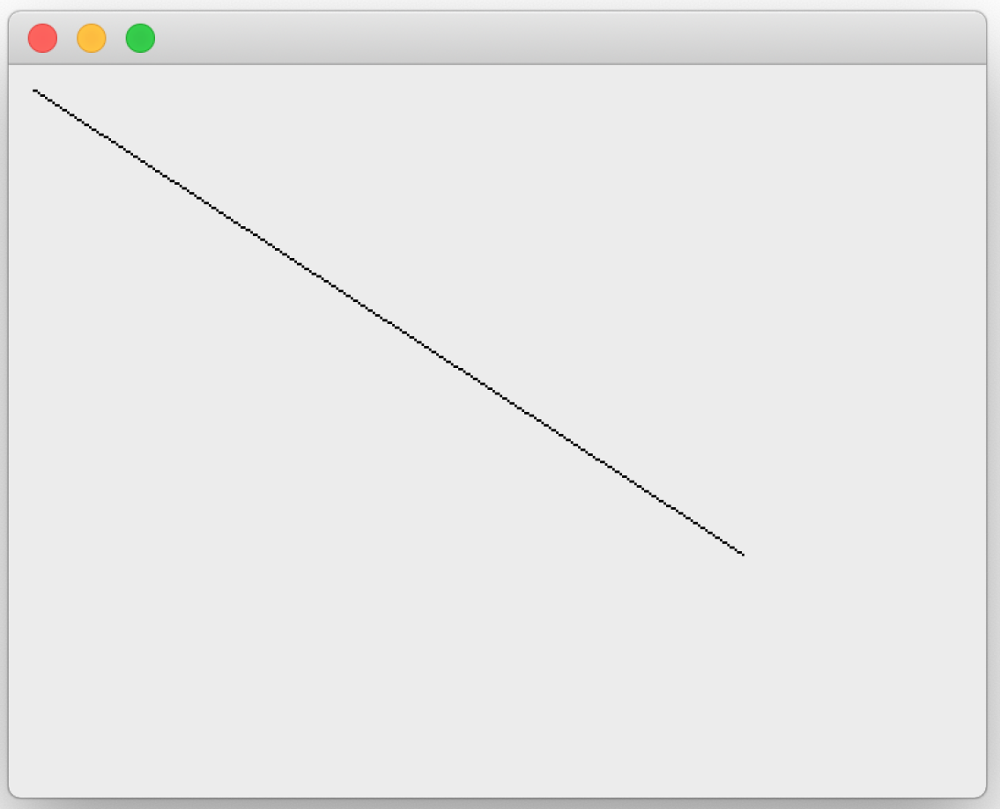

> 图161：画布上的一条黑色直线。

所有绘制操作均在 `draw_something` 方法中完成——我们创建一个 `QPainter` 实例，传入画布（`self.label.pixmap()`），然后发出绘制直线的命令。最后调用 `.end()` 方法关闭绘图器并应用更改。


> 通常情况下，您还需要调用 `.update()` 来触发控件的刷新，但由于我们在应用程序窗口显示之前就进行了绘制，因此刷新会自动发生。

`QPainter` 的坐标系将 (0, 0) 置于画布的左上角，其中 x 值向右增加，y 值向下增加。这可能与您习惯的图形绘制不同，因为在图形绘制中，(0, 0) 通常位于左下角。

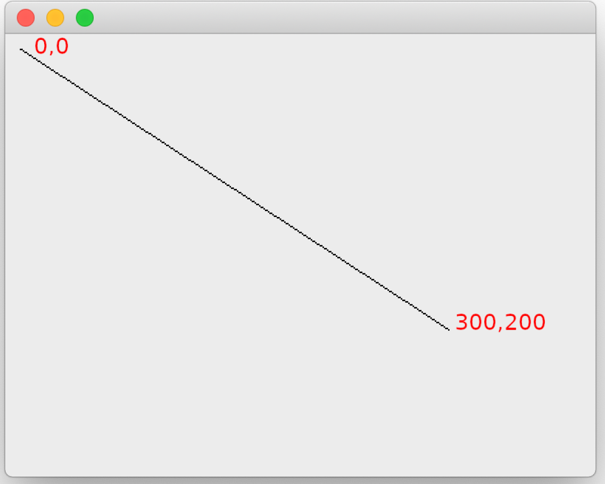

> 图162：标注有坐标的黑色线条

## 绘制基本图形

`QPainter` 提供了大量用于在位图表面上绘制形状和线条的方法（在 5.12 版本中，有 192 个 `QPainter` 专用的非事件方法）。好消息是，其中大多数都是重载方法，它们只是调用相同基类方法的不同方式。

例如，有5种不同的 `drawLine` 方法，它们都绘制相同的线，但定义要绘制内容的坐标的方式不同。

| 方法                       | 描述                                                         |
| -------------------------- | ------------------------------------------------------------ |
| `drawLine(line)`           | 绘制一个 `QLine` 实例                                        |
| `drawLine(line)`           | 绘制一个 `QLineF` 实例                                       |
| `drawLine(x1, y1, x2, y2)` | 在 (x1, y2) 和 (x2, y2) 之间画一条直线。（两者均为 `int`）   |
| `drawLine(p1, p2)`         | 在 (x1, y2) 和 (x2, y2) 之间画一条直线。（两者均为 `QPoint`） |
| `drawLine(p1, p2)`         | 在 (x1, y2) 和 (x2, y2) 之间画一条直线。（两者均为 `QPointF`） |

如果您在想 `QLine` 和 `QLineF` 有什么区别，那么后者的坐标是浮点数。这在其他计算结果是浮点数时很方便，但其他情况下则不然。

忽略 F 变体，我们有三种独特的方式来绘制一条直线——使用直线对象、使用两组坐标 `(x1, y1)` 和 `(x2, y2)`，或者使用两个 `QPoint` 对象。当您发现 `QLine` 本身被定义为`QLine(const QPoint &p1, const QPoint & p2)`或 `QLine(int x1, int y1, int x2, int y2)`时，您会发现它们实际上是完全相同的东西。不同的调用签名只是为了方便。


> 给定坐标 x1, y1, x2, y2，两个 `QPoint` 对象将被定义为 `QPoint(x1, y1)` 和 `QPoint(x2, y2)`。

因此，排除重复项后，我们得到以下绘图操作：`drawArc`、`drawChord`、`drawConvexPolygon`、`drawEllipse`、`drawLine`、`drawPath`、`drawPie`、`drawPoint`、`drawPolygon`、`drawPolyline`、`drawRect`、`drawRects` 和 `drawRoundedRect`。为了避免被过多的内容淹没，我们将首先专注于基本形状和线条，待掌握基础后再回过头来处理更复杂的操作。


> 对于每个示例，请在您的示例应用程序中替换 `draw_something` 方法，然后重新运行以查看输出结果。

### `drawPoint`

这会在画布上的指定位置绘制一个点或像素。每次调用 `drawPoint` 方法都会绘制一个像素。您可以用以下代码替换您的 `draw_something` 代码：

*Listing 133. bitmap/point.py*

```python
    def draw_something(self):
        painter = QPainter(self.canvas)
        painter.drawPoint(200, 150)
        painter.end()
        self.label.setPixmap(self.canvas)
```

如果您重新运行该文件，您会看到一个窗口，但这次窗口中央有一个单一的点，颜色为黑色。您可能需要移动窗口来找到它。

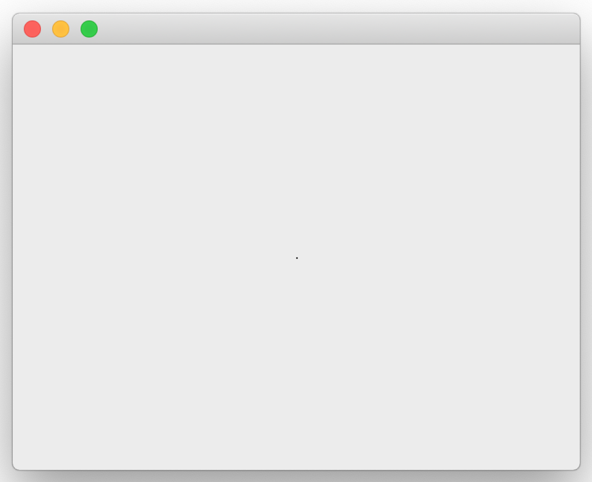

> 图163：使用QPainter绘制单个点（像素）

这看起来确实没什么特别的。为了让事情更有趣，我们可以更改我们正在绘制的点的颜色和大小。在 PyQt6 中，线条的颜色和粗细是通过 `QPainter` 上的活动画笔来定义的。您可以通过创建一个 `QPen` 实例并应用它来设置这些属性。

*Listing 134. bitmap/point_with_pen.py*

```python
    def draw_something(self):
        painter = QPainter(self.canvas)
        pen = QPen()
        pen.setWidth(40)
        pen.setColor(QColor("red"))
        painter.setPen(pen)
        painter.drawPoint(200, 150)
        painter.end()
        self.label.setPixmap(self.canvas)
```

这将产生一个稍显有趣的结果。

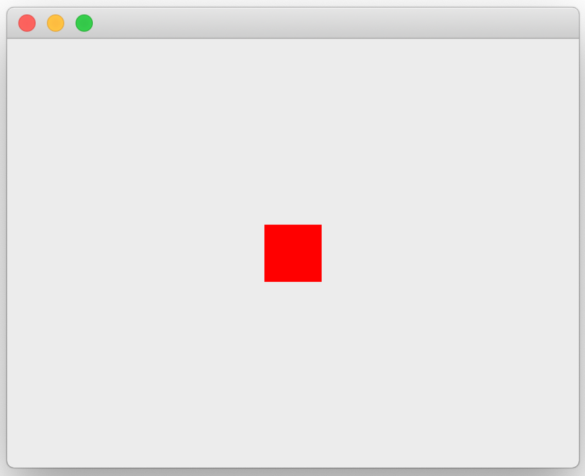

> 图164：一个大红点

您可以自由地使用 `QPainter` 执行多次绘制操作，直到绘图器结束。在画布上绘制非常快速——这里我们正在随机绘制 10000 个点。

*Listing 135. bitmap/points.py*

```python
from random import choice, randint #1

    def draw_something(self):
        painter = QPainter(self.canvas)
        pen = QPen()
        pen.setWidth(3)
        painter.setPen(pen)
        
        for n in range(10000):
            painter.drawPoint(
                200 + randint(-100, 100),
                150 + randint(-100, 100), # x # y
            )
        painter.end()
        self.label.setPixmap(self.canvas)
```

> 1. 在文件开头添加此导入语句

这些点宽度为3像素，颜色为黑色（默认画笔）。

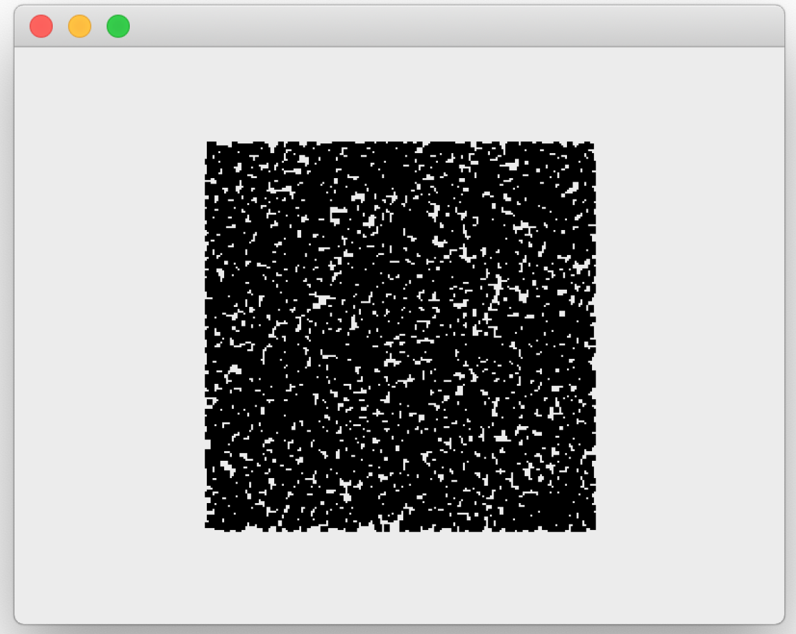

> 图165：画布上10000个3像素的点

在绘图过程中，您经常需要更新当前的画笔——例如，以不同颜色绘制多个点，同时保持其他特性（如宽度）不变。为了实现这一点，而无需每次都重新创建一个新的 `QPen` 实例，您可以从 `QPainter` 中获取当前活动的画笔，使用 `pen = painter.pen()`。您还可以多次重新应用现有的画笔，每次都对其进行修改。

*Listing 136. bitmap/points_color.py*

```python
    def draw_something(self):
        colors = [
            "#FFD141",
            "#376F9F",
            "#0D1F2D",
            "#E9EBEF",
            "#EB5160",
        ]
        
        painter = QPainter(self.canvas)
        pen = QPen()
        pen.setWidth(3)
        painter.setPen(pen)
        
        for n in range(10000):
            # pen = painter.pen() 您可以在这里获取活动笔。
            pen.setColor(QColor(choice(colors)))
            painter.setPen(pen)
            painter.drawPoint(
                200 + randint(-100, 100),
                150 + randint(-100, 100), # x # y
            )
    painter.end()
    self.label.setPixmap(self.canvas)
```

将生成以下输出

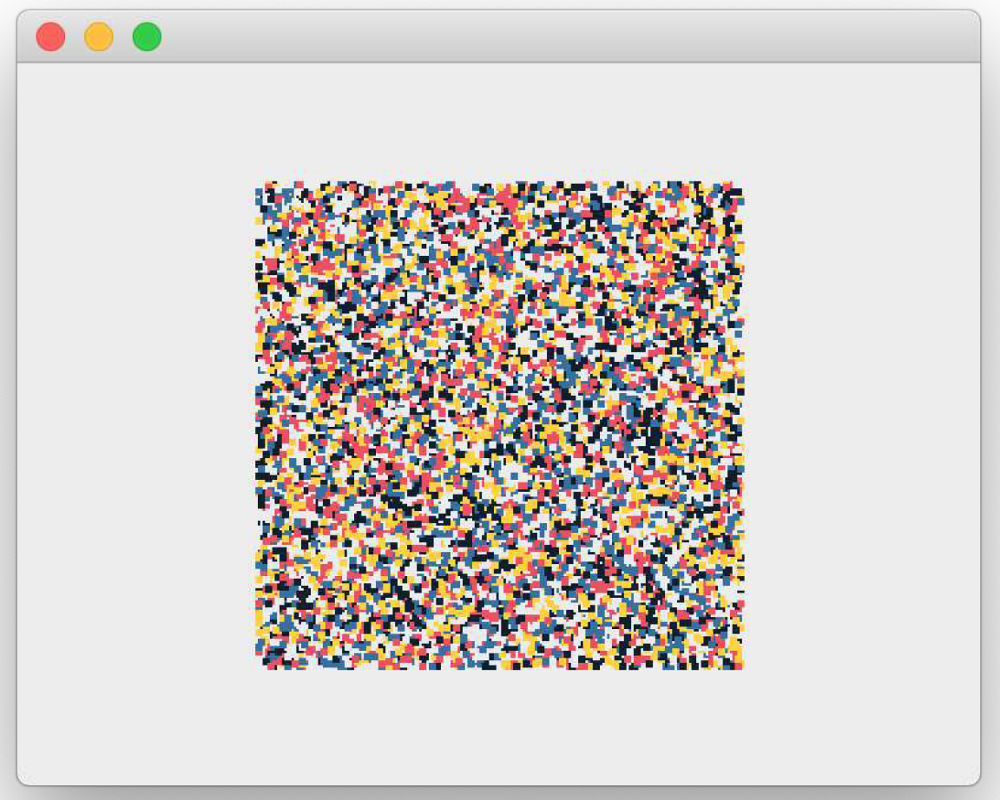

> 图166：随机分布的三像素宽的点


> 在 `QPainter` 上只能有一个 `QPen` 处于活动状态——即当前的笔。

这大概就是用画笔在屏幕上画点能带来的全部乐趣了，所以我们接下来要看看其他一些绘图操作。

### `drawLine`

我们在画布上已经画了一条线来测试功能是否正常。但我们尚未尝试将画笔设置为控制线条外观。

*Listing 137. bitmap/line_with_pen.py*

```python
    def draw_something(self):
        painter = QPainter(self.canvas)
        pen = QPen()
        pen.setWidth(15)
        pen.setColor(QColor("blue"))
        painter.setPen(pen)
        painter.drawLine(QPoint(100, 100), QPoint(300, 200))
        painter.end()
        self.label.setPixmap(self.canvas)
```

在此示例中，我们还使用 `QPoint` 来定义要用直线连接的两个点，而不是分别传入 `x1、y1、x2、y2` 参数——请记住，这两种方法在功能上是完全相同的。

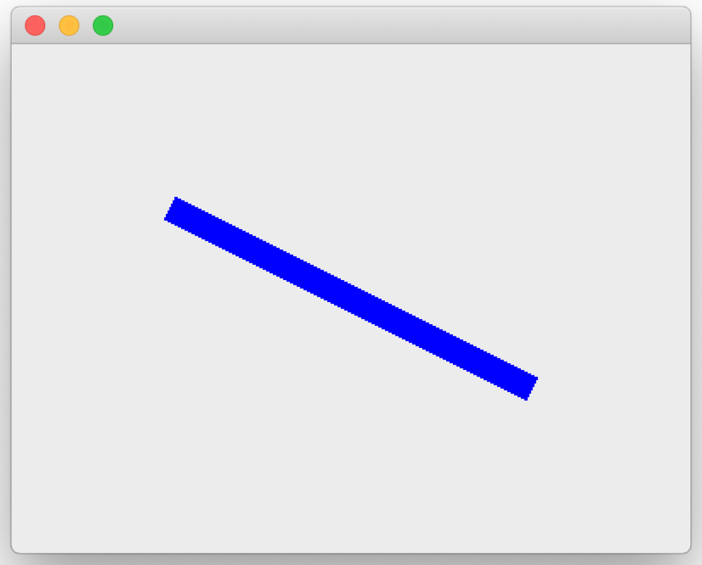

> 图167：一个蓝色的粗线

### `drawRect`, `drawRects` 和 `drawRoundedRect`

这些函数均用于绘制矩形，矩形可通过一系列点定义，或通过 `QRect` 或 `QRectF` 实例定义。

*Listing 138. bitmap/rect.py*

```python
    def draw_something(self):
        painter = QPainter(self.canvas)
        pen = QPen()
        pen.setWidth(3)
        pen.setColor(QColor("#EB5160"))
        painter.setPen(pen)
        painter.drawRect(50, 50, 100, 100)
        painter.drawRect(60, 60, 150, 100)
        painter.drawRect(70, 70, 100, 150)
        painter.drawRect(80, 80, 150, 100)
        painter.drawRect(90, 90, 100, 150)
        painter.end()
        self.label.setPixmap(self.canvas)
```


> 正方形只是一个宽度和高度相等的矩形。

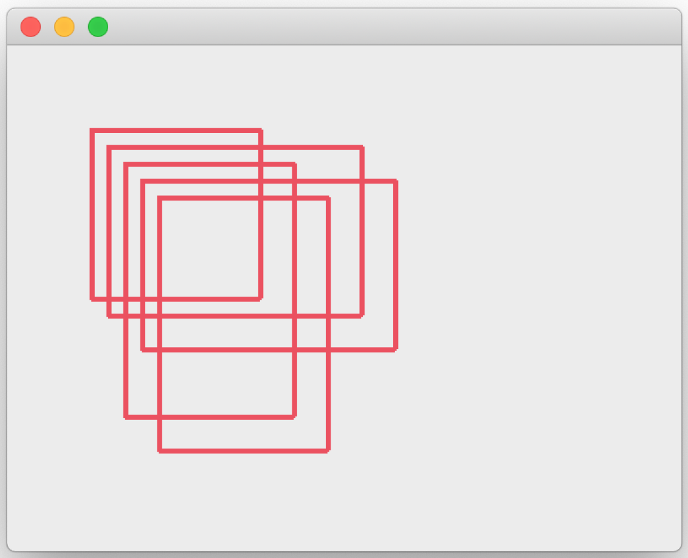

> 图168：画出来的矩形

您还可以将多个对 `drawRect` 的调用替换为对 `drawRects` 的单次调用，并传入多个 `QRect` 对象。这将产生完全相同的结果。

```python
painter.drawRects(
    QtCore.QRect(50, 50, 100, 100),
    QtCore.QRect(60, 60, 150, 100),
    QtCore.QRect(70, 70, 100, 150),
    QtCore.QRect(80, 80, 150, 100),
    QtCore.QRect(90, 90, 100, 150),
)
```

在 PyQt6 中，可以通过设置当前活动的绘图刷来填充绘制的形状，将 `QBrush` 实例传递给 `painter.setBrush()` 方法。以下示例将所有矩形填充为带图案的黄色。

*Listing 139. bitmap/rect_with_brush.py*

```python
    def draw_something(self):
        painter = QPainter(self.canvas)
        pen = QPen()
        pen.setWidth(3)
        pen.setColor(QColor("#376F9F"))
        painter.setPen(pen)
        brush = QBrush()
        brush.setColor(QColor("#FFD141"))
        brush.setStyle(Qt.BrushStyle.Dense1Pattern)
        painter.setBrush(brush)
        painter.drawRects(
            QRect(50, 50, 100, 100),
            QRect(60, 60, 150, 100),
            QRect(70, 70, 100, 150),
            QRect(80, 80, 150, 100),
            QRect(90, 90, 100, 150),
        )
        painter.end()
        self.label.setPixmap(self.canvas)
```

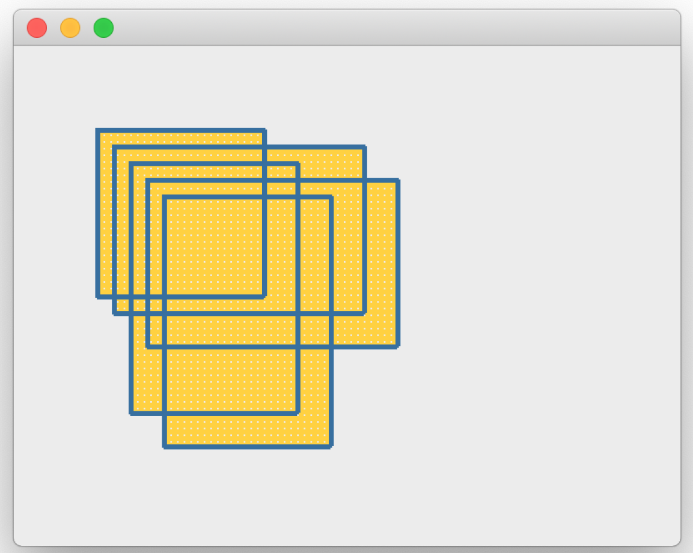

> 图169：被填上颜色的矩形

至于笔，一个画家只能使用一支画笔，但您可以在绘画时在它们之间切换或更改它们。有 [许多画笔样式图案](https://doc.qt.io/qt-5/qt.html#BrushStyle-enum) 可供选择。您可能最常使用的是 `Qt.BrushStyle.SolidPattern`。


> 您必须设置样式才能看到任何填充，因为默认值为 `Qt.BrushStyle.NoBrush`。

`drawRoundedRect` 方法绘制一个矩形，但带有圆角，因此需要额外传入两个参数，分别表示角点的 x 和 y 半径。

*Listing 140. bitmap/roundrect.py*

```python
    def draw_something(self):
        painter = QPainter(self.canvas)
        pen = QPen()
        pen.setWidth(3)
        pen.setColor(QColor("#376F9F"))
        painter.setPen(pen)
        painter.drawRoundedRect(40, 40, 100, 100, 10, 10)
        painter.drawRoundedRect(80, 80, 100, 100, 10, 50)
        painter.drawRoundedRect(120, 120, 100, 100, 50, 10)
        painter.drawRoundedRect(160, 160, 100, 100, 50, 50)
        painter.end()
        self.label.setPixmap(self.canvas)
```

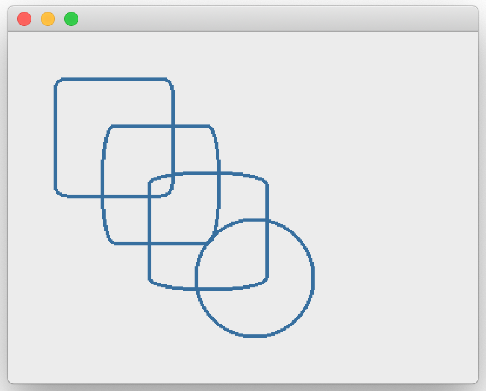

> 图170：圆角矩形


> 有一个可选的最后一个参数，用于在 x 和 y 轴的椭圆半径之间切换，这些半径以绝对像素值定义，`Qt.SizeMode.RelativeSize`（默认值）或相对于矩形的大小（作为 0…100 的值传递）。您可以传递 `Qt.SizeMode.RelativeSize` 以启用此功能。

### `drawEllipse`

我们现在要介绍的最后一个原始绘制方法是 `drawEllipse`，它可以用于绘制椭圆或圆。


> 圆只是一个宽度和高度相等的椭圆。

*Listing 141. bitmap/ellipse.py*

```python
    def draw_something(self):
        painter = QPainter(self.canvas)
        pen = QPen()
        pen.setWidth(3)
        pen.setColor(QColor(204, 0, 0)) # r, g, b
        painter.setPen(pen)
        
        painter.drawEllipse(10, 10, 100, 100)
        painter.drawEllipse(10, 10, 150, 200)
        painter.drawEllipse(10, 10, 200, 300)
        painter.end()
        
        self.label.setPixmap(self.canvas)
```

在此示例中，`drawEllipse` 方法接受 4 个参数，其中前两个参数是矩形左上角的 x和 y 坐标，该矩形用于绘制椭圆，而后两个参数分别是该矩形的宽度和高度。

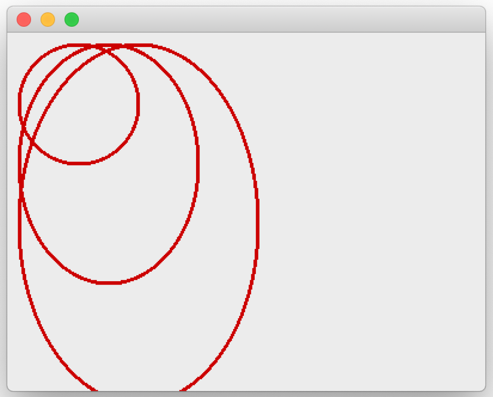

> 图171：使用x、y、宽度、高度或 `QRect` 绘制椭圆


> 您可以通过传递一个 `QRect` 来实现相同的效果。

还有另一种调用签名，它将椭圆的中心作为第一个参数，以 `QPoint` 或 `QPointF` 对象的形式提供，然后是 x 和 y 半径。下面的示例展示了它的使用方式

```python
painter.drawEllipse(QtCore.QPoint(100, 100), 10, 10)
painter.drawEllipse(QtCore.QPoint(100, 100), 15, 20)
painter.drawEllipse(QtCore.QPoint(100, 100), 20, 30)
painter.drawEllipse(QtCore.QPoint(100, 100), 25, 40)
painter.drawEllipse(QtCore.QPoint(100, 100), 30, 50)
painter.drawEllipse(QtCore.QPoint(100, 100), 35, 60)
```

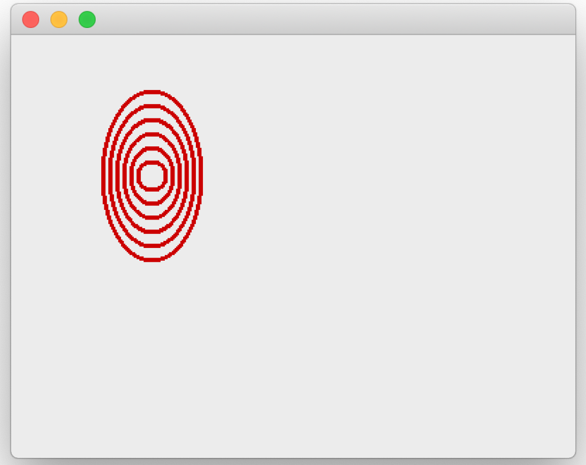

> 图172：使用点和半径绘制椭圆

您可以使用与矩形相同的 `QBrush` 方法来填充椭圆。

### 文本

最后，我们将简要介绍 `QPainter` 的文本绘制方法。要控制 `QPainter` 的当前字体，您可以使用 `setFont` 方法并传入一个 `QFont` 实例。通过此方法，您可以控制文本的字体家族、字重和字号（以及其他属性）。文本的颜色仍由当前画笔定义，但画笔的宽度不会产生影响。

*Listing 142. bitmap/text.py*

```python
    def draw_something(self):
        painter = QPainter(self.canvas)
        
        pen = QPen()
        pen.setWidth(1)
        pen.setColor(QColor("green"))
        painter.setPen(pen)
        
        font = QFont()
        font.setFamily("Times")
        font.setBold(True)
        font.setPointSize(40)
        painter.setFont(font)
        
        painter.drawText(100, 100, "Hello, world!")
        painter.end()
        self.label.setPixmap(self.canvas)
```


> 您还可以使用 `QPoint` 或 `QPointF` 指定位置。

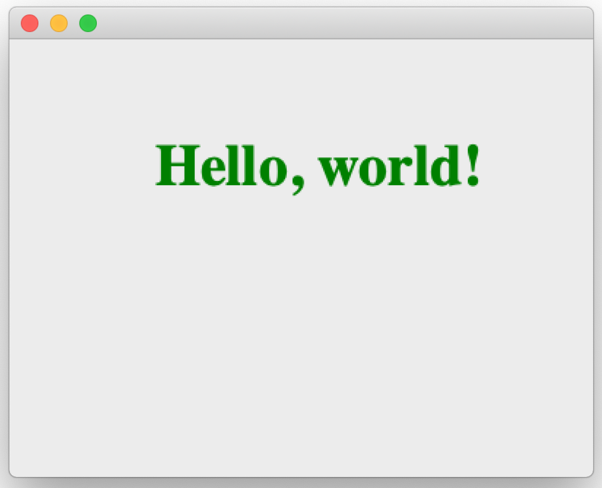

> 图173：位图文本“Hello World”示例

还有一些方法可以在指定区域内绘制文本。这里，参数定义了边界框的 x 和 y 位置以及宽度和高度。超出此框的文本将被裁剪（隐藏）。第 5 个参数标志可用于控制文本在框内的对齐方式等其他设置。

```python
painter.drawText(100, 100, 100, 100, Qt.AlignmentFlag.AlignHCenter,
                 'Hello, world!')
```

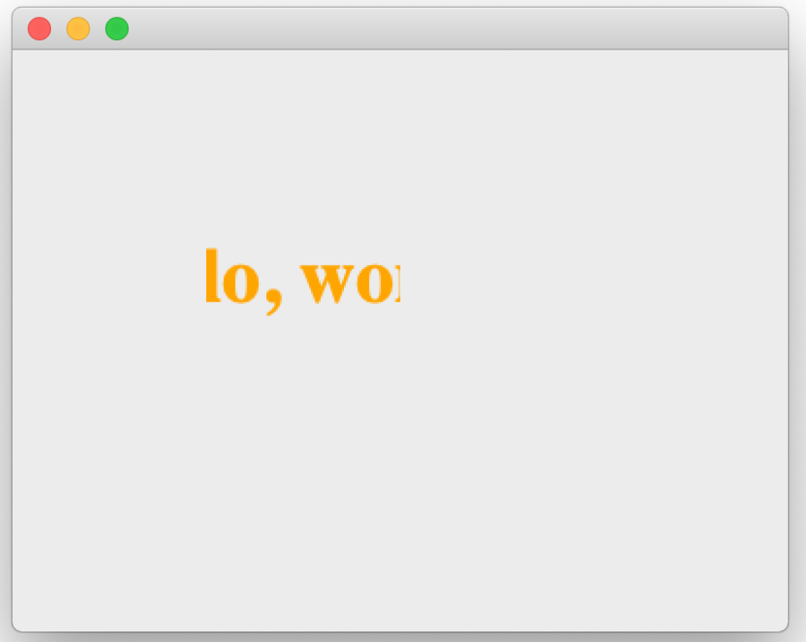

> 图174：在drawText中裁剪边界框

您可以通过在画家上设置活动字体来完全控制文本的显示。通过 `QFont` 对象设置活动字体。您还可以 [查看 QFont 文档](https://doc.qt.io/archives/qt-4.8/qfont.html) 以获取更多信息。

## 用QPainter玩点小花样

这部分内容有点复杂，所以让我们稍作休息，做点有趣的事情。到目前为止，我们一直通过程序化方式定义在 `QPixmap` 表面上执行的绘制操作。但我们同样可以根据用户输入进行绘制——例如允许用户在画布上随意涂鸦。让我们利用迄今为止学到的知识，构建一个简单的绘图应用程序。

我们可以从相同的简单应用程序框架开始，在 `MainWindow` 类中替换 `draw` 方法，添加一个`mouseMoveEvent` 处理程序。在这里，我们获取用户鼠标的当前位置，并将其绘制到画布上。

*Listing 143. bitmap/paint_start.py*

```python
import sys

from PyQt6.QtCore import Qt
from PyQt6.QtGui import QPainter, QPixmap
from PyQt6.QtWidgets import QApplication, QLabel, QMainWindow


class MainWindow(QMainWindow):
    def __init__(self):
        super().__init__()
        
        self.label = QLabel()
        self.canvas = QPixmap(400, 300)
        self.canvas.fill(Qt.GlobalColor.white)
        self.label.setPixmap(self.canvas)
        self.setCentralWidget(self.label)
        
    def mouseMoveEvent(self, e):
        pos = e.position()
        painter = QPainter(self.canvas)
        painter.drawPoint(pos.x(), pos.y())
        painter.end()
        self.label.setPixmap(self.canvas)
        
        
app = QApplication(sys.argv)
window = MainWindow()
window.show()
app.exec()
```


> 默认情况下，控件仅在按下鼠标按钮时接收鼠标移动事件，除非启用了鼠标跟踪。这可以通过 `.setMouseTracking` 方法进行配置——将该方法设置为 `True`（默认值为 `False`）将持续跟踪鼠标。

如果您保存并运行这个程序，您应该能够将鼠标移动到屏幕上并点击来绘制单个点。它应该看起来像这样——

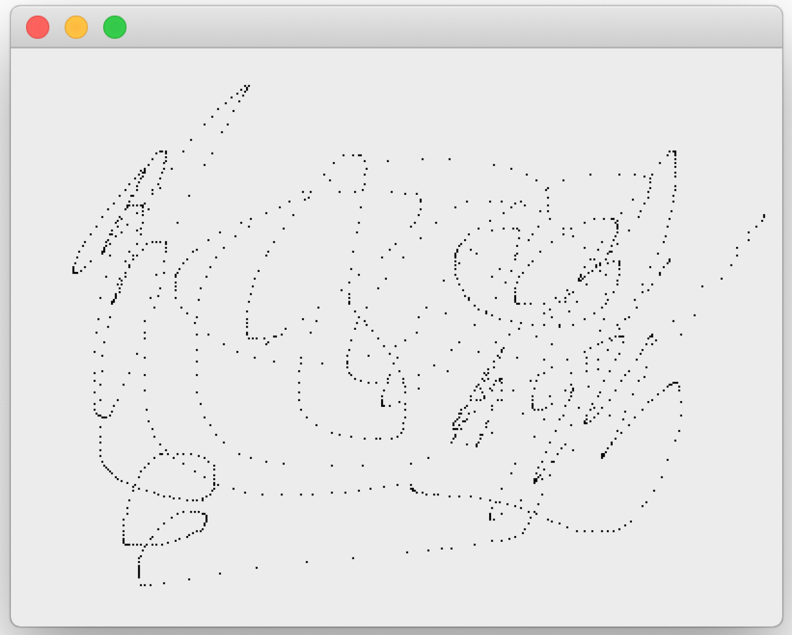

> 图175：绘制单个鼠标移动事件点

这里的问题是，当您快速移动鼠标时，它实际上会在屏幕上的不同位置之间跳跃，而不是平滑地从一个位置移动到另一个位置。鼠标移动事件（`mouseMoveEvent`）会在鼠标所在的每个位置触发，但这不足以绘制一条连续的线，除非您移动得非常缓慢。

解决这个问题的办法是画线而不是点。在每个事件中，我们只需从我们所在的位置（之前的 `.x()` 和 `.y()`）到我们现在的位置（当前的 `.x()` 和 `.y()`）画一条线。我们可以自己跟踪 `last_x` 和 `last_y` 来做到这一点。

我们还需要在释放鼠标时忘记上一个位置，否则在将鼠标在页面上移动后，我们将从该位置开始再次绘制——即无法断开线条。

*Listing 144. bitmap/paint_line.py*

```python
import sys

from PyQt6.QtCore import Qt
from PyQt6.QtGui import QPainter, QPixmap
from PyQt6.QtWidgets import QApplication, QLabel, QMainWindow


class MainWindow(QMainWindow):
    def __init__(self):
        super().__init__()
        
        self.label = QLabel()
        self.canvas = QPixmap(400, 300)
        self.canvas.fill(Qt.GlobalColor.white)
        self.label.setPixmap(self.canvas)
        self.setCentralWidget(self.label)
        
        self.last_x, self.last_y = None, None
        
    def mouseMoveEvent(self, e):
        pos = e.position()
        if self.last_x is None: # 第一个事件
            self.last_x = pos.x()
            self.last_y = pos.y()
            return # 在第一次时忽略它
        
        painter = QPainter(self.canvas)
        painter.drawLine(self.last_x, self.last_y, pos.x(), pos.y())
        painter.end()
        
        self.label.setPixmap(self.canvas)
        # 下次更新时更新源地址
        self.last_x = pos.x()
        self.last_y = pos.y()
        
    def mouseReleaseEvent(self, e):
        self.last_x = None
        self.last_y = None
        
        
app = QApplication(sys.argv)
window = MainWindow()
window.show()
app.exec()
```

如果您运行这个程序，您应该能够像预期那样在屏幕上涂鸦。

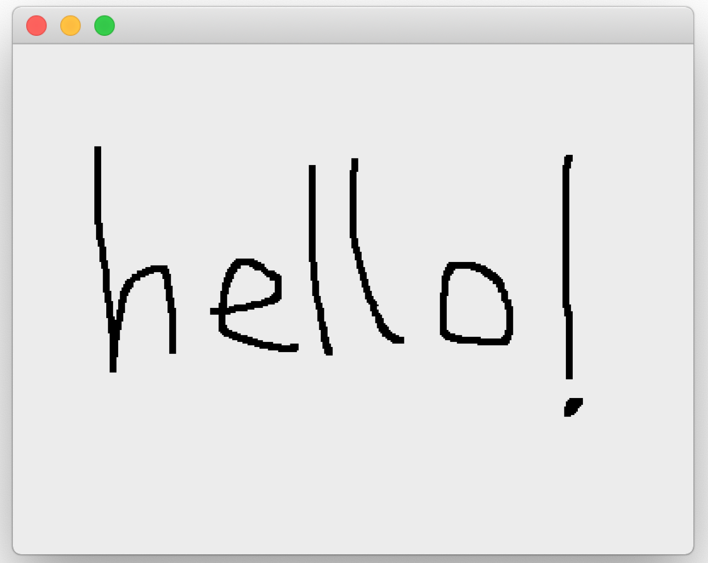

> 图176：使用鼠标进行绘图，采用连续线条。

目前效果还略显单调，因此我们添加一个简单的调色板，以便能够更改笔的颜色。

这需要进行一些重新设计，以确保鼠标位置能够被准确检测到。到目前为止，我们一直在 `QMainWindow` 上使用 `mouseMoveEvent`。当窗口中只有一个控件时，这没问题——只要您不调整窗口的大小，容器和单个嵌套控件的坐标就会对齐。但是，如果我们在布局中添加其他控件，情况就不同了—— `QLabel` 的坐标会从窗口偏移，我们就会在错误的位置绘制。然而，如果我们在布局中添加其他控件，情况就不会如此了——`QLabel` 的坐标将与窗口偏移，我们将在错误的位置绘制。

这很容易解决，只需将鼠标处理移到 `QLabel` 本身即可——它的事件坐标总是相对于自身而言的。我们将它作为一个单独的 `Canvas` 对象进行包装，该对象负责创建像素图表面，设置 x 和 y 位置，并保存当前的笔颜色（默认设置为黑色）。


> 这个独立的 `Canvas` 是一个可直接使用的绘图表面，你可以在自己的应用程序中使用它。

*Listing 145. bitmap/paint.py*

```python
import sys

from PyQt6.QtCore import QPoint, QSize, Qt
from PyQt6.QtGui import QColor, QPainter, QPen, QPixmap
from PyQt6.QtWidgets import (
QApplication,
QHBoxLayout,
QLabel,
QMainWindow,
QPushButton,
QVBoxLayout,
QWidget,
)

class Canvas(QLabel):
    def __init__(self):
        super().__init__()
        self._pixmap = QPixmap(600, 300)
        self._pixmap.fill(Qt.GlobalColor.white)
        self.setPixmap(self._pixmap)
        
        self.last_x, self.last_y = None, None
        self.pen_color = QColor("#000000")
        
    def set_pen_color(self, c):
        self.pen_color = QColor(c)
        
    def mouseMoveEvent(self, e):
        pos = e.position()
        if self.last_x is None: # 第一个事件
            self.last_x = pos.x()
            self.last_y = pos.y()
            return # 在第一次时将它忽略
        
        painter = QPainter(self._pixmap)
        p = painter.pen()
        p.setWidth(4)
        p.setColor(self.pen_color)
        painter.setPen(p)
        painter.drawLine(self.last_x, self.last_y, pos.x(), pos.y())
        painter.end()
        self.setPixmap(self._pixmap)
        
        # 下次更新时更新源地址
        self.last_x = pos.x()
        self.last_y = pos.y()
        
    def mouseReleaseEvent(self, e):
        self.last_x = None
        self.last_y = None
```

对于颜色选择，我们将基于 `QPushButton` 创建一个自定义控件。该控件接受一个颜色参数，该参数可以是 `QColor` 实例、颜色名称（“red”、black）或十六进制值。该颜色设置在控件的背景上，以便识别。我们可以使用标准的 `QPushButton.pressed` 信号将其连接到任何操作。

*Listing 146. bitmap/paint.py*

```python
COLORS = [
    # 17种底色 https://lospec.com/palette-list/17undertones
    "#000000",
    "#141923",
    "#414168",
    "#3a7fa7",
    "#35e3e3",
    "#8fd970",
    "#5ebb49",
    "#458352",
    "#dcd37b",
    "#fffee5",
    "#ffd035",
    "#cc9245",
    "#a15c3e",
    "#a42f3b",
    "#f45b7a",
    "#c24998",
    "#81588d",
    "#bcb0c2",
    "#ffffff",
]
class QPaletteButton(QPushButton):
    def __init__(self, color):
        super().__init__()
        self.setFixedSize(QSize(24, 24))
        self.color = color
        self.setStyleSheet("background-color: %s;" % color)
```

定义了这两个新部分后，我们只需遍历颜色列表，为每个颜色创建一个 `QPaletteButton`，并传递颜色即可。然后将它的 `pressed` 信号连接到画布上的 `set_pen_color` 处理程序（通过 `lambda` 间接传递额外的颜色数据），并将其添加到调色板布局中。

*Listing 147. bitmap/paint.py*

```python
class MainWindow(QMainWindow):
    def __init__(self):
        super().__init__()
        
        self.canvas = Canvas()
        
        w = QWidget()
        l = QVBoxLayout()
        w.setLayout(l)
        l.addWidget(self.canvas)
        
        palette = QHBoxLayout()
        self.add_palette_buttons(palette)
        l.addLayout(palette)
        
        self.setCentralWidget(w)
        
    def add_palette_buttons(self, layout):
        for c in COLORS:
            b = QPaletteButton(c)
            b.pressed.connect(lambda c=c: self.canvas.set_pen_color(
                c))
            layout.addWidget(b)
            
            
app = QApplication(sys.argv)
window = MainWindow()
window.show()
app.exec()
```

这将为您提供一个功能齐全的多色绘画应用程序，您可以在画布上画线并从颜色调色板中选择颜色。

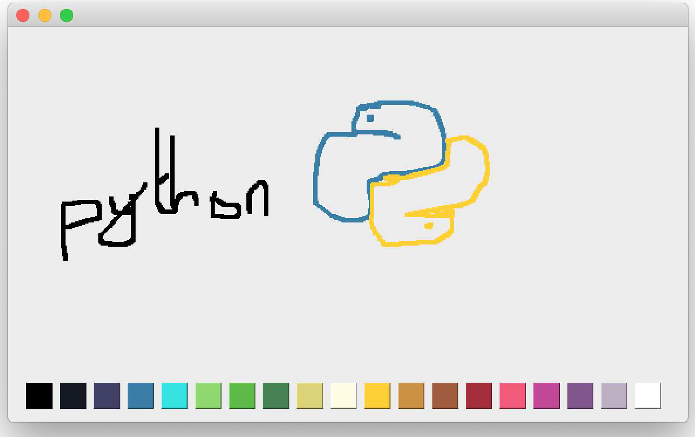

> 图177：遗憾的是，这并不能让您的画技变得优秀。

### 喷雾效果

为了增加一点趣味，您可以用以下代码替换 `mouseMoveEvent`，以使用“喷雾罐”效果代替直线绘制。这是通过使用 `random.gauss` 生成当前鼠标位置周围的一系列正态分布点来模拟的，然后我们使用 `drawPoint` 绘制这些点。

*Listing 148. bitmap/spraypaint.py*

```python
import random
import sys

from PyQt6.QtCore import QSize, Qt
from PyQt6.QtGui import QColor, QPainter, QPen, QPixmap
from PyQt6.QtWidgets import (
    QApplication,
    QHBoxLayout,
    QLabel,
    QMainWindow,
    QPushButton,
    QVBoxLayout,
    QWidget,
)
SPRAY_PARTICLES = 100
SPRAY_DIAMETER = 10

class Canvas(QLabel):
    def __init__(self):
        super().__init__()
        self._pixmap = QPixmap(600, 300)
        self._pixmap.fill(Qt.GlobalColor.white)
        self.setPixmap(self._pixmap)
        
        self.pen_color = QColor("#000000")
        
    def set_pen_color(self, c):
        self.pen_color = QColor(c)
        
    def mouseMoveEvent(self, e):
        pos = e.position()
        painter = QPainter(self._pixmap)
        p = painter.pen()
        p.setWidth(1)
        p.setColor(self.pen_color)
        painter.setPen(p)
        
        for n in range(SPRAY_PARTICLES):
            xo = random.gauss(0, SPRAY_DIAMETER)
            yo = random.gauss(0, SPRAY_DIAMETER)
            painter.drawPoint(pos.x() + xo, pos.y() + yo)
            
        self.setPixmap(self._pixmap)
```


> 对于喷雾罐，我们无需追踪上一次的位置，因为我们总是围绕当前点进行喷涂。

我们在文件顶部定义 `SPRAY_PARTICLES` 和 `SPRAY_DIAMETER` 变量，并导入随机标准库模块。下图显示了使用以下设置时的喷雾行为：

```python
import random

SPRAY_PARTICLES = 100
SPRAY_DIAMETER = 10
```

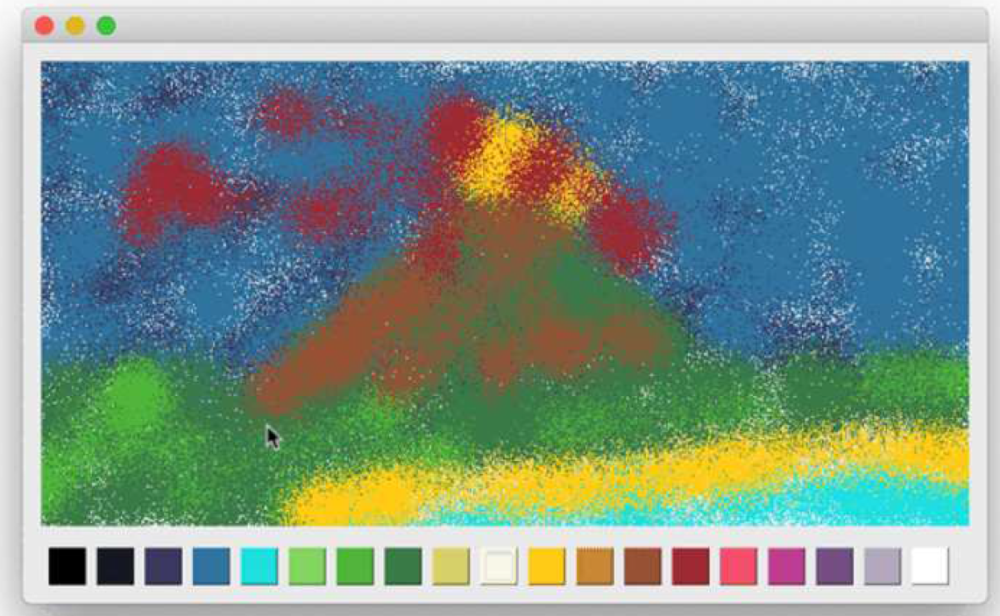

> 图178：请叫我毕加索

如果您想挑战一下自己，可以尝试添加一个额外的按钮来在绘制和喷涂模式之间切换，或者添加一个输入控件来定义笔刷/喷涂的直径。


> 要获取一个使用 Python 和 Qt 编写的完整功能绘图应用程序，请访问我们在 GitHub 上“Minute apps”仓库中的 [Piecasso](https://github.com/learnpyqt/15-minute-apps/tree/master/paint)。

通过本介绍，您应该已经对 `QPainter` 的功能有了一个大致的了解。如上所述，该系统是所有控件绘制的基础。如果您想进一步了解，可以查看控件的 `.paint()` 方法，该方法接收一个 `QPainter` 实例，以允许控件在自身上进行绘制。您在这里学到的相同方法可以在 `.paint()` 中使用，以绘制一些基本的自定义控件。
