---
prev:
  text: '21. Qt 中的位图图形'
  link: '/CustomWidgets/21'
next:
  text: '23. 在 Qt Designer 中使用自定义控件'
  link: '/CustomWidgets/23'
---

## 22. 创建自定义控件

在上一章中，我们介绍了 `QPainter`，并学习了一些基本的位图绘制操作，您可以使用这些操作在 `QPainter` 表面（例如 `QPixmap`）上绘制点、线、矩形和圆。使用 `QPainter` 在表面上绘制图形的过程实际上是 Qt 中所有控件绘制的基础。现在您已经了解如何使用 `QPainter`，您知道如何绘制自己的自定义控件了！在本章中，我们将运用迄今为止所学到的知识，构建一个全新的自定义控件。在本章中，我们将运用迄今为止所学到的知识，构建一个全新的自定义控件——一个可自定义的带刻度盘控制的 `PowerBar` 仪表。

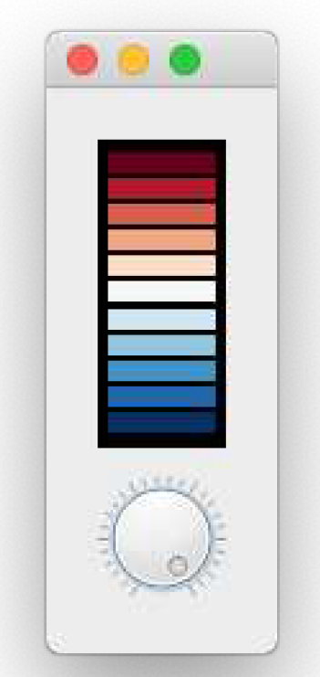

> 图179： `PowerBar` 仪表

该控件实际上是一个复合控件和自定义控件的混合体，因为我们使用内置的 Qt `QDial` 组件来绘制拨盘，而电源条则由我们自己绘制。然后，我们将这两个部分组合到一个父控件中 ，该控件可以无缝地放入任何应用程序中，而无需了解其组合方式。最终的控件提供了常见的`QAbstractSlider` 接口，并添加了一些用于配置条形显示的功能。

按照这个示例，您将能够构建自己的自定义控件——无论它们是内置控件的组合，还是完全新颖的自绘制控件。

## 开始

正如我们之前所看到的，复合控件只是应用了布局的控件，其本身包含 >1 个其他控件。最终的“控件”可以像其他控件一样使用，内部结构可以根据需要隐藏或显示。

以下是我们 PowerBar 控件的轮廓——我们将从这个轮廓草稿开始逐步构建我们的自定义控件。

*Listing 149. custom-widgets/stub.py*

```python
import sys

from PyQt6 import QtCore, QtGui, QtWidgets
from PyQt6.QtCore import Qt


class _Bar(QtWidgets.QWidget):
    pass

class PowerBar(QtWidgets.QWidget):
    """
    用于显示电源条和拨号盘的自定义 Qt 控件。
    演示复合和自定义绘制的控件。
    """
    
    def __init__(self, parent=None, steps=5):
        super().__init__(parent)
        
        layout = QtWidgets.QVBoxLayout()
        self._bar = _Bar()
        layout.addWidget(self._bar)
        
        self._dial = QtWidgets.QDial()
        layout.addWidget(self._dial)
        
        self.setLayout(layout)
        
        
app = QtWidgets.QApplication(sys.argv)
volume = PowerBar()
volume.show()
app.exec()
```

这只是定义了我们的自定义电源条在`_Bar` 对象中定义——这里只是未更改的 `QWidget` 子类。`PowerBar` 控件（完整的控件）结合了这一点，使用 `QVBoxLayout` 与内置的 `QDial` 一起显示它们。


> 我们无需创建 `QMainWindow`，因为任何没有父控件的控件都是一个独立的窗口。我们的自定义 `PowerBar` 控件将显示为一个普通的窗口。

您可以随时运行此文件来查看控件的运行情况。现在运行它，您应该会看到如下内容：

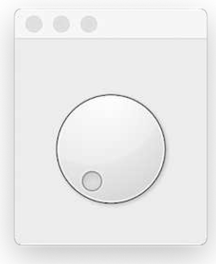

> 图180：PowerBar 旋钮。

如果将窗口向下拉伸，您会发现拨号盘上方比下方有更多空间——这是由我们的（目前不可见的）`_Bar` 控件占用的。

## `paintEvent`

`paintEvent` 处理程序是 PyQt6 中所有控件绘制的核心。控件的每次完整和部分重绘都是通过 `paintEvent` 触发的，该事件由控件滑块处理以绘制自身。`paintEvent` 可以由以下因素触发：

- 调用了 [repaint()](https://doc.qt.io/qt-5/qwidget.html#repaint) 或 [update()](https://doc.qt.io/qt-5/qwidget.html#update)
- 控件被遮挡，现在已露出
- 控件已调整大小

——但还有许多其他原因也会导致这种情况。重要的是，当 `paintEvent` 被触发时，您的控件能够重新绘制它。

如果控件足够简单（就像我们的控件一样），通常只需在发生任何变化时重新绘制整个控件即可。但对于更复杂的控件，这种方法效率非常低。对于这些情况，`paintEvent` 包括需要更新的特定区域。我们将在后面更复杂的示例中使用此方法。

现在，我们将做一件非常简单的事情，用一种颜色填充整个控件。这样，我们就可以看到要绘制条形图的区域了。请您将以下代码添加到 `_Bar` 类中。

*Listing 150. custom-widgets/powerbar_1.py*

```python
    def paintEvent(self, e):
        painter = QtGui.QPainter(self)
        brush = QtGui.QBrush()
        brush.setColor(QtGui.QColor("black"))
        brush.setStyle(Qt.BrushStyle.SolidPattern)
        rect = QtCore.QRect(
            0,
            0,
            painter.device().width(),
            painter.device().height(),
        )
        painter.fillRect(rect, brush)
```

## 定位

现在，我们可以看到 `_Bar` 控件，可以调整其位置和大小。如果拖动窗口形状，您应该会看到两个控件改变形状以适应可用空间。这是我们想要的效果，但 `QDial` 也垂直扩展得比应该的更多，留出了我们可以用来放置条形图的空白空间。

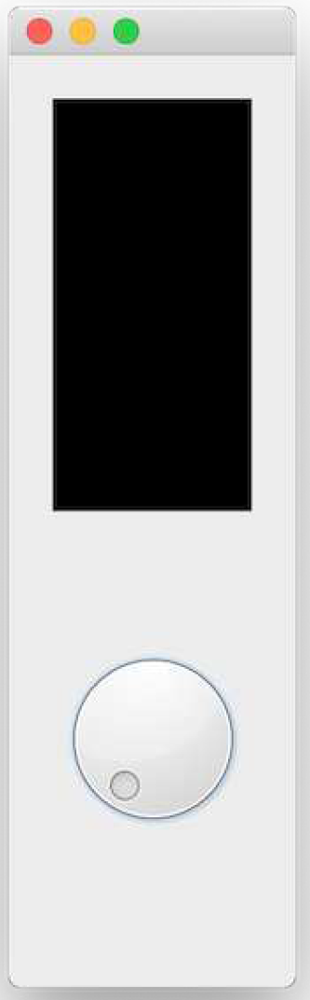

> 图181：PowerBar 伸展并留出了空间

我们可以对 `_Bar` 控件使用 `setSizePolicy`，以确保它尽可能地扩展。通过使用 `QSizePolicy.MinimumExpanding`，提供的 `sizeHint` 将被用作最小值，控件将尽可能地扩展。

*Listing 151. custom-widgets/powerbar_2.py*

```python
class _Bar(QtWidgets.QWidget):
    def __init__(self):
        super().__init__()
        
        self.setSizePolicy(
            QtWidgets.QSizePolicy.Policy.MinimumExpanding,
            QtWidgets.QSizePolicy.Policy.MinimumExpanding,
        )
        
    def sizeHint(self):
        return QtCore.QSize(40, 120)
    
    def paintEvent(self, e):
        painter = QtGui.QPainter(self)
        brush = QtGui.QBrush()
        brush.setColor(QtGui.QColor("black"))
        brush.setStyle(Qt.BrushStyle.SolidPattern)
        rect = QtCore.QRect(
            0,
            0,
            painter.device().width(),
            painter.device().height(),
        )
        painter.fillRect(rect, brush)
```

虽然 `QDial` 控件的大小调整还有些不理想，但我们的条形图现在可以扩展到填满所有可用空间了。

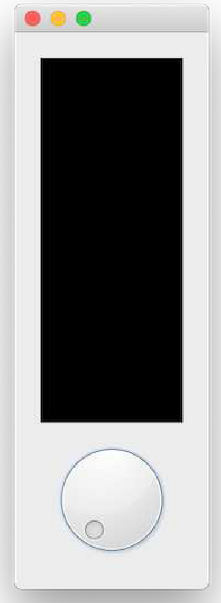

> 图182：PowerBar 的政策设置为 QSizePolicy.MinimumExpanding。

定位完成后，我们现在可以继续定义绘制方法，在控件顶部（目前为黑色）绘制 PowerBar 计量表。

## 更新显示

现在，我们的画布已经完全填充为黑色，接下来，我们将使用 `QPainter` 绘制命令在控件上实际绘制一些内容。

在开始绘制条形图之前，我们需要进行一些测试，以确保我们可以使用刻度盘的值更新显示。请将以下代码添加到 `_Bar.paintEvent` 中：

*Listing 152. custom-widgets/powerbar_3.py*

```python
    def paintEvent(self, e):
        painter = QtGui.QPainter(self)
        
        brush = QtGui.QBrush()
        brush.setColor(QtGui.QColor("black"))
        brush.setStyle(Qt.BrushStyle.SolidPattern)
        rect = QtCore.QRect(
            0,
            0,
            painter.device().width(),
            painter.device().height(),
        )
        painter.fillRect(rect, brush)
        
        # 获取当前状态。
        dial = self.parent()._dial
        vmin, vmax = dial.minimum(), dial.maximum()
        value = dial.value()
        
        pen = painter.pen()
        pen.setColor(QtGui.QColor("red"))
        painter.setPen(pen)
        
        font = painter.font()
        font.setFamily("Times")
        font.setPointSize(18)
        painter.setFont(font)
        
        painter.drawText(
            25, 25, "{}-->{}<--{}".format(vmin, value, vmax)
        )
        painter.end()
```

这会像之前一样绘制黑色背景，然后使用 `.parent()` 访问我们的父级 `PowerBar` 控件，并通过 `_dial` 访问 `QDial`。在那里我们可以获得当前值以及允许的最小值和最大值。最后，我们使用绘图器绘制这些值，就像之前部分一样。


> 我们在这里将当前值、最小值和最大值的处理交给 `QDial`，但我们也可以自己存储这些值，并使用来自/发往拨盘的信号来保持同步。

运行这个程序，转动旋钮，然后……什么也没发生。尽管我们已经定义了 `paintEvent` 处理程序，但当旋钮发生变化时，我们并没有触发重新绘制。


> 您可以通过调整窗口大小强制刷新，一旦您这样做，您应该会看到文本出现。很巧妙，但用户体验很糟糕——“只需调整应用程序大小即可查看设置！”

要解决这个问题，我们需要将 `_Bar` 控件与 `dial` 上的值变化挂钩，以响应地重新绘制自身。我们可以使用 `QDial.valueChanged` 信号来做到这一点，将它与一个自定义槽方法挂钩，该方法调用 `.refresh()`，从而触发完全重绘。

请您将以下方法添加到 `_Bar` 控件中

*Listing 153. custom-widgets/powerbar_4.py*

```python
    def _trigger_refresh(self):
        self.update()
```

…并将以下内容添加到父级 `PowerBar` 控件的 `__init__` 块中。

*Listing 154. custom-widgets/powerbar_4.py*

```python
        self._dial = QtWidgets.QDial()
        self._dial.valueChanged.connect(self._bar._trigger_refresh)
        layout.addWidget(self._dial)
```

如果您现在重新运行代码，您应该会看到显示屏会自动更新，当您转动旋钮时（用鼠标点击并拖动）当前值将以文本形式显示。

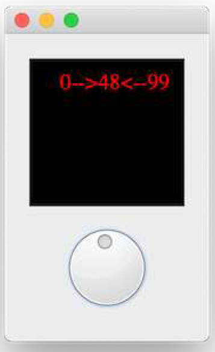

> 图183：PowerBar 以文本形式显示当前值

## 绘制条

现在我们已经实现了显示屏的更新并显示指针的当前值，我们可以继续绘制实际的条形显示。这部分稍微复杂一些，需要一些数学计算来确定条形的位置，但我们会一步步讲解，以便大家明白其中的原理。

下图显示了我们的目标——一系列 N 个框，从控件边缘内嵌，之间留有空格。

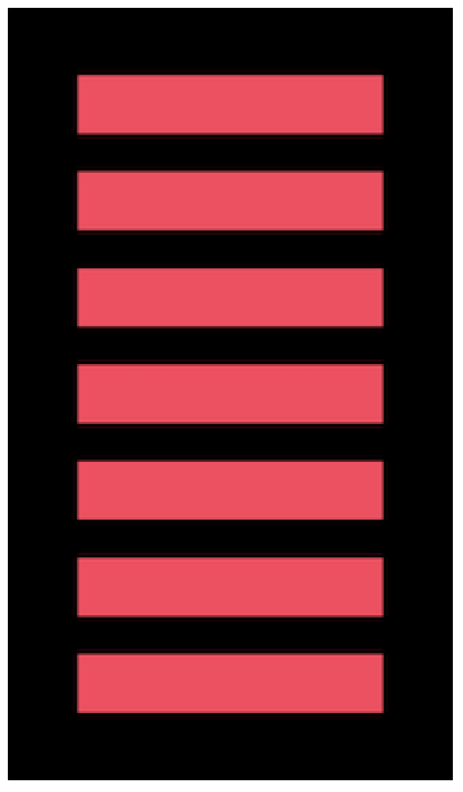

> 图184：我们正在努力实现的条形图分段及布局方案

### 计算要绘制的内容

要绘制的框的数量由当前值决定——以及它在 `QDial` 配置的最小值和最大值之间的位置。我们在上面的示例中已经有了这些信息。

```python
dial = self.parent()._dial
vmin, vmax = dial.minimum(), dial.maximum()
value = dial.value()
```

如果值位于 `vmin` 和 `vmax` 的中间，则我们希望绘制一半的框。（如果总共有4个框，则绘制2个）。如果值为 `vmax` ，则我们希望绘制所有框。

要实现这一点，我们首先将 `value` 转换为0到1之间的数值，其中 `0 = vmin`，`1 = vmax`。我们首先从值中减去 `vmin`，以将可能 `value` 的范围调整为从零开始——即从 `vmin…vmax` 调整为 `0…(vmax-vmin)`。将此值除以 `vmax-vmin` （新的最大值）即可得到一个介于0和1之间的数值。

然后，将这个值（下文称为 `pc`）乘以步长，即可得到一个介于 0 和 5 之间的数值——即需要绘制的方块数量。

```python
pc = (value - vmin) / (vmax - vmin)
n_steps_to_draw = int(pc * 5)
```

我们将结果包装为整数以将其转换为整数（向下取整）以去除任何部分的框。

请您在您的绘制事件中更新 `drawText` 方法以写出这个数字。

*Listing 155. custom-widgets/powerbar_5.py*

```python
    def paintEvent(self, e):
        painter = QtGui.QPainter(self)
        
        brush = QtGui.QBrush()
        brush.setColor(QtGui.QColor("black"))
        brush.setStyle(Qt.BrushStyle.SolidPattern)
        rect = QtCore.QRect(
            0,
            0,
            painter.device().width(),
            painter.device().height(),
        )
        painter.fillRect(rect, brush)
        
        # 获取当前状态。
        dial = self.parent()._dial
        vmin, vmax = dial.minimum(), dial.maximum()
        value = dial.value()
        
        pen = painter.pen()
        pen.setColor(QtGui.QColor("red"))
        painter.setPen(pen)
        
        font = painter.font()
        font.setFamily("Times")
        font.setPointSize(18)
        painter.setFont(font)
        
        pc = (value - vmin) / (vmax - vmin)
        n_steps_to_draw = int(pc * 5)
        painter.drawText(25, 25, "{}".format(n_steps_to_draw))
        painter.end()
```

当您转动旋钮时，现在您将看到一个介于0和5之间的数字。

### 绘制框体

接下来，我们希望将这个数字 0…5 转换为画布上绘制的条形数量。首先，删除 `drawText`、字体和画笔设置，因为我们不再需要这些。

为了准确绘制，我们需要知道画布的大小，即控件的大小。我们还将在边缘添加一些填充，以便在黑色背景上为块的边缘留出空间。


> `QPainter` 中的所有测量单位均为像素。

*Listing 156. custom-widgets/powerbar_6.py*

```python
        padding = 5
        # 定义我们的画布.
        d_height = painter.device().height() - (padding * 2)
        d_width = painter.device().width() - (padding * 2)
```

我们获取高度和宽度，然后从每个值中减去 `2 * padding` ——这里是 2 倍，因为我们同时对左右（以及上下）边缘进行填充。这样就得到了最终的有效画布区域，分别存储在 `d_height` 和 `d_width` 中。

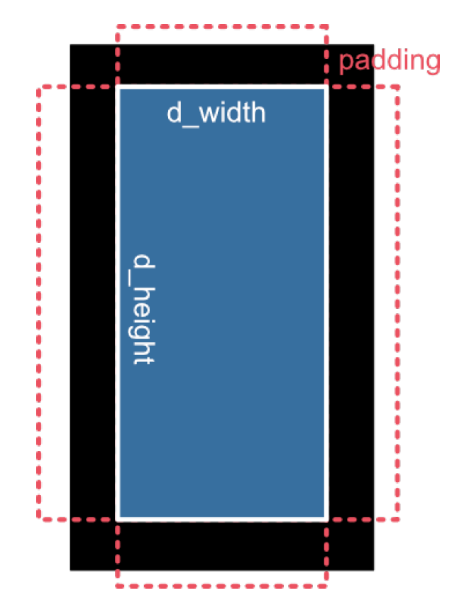

> 图185：布局外部的填充部分

我们需要将 `d_height` 分成5等份，每份对应一个块——我们可以通过`d_height / 5`来计算这个高度。此外，由于我们希望在块之间留有间隙，我们需要计算这个步长中有多少被间隙（顶部和底部，因此减半）占用，有多少是实际的块。

*Listing 157. custom-widgets/powerbar_6.py*

```python
        step_size = d_height / 5
        bar_height = step_size * 0.6
```

这些值是我们绘制画布上方块所需的全部信息。为此，我们使用 `range` 函数从 0 开始计数，直到步数减 1，然后为每个方块绘制一个 `fillRect` 区域。

*Listing 158. custom-widgets/powerbar_6.py*

```python
        brush.setColor(QtGui.QColor("red"))

        for n in range(n_steps_to_draw):
            ypos = (1 + n) * step_size
            rect = QtCore.QRect(
                padding,
                padding + d_height - int(ypos),
                d_width,
                int(bar_height),
            )
            painter.fillRect(rect, brush)
```

在块的放置计算中涉及大量内容，因此我们先逐一分析这些步骤。

用于绘制填充矩形的 `fillRect` 被定义为一个 `QRect` 对象，我们依次向其传入左侧 x 坐标、顶部 y 坐标、宽度和高度。

宽度是整个画布宽度减去填充，我们之前已经计算并存储在 `d_width` 中。左侧 x 同样只是控件左侧的 `padding` 的值（5px）。

我们计算的栏杆高度 `bar_height` 为 `step_size` 的 0.6 倍。

这使得参数  `d_height - ((1 + n) * step_size)` 确定要绘制的矩形的顶部 y 位置。这是在绘制方块时唯一会变化的计算。


> 请记住，`QPainter` 中的 y 坐标从顶部开始，并向下增加。这意味着在 `d_height` 处绘制将对应于画布的最底部。


> 要在最底部绘制一个块，我们必须从 `d_height-step_size` 开始绘制，即向上绘制一个块以留出空间向下绘制。

在我们的条计量器中，我们依次绘制方块，从底部开始并向上绘制。因此，我们的第一个方块必须放置在 `d_height-step_size` 处，而第二个方块放置在 `d_height-(step_size*2)` 处。我们的循环从 0 开始向上迭代，因此我们可以使用以下公式实现这一点：

```python
ypos = (1 + n) * step_size
y = d_height - ypos
```

这将生成以下布局。


在下图中，当前的n值已被打印在框上，并且一个蓝色的框已被绘制在完整的 `step_size` 周围，这样您可以看到填充和间隔符的实际效果。

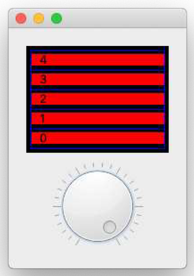

> 图186：显示每个段落所占用的整个区域（蓝色部分）

将以上内容整合在一起，就会得到以下代码，运行后将生成一个带红色块的工作电源条控件。您可以来回拖动滚轮，条形将随之上下移动。

*Listing 159. custom-widgets/powerbar_6b.py*

```python
import sys

from PyQt6 import QtCore, QtGui, QtWidgets
from PyQt6.QtCore import Qt


class _Bar(QtWidgets.QWidget):
    def __init__(self):
        super().__init__()
        
        self.setSizePolicy(
            QtWidgets.QSizePolicy.Policy.MinimumExpanding,
            QtWidgets.QSizePolicy.Policy.MinimumExpanding,
        )
        
    def sizeHint(self):
        return QtCore.QSize(40, 120)
    
    def paintEvent(self, e):
        painter = QtGui.QPainter(self)
        
        brush = QtGui.QBrush()
        brush.setColor(QtGui.QColor("black"))
        brush.setStyle(Qt.BrushStyle.SolidPattern)
        rect = QtCore.QRect(
            0,
            0,
            painter.device().width(),
            painter.device().height(),
        )
        painter.fillRect(rect, brush)
        
        # 获取当前状态.
        dial = self.parent()._dial
        vmin, vmax = dial.minimum(), dial.maximum()
        value = dial.value()
        
        pc = (value - vmin) / (vmax - vmin)
        n_steps_to_draw = int(pc * 5)
        
        padding = 5
        
        # 定义我们的画布.
        d_height = painter.device().height() - (padding * 2)
        d_width = painter.device().width() - (padding * 2)
        
        step_size = d_height / 5
        bar_height = step_size * 0.6
        
        brush.setColor(QtGui.QColor("red"))
        
        for n in range(n_steps_to_draw):
            ypos = (1 + n) * step_size
            rect = QtCore.QRect(
                padding,
                padding + d_height - int(ypos),
                d_width,
                int(bar_height),
            )
            painter.fillRect(rect, brush)
            painter.end()
            
    def _trigger_refresh(self):
        self.update()
class PowerBar(QtWidgets.QWidget):
    """
    自定义 Qt 控件，用于显示电源条和拨盘。
    演示复合和自定义绘制的控件.
    """
    
    def __init__(self, parent=None, steps=5):
        super().__init__(parent)
        
        layout = QtWidgets.QVBoxLayout()
        self._bar = _Bar()
        layout.addWidget(self._bar)
        
        self._dial = QtWidgets.QDial()
        self._dial.valueChanged.connect(self._bar._trigger_refresh)
        layout.addWidget(self._dial)
        
        self.setLayout(layout)
        
        
app = QtWidgets.QApplication(sys.argv)
volume = PowerBar()
volume.show()
app.exec()
```

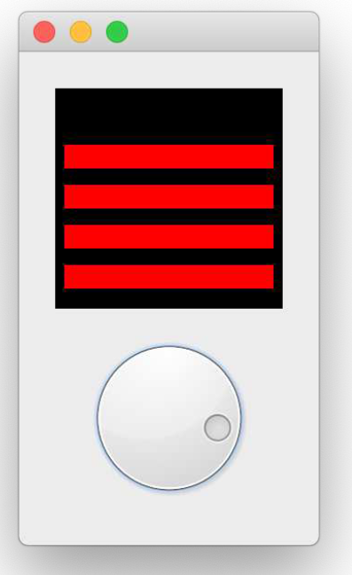

> 图187：基础版全功能PowerBar

这已经可以完成工作了，但我们可以更进一步，提供更多自定义选项，添加一些用户体验改进，并改进与我们的控件配合使用的 API。

## 自定义条

现在，我们已经拥有了一个可通过旋钮控制的电源条。但在创建控件时，最好提供一些选项来配置控件的行为，以使其更加灵活。在本部分中，我们将添加一些方法来设置可自定义的分段数、颜色、填充和间距。首先，我们需要创建一个可自定义的电源条。

我们将提供定制化的元素包括——

| 选项              | 描述                                                    |
| ----------------- | ------------------------------------------------------- |
| 条数              | 控件上显示多少个条？                                    |
| 颜色              | 每个条的颜色各不相同                                    |
| 背景色            | 绘图画布的颜色（默认黑色）                              |
| 填充              | 控件边缘周围的空间，在条和画布边缘之间                  |
| 条高度 / 条百分比 | 条中实心部分的比例（0…1）（其余部分为相邻条之间的间隔） |

我们可以将这些属性存储在 `_bar` 对象上，并在 `paintEvent` 方法中使用它们来更改其行为。

`_Bar.__init__` 已更新，可接受初始参数，用于指定条形图的条数（作为整数）或条形图的颜色（作为 `QColor` 列表、十六进制值或名称）。如果提供数字，所有条形图将被涂成红色。如果提供颜色列表，条形图的数量将根据颜色列表的长度确定。默认值为 `self._bar_solid_colors`。如果提供数字，所有条形将被设置为红色。如果提供颜色列表，条形数量将根据颜色列表的长度确定。`self._bar_solid_percent`、`self._background_color`、`self._padding` 的默认值也已设置。

*Listing 160. custom-widgets/powerbar_7.py*

```python
class _Bar(QtWidgets.QWidget):
    def __init__(self, steps):
        super().__init__()
        self.setSizePolicy(
            QtWidgets.QSizePolicy.Policy.MinimumExpanding,
            QtWidgets.QSizePolicy.Policy.MinimumExpanding,
        )
        
        if isinstance(steps, list):
            # 颜色列表。
            self.n_steps = len(steps)
            self.steps = steps
            
        elif isinstance(steps, int):
            # 条数，默认颜色为红色。
            self.n_steps = steps
            self.steps = ["red"] * steps
            
        else:
            raise TypeError("steps must be a list or int")
            
        self._bar_solid_percent = 0.8
        self._background_color = QtGui.QColor("black")
        self._padding = 4 # 边缘周围有n像素的间隙。
```

同样，我们更新 `PowerBar.__init__` 以接受 `steps` 参数，并将其传递下去。

*Listing 161. custom-widgets/powerbar_7.py*

```python
class PowerBar(QtWidgets.QWidget):
    """
    自定义 Qt 控件，用于显示电源条和拨盘。
    演示复合和自定义绘制的控件.
    """
    def __init__(self, parent=None, steps=5):
        super().__init__(parent)
        
        layout = QtWidgets.QVBoxLayout()
        self._bar = _Bar(steps)
        
        layout.addWidget(self._bar)
        
        self._dial = QtWidgets.QDial()
        self._dial.valueChanged.connect(self._bar._trigger_refresh)
        layout.addWidget(self._dial)
        
        self.setLayout(layout)
```

现在我们已经准备好参数来更新 `paintEvent` 方法。修改后的代码如下所示。

*Listing 162. custom-widgets/powerbar_7.py*

```python
    def paintEvent(self, e):
        painter = QtGui.QPainter(self)
        
        brush = QtGui.QBrush()
        brush.setColor(self._background_color)
        brush.setStyle(Qt.BrushStyle.SolidPattern)
        rect = QtCore.QRect(
            0,
            0,
            painter.device().width(),
            painter.device().height(),
        )
        painter.fillRect(rect, brush)
        
        # 获取当前状态.
        dial = self.parent()._dial
        vmin, vmax = dial.minimum(), dial.maximum()
        value = dial.value()
        
        # 定义我们的画布.
        d_height = painter.device().height() - (self._padding * 2)
        d_width = painter.device().width() - (self._padding * 2)
        
        # 绘制条.
        step_size = d_height / self.n_steps
        bar_height = step_size * self._bar_solid_percent
        
        # 根据范围内的值计算y轴停止位置.
        pc = (value - vmin) / (vmax - vmin)
        n_steps_to_draw = int(pc * self.n_steps)
        
        for n in range(n_steps_to_draw):
            brush.setColor(QtGui.QColor(self.steps[n]))
            ypos = (1 + n) * step_size
            rect = QtCore.QRect(
                self._padding,
                self._padding + d_height - int(ypos),
                d_width,
                int(bar_height),
            )
            painter.fillRect(rect, brush)
            
         painter.end()
```

现在您可以尝试为 `PowerBar` 的 `__init__` 方法传入不同的值，例如增加条数或提供颜色列表。以下是一些示例：


> 一个不错的十六进制颜色调色板来源是 [Bokeh库](https://github.com/bokeh/bokeh/blob/master/bokeh/palettes.py)。

```python
PowerBar(10)
PowerBar(3)
PowerBar(["#5e4fa2", "#3288bd", "#66c2a5", "#abdda4", "#e6f598",
"#ffffbf", "#fee08b", "#fdae61", "#f46d43", "#d53e4f", "#9e0142"])
PowerBar(["#a63603", "#e6550d", "#fd8d3c", "#fdae6b", "#fdd0a2",
"#feedde"])
```

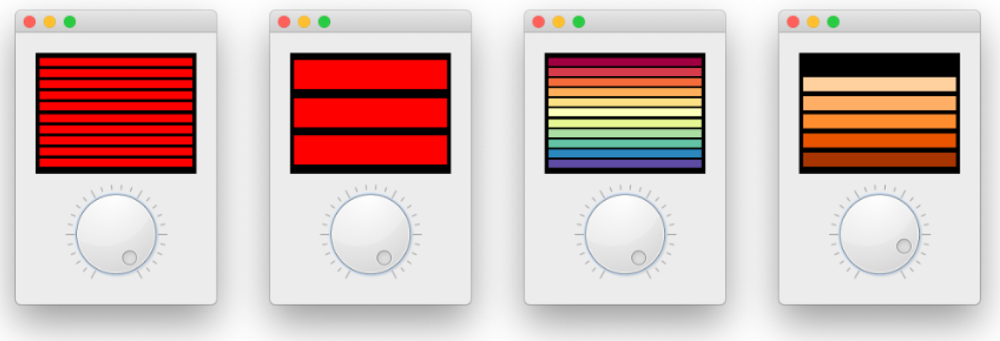

> 图188：一些PowerBar示例

您可以通过修改变量（例如：`self._bar_solid_percent`）来调整填充设置，但提供专门的方法来设置这些参数会更方便。


> 我们遵循 Qt 标准，使用驼峰式命名法为这些外部方法命名，以与从 `QDial` 继承的其他方法保持一致。

*Listing 163. custom-widgets/powerbar_8.py*

```python
    def setColor(self, color):
        self._bar.steps = [color] * self._bar.n_steps
        self._bar.update()
        
    def setColors(self, colors):
        self._bar.n_steps = len(colors)
        self._bar.steps = colors
        self._bar.update()
        
    def setBarPadding(self, i):
        self._bar._padding = int(i)
        self._bar.update()
        
    def setBarSolidPercent(self, f):
        self._bar._bar_solid_percent = float(f)
        self._bar.update()
        
    def setBackgroundColor(self, color):
        self._bar._background_color = QtGui.QColor(color)
        self._bar.update()
```

在每种情况下，我们都设置了 `_bar` 对象上的私有变量，然后调用 `_bar.update()` 来触发控件的重绘。该方法支持将颜色更改为单一颜色，或更新颜色列表——设置颜色列表也可用于更改条形图的数量。


> 目前没有方法可以设置条数，因为扩展颜色列表会比较复杂。不过您可以尝试自己添加！

以下是一个示例，使用25像素的填充、实心条形图和灰色背景。

```python
bar = PowerBar(["#49006a", "#7a0177", "#ae017e", "#dd3497", "#f768a1",
"#fa9fb5", "#fcc5c0", "#fde0dd", "#fff7f3"])
bar.setBarPadding(2)
bar.setBarSolidPercent(0.9)
bar.setBackgroundColor('gray')
```

使用这些设置，您将获得以下结果。

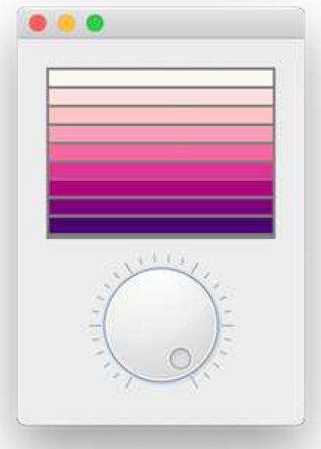

> 图189：配置PowerBar

### 添加 QAbstractSlider 接口

我们添加了用于配置电源条行为的方法。但我们目前无法从控件中配置标准 `QDial` 方法，例如设置最小值、最大值或步长。我们可以处理并为所有这些添加包装方法，但很快就会变得非常繁琐。

```python
# 单个包装的示例，我们需要30多个这样的包装.
def setNotchesVisible(self, b):
    return self._dial.setNotchesVisible(b)
```

相反，我们可以在外部控件上添加一个小处理程序，以自动查找 `QDial` 实例上的方法（或属性），如果它们不直接存在于我们的类中。这样，我们就可以实现自己的方法，同时仍然可以免费获得 `QAbstractSlider` 的所有优点。

包装器如下所示，通过自定义的 `__getattr__` 方法实现。

*Listing 164. custom-widgets/powerbar_8.py*

```python
    def __getattr__(self, name):
        if name in self.__dict__:
            return self[name]
        
        try:
            return getattr(self._dial, name)
        except AttributeError:
            raise AttributeError(
                "'{}' object has no attribute '{}'".format(
                    self.__class__.__name__, name
                )
            )
```

访问属性（或方法）时——例如，当我们调用`PowerBar.setNotchesVisible(true)` 时，Python 在内部使用 `__getattr__` 从当前对象获取属性。该处理程序通过对象字典 `self.__dict__` 完成此操作。我们已覆盖此方法，以提供自定义处理逻辑。

现在，当我们调用 `PowerBar.setNotchesVisible(true)` 时，这个处理程序首先检查当前对象（一个 `PowerBar` 实例）是否存在 `.setNotchesVisible` 方法，如果存在，则使用它。如果不存在，它会调用 `self._dial` 的 `getattr()` 方法，而不是返回在那里找到的内容。这使我们能够从自定义 `PowerBar` 控件访问 `QDial` 的所有方法。这样，我们就可以从自定义的`PowerBar`控件访问 `QDial` 的所有方法了。

如果 `QDial` 也没有该属性，并引发 `AttributeError`，我们将捕获该错误，并从我们的自定义控件中再次引发该错误，因为该错误属于该控件。


> 这适用于任何属性或方法，包括信号。因此，标准 `QDial` 信号（如 `.valueChanged`）也可用。

由于这些更改，我们还可以简化 `paintEvent` 中的代码，直接从 `.parent()` 获取当前状态，而不是通过 `.parent()._dial`。这不会改变任何行为，但可以使代码更加易读。

*Listing 165. custom-widgets/powerbar_8.py*

```python
    def paintEvent(self, e):
        painter = QtGui.QPainter(self)
        
        brush = QtGui.QBrush()
        brush.setColor(self._background_color)
        brush.setStyle(Qt.BrushStyle.SolidPattern)
        rect = QtCore.QRect(
            0,
            0,
            painter.device().width(),
            painter.device().height(),
        )
        painter.fillRect(rect, brush)
        
        # 获取当前状态.
        parent = self.parent()
        vmin, vmax = parent.minimum(), parent.maximum()
        value = parent.value()
        
        # 定义我们的画布.
        d_height = painter.device().height() - (self._padding * 2)
        d_width = painter.device().width() - (self._padding * 2)
        
        # 绘制条.
        step_size = d_height / self.n_steps
        bar_height = step_size * self._bar_solid_percent
        
        # 根据范围内的值计算y轴停止位置.
        pc = (value - vmin) / (vmax - vmin)
        n_steps_to_draw = int(pc * self.n_steps)
        
        for n in range(n_steps_to_draw):
            brush.setColor(QtGui.QColor(self.steps[n]))
            ypos = (1 + n) * step_size
            rect = QtCore.QRect(
                self._padding,
                self._padding + d_height - int(ypos),
                d_width,
                int(bar_height),
            )
            painter.fillRect(rect, brush)
        
        painter.end()
```

### 从仪表显示屏更新

目前，您可以通过旋转拨盘来更新 `PowerBar` 仪表盘的当前值。但如果您还能通过点击电源条上的某个位置，或者上下拖动鼠标来更新该值，那就更好了。为此，我们可以更新我们的 `_Bar` 控件，使其能够处理鼠标事件。

*Listing 166. custom-widgets/powerbar_9.py*

```python
class _Bar(QtWidgets.QWidget):
    
    clickedValue = QtCore.pyqtSignal(int)
    def _calculate_clicked_value(self, e):
        parent = self.parent()
        vmin, vmax = parent.minimum(), parent.maximum()
        d_height = self.size().height() + (self._padding * 2)
        step_size = d_height / self.n_steps
        click_y = e.y() - self._padding - step_size / 2
        
        pc = (d_height - click_y) / d_height
        value = int(vmin + pc * (vmax - vmin))
        self.clickedValue.emit(value)
    
    def mouseMoveEvent(self, e):
        self._calculate_clicked_value(e)
   
def mousePressEvent(self, e):
        self._calculate_clicked_value(e)
```

在 PowerBar 控件的 `__init__` 块中，我们可以连接到 `Bar.clickedValue` 信号，并将值发送到 `self._dial.setValue`，以设置刻度盘上的当前值。

```python
# 获取仪表上的点击事件反馈.
self._bar.clickedValue.connect(self._dial.setValue)
```

现在运行该控件，您就可以在条形区域中点击，值会更新，拨盘也会同步旋转。

### 最终代码

以下是我们的 PowerBar 计量表控件的完整最终代码，名为 `PowerBar`

*Listing 167. custom-widgets/powerbar.py*

```python
from PyQt6 import QtCore, QtGui, QtWidgets
from PyQt6.QtCore import Qt


class _Bar(QtWidgets.QWidget):
    
    clickedValue = QtCore.pyqtSignal(int)
    
    def __init__(self, steps):
        super().__init__()
        
        self.setSizePolicy(
            QtWidgets.QSizePolicy.Policy.MinimumExpanding,
            QtWidgets.QSizePolicy.Policy.MinimumExpanding,
        )
        
        if isinstance(steps, list):
            # 颜色列表.
            self.n_steps = len(steps)
            self.steps = steps
            
        elif isinstance(steps, int):
            # 整数字条数，默认颜色为红色.
            self.n_steps = steps
            self.steps = ["red"] * steps
            
        else:
            raise TypeError("steps must be a list or int")
            
        self._bar_solid_percent = 0.8
        self._background_color = QtGui.QColor("black")
        self._padding = 4 # 边缘周围的n像素间隙.
        
    def paintEvent(self, e):
        painter = QtGui.QPainter(self)
        
        brush = QtGui.QBrush()
        brush.setColor(self._background_color)
        brush.setStyle(Qt.BrushStyle.SolidPattern)
        rect = QtCore.QRect(
            0,
            0,
            painter.device().width(),
            painter.device().height(),
        )
        painter.fillRect(rect, brush)
        
        # 获取当前状态.
        parent = self.parent()
        vmin, vmax = parent.minimum(), parent.maximum()
        value = parent.value()
        
        # 定义我们的画布.
        d_height = painter.device().height() - (self._padding * 2)
        d_width = painter.device().width() - (self._padding * 2)
        
        # 绘制条.
        step_size = d_height / self.n_steps
        bar_height = step_size * self._bar_solid_percent
        
        # 根据范围内的值计算y轴停止位置.
        pc = (value - vmin) / (vmax - vmin)
        n_steps_to_draw = int(pc * self.n_steps)
        for n in range(n_steps_to_draw):
            brush.setColor(QtGui.QColor(self.steps[n]))
            ypos = (1 + n) * step_size
            rect = QtCore.QRect(
                self._padding,
                self._padding + d_height - int(ypos),
                d_width,
                int(bar_height),
            )
            painter.fillRect(rect, brush)
            
        painter.end()
        
    def sizeHint(self):
        return QtCore.QSize(40, 120)
    
    def _trigger_refresh(self):
        self.update()
        
    def _calculate_clicked_value(self, e):
        parent = self.parent()
        vmin, vmax = parent.minimum(), parent.maximum()
        d_height = self.size().height() + (self._padding * 2)
        step_size = d_height / self.n_steps
        click_y = e.y() - self._padding - step_size / 2
        
        pc = (d_height - click_y) / d_height
        value = int(vmin + pc * (vmax - vmin))
        self.clickedValue.emit(value)
        
    def mouseMoveEvent(self, e):
        self._calculate_clicked_value(e)
        
    def mousePressEvent(self, e):
        self._calculate_clicked_value(e)
        

class PowerBar(QtWidgets.QWidget):
    """
    自定义 Qt 控件，用于显示电源条和拨盘。
    演示复合和自定义绘制的控件.
    """
    def __init__(self, parent=None, steps=5):
        super().__init__(parent)
        
        layout = QtWidgets.QVBoxLayout()
        self._bar = _Bar(steps)
        layout.addWidget(self._bar)
        # 创建 QDial 控件并设置默认值.
        # - 我们为该类提供了访问器方法，以便进行重写.
        self._dial = QtWidgets.QDial()
        self._dial.setNotchesVisible(True)
        self._dial.setWrapping(False)
        self._dial.valueChanged.connect(self._bar._trigger_refresh)
        # 从仪表上的点击事件中获取反馈.
        self._bar.clickedValue.connect(self._dial.setValue)
        layout.addWidget(self._dial)
        self.setLayout(layout)
        
    def __getattr__(self, name):
        if name in self.__dict__:
            return self[name]
        
        try:
            return getattr(self._dial, name)
        except AttributeError:
            raise AttributeError(
                "'{}' object has no attribute '{}'".format(
                    self.__class__.__name__, name
                )
            )
            
    def setColor(self, color):
        self._bar.steps = [color] * self._bar.n_steps
        self._bar.update()
        
    def setColors(self, colors):
        self._bar.n_steps = len(colors)
        self._bar.steps = colors
        self._bar.update()
        
    def setBarPadding(self, i):
        self._bar._padding = int(i)
        self._bar.update()

    def setBarSolidPercent(self, f):
        self._bar._bar_solid_percent = float(f)
        self._bar.update()
        
    def setBackgroundColor(self, color):
        self._bar._background_color = QtGui.QColor(color)
        self._bar.update()
```

您会注意到，此版本的文件不会创建 `QApplication` 或 `PowerBar` 本身的实例——它旨在作为库使用。您可以将此文件添加到自己的项目中，然后使用 `from powerbar import PowerBar` 导入，以便在自己的应用程序中使用此控件。下面的示例将 `PowerBar` 添加到标准的主窗口布局中。

*Listing 168. custom-widgets/powerbar_demo.py*

```python
import sys
from PyQt6.QtWidgets import (
    QApplication,
    QMainWindow,
    QVBoxLayout,
    QWidget,
)

from powerbar import PowerBar


class MainWindow(QMainWindow):
    def __init__(self):
        super().__init__()
        
        layout = QVBoxLayout()
        
        powerbar = PowerBar(steps=10)
        layout.addWidget(powerbar)
        
        container = QWidget()
        container.setLayout(layout)
        self.setCentralWidget(container)
        
app = QApplication(sys.argv)
w = MainWindow()
w.show()
app.exec()
```

您应该能够将许多这些想法运用到创建自己的自定义控件中。更多示例，请参阅 [学习 PyQt 控件库](https://www.pythonguis.com/widgets/) ——这些控件均为开源，可免费用于您自己的项目。
