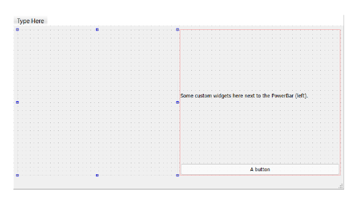
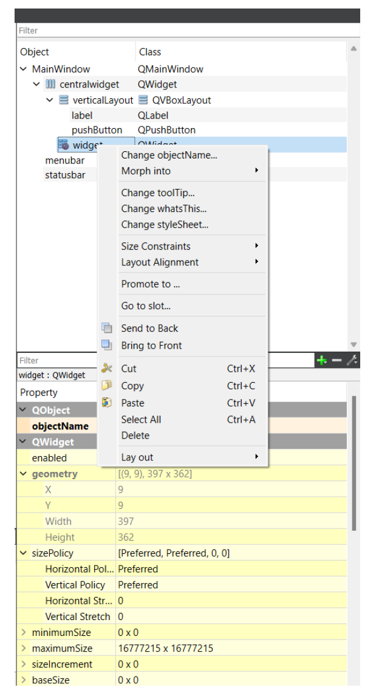
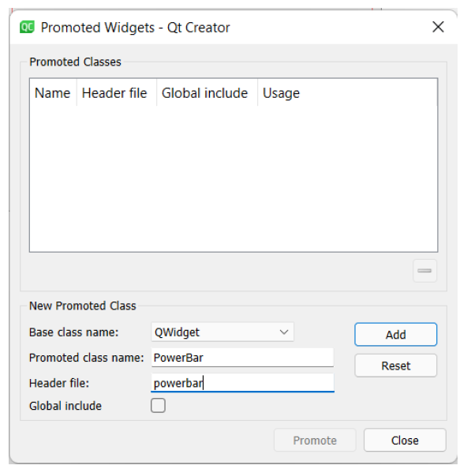
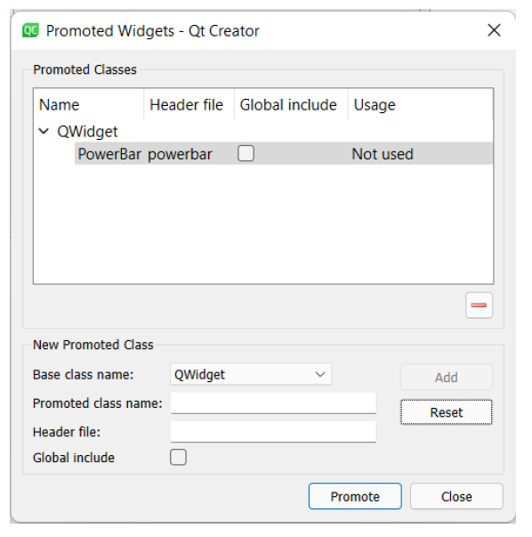
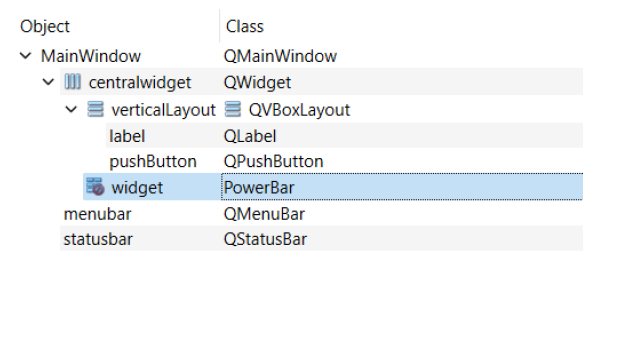
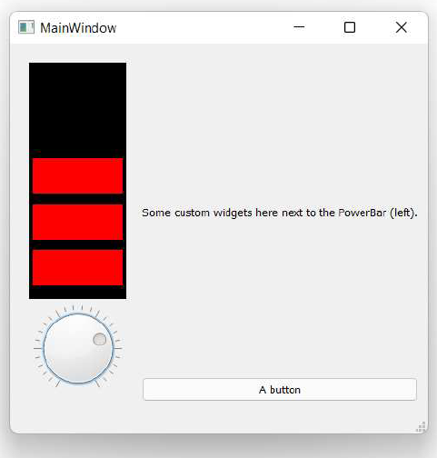
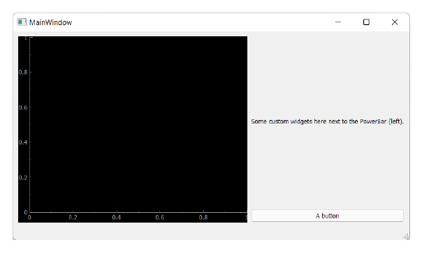
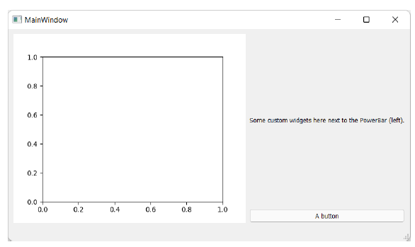
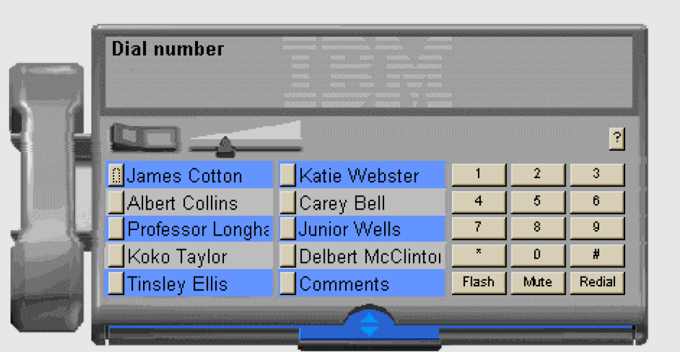
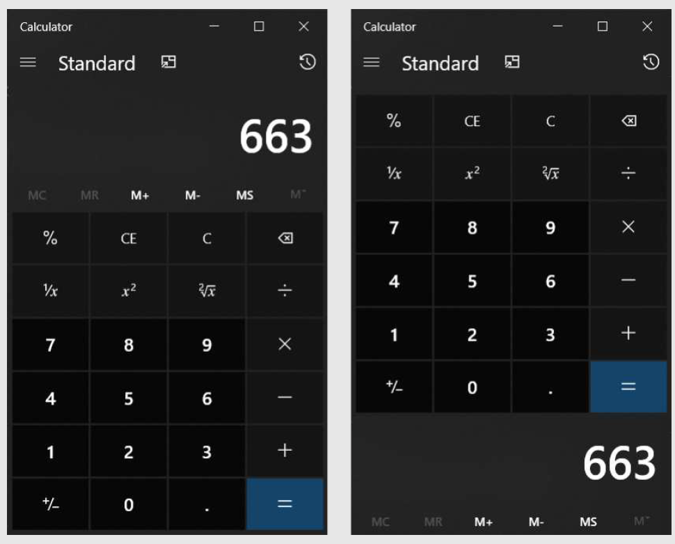

---
prev:
  text: '22. 创建自定义控件'
  link: '/CustomWidgets/22'
next:
  text: '24. 线程与进程简介'
  link: '/ConcurrentExecution/24'
---

## 23. 在 Qt Designer 中使用自定义控件

在上一章中，我们构建了一个自定义的 `PowerBar` 控件。生成的控件可以像任何内置控件一样，通过导入和添加到布局中，直接在您自己的应用程序中使用。但是，如果您使用 Qt Designer 构建应用程序用户界面该怎么办？您也可以在那里添加自定义控件吗？

答案是——是的！

在本章中，我们将逐步介绍如何将自定义控件添加到您自己的 Qt Designer 应用程序中。这个过程可能会有些复杂，但只要按照以下步骤操作，您就可以在 Designer 中创建的用户界面中使用任何自定义控件。


> 您可以使用相同的方法从其他库（例如 PyQtGraph 或 matplotlib）添加自定义控件。

## 背景

首先需要了解的是，您无法在 Qt Designer 中加载和显示自定义控件。Designer 中可用的控件是内置的，它无法解释您的 Python 代码来发现您创建的内容。

相反，要将控件插入到用户界面中，您需要添加占位符控件，然后告诉 Designer，您希望在应用程序运行时用自定义控件替换占位符。

在 Qt Designer 中，您会看到占位符。您可以更改与同类型控件相同的参数，这些参数将传递到自定义控件。在 Python 应用程序中加载用户界面时，PyQt6 会将自定义控件替换到相应位置。

在 Qt 中，替换占位控件的过程被称为“推广”(promoting)。内置控件被推广为自定义控件。

## 编写可推广的自定义控件

通过推广控件，您可以将 Qt Designer 中使用的占位控件替换为自己的自定义控件。在实现自定义控件时，您必须从另一个现有的 PyQt6 控件继承子类，即使该控件是基础 `QWidget` 也是如此。您还必须确保自定义控件实现了您子类的控件的默认构造函数。在大多数情况下，这只是意味着将父类作为 `__init__` 方法的第一个参数接受。您还必须确保自定义控件实现了您子类的控件的默认构造函数。在大多数情况下，这只是意味着将父类作为 `__init__` 方法的第一个参数接受。


> 如果自定义控件引发了错误，请在编译后的 UI 文件中检查 PyQt6 试图传递的参数。

要提升为自定义控件，自定义控件必须位于与编译后的 UI 将被导入的文件分开的文件中。但是，如果您愿意，可以在同一个文件中定义多个自定义控件。


> 此限制是为了避免循环导入——如果您的应用程序文件导入编译后的 UI 文件，而该 UI 文件又反过来导入您的应用程序文件，这种情况将无法正常工作。

在文件中定义自定义控件后，请记下文件名和类名。您需要这些信息来在 Qt Designer 中推广该控件。

### 在 Designer 中创建和推广控件

请您选择您希望自定义控件在用户界面中显示的位置，然后添加占位符控件。这里没有固定规则，但通常情况下，如果您的自定义控件继承自另一个 Qt 控件，则使用该控件作为占位符。例如，如果您基于 `QLabel` 创建了一个自定义控件，则使用 Label 作为占位符。这样，您就可以在 Designer 中访问标签的标准属性，以自定义您的自定义控件。



> 图190：简单的 UI 布局，左侧有一个占位符控件


> 您无法在设计器中更改任何自定义控件属性——Qt 设计器对您的自定义控件及其工作原理一无所知。请在代码中进行更改！

添加控件后，您可以对其进行推广。选择您想要推广的控件，右键单击，然后选择“Promote to …”。



> 图191：通过右键菜单推广控件

在对话框底部，您可以添加一个新推广类。输入类名——自定义控件的 Python 类名，例如 `PowerBar`——以及包含该类的 Python 文件作为头文件，省略 `.py` 后缀。


> Qt 会根据类名自动建议文件名，但会添加 `.h`（C++ 标准的头文件后缀）。您必须删除 `.h`，即使文件名正确。

如果您的自定义控件是在子文件夹中的类中定义的，则提供完整的 Python 点表示法到文件，与您对其他导入操作一样。例如，您可能将文件放置在 `ui/widgets/powerbar.py` 下，然后输入 `ui.widgets.powerbar` 作为头文件



> 图192：添加类名和头文件

请您点击“Add”来定义推广操作。然后，您可以在顶部的列表中选择促销活动，并点击“Promote”来实际推广您的控件。



> 图193：选择推广操作并将其应用到您的控件中

控件将被推广，并显示其新类名（此处为 `PowerBar`）。



> 图194：在 UI 层叠结构中显示的推广控件

保存 UI 文件，并使用 `pyuic` 工具进行编译，与之前操作相同。

```bash
pyuic6 mainwindow.ui -o MainWindow.py
```

打开生成的文件，您会看到自定义的 `PowerBar` 类现在被用于在 `setupUi` 方法中构建控件，并且文件底部添加了一个新的导入。

```python
class Ui_MainWindow(object):
    def setupUi(self, MainWindow):
        # etc...
        self.widget = PowerBar(self.centralwidget)
        
    # etc...
    
    def retranslateUi(self, MainWindow):
        _translate = QtCore.QCoreApplication.translate
        MainWindow.setWindowTitle(_translate("MainWindow",
                                             "MainWindow"))
        self.label.setText(_translate("MainWindow", "Some custom
                                      widgets here next to the PowerBar (left)."))
                                      self.pushButton.setText(_translate("MainWindow", "A button"))
                                      from powerbar import PowerBar
```

您可以像往常一样使用编译后的 UI 文件。您无需将自定义控件导入应用程序，因为编译后的 UI 文件中已经包含了该控件的滑块。

*Listing 169. custom-widgets/promote_test.py*

```python
import random
import sys

from PyQt6.QtCore import Qt
from PyQt6.QtWidgets import QApplication, QMainWindow

from MainWindow import Ui_MainWindow


class MainWindow(QMainWindow, Ui_MainWindow):
    def __init__(self):
        super().__init__()
        self.setupUi(self)
        self.show()
        
        
app = QApplication(sys.argv)
w = MainWindow()
app.exec()
```

运行应用程序时，自定义控件将被加载并自动出现在正确的位置。



> 图195：应用程序中显示的 PowerBar 自定义控件


> 您看到的绝大多数错误都与导入相关。第一步应始终是检查编译后UI文件底部的导入语句，以确认其合理性。目标文件是否可达？

### 第三方控件

您也可以使用相同的技术将其他第三方控件添加到您的应用程序中。该过程完全相同，您只需引用控件的完全限定 Python 导入路径，并使用适当的类名即可。以下是一些常见第三方控件的配置示例


> 我们将在后续章节中详细讲解如何使用这些库！

#### PyQtGraph

在 Qt Designer 中，将 `PlotWidget` 作为推广的类名，将 `pyqtgraph` 作为头文件。使用 `QWidget` 作为占位控件。PyQtGraph 绘图控件将在生成的 UI 文件中按原样工作。

请参阅本书源代码下载中的 `custom-widgets/pyqtgraph_demo.py` 文件，了解可运行的演示程序。



> 图196：通过控件推广添加了 PyQtGraph 绘图控件

#### Matplotlib

`matplotlib` 的自定义控件 `FigureCanvasQTAgg` 不能直接在 Qt Designer 中使用，因为构造函数不接受父对象作为第一个参数，而是期望一个 `Figure` 对象。

我们可以通过添加一个简单的包装类来解决这个问题，该类定义如下。

*Listing 170. custom-widgets/mpl.py*

```python
from matplotlib.backends.backend_qtagg import FigureCanvasQTAgg
from matplotlib.figure import Figure


class MplCanvas(FigureCanvasQTAgg):
    def __init__(self, parent=None, width=5, height=4, dpi=100):
        fig = Figure(figsize=(width, height), dpi=dpi)
        self.axes = fig.add_subplot(111)
        super().__init__(fig)
```

请您将此文件添加到名为 `mpl.py` 的项目中，然后在 Qt Designer 中使用 `MplCanvas` 作为推广的类名，使用 `mpl` 作为头文件。使用 `QWidget` 作为占位控件。

请参阅本书源代码下载中的 `custom-widgets/matplotlib_demo.py` 文件，了解可运行的演示程序。



> 图197：通过控件推广添加的 matplotlib 控件

使用这些技术，您应该能够在 PyQt6 应用程序中使用任何自定义控件。

## 熟悉度与拟物化设计

在构建用户界面时，最强大的工具之一就是熟悉感。也就是说，让用户觉得你的界面是他们之前使用过的。熟悉的界面通常被描述为直观的。在屏幕上移动鼠标指针并点击方形凸起本身并没有什么直观之处。但是，经过多年的重复操作，这种行为本身就变得非常熟悉了。

在用户界面中寻找熟悉感导致了拟物化设计。拟物化设计是指将非功能性设计元素应用于物体，而这些设计元素是功能性的。这意味着使用常见的界面元素，或者制作看起来像真实物体的界面。虽然近年来图形用户界面趋势又回到了抽象的“扁平化”设计，但所有现代用户界面都保留了拟物化的元素。



> RealPhone — IBM RealThings™ 系列产品之一

现代桌面计算器就是一个很好的例子。当我们进行计算时，我们会将结果显示在底部。那么为什么计算器的屏幕会位于顶部呢？因为如果屏幕位于底部，它会被您的手挡住。因此，屏幕的位置是出于功能性考虑。

对于计算机上的计算器，这个位置被保留下来，尽管它已经不再具有功能性——鼠标指针不会遮挡屏幕，输入通常通过键盘进行。但如果您打开一个计算器，发现屏幕在底部，您就会感到困惑。它看起来像是倒置的。尽管完全可用，但它看起来奇怪或反直觉。这就是拟物主义的本质——通过利用用户对现有物体的熟悉感，使用户界面感觉更直观。



> 计算器与倒置计算器（Windows 10）

您的软件在这一尺度上的位置由你自行决定。关键在于要了解现有的接口，并在可能的情况下充分利用它们来提升你自己应用程序的易用性。您的用户会因此感激不尽！

---

- **请务必**在设计自己的界面时适当地借鉴现有界面的设计元素。
- **请务必**在需要提升用户体验的地方适当地加入拟物化设计元素。
