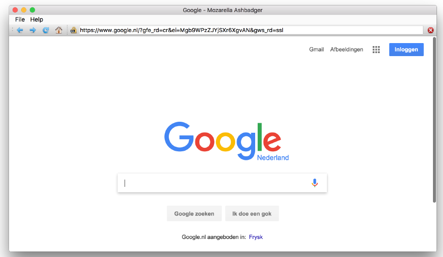
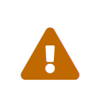
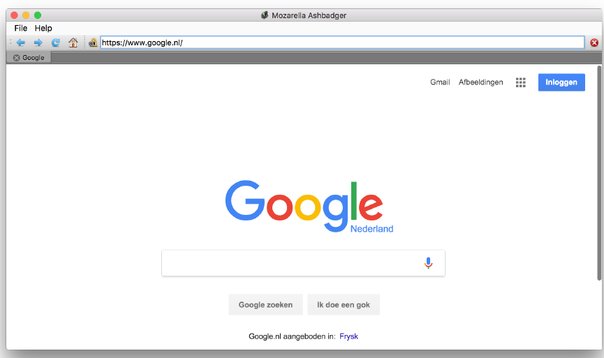

---
prev:
  text: '40. 创建一个Linux软件包'
  link: '/PackagingAndDistribution/40'
next:
  text: '42. Moonsweeper'
  link: '/ExampleApplications/42'
---

到目前为止，您应该已经掌握了如何使用PyQt6构建简单应用程序的方法。为了展示如何将所学知识付诸实践，本章中包含了几个示例应用程序。这些应用程序功能齐全、简单易用，但在某些方面可能不够完善。您可以将它们作为灵感来源，进行拆解分析，并借此机会进行改进。请您继续阅读，我们将对每个应用程序的精彩部分进行详细讲解。

这两个应用程序的完整源代码均可下载，此外，您还可以在我的GitHub上的 [15分钟应用程序](https://github.com/pythonguis/15-minute-apps) 仓库中找到另外13个应用程序。祝您玩得愉快！

本书中还有其他一些微型应用程序的示例——例如绘图和待办事项应用程序——我鼓励您也要扩展这些应用程序，这是学习的最佳方式。

## 41. Mozzarella Ashbadger

Mozzarella Ashbadger 是网页浏览领域的最新革命！返回和前进！打印！保存文件！获取帮助！（您可能会需要它）。与其他浏览器的任何相似之处纯属巧合。



> 图269：Mozzarella Ashbadger


> 此应用程序利用了信号与槽、扩展信号和控件中介绍的功能。

Mozzarella Ashbadger 的源代码有两种形式，一种带有标签式浏览，另一种没有。添加标签会稍微增加信号处理的复杂性，因此我们首先介绍没有标签的版本。

要创建浏览器，我们需要安装一个额外的 PyQt6 组件 — PyQtWebEngine。您可以通过命令行使用 `pip` 进行安装，具体步骤如下：

```bash
pip3 install pyqt6-webengine
```

## 源代码

无标签浏览器的完整源代码包含在本书的下载内容中。浏览器代码的文件名为 `browser.py` 。

```bash
python3 browser.py
```

> 🚀 **运行它吧！** 在开始编写代码之前，请先探索 Mozzarella Ashbadger 的界面和功能。

## 浏览器控件

浏览器的核心是 `QWebEngineView`，我们从 `QtWebEngineWidgets` 导入它。它提供了一个完整的浏览器窗口，该窗口负责滑块下载页面的渲染。以下是 PyQt6 中使用网页浏览器控件所需的最低限度代码。

*Listing 264. app/browser_skeleton.py*

```python
import sys

from PyQt6.QtCore import QUrl
from PyQt6.QtWebEngineWidgets import QWebEngineView
from PyQt6.QtWidgets import QApplication, QMainWindow


class MainWindow(QMainWindow):
    def __init__(self):
        super().__init__()
        
        self.browser = QWebEngineView()
        self.browser.setUrl(QUrl("https://www.google.com"))
        
        self.setCentralWidget(self.browser)
        
        self.show()
        
        
app = QApplication(sys.argv)
window = MainWindow()

app.exec()
```

如果您稍微点击一下，您会发现浏览器表现得像预期的一样——链接正常工作，您可以与页面互动。然而，您也会注意到一些你习以为常的东西缺失了——比如地址栏、控制按钮或任何类型的界面。这使得使用起来有点棘手。

让我们把这个简陋的浏览器改造成一个稍微实用一点的工具吧！

## 路径

为了更方便地处理界面图标，我们可以首先定义一个“使用相对路径”（参见前面的章节）。它为 `icons` 数据文件和一个 `icon` 方法定义了一个单一的文件夹位置，用于创建图标的路径。这使我们能够使用 `Paths.icon()` 来加载浏览器界面的图标。

*Listing 265. app/paths.py*

```python
import os


class Paths:
    
    base = os.path.dirname(__file__)
    icons = os.path.join(base, "icons")
    
    # 文件加载器.
    @classmethod
    def icon(cls, filename):
        return os.path.join(cls.icons, filename)
```

请您将它与我们的浏览器保存在同一文件夹中，它可以导入为：

*Listing 266. app/browser.py*

```python
from paths import Paths
```

## 导航

现在这些都已就绪，我们可以添加一些界面控件，例如在 `QToolbar` 上使用一系列的 `QActions` 。我们将这些定义添加到 `QMainWindow` 的 `__init__` 块中。我们使用我们的 `Paths.icon()` 方法使用相对路径加载文件。

*Listing 267. app/browser.py*

```python
        navtb = QToolBar("Navigation")
        navtb.setIconSize(QSize(16, 16))
        self.addToolBar(navtb)
        
        back_btn = QAction(
            QIcon(Paths.icon("arrow-180.png")), "Back", self
        )
        back_btn.setStatusTip("Back to previous page")
        back_btn.triggered.connect(self.browser.back)
        navtb.addAction(back_btn)
```

`QWebEngineView` 包括用于前进、后退和重新加载导航的槽，我们可以将其直接连接到我们的动作的 `.triggered` 信号。

我们为剩余的控件使用相同的 `QAction` 结构。

*Listing 268. app/browser.py*

```python
        next_btn = QAction(
            QIcon(Paths.icon("arrow-000.png")), "Forward", self
        )
        next_btn.setStatusTip("Forward to next page")
        next_btn.triggered.connect(self.browser.forward)
        navtb.addAction(next_btn)
        
        reload_btn = QAction(
            QIcon(Paths.icon("arrow-circle-315.png")),
            "Reload",
            self,
        )
        reload_btn.setStatusTip("Reload page")
        reload_btn.triggered.connect(self.browser.reload)
        navtb.addAction(reload_btn)
        
        home_btn = QAction(QIcon(Paths.icon("home.png")), "Home", self)
        home_btn.setStatusTip("Go home")
        home_btn.triggered.connect(self.navigate_home)
        navtb.addAction(home_btn)
```

请注意，虽然前进、后退和重新加载可以使用内置槽，但导航主页按钮需要自定义槽函数。该槽函数在我们的 `QMainWindow` 类中定义，只需将浏览器的URL设置为谷歌主页即可。请注意，URL必须作为 `QUrl` 对象传递。

*Listing 269. app/browser.py*

```python
    def navigate_home(self):
        self.browser.setUrl(QUrl("http://www.google.com"))
```


> 挑战
>
> 尝试将主页导航位置设置为可配置。您可以创建一个带输入字段的 `QDialog` 对话框。

任何一款合格的网页浏览器都必须具备地址栏，并且需要提供一种方式来停止导航——无论是由于误操作，还是页面加载过慢。

*Listing 270. app/browser.py*

```python
        self.httpsicon = QLabel() # 是的，就像这样!
        self.httpsicon.setPixmap(QPixmap(Paths.icon("lock-nossl.png")))
        navtb.addWidget(self.httpsicon)
        
        self.urlbar = QLineEdit()
        self.urlbar.returnPressed.connect(self.navigate_to_url)
        navtb.addWidget(self.urlbar)
        
        stop_btn = QAction(
            QIcon(Paths.icon("cross-circle.png")), "Stop", self
        )
        stop_btn.setStatusTip("Stop loading current page")
        stop_btn.triggered.connect(self.browser.stop)
        navtb.addAction(stop_btn)
```

与之前一样，`QWebEngineView` 上提供了“停止”功能，我们只需将停止按钮的 `.triggered` 信号连接到现有的槽即可。但是，URL 栏的其他功能必须单独处理。

首先，我们添加一个 `QLabel` 来保存我们的 SSL 或非 SSL 图标，以指示页面是否安全。接下来，我们添加一个 URL 栏，它只是一个 `QLineEdit`。为了触发在输入（按回车键）时在栏中加载 URL，我们连接到控件上的 `.returnPressed` 信号，以驱动一个自定义槽函数，触发导航到指定的 URL。

*Listing 271. app/browser.py*

```python
    def navigate_to_url(self): # 未接收 URL
        q = QUrl(self.urlbar.text())
        if q.scheme() == "":
            q.setScheme("http")
            
        self.browser.setUrl(q)
```

我们还希望 URL 条能够根据页面变化进行更新。为此，我们可以使用 `QWebEngineView` 的 `.urlChanged` 和 `.loadFinished` 信号。我们在 `__init__` 块中按照以下方式设置了信号的连接：

*Listing 272. app/browser.py*

```python
        self.browser.urlChanged.connect(self.update_urlbar)
        self.browser.loadFinished.connect(self.update_title)
```

然后，我们定义这些信号的目标槽函数。第一个函数用于更新 URL 栏，它接受一个 `QUrl` 对象，并确定这是 `http` 还是 `https` URL，然后使用此信息设置 SSL 图标。



> 这是一种非常糟糕的测试连接是否“安全”的方法。要正确地进行测试，我们应该执行证书验证。

`QUrl` 被转换为字符串，URL 栏也更新为该值。请注意，我们还将光标位置设置回行首，以防止`QLineEdit` 控件滚动到行尾。

*Listing 273. app/browser.py*

```python
    def update_urlbar(self, q):
        
        if q.scheme() == "https":
            # 安全挂锁图标
            self.httpsicon.setPixmap(
                QPixmap(Paths.icon("lock-ssl.png"))
            )
            
        else:
            # 不安全的挂锁图标
            self.httpsicon.setPixmap(
                QPixmap(Paths.icon("lock-nossl.png"))
            )
            
        self.urlbar.setText(q.toString())
        self.urlbar.setCursorPosition(0)
```

另外，将应用程序窗口的标题更新为当前页面的标题也是一个不错的细节。我们可以使用 `browser.page().title()` 方法获取此信息，该方法返回当前加载的网页中 `<title></title>` 标签的内容。

*Listing 274. app/browser.py*

```python
    def update_title(self):
        title = self.browser.page().title()
        self.setWindowTitle("%s - Mozzarella Ashbadger" % title)
```

## 文件操作

使用 `self.menuBar().addMenu(“&File”)` 可以创建一个标准的“文件”菜单，将 F 键分配为 Alt 快捷键（与通常一样）。获得菜单对象后，我们可以将 `QAction` 对象分配给该对象以创建条目。我们在这里创建了两个基本条目，用于打开和保存 HTML 文件（来自本地磁盘）。这两个条目都需要自定义槽函数。

*Listing 275. app/browser.py*

```python
        file_menu = self.menuBar().addMenu("&File")
    
        open_file_action = QAction(
            QIcon(Paths.icon("disk--arrow.png")),
            "Open file...",
            self,
        )
        open_file_action.setStatusTip("Open from file")
        open_file_action.triggered.connect(self.open_file)
        file_menu.addAction(open_file_action)
        
        save_file_action = QAction(
            QIcon(Paths.icon("disk--pencil.png")),
            "Save Page As...",
            self,
        )
        save_file_action.setStatusTip("Save current page to file")
        save_file_action.triggered.connect(self.save_file)
        file_menu.addAction(save_file_action)
```

打开文件的槽函数使用内置的 `QFileDialog.getOpenFileName()` 函数创建一个文件打开对话框并获取一个名称。我们默认将名称限制为与 `*.htm` 或 `*.html` 匹配的文件。

我们使用标准的 Python 函数将文件读取到一个名为 `html` 的变量中，然后使用`.setHtml()` 将 HTML 内容加载到浏览器中。

*Listing 276. app/browser.py*

```python
    def open_file(self):
        filename, _ = QFileDialog.getOpenFileName(
            self,
            "Open file",
            "",
            "Hypertext Markup Language (*.htm *.html);;"
            "All files (*.*)",
        )
        
        if filename:
            with open(filename, "r") as f:
                html = f.read()
                
            self.browser.setHtml(html)
            self.urlbar.setText(filename)
```

同样地，为了保存当前页面的 HTML，我们使用内置的 `QFileDialog.getSaveFileName()` 方法获取文件名。不过这次我们通过 `self.browser.page().toHtml()` 获取 HTML。

这是一个异步方法，这意味着我们不会立即收到 HTML。相反，我们必须传递一个回调方法，该方法将在 HTML 准备就绪后接收它。在这里，我们创建了一个简单的 `writer` 函数，它使用本地范围中的文件名来处理它。

*Listing 277. app/browser.py*

```python
    def save_file(self):
        filename, _ = QFileDialog.getSaveFileName(
            self,
            "Save Page As",
            "",
            "Hypertext Markup Language (*.htm *html);;"
            "All files (*.*)",
        )
        
        if filename:
            # 定义回调方法以处理写入操作.
            def writer(html):
                with open(filename, "w") as f:
                    f.write(html)
                    
            self.browser.page().toHtml(writer)
```

## 打印

我们可以使用之前的方法在“文件”菜单中添加打印选项。同样，这需要一个自定义槽函数来执行打印操作。

*Listing 278. app/browser.py*

```python
        print_action = QAction(
            QIcon(Paths.icon("printer.png")), "Print...", self
        )
        print_action.setStatusTip("Print current page")
        print_action.triggered.connect(self.print_page)
        file_menu.addAction(print_action)
        
        # 创建我们的系统打印机实例.
        self.printer = QPrinter()
```

Qt 提供了一个基于 `QPrinter` 对象的完整打印框架，您可以在其上绘制要打印的页面。为了启动打印过程，我们首先为用户打开一个 `QPrintDialog`。这允许用户选择目标打印机并配置打印设置。

我们在 `__init__`中创建了 `QPrinter` 对象，并将其存储为 `self.printer`。在我们的打印处理方法中，我们将此打印机传递给 `QPrintDialog`，以便其可以被配置。如果对话框被接受，我们将（现在已配置的）打印机对象传递给 `self.browser.page().print` 以触发打印。

*Listing 279. app/browser.py*

```python
def print_page(self):
    page = self.browser.page()
    
    def callback(*args):
        pass
    
    dlg = QPrintDialog(self.printer)
    dlg.accepted.connect(callback)
    if dlg.exec() == QDialog.DialogCode.Accepted:
        page.print(self.printer, callback)
```

请注意，`.print` 方法还接受第二个参数——一个回调函数，该函数会接收打印操作的结果。这允许您在打印操作完成后显示一条通知，但在此示例中，我们只是静默地忽略了回调函数。

## 帮助

最后，为了完成标准界面，我们可以添加一个“帮助”菜单。它与之前一样，定义为两个自定义槽函数，一个用于显示“关于”对话框，另一个用于加载包含更多信息的“浏览器页面”。

*Listing 280. app/browser.py*

```python
        help_menu = self.menuBar().addMenu("&Help")
        about_action = QAction(
            QIcon(Paths.icon("question.png")),
            "About Mozzarella Ashbadger",
            self,
        )
        about_action.setStatusTip(
            "Find out more about Mozzarella Ashbadger"
        ) # 我真饿了!
        about_action.triggered.connect(self.about)
        help_menu.addAction(about_action)
        navigate_mozzarella_action = QAction(
            QIcon(Paths.icon("lifebuoy.png")),
            "Mozzarella Ashbadger Homepage",
            self,
        )
        navigate_mozzarella_action.setStatusTip(
            "Go to Mozzarella Ashbadger Homepage"
        )
        navigate_mozzarella_action.triggered.connect(
            self.navigate_mozzarella
        )
        help_menu.addAction(navigate_mozzarella_action)
```

我们定义了两个方法，作为“帮助”菜单信号的槽。第一个 `navigate_mozzarella` 打开一个页面，提供有关浏览器（或在本书的本例中）的更多信息。第二个创建并执行一个自定义的 `QDialog` 类 `AboutDialog`，我们将在下面进行定义。

*Listing 281. app/browser.py*

```python
    def navigate_mozzarella(self):
        self.browser.setUrl(QUrl("https://www.pythonguis.com/"))
        
    def about(self):
        dlg = AboutDialog()
        dlg.exec()
```

关于对话框的定义如下。该结构与本书前面介绍的结构相似，使用 `QDialogButtonBox` 和相关信号来处理用户输入，并使用一系列 `QLabels` 来显示应用程序信息和徽标。

这里唯一的技巧是将所有元素添加到布局中，然后在单个循环中遍历它们，将对齐方式设置为居中。这样可以避免在各个部分中重复设置。

*Listing 282. app/browser.py*

```python
class AboutDialog(QDialog):
    def __init__(self):
        super().__init__()
        
        QBtn = QDialogButtonBox.StandardButton.Ok # 不取消
        self.buttonBox = QDialogButtonBox(QBtn)
        self.buttonBox.accepted.connect(self.accept)
        self.buttonBox.rejected.connect(self.reject)
        
        layout = QVBoxLayout()
        
        title = QLabel("Mozzarella Ashbadger")
        font = title.font()
        font.setPointSize(20)
        title.setFont(font)
        
        layout.addWidget(title)
        
        logo = QLabel()
        logo.setPixmap(QPixmap(Paths.icon("ma-icon-128.png")))
        layout.addWidget(logo)
        
        layout.addWidget(QLabel("Version 23.35.211.233232"))
        layout.addWidget(QLabel("Copyright 2015 Mozzarella Inc."))
        
        for i in range(0, layout.count()):
            layout.itemAt(i).setAlignment(Qt.AlignmentFlag.AlignHCenter)
            
        layout.addWidget(self.buttonBox)
        
        self.setLayout(layout)
```

## 标签式浏览



> 图270：标签化的Mozzarella Ashbadger

## 源代码

本书的下载内容中包含了带标签页浏览器的完整源代码。浏览器代码的文件名为 `browser_tabs.py`。

> 🚀 **运行它吧！** 在开始编写代码之前，请先探索标签化的 Mozzarella Ashbadger 的界面和功能。

## 创建一个 `QTabWidget`

使用 `QTabWidget` 可以轻松地为浏览器添加标签页界面。它为多个控件（在本例中为 `QWebEngineView` 控件）提供了一个简单的容器，并内置了用于在控件之间切换的标签页界面。

我们在这里使用的两个自定义设置是 `.setDocumentMode(True)`，它在 macOS 上提供一个类似 Safari 的界面，以及 `.setTabsClosable(True)`，它允许用户在应用程序中关闭标签页。

我们还将 `QTabWidget` 信号 `tabBarDoubleClicked`、`currentChanged` 和 `tabCloseRequested `连接到自定义槽方法，以处理这些行为。

*Listing 283. app/browser_tabs.py*

```python
        self.tabs = QTabWidget()
        self.tabs.setDocumentMode(True)
        self.tabs.tabBarDoubleClicked.connect(self.tab_open_doubleclick)
        self.tabs.currentChanged.connect(self.current_tab_changed)
        self.tabs.setTabsClosable(True)
        self.tabs.tabCloseRequested.connect(self.close_current_tab)
        
        self.setCentralWidget(self.tabs)
```

这三种槽方法都接受一个 `i`（索引）参数，该参数指示信号来自哪个选项卡（按顺序）。

我们双击标签栏中的空白处（由索引 `-1`表示）来触发新标签的创建。要删除标签，我们直接使用索引来删除控件（以及标签），并进行简单的检查以确保至少有 2 个标签——关闭最后一个标签会导致您无法打开新标签。

`current_tab_changed` 处理程序使用 `self.tabs.currentWidget()` 结构来访问当前活动标签页的控件（`QWebEngineView` 浏览器），然后使用它来获取当前页面的 URL。

*Listing 284. app/browser_tabs.py*

```python
    def tab_open_doubleclick(self, i):
        if i == -1: # N点击后没有选项卡
            self.add_new_tab()
   
    def current_tab_changed(self, i):
        qurl = self.tabs.currentWidget().url()
        self.update_urlbar(qurl, self.tabs.currentWidget())
        self.update_title(self.tabs.currentWidget())  
        
    def close_current_tab(self, i):
        if self.tabs.count() < 2:
            return

        self.tabs.removeTab(i)
```

*Listing 285. app/browser_tabs.py*

```python
    def add_new_tab(self, qurl=None, label="Blank"):
        
        if qurl is None:
            qurl = QUrl("")
           
        browser = QWebEngineView()
        browser.setUrl(qurl)
        i = self.tabs.addTab(browser, label)
        
        self.tabs.setCurrentIndex(i)
```

## 信号和槽的变化

虽然 `QTabWidget` 和相关信号的设置很简单，但在浏览器槽方法中，事情就变得稍微复杂一些了。

以前我们只有一个 `QWebEngineView`，现在有多个视图，每个视图都有自己的信号。如果处理隐藏标签的信号，事情就会变得一团糟。例如，处理 `loadCompleted` 信号的槽必须检查源视图是否在可见标签中。

我们可以使用发送附加数据信号的技巧来实现这一点。在标签式浏览器中，我们使用 `lambda` 样式语法来实现这一点。

以下是在创建新的 `QWebEngineView` 时，在 `add_new_tab` 函数中实现此功能的示例：

*Listing 286. app/browser_tabs.py*

```python
        # 更复杂了！我们只希望在URL来自正确标签页时进行更新。
        browser.urlChanged.connect(
            lambda qurl, browser=browser: self.update_urlbar(
                qurl, browser
            )
        )
        
        browser.loadFinished.connect(
            lambda _, i=i, browser=browser: self.tabs.setTabText(
                i, browser.page().title()
            )
        )
```

如您所见，我们将 `lambda` 设置为 `urlChanged` 信号的槽，接受该信号发送的 `qurl` 参数。我们将最近创建的 `browser` 对象添加到 `update_urlbar` 函数中。

结果是，每当这个 `urlChanged` 信号触发时，`update_urlbar` 将同时收到新 URL 和它来自的浏览器。在槽方法中，我们可以检查以确保信号的来源与当前可见的浏览器相匹配，如果不匹配，我们只需丢弃该信号即可。

*Listing 287. app/browser_tabs.py*

```python
    def update_urlbar(self, q, browser=None):
        if browser != self.tabs.currentWidget():
            # 如果该信号不是来自当前选项卡，则忽略它
            return
        
        if q.scheme() == "https":
            # 安全挂锁图标
            self.httpsicon.setPixmap(
                QPixmap(Paths.icon("lock-ssl.png"))
            )
            
        else:
            # 不安全的挂锁图标
            self.httpsicon.setPixmap(
                QPixmap(Paths.icon("lock-nossl.png"))
            )
           
        self.urlbar.setText(q.toString())
        self.urlbar.setCursorPosition(0)
```

## 继续深入

现在您可以探索浏览器标签页版本的其余源代码，请特别注意 `self.tabs.currentWidget()` 的使用以及通过信号传递额外数据。这是您所学知识的一个很好的实际应用案例，所以尝试一下，看看您能否以有趣的方式打破/改进它。


> 挑战
>
> 您可能想尝试添加一些额外功能——
>
> - 书签（或收藏夹）——您可以将这些存储在一个简单的文本文件中，并在菜单中显示它们
> - 网站图标（Favicons）——这些小小的网站图标，在标签页上看起来会非常棒。
> - 查看源代码 ——添加一个菜单选项以查看页面源代码。
> - 在新标签页中打开 ——添加右键点击上下文菜单，或键盘快捷键，以在新标签页中打链接

