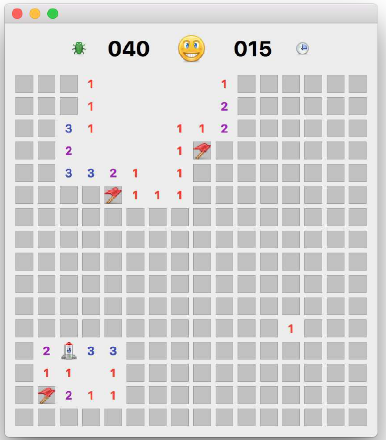
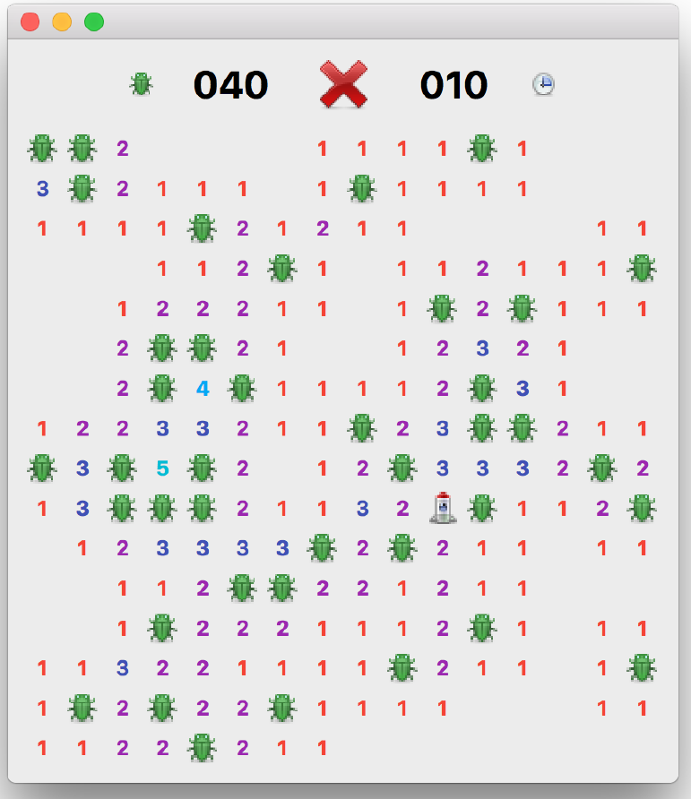

---
prev:
  text: '41. Mozzarella Ashbadger'
  link: '/ExampleApplications/41'
next:
  text: '附录A：安装 PyQt6'
  link: '/Appendix/A'
---

## 42. Moonsweeper

探索神秘的 Q’tee 卫星，但不要太靠近外星人！

Moonsweeper 是一款单人解谜游戏。游戏的目标是探索您着陆的太空火箭周围的区域，同时避免过于靠近致命的 B’ug 外星人。您可靠的计数器会告诉你附近有多少 B’ug。


> 推荐阅读
>
> 此应用程序利用了信号与槽以及事件中的功能。



> 图271：Moonsweeper

这是一个以扫雷游戏为原型的简单单人探索游戏，其中您必须揭开所有方块而不触发隐藏的地雷。此实现使用自定义的 `QWidget` 对象表示方块，每个方块单独保存其状态，包括是否为地雷、当前状态以及相邻地雷的数量。在此版本中，地雷被替换为外星虫子（B’ug），但它们也可以是任何其他物体。

在许多扫雷变体中，初始回合被视为安全回合——如果您在第一次点击时触碰到地雷，它会被移动到其他地方。在这里我们稍微作弊一下，将玩家的首次操作固定在非地雷位置。这样做可以避免因首次操作错误而需要重新计算相邻格子的情况。我们可以将此解释为“火箭周围的初始探索”，使其听起来完全合理。


> 挑战！
>
> 如果您想实现这一点，可以在位置上捕获第一次点击，然后在处理点击之前生成地雷/相邻位置，但不包括您的位置。您需要让自定义控件访问父窗口对象

## 源代码

Moonsweeper 游戏的完整源代码包含在本书的下载内容中。游戏文件以 `minesweeper.py` 的名称保存。

```bash
python3 minesweeper.py
```

## 路径

为了更方便地处理界面图标，我们可以首先定义一个“使用相对路径”（参见前面的章节）。它为 `icons` 数据文件和一个 `icon` 方法定义了一个单一的文件夹位置，用于创建图标的路径。这使我们能够使用 `Paths.icon()` 来加载游戏界面的图标。

*Listing 288. app/paths.py*

```python
import os


class Paths:
    
    base = os.path.dirname(__file__)
    icons = os.path.join(base, "icons")
    
    # 文件加载器.
    @classmethod
    def icon(cls, filename):
        return os.path.join(cls.icons, filename)
```

与我们的 Moonsweeper 应用程序保存在同一文件夹中，它可以被导入为：

*Listing 289. app/moonsweeper.py*

```python
from paths import Paths
```

## 图标与颜色

现在路径已经定义，我们可以使用它们来加载一些图标，用于我们的游戏——一个虫子、一面旗帜、一枚火箭和一个时钟。我们还定义了一组颜色用于界面状态，以及一系列状态标志来跟踪游戏的进展——每个标志都关联一个笑脸图标。

*Listing 290. app/moonsweeper.py*

```python
IMG_BOMB = QImage(Paths.icon("bug.png"))
IMG_FLAG = QImage(Paths.icon("flag.png"))
IMG_START = QImage(Paths.icon("rocket.png"))
IMG_CLOCK = QImage(Paths.icon("clock-select.png"))

NUM_COLORS = {
    1: QColor("#f44336"),
    2: QColor("#9C27B0"),
    3: QColor("#3F51B5"),
    4: QColor("#03A9F4"),
    5: QColor("#00BCD4"),
    6: QColor("#4CAF50"),
    7: QColor("#E91E63"),
    8: QColor("#FF9800"),
}

STATUS_READY = 0
STATUS_PLAYING = 1
STATUS_FAILED = 2
STATUS_SUCCESS = 3

STATUS_ICONS = {
    STATUS_READY: Paths.icon("plus.png"),
    STATUS_PLAYING: Paths.icon("smiley.png"),
    STATUS_FAILED: Paths.icon("cross.png"),
    STATUS_SUCCESS: Paths.icon("smiley-lol.png"),
}
```

## 游戏区域

Moonsweeper 的游戏区域是一个 NxN 的网格，其中包含固定数量的矿井。我们使用的网格尺寸和矿井数量来自 Windows 版本《扫雷》的默认值。所使用的值如表所示：

*Table 14. Table Dimensions and mine counts*

| 难度等级 | 尺寸    | 地雷数量 |
| -------- | ------- | -------- |
| 简单     | 8 x 8   | 10       |
| 中等     | 16 x 16 | 40       |
| 困难     | 24 x 24 | 99       |

我们将这些值存储为文件顶部定义的常量 `LEVELS`。由于所有游戏区域均为正方形，因此只需存储一次值（8、16或24）。

*Listing 291. app/minesweeper.py*

```python
LEVELS = [("Easy", 8, 10), ("Medium", 16, 40), ("Hard", 24, 99)]
```

游戏网格可以以多种方式表示，例如使用一个二维的“列表的列表”来表示游戏位置的不同状态（地雷、已揭示、已标记）。

然而，在我们的实现中，我们将采用面向对象的方法，其中地图上的每个位置都包含自身相关的所有数据。进一步而言，我们可以让这些对象各自负责绘制自身。在Qt中，我们可以通过继承`QWidget` 类，并实现自定义绘制函数来实现这一点。

在介绍这些自定义控件的外观之前，我们将先介绍它们的结构和行为。由于我们的瓷砖对象是 `QWidget` 的子类，因此我们可以像其他控件一样对它们进行布局。为此，我们需要设置一个 `QGridLayout`。

*Listing 292. app/minesweeper.py*

```python
        self.grid = QGridLayout()
        self.grid.setSpacing(5)
        self.grid.setSizeConstraint(QLayout.SizeConstraint.SetFixedSize)
```

接下来，我们需要设置游戏区域，创建位置图块控件并将其添加到网格中。关卡的初始设置在自定义方法中定义，该方法从 `LEVELS` 读取数据，并将一些变量分配给窗口。窗口标题和地雷计数器更新后，网格的设置就开始了。

*Listing 293. app/minesweeper.py*

```python
    def set_level(self, level):
        self.level_name, self.b_size, self.n_mines = LEVELS[level]
        
        self.setWindowTitle("Moonsweeper - %s" % (self.level_name))
        self.mines.setText("%03d" % self.n_mines)
        
        self.clear_map()
        self.init_map()
        self.reset_map()
```

接下来我们将介绍设置功能。

我们这里使用了一个自定义的 `Pos` 类，我们稍后会详细介绍它。目前，您只需要知道它包含地图中相关位置的所有相关信息——例如，是否为地雷、是否已被揭示、是否被标记以及附近地雷的数量。

每个 `Pos` 对象还有 3 个自定义信号 `clicked`、`revealed` 和 `expandable`，我们将其连接到自定义槽方法。最后，我们调用 `resize` 来调整窗口的大小，以适应新内容。请注意，这实际上只有在窗口缩小时才需要——窗口会自动扩大。

*Listing 294. app/minesweeper.py*

```python
    def init_map(self):
        # 在地图上添加位置
        for x in range(0, self.b_size):
            for y in range(0, self.b_size):
                w = Pos(x, y)
                self.grid.addWidget(w, y, x)
                # 将信号连接到滑块扩展件.
                w.clicked.connect(self.trigger_start)
                w.revealed.connect(self.on_reveal)
                w.expandable.connect(self.expand_reveal)
                
            # 将调整大小操作放入事件队列，并在操作完成前将控制权交还给Qt.
            QTimer.singleShot(0, lambda: self.resize(1, 1)) #1
```

> 1. 单次定时器（`singleShot timer`）用于确保在Qt检测到新内容后再执行窗口大小调整。通过使用定时器，我们可以确保控制权在窗口大小调整发生前返回给Qt。

我们还需要实现 `init_map` 函数的逆函数，以从地图中移除瓷砖对象。在从较高层级移动到较低层级时，移除瓷砖将是必要的。在这里我们可以稍微聪明一点，只添加/移除那些达到正确尺寸所需的瓦片。但是，既然我们已经有了一个函数可以将所有瓦片添加到正确尺寸，我们可以稍微作弊一下。


> 挑战
>
> 更新此代码以添加/移除必要的瓷砖，以调整新关卡的尺寸。

请注意，我们使用 `self.grid.removeItem(c)` 将项目从网格中删除，并清除父级 `c.widget().setParent(None)`。第二步是必要的，因为添加项目时会将父级窗口指定为父级。仅删除它们会使它们漂浮在布局外的窗口中。

*Listing 295. app/minesweeper.py*

```python
    def clear_map(self):
        # 从地图上移除所有位置，直至达到最大容量.
        for x in range(0, LEVELS[-1][1]): #1
            for y in range(0, LEVELS[-1][1]):
                c = self.grid.itemAtPosition(y, x)
                if c: #2
                    c.widget().close()
                    self.grid.removeItem(c)
```

> 1. 为了确保我们能够处理所有尺寸的地图，我们采用最高级别的尺寸。
> 2. 如果网格中该位置没有内容，我们可以跳过它。

现在我们已经将位置瓷砖对象的网格布局到位，可以开始创建游戏板的初始条件。这个过程相当复杂，因此被分解为多个函数。我们将其命名为 `_reset`（前缀下划线是表示私有函数的约定，不供外部使用）。主函数 `reset_map` 依次调用这些函数来进行设置。

流程如下 

1. 移除所有地雷（并重置数据）并清空场地。
2. 在场地中添加新的地雷。
3. 计算每个位置相邻地雷的数量。
4. 添加起始标记（火箭）并触发初始探索。
5. 重置计时器。

*Listing 296. app/minesweeper.py*

```python
    def reset_map(self):
        self._reset_position_data()
        self._reset_add_mines()
        self._reset_calculate_adjacency()
        self._reset_add_starting_marker()
        self.update_timer()
```

以下将依次详细描述步骤1至5，并附上各步骤的代码.

第一步是重置地图上每个位置的数据。我们遍历棋盘上的每个位置，在每个点上调用控件的 `.reset()` 方法。`.reset()` 方法的代码在我们的自定义 `Pos` 类中定义，我们稍后会详细探讨。目前只需知道它会清除地雷、旗帜，并将位置设置为未揭示状态即可。

*Listing 297. app/minesweeper.py*

```python
    def _reset_position_data(self):
        # 清除所有地雷位置
        for x in range(0, self.b_size):
            for y in range(0, self.b_size):
                w = self.grid.itemAtPosition(y, x).widget()
                w.reset()
```

现在所有位置均为空，我们可以开始将地雷添加到地图了。地雷的最大数量 `n_mines` 由关卡设置定义，如前所述。

*Listing 298. app/minesweeper.py*

```python
    def _reset_add_mines(self):
        # 添加地雷位置
        positions = []
        while len(positions) < self.n_mines:
            x, y = (
                random.randint(0, self.b_size - 1),
                random.randint(0, self.b_size - 1),
            )
            if (x, y) not in positions:
                w = self.grid.itemAtPosition(y, x).widget()
                w.is_mine = True
                positions.append((x, y))
               
            # 计算终局条件
            self.end_game_n = (self.b_size * self.b_size) - (
                self.n_mines + 1
            )
            return positions
```

地雷就位后，我们可以计算每个位置的“邻近”数——即该点周围 3x3 网格内地雷的数量。自定义函数 `get_surrounding` 仅返回给定x和y位置周围的这些位置。我们统计其中 `is_mine == True`（即为地雷）的数量并存储


> 预计算
>
> 通过这种方式预计算相邻计数，有助于简化后续的显示逻辑。

*Listing 299. app/minesweeper.py*

```python
    def _reset_calculate_adjacency(self):
        def get_adjacency_n(x, y):
            positions = self.get_surrounding(x, y)
            return sum(1 for w in positions if w.is_mine)
        
        # 为位置添加相邻关系
        for x in range(0, self.b_size):
            for y in range(0, self.b_size):
                w = self.grid.itemAtPosition(y, x).widget()
                w.adjacent_n = get_adjacency_n(x, y)
```

起始标记用于确保第一步总是有效的。这通过对网格空间进行暴力搜索来实现，即随机尝试不同位置，直到找到一个不是地雷的位置。由于我们不知道需要尝试多少次，因此需要将此过程包裹在一个循环中。

一旦找到该位置，我们将它标记为起始位置，然后触发对所有周边位置的探索。我们退出循环，并重置就绪状态。

*Listing 300. app/minesweeper.py*

```python
    def _reset_add_starting_marker(self):
        # 放置起始标记.
        
        # 设置初始状态（.click 功能需要此设置）
        self.update_status(STATUS_READY)
        
        while True:
            x, y = (
                random.randint(0, self.b_size - 1),
                random.randint(0, self.b_size - 1),
            )
            w = self.grid.itemAtPosition(y, x).widget()
            # 我们不想从地雷上开始.
            if not w.is_mine:
                w.is_start = True
                w.is_revealed = True
                w.update()
                
                # 如果这些位置也不是地雷，则显示所有相关位置.
                for w in self.get_surrounding(x, y):
                    if not w.is_mine:
                        w.click()
                       
                break
                      
        # 初始点击后将状态重置为就绪.
        self.update_status(STATUS_READY)
```


> 图272：火箭的初步探索

## 位置瓷砖

如前所述，我们设计了游戏结构，使每个方块的位置都保存自己的状态信息。这意味着 `Pos` 对象处于理想的位置，可以处理与自身状态相关的交互反应的游戏逻辑。换句话说，这就是奥妙所在之处。

由于 `Pos` 类相对复杂，这里将其分解为主要主题，并依次进行讨论。初始化设置 `__init__` 块非常简单，接受 `x` 和 `y` 坐标并将其存储在对象中。`Pos` 坐标一旦创建就不会改变。

完成设置后，我们调用 `.reset()` 函数将所有对象属性重置为默认值，即零值。这将标记该地雷为非起始位置、非地雷、未揭示且未标记。我们还重置了相邻计数。

*Listing 301. app/minesweeper.py*

```python
class Pos(QWidget):
    
    expandable = pyqtSignal(int, int)
    revealed = pyqtSignal(object)
    clicked = pyqtSignal()
    
    def __init__(self, x, y):
        super().__init__()
        self.setFixedSize(QSize(20, 20))
        self.x = x
        self.y = y
        self.reset()

    def reset(self):
        self.is_start = False
        self.is_mine = False
        self.adjacent_n = 0
        self.is_revealed = False
        self.is_flagged = False
        
        self.update()
```

游戏玩法以鼠标与游戏场中的方块的交互为中心，因此检测鼠标点击并做出反应是至关重要的。在 Qt 中，我们通过检测 `mouseReleaseEvent` 来捕获鼠标点击。为了对我们的自定义 `Pos` 控件执行此操作，我们在类上定义了一个处理程序。该处理程序接收包含发生事件信息的 `QMouseEvent`。在此情况下，我们仅关注鼠标释放操作是来自左键还是右键。

对于左键点击，我们检查该方块是否已被标记或已揭开。如果它符合其中一种情况，我们将忽略该点击——使标记过的方块“安全”，无法被意外点击。如果方块未被标记，我们只需调用 `.click()` 方法（见后文）。

对于右键点击未显示的瓷砖，我们调用我们的 `.toggle_flag()` 方法来切换标志的状态。

*Listing 302. app/minesweeper.py*

```python
    def mouseReleaseEvent(self, e):
        if (
            e.button() == Qt.MouseButton.RightButton
            and not self.is_revealed
        ):
            self.toggle_flag()
            
        elif e.button() == Qt.MouseButton.LeftButton:
            # 阻止点击标记的雷区.
            if not self.is_flagged and not self.is_revealed:
                self.click()
```

由鼠标释放事件处理程序调用的方法如下所示：

`.toggle_flag` 处理程序仅将 `.is_flagged` 设置为其自身的反转值（`True` 变为 `False`，`False` 变为 `True`），从而实现其开关状态的切换。注意，我们必须调用 `.update()` 方法以强制重新绘制，因为状态已发生变化。我们还发出自定义的 `.clicked` 信号，该信号用于启动计时器，因为放置标志也应算作启动，而不仅仅是显示一个方块。

`.click()` 方法处理鼠标左键点击，并触发显示正方形。如果该位置相邻的地雷数量为零，则触发 `.expandable` 信号，开始自动扩展已探索区域（见下文）。最后，我们再次发出 `.clicked` 信号，以指示游戏开始。

最后，`.reveal()` 方法检查该方块是否已经显示，如果没有，则将 `.is_revealed` 设置为 `True`。再次调用 `.update()` 以触发控件的重绘。

可选的 `.revealed` 信号仅用于游戏结束时全地图的揭示。由于每次揭示都会触发进一步的查找，以查找哪些瓷砖也可以揭示，因此揭示整个地图会产生大量冗余的回调。通过在此处抑制信号，我们可以避免这种情况。

*Listing 303. app/minesweeper.py*

```python
    def toggle_flag(self):
        self.is_flagged = not self.is_flagged
        self.update()
        
        self.clicked.emit()
        
    def click(self):
        self.reveal()
        if self.adjacent_n == 0:
            self.expandable.emit(self.x, self.y)
           
        self.clicked.emit()
        
    def reveal(self, emit=True):
        if not self.is_revealed:
            self.is_revealed = True
            self.update()
          
        if emit:
                self.revealed.emit(self)
```

最后，我们为 `Pos` 控件定义了一个自定义的 `paintEvent` 方法，以处理当前位置状态的显示。如 前文所述，要在控件画布上执行自定义绘制，我们需要一个 `QPainter` 和 `event.rect()`，它提供了我们要绘制的边界——在本例中，是 `Pos` 控件的外边框。

已揭示的方块根据其类型（起始位置、炸弹或空格）以不同方式绘制。前两种类型分别由火箭和炸弹的图标表示。这些图标通过 `.drawPixmap` 方法绘制到方块的 `QRect` 中。注意：我们需要将`QImage` 常量转换为像素图，通过将 `QPixmap` 传递给 `QImage` 的 `.toPixmap()` 方法实现。


> QPixmap 与 QImages
>
> 您可能会想：“既然我们正在使用它们，为什么不直接将这些存储为 `QPixmap` 对象？我们不能这样做并将其存储在常量中，因为在您的 `QApplication` 启动并运行之前，您无法创建 `QPixmap` 对象

对于空位（非火箭、非炸弹），我们可选地显示相邻数，如果该数大于零。为了在 QPainter 上绘制文本，我们使用 `.drawText()` 方法，传入 `QRect`、对齐标志以及要绘制的数字作为字符串。我们为每个数字定义了标准颜色（存储在 `NUM_COLORS` 中），以提高易用性。

对于未显示的瓷砖，我们绘制一个瓷砖，通过用浅灰色填充一个矩形并绘制一个1像素宽的深灰色边框。如果 `.is_flagged` 被设置，我们还会在瓷砖上方绘制一个旗帜图标使用 `drawPixmap` 和瓷砖的 `QRect`。

*Listing 304. app/minesweeper.py*

```python
    def paintEvent(self, event):
        p = QPainter(self)
        p.setRenderHint(QPainter.RenderHint.Antialiasing)
        
        r = event.rect()
        
        if self.is_revealed:
            if self.is_start:
                p.drawPixmap(r, QPixmap(IMG_START))
                
            elif self.is_mine:
                p.drawPixmap(r, QPixmap(IMG_BOMB))
                
            elif self.adjacent_n > 0:
                pen = QPen(NUM_COLORS[self.adjacent_n])
                p.setPen(pen)
                f = p.font()
                f.setBold(True)
                p.setFont(f)
                p.drawText(
                    r,
                    Qt.AlignmentFlag.AlignHCenter
                    | Qt.AlignmentFlag.AlignVCenter,
                    str(self.adjacent_n),
                )
           
        else:
            p.fillRect(r, QBrush(Qt.GlobalColor.lightGray))
            pen = QPen(Qt.GlobalColor.gray)
            pen.setWidth(1)
            p.setPen(pen)
            p.drawRect(r)
            if self.is_flagged:
                p.drawPixmap(r, QPixmap(IMG_FLAG))
```

## 游戏过程

我们通常需要获取给定点周围的所有图块，因此我们为此定制了一个函数。它简单地遍历该点周围的 3x3 网格，并检查以确保我们不会超出网格边缘的范围（`0 ≥ x ≤ self.b_size`）。返回的列表包含每个周围位置的 `Pos` 控件。

*Listing 305. app/minesweeper.py*

```python
    def get_surrounding(self, x, y):
        positions = [
        for xi in range(max(0, x - 1), min(x + 2, self.b_size)):
            for yi in range(max(0, y - 1), min(y + 2, self.b_size)):
                if not (xi == x and yi == y):
                    positions.append(
                        self.grid.itemAtPosition(yi, xi).widget()
                    )
                   
        return positions
```

`expand_reveal` 方法在点击一个周围没有地雷的方块时触发。在这种情况下，我们希望将点击区域扩展到任何周围也没有地雷的区域，并揭示扩展区域边界周围的任何非地雷方块。

这可以通过查看点击方块周围的所有方块来实现，并对任何 `.n_adjacent == 0` 的方块触发 `.click()`。正常的游戏逻辑会接管并自动扩展区域。然而，这有些低效，会产生大量冗余信号（每个方块会为每个周围方块触发多达 9 个信号）。因此，我们需要一种更高效的方法来处理这些信号。

相反，我们使用一个独立的方法来确定要显示的区域，然后触发显示（使用 `.reveal()` 来避免 `.clicked` 信号）。

我们首先创建一个列表 `to_expand`，其中包含下一次迭代要检查的位置；一个列表 `to_reveal`，其中包含要显示的瓷砖控件；以及一个标志 `any_added`，用于确定何时退出循环。当 `to_reveal` 中没有添加新控件时，循环就会停止。

在循环内部，我们将 `any_added` 重置为 `False`，并清空 `to_expand` 列表，同时在 `l` 中保留一个临时存储空间用于迭代。

对于每个 `x` 和 `y` 位置，我们获取周围的 8 个控件。如果这些控件中任何一个不是地雷，并且尚未添加到 `to_reveal` 列表中，则将其添加到该列表中。这样可以确保扩展区域的边缘全部被揭示。如果该位置没有相邻的地雷，我们将坐标附加到 `to_expand`，以便在下次迭代时进行检查。

通过将任何非地雷方块添加到 `to_reveal` 中，并且仅展开那些尚未在 `to_reveal` 中存在的方块，我们可以确保不会访问同一方块超过一次。

*Listing 306. app/minesweeper.py*

```python
    def expand_reveal(self, x, y):
        """
        从初始点开始向外迭代，将新位置添加到队列中。这使我们能够一次性展开所有内容，而不是依赖多个回调.
        """
        to_expand = [(x, y)]
        to_reveal = []
        any_added = True
        
        while any_added:
            any_added = False
            to_expand, l = [], to_expand
            
            for x, y in l:
                positions = self.get_surrounding(x, y)
                for w in positions:
                    if not w.is_mine and w not in to_reveal:
                        to_reveal.append(w)
                        if w.adjacent_n == 0:
                            to_expand.append((w.x, w.y))
                            any_added = True
                           
        # 遍历并显示我们找到的所有位置.
        for w in to_reveal:
            w.reveal()
```

## 终局

终局状态在点击标题后进行的显示过程中被检测到。有两种可能的结果——

1. 地砖是地雷，游戏结束。
2. 地砖不是地雷，减少 `self.end_game_n` 。

此过程持续进行，直到 `self.end_game_n` 达到零，这将触发游戏结束流程，通过调用 `game_over` 或 `game_won` 函数来实现。成功或失败的触发条件是揭示地图并设置相关状态，在两种情况下均需执行此操作。

*Listing 307. app/minesweeper.py*

```python
    def on_reveal(self, w):
        if w.is_mine:
            self.game_over()
            
        else:
            self.end_game_n -= 1 # 减少剩余空位
            
            if self.end_game_n == 0:
                self.game_won()
                
    def game_over(self):
        self.reveal_map()
        self.update_status(STATUS_FAILED)
        
    def game_won(self):
        self.reveal_map()
        self.update_status(STATUS_SUCCESS)
```



> 图273：哦不。被B’ug吃掉了。

## 状态

Moonsweeper 的用户界面非常简单：一个显示屏显示地雷的数量，一个显示屏显示已过去的时间，以及一个用于启动/重新启动游戏的按钮。

这两个标签均被定义为 `QLabel` 对象，且使用相同的 `QFont` 字体大小和颜色。这些标签在 `QMainWindow` 对象上进行定义，以便我们可以在后续时间访问并更新它们。另外，还定义了两个额外的图标（时钟和地雷）作为 `QLabel` 对象。

该按钮是一个带有定义图标的 `QPushButton`，该图标在 `set_status` 中根据状态变化进行更新。`.pressed` 信号连接到自定义槽方法 `button_pressed`，该方法根据游戏状态以不同的方式处理信号。

*Listing 308. app/minesweeper.py*

```python
        self.mines = QLabel()
        self.mines.setAlignment(
            Qt.AlignmentFlag.AlignHCenter
            | Qt.AlignmentFlag.AlignVCenter
        )
        
        self.clock = QLabel()
        self.clock.setAlignment(
            Qt.AlignmentFlag.AlignHCenter
            | Qt.AlignmentFlag.AlignVCenter
        )
        
        f = self.mines.font()
        f.setPointSize(24)
        f.setWeight(QFont.Weight.Bold)
        self.mines.setFont(f)
        self.clock.setFont(f)
        
        self.clock.setText("000")
        
        self.button = QPushButton()
        self.button.setFixedSize(QSize(32, 32))
        self.button.setIconSize(QSize(32, 32))
        self.button.setIcon(QIcon(Paths.icon("smiley.png")))
        self.button.setFlat(True)
        
        self.button.pressed.connect(self.button_pressed)
        
        self.statusBar()
        l = QLabel()
        l.setPixmap(QPixmap.fromImage(IMG_BOMB))
        l.setAlignment(
            Qt.AlignmentFlag.AlignRight | Qt.AlignmentFlag
            .AlignVCenter
        )
        hb.addWidget(l)
        
        hb.addWidget(self.mines)
        hb.addWidget(self.button)
        hb.addWidget(self.clock)
        
        l = QLabel()
        l.setPixmap(QPixmap.fromImage(IMG_CLOCK))
        l.setAlignment(
            Qt.AlignmentFlag.AlignLeft | Qt.AlignmentFlag.AlignVCenter
        )
        hb.addWidget(l)
        
        vb = QVBoxLayout()
        vb.setSizeConstraint(QLayout.SizeConstraint.SetFixedSize)
        vb.addLayout(hb)
```

如果游戏当前正在进行中，且 `self.status == STATUS_PLAYING`，则按下按钮会被解释为“我放弃”，并触发游戏结束状态。

如果当前游戏状态为获胜（`self.status == STATUS_SUCCESS`）或失败（`self.status ==STATUS_FAILED`），则按下按钮被视为“重新尝试”，游戏地图将被重置。

*Listing 309. app/minesweeper.py*

```python
    def button_pressed(self):
        if self.status == STATUS_PLAYING:
            self.game_over()
            
        elif (
            self.status == STATUS_FAILED
            or self.status == STATUS_SUCCESS
        ):
            self.reset_map()
```

## 菜单

Moonsweeper 只有一个菜单，用于控制游戏。我们通过调用 `QMainWindow.menuBar()` 的 `.addMenu()` 方法来创建 `QMenu`，与通常操作一致。

第一个菜单项是一个标准的 `QAction` ，用于“新游戏”，其 `.triggered` 属性与 `.reset_map` 函数关联，该函数负责整个地图的初始化过程。对于新游戏，我们保留现有的棋盘大小和布局，因此无需重新初始化地图。

此外，我们添加了一个子菜单 “Levels”，其中包含 `LEVELS` 中定义的每个级别的 `QAction`。级别名称取自相同的常量，自定义状态消息由存储的尺寸构建。我们将动作 `.triggered` 信号连接到 `.set_level`，使用 `lambda` 方法丢弃默认信号数据，并传递级别编号。

*Listing 310. app/minesweeper.py*

```python
        game_menu = self.menuBar().addMenu("&Game")
    
        new_game_action = QAction("New game", self)
        new_game_action.setStatusTip(
            "Start a new game (your current game will be lost)"
        )
        new_game_action.triggered.connect(self.reset_map)
        game_menu.addAction(new_game_action)
        
        levels = game_menu.addMenu("Levels")
        for n, level in enumerate(LEVELS):
            level_action = QAction(level[0], self)
            level_action.setStatusTip(
                "{1}x{1} grid, with {2} mines".format(*level)
            )
            level_action.triggered.connect(
                lambda checked=None, n=n: self.set_level(n)
            )
            levels.addAction(level_action)
```

## 继续深入

请您查看我们尚未介绍的源代码的其余部分。


> 挑战
>
> 您还可以尝试进行以下修改——
>
> - 尝试修改图形，制作你自己的主题版扫雷游戏。
> - 添加对非正方形游戏区域的支持。矩形？不妨试试圆形！
> - 将计时器改为倒计时——在月球上与时间赛跑！
> - 添加道具：方块提供奖励、额外时间、无敌状态。
