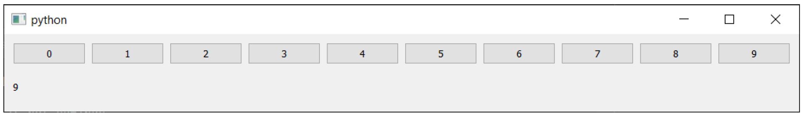
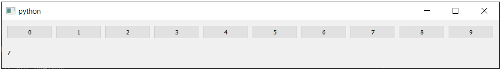

---
prev:
  text: '31. 计时器'
  link: '/FurtherPyQt6Features/31'
next:
  text: '33. 使用相对路径'
  link: '/FurtherPyQt6Features/33'
---

## 32. 自定义信号

我们已经对信号进行了基本介绍，但这只是冰山一角。在本章中，我们将探讨如何创建自己的信号并自定义随信号发送的数据。

## 定制信号

到目前为止，我们只看了 Qt 本身在内置控件上提供的信号。不过，您也可以在自己的代码中使用自定义信号。这是将应用程序的模块部分解耦的好方法，这意味着应用程序的部分可以响应其他地方发生的事情，而无需了解应用程序的结构。


> 需要将应用程序的各个部分分离的一个明显迹象是，使用 `.parent()` 来访问其他无关控件上的数据。但它也适用于任何通过其他对象引用对象的地方，例如：`self.my_other_window.dialog.some_method`。此类代码在修改或重构应用程序时，容易在多个地方出现故障。尽可能避免使用此类代码！

将这些更新放入事件队列中，还可以帮助您保持应用程序的响应性——与使用一个大型更新方法相比，您可以将工作分成多个槽方法，并使用一个信号触发所有这些方法。

您可以使用 PyQt6 提供的 `pyqtSignal` 方法定义自己的信号。信号被定义为类属性，传递 Python 类型（或类型），这些类型将随信号一起发出。您可以为信号选择任何有效的 Python 变量名，并为信号类型选择任何 Python 类型。

*Listing 235. further/signals_custom.py*

```python
import sys

from PyQt6.QtCore import pyqtSignal
from PyQt6.QtWidgets import QApplication, QMainWindow


class MainWindow(QMainWindow):
    
    message = pyqtSignal(str) #1
    value = pyqtSignal(int, str, int) #2
    another = pyqtSignal(list) #3
    onemore = pyqtSignal(dict) #4
    anything = pyqtSignal(object) #5
    
    def __init__(self):
        super().__init__()
        
        self.message.connect(self.custom_slot)
        self.value.connect(self.custom_slot)
        self.another.connect(self.custom_slot)
        self.onemore.connect(self.custom_slot)
        self.anything.connect(self.custom_slot)
        
        self.message.emit("my message")
        self.value.emit(23, "abc", 1)
        self.another.emit([1, 2, 3, 4, 5])
        self.onemore.emit({"a": 2, "b": 7})
        self.anything.emit(1223)
        
    def custom_slot(self, *args):
        print(args)
        
        
app = QApplication(sys.argv)
window = MainWindow()
window.show()

app.exec()
```

> 1. 发出字符串的信号。
> 2. 发出 3 种不同类型的信号。
> 3. 发出列表的信号。
> 4. 发出字典的信号。
> 5. 发出任何东西的信号。

如您所见，信号可以正常连接和发射。您可以发送任何 Python 类型，包括多种类型和复合类型（例如字典、列表）。

如果您将信号定义为 `pyqtSignal(object)`，它将能够传输任何绝对 Python 类型。但通常情况下，这并不是一个好主意，因为接收槽将需要处理所有类型


> 您可以对 QObject 的任何子类创建信号。这包括所有控件，包括主窗口和对话框。

## 修改信号数据

信号连接到槽，槽是每次信号触发时都会运行的函数（或方法）。许多信号还会传输数据，提供有关状态变化或触发信号的控件的信息。接收槽可以使用这些数据对同一信号执行不同的操作。

但是，有一个限制——信号只能发出其设计时指定的数据。以 `QPushButton.clicked` 信号为例，该信号在按钮被点击时触发。*clicked+* 信号会发出单个数据——按钮被点击后的 `_checked` 状态。


> 对于不可选中的按钮，此值始终为 `False`。

槽接收这些数据，但仅此而已。它不知道是哪一个控件触发了它，也不知道该控件的任何信息。通常情况下，这没毛病。您可以将一个特定的控件与一个独特的功能绑定，该功能可以精确地完成该控件所需的操作。但有时，您可能希望添加额外的数据，以便槽方法能够更智能一些。有一个巧妙的小技巧可以做到这一点。

您发送的附加数据可以是触发控件本身，也可以是槽执行信号预期结果所需的一些相关元数据。

### 拦截信号

您无需将信号直接连接到目标槽函数，而是使用一个中间函数来拦截信号，修改信号数据，然后将数据转发到目标槽。如果您在能够访问发出信号的控件的上下文中定义中间函数，则可以将该函数与信号一起传递。

此槽函数必须接受信号发送的值（此处为检查状态），然后调用实际槽，并将任何附加数据作为参数传递。

```python
def fn(checked):
    self.button_clicked(checked, <additional args>)
```

与其像这样定义这个中间函数，您也可以使用 `lambda` 函数在线实现相同的功能。如上所述，它接受一个参数 `checked`，然后调用真正的槽。

```python
lambda checked: self.button_clicked(checked, <additional args>)
```

在这两个示例中，`<additional args>` 可以替换为任何您想要转发到槽的内容。在下面的示例中，我们将 `QPushButton` 对象的 `action` 转发到接收槽。

```python
btn = QPushButton()
btn.clicked.connect( lambda checked: self.button_clicked(checked, btn))
```

我们的 `button_clicked` 槽方法将接收原始的选中值和 `QPushButton` 对象。我们的接收槽可能看起来像这样

```python
# 类方法.
def button_clicked(self, checked, btn):
    # 在此处执行操作.
```


> 您可以重新排列中间函数中的参数顺序，如果您喜欢的话

以下示例展示了实际应用情况，我们的 `button_clicked` 槽接收检查状态和控件对象。在此示例中，我们在处理程序中隐藏了按钮，因此您无法再次点击它！

*Listing 236. further/signals_extra_1.py*

```python
import sys

from PyQt6.QtWidgets import QApplication, QMainWindow, QPushButton


class MainWindow(QMainWindow):
    def __init__(self):
        super().__init__()
        
        btn = QPushButton("Press me")
        btn.setCheckable(True)
        btn.clicked.connect(
            lambda checked: self.button_clicked(checked, btn)
        )
        
        self.setCentralWidget(btn)
        
    def button_clicked(self, checked, btn):
        print(btn, checked)
        btn.hide()
        
        
app = QApplication(sys.argv)

window = MainWindow()
window.show()
app.exec()
```

### 循环问题

以这种方式连接信号的一个常见原因是，当您在循环中构建一系列控件并通过编程连接信号时。遗憾的是，事情并不总是那么简单。

如果您在循环中构建了拦截信号，并希望将循环变量传递给接收槽，您会遇到一个问题。例如，在下面的示例中，我们创建了一系列按钮，并尝试将序列号与信号一起传递。点击按钮应使用按钮的值更新标签

*Listing 237. further/signals_extra_2.py*

```python
import sys

from PyQt6.QtWidgets import (
    QApplication,
    QHBoxLayout,
    QLabel,
    QMainWindow,
    QPushButton,
    QVBoxLayout,
    QWidget,
)


class MainWindow(QMainWindow):
    def __init__(self):
        super().__init__()
        
        v = QVBoxLayout()
        h = QHBoxLayout()
        
        for a in range(10):
            button = QPushButton(str(a))
            button.clicked.connect(
                lambda checked: self.button_clicked(a)
            ) #1
            h.addWidget(button)
        v.addLayout(h)
        self.label = QLabel("")
        v.addWidget(self.label)
        w = QWidget()
        w.setLayout(v)
        self.setCentralWidget(w)
        
    def button_clicked(self, n):
        self.label.setText(str(n))
        
        
app = QApplication(sys.argv)
window = MainWindow()
window.show()
app.exec()
```

> 1. 我们在 `lambda` 表达式中接受 `check` 变量，但会丢弃它。此按钮不可选中，因此它将始终为 `False`。

如果您运行这个程序，您应该会看到问题——无论您点击哪个按钮，标签上显示的都是相同的数字（9）。为什么是9？因为它是循环的最后一个值。



> 图234：无论您按下哪个按钮，标签上始终显示9。

问题就在这里——

```python
for a in range(10):
    button = QPushButton(str(a))
    button.clicked.connect(
        lambda checked: self.button_clicked(a)
    )
```

问题出在行 `lambda: self.button_clicked(a)` 上，我们在这里定义了对最终槽的调用。这里我们传递了 `a`，但它仍然与循环变量绑定。当 `lambda` 被评估时（当信号触发时），`a` 的值将是它在循环结束时的值，因此点击任何一个都会导致发送相同的值（这里为 9）。

解决方案是将值作为命名参数传递。通过这种方式，值在 `lambda` 表达式创建时就被绑定，并且在循环的每次迭代中都会保持 `a` 的值。这样可以确保在每次调用时都使用正确的值。


> 如果这听起来像天书，别担心！只需记住，在使用中间函数时，始终使用命名参数。

```python
lambda checked, a=a: self.button_clicked(a) 
```


> 您不必使用相同的变量名，您可以使用 `lambda val=a: self.button_clicked(val)` 如果更喜欢这样。关键是使用命名参数。

将此内容放入我们的循环中，效果如下：

*Listing 238. further/signals_extra_3.py*

```python
        for a in range(10):
        button = QPushButton(str(a))
        button.clicked.connect(
            lambda checked, a=a: self.button_clicked(a)
        ) #1
        h.addWidget(button)
```

如果您现在运行此操作，您将看到预期行为——单击按钮时，标签中将显示正确值。



> 图235：当您按下按钮时，所按的数字会显示在下方。

以下是使用内联 `lambda` 函数修改 `MainWindow.windowTitleChanged` 信号发送的数据的几个示例。当到达 `.setWindowTitle` 行时，它们都会触发，`my_custom_fn` 槽将输出它们接收到的内容。

*Listing 239. further/signals_extra_4.py*

```python
import sys

from PyQt6.QtWidgets import QApplication, QMainWindow


class MainWindow(QMainWindow):
    def __init__(self):
        super().__init__()
        # SIGNAL：每当窗口标题发生改变时，将调用连接的功能。新标题将传递给该函数.
        self.windowTitleChanged.connect(self.on_window_title_changed)
        # SIGNAL：每当窗口标题发生变化时，都会调用连接的功能。新标题在lambda中被丢弃，该功能在没有参数的情况下被调用.
        self.windowTitleChanged.connect(lambda x: self.my_custom_fn())
        # SIGNAL: 当窗口标题发生变化时，将调用该连接函数。新标题将作为参数传递给该函数，并替换默认参数.
        self.windowTitleChanged.connect(lambda x: self.my_custom_fn(x))
        # SIGNAL: 当窗口标题发生变化时，将调用该连接函数。新标题将传递给该函数并替换默认参数。额外数据将从lambda内部传递.
        self.windowTitleChanged.connect(
            lambda x: self.my_custom_fn(x, 25)
        )
        # 这将设置窗口标题，该标题将触发所有上述信号，将新标题作为第一个参数发送给附加函数或lambda表达式.
        self.setWindowTitle("This will trigger all the signals.")
        # SLOT: 该函数接受一个字符串（例如窗口标题），并将其打印出来.
    def on_window_title_changed(self, s):
        print(s)
        # SLOT: 该函数具有默认参数，因此可以不传入值直接调用.
    def my_custom_fn(self, a="HELLLO!", b=5):
        print(a, b)
        
        
app = QApplication(sys.argv)

window = MainWindow()
window.show()
app.exec()
```

