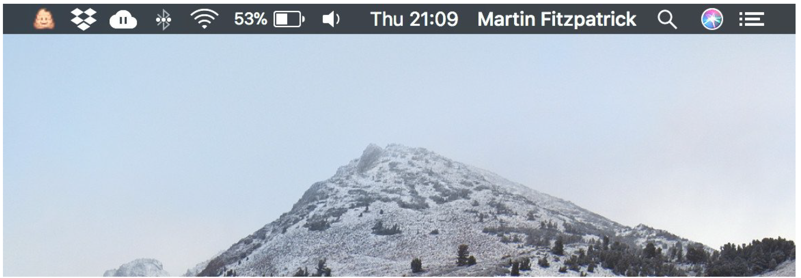
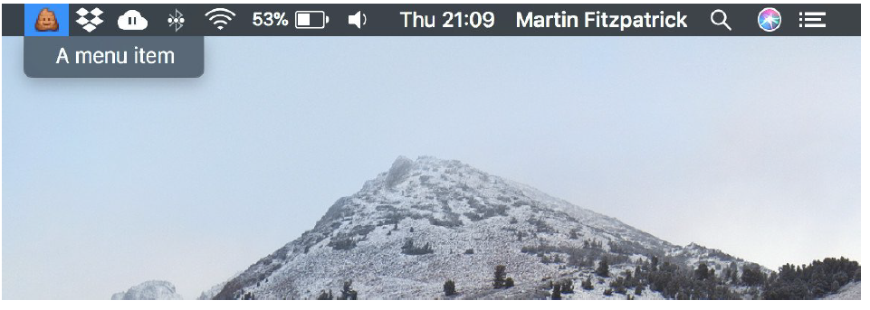
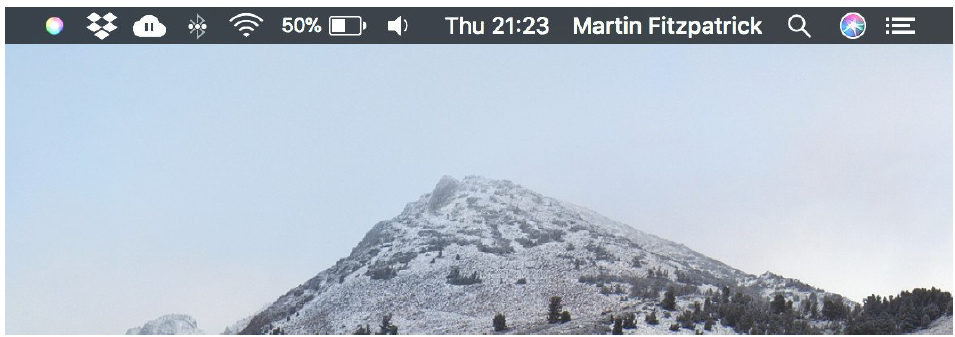
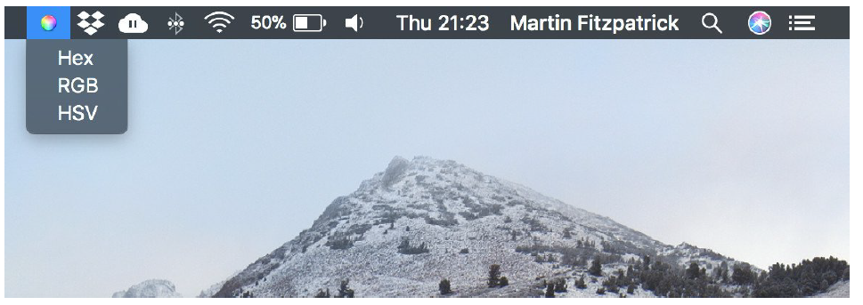
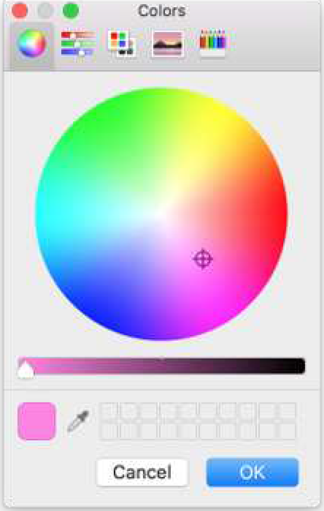
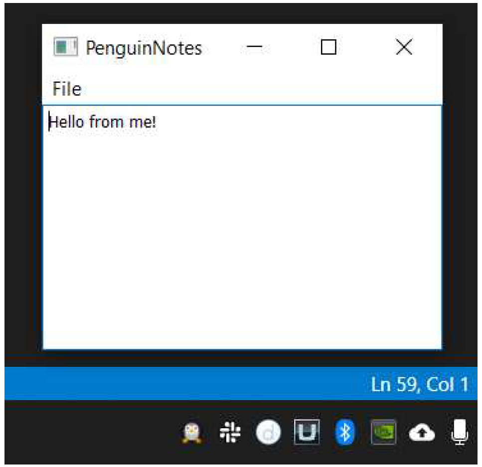

---
prev:
  text: '33. 使用相对路径'
  link: '/FurtherPyQt6Features/33'
next:
  text: '35. 枚举与 Qt 命名空间'
  link: '/FurtherPyQt6Features/35'
---

## 34. 系统托盘与 macOS 菜单

系统托盘应用程序（或菜单栏应用程序）可用于通过少量点击即可访问常见功能。对于完整的桌面应用程序，它们是控制应用程序的便捷方式，无需打开整个窗口。

Qt 提供了一个简单的接口，用于构建跨平台的系统托盘（Windows）或菜单栏（macOS）应用程序。以下是一个最小的可工作示例，用于在工具栏/系统托盘中显示一个图标并附带一个菜单。菜单中的操作尚未连接，因此目前还不会执行任何操作。

*Listing 242. further/systray.py*

```python
import os
import sys

from PyQt6.QtGui import QIcon
from PyQt6.QtWidgets import (
    QAction,
    QApplication,
    QColorDialog,
    QMenu,
    QSystemTrayIcon,
)

basedir = os.path.dirname(__file__)

app = QApplication(sys.argv)
app.setQuitOnLastWindowClosed(False)

# 创建图标
icon = QIcon(os.path.join(basedir, "icon.png"))

# 创建托盘
tray = QSystemTrayIcon()
tray.setIcon(icon)
tray.setVisible(True)

# 创建菜单
menu = QMenu()
action = QAction("A menu item")
menu.addAction(action)

# 在菜单中加入退出选项.
quit = QAction("Quit")
quit.triggered.connect(app.quit)
menu.addAction(quit)

# 将菜单添加到托盘
tray.setContextMenu(menu)

app.exec()
```

您会发现这里没有 `QMainWindow`，因为我们根本没有窗口需要显示。您可以像往常一样创建一个窗口，而不会影响系统托盘图标的行为。


> Qt 的默认行为是在所有活动窗口关闭后关闭应用程序。这不会影响这个示例，但在创建窗口后再关闭它们的应用程序中会成为问题。您可以设置`app.setQuitOnLastWindowClosed(False)` 可阻止此行为，并确保应用程序继续运行。

提供的图标会显示在工具栏中（您可以在系统托盘或菜单栏右侧的图标组左侧看到它）。



> 图236：菜单栏上显示的图标

单击（或在 Windows 上右键单击）图标会显示添加的菜单。



> 图237：菜单栏应用程序菜单

目前这个应用程序还什么都不做，所以在接下来的部分，我们将扩展这个示例，创建一个小型颜色选择器。

以下是一个更完整的示例，使用Qt内置的 `QColorDialog` 来提供一个可通过工具栏访问的颜色选择器。该菜单允许您选择以HTML格式 `#RRGGBB` 、`rgb(R,G,B)` 或 `hsv(H,S,V)` 格式获取所选颜色。

*ing 243. further/systray_color.py*

```python
import os
import sys

from PyQt6.QtGui import QIcon
from PyQt6.QtWidgets import (
    QAction,
    QApplication,
    QColorDialog,
    QMenu,
    QSystemTrayIcon,
)

basedir = os.path.dirname(__file__)


app = QApplication(sys.argv)
app.setQuitOnLastWindowClosed(False)

# 创建图标
icon = QIcon(os.path.join(basedir, "color.png"))

clipboard = QApplication.clipboard()
dialog = QColorDialog()


def copy_color_hex():
    if dialog.exec():
        color = dialog.currentColor()
        clipboard.setText(color.name())
        
        
def copy_color_rgb():
    if dialog.exec():
        color = dialog.currentColor()
        clipboard.setText(
            "rgb(%d, %d, %d)"
            % (color.red(), color.green(), color.blue())
        )
        
        
def copy_color_hsv():
    if dialog.exec():
        color = dialog.currentColor()
        clipboard.setText(
            "hsv(%d, %d, %d)"
            % (color.hue(), color.saturation(), color.value())
        )
        
        
# 创建托盘
tray = QSystemTrayIcon()
tray.setIcon(icon)
tray.setVisible(True)

# 创建菜单
menu = QMenu()
action1 = QAction("Hex")
action1.triggered.connect(copy_color_hex)
menu.addAction(action1)

action2 = QAction("RGB")
action2.triggered.connect(copy_color_rgb)
menu.addAction(action2)

action3 = QAction("HSV")
action3.triggered.connect(copy_color_hsv)
menu.addAction(action3)

quit = QAction("Quit")
quit.triggered.connect(app.quit)
menu.addAction(quit)

# 将菜单添加到托盘中
tray.setContextMenu(menu)

app.exec()
```

与前一个示例类似，本示例中也没有 `QMainWindow`。菜单的创建方式与之前相同，但新增了 3 个用于不同输出格式的操作项。每个操作项都与代表其格式的特定处理函数相连。每个处理函数会显示一个对话框，如果用户选择了颜色，则将该颜色以指定格式复制到剪贴板中。

与之前一样，该图标会出现在工具栏中。



> 图238：工具栏上的颜色选择器

点击图标会显示一个菜单，从中您可以选择要返回的图像格式。



> 图239：颜色选择器菜单

选择格式后，您将看到标准的Qt颜色选择器窗口。



> 图240：系统颜色选择器窗口

选择您想要的颜色并点击确定。所选颜色将以您请求的格式复制到剪贴板。可用的格式将产生以下输出：

| 值                 | 范围  |
| ------------------ | ----- |
| `#a2b3cc`          | 00-FF |
| `rgb(25, 28, 29)`  | 0-255 |
| `hsv(14, 93, 199)` | 0-255 |

## 为完整应用程序添加系统托盘图标

到目前为止，我们已经展示了如何创建一个没有主窗口的独立系统托盘应用程序。然而，有时您可能希望同时拥有一个系统托盘图标和一个窗口。当这样做时，通常可以通过托盘图标打开和关闭（隐藏）主窗口，而无需关闭应用程序。在本节中，我们将探讨如何使用Qt5构建此类应用程序。

原则上来说，这非常简单——创建主窗口，并将一个动作的信号连接到窗口的 `.show()` 方法。

以下是一个名为“PenguinNotes”的小型便签应用程序。运行时，它会在系统托盘或 macOS 工具栏中显示一个小企鹅图标。

点击托盘中的小企鹅图标将显示窗口。该窗口包含一个 `QTextEdit` 编辑器，您可以在其中输入笔记。您可以像往常一样关闭该窗口，或再次点击托盘图标关闭。应用程序将持续在托盘中运行。要关闭应用程序，您可以使用“File › Close“关闭”选项，关闭时将自动保存笔记。

*Listing 244. further/systray_window.py*

```python
import os
import sys

from PyQt6.QtGui import QIcon
from PyQt6.QtWidgets import (
    QAction,
    QApplication,
    QMainWindow,
    QMenu,
    QSystemTrayIcon,
    QTextEdit,
)

basedir = os.path.dirname(__file__)

app = QApplication(sys.argv)
app.setQuitOnLastWindowClosed(False)

# 创建图标
icon = QIcon(os.path.join(basedir, "animal-penguin.png"))

# 创建托盘
tray = QSystemTrayIcon()
tray.setIcon(icon)
tray.setVisible(True)


class MainWindow(QMainWindow):
    def __init__(self):
        super().__init__()
        
        self.editor = QTextEdit()
        self.load() # Load up the text from file.
        
        menu = self.menuBar()
        file_menu = menu.addMenu("&File")
        
        self.reset = QAction("&Reset")
        self.reset.triggered.connect(self.editor.clear)
        file_menu.addAction(self.reset)
        
        self.quit = QAction("&Quit")
        self.quit.triggered.connect(app.quit)
        file_menu.addAction(self.quit)
        
        self.setCentralWidget(self.editor)
        
        self.setWindowTitle("PenguinNotes")
        
    def load(self):
        with open("notes.txt", "r") as f:
            text = f.read()
        self.editor.setPlainText(text)
        
    def save(self):
        text = self.editor.toPlainText()
        with open("notes.txt", "w") as f:
            f.write(text)
            
    def activate(self, reason):
        if (
            reason == QSystemTrayIcon.ActivationReason.Trigger
        ): # 图标被点击.
            self.show()


w = MainWindow()

tray.activated.connect(w.activate)
app.aboutToQuit.connect(w.save)

app.exec()
```


> 在 macOS 上，“退出”操作会出现在应用程序菜单中（位于最左侧，与应用程序名称并列），而非文件菜单。如果我们没有同时添加“File › Reset”操作，文件菜单将为空且隐藏（您不妨试试看！）

以下是笔记应用程序的屏幕截图，窗口处于打开状态。



> 图241：笔记编辑器窗口

显示和隐藏窗口的控制通过我们的 `QMainWindow` 上的 `activate` 方法滑块来实现。这与代码底部的托盘图标 `.activated` 信号相连，使用 `tray.activated.connect(w.activate)` 实现。

```python
    def activate(self, reason):
        if reason == QSystemTrayIcon.Trigger: # 图标被点击.
            if self.isVisible():
                self.hide()
            else:
                self.show()
```

该信号在许多不同情况下都会被触发，因此我们必须首先检查以确保我们只使用 `QSystemTrayIcon.Trigger`。

| 原因                          | 值   | 描述                                                         |
| ----------------------------- | ---- | ------------------------------------------------------------ |
| `QSystemTrayIcon.Unknown`     | 0    | 未知原因                                                     |
| `QSystemTrayIcon.Context`     | 1    | 上下文菜单请求（macOS为单击，Windows为右键单击）             |
| `QSystemTrayIcon.DoubleClick` | 2    | 图标被双击。在 macOS 上，双击仅在未设置上下文菜单时触发，因为菜单在单击时打开。 |
| `QSystemTrayIcon.Trigger`     | 3    | 图标被单击一次                                               |
| `QSystemTrayIcon.MiddleClick` | 4    | 图标被鼠标中键点击                                           |

通过监听这些事件，您应该能够构建任何类型的系统托盘行为。然而，请务必在所有目标平台上测试该行为。
