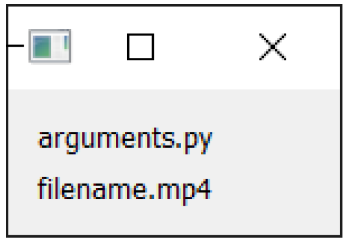

---
prev:
  text: '35. 枚举与 Qt 命名空间'
  link: '/FurtherPyQt6Features/35'
next:
  text: '37. 使用PyInstaller进行打包'
  link: '/PackagingAndDistribution/37'
---

## 36. 使用命令行参数

如果您创建了一个与特定文件类型配合使用的应用程序——例如一个视频编辑器，它可以打开视频文件，一个文档编辑器，它可以打开文档文件——让您的应用程序自动打开这些文件可能会很有用。在所有平台上，当您告诉操作系统使用特定的应用程序打开一个文件时，要打开的文件名会被作为命令行参数传递给该应用程序。

当您的应用程序运行时，传递给应用程序的参数始终可在 `sys.argv` 中找到。要自动打开文件，你可以在启动时检查 `sys.argv` 的值，如果其中包含文件名，则打开该文件。

以下应用程序运行时将打开一个窗口，显示所有接收到的命令行参数。

*Listing 245. further/arguments.py*

```python
from PyQt6.QtWidgets import (
    QApplication,
    QWidget,
    QLabel,
    QVBoxLayout,
)

import sys


class Window(QWidget):
    def __init__(self):
        super().__init__()
        
        layout = QVBoxLayout()
        
        for arg in sys.argv: #1
            l = QLabel(arg)
            layout.addWidget(l)
            
        self.setLayout(layout)
        self.setWindowTitle("Arguments")
        
        
app = QApplication(sys.argv)
w = Window()
w.show()

app.exec()
```

> 1. `sys.argv` 是一个字符串列表。所有参数都是字符串。

从命令行运行此应用程序，并传入一个文件名（您可以随意编造，我们不会加载它）。您可以传入任意数量的参数，多或少都行。

参数以字符串列表的形式传递给您的应用程序。所有参数都是字符串，即使是数值参数也是如此。您可以使用常规列表索引访问任何参数——例如，`sys.argv[1]` 将返回第二个参数。

您可以尝试运行上述脚本，并使用以下内容：

```bash
python arguments.py filename.mp4
```

这将生成下面的窗口。请注意，当使用 Python 运行时，第一个参数实际上是正在执行的 Python 文件。



> 图242：窗口打开，显示命令行参数。

如果您将应用程序打包用于分发，情况可能不再是这样——第一个参数现在可能是您正在打开的文件，因为没有作为参数传递的 Python 文件。这可能会导致问题，但一个简单的解决方法是将传递给应用程序的最后一个参数用作文件名，例如：

```python
if len(sys.argv) > 0:
    filename_to_open = sys.argv[-1]
```

或者，您可以从列表中移除当前正在执行的脚本名称。当前正在执行的 Python 脚本名称始终可在 `__file__` 中获取。

```python
if __file__ in sys.argv:
    sys.argv.remove(__file__)
```


> 它将始终出现在列表中，除非您已打包您的应用程序。

以下是一个进一步的示例，其中我们在命令行上接受一个文件名，然后打开该文本文件并在`QTextEdit`中显示。

*Listing 246. further/arguments_open.py*

```python
from PyQt6.QtWidgets import QApplication, QMainWindow, QTextEdit

import sys


class MainWindow(QMainWindow):
    def __init__(self):
        super().__init__()
        
        self.editor = QTextEdit()
        
        if __file__ in sys.argv: #1
            sys.argv.remove(__file__)
                            
        if sys.argv: #2
            filename = sys.argv[0] #3
            self.open_file(filename)
                            
        self.setCentralWidget(self.editor)
        self.setWindowTitle("Text viewer")
        
    def open_file(self, fn):
                            
        with open(fn, "r") as f:
            text = f.read()
                            
        self.editor.setPlainText(text)
                            
                            
app = QApplication(sys.argv)
w = MainWindow()
w.show()

app.exec()
```

> 1. 如果脚本名称在 `sys.argv` 中，则将其移除。
> 2. 如果 `sys.argv` 中仍有内容（不为空）。
> 3. 将第一个参数作为要打开的文件名。

您可以按照以下方式运行此命令，以查看传入的文本文件。

```bash
python arguments_open.py notes.txt
```

