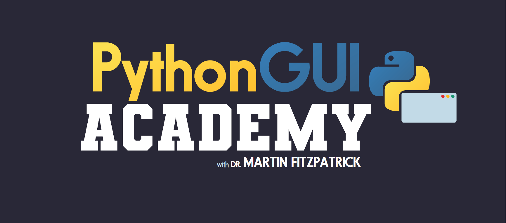

---
prev:
  text: '1. 图形用户界面（GUI）简史'
  link: '/Introduction/1'
next:
  text: '3. 我的第一个应用程序'
  link: '/BasicPyQt6Features/3'
---

## 2. 关于Qt的一点小知识

Qt 是一个免费且开源的控件工具包，用于创建跨平台图形用户界面应用程序，可以允许应用程序使用单一代码库针对 Windows、macOS、Linux 和 Android 等多个平台进行开发。但 Qt 远远不止是一个控件工具包，它还内置了对多媒体、数据库、矢量图形和 MVC 接口的支持，因此更准确地说，它是一个应用程序开发框架。

Qt 是由 Eirik Chambe-Eng 和 Haavard Nord 在 1991 年创立的，他们还在 1994 年成立了首家 Qt 公司 *Trolltech*。目前，Qt 由 *The Qt Company* 负责开发，并持续进行定期更新，不断添加新功能并扩展移动设备及跨平台支持。

### Qt 和 PyQt6

PyQt6 是由 *Riverbank Computing* 开发的 Qt 工具包的 Python 绑定库。当你使用 PyQt6 编写应用程序时，实际上是在使用 Qt 编写应用程序。PyQt6 库实际上是围绕 C++ Qt 库的封装，这使得它可以在 Python 中使用。

由于这是一个用于访问 C++ 库的 Python 接口，因此 PyQt6 中使用的命名约定
并不遵循 PEP8 标准。例如，函数和变量使用混合大小写`mixedCase`而不是蛇形大小写`snake_case`进行命名。您是否在自己的应用程序中遵循这个标准完全取决于您自己，然而我发现继续遵循 Python 标准来编写自己的代码有助于明确PyQt6 的代码与您自己的代码之间的区别。

最后，虽然有专门针对 PyQt6 的文档，但您经常会发现自己需要阅读 Qt 的官方文档，因为它的内容更加全面。如果您需要将 Qt C++ 代码转换为 Python 代码的建议，可以参考附录B:将c++代码实例转化为Python

### 更新和其他资源

本书定期更新。 如果您直接从我这里购买本书，您将会收到自动更新的电子版。 如果您在其他地方购买了本书，请将您的收据发送至 register@pythonguis.com，以获得最新的数字版本，并且注册以获得未来的更新。

您可能也有兴趣加入我的 Python GUI 学院，我在那里提供了以下视频视频教程，内容涵盖本书及其他内容！

> 加入academy.pythonguis.com ！