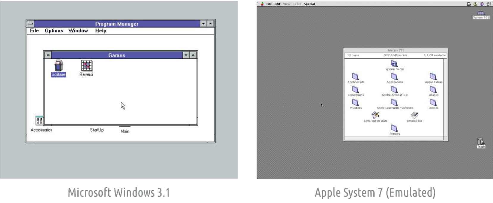

# 引言

如果您想使用 Python 创建图形用户界面（GUI）应用程序，可能会感到无从下手。因为需要理解许多新概念才能让程序正常运行。但就像解决任何编程问题一样，第一步是学会以正确的方式面对问题。本书将从 GUI 开发的基楚原理出发，逐步引导您使用 PyQt6 创建自己的功能齐全的桌面应用程序。

本书的第一版于2016年发布。此后，它已被更新14次，根据读者反馈添加和扩展了章节。现在可用的PyQt资源比我一开始的时候更加丰富，但仍然缺乏深入、实用的指南来构建完整的应用程序。这本书填补了这一空白！

本书以一系列章节的形式呈现，依次探讨PyQt6的不同方面。我将较简单的章节放在前面，但如果您有特定的项目需求，无需拘泥于顺序。每个章节都会先引导您掌握基础概念，随后通过一系列代码示例逐步探索并学习如何自行应用这些理念。

您可以从[http://www.pythonguis.com/d/pyqt6-source.zip](http://www.pythonguis.com/d/pyqt6-source.zip)下载本书的源代码和有关资源

由于本书篇幅有限，无法对整个Qt生态系统进行全面概述，因此书中提供了指向外部资源的链接——既包括网站[pythonguis.com](https://www.pythonguis.com/)上的内容，也包括其他的来源。如果您在阅读时想到“我不知道我能否做到这一点”，最好的办法就是放下这本书，然后去亲自尝试！在整个过程中，请务必定期备份您的代码，这样如果您不小心搞砸了，至少还有东西可以恢复。

整本书都会有这样的方框，这个标识意味着提供信息、提示和警告。如果您赶时间，可以放心地跳过所有这些方框。但是，阅读它们会让您对Qt 框架知识有更深入、更全面的了解。

## 1. 图形用户界面（GUI）简史

 **图形用户界面**（GUI，Graphical User Interface）有着悠久而古老的历史，可追溯到
20 世纪 60 年代。 斯坦福大学的 NLS（ON-Line 系统）引入了鼠标和窗口概念。并在 1968 年首次公开展示。 随后，1973 年施乐 PARC Smalltalk 系统也采用图形用户界面，它是大多数现代图形用户界面的基础。

这些早期系统已经具备了我们如今在现代桌面图形用户界面中习以为常的许多功能，包括窗口、菜单、单选按钮、复选框和图标。这些功能的组合使得我们为这类界面创造了早期缩写词：WIMP（窗口、图标、菜单、指点设备——即鼠标）。

1979年，首款搭载图形用户界面的商用系统——PERQ工作站正式发布。这促使了其他多项GUI开发项目，其中，最引人注目的是1983年发布的*Apple Lisa*，该系统引入了菜单栏和窗口控制概念，以及来自雅达利（GEM）和阿米加的其他系统。在UNIX系统中，*X Window*于1984年问世，而面向个人电脑的Windows首个版本则于1985年发布。

> 图一：微软的Windows3.1系统（1992）的桌面和苹果系统Apple System 7（1991）的桌面

早期图形用户界面并未像人们想象的那样一炮而红，这主要是因为其发布时缺乏兼容的软件，且硬件要求较高——尤其是对家庭用户而言。然而，随着时间的推移，图形用户界面范式逐渐成为与计算机交互的首选方式，而WIMP（窗口、指针、菜单、按钮） 范式也牢固确立为行业标准。这并不意味着桌面环境没有尝试过取代WIMP范式。例如，微软的*Microsoft Bob*（1995）就是微软备受批评的尝试，试图用一个房子来取代桌面。

> 图二：微软试图抛弃桌面范式转而使用一种卡通的房子

自从*Windows 95*（1995）发布以来，一直到*Mac OS X*（2001）、*GNOME Shell*（2011）和*Windows 10*（2015），被誉为革命性的用户界面层出不穷。这些系统均对各自的用户界面进行了全面改造，它们往往伴随着大量宣传，但本质上并没有发生根本性变化。这些用户界面仍然是典型的WIMP系统，它们的运作方式与自20世纪80年代以来图形用户界面的运作方式基本相同。

当革命来临时，它是移动的——鼠标已被触控取代，窗口已被全屏应用取代。但即使在我们所有人都随身携带智能手机的今天，每天仍然有大量的工作是在台式电脑上完成的。WIMP在40多年中的创新中幸存下来，并有希望继续生存下去。

## 2. 关于Qt的一点小知识

Qt 是一个免费且开源的控件工具包，用于创建跨平台图形用户界面应用程序，可以允许应用程序使用单一代码库针对 Windows、macOS、Linux 和 Android 等多个平台进行开发。但 Qt 远远不止是一个控件工具包，它还内置了对多媒体、数据库、矢量图形和 MVC 接口的支持，因此更准确地说，它是一个应用程序开发框架。

Qt 是由 Eirik Chambe-Eng 和 Haavard Nord 在 1991 年创立的，他们还在 1994 年成立了首家 Qt 公司 *Trolltech*。目前，Qt 由 *The Qt Company* 负责开发，并持续进行定期更新，不断添加新功能并扩展移动设备及跨平台支持。

### Qt 和 PyQt6

PyQt6 是由 *Riverbank Computing* 开发的 Qt 工具包的 Python 绑定库。当你使用 PyQt6 编写应用程序时，实际上是在使用 Qt 编写应用程序。PyQt6 库实际上是围绕 C++ Qt 库的封装，这使得它可以在 Python 中使用。

由于这是一个用于访问 C++ 库的 Python 接口，因此 PyQt6 中使用的命名约定
并不遵循 PEP8 标准。例如，函数和变量使用混合大小写`mixedCase`而不是蛇形大小写`snake_case`进行命名。您是否在自己的应用程序中遵循这个标准完全取决于您自己，然而我发现继续遵循 Python 标准来编写自己的代码有助于明确PyQt6 的代码与您自己的代码之间的区别。

最后，虽然有专门针对 PyQt6 的文档，但您经常会发现自己需要阅读 Qt 的官方文档，因为它的内容更加全面。如果您需要将 Qt C++ 代码转换为 Python 代码的建议，可以参考附录B:将c++代码实例转化为Python

## 更新和其他资源

本书定期更新。 如果您直接从我这里购买本书，您将会收到自动更新的电子版。 如果您在其他地方购买了本书，请将您的收据发送至 register@pythonguis.com，以获得最新的数字版本，并且注册以获得未来的更新。

您可能也有兴趣加入我的 Python GUI 学院，我在那里提供了以下视频视频教程，内容涵盖本书及其他内容！

> 加入academy.pythonguis.com ！

