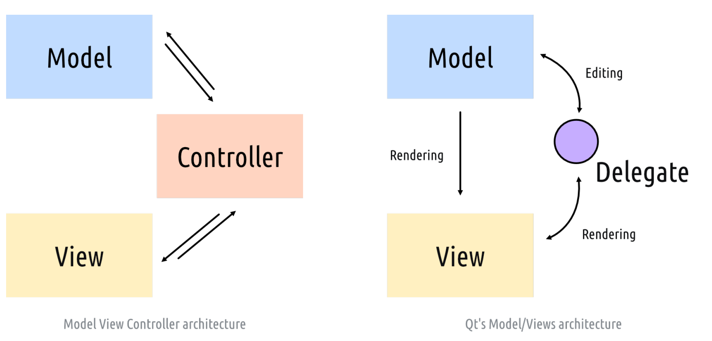

---
prev:
  text: '16. Qt 样式表 (QSS)'
  link: '/Theming/16'
next:
  text: '18. 一个简单的模型视图——待办事项列表'
  link: '/ModelViewArchitecture/18'
---

> …只要设计得当，这些功能就能以较低的成本实现。
>
> ——丹尼斯·里奇(Dennis Ritchie，C语言之父)

当您开始使用 PyQt6 构建更复杂的应用程序时，您可能会遇到将控件与数据保持同步的问题。

存储在控件（例如简单的 `QListWidget`）中的数据在 Python 中难以操作——更改需要先获取项目、获取数据，然后再将其设置回原位。对此问题的默认解决方案是在 Python 中保留外部数据表示形式，然后将更新复制到数据和控件，或者直接根据数据重写整个控件。当您开始处理较大的数据时，这种方法可能会对应用程序的性能产生影响。

幸运的是，Qt 为此提供了一个解决方案——ModelViews(模型视图架构)。ModelViews 是标准显示控件的强大替代方案，它使用标准化的模型接口与数据源进行交互——从简单的数据结构到外部数据库。这可以隔离您的数据，意味着您可以将其保存在任何您喜欢的结构中，而视图则负责呈现和更新。

本章介绍了Qt模型视图架构的关键方面，并利用它在PyQt6中构建一个简单的桌面待办事项应用程序。

## 17. 模型视图架构 —— 模型视图控制器

模型-视图-控制器（Model–View–Controller, MVC）是一种用于开发用户界面的架构模式。它将应用程序划分为三个相互关联的部分，将数据的内部表示与数据如何呈现给用户以及如何从用户接收数据分离。

MVC模式将界面划分为以下组件——

- **模型**，包含应用程序正在处理的数据结构。
- **视图**是向用户展示的任何信息表示形式，无论是图形还是表格。同一数据可以有多个视图。
- **控制器**接受用户输入，将其转换为命令并应用于模型或视图。

在 Qt 领域，视图与控制器之间的区别有些模糊。Qt 通过操作系统接受来自用户的输入事件，并将这些事件委托给控件（控制器）进行处理。然而，控件也会将自己的状态滑块呈现给用户，因此它们完全属于视图。与其纠结于如何划分界限，Qt 更倾向于将视图与控制器视为一个整体。然而，控件也处理向用户显示自己的状态，将它们直接放在视图中。与其纠结于如何划分界限，不如在 Qt 中将视图和控制器合并在一起，创建一个模型/视图控制器架构——为了简单起见，称为“模型视图”。

> 图133：MVC 模型与 Qt 模型/视图架构的比较

重要的是，数据本身与数据呈现方式之间的区别得到了保留。

## 模型视图

模型充当数据存储与视图控制器之间的接口。模型存储数据（或对其的引用），并通过一个标准化的 API (应用程序接口)将这些数据呈现出来，视图随后消费并将其呈现给用户。多个视图可以共享相同的数据，并以完全不同的方式呈现它。

您可以使用任何“数据存储”来构建模型，例如标准的Python列表或字典，或数据库（通过Qt本身或SQLAlchemy）——这完全由您决定。

这两个部分主要负责——

1. **模型**存储数据或对数据的引用，并返回单个或记录的范围，以及相关的元数据或显示指令。
2. **视图**从模型请求数据，并将返回的结果显示在控件上。
