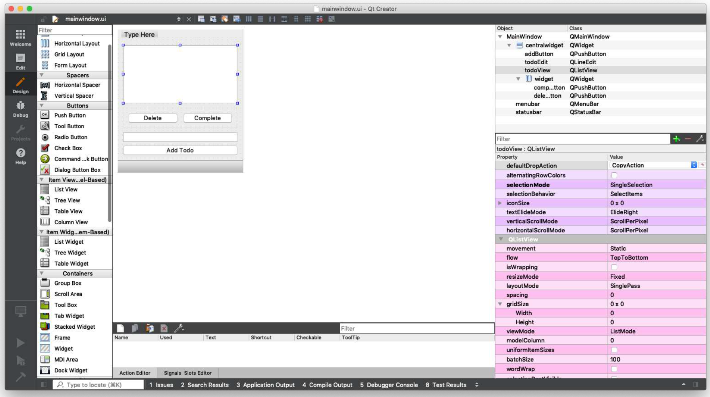
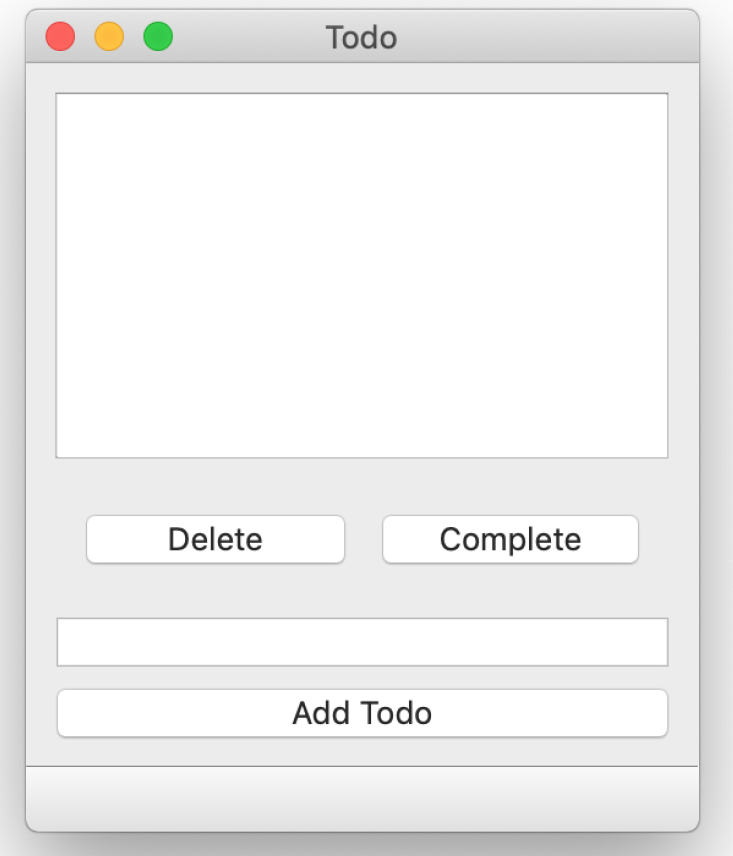
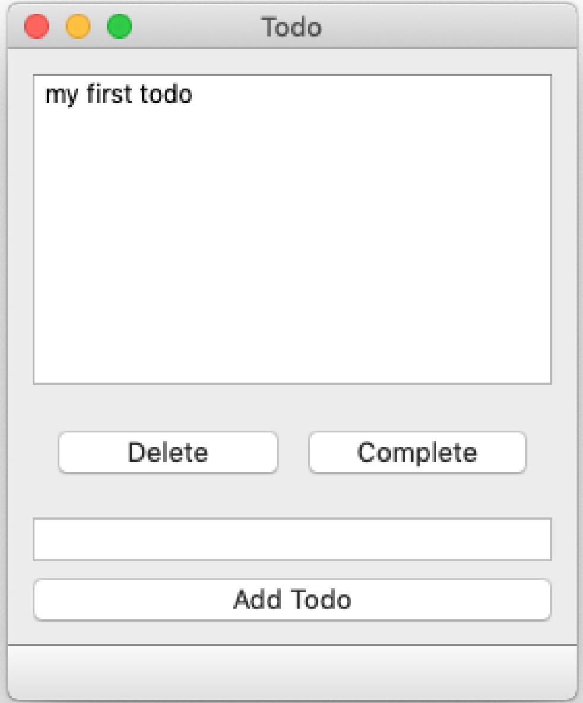
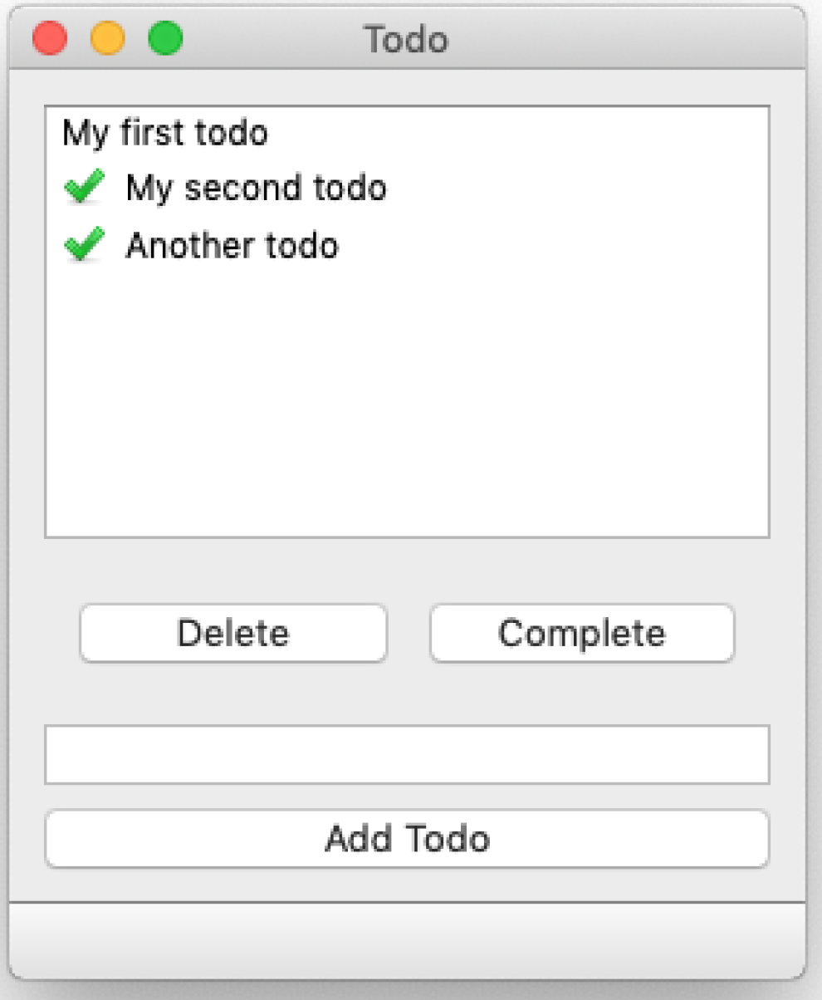

---
prev:
  text: '17. 模型视图架构 —— 模型视图控制器'
  link: '/ModelViewArchitecture/17'
next:
  text: '19. 使用numpy和pandas处理模型视图中的表格数据'
  link: '/ModelViewArchitecture/19'
---

## 18. 一个简单的模型视图——待办事项列表

为了演示如何在实际中使用 ModelViews ，我们将实现一个非常简单的桌面待办事项列表。该列表将包含一个 `QListView` 用于显示待办事项列表，一个 `QLineEdit` 用于输入新事项，以及一组按钮用于添加、删除或标记事项为已完成。


> 本示例的文件位于源代码中。

## 用户界面

该简洁的用户界面使用Qt Creator进行布局，并保存为 `mainwindow.ui` 文件。该 `.ui` 文件已包含在本书的下载内容中。



> 图134：在Qt Creator中设计用户界面

请您按照之前所述，使用命令行工具将 `.ui` 文件转换为 Python 文件。

这将生成一个名为 `MainWindow.py` 的文件，其中包含我们在 Qt Designer 中设计的自定义窗口类。该文件可像普通文件一样导入到我们的应用程序代码中——一个用于显示用户界面的基本骨架应用程序示例如下所示：

*Listing 95. model-views/todo_skeleton.py*

```python
import sys

from PyQt6 import QtCore, QtGui, QtWidgets
from PyQt6.QtCore import Qt

from MainWindow import Ui_MainWindow


class MainWindow(QtWidgets.QMainWindow, Ui_MainWindow):
    def __init__(self):
        super().__init__()
        self.setupUi(self)
        
        
app = QtWidgets.QApplication(sys.argv)
window = MainWindow()
window.show()
app.exec()
```

> 🚀 **运行它吧！** 您会看到窗口弹出，不过目前还无法使用任何功能



> 图135：主窗口

界面中的控件被赋予了下表中所示的 ID：

| 对象名称         | 类型          | 描述                                             |
| ---------------- | ------------- | ------------------------------------------------ |
| `todoView`       | `QListView`   | 当前待办事项列表                                 |
| `todoEdit`       | `QLineEdit`   | 创建新待办事项的文本输入框                       |
| `addButton`      | `QPushButton` | 创建新的待办事项，将其添加到待办事项列表中       |
| `deleteButton`   | `QPushButton` | 删除当前选中的待办事项，将其从待办事项列表中移除 |
| `completeButton` | `QPushButton` | 将当前选中的待办事项标记为已完成                 |

我们将使用这些标识符在后续步骤中与应用程序逻辑进行关联。

## 模型

我们通过从基础实现类继承来定义自定义模型，从而能够专注于模型中独特的部分。Qt 提供了多种不同的模型基础类，包括列表、树和表格（适用于电子表格）。

在此示例中，我们将结果显示到 `QListView` 中。与此对应的基础模型是  `QAbstractListModel`。我们的模型轮廓定义如下：

*Listing 96. model-views/todo_1.py*

```python
class TodoModel(QAbstractListModel):
    def __init__(self, todos=None):
        super().__init__()
        self.todos = todos or []
        
    def data(self, index, role):
        if role == Qt.ItemDataRole.DisplayRole:
            status, text = self.todos[index.row()]
            return text
        
    def rowCount(self, index):
        return len(self.todos)
```

`.todos` 变量是我们的数据存储。`rowcount()` 和 `data()` 方法是列表模型必须实现的标准模型方法。我们将在下面依次介绍这些方法。

### .todos list

我们的模型数据存储为 `.todos`，这是一个简单的 Python 列表，其中我们将存储一个元组，格式为 `[(bool, str), (bool, str), (bool, str)]`，其中 `bool` 表示条目的完成状态，`str` 表示待办事项的文本内容。

我们在启动时将 `self.todo` 初始化为空列表，除非通过 `todos` 关键字参数传入了一个列表。


> 如果提供的 `todos` 为真（即除空列表、布尔值 `False` 或默认值 None 以外的任何值），`self.todos = todos or []` 就会将 `self.todos` 设置为这个值，否则会将其设置为空列表 `[]`。

要创建此模型的实例，我们可以简单地执行以下操作：

```python
model = TodoModel() #创建一个空的待办事项列表
```

或者传递一个现有的列表：

```python
todos = [(False, 'an item'), (False, 'another item')]
model = TodoModel(todos)
```

### .rowcount()

`.rowcount()` 方法由视图调用，用于获取当前数据中的行数。视图需要此信息以确定其可从数据存储中请求的最大索引（`rowcount - 1`）。由于我们使用 Python 列表作为数据存储，该方法的返回值即为列表的 `len()` 值。

### .data()

这是模型的核心，它处理来自视图的数据请求，并返回相应的结果。它接收两个参数 `index` 和 `role`。

`index` 是视图请求的数据的位置/坐标，可通过两种方法 `.row()` 和 `.column()` 获取每个维度中的位置。对于列表视图，列可以忽略。


> 对于我们的 `QListView`，列始终为0，可以忽略。但是，对于2D数据，例如在电子表格视图中，您需要使用此列。

`role` 是一个标志，指示视图请求的数据类型。这是因为 `.data()` 方法实际上承担的责任不仅仅是核心数据。它还处理样式信息、工具提示、状态栏等请求——基本上是任何可以由数据本身提供的信息。

`Qt.ItemDataRole.DisplayRole` 的命名有些奇怪，但这表明视图正在向我们请求“请提供要显示的数据”。`data` 还可以接收其他角色，以进行样式设置或请求“可编辑”格式的数据。

| 角色                             | 值   | 描述                                                         |
| -------------------------------- | ---- | ------------------------------------------------------------ |
| `Qt.ItemDataRole.DisplayRole`    | `0`  | 以文本形式渲染的关键数据。 [QString](https://doc.qt.io/qt-5/qstring.html) |
| `Qt.ItemDataRole.DecorationRole` | `1`  | 要以图标形式渲染为装饰的数据。[QColor](https://doc.qt.io/qt-5/qcolor.html)、[QIcon](https://doc.qt.io/qt-5/qicon.html) 或 [QPixmap](https://doc.qt.io/qt-5/qpixmap.html) |
| `Qt.ItemDataRole.EditRole`       | `2`  | 以适合在编辑器中编辑的格式呈现的数据。 [QString](https://doc.qt.io/qt-5/qstring.html) |
| `Qt.ItemDataRole.ToolTipRole`    | `3`  | 项目工具提示中显示的数据. [QString](https://doc.qt.io/qt-5/qstring.html) |
| `Qt.ItemDataRole.StatusTipRole`  | `4`  | 状态栏中显示的数据.[QString](https://doc.qt.io/qt-5/qstring.html) |
| `Qt.ItemDataRole.WhatsThisRole`  | `5`  | 在“这是什么？”模式下显示的项目数据.[QString](https://doc.qt.io/qt-5/qstring.html) |
| `Qt.ItemDataRole.SizeHintRole`   | `13` | 用于提供给视图的项的尺寸提示. [Qsize](https://doc.qt.io/qt-5/qsize.html) |

要查看可用的所有角色列表，请参阅 [Qt ItemDataRole 文档](https://doc.qt.io/qt-5/qt.html#ItemDataRole-enum)。我们的待办事项列表仅使用 `Qt.ItemDataRole.DisplayRole` 和 `Qt.ItemDataRole.DecorationRole`。

## 基本实现

下面的代码展示了我们在应用程序骨架中创建的基本模型，该模型包含将模型显示在界面的必要代码——尽管目前它是空的！我们将在此基础上添加模型代码和应用程序逻辑。

*Listing 97. model-views/todo_1b.py*

```python
import sys

from PyQt6.QtCore import QAbstractListModel, Qt
from PyQt6.QtWidgets import QApplication, QMainWindow

from MainWindow import Ui_MainWindow


class TodoModel(QAbstractListModel):
    def __init__(self, todos=None):
        super().__init__()
        self.todos = todos or []
        
    def data(self, index, role):
        if role == Qt.ItemDataRole.DisplayRole:
            status, text = self.todos[index.row()]
            return text
        
    def rowCount(self, index):
        return len(self.todos)
    
class MainWindow(QMainWindow, Ui_MainWindow):
    def __init__(self):
        super().__init__()
        self.setupUi(self)
        self.model = TodoModel()
        self.todoView.setModel(self.model)
        
        
app = QApplication(sys.argv)
window = MainWindow()
window.show()
app.exec()
```

我们按照之前的方式定义`TodoModel` 并初始化 `MainWindow` 对象。在 `MainWindow` 的`__init__`方法中，我们创建 `TodoModel` 的实例并将其设置为 `todo_view`。将此文件保存为 `todo.py` 并使用以下命令运行：

```python
python3 todo.py
```

虽然目前还看不到太多内容，但 `QListView` 和我们的模型实际上已经开始工作了。如果您在`MainWindow` 类中的 `TodoModel` 中添加一些默认数据，您就会看到它出现在列表中。

```python
self.model = TodoModel(todos=[(False, 'my first todo')])
```



> 图136：QListView 显示硬编码的待办事项

您可以继续手动添加项目，它们将按顺序显示在 `QListView` 中。接下来，我们将实现从应用程序内部添加项目的功能。

首先在 `MainWindow` 上创建一个名为 `add` 的新方法。这是我们的回调函数，它将负责将输入中的当前文本作为新待办事项添加。将此方法连接到 `__init__` 块末尾的 `addButton.pressed` 信号。

*Listing 98. model-views/todo_2.py*

```python
class MainWindow(QMainWindow, Ui_MainWindow):
    def __init__(self):
        super().__init__()
        self.setupUi(self)
        self.model = TodoModel()
        self.todoView.setModel(self.model)
        # 连接到按钮.
        self.addButton.pressed.connect(self.add)
        
    def add(self):
        """
        将一项内容添加到我们的待办事项列表中，从 QLineEdit .todoEdit 中获取文本，然后清除它。
        """
        text = self.todoEdit.text()
        # 清楚字符串末尾的尾随空格
        text = text.strip()
        if text: # 不要添加空字符串
            # 通过模型访问该列表
            self.model.todos.append((False, text))
            # 触发刷新
            self.model.layoutChanged.emit() #1
            # 清空输入(input)
            self.todoEdit.setText("")
```

> 1. 这里，我们发出一个模型信号 `.layoutChanged`，让视图知道数据的形状已经改变。这会触发整个视图的刷新。如果您省略了这一行，待办事项仍然会被添加，但 `QListView` 不会更新。

如果只是数据发生了改变，但行/列数未受影响，则可以使用 `.dataChanged()` 信号。这也会使用左上角和右下角的位置来定义数据中发生改变的区域，以避免重新绘制整个视图。

## 连接其他操作

现在，我们可以连接按钮的其余信号，并添加辅助函数来执行删除和完成操作。我们像之前一样将按钮信号添加到 `__init__` 块中。

```python
        self.addButton.pressed.connect(self.add)
        self.deleteButton.pressed.connect(self.delete)
        self.completeButton.pressed.connect(self.complete)
```

然后定义一个新的 `delete` 方法，如下所示 ——

*Listing 99. model-views/todo_3.py*

```python
class MainWindow(QMainWindow, Ui_MainWindow):
    
    def delete(self):
        indexes = self.todoView.selectedIndexes()
        if indexes:
            # 索引是一个单选模式下的单项列表
            index = indexes[0]
            # 删除该项并刷新
            del self.model.todos[index.row()]
            self.model.layoutChanged.emit()
            # 清除选中项（因其已不再有效）
            self.todoView.clearSelection()
```

我们使用 `self.todoView.selectedIndexes` 来获取索引（实际上是一个单项列表，因为我们处于单选模式），然后使用 `.row()` 作为索引进入我们模型上的待办事项列表。我们使用 Python 的 `del` 操作符删除索引项，然后触发 `layoutChanged` 信号，因为数据的形状已经发生了改变。

最后，我们清除活动选择，因为您选择的项现在已不存在，且该位置本身可能已超出范围（如果您选择了最后一个项）。


> 您可以让操作更智能一些，改为选择列表中相邻的项。

`complete` 方法如下所示 —

*Listing 100. model-views/todo_4.py*

```python
class MainWindow(QMainWindow, Ui_MainWindow):
    def complete(self):
        indexes = self.todoView.selectedIndexes()
        if indexes:
            index = indexes[0]
            row = index.row()
            status, text = self.model.todos[row]
            self.model.todos[row] = (True, text)
            # .dataChanged 方法接受左上角和右下角坐标，且这两个坐标相等。
            # 对于单一选择。
            self.model.dataChanged.emit(index, index)
            # 清除选中内容（因其已不再有效）。
            self.todoView.clearSelection()
```

这与删除操作使用相同的索引，但这次我们从模型 `.todos` 列表中获取该项，然后将状态替换为 `True`。


> 我们必须进行这种查找替换操作，因为我们的数据以Python元组的形式存储，元组是不可变的。

与标准 Qt 控件的关键区别在于，我们直接对数据进行更改，只需通知 Qt 发生了某些更改即可——控件状态的更新由滑块自动完成。

## 使用 DecorationRole

如果您运行该应用程序，您会发现添加和删除功能均可正常使用，但尽管完成项的功能正常，视图中却没有相应的显示提示。我们需要更新模型，为视图提供一个指示器，用于显示项已完成的状态。更新后的模型如下所示。

*Listing 101. model-views/todo_5.py*

```python
import os

basedir = os.path.dirname(__file__)

tick = QImage(os.path.join(basedir, "tick.png"))

class TodoModel(QAbstractListModel):
    def __init__(self, *args, todos=None, **kwargs):
        super(TodoModel, self).__init__(*args, **kwargs)
        self.todos = todos or []
        
    def data(self, index, role):
        if role == Qt.ItemDataRole.DisplayRole:
            status, text = self.todos[index.row()]
            return text
        
        if role == Qt.ItemDataRole.DecorationRole:
            status, text = self.todos[index.row()]
            if status:
                return tick
            
     def rowCount(self, index):
        return len(self.todos)
```


> 我们使用之前介绍的 `basedir` 技术加载图标，以确保无论脚本在何处运行，路径都是正确的。我使用的图标来自 [p.yusukekamiyamane](http://p.yusukekamiyamane.com/) 的Fugue图标集。

我们使用一个勾选图标 `tick.png` 来表示已完成的项目，并将该图标加载到名为 `tick` 的 `QImage` 对象中。在模型中，我们实现了对 `Qt.ItemDataRole.DecorationRole` 的处理程序，该处理程序会为状态为 `True`（表示已完成）的行返回勾选图标。


> 除了图标，您还可以返回一种颜色，例如：`QtGui.QColor(‘green’)`，它将被绘制为实心正方形。

运行该应用后，您现在应该能够将项目标记为已完成。



> 图137：全部完成

## 持久化数据存储

我们的待办事项应用程序运行良好，但它有一个致命缺陷——它会在您关闭应用程序后立即忘记你的待办事项。虽然认为自己没有事情可做可能会带来短暂的平静感，但从长远来看，这可能不是一个好主意。

解决方案是实现某种持久化数据存储。最简单的方法是使用简单的文件存储，我们在启动时从JSON或Pickle文件中加载项，并写回任何更改。

为此，我们在 `MainWindow` 类中定义两个新方法—— `load` 和 `save` 。这两个方法分别从名为 `data.json` 的 JSON 文件（如果存在，则忽略文件不存在时的错误）中加载数据到  `self.model.todos`，并将当前的 `self.model.todos` 写入到同一个文件中。

*Listing 102. model-views/todo_6.py*

```python
    def load(self):
        try:
            with open("data.json", "r") as f:
                self.model.todos = json.load(f)
        except Exception:
            pass
        
    def save(self):
        with open("data.json", "w") as f:
            data = json.dump(self.model.todos, f)
```

要持久化数据的更改，我们需要在任何修改数据的方法末尾添加 `.save()` 处理程序，并在模型创建后在 `__init__` 块中添加 `.load()` 处理程序。

最终的代码如下所示——

*Listing 103. mode-views/todo_complete.py*

```python
import json
import os
import sys

from PyQt6.QtCore import QAbstractListModel, Qt
from PyQt6.QtGui import QImage
from PyQt6.QtWidgets import QApplication, QMainWindow
from MainWindow import Ui_MainWindow

basedir = os.path.dirname(__file__)

tick = QImage(os.path.join(basedir, "tick.png"))


class TodoModel(QAbstractListModel):
    def __init__(self, todos=None):
        super().__init__()
        self.todos = todos or []
        
    def data(self, index, role):
        if role == Qt.ItemDataRole.DisplayRole:
            status, text = self.todos[index.row()]
            return text
        
        if role == Qt.ItemDataRole.DecorationRole:
            status, text = self.todos[index.row()]
            if status:
                return tick
            
    def rowCount(self, index):
        return len(self.todos)
    
    
class MainWindow(QMainWindow, Ui_MainWindow):
    def __init__(self):
        super().__init__()
        self.setupUi(self)
        self.model = TodoModel()
        self.load()
        self.todoView.setModel(self.model)
        self.addButton.pressed.connect(self.add)
        self.deleteButton.pressed.connect(self.delete)
        self.completeButton.pressed.connect(self.complete)
        
    def add(self):
        """
        将一项内容添加到我们的待办事项列表中，从 QLineEdit .todoEdit 中获取文本，然后清除它。
        """
        text = self.todoEdit.text()
        # 清楚字符串末尾的尾随空格
        text = text.strip()
        if text: # 不要添加空字符串
            # 通过模型访问该列表
            self.model.todos.append((False, text))
            # 触发刷新
            self.model.layoutChanged.emit() #1
            # 清空输入(input)
            self.todoEdit.setText("")
            self.save()
            
    def delete(self):
        indexes = self.todoView.selectedIndexes()
        if indexes:
            # 索引是一个单选模式下的单项列表
            index = indexes[0]
            # 删除该项并刷新
            del self.model.todos[index.row()]
            self.model.layoutChanged.emit()
            # 清除选中项（因其已不再有效）
            self.todoView.clearSelection()
            self.save()
            
    def complete(self):
        indexes = self.todoView.selectedIndexes()
        if indexes:
            index = indexes[0]
            row = index.row()
            status, text = self.model.todos[row]
            self.model.todos[row] = (True, text)
            # .dataChanged 方法接受左上角和右下角坐标，且这两个坐标相等。
            # 对于单一选择。
            self.model.dataChanged.emit(index, index)
            # 清除选中内容（因其已不再有效）。
            self.todoView.clearSelection()
            self.save()
            
    def load(self):
        try:
            with open("data.json", "r") as f:
                self.model.todos = json.load(f)
        except Exception:
            pass
        
    def save(self):
        with open("data.json", "w") as f:
            data = json.dump(self.model.todos, f)
            
            
app = QApplication(sys.argv)
window = MainWindow()
window.show()
app.exec()
```

如果您的应用程序中的数据有可能变得庞大或复杂，您可能更倾向于使用实际的数据库来存储它。Qt 提供了与 SQL 数据库交互的模型，我们稍后将详细介绍。


> 另一个有趣的 `QListView` 示例请参见我的 [媒体播放器应用程序示例](https://www.pythonguis.com/apps/failamp-multimedia-player/)。该示例使用Qt内置的 `QMediaPlaylist` 作为数据存储，其内容通过 `QListView` 进行显示。
