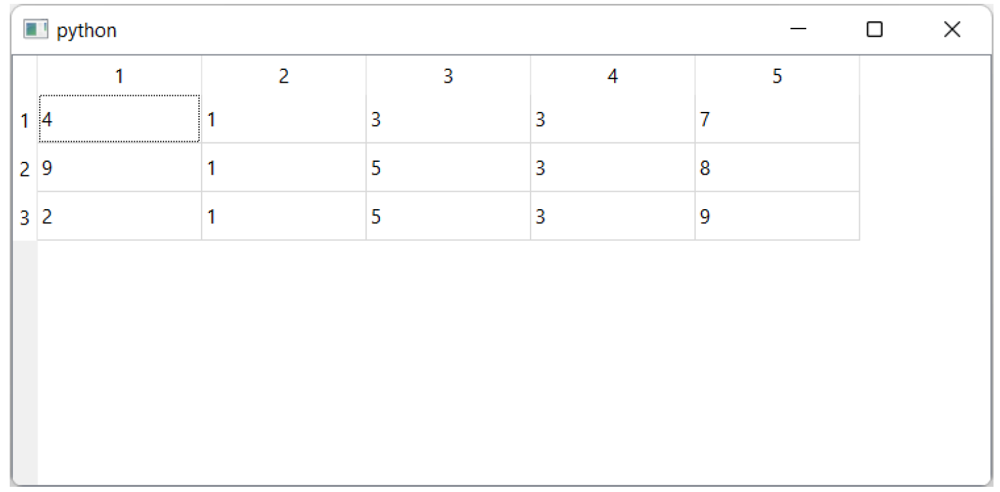
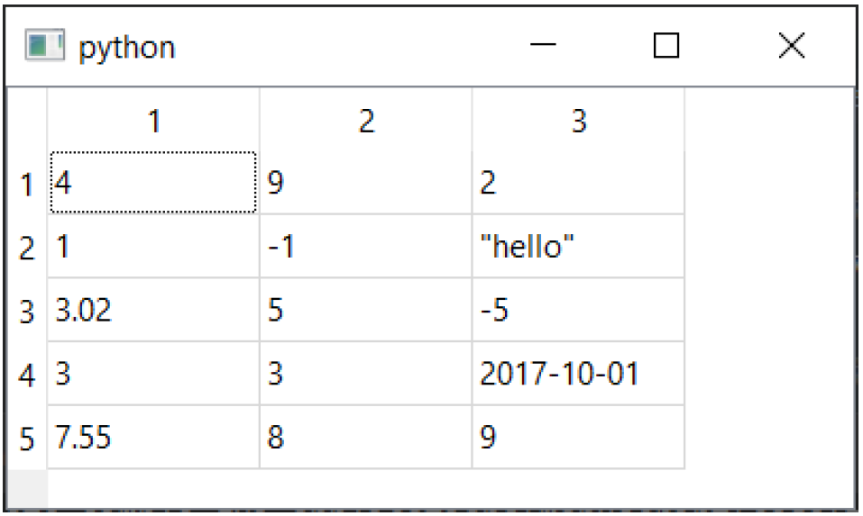
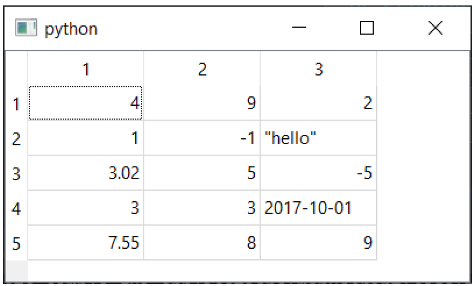
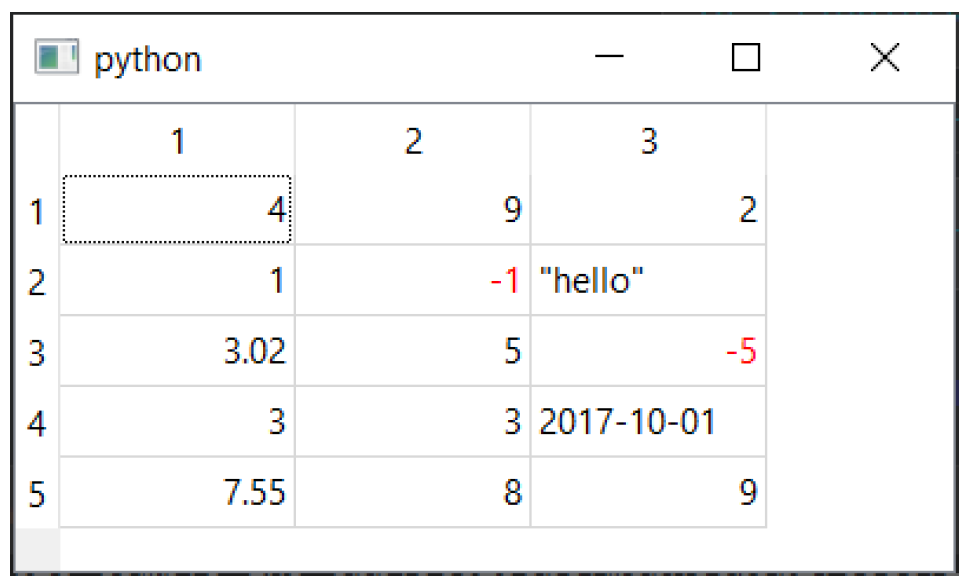
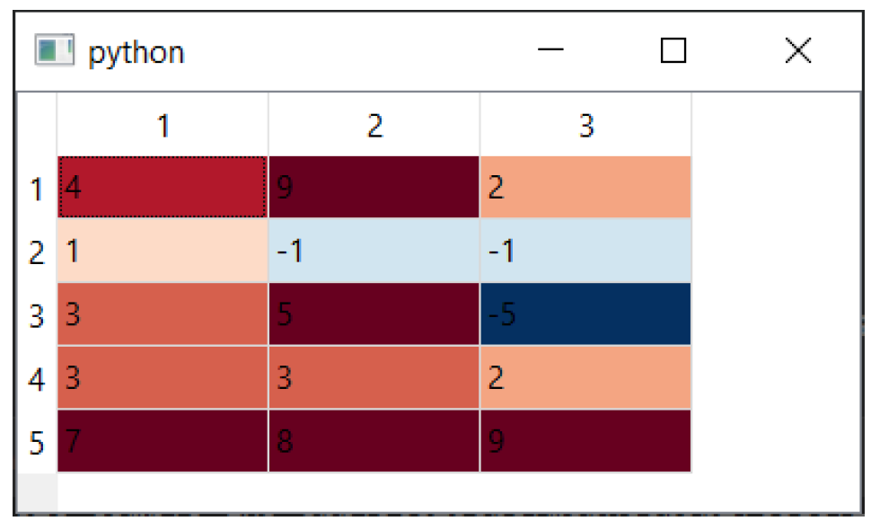
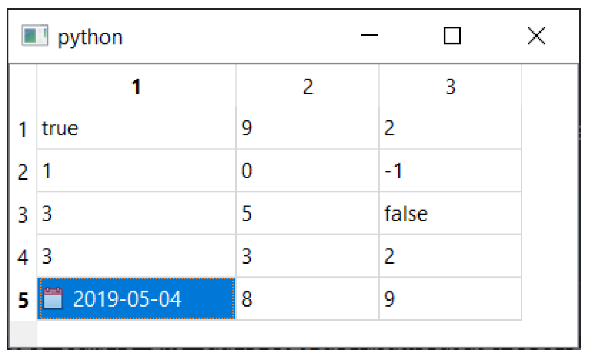
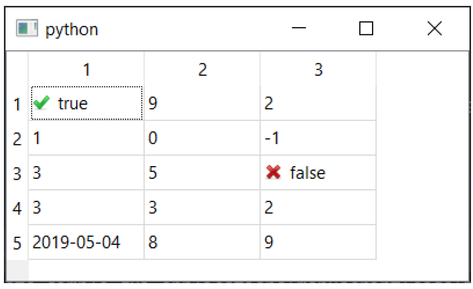
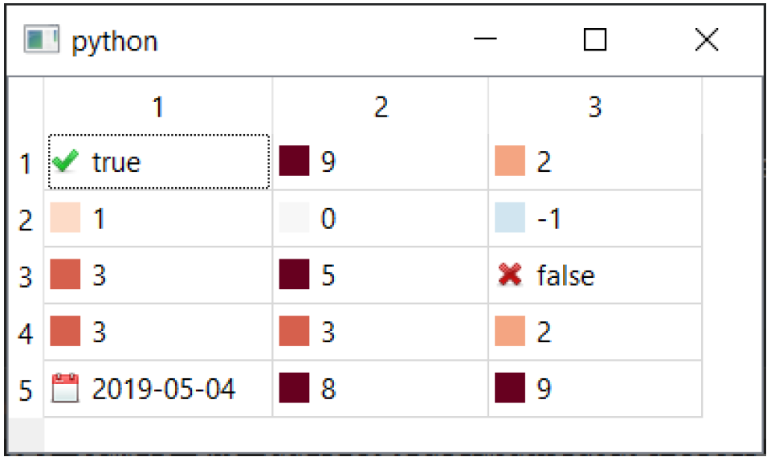
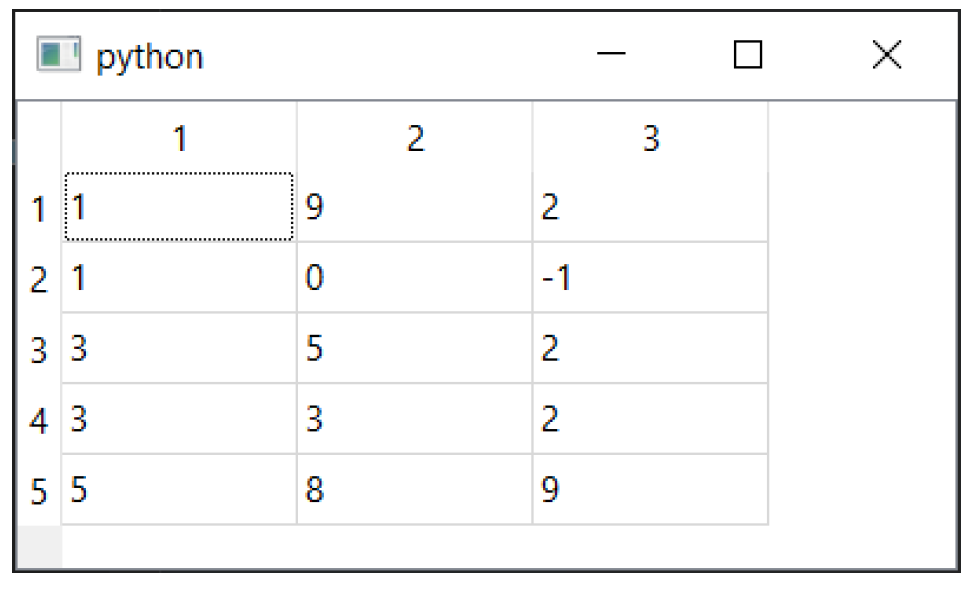
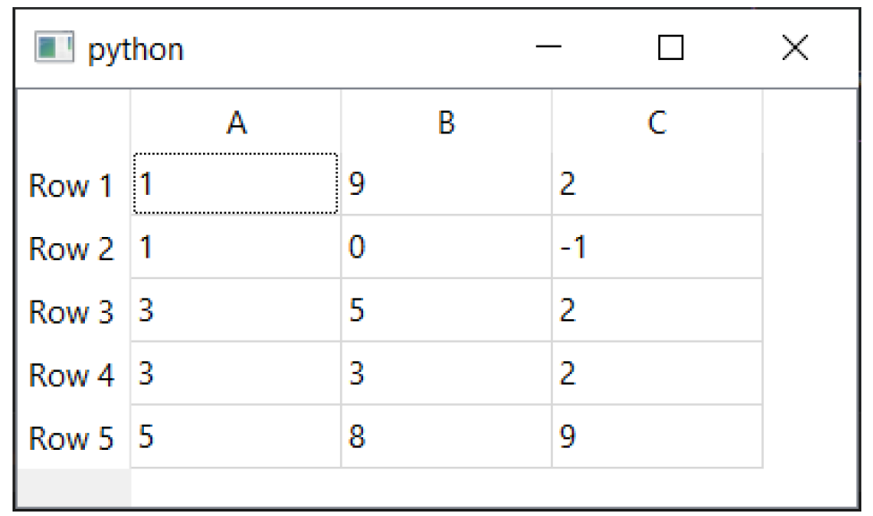

---
prev:
  text: '18. 一个简单的模型视图——待办事项列表'
  link: '/ModelViewArchitecture/18'
next:
  text: '20. 使用Qt模型查询SQL数据库'
  link: '/ModelViewArchitecture/20'
---

## 19. 使用numpy和pandas处理模型视图中的表格数据

在上一节中，我们介绍了模型视图（Model View）架构。然而，我们仅涉及了模型视图中的一种——`QListView`。在PyQt6中，还有另外两种模型视图可用——`QTableView` 和`QTreeView`，它们分别提供表格（类似Excel）和树形（类似文件目录浏览器）视图，且均使用相同的 `QStandardItemModel` 。

在本节中，我们将探讨如何使用PyQt6中的 `QTableView` 来建模数据、格式化显示值以及添加条件格式化。

您可以使用模型视图与任何数据源配合使用，只要您的模型能够以Qt能够识别的格式返回数据。在Python中处理表格数据为我们加载和处理数据提供了多种可能性。我们将从一个简单的嵌套列表开始，然后逐步整合您的Qt应用程序与流行的 numpy 和 pandas 库。这将为您构建以数据为中心的应用程序奠定坚实的基础。

## `QTableView` 入门指南

`QTableView` 是一个 Qt 视图控件，以类似电子表格的表格视图显示数据。与模型视图架构中的所有控件一样，它使用单独的模型向视图提供数据和呈现信息。模型中的数据可以根据需要进行更新，视图会收到这些更改的通知，从而重新绘制/显示更改。通过自定义模型，可以对数据的呈现方式进行大量控制。

要使用该模型，我们需要一个基本的应用程序结构和一些示例数据。下文展示了一个简单的示例，其中定义了一个自定义模型，并使用一个简单的嵌套列表作为数据存储。

*Listing 104. tableview_demo.py*

```python
import sys
from PyQt6 import QtCore, QtGui, QtWidgets
from PyQt6.QtCore import Qt


class TableModel(QtCore.QAbstractTableModel):
    def __init__(self, data):
        super().__init__()
        self._data = data
        
    def data(self, index, role):
        if role == Qt.ItemDataRole.DisplayRole:
            # 请参见下文的嵌套列表数据结构。
            # .row() 方法用于访问外部列表中的元素。
            # .column() 方法用于访问子列表中的元素。
            return self._data[index.row()][index.column()]
        
    def rowCount(self, index):
        # 外部列表的长度。
        return len(self._data)
    
    def columnCount(self, index):
        # 以下代码取第一个子列表，并返回其长度（仅在所有行长度相等时有效）
        return len(self._data[0])
    
    
class MainWindow(QtWidgets.QMainWindow):
    def __init__(self):
        super().__init__()
        
        self.table = QtWidgets.QTableView()
        
        data = [
            [4, 1, 3, 3, 7],
            [9, 1, 5, 3, 8],
            [2, 1, 5, 3, 9],
        ]
        
        self.model = TableModel(data)
        self.table.setModel(self.model)
        self.setCentralWidget(self.table)
        
        
app = QtWidgets.QApplication(sys.argv)
window = MainWindow()
window.show()
app.exec()
```

与之前的模型视图示例一样，我们创建 `QTableView` 控件，然后创建自定义模型的实例（我们编写该模型以接受数据源作为参数），然后将模型设置到视图上。这就是我们需要做的全部工作——视图控件现在使用模型来获取数据，并确定如何绘制数据。



> 图138：基本表格示例

## 嵌套 `list` 作为二维数据存储结构

对于一张表格，您需要一个二维数据结构，包含列和行。如上例所示，您可以使用嵌套Python列表来建模一个简单的二维数据结构。我们将花一点时间来查看这个数据结构及其局限性，如下所示——

```python
table = [
    [4, 1, 3, 3, 7],
    [9, 1, 5, 3, 8],
    [2, 1, 5, 3, 9],
]
```

嵌套列表是一个“值的列表集合”——一个外层列表包含多个子列表，而这些子列表本身又包含值。由于这种结构，要访问单个值（或“单元格”），必须进行两次索引操作：首先返回一个内部 `list` 对象，然后再次对该 `list` 进行索引。

典型的布局是外层列表存放行，每个嵌套列表存放列的值。采用这种布局时，索引操作首先按行索引，然后按列索引——因此上述示例是一个3行5列的表格。值得注意的是，这种布局与源代码中的视觉布局相匹配。

对该表的第一次索引操作将返回一个嵌套子列表——

```python
row = 2
col = 4

>>> table[row]
[2, 1, 5, 3, 9]
```

然后再次对其进行索引以返回值 —

```python
>>> table[row][col]
9
```

请注意，使用此类结构无法直接返回整列数据，您需要遍历所有行。不过，您当然可以根据实际需求，将索引与列的关联关系进行调整，即根据是否更适合按列或按行访问数据，将第一个索引作为列进行使用。

```python
table = [
    [4, 9, 2],
    [1, 1, 1],
    [3, 5, 5],
    [3, 3, 2],
    [7, 8, 9],
]

row = 4 # 反转
col = 2 # 反转

>>> table[col]
[3, 5, 5]

>>> table[col][row]
9
```


> 该数据结构并未强制要求行或列的长度一致——一行可以包含5个元素，另一行则可能包含200个元素。然而，不一致的情况会导致表格视图出现错误。若您需要处理大型或复杂的数据表，请参阅后文的替代数据存储方案。

接下来，我们将更详细地探讨我们的自定义 `TableModel` ，并了解它如何与这个简单的数据结构配合使用，以显示相应的值。

## 编写自定义的 `QAbstractTableModel`

在模型视图架构中，模型负责提供用于视图显示的数据和展示元数据。为了在数据对象和视图之间进行交互，我们需要编写自己的自定义模型，该模型能够理解数据的结构。

要编写自定义模型，我们可以创建 `QAbstractTableModel` 的子类。自定义表格模型仅需实现三个方法：`data`、`rowCount` 和 `columnCount`。第一个方法返回表格中指定位置的数据（或呈现信息），后两个方法必须返回数据源维度的单个整数值。

```python
class TableModel(QtCore.QAbstractTableModel):
    
    def __init__(self, data):
        super(TableModel, self).__init__()
        self._data = data
        
    def data(self, index, role):
        if role == Qt.ItemDataRole.DisplayRole:
            # 请参见下文的嵌套列表数据结构。
            # .row() 方法用于访问外部列表中的元素。
            # .column() 方法用于访问子列表中的元素。
            return self._data[index.row()][index.column()]
        
    def rowCount(self, index):
        # 外部列表的长度。
        return len(self._data)
    
    def columnCount(self, index):
        # 以下代码取第一个子列表，并返回其长度（仅在所有行长度相等时有效）
        return len(self._data[0])
```


> QtCore.QAbstractTableModel 是一个抽象基类，这意味着它没有实现这些方法。如果您尝试直接使用它，它将无法工作，所以您必须继承它。

在 `__init__` 构造函数中，我们接受一个参数 `data`，并将其存储为实例属性 `self._data`，这样我们就可以从方法中访问它。传入的 `data` 结构是通过引用存储的，因此任何外部更改都会反映在这里。


> 要通知模型发生的变化，您需要使用 `self.model.layoutChanged.emit()` 触发模型的 `layoutChanged` 信号。

`data` 方法带两个参数 `index` 和 `role`。`index` 参数指定当前请求信息的表中位置，并提供 `.row()` 和 `.column()` 两个方法，分别返回视图中的行号和列号。在示例中，数据以嵌套列表形式存储，行号和列号用于按以下方式索引：`data[row][column]`。

视图对源数据的结构一无所知，而模型负责在视图的行和列与您自己的数据存储中的相应位置之间进行转换。

角色参数描述了方法在本次调用中应返回何种信息。为了获取要显示的数据，视图会调用该模型的数据方法，并指定角色为 `Qt.ItemDataRole.DisplayRole`。然而，角色还可以有其他许多值，包括 `Qt.ItemDataRole.BackgroundRole`、`Qt.ItemDataRole.CheckStateRole`、`Qt.ItemDataRole.DecorationRole`、`Qt.ItemDataRole.CheckStateRole`、`Qt.ItemDataRole.DecorationRole`、`Qt.ItemDataRole.FontRole`、`Qt.ItemDataRole.TextAlignmentRole` 和`Qt.ItemDataRole.ForegroundRole`，每个角色都期望返回特定值（详见后文）。


> `Qt.ItemDataRole.DisplayRole` 实际上期望返回一个字符串，尽管其他基本的 Python 类型，包括 `flaot`、`int` 和 `bool`，也将使用它们的默认字符串表示形式进行显示。然而，将这些类型格式化为自定义字符串通常更可取。

我们将稍后介绍如何使用这些其他角色类型，目前只需知道在返回用于显示的数据之前，您**必须**确保角色类型为 `Qt.ItemDataRole.DisplayRole`。

两个自定义方法 `columnCount` 和 `rowCount` 分别返回数据结构中的列数和行数。在我们这里使用的嵌套列表结构中，行数就等于外层列表中的元素个数，而列数等于内层列表中**某一个**列表的元素个数——假设所有内层列表的元素个数都相同。


> 如果这些方法返回的值过高，您会看到越界错误，如果返回的值过低，您将看到表格被截断。

## 数字和日期的格式设置

模型返回用于显示的数据预计为字符串。虽然整数（`int`）和浮点数（`float`）也会显示，但它们将使用默认的字符串表示形式，而复杂的 Python 类型则不会。要显示这些类型，或覆盖浮点数、整数或布尔值的默认格式化，您必须自行将这些类型格式化为字符串。

您可能会想通过将数据提前转换为字符串表来实现这一点。然而，这样做会使您难以继续处理表中的数据，无论是进行计算还是更新。

相反，您应该使用模型的数据方法按需进行字符串转换。通过这种方式，您可以继续使用原始数据，同时对数据的呈现方式拥有完全控制权——包括通过配置在运行时动态更改呈现方式。

以下是一个简单的自定义格式化器，它会从我们的数据表中查找值，并根据数据的 Python 类型以多种不同方式显示它们。

*Listing 105. tableview_format_1.py*

```python
import sys
from datetime import datetime #1

from PyQt6 import QtCore, QtGui, QtWidgets
from PyQt6.QtCore import Qt


class TableModel(QtCore.QAbstractTableModel):
    def __init__(self, data):
        super().__init__()
        self._data = data
        
    def data(self, index, role):
        if role == Qt.ItemDataRole.DisplayRole:
            # 获取原始值
            value = self._data[index.row()][index.column()]
            
            # 根据类型进行检查并相应渲染。
            if isinstance(value, datetime):
                # 渲染时间格式为 YYY-MM-DD。
                return value.strftime("%Y-%m-%d")
            
            if isinstance(value, float):
                # 将float类型保留小数点后两位
                return "%.2f" % value
            
            if isinstance(value, str):
                # 使用引号渲染字符串
                return '"%s"' % value
            
            # 默认值（未在上述内容中捕获的任何内容：例如int）
            return value
        
    def rowCount(self, index):
        return len(self._data)
    
    def columnCount(self, index):
        return len(self._data[0])
```

> 请注意文件开头的额外导入语句 `from datetime import datetime`。

请与下方的修改后示例数据配合使用，以查看其实际效果。

```python
data = [
    [4, 9, 2],
    [1, -1, 'hello'],
    [3.023, 5, -5],
    [3, 3, datetime(2017,10,1)],
    [7.555, 8, 9],
]
```



> 图139：自定义数据格式化

到目前为止，我们只探讨了如何自定义数据本身的格式。然而，模型接口为用户提供了对表格单元格显示方式的更多控制权，包括颜色和图标。在接下来的部分，我们将探讨如何利用模型来自定义 `QTableView` 的外观。

## 具有角色的样式和颜色

使用颜色和图标来突出显示数据表中的单元格可以帮助用户更轻松地查找和理解数据，或帮助用户选择或标记感兴趣的数据。Qt 允许从模型中完全控制所有这些功能，通过响应数据方法中的相关角色来实现。

针对各种角色类型，预期返回的类型如下所示：

| 角色                                | 类型                                         |
| ----------------------------------- | -------------------------------------------- |
| `Qt.ItemDataRole.BackgroundRole`    | `QBrush`(也可以是 `QColor` )                 |
| `Qt.ItemDataRole.CheckStateRole`    | `Qt.CheckState`                              |
| `Qt.ItemDataRole.DecorationRole`    | `QIcon` , `QPixmap` , `QColor`               |
| `Qt.ItemDataRole.DisplayRole`       | `QString`(也可以是 `int` , `float` , `bool`) |
| `Qt.ItemDataRole.FontRole`          | `QFont`                                      |
| `Qt.ItemDataRole.SizeHintRole`      | `QSize`                                      |
| `Qt.ItemDataRole.TextAlignmentRole` | `Qt.Alignment`                               |
| `Qt.ItemDataRole.ForegroundRole`    | `QBrush`(也可以是 `QColor` )                 |

通过响应特定的角色和索引组合，我们可以修改表格中特定单元格、列或行的外观——例如，为第三列中的所有单元格设置蓝色背景。

*Listing 106. tableview_format_2.py*

```python
   def data(self, index, role):
        if(
            role == Qt.ItemDataRole.BackgroundRole
            and index.column() == 2
        ):
            # 请参见下文的数据结构。
            return QtGui.QColor(Qt.GlobalColor.blue)
        
        # 现有的 `if role == Qt.ItemDataRole.DisplayRole:` 代码块已隐藏，以提高可读性。
```

通过使用索引从我们自己的数据中查找值，我们还可以根据数据中的值自定义外观。下面我们将介绍一些更常见的使用场景。

### 文本对齐

在之前的格式化示例中，我们使用文本格式化将浮点数显示为小数点后2位。然而，在显示数字时，右对齐数字也是一种常见做法，这样可以更方便地比较不同数字列表中的数值。这可以通过在响应 `Qt.ItemDataRole.TextAlignmentRole` 时返回 `Qt.Alignment.AlignRight` 来实现，适用于任何数值类型。

修改后的数据方法如下所示。我们检查 `role == Qt.ItemDataRole.TextAlignmentRole`，并像之前一样通过索引查找值，然后确定值是否为数值。如果是，我们可以返回`Qt.Alignment.AlignVCenter + Qt.Alignment.AlignRight`，以实现垂直居中对齐和水平右对齐。

*Listing 107. tableview_format_3.py*

```python
    def data(self, index, role):
        if role == Qt.ItemDataRole.TextAlignmentRole:
            value = self._data[index.row()][index.column()]
            
            if isinstance(value, int) or isinstance(value, float):
                # 右对齐，垂直居中
                return(
                    Qt.AlignmentFlag.AlignVCenter
                    | Qt.AlignmentFlag.AlignRight
                )
                
        # 现有的 `if role == Qt.ItemDataRole.DisplayRole:` 代码块已隐藏，以提高可读性。
```


> 其他对齐方式也是可能的，包括`Qt.Alignment.AlignHCenter` 的实现水平居中对齐。您可以通过按位或运算将它们组合在一起，例如 `Qt.Alignment.AlignBottom | Qt.Alignment.AlignRight`。



> 图140：QTableView 的单元格对齐

### 文本颜色

如果您使用过Excel等电子表格软件，您可能对“条件格式化”这一概念有所了解。条件格式化是指您可以应用于单元格（或行、列）的规则，这些规则会根据单元格的值自动更改其文本和背景颜色。

这有助于可视化数据，例如使用红色表示负数，或通过从蓝到红的渐变色来突出显示数值范围（例如低至高）。

首先，下面的示例实现了一个处理程序，用于检查索引单元格中的值是否为数值且小于零。如果满足条件，则该处理程序返回文本（前景）颜色为红色。

*Listing 108. tableview_format_4.py*

```python
    def data(self, index, role):
        if role == Qt.ItemDataRole.ForegroundRole:
            value = self._data[index.row()][index.column()]
            
            if(
                isinstance(value, int) or isinstance(value, float)
            ) and value < 0:
                return QtGui.QColor("red")
            
            
         # 现有的 `if role == Qt.ItemDataRole.DisplayRole:` 代码块已隐藏，以提高可读性。
```

如果你将此添加到模型的数据处理程序中，所有负数现在将以红色显示。



> 图141：QTableView 的文本格式设置，负数使用红色显示

### 数值范围渐变

同样的原理可以用于对表格中的数值应用渐变色，例如，突出显示较低和较高的值。首先，我们定义颜色标尺，该标尺来自 [colorbrewer2.org](http://colorbrewer2.org/#type=diverging&scheme=RdBu&n=11)。

```python
COLORS = ['#053061', '#2166ac', '#4393c3', '#92c5de', '#d1e5f0',
'#f7f7f7', '#fddbc7', '#f4a582', '#d6604d', '#b2182b', '#67001f']
```

接下来，我们定义自定义处理函数，这次针对 `Qt.ItemDataRole.BackgroundRole`。该函数获取指定索引处的值，验证其为数值类型，然后执行一系列操作将其限制在 0…10 的范围内，以便用于索引我们的列表。

*Listing 109. tableview_format_5.py*

```python
    def data(self, index, role):
        if role == Qt.ItemDataRole.BackgroundRole:
            value = self._data[index.row()][index.column()]
            if isinstance(value, int) or isinstance(value, float):
                value = int(value) # 将值转换为整数以进行索引操作。
                
                # 将范围限制为-5到+5，然后转换为0到10。
                value = max(-5, value) # 值小于-5的变为-5
                value = min(5, value) # 值大于+5时，变为+5
                value = value + 5 # -5变为0，+5变为+10
                
                return QtGui.QColor(COLORS[value])
            
        # 现有的 `if role == Qt.ItemDataRole.DisplayRole:` 代码块已隐藏，以提高可读性。
```

这里用于将值转换为梯度的逻辑非常基础，会截取高/低值，且不调整数据范围。然而，您可以根据需要进行调整，只要您的处理函数最终返回的是 `QColor` 或 `QBrush` 即可。



> 图142：带数字范围颜色渐变的QTableView

### 图标与图像装饰

每个表格单元格包含一个小型装饰区域，可用于在数据左侧显示图标、图像或纯色块。此区域可用于指示数据类型，例如日历图标表示日期、勾号和叉号表示布尔值，或用于对数值范围进行更微妙的条件格式化。

以下是一些这些想法的简单实现。

#### 使用图标表示布尔/日期数据类型

对于日期，我们将使用 Python 的内置 `datetime` 类型。首先，在文件开头添加以下 import 语句以导入该类型。

```python
from datetime import datetime
```

然后，更新数据（在 `MainWindow.__init__` 中设置）以添加日期时间和布尔值（`True` 或 `False` 值），例如。

```python
data = [
    [True, 9, 2],
    [1, 0, -1],
    [3, 5, False],
    [3, 3, 2],
    [datetime(2019, 5, 4), 8, 9],
]
```

这些设置完成后，您可以更新模型数据方法，以显示图标和格式化日期（适用于日期类型），使用以下代码：

*Listing 110. tableview_format_6.py*

```python
import os

basedir = os.path.dirname(__file__)

class TableModel(QtCore.QAbstractTableModel):
    def __init__(self, data):
        super().__init__()
        self._data = data
        
    def data(self, index, role):
        if role == Qt.ItemDataRole.DisplayRole:
            value = self._data[index.row()][index.column()]
            if isinstance(value, datetime):
                return value.strftime("%Y-%m-%d")
            
            return value
        
        if role == Qt.ItemDataRole.DecorationRole:
            value = self._data[index.row()][index.column()]
            if isinstance(value, datetime):
                return QtGui.QIcon(
                    os.path.join(basedir, "calendar.png")
                )
                
    def rowCount(self, index):
        return len(self._data)
    
    def columnCount(self, index):
        return len(self._data[0])
```


> 我们使用之前介绍的 `basedir` 技术加载图标，以确保无论脚本如何运行，路径都是正确的。



> 图143：QTableView 的格式化日期并显示指示图标

以下展示了如何使用勾选框和叉号分别表示布尔值的真（`True`）和假（`False`）

*Listing 111. tableview_format_7.py*

```python
    def data(self, index, role):
        if role == Qt.ItemDataRole.DecorationRole:
            value = self._data[index.row()][index.column()]
            if isinstance(value, bool):
                if value:
                    return QtGui.QIcon("tick.png")
                
                return QtGui.QIcon("cross.png")
```

当然，您可以将以上内容组合在一起，或者将 `Qt.ItemDataRole.DecorationRole` 和 `Qt.ItemDataRole.DisplayRole` 滑块进行任意组合。通常情况下，将每种类型归入同一个 if 分支会比较简单，或者随着模型的复杂程度增加，可以创建子方法来处理每种角色。



> 图144：QTableView 的布尔指示器

#### 色块

如果您为 `Qt.ItemDataRole.DecorationRole` 返回 `QColor`，则单元格左侧的图标位置将显示一个小方块。这与之前的 `Qt.ItemDataRole.BackgroundRole` 条件格式化示例完全相同，只是现在需要处理和响应 `Qt.ItemDataRole.DecorationRole`。

*Listing 112. tableview_format_8.py*

```python
    def data(self, index, role):
        if role == Qt.ItemDataRole.DecorationRole:
            value = self._data[index.row()][index.column()]
            
            if isinstance(value, datetime):
                return QtGui.QIcon(
                    os.path.join(basedir, "calendar.png")
                )
                
            if isinstance(value, bool):
                if value:
                    return QtGui.QIcon(
                        os.path.join(basedir, "tick.png")
                    )
                    
                return QtGui.QIcon(os.path.join(basedir, "cross.png"))
            
            if isinstance(value, int) or isinstance(value, float):
                value = int(value)
                
                # 将范围限制为-5到+5，然后转换为0到10。
                value = max(-5, value) # 值小于-5的变为-5
                value = min(5, value) # 值大于+5时，变为+5
                value = value + 5 # -5变为0，+5变为+10
                
                return QtGui.QColor(COLORS[value])
```



> 图145：QTableView 颜色块装饰

## 备选的 Python 数据结构

到目前为止，我们在示例中一直使用简单的嵌套 Python 列表来存储数据以供显示。对于简单的数据表，这种方法是可行的。然而，如果您正在处理大型数据表，Python 还提供了一些其他更好的选项，这些选项还附带额外的好处。在接下来的部分中，我们将探讨两个 Python 数据表库——numpy 和 pandas——以及如何将它们与 Qt 集成。

### Numpy

Numpy 是一个库，为 Python 中的大型多维数组或矩阵数据结构提供支持。它对大型数组的高效、高性能处理，使 numpy 成为科学和数学应用的理想选择。这也使 numpy 数组成为 PyQt6 中大型、单类型数据表的良好数据存储。

#### 使用numpy作为数据源

为了支持 numpy 数组，我们需要对模型进行一系列修改，首先修改数据方法中的索引逻辑，然后调整行数和列数的计算方式，以适应 `rowCount` 和 `columnCount` 的计算。

标准的numpy API提供了对2D数组的元素级访问，通过在同一个切片操作中传入行和列，例如`_data[index.row(), index.column()]`。这比分两步进行索引操作更高效，如列表嵌套列表的示例所示。

在 NumPy 中，数组的维度可以通过 `.shape` 属性获取，该属性会返回一个元组，其中包含沿每个轴的维度。我们可以通过从该元组中选择正确的元素来获取每个轴的长度，例如 `_data.shape[0]` 即可获取第一个轴的大小。

以下完整示例演示了如何使用Qt的 `QTableView` 通过自定义模型显示一个 numpy 数组。

*Listing 113. model-views/tableview_numpy.py*

```python
import sys

import numpy as np
from PyQt6 import QtCore, QtGui, QtWidgets
from PyQt6.QtCore import Qt


class TableModel(QtCore.QAbstractTableModel):
    def __init__(self, data):
        super().__init__()
        self._data = data
        
    def data(self, index, role):
        if role == Qt.ItemDataRole.DisplayRole:
            # self._data[index.row()][index.column()] 也行
            value = self._data[index.row(), index.column()]
            return str(value)
        
    def rowCount(self, index):
        return self._data.shape[0]
    
    def columnCount(self, index):
        return self._data.shape[1]
    
    
class MainWindow(QtWidgets.QMainWindow):
    def __init__(self):
        super().__init__()
        
        self.table = QtWidgets.QTableView()
        data = np.array(
            [
                [1, 9, 2],
                [1, 0, -1],
                [3, 5, 2],
                [3, 3, 2],
                [5, 8, 9],
            ]
        )
        
        self.model = TableModel(data)
        self.table.setModel(self.model)
        
        self.setCentralWidget(self.table)
        self.setGeometry(600, 100, 400, 200)
        
        
app = QtWidgets.QApplication(sys.argv)
window = MainWindow()
window.show()
app.exec()
```


> 虽然简单的 Python 类型（如 `int` 和 `float`）会直接显示，无需转换为字符串，但 numpy 会使用自己的类型（例如 `numpy.int32`）来表示数组值。为了显示这些值，我们**必须**先将其转换为字符串。



> 图146：使用 numpy 数组的QTableView


> 使用 `QTableView` 只能显示二维数组，然而如果您拥有更高维度的数据结构，您可以将 `QTableView` 与带标签或滚动条的用户界面结合使用，以实现对这些更高维度的访问和显示。

### Pandas

Pandas 是一个常用于数据处理和分析的 Python 库。它提供了一个便捷的 API，用于从各种数据源加载二维表格数据并对其进行数据分析。通过将 numpy 的 `DataTable` 用作您的 `QTableView` 模型，您可以直接在应用程序中使用这些 API 加载和分析数据。

#### 使用Pandas作为数据源

将模型修改为与 numpy 兼容的改动相对较小，仅需对 `data` 方法中的索引进行调整，以及对 `rowCount` 和 `columnCount` 进行修改。`rowCount` 和 `columnCount` 的改动与 numpy 完全一致，使用 pandas 中的 `_data.shape` 元组来表示数据的维度。

对于索引操作，我们使用 pandas 的 `.iloc` 方法，用于索引位置——即通过列和/或行索引进行查找。这通过将行和列传递给 `_data.iloc[index.row(), index.column()]` 切片来实现。

以下完整示例演示了如何通过自定义模型使用Qt 的 `QTableView`显示 pandas 数据框。

*Listing 114. model-views/tableview_pandas.py*

```python
import sys

import pandas as pd
from PyQt6 import QtCore, QtGui, QtWidgets
from PyQt6.QtCore import Qt


class TableModel(QtCore.QAbstractTableModel):
    def __init__(self, data):
        super().__init__()
        self._data = data
        
    def data(self, index, role):
        if role == Qt.ItemDataRole.DisplayRole:
            value = self._data.iloc[index.row(), index.column()]
            return str(value)
        
    def rowCount(self, index):
        return self._data.shape[0]
    
    def columnCount(self, index):
        return self._data.shape[1]
    
    def headerData(self, section, orientation, role):
        if role == Qt.ItemDataRole.DisplayRole:
            if orientation == Qt.Orientation.Horizontal:
                return str(self._data.columns[section])
            
            if orientation == Qt.Orientation.Vertical:
                return str(self._data.index[section])
            
            
class MainWindow(QtWidgets.QMainWindow):
    def __init__(self):
        super().__init__()
        
        self.table = QtWidgets.QTableView()
        
        data = pd.DataFrame(
            [
                [1, 9, 2],
                [1, 0, -1],
                [3, 5, 2],
                [3, 3, 2],
                [5, 8, 9],
            ],
            columns=["A", "B", "C"],
            index=["Row 1", "Row 2", "Row 3", "Row 4", "Row 5"],
        )
        
        self.model = TableModel(data)
        self.table.setModel(self.model)
        
        self.setCentralWidget(self.table)
        self.setGeometry(600, 100, 400, 200)
        
        
app = QtWidgets.QApplication(sys.argv)
window = MainWindow()
window.show()
app.exec()
```

一个有趣的扩展是使用 `QTableView` 的表格标题来显示行和 pandas 列标题的值，这些值可以分别从 `DataFrame.index` 和 `DataFrame.columns` 中获取。



> 图147：QTableView 支持 pandas DataTable，包含列和行标题。

为此，我们需要在自定义的 `headerData` 方法中实现 `Qt.ItemDataRole.DisplayRole` 处理程序。它接收 `section` ，它包含行/列的索引（0…n）、`orientation`（可为 `Qt.Orientations.Horizontal` 用于列标题，或 `Qt.Orientations.Vertical` 用于行标题），以及与数据方法中相同的 `role` 参数。


> `headerData` 方法还接受其他参数，这些参数可用于进一步自定义标题的样式。

## 总结

在本章中，我们介绍了如何使用 QTableView 和自定义模型在应用程序中显示表格数据的基础知识。随后，我们进一步演示了如何格式化数据以及使用图标和颜色装饰单元格。最后，我们演示了如何使用 ·QTableView· 处理来自 numpy 和 pandas 结构的表格数据，包括显示自定义的列和行标题。


> 如果您想对表格数据进行计算，请查看 25. 使用线程池。
