---
prev:
  text: '19. 使用numpy和pandas处理模型视图中的表格数据'
  link: '/ModelViewArchitecture/19'
next:
  false
---

## 20. 使用Qt模型查询SQL数据库

到目前为止，我们一直使用表格模型来访问应用程序自身加载或存储的数据——从简单的列表列表到 numpy 和 pandas 表格。然而，所有这些方法都有一个共同点，即您所查看的数据必须完全加载到内存中。

为了简化与 SQL 数据库的交互，Qt 提供了一些 SQL 模型，这些模型可以连接到视图，以显示 SQL 查询或数据库表的输出。在本章中，我们将介绍两种方法——在 `QTableView` 中显示数据库数据，以及使用 `QDataWidgetMapper` 将数据库字段映射到 Qt 控件。

您选择哪种模型取决于您是否需要对数据库进行只读访问、读写访问，还是带有关联关系的只读访问（查询多个表）。在接下来的章节中，我们将依次探讨这些选项。

以下示例基于此简单框架，展示了在窗口中显示表格视图，但未设置模型。

*Listing 115. databases/tableview.py*

```python
import os
import sys

from PyQt6.QtCore import Qt
from PyQt6.QtWidgets import QApplication, QMainWindow, QTableView


class MainWindow(QMainWindow):
    def __init__(self):
        super().__init__()
        
        self.table = QTableView()
        
        # self.model = ?
        # self.table.setModel(self.model)
        
        self.setCentralWidget(self.table)
        
        
app = QApplication(sys.argv)
window = MainWindow()
window.show()
app.exec()
```

在连接模型之前，运行此操作只会显示一个空窗口。


> 对于这些示例，我们使用了本书下载中包含的 SQLite 文件数据库示例 `file.sqlite`。


> 您可以使用自己的数据库，包括SQLite数据库或数据库服务器（如PostgreSQL、MySQL等）。有关如何连接到远程服务器的详细说明，请参阅后文的使用 `QSqlDatabase` 进行身份验证。

## 连接到数据库

要在应用程序中显示数据库中的数据，您必须首先与数据库建立连接。Qt 支持服务器型数据库（如 PostgreSQL 或 MySQL）和文件型数据库（如 SQLite），两者的区别仅在于配置方式不同。

对于所有这些示例，我们使用的是 [Chinook示例数据库](https://github.com/lerocha/chinook-database)——一个专为测试和演示设计的示例数据库。该数据库模拟了一家数字媒体商店，包含艺术家、专辑、媒体曲目、发票和客户等表。


> 本书附带了该数据库的SQLite版本副本，命名为 `chinook.sqlite`。您也可以从[这里](https://github.com/lerocha/chinook-database/raw/master/ChinookDatabase/DataSources/Chinook_Sqlite.sqlite)下载最新版本。

```python
import os

from PyQt6.QtSql import QSqlDatabase

basedir = os.path.dirname(__file__)

db = QSqlDatabase("QSQLITE")
db.setDatabaseName(os.path.join(basedir, "chinook.sqlite"))
db.open()
```


> 您将此代码放置的位置取决于您的应用程序。通常，您希望创建一个数据库连接并在整个应用程序中使用它——在这种情况下，最好创建一个单独的模块，例如 `db.py` 来存放此代码（以及其他相关功能）。

对于所有数据库，操作流程相同——创建数据库对象，设置名称，然后打开数据库以初始化连接。然而，如果您想连接到远程数据库，则需要额外设置一些参数。请参阅后文的使用`QSqlDatabase`进行身份验证以获取更多信息。

## 使用 `QSqlTableModel` 显示表格

将应用程序连接到数据库后，您可以做的最简单的事情就是在应用程序中显示一张表。为此，我们可以使用 `QSqlTableModel`。该模型直接从表中显示数据，并支持编辑功能。

首先，我们需要创建表模型的实例，并传入我们上面创建的数据库对象。然后，我们需要设置要查询数据的源表——这是数据库中表的名称，这里是<表名>。最后，我们需要调用模型的 `.select()` 方法。

```python
model = QSqlTableModel(db=db)
model.setTable('<table name>')
model.select()
```

通过调用 `.select()` 方法，我们指示模型查询数据库并保留查询结果，以便后续显示。要将这些数据显示在 `QTableView` 中，只需将其传递给视图的 `.setModel()` 方法即可。

```python
table = QTableView()
table.setModel(self.model)
```

数据将以表格形式显示，并可通过滚动条进行浏览。请参见下文的完整代码，该代码加载数据库并在视图中显示专辑表。

*Listing 116. tableview_tablemodel.py*

```python
import os
import sys

from PyQt6.QtCore import QSize, Qt
from PyQt6.QtSql import QSqlDatabase, QSqlTableModel
from PyQt6.QtWidgets import QApplication, QMainWindow, QTableView

basedir = os.path.dirname(__file__)

db = QSqlDatabase("QSQLITE")
db.setDatabaseName(os.path.join(basedir, "chinook.sqlite"))
db.open()


class MainWindow(QMainWindow):
    def __init__(self):
        super().__init__()
        
        self.table = QTableView()
        
        self.model = QSqlTableModel(db=db)
        
        self.table.setModel(self.model)
        
        self.model.setTable("Track")
        self.model.select()
        
        self.setMinimumSize(QSize(1024, 600))
        self.setCentralWidget(self.table)
        
        
app = QApplication(sys.argv)
window = MainWindow()
window.show()
app.exec()
```

运行后，您将看到以下窗口。

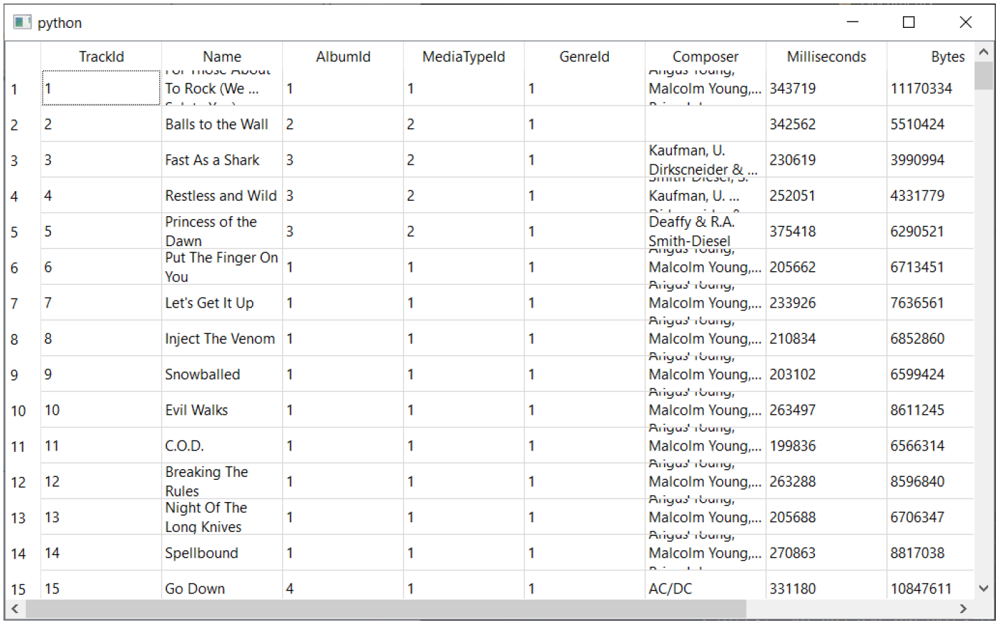

> 图148：在QTableView中显示的专辑表。


> 您可以通过拖动右侧边缘来调整列的宽度。通过双击右侧边缘，可以调整列的宽度以适应内容。

### 编辑数据

数据库中的数据在 `QTableView` 中默认可编辑——只需双击任何单元格，即可修改其内容。修改内容将在编辑完成后立即保存回数据库。

Qt 提供了一些对编辑行为的控制，您可以根据所构建的应用程序类型进行调整。Qt 将这些行为称为“编辑策略”，它们可以是以下之一：

| 编辑策略                                     | 描述                                                         |
| -------------------------------------------- | ------------------------------------------------------------ |
| `QSqlTableModel.EditStrategy.OnFieldChange`  | 当用户取消选中已编辑的单元格时，更改会自动应用。             |
| `QSqlTableModel.EditStrategy.OnRowChange`    | 当用户选择不同的行时，更改会自动应用。                       |
| `QSqlTableModel.EditStrategy.OnManualSubmit` | 更改会被缓存在模型中，并仅在调用 `.submitAll()` 时写入数据库，或在调用 `revertAll()` 时被丢弃。 |

您可以通过调用 `.setEditStrategy` 方法来设置模型的当前编辑策略。例如 

```python
self.model.setEditStrategy(QSqlTableModel.EditStrategy.OnRowChange)
```

### 列排序

要按指定列对表格进行排序，我们可以调用模型上的 `.setSort()` 方法，传入列索引和 `Qt.SortOrder.AscendingOrder` 或 `Qt.SortOrder.DescendingOrder`。

*Listing 117. databases/tableview_tablemodel_sort.py*

```python
        self.model.setTable("Track")
        self.model.setSort(2, Qt.SortOrder.DescendingOrder)
        self.model.select()
```

这必须在调用 `.select()` 之前完成。如果您希望在获取数据后进行排序，您可以再次调用 `.select()` 来刷新数据。

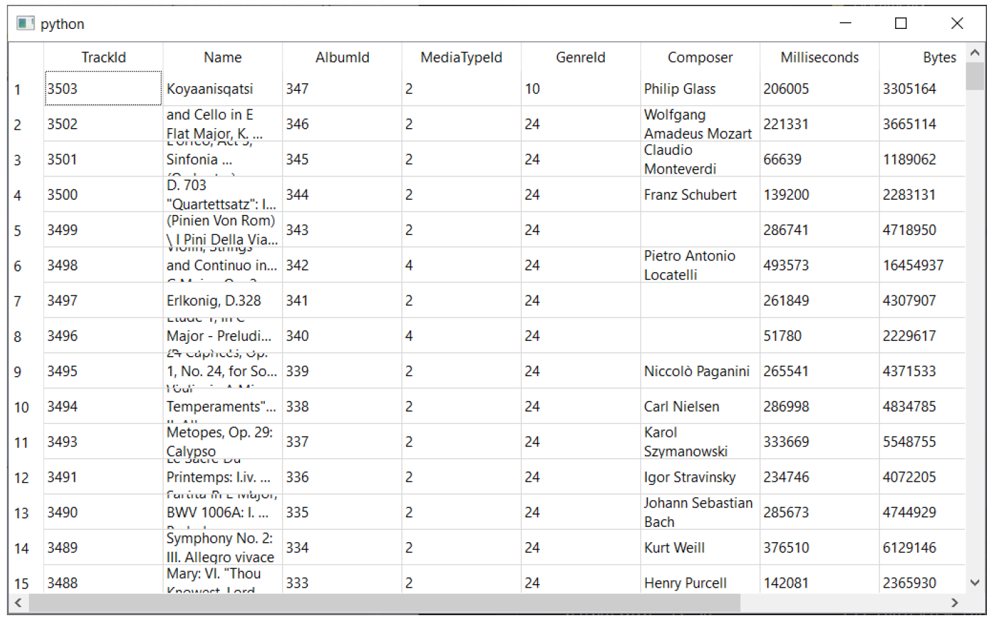

> 图149：根据列索引2（`album_id`）对专辑表进行排序。

您可能更倾向于使用列名而非列索引对表格进行排序。要实现这一点，您可以通过列名查询列索引。

*Listing 118. databases/tableview_tablemodel_sortname.py*

```python
        self.model.setTable("Track")
        idx = self.model.fieldIndex("Milliseconds")
        self.model.setSort(idx, Qt.SortOrder.DescendingOrder)
        self.model.select()
```

表格现已按毫秒列 (`milliseconds`) 进行排序。

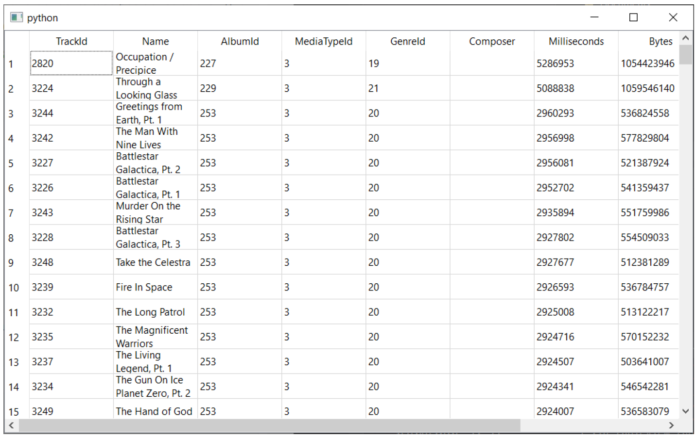

> 图150：按毫秒列排序的专辑表。

### 列标题

默认情况下，表格中的列标题来自数据库中的列名。通常这并不太利于用户使用，因此您可以使用 `.setHeaderData` 方法替换它们，传入列索引、方向（水平（顶部）或垂直（左侧）标题）以及标签。

*Listing 119. database/tableview_tablemodel_titles.py*

```python
        self.model.setTable("Track")
        self.model.setHeaderData(1, Qt.Orientation.Horizontal, "Name")
        self.model.setHeaderData(
            2, Qt.Orientation.Horizontal, "Album (ID)"
        )
        self.model.setHeaderData(
            3, Qt.Orientation.Horizontal, "Media Type (ID)"
        )
        self.model.setHeaderData(
            4, Qt.Orientation.Horizontal, "Genre (ID)"
        )
        self.model.setHeaderData(
            5, Qt.Orientation.Horizontal, "Composer"
        )
        self.model.select()
```

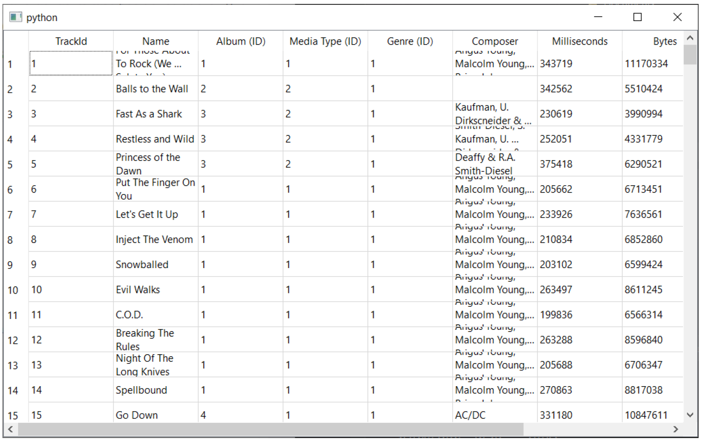

> 图151：带有更美观的列标题的专辑表。

与排序时类似，使用列索引来实现这一点并不总是方便的。如果数据库中的列顺序发生变化，您在应用程序中设置的名称将与之不一致。

与之前一样，我们可以使用 `.fieldIndex()` 方法来查找给定名称的索引。您可以更进一步，定义一个 Python 字典，其中包含列名和标题，以便在设置模型时一次性应用。

*Listing 120. database/tableview_tablemodel_titlesname.py*

```python
        self.model.setTable("Track")
        column_titles = {
            "Name": "Name",
            "AlbumId": "Album (ID)",
            "MediaTypeId": "Media Type (ID)",
            "GenreId": "Genre (ID)",
            "Composer": "Composer",
        }
        for n, t in column_titles.items():
            idx = self.model.fieldIndex(n)
            self.model.setHeaderData(idx, Qt.Orientation.Horizontal,t)
            
        self.model.select()
```

### 选择列

通常您可能不需要显示表格中的所有列。您可以通过从模型中移除列来选择要显示的列。要实现这一点，请调用 `.removeColumns()` 方法，传入要移除的第一列的索引以及后续要移除的列数。例如：

```python
self.model.removeColumns(2, 5)
```

一旦删除列，它们将不再显示在表格中。您可以使用与列标签相同的名称查找方法，通过名称删除列。

```python
columns_to_remove = ['name', 'something']

for cn in columns_to_remove:
    idx = self.model.fieldIndex(cn)
    self.model.removeColumns(idx, 1)
```


> 以这种方式删除列仅会将其从视图中移除。若需通过SQL过滤列，请参阅下方的查询模型。

### 筛选表格

我们可以调用模型上的 `.setFilter()` 方法来过滤表格，传入一个描述过滤条件的参数。过滤条件参数可以是任何有效的 SQL `WHERE` 子句，但不需要在前面添加 `WHERE`。例如，`name=“Martin”` 用于精确匹配，或 `name LIKE “Ma%”` 用于匹配以 “Ma” 开头的字段。

如果您对 SQL 不熟悉，以下是一些示例搜索模式，您可以使用它们来执行不同类型的搜索。

| 搜索模式            | 描述                       |
| ------------------- | -------------------------- |
| `field="{}"`        | 字段与字符串完全匹配。     |
| `field LIKE "{}%"`  | 字段以给定的字符串开头。   |
| `field LIKE "%{}"`  | 字段以给定的字符串结尾。   |
| `field LIKE "%{}%"` | 字段包含在给定的字符串中。 |

在每个示例中，`{}` 表示搜索字符串，您必须使用 Python 进行插值：`“{}”.format(search_str)`。与排序不同，过滤操作将自动应用于数据，无需再次调用 `.select()` 方法。


> 如果 `.select()` 尚未被调用，则过滤器将在首次调用时应用。

在下面的示例中，我们添加了一个 `QLineEdit` 字段，并将其连接到搜索轨道名称字段的表。我们将行编辑更改信号连接到构建，并将其应用到模型。

*Listing 121. databases/tableview_tablemodel_filter.py*

```python
import os
import sys

from PyQt6.QtCore import QSize, Qt
from PyQt6.QtSql import QSqlDatabase, QSqlTableModel
from PyQt6.QtWidgets import (
    QApplication,
    QLineEdit,
    QMainWindow,
    QTableView,
    QVBoxLayout,
    QWidget,
)

basedir = os.path.dirname(__file__)

db = QSqlDatabase("QSQLITE")
db.setDatabaseName(os.path.join(basedir, "chinook.sqlite"))
db.open()


class MainWindow(QMainWindow):
    def __init__(self):
        super().__init__()
        
        container = QWidget()
        layout = QVBoxLayout()
        
        self.search = QLineEdit()
        self.search.textChanged.connect(self.update_filter)
        self.table = QTableView()
        
        layout.addWidget(self.search)
        layout.addWidget(self.table)
        container.setLayout(layout)
        
        self.model = QSqlTableModel(db=db)
        
        self.table.setModel(self.model)
        
        self.model.setTable("Track")
        self.model.select()
        
        self.setMinimumSize(QSize(1024, 600))
        self.setCentralWidget(container)
        
    def update_filter(self, s):
        filter_str = 'Name LIKE "%{}%"'.format(s)
        self.model.setFilter(filter_str)
        
        
app = QApplication(sys.argv)
window = MainWindow()
window.show()
app.exec()
```

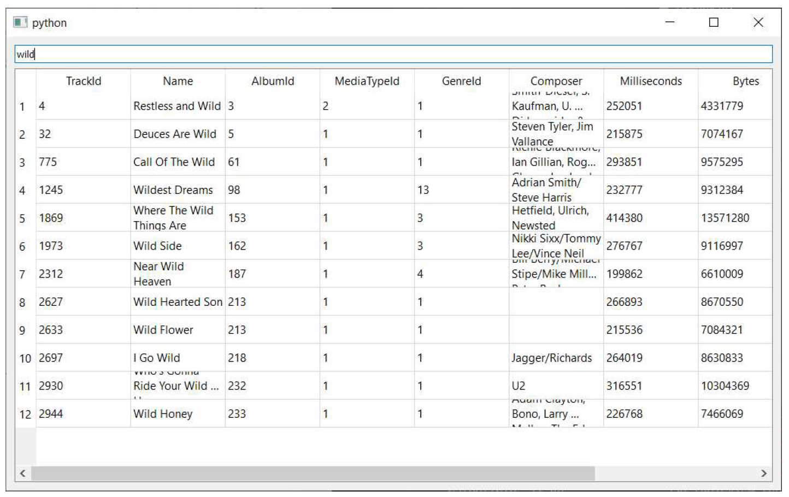

> 图152：按名称过滤专辑表


> 这容易受到SQL注入攻击。

虽然这种方法可行，但这其实是一种非常糟糕的在表中启用搜索功能的方式，因为用户可以构造无效或恶意的SQL语句。例如，尝试在搜索框中输入单个字符 `“` ——过滤功能将停止工作，并且在重新启动应用程序之前无法再次正常工作。

这是因为您创建了一个无效的 SQL 语句，例如：

```sql
'name LIKE "%"%"'
```

解决此问题的理想方法是使用参数化查询，将输入的转义工作交给数据库，以确保不会传递任何危险或格式错误的内容。然而，Qt过滤器接口不支持此功能，我们只能传递一个字符串。

对于简单的纯文本搜索，我们可以直接移除字符串中的任何非字母数字字符或空格。这是否合适将取决于您的具体使用场景。

```python
import re

s = re.sub('[\W_]+', '', s)
query = 'field="%s"' % s
```

将上述内容应用到我们示例中的过滤方法中，我们得到以下代码：

*Listing 122. databases/tableview_tablemodel_filter_clean.py*

```python
    def update_filter(self, s):
        s = re.sub("[\W_]+", "", s)
        filter_str = 'Name LIKE "%{}%"'.format(s)
        self.model.setFilter(filter_str)
```

请再次运行示例，并输入`“ ` —— 以及您能想到的任何其他垃圾内容。您应该会发现搜索功能仍然正常工作。

## 使用 `QSqlRelationalTableModel` 显示相关数据

在之前的示例中，我们使用了 `QSqlTableModel` 来显示单个表中的数据。然而，在关系型数据库中，表之间可以存在关联关系，并且通常有必要能够直接查看相关数据。

关系数据库中的关系通过外键进行处理。外键是一个（通常为）数字值，存储在一个表的列中，引用另一个表中行中的主键。

在我们的示例跟踪表中，外键的示例可以是 `album_id` 或 `genre_id`。这两者都是数值，分别指向专辑表和类型表中的记录。将这些值（如 1、2、3 等）显示给用户是没有帮助的，因为它们本身没有意义。

更理想的做法是提取专辑名称或音乐类型，并在表格视图中显示。为此，我们可以使用`QSqlRelationalTableModel`。

该模型的设置与前一个模型完全相同。要定义关系，我们调用 `.setRelation()` 方法，传入列索引和一个 `QSqlRelation` 对象。

```python
from PyQt6.QtSql import QSqlRelation, QSqlRelationalTableModel

self.model = QSqlRelationalTableModel(db=db)

relation = QSqlRelation('<related_table>',
                        '<related_table_foreign_key_column', '<column_to_display>')
self.model.setRelation(<column>, relation)
```

`QSqlRelation` 对象接受三个参数，第一个是我们要从中提取数据的关联表，第二个是该表中的外键列，最后一个是我们要从中提取数据的列。

对于我们的测试数据库中的专辑表，以下操作将从相关表中提取数据，分别对应专辑ID、媒体类型ID和流派ID（对应表中的第3、4、5列）。

*Listing 123. databases/tableview_relationalmodel.py*

```python
        self.model.setTable("Track")
        self.model.setRelation(
            2, QSqlRelation("Album", "AlbumId", "Title")
        )
        self.model.setRelation(
            3, QSqlRelation("MediaType", "MediaTypeId", "Name")
        )
        self.model.setRelation(
            4, QSqlRelation("Genre", "GenreId", "Name")
        )
        self.model.select()
```

运行后，您会发现三个`_id` 列已被从相关表中提取的数据替换。这些列将采用相关字段的名称，如果不冲突，否则将为其生成一个名称。

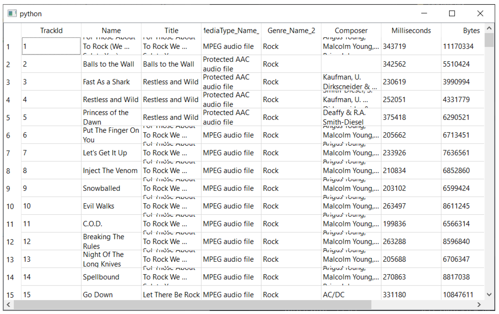

> 图153：显示相关字段的数据。

## 使用 `QSqlRelationalDelegate` 编辑相关字段。

如果您尝试编辑 `QSqlRelationalTableModel` 中的字段，您会发现一个问题——虽然您可以编辑基础表（这里是 Tracks）中的字段，但您对相关字段（例如 Album Title）所做的任何修改都不会被保存。这些字段目前只是对数据的视图。

相关字段的有效值受相关表中值的限制 —— 为了获得更多选择，我们需要向相关表中添加另一行。由于选项受到限制，通常有必要将选择项显示在 `QComboBox` 中。Qt 提供了一个模型项委托，可以为我们完成此查找和显示操作 —— `QSqlRelationalDelegate`

*Listing 124. databases/tableview_relationalmodel_delegate.py*

```python
        self.model.setTable("Track")
        self.model.setRelation(
            2, QSqlRelation("Album", "AlbumId", "Title")
        )
        self.model.setRelation(
            3, QSqlRelation("MediaType", "MediaTypeId", "Name")
        )
        self.model.setRelation(
            4, QSqlRelation("Genre", "GenreId", "Name")
        )
        
        delegate = QSqlRelationalDelegate(self.table)
        self.table.setItemDelegate(delegate)
        
        self.model.select()
```

该委托会自动处理任何关系字段的映射。我们只需创建一个传递 `QTableView` 实例的委托，然后将生成的委托设置到模型上，一切都会自动完成。

运行此操作时，您将在编辑相关字段时看到下拉菜单。

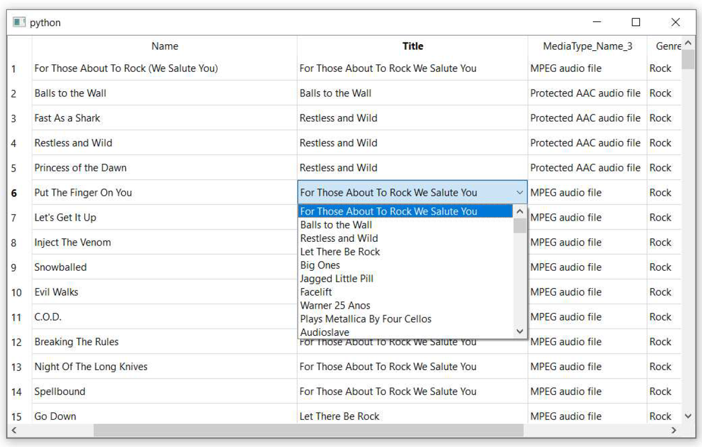

> 图154：通过下拉列表使相关字段可编辑，使用QSqlRelationalDelegate。

## 使用 `QSqlQueryModel` 进行通用查询

到目前为止，我们一直在 `QTableView` 中显示整个数据库表，并支持一些可选的列过滤和排序功能。然而，Qt 还允许使用 `QSqlQueryModel` 显示更复杂的查询。在本节中，我们将探讨如何使用 `QSqlQueryModel` 显示 SQL 查询，首先从简单的单表查询开始，然后逐步过渡到关系查询和参数化查询。

使用此模型进行查询的过程略有不同。与将数据库直接传递给模型构造函数不同，这里我们首先创建一个`QSqlQuery`对象，该对象接受数据库连接，然后将该对象传递给模型。

```python
query = QSqlQuery("SELECT name, composer FROM track ", db=db)
```

这意味着您可以使用单个 `QSqlQueryModel` 对不同数据库执行查询。该查询的完整示例如下所示：

*Listing 125. databases/tableview_querymodel.py*

```python
import os
import sys

from PyQt6.QtCore import QSize, Qt
from PyQt6.QtSql import QSqlDatabase, QSqlQuery, QSqlQueryModel
from PyQt6.QtWidgets import QApplication, QMainWindow, QTableView

basedir = os.path.dirname(__file__)

db = QSqlDatabase("QSQLITE")
db.setDatabaseName(os.path.join(basedir, "chinook.sqlite"))
db.open()


class MainWindow(QMainWindow):
    def __init__(self):
        super().__init__()
        
        self.table = QTableView()
        
        self.model = QSqlQueryModel()
        self.table.setModel(self.model)
        
        query = QSqlQuery("SELECT Name, Composer FROM track ", db=db)
        
        self.model.setQuery(query)
        
        self.setMinimumSize(QSize(1024, 600))
        self.setCentralWidget(self.table)
        
        
app = QApplication(sys.argv)
window = MainWindow()
window.show()
app.exec()
```

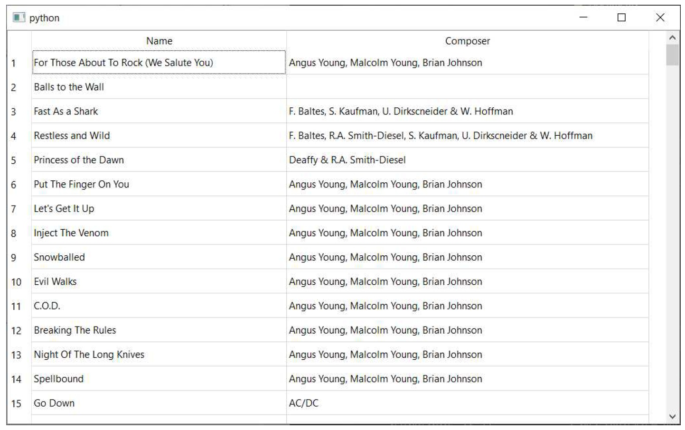

> 图155：执行一个简单的查询

在这个第一个示例中，我们对专辑表执行了一个非常简单的查询，仅返回该表中的两个字段。然而，`QSqlQuery` 对象可用于执行更复杂的查询，包括跨表连接和参数化查询——在参数化查询中，我们可以传递值来修改查询。


> 参数化查询可保护您的应用免受SQL注入攻击。

在下面的示例中，我们扩展了简单的查询，以在专辑表中添加一个相关查找。此外，我们绑定了一个专辑标题参数，该参数用于对专辑表进行包含搜索。

*Listing 126. databases/tableview_querymodel_parameter.py*

```python
import os
import sys

from PyQt6.QtCore import QSize, Qt
from PyQt6.QtSql import QSqlDatabase, QSqlQuery, QSqlQueryModel
from PyQt6.QtWidgets import QApplication, QMainWindow, QTableView

basedir = os.path.dirname(__file__)

db = QSqlDatabase("QSQLITE")
db.setDatabaseName(os.path.join(basedir, "chinook.sqlite"))
db.open()


class MainWindow(QMainWindow):
    def __init__(self):
        super().__init__()
        
        self.table = QTableView()
        
        self.model = QSqlQueryModel()
        self.table.setModel(self.model)
        
        query = QSqlQuery(db=db)
        query.prepare(
            "SELECT Name, Composer, Album.Title FROM Track "
            "INNER JOIN Album ON Track.AlbumId = Album.AlbumId "
            "WHERE Album.Title LIKE '%' || :album_title || '%' "
        )
        query.bindValue(":album_title", "Sinatra")
        query.exec()
        
        self.model.setQuery(query)
        self.setMinimumSize(QSize(1024, 600))
        self.setCentralWidget(self.table)
        
        
app = QApplication(sys.argv)
window = MainWindow()
window.show()
app.exec()
```

现在我们想要向查询中添加参数，不能直接将查询传递给 `QSqlQuery`，因为这样会立即执行查询，而不会进行参数替换。相反，我们需要将查询传递给 `.prepare()` 方法，告知驱动程序识别查询中的参数并等待值的传入。

接下来，我们使用 `.bindValue()` 方法绑定每个参数，最后调用 `query.exec()` 方法在数据库中执行查询。

此参数化查询等同于以下 SQL 语句：

```sql
SELECT Name, Composer, Album.Title FROM Track
INNER JOIN Album ON Track.AlbumId = Album.AlbumId
WHERE Album.Title LIKE '%Sinatra%'
```

这将得到以下结果 

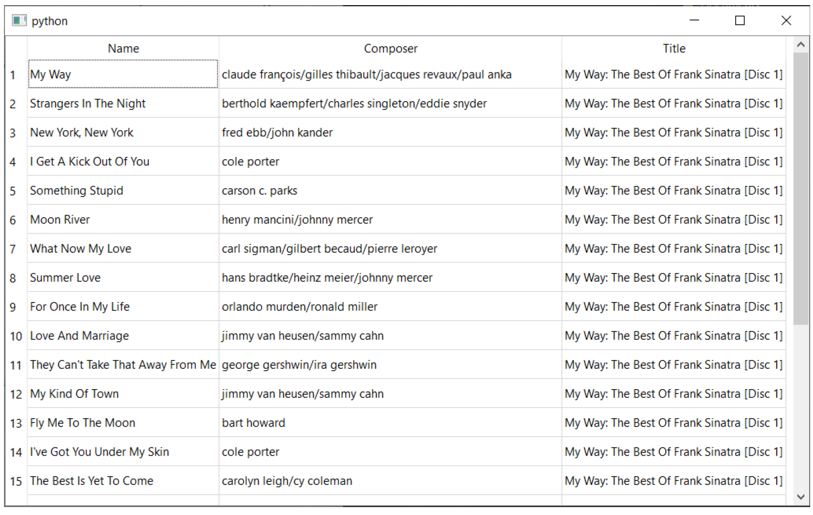

> 图156：参数化查询的结果

在最后一个示例中，我们添加了三个搜索字段——一个用于歌曲标题、一个用于艺术家、一个用于专辑标题。我们将这些字段的 `.textChanged` 信号连接到一个自定义方法，该方法更新查询的参数。

*Listing 127. databases/tableview_querymodel_search.py*

```python
import os
import sys

from PyQt6.QtCore import QSize, Qt
from PyQt6.QtSql import QSqlDatabase, QSqlQuery, QSqlQueryModel
from PyQt6.QtWidgets import (
    QApplication,
    QHBoxLayout,
    QLineEdit,
    QMainWindow,
    QTableView,
    QVBoxLayout,
    QWidget,
)

basedir = os.path.dirname(__file__)

db = QSqlDatabase("QSQLITE")
db.setDatabaseName(os.path.join(basedir, "chinook.sqlite"))
db.open()


class MainWindow(QMainWindow):
    def __init__(self):
        super().__init__()

        container = QWidget()
        layout_search = QHBoxLayout()

        self.track = QLineEdit()
        self.track.setPlaceholderText("Track name...")
        self.track.textChanged.connect(self.update_query)

        self.composer = QLineEdit()
        self.composer.setPlaceholderText("Artist name...")
        self.composer.textChanged.connect(self.update_query)

        self.album = QLineEdit()
        self.album.setPlaceholderText("Album name...")
        self.album.textChanged.connect(self.update_query)

        layout_search.addWidget(self.track)
        layout_search.addWidget(self.composer)
        layout_search.addWidget(self.album)

        layout_view = QVBoxLayout()
        layout_view.addLayout(layout_search)

        self.table = QTableView()

        layout_view.addWidget(self.table)

        container.setLayout(layout_view)
        self.model = QSqlQueryModel()
        self.table.setModel(self.model)
        
        self.query = QSqlQuery(db=db)
        self.query.prepare(
            "SELECT Name, Composer, Album.Title FROM Track "
            "INNER JOIN Album ON Track.AlbumId=Album.AlbumId WHERE "
            "Track.Name LIKE '%' || :track_name || '%' AND "
            "Track.Composer LIKE '%' || :track_composer || '%' AND "
            "Album.Title LIKE '%' || :album_title || '%'"
        )
        
        self.update_query()
        
        self.setMinimumSize(QSize(1024, 600))
        self.setCentralWidget(container)
        
    def update_query(self, s=None):
        
        # 从控件中获取文本值。
        track_name = self.track.text()
        track_composer = self.composer.text()
        album_title = self.album.text()
        
        self.query.bindValue(":track_name", track_name)
        self.query.bindValue(":track_composer", track_composer)
        self.query.bindValue(":album_title", album_title)
        
        self.query.exec()
        self.model.setQuery(self.query)
        
        
app = QApplication(sys.argv)
window = MainWindow()
window.show()
app.exec()
```

如果您运行此功能，您可以使用每个字段独立搜索数据库，且每次搜索查询更改时，结果将自动更新。

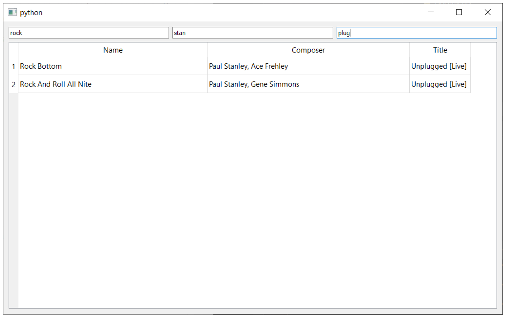

> 图157：多参数搜索查询的结果

## `QDataWidgetMapper`

到目前为止，我们在所有示例中都使用 `QTableView` 以表格形式显示了数据库的输出数据。虽然这种方式通常适合查看数据，但在进行数据输入或编辑时，通常更倾向于以表单形式显示输入内容，这样用户可以直接输入并通过Tab键在字段间切换。


> 这被称为创建、读取、更新和删除（CRUD）操作及接口。

完整的示例代码如下所示。

*Listing 128. databases/widget_mapper.py*

```python
import os
import sys

from PyQt6.QtCore import QSize, Qt
from PyQt6.QtSql import QSqlDatabase, QSqlTableModel
from PyQt6.QtWidgets import (
    QApplication,
    QComboBox,
    QDataWidgetMapper,
    QDoubleSpinBox,
    QFormLayout,
    QLabel,
    QLineEdit,
    QMainWindow,
    QSpinBox,
    QWidget,
)

basedir = os.path.dirname(__file__)

db = QSqlDatabase("QSQLITE")
db.setDatabaseName(os.path.join(basedir, "chinook.sqlite"))
db.open()


class MainWindow(QMainWindow):
    def __init__(self):
        super().__init__()
        
        form = QFormLayout()
        
        self.track_id = QSpinBox()
        self.track_id.setRange(0, 2147483647)
        self.track_id.setDisabled(True)
        self.name = QLineEdit()
        self.album = QComboBox()
        self.media_type = QComboBox()
        self.genre = QComboBox()
        self.composer = QLineEdit()
        
        self.milliseconds = QSpinBox()
        self.milliseconds.setRange(0, 2147483647) #1
        self.milliseconds.setSingleStep(1)
        
        self.bytes = QSpinBox()
        self.bytes.setRange(0, 2147483647)
        self.bytes.setSingleStep(1)
        
        self.unit_price = QDoubleSpinBox()
        self.unit_price.setRange(0, 999)
        self.unit_price.setSingleStep(0.01)
        self.unit_price.setPrefix("$")
        form.addRow(QLabel("Track ID"), self.track_id)
        form.addRow(QLabel("Track name"), self.name)
        form.addRow(QLabel("Composer"), self.composer)
        form.addRow(QLabel("Milliseconds"), self.milliseconds)
        form.addRow(QLabel("Bytes"), self.bytes)
        form.addRow(QLabel("Unit Price"), self.unit_price)
        
        self.model = QSqlTableModel(db=db)
        
        self.mapper = QDataWidgetMapper() #2
        self.mapper.setModel(self.model)
        
        self.mapper.addMapping(self.track_id, 0) #3
        self.mapper.addMapping(self.name, 1)
        self.mapper.addMapping(self.composer, 5)
        self.mapper.addMapping(self.milliseconds, 6)
        self.mapper.addMapping(self.bytes, 7)
        self.mapper.addMapping(self.unit_price, 8)
        
        self.model.setTable("Track")
        self.model.select() #4
        
        self.mapper.toFirst() #5
        
        self.setMinimumSize(QSize(400, 400))
        
        widget = QWidget()
        widget.setLayout(form)
        self.setCentralWidget(widget)
        
app = QApplication(sys.argv)
window = MainWindow()
window.show()
app.exec()
```

> 1. 控件必须配置为接受表中的所有有效值。
> 2. 所有控件使用一个 `QDataWidgetMapper`。
> 3. 控件映射到 `_columns`。
> 4. 执行选择以填充模型。
> 5. 将映射器向前移动到第一个记录

运行此示例后，您将看到以下窗口。`self.mapper.toFirst()` 调用选择表中的第一条记录，然后将其显示在映射的控件中。

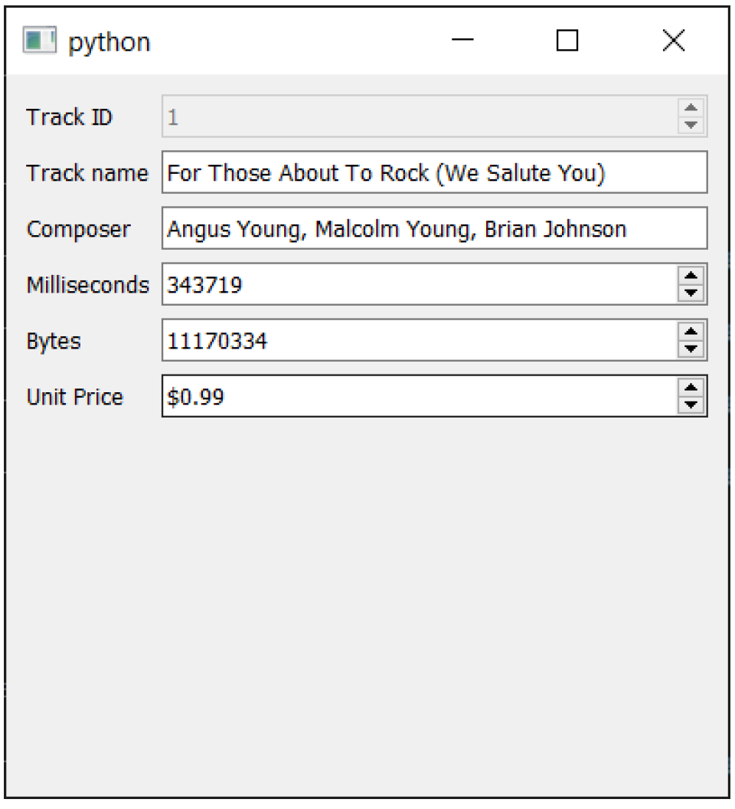

> 图158：通过映射控件查看记录

目前，我们无法更改正在查看的记录，也无法保存对记录所做的任何更改。为了实现这一点，我们可以添加 3 个按钮——分别用于浏览记录的前一个和下一个，以及保存更改到数据库。为此，我们可以将一些 `QPushButton` 控件连接到映射器槽 `.toPrevious`、`.toNext` 和 `.submit`。

请您更新 `__init__` 方法的结尾，添加以下内容，将控件添加到现有的布局中

*Listing 129. databases/widget_mapper_controls.py*

```python
        self.setMinimumSize(QSize(400, 400))
    
        controls = QHBoxLayout()
        
        prev_rec = QPushButton("Previous")
        prev_rec.clicked.connect(self.mapper.toPrevious)
        
        next_rec = QPushButton("Next")
        next_rec.clicked.connect(self.mapper.toNext)
        
        save_rec = QPushButton("Save Changes")
        save_rec.clicked.connect(self.mapper.submit)
        
        controls.addWidget(prev_rec)
        controls.addWidget(next_rec)
        controls.addWidget(save_rec)
        
        layout.addLayout(form)
        layout.addLayout(controls)
        
        widget = QWidget()
        widget.setLayout(layout)
        self.setCentralWidget(widget)
```

您还需要更新文件顶部的导入语句，以导入 `QPushButton` 和 `QHBoxLayout`

*Listing 130. databases/widget_mapper_controls.py*

```python
from PyQt6.QtWidgets import (
    QApplication,
    QComboBox,
    QDataWidgetMapper,
    QDoubleSpinBox,
    QFormLayout,
    QHBoxLayout,
    QLabel,
    QLineEdit,
    QMainWindow,
    QPushButton,
    QSpinBox,
    QVBoxLayout,
    QWidget,
)
```

现在您可以浏览专辑表中的记录，修改专辑数据并提交这些更改到数据库。此示例的完整源代码位于书籍源代码中的 `databases/widget_mapper_controls.py` 文件中。


> 图159：您可以使用上一页/下一页控制按钮来查看记录，还可以点击保存以提交。

## 使用 `QSqlDatabase` 进行身份验证

到目前为止，我们在示例中使用了 SQLite 数据库文件。但通常情况下，您可能希望连接到远程 SQL 服务器。这需要添加一些额外参数，包括数据库所在的主机名，以及适当的用户名和密码。

```python
# 建立数据库连接。
db = QSqlDatabase('<driver>')
db.setHostName('<localhost>')
db.setDatabaseName('<databasename>')
db.setUserName('<username>')
db.setPassword('<password>')
db.open()
```

注意：`<driver>` 的值可以是以下任何一个 `[‘QSQLITE’,‘QMYSQL’, ‘QMYSQL3’, ‘QODBC’, ‘QODBC3’, ‘QPSQL’, ‘QPSQL7’]`。要获取系统上的此列表，请运行 `QSqlDatabase.drivers()`。

就这样！一旦连接建立，模型将与之前完全相同地运作。
