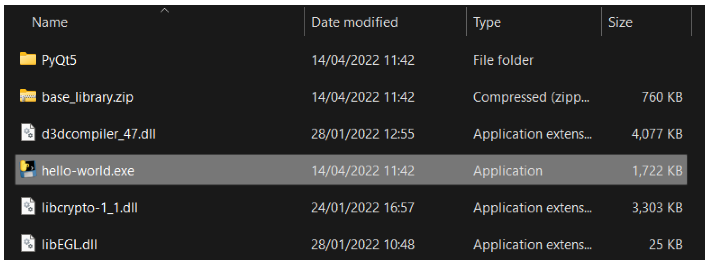
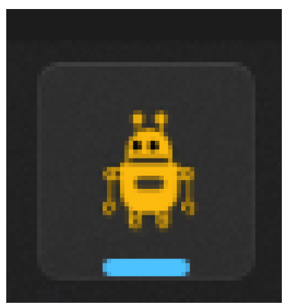
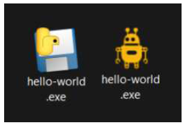
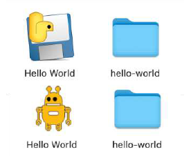

---
prev:
  text: '36. 使用命令行参数'
  link: '/FurtherPyQt6Features/36'
next:
  text: '38. 使用InstallForge创建Windows安装程序'
  link: '/PackagingAndDistribution/38'
---

> 设计只有在有人使用它时才算完成。
>
> ——布伦达·劳瑞尔（Brenda Laurel），博士

如果您无法与他人分享自己开发的应用程序，那么开发应用程序的乐趣就大打折扣了——无论是商业发布、在线分享，还是仅仅赠送给认识的人。分享您的应用程序，可以让其他人也能受益于您的辛勤工作！

将 Python 应用程序打包以供分发通常有点棘手，尤其是当目标平台是多个系统（Windows、macOS 和 Linux）时。这是因为需要将源代码、数据文件、Python 运行时以及所有相关库打包成一个能够在目标系统上可靠运行的包。幸运的是，有工具可以帮您解决这个问题！

在本章中，我们将逐步讲解如何打包应用程序以与他人分享。

## 37. 使用PyInstaller进行打包

PyInstaller 是一个跨平台的 PyQt6 打包系统，支持为 Windows、macOS 和 Linux 构建桌面应用程序。它会自动将您的 Python 应用程序以及任何相关的库和数据文件打包到一个独立的单文件可执行文件或可分发的文件夹中，您然后可以使用它来创建安装程序。

在本章中，我们将逐步演示如何使用 PyInstaller 打包一个 PyQt6 应用程序。我们即将构建的应用程序被我故意设计得非常简单，仅包含一个窗口和几个图标，但相同的流程可用于构建您自己的任何应用程序。我们将介绍如何以可重复的方式自定义应用程序名称、图标以及打包数据文件。我们还将探讨在构建自有应用程序时可能遇到的常见问题。

一旦我们将应用程序打包成可分发的可执行文件，我们将继续创建Windows安装程序、macOS磁盘映像和Linux包，这些都可以与他人分享。


> 本书的源代码下载包含适用于Windows、macOS和Ubuntu Linux的完整构建示例。


> 您始终需要在目标系统上编译您的应用程序。因此，如果您想要构建一个 Windows 可执行文件，您需要在 Windows 系统上进行此操作。

## 依赖

PyInstaller 默认支持 PyQt6，且截至本文撰写时，PyInstaller 的最新版本与 Python 3.6+ 兼容。无论您正在处理什么项目，都应能够打包您的应用程序。本教程假设您已安装了 Python 并配置了 `pip` 包管理器。

您可以使用 `pip` 安装 PyInstaller。

```bash
pip3 install PyInstaller
```

如果您在打包应用程序时遇到问题，您的第一步应该是使用以下命令将 PyInstaller 和 hooks 包更新到最新版本：

```bash
pip3 install --upgrade PyInstaller pyinstaller-hooks-contrib
```

挂钩模块包含针对常见 Python 包的特定打包说明和解决方法，并且比 PyInstaller 本身更新更频繁。

## 开始使用

从一开始就着手打包应用程序是个好主意，这样您就可以在开发过程中确认打包功能是否正常工作。这在添加额外依赖项时尤为重要。如果您只在最后才考虑打包问题，那么要准确定位问题所在可能会非常困难。

对于这个示例，我们将从一个简单的骨架应用程序开始，该应用程序目前不做任何有趣的事情。一旦我们完成了基本的打包过程，我们将开始扩展功能，并在每个步骤中确认构建过程仍然正常工作。

首先，为您的应用程序创建一个新文件夹，然后在名为 `app.py` 的文件中添加以下内容：

*Listing 247. packaging/basic/app.py*

```python
from PyQt6.QtWidgets import QMainWindow, QApplication, QPushButton

import sys


class MainWindow(QMainWindow):
    def __init__(self):
        super().__init__()
        
        self.setWindowTitle("Hello World")
        
        button = QPushButton("My simple app.")
        button.pressed.connect(self.close)
        
        self.setCentralWidget(button)
        self.show()
        
app = QApplication(sys.argv)
w = MainWindow()
app.exec()
```

这是一个基本的简易应用程序，它创建了一个自定义的 `QMainWindow` 并向其中添加了一个简单的 `QPushButton` 。点击该按钮将关闭窗口。您可以按照以下方式运行此应用程序：

```bash
python app.py
```

这应该会显示以下窗口


> 图243：适用于 Windows、macOS 和 Ubuntu Linux 的简单应用程序

## 构建基础应用程序

现在我们已经确认简单的应用程序可以正常运行，我们可以创建第一个测试构建。打开终端（shell）并导航到包含项目文件的文件夹。运行以下命令以创建 PyInstaller 构建。

```bash
pyinstaller --windowed app.py
```


> `--windowed` 命令行选项是构建 macOS 上的 `.app` 应用程序包以及在 Windows 上隐藏终端输出的必要条件。在 Linux 上该选项无效。

您将看到一系列输出消息，这些消息提供了关于PyInstaller正在执行什么操作的调试信息。这些信息对于排查构建过程中的问题非常有用，但如果不需要，也可以忽略。

*Listing 248. Output running pyinstaller on Windows*

```bash
> pyinstaller app.py
388 INFO: PyInstaller: 4.7
388 INFO: Python: 3.7.6
389 INFO: Platform: Windows-10-10.0.22000-SP0
392 INFO: wrote app.spec
394 INFO: UPX is not available.
405 INFO: Extending PYTHONPATH with paths
....etc.
```

构建完成后，查看您的文件夹，您会发现现在有了两个新的文件夹：`dist` 和 `build`。


> 图244：PyInstaller 生成的 build 和 dist 文件夹

以下是文件夹结构的简要列表，展示了 `dist` 和 `build` 文件夹。实际文件会根据您构建的平台而有所不同，但整体结构始终保持一致。

```text
.
├── app.py
├── app.spec
├── build
│ 	└── app
│ 		├── localpycos
│ 		├── Analysis-00.toc
│ 		├── COLLECT-00.toc
│ 		├── EXE-00.toc
│ 		├── PKG-00.pkg
│ 		├── PKG-00.toc
│ 		├── PYZ-00.pyz
│ 		├── PYZ-00.toc
│ 		├── app
│ 		├── app.pkg
│ 		├── base_library.zip
│ 		├── warn-app.txt
│ 		└── xref-app.html
└── dist
	└── app
		├── lib-dynload
		...
```

构建文件夹由 PyInstaller 用于收集和准备打包文件，其中包含分析结果和一些额外的日志。对于大多数情况，您可以忽略此文件夹的内容，除非您正在尝试调试问题。

`dist`（即“分发”）文件夹包含待分发的文件。这包括您的应用程序，以可执行文件形式打包，以及任何关联的库（例如PyQt6）。运行您的应用程序所需的一切都将包含在此文件夹中，这意味着您可以将此文件夹分发给他人以运行您的应用程序。

您可以现在尝试自行运行已构建的应用程序，只需运行 `dist` 文件夹中的可执行文件名为 `app` 的文件。稍等片刻后，您将看到应用程序的熟悉窗口弹出，如下图所示。


>  图245：简单应用程序，打包后即可运行。

在您的 Python 文件所在的同一文件夹中，与 `build` 和 `dist` 文件夹并列，PyInstaller 还会生成一个 `.spec` 文件。

## `.spec` 文件

`.spec` 文件包含 PyInstaller 用于打包应用程序的构建配置和指令。每个 PyInstaller 项目都有一个 `.spec`文件，该文件基于您在运行 `pyinstaller` 时传递的命令行选项生成。

当我们使用 `pyinstaller` 运行脚本时，除了传入我们的 Python 应用程序文件名外，没有传入其他任何内容。这意味着我们的 spec 文件目前仅包含默认配置。如果你打开它，您会看到类似于我们下面所示的内容。

*Listing 249. packaging/basic/app.spec*

```python
# -*- mode: python ; coding: utf-8 -*-


block_cipher = None


a = Analysis(['app.py'],
             pathex=[],
             binaries=[],
             datas=[],
             hiddenimports=[],
             hookspath=[],
             hooksconfig={},
             runtime_hooks=[],
             excludes=[],
             win_no_prefer_redirects=False,
             win_private_assemblies=False,
             cipher=block_cipher,
             noarchive=False)
pyz = PYZ(a.pure, a.zipped_data,
          cipher=block_cipher)

exe = EXE(pyz,
          a.scripts,
          [],
          exclude_binaries=True,
          name='app',
          debug=False,
          bootloader_ignore_signals=False,
          strip=False,
          upx=True,
          console=True,
          disable_windowed_traceback=False,
          target_arch=None,
          codesign_identity=None,
          entitlements_file=None )
coll = COLLECT(exe,a.binaries,
               a.zipfiles,
               a.datas,
               strip=False,
               upx=True,
               upx_exclude=[],
               name='app')
```

首先需要注意的是，这是一个 Python 文件，这意味着您可以编辑它并使用 Python 代码来计算设置的值。这在处理复杂构建时特别有用，例如当您针对不同平台进行构建时，希望根据条件定义要打包的额外库或依赖项。

如果您在 macOS 上进行构建，您还将有一个额外的 `BUNDLE` 块，用于构建 `.app` 包。该部分将大致如下所示：

```python
app = BUNDLE(coll,
             name='app.app',
             icon=None,
             bundle_identifier=None)
```

如果您在其他平台上开始构建，但希望以后针对 macOS 进行构建，您可以手动将以下内容添加到 `.spec` 文件的末尾：

一旦生成了 `.spec` 文件，您可以将该文件传递给 `pyinstaller` ，而不是您的脚本，以重复之前的构建过程。现在运行此命令以重新构建您的可执行文件。

```bash
pyinstaller app.spec
```

生成的构建结果将与用于生成 `.spec` 文件的构建完全相同（假设您未对项目进行任何修改）。对于许多 PyInstaller配置更改，您可以选择通过命令行参数传递参数，或修改现有的 `.spec` 文件。具体选择哪种方式由您决定，不过我建议对于更复杂的构建，最好直接编辑 `.spec` 文件。

## 调整构建过程

我们已经创建了一个非常简单的应用程序并构建了第一个可执行文件。现在我们将看看可以对构建过程进行的一些调整

### 为您的应用程序命名

您可以做的最简单的更改之一就是为您的应用程序提供一个合适的“名称”。默认情况下，应用程序会采用源文件的名称（不包括扩展名），例如 `main` 或 `app`。这通常不是您希望为可执行文件命名的名称。

您可以通过编辑 `.spec` 文件并修改 `EXE` 和 `COLLECT` 块（以及 macOS 上的 `BUNDLE`）下的 `name=` 属性，为 PyInstaller 指定一个更友好的名称用于您的可执行文件（以及 `dist` 文件夹）。

*Listing 250. packaging/custom/hello-world.spec*

```python
exe = EXE(pyz,
          a.scripts,
          [],
          exclude_binaries=True,
          name='hello-world',
          debug=False,
          bootloader_ignore_signals=False,
          strip=False,
          upx=True,
          console=True,
          disable_windowed_traceback=False,
          target_arch=None,
          codesign_identity=None,
          entitlements_file=None )
coll = COLLECT(exe,
               a.binaries,
               a.zipfiles,
               a.datas,
               strip=False,
               upx=True,
               upx_exclude=[],
               name='hello-world')
```

`EXE` 下的名称是可执行文件的名称，而 `COLLECT`下的名称是输出文件夹的名称。


> 我建议您为可执行文件使用不包含空格的名称——请改用连字符或驼峰式命名法。

`BUNDLE` 块中指定的名称用于 macOS 应用程序包，该名称是应用程序在 Launchpad 和 Dock 中显示的用户可见名称。在我们的示例中，我们将应用程序可执行文件命名为 “hello-world”，但对于 `.app` 包，您可以使用更友好的 “Hello World.app”。

*Listing 251. packaging/custom/hello-world.spec*

```python
app = BUNDLE(coll,
             name='Hello World.app',
             icon=None,
             bundle_identifier=None)
```

或者，您可以重新运行 `pyinstaller` 命令，并传递 `-n` 或 `--name` 配置选项，同时提供您的 `app.py` 脚本。

```bash
pyinstaller --windowed -n "hello-world" app.py
# 或者
pyinstaller --windowed --name "hello-world" app.py
```

生成的可执行文件将命名为 `hello-world`，而展开后的构建文件将放置在 `dist\hello-world\` 文件夹中。`.spec` 文件的名称取自命令行中传递的名称，因此这也将为您创建一个新的 `spec` 文件，名为 `hello-world.spec`，位于您的根文件夹中。


> 如果您创建了一个新的 `.spec` 文件，请删除旧的文件以避免混淆！



> 图246：带有自定义名称“hello-world”的应用程序。

### 应用程序图标

另一个简单的改进是更改应用程序运行时显示的应用程序图标。我们可以设置应用程序窗口/任务栏的图标，这可以通过在代码中调用 `.setWindowIcon()` 实现。

*Listing 252. packaging/custom/app.py*

```python
from PyQt6.QtWidgets import QMainWindow, QApplication, QPushButton
from PyQt6.QtGui import QIcon

import sys


class MainWindow(QMainWindow):
    def __init__(self):
        super().__init__()
        
        self.setWindowTitle("Hello World")
        
        button = QPushButton("My simple app.")
        button.pressed.connect(self.close)
        
        self.setCentralWidget(button)
        self.show()
        
app = QApplication(sys.argv)
app.setWindowIcon(QIcon("icon.svg"))
w = MainWindow()
app.exec()
```

在此，我们向应用程序实例添加了 `.setWindowIcon` 调用。这定义了一个用于应用程序所有窗口的默认图标。如果您愿意，可以针对每个窗口单独覆盖此设置，通过在窗口本身调用 `.setWindowIcon` 来实现。将图标复制到与脚本相同的文件夹中。

如果您运行上述应用程序，现在应该会在Windows系统的窗口上看到图标，而在macOS或Ubuntu Linux系统中则会在Dock栏上看到图标。


> 图247：显示自定义图标的窗口


> 关于图标的说明。
>
> 在此示例中，我们设置了一个单一的图标文件，使用可缩放矢量图形（SVG）文件，该文件在任何大小下都将保持清晰。您也可以使用位图图像，在这种情况下，您需要提供多种尺寸以确保图标始终保持清晰。在 Windows 上，您可以通过创建 ICO 文件来实现，该文件是包含多个图标的特殊文件。在 Linux 上，您可以在安装过程中提供多个不同的 PNG 文件（参见 Linux 打包部分）。在 macOS 上，多个图标尺寸由包含在 `.app` 包中的 ICNS 文件提供。
>
> 是的，这确实让人困惑！但幸运的是，Qt支持所有平台上的各种图标格式。


> 即使您没有看到图标，请继续阅读！

### 处理相对路径

这里有一个需要注意的细节，可能并不明显。请您打开终端，切换到保存脚本的文件夹。然后像往常一样运行它：

```bash
python3 app.py
```

如果图标位于正确的位置，您应该能够看到它们。现在切换到父文件夹，并再次运行您的脚本（将 `<folder>` 替换为脚本所在文件夹的名称）。

```bash
cd ..
python3 <folder>/app.py
```


> 图248：缺少图标的窗口

图标没有显示。这是怎么回事？

我们使用相对路径来引用数据文件。这些路径相对于当前工作目录——不是脚本所在的文件夹，而是您运行脚本的文件夹。如果您从其他地方运行脚本，它将无法找到这些文件。


> 图标无法显示的一个常见原因是，在使用项目根目录作为当前工作目录的IDE中运行示例。

这是在应用程序打包前的一个小问题，但一旦安装后，您将无法知道应用程序运行时当前的工作目录是什么——如果工作目录错误，您的应用程序将无法找到其数据文件。我们需要在继续之前解决这个问题，可以通过将路径设置为相对于应用程序文件夹的相对路径来实现。

在下面的更新代码中，我们定义了一个新变量 `basedir`，使用 `os.path.dirname` 获取 `__file__` 所包含的文件夹，该文件夹包含当前 Python 文件的完整路径。然后，我们使用 `os.path.join()` 构建数据文件的相对路径。


> 请参阅“使用相对路径”部分以获取更多信息，以及在应用程序中使用相对路径的更可靠方法。

由于我们的 `app.py` 文件位于文件夹的根目录下，因此所有其他路径都是相对于该目录的。

*Listing 253. packaging/custom/app_relative_paths.py*

```python
import os
import sys

from PyQt6.QtGui import QIcon
from PyQt6.QtWidgets import QApplication, QMainWindow, QPushButton

basedir = os.path.dirname(__file__)


class MainWindow(QMainWindow):
    def __init__(self):
        super().__init__()
        
        self.setWindowTitle("Hello World")
        
        button = QPushButton("My simple app.")
        button.setIcon(QIcon(os.path.join(basedir, "icon.svg")))
        button.pressed.connect(self.close)
        
        self.setCentralWidget(button)
        self.show()
        
app = QApplication(sys.argv)
app.setWindowIcon(QIcon(os.path.join(basedir, "icon.svg")))
w = MainWindow()
app.exec()
```

请尝试从父文件夹重新运行您的应用程序——您会发现图标现在会如预期般显示，无论您从何处启动应用程序。

### 任务栏图标（仅限Windows系统）

在 Windows 系统中，使用 `.setWindowIcon()` 方法可以正确设置窗口的图标。然而，由于 Windows 系统对窗口的跟踪和分组方式，有时图标可能不会在任务栏上显示。


> 如果对您有效，太好了！但当您分发应用程序时，它可能无法正常工作，因此请务必按照以下步骤操作！

当您运行应用程序时，Windows 会检查可执行文件并尝试确定其所属的“应用程序组”。默认情况下，所有 Python 脚本（包括您的应用程序）都会被归类到同一个“Python”组中，因此会显示 Python 图标。要阻止这种情况发生，我们需要为应用程序提供一个不同的应用程序标识符。

下面的代码通过调用 `SetCurrentProcessExplicitAppUserModelID()` 方法，并传入自定义的应用程序 ID 来实现这一点。

*Listing 254. packaging/custom/app_windows_taskbar.py*

```python
from PyQt6.QtWidgets import QMainWindow, QApplication, QPushButton
from PyQt6.QtGui import QIcon

import sys, os

basedir = os.path.dirname(__file__)

try: #1
    from ctypes import windll # 仅存在于Windows系统中.
    
    myappid = "mycompany.myproduct.subproduct.version" #2
    windll.shell32.SetCurrentProcessExplicitAppUserModelID(myappid)
except ImportError:
    pass


class MainWindow(QMainWindow):
    def __init__(self):
        super().__init__()
        
        self.setWindowTitle("Hello World")
        
        button = QPushButton("My simple app.")
        button.setIcon(QIcon(os.path.join(basedir, "icon.svg")))
        button.pressed.connect(self.close)
        
        self.setCentralWidget(button)
        self.show()
        
        
app = QApplication(sys.argv)
app.setWindowIcon(QIcon(os.path.join(basedir, "icon.svg")))
w = MainWindow()
app.exec()
```

> 1. 该代码被包裹在 `try/except` 块中，因为 `windll` 模块在非Windows平台上不可用。这使得您的应用程序可以在macOS和Linux上继续运行。
> 2. 为您的应用程序自定义应用程序标识符字符串。

上述列表显示了一个通用的 `mycompany.myproduct.subproduct.version` 字符串，但您应将其修改为与实际应用程序相符。此处填写的内容并不重要，但惯例是使用反向域名表示法，即使用 `com.mycompany` 作为公司标识符。

将此代码添加到您的脚本中，您的图标一定会显示在任务栏上。



> 图249：自定义图标显示在任务栏上

### 可执行文件图标（仅限Windows系统）

现在，当应用程序运行时，图标显示正确。但是，您可能会注意到，您的应用程序可执行文件仍然使用不同的图标。在 Windows 系统中，应用程序可执行文件可以嵌入图标，以便更容易识别。默认图标是由 PyInstaller 提供的，但您可以用自己的图标替换它。

要为 Windows 可执行文件添加图标，您需要向 `EXE` 块提供一个 `.ico` 格式的文件。

*Listing 255. packaging/custom/hello-world-icons.spec*

```python
exe = EXE(pyz,
          a.scripts,
          [],
          exclude_binaries=True,
          name='hello-world',
          icon='icon.ico',
          debug=False,
          bootloader_ignore_signals=False,
          strip=False,
          upx=True,
          console=True,
          disable_windowed_traceback=False,
          target_arch=None,
          codesign_identity=None,
          entitlements_file=None )
```

要创建 .ico 文件，我建议您使用 [Greenfish Icon Editor Pro](http://greenfishsoftware.org/gfie.php)，这是一个免费且开源的工具，也可以为 Windows 创建图标。本书的下载内容中包含一个示例 `.ico` 文件。

如果您使用修改后的 `.spec` 文件运行 `pyinstaller` 构建，您会发现可执行文件现在有了自定义图标。



> 图250：Windows 可执行文件显示默认和自定义图标


> 您还可以通过在初始构建时向 pyinstaller 传递 `--icon icon.ico` 参数来提供图标。您可以通过这种方式提供多个图标，以支持 macOS 和 Windows。

### macOS .app 应用程序包图标（仅限 macOS）

在 macOS 上，应用程序以 `.app` 包的形式分发，这些包可以拥有自己的图标。包图标用于在启动台和应用启动时在 Dock 上识别应用程序。PyInstaller 可以为您添加图标到应用程序包中，您只需将 ICNS 格式文件传递到 `.spec` 文件中的 `BUNDLE` 块即可。该图标随后将显示在生成的包中，并在应用启动时显示。

*Listing 256. packaging/custom/hello-world-icons.spec*

```python
app = BUNDLE(coll,
             name='Hello World.app',
             icon='icon.icns',
             bundle_identifier=None)
```

ICNS 是 macOS 系统中图标文件的文件格式。您可以在 macOS 系统上使用 [Icon Composer](https://github.com/lemonmojo/IconComposer2x/) 创建图标文件。您还可以在 Windows 系统上使用 [Greenfish Icon Editor Pro](http://greenfishsoftware.org/gfie.php) 创建 macOS 图标。



> 图251：macOS .app 应用程序包显示默认和自定义图标


> 您还可以通过在初始构建时向 `pyinstaller` 传递 `--icon icon.icns` 参数来提供图标。您可以通过这种方式提供多个图标，以支持 macOS 和 Windows。

在我们的示例中，应用程序启动时，包中的图标集将被 `.setWindowIcon` 调用替换。然而，在 macOS 上，您可以完全跳过 `.setWindowIcon()` 调用，只需通过 `.app` 包设置图标即可。

## 数据文件和资源

现在我们已经有一个可以正常运行的应用程序，它拥有自定义名称、自定义应用程序图标，以及一些调整，以确保该图标在所有平台上显示，并且无论应用程序从何处启动，都能正确显示。在这些设置就位后，最后一步是确保该图标正确打包到应用程序中，并且在从 `dist` 文件夹运行时继续显示。


> 试试看，它不会如您所愿。

问题是，我们的应用程序现在依赖于一个外部数据文件（图标文件），而该文件不属于我们的源代码。为了使应用程序正常运行，我们现在需要将该数据文件与应用程序一起分发。PyInstaller 可以帮助我们实现这一点，但我们需要告诉它要包含哪些内容，以及在输出中将它们放置在哪里。

在下一节中，我们将探讨管理与应用程序相关的数据文件的可用选项。这种方法不仅适用于图标文件，还可用于任何其他数据文件，包括您的应用程序所需的Qt Designer `.ui` 文件。

### 使用PyInstaller打包数据文件

我们的应用程序现在依赖于一个图标文件。

*Listing 257. packaging/data-file/app.py*

```python
from PyQt6.QtWidgets import (
    QMainWindow,
    QApplication,
    QPushButton,
    QVBoxLayout,
    QLabel,
    QWidget,
)
from PyQt6.QtGui import QIcon

import sys, os

basedir = os.path.dirname(__file__)

try:
    from ctypes import windll # 仅存在于Windows系统中.
    
    myappid = "mycompany.myproduct.subproduct.version"
    windll.shell32.SetCurrentProcessExplicitAppUserModelID(myappid)
except ImportError:
    pass


class MainWindow(QMainWindow):
    def __init__(self):
        super().__init__()
        
        self.setWindowTitle("Hello World")
        layout = QVBoxLayout()
        label = QLabel("My simple app.")
        label.setMargin(10)
        layout.addWidget(label)
        
        button = QPushButton("Push")
        button.pressed.connect(self.close)
        layout.addWidget(button)
        
        container = QWidget()
        container.setLayout(layout)
        
        self.setCentralWidget(container)
        
        self.show()
        
        
app = QApplication(sys.argv)
app.setWindowIcon(QIcon(os.path.join(basedir, "icon.svg")))
w = MainWindow()
app.exec()
```

将此数据文件放入 `dist` 文件夹的最简单方法是直接告诉PyInstaller将其复制过去。PyInstaller支持指定要复制的单个文件路径列表，以及相对于 `dist/<应用程序名称>` 文件夹的文件夹路径，用于将文件复制到该位置。

与其他选项一样，这可以通过命令行参数指定，`--add-data`，您可以多次提供该参数。

```bash
pyinstaller --add-data "icon.svg:." --name "hello-world" app.py
```


> 路径分隔符因平台而异，在 Linux 或 Mac 上使用 `:` 而在 Windows 上使用 `;`

或者通过规格文件分析部分中的数据列表，以源位置和目标位置的元组形式。

```python
a = Analysis(['app.py'],
             pathex=[],
             binaries=[],
             datas=[('icon.svg', '.')],
             hiddenimports=[],
             hookspath=[],
             runtime_hooks=[],
             excludes=[],
             win_no_prefer_redirects=False,
             win_private_assemblies=False,
             cipher=block_cipher,
             noarchive=False)
```

然后使用以下命令执行 `.spec` 文件：

```bash
pyinstaller hello-world.spec
```

在两种情况下，我们都告诉 PyInstaller 将指定的文件 `icon.svg` 复制到 `.` 位置。这意味着输出文件夹 `dist`。如果需要，我们也可以在此指定其他位置。 如果您现在运行构建，您应该可以在输出文件夹 `dist` 中看到您的 `.svg` 文件，准备与您的应用程序一起分发。


> 图252：被复制到 dist 文件夹的图标文件

如果您从 `dist` 目录运行应用程序，现在应该能看到预期的图标。


> 图253：窗口（Windows）和底栏（macOS 和 Ubuntu）上显示的图标


> 该文件必须使用相对路径在Qt中加载，并且其相对位置与EXE文件的相对位置相同，与它在 `.py` 文件中的相对位置相同，以确保其正常工作。


> 如果您在 Windows 机器上开始构建，您的 `.spec` 文件可能会包含使用双反斜杠 `\\` 的路径。这在其他平台上无法正常工作，因此您应该将这些路径替换为单正斜杠 `/`，因为单正斜杠在所有平台上都有效。

### 打包数据文件夹

通常，您会有多个数据文件需要包含在您的打包文件中。最新版本的PyInstaller允许您像打包文件一样打包文件夹，同时保留子文件夹结构。为了演示如何打包数据文件夹，让我们在应用程序中添加几个按钮并为它们添加图标。我们可以将这些图标放在一个名为 `icons` 的文件夹下。

*Listing 258. packaging/data-folder/app.py*

```python
from PyQt6.QtWidgets import (
    QMainWindow,
    QApplication,
    QLabel,
    QVBoxLayout,
    QPushButton,
    QWidget,
)
from PyQt6.QtGui import QIcon
import sys, os

basedir = os.path.dirname(__file__)

try:
    from ctypes import windll # 仅存在于Windows系统中.
    myappid = "mycompany.myproduct.subproduct.version"
    windll.shell32.SetCurrentProcessExplicitAppUserModelID(myappid)
except ImportError:
    pass


class MainWindow(QMainWindow):
    def __init__(self):
        super().__init__()
        
        self.setWindowTitle("Hello World")
        layout = QVBoxLayout()
        label = QLabel("My simple app.")
        label.setMargin(10)
        layout.addWidget(label)
        
        button_close = QPushButton("Close")
        button_close.setIcon(
            QIcon(os.path.join(basedir, "icons", "lightning.svg"))
        )
        button_close.pressed.connect(self.close)
        layout.addWidget(button_close)
        
        button_maximize = QPushButton("Maximize")
        button_maximize.setIcon(
            QIcon(os.path.join(basedir, "icons", "uparrow.svg"))
        )
        button_maximize.pressed.connect(self.showMaximized)
        layout.addWidget(button_maximize)
        
        container = QWidget()
        container.setLayout(layout)
        
        self.setCentralWidget(container)
        
        self.show()
        
        
app = QApplication(sys.argv)
app.setWindowIcon(QIcon(os.path.join(basedir, "icons", "icon.svg")))
w = MainWindow()
app.exec()
```


> 此代码中包含了Windows任务栏图标的修复程序，如果您不是在为Windows构建应用程序，可以跳过它。

图标（均为SVG文件）存储在名为“icons”的子文件夹中。

```text
.
├── app.py
└── icons
	└── lightning.svg
	└── uparrow.svg
	└── icon.svg
```

如果您运行此程序，将看到以下窗口，其中按钮上带有图标，窗口或 Dock 栏中也有一个图标。


> 图254：带有多个图标的窗口

要将 `icons` 文件夹复制到我们的构建应用程序中，我们只需将该文件夹添加到我们的 `.spec` 文件的 `Analysis` 块中。对于单个文件，我们将其作为元组添加，其中包含源路径（来自我们的项目文件夹）和目标文件夹，该目标文件夹位于生成的 `dist` 文件夹下。

*Listing 259. packaging/data-folder/hello-world.spec*

```python
# -*- mode: python ; coding: utf-8 -*-


block_cipher = None


a = Analysis(['app.py'],
             pathex=[],
             binaries=[],
             datas=[('icons', 'icons')],
             hiddenimports=[],
             hookspath=[],
             hooksconfig={},
             runtime_hooks=[],
             excludes=[],
             win_no_prefer_redirects=False,
             win_private_assemblies=False,
             cipher=block_cipher,
             noarchive=False)
pyz = PYZ(a.pure, a.zipped_data,
          cipher=block_cipher)

exe = EXE(pyz,
          a.scripts,
          [],
          exclude_binaries=True,
          name='hello-world',
          icon='icons/icon.ico',
          debug=False,
          bootloader_ignore_signals=False,
          strip=False,
          upx=True,
          console=False,
          disable_windowed_traceback=False,
          target_arch=None,
          codesign_identity=None,
          entitlements_file=None )
coll = COLLECT(exe,
               a.binaries,
               a.zipfiles,
               a.datas,
               strip=False,
               upx=True,
               upx_exclude=[],
               name='hello-world')
app = BUNDLE(coll,
             name='Hello World.app',
             icon='icons/icon.icns',
             bundle_identifier=None)
```

如果您使用这个规格文件运行构建，你会发现图标文件夹已被复制到 `dist` 文件夹中。如果您从该文件夹运行应用程序——或从任何其他位置运行——图标将如预期显示，因为相对路径在新的位置仍然正确。

## 总结

随着这些更改的实施，您现在可以跨所有平台可重复地构建您的应用程序。在接下来的章节中，我们将继续探讨如何将已构建的可执行文件打包成可用的安装程序。

到目前为止，我们已经逐步介绍了如何在您自己的平台上使用PyInstaller构建应用程序。通常，您可能希望为所有平台构建您的应用程序。

如前所述，您只能在特定平台上为该平台构建软件——即，如果您想构建一个 Windows 可执行文件，您需要在 Windows 系统上进行构建。然而，理想情况下，您希望能够使用同一个 `.spec` 文件来完成这一操作，以简化维护工作。如果您想支持多个平台，现在也可以在其他系统上测试您的 `.spec` 文件，以确保构建配置正确。如果出现问题，请查阅本章中各平台的特定说明。
