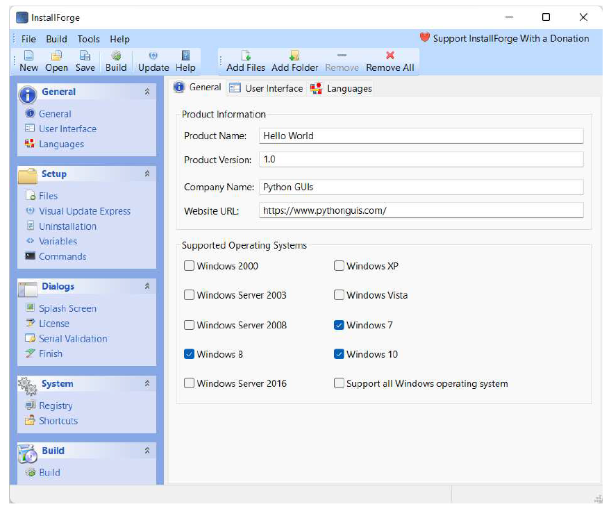
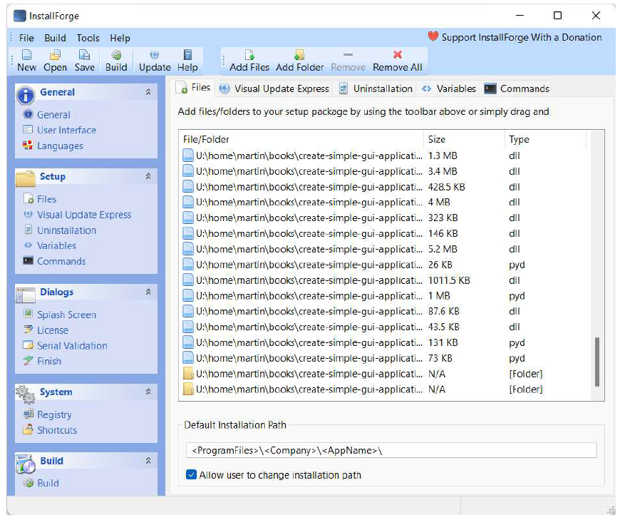
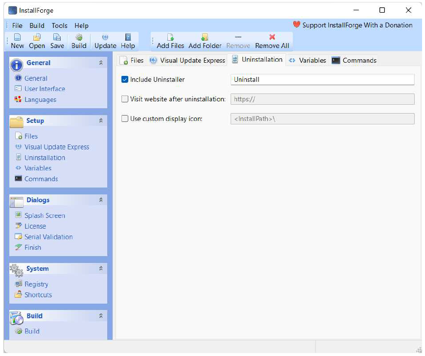
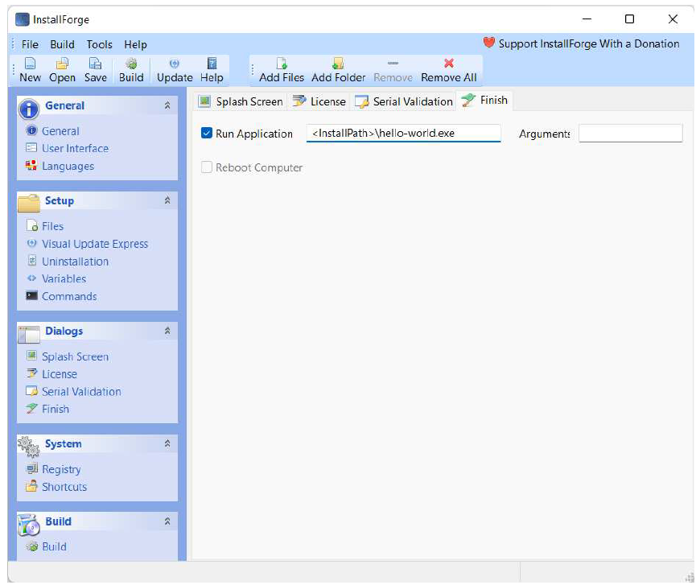
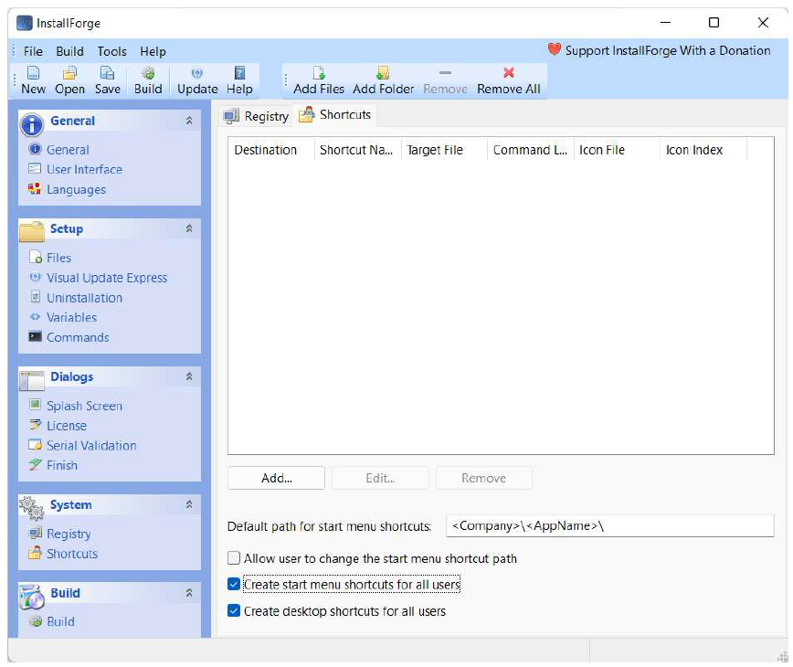
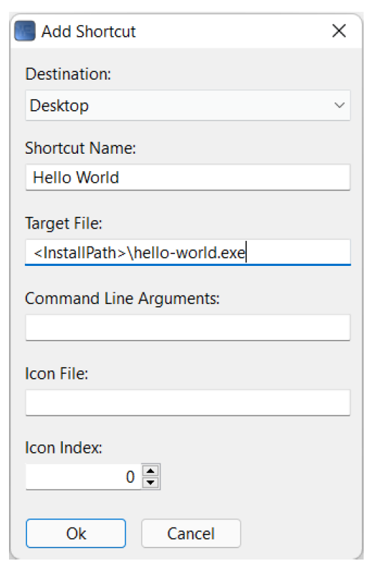
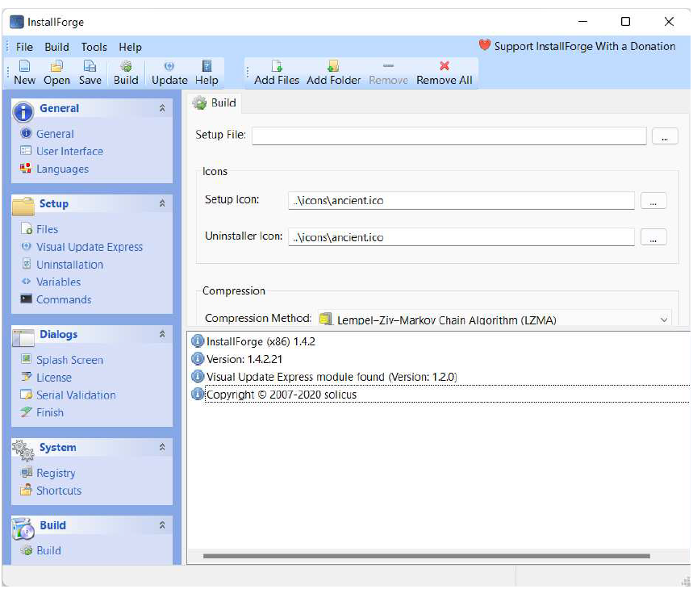
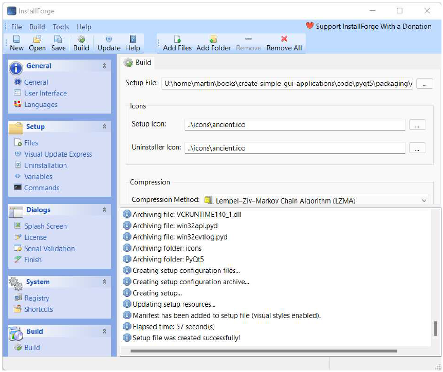
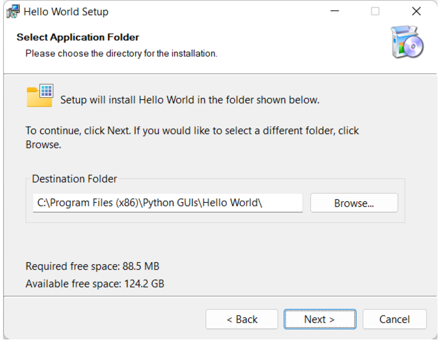
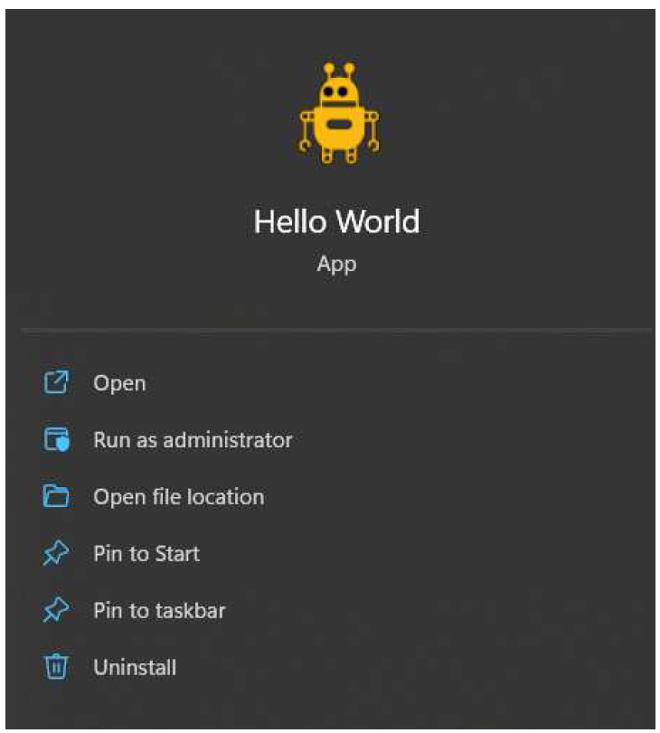

---
prev:
  text: '37. 使用PyInstaller进行打包'
  link: '/PackagingAndDistribution/37'
next:
  text: '39. 创建 macOS 磁盘映像安装程序'
  link: '/PackagingAndDistribution/39'
---

## 38. 使用InstallForge创建Windows安装程序

到目前为止，我们一直使用PyInstaller来打包应用程序以供分发。打包过程的输出结果是一个名为`dist` 的文件夹，其中包含应用程序运行所需的所有文件。虽然您可以将此文件夹作为ZIP文件分享给用户，但这并非最佳的用户体验。

Windows 桌面应用程序通常随安装程序一起分发，安装程序负责将可执行文件（以及任何其他文件）放置到正确的位置，并添加“开始”菜单快捷方式。接下来，我们将探讨如何使用我们的 `dist` 文件夹来创建一个可运行的Windows安装程序。

为了创建我们的安装程序，我们将使用一个名为 [InstallForge](https://installforge.net/) 的工具。InstallForge是免费的，可以从 [本页](https://installforge.net/download/) 下载。本书下载中的InstallForge工作配置可作为 `Hello World.ifp` 文件获取，但请注意源路径需要根据您的系统进行更新。

> 如果您急于尝试，可以先下载 [示例Windows安装程序](https://downloads.pythonguis.com/DemoAppInstallforge.exe)。

我们将逐步演示使用InstallForge创建安装程序的基本步骤。

## 通用设置

当您首次运行InstallForge时，将看到此“通用”(General)选项卡。在此，您可以输入应用程序的基本信息，包括名称、程序版本、公司和网站。

> 图255：InstallForge 初始视图，显示通用设置

您还可以选择安装程序的目标平台，从目前可用的各种版本的Windows 中进行选择。这确保用户只能将您的应用程序安装在与之兼容的 Windows 版本上。

> 这里没有什么神奇之处，在安装程序中选择额外的平台并不会让您的应用程序在这些平台上运行！您需要在安装程序中启用这些平台之前，先确保您的应用程序可以在目标版本的Windows上运行。

## 选定安装文件

点击左侧边栏以打开“Setup”下的“Files”页面。在此处您可以指定要打包到安装程序中的文件。

在工具栏上点击“Add Files…”并选择PyInstaller生成的 `dist/hello-world` 目录下的所有文件。弹出的文件浏览器支持多文件选择，因此您可以一次性添加所有文件，但需要单独添加文件夹。您可以点击“添加文件夹…”并添加 `dist/hello-world` 目录下的任何文件夹，例如您的 `icons` 文件夹和其他库文件夹。

> 图256：在InstallForge文件视图中，将所有要打包的文件和文件夹添加进去。

> 所选文件夹的内容将被递归包含，您无需选择子文件夹。

完成后，您可以滚动列表到底部，确保以下文件夹被列出以包含在内：`dist/helloworld` 下的所有文件和文件夹都应存在。但 `dist/hello-world` 文件夹本身不应被列出。

默认安装路径可以保持不变。尖括号中的值，例如 `<company>` 是变量，将从配置中自动填充。接下来，建议允许用户卸载您的应用程序。尽管它无疑很棒，但用户未来可能希望卸载它。您可以在“卸载”选项卡中通过勾选复选框来实现此功能。这也将使应用程序出现在Windows“添加或删除程序”列表中。

> 图257：InstallForge 为您的应用程序添加卸载程序

## 对话框

“对话框”部分可用于向用户显示自定义消息、启动画面或许可证信息。 “完成”选项卡可用于控制安装程序完成后发生的事情，在此处为用户提供在安装完成后运行程序的选项会很有帮助。

要实现这一点，您需要勾选“Run program”旁边的复选框，并将您自己的应用程序 EXE 文件添加到该框中。由于 `<installpath>\` 已经指定，我们只需添加 `hello-world.exe` 即可。在首次启动时，可以使用参数向程序传递任何参数。

> 图258：InstallForge 在安装完成后配置可选的运行程序。

## 系统

在“System”下选择“System”可以打开快捷方式编辑器。在这里，您可以为开始菜单和桌面设置快捷方式。

> 图259：InstallForge 配置快捷方式，用于开始菜单和桌面

点击“Add…”可以添加应用程序的新快捷方式。选择“开始菜单” (Start
menu) 或“桌面” (Desktop) 快捷方式，并填写名称和目标文件。这是应用程序安装后EXE文件的最终路径。由于 `<installpath>\` 已指定，您只需在末尾添加应用程序的EXE文件名，例如 `hello-world.exe` 。

> 图260：InstallForge，添加快捷方式

## 构建

基本设置完成后，您现在可以开始构建安装程序了。

> 此时您可以保存您的InstallForge项目，以便将来可以从相同的设置重新构建安装程序。

点击底部“Build”部分以打开构建面板

> 图261：InstallForge，随时准备构建

点击工具栏上的“构建”图标以启动构建过程。如果您尚未指定安装程序文件的位置，系统将提示您选择一个。这是您希望保存**完成的安装程序**的位置。构建过程将开始，这会收集并压缩文件到安装程序中。

> 图262：InstallForge，构建完成

完成后，系统将提示您运行安装程序。这是可选项，但是相当必要，因为您可以通过这样来检验您的安装程序是否可以正常运行。

## 运行安装程序

安装程序本身应该不会有意外，运行正常。根据在InstallForge中选择的选项，您可能会看到额外的面板或选项。

> 图263：InstallForge，运行生成的安装程序

请您按照安装程序的提示完成安装。您可选择在安装程序的最后一步直接运行该应用程序，或在开始菜单中找到它。

> 图264：在 Windows 11 的开始菜单中显示“Hello World”程序。

## 总结

在前一章中，我们介绍了如何使用 PyInstaller 将您的 PyQt6 应用程序打包成可分发的可执行文件。在本章中，我们使用已打包的 PyInstaller 应用程序，并逐步演示了如何使用 InstallForge 构建该应用程序的安装程序。按照这些步骤操作，您应该能够将自己的应用程序打包，并使其在 Windows 系统上可供他人使用。

> 另一个用于构建 Windows 安装程序的流行工具是 [NSIS](https://nsis.sourceforge.io/Main_Page) ，它是一个可脚本化的安装程序，这意味着您可以通过编写自定义脚本来配置其行为。如果您需要频繁构建应用程序并希望自动化该过程，那么它绝对值得一试。
