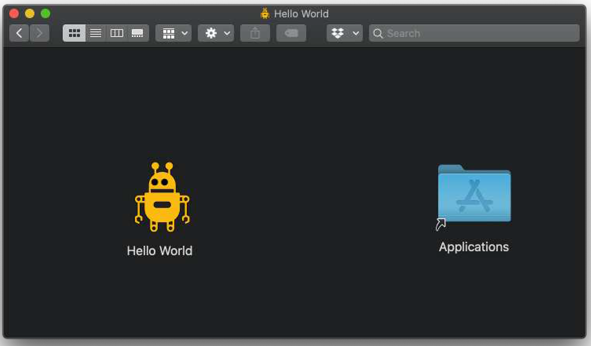

---
prev:
  text: '38. 使用InstallForge创建Windows安装程序'
  link: '/PackagingAndDistribution/38'
next:
  text: '40. 创建一个Linux软件包'
  link: '/PackagingAndDistribution/40'
---

## 39. 创建 macOS 磁盘映像安装程序 

在前一章中，我们使用 PyInstaller 从我们的应用程序构建了一个 macOS `.app` 文件。打开这个 `.app` 文件会运行你的应用程序，理论上您可以直接将它分发给其他人。然而，有一个问题——macOS `.app` 文件实际上只是带有特殊扩展名的文件夹。这意味着它们不适合直接分享——最终用户需要下载文件夹内的所有单独文件。

解决方案是将 `.app` 文件封装在 Zip 文件（`.zip`）或磁盘映像文件（`.dmg`）中。大多数商业软件都采用磁盘映像格式，因为这样可以包含一个快捷方式，指向用户的“应用程序”文件夹，使用户能够通过拖放操作将应用程序直接拖入该文件夹。这种做法如今已非常普遍，以至于许多用户如果遇到其他格式可能会感到困惑。我们还是遵循这一惯例吧。


> 如果您等不及了，您可以先下载 [示例 macOS 磁盘映像](https://downloads.pythonguis.com/DemoAppMacOS.dmg) 。

## 创建DMG文件

自行创建DMG文件相对简单，但我建议您首先使用可通过Homebrew安装的工具 `create-dmg` 。该工具以简单的命令行工具形式安装，您只需传入几个参数即可生成DMG安装程序。

您可以使用 Homebrew 安装 `create-dmg` 包。

```bash
brew install create-dmg
```

安装完成后，您即可使用 `create-dmg` Bash 脚本。以下是部分选项示例，可通过运行 `create-dmg --help` 命令查看完整列表：

```bash
--volname <name>: set volume name (displayed in the Finder sidebar and window title)
--volicon <icon.icns>: set volume icon
--background <pic.png>: set folder background image (provide png, gif, jpg)
--window-pos <x> <y>: set position the folder window
--window-size <width> <height>: set size of the folder window
--text-size <text_size>: set window text size (10-16)
--icon-size <icon_size>: set window icons size (up to 128)
--icon <file_name> <x> <y>: set position of the file's icon
--hide-extension <file_name>: hide the extension of file
--app-drop-link <x> <y>: make a drop link to Applications, at location x, y
--eula <eula_file>: attach a license file to the dmg
--no-internet-enable: disable automatic mount&copy
--format: specify the final image format (default is UDZO)
--add-file <target_name> <file|folder> <x> <y>: add additional file or folder (can be used multiple times)
--disk-image-size <x>: set the disk image size manually to x MB
--version: show tool version number
-h, --help: display the help
```


> 卷是磁盘的术语名称，因此卷名称是您希望为磁盘映像（DMG）本身命名的名称。

除了上述选项外，您还需要指定DMG文件的输出名称以及输入文件夹——即包含由PyInstaller生成的 `.app` 文件的文件夹。

下面我们将使用 `create-dmg` 工具为我们的 Hello World 应用程序创建一个安装程序 DMG 文件。我们这里只使用了部分可用选项——设置磁盘卷的名称和图标、调整窗口的位置和大小、设置应用程序的图标，以及添加 `/Applications` 目标目录链接。这是您为自己的应用程序设置的最低要求，如果您愿意，可以进一步自定义这些设置。

由于 `create-dmg` 会将指定文件夹中的所有文件复制到 DMG 中，因此您需要确保 `.app` 文件位于一个单独的文件夹中。我建议创建一个名为 `dmg` 的文件夹，并将生成的 `.app` 包复制到该文件夹中。下面我编写了一个小型脚本用于打包操作，其中包含一个测试，用于检查并删除任何之前生成的 DMG 文件。

*Listing 260. packaging/installer/mac/makedmg.sh*

```sh
#!/bin/sh
test -f "Hello World.dmg" && rm "Hello World.dmg"
test -d "dist/dmg" && rm -rf "dist/dmg"
# 创建 dmg 文件夹并复制我们的 .app 包到其中.
mkdir -p "dist/dmg"
cp -r "dist/Hello World.app" "dist/dmg"
# 创建 dmg 文件.
create-dmg \
  --volname "Hello World" \
  --volicon "icons/icon.icns" \
  --window-pos 200 120 \
  --window-size 800 400 \
  --icon-size 100 \
  --icon "Hello World.app" 200 190 \
  --hide-extension "Hello World.app" \
  --app-drop-link 600 185 \
  "Hello World.dmg" \
  "dist/dmg/"
```

请您将此内容保存到项目根目录，命名为 `build-dmg.sh`，然后将其设为可执行文件。使用以下命令：

```bash
$ chmod +x build-dmg.sh
```

然后执行脚本以构建包。

```bash
$ ./build-dmg.sh
```

`create-dmg` 进程将开始运行，并在当前目录中生成一个 DMG 文件，其名称与您为输出文件指定的名称一致（即最后一个参数，带 `.dmg` 扩展名）。现在您可以将生成的 DMG 文件分发给其他 macOS 用户了！



> 图265：生成的磁盘映像显示我们的 `.app` 包和Applications快捷方式。您可以将应用程序拖动到目标位置以进行安装。


> 有关 `create-dmg` 的更多信息，请参阅 [Github 上的文档](https://github.com/create-dmg/create-dmg) 。
