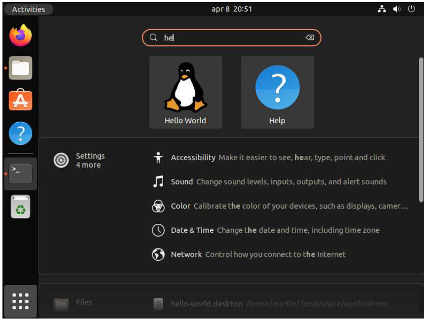
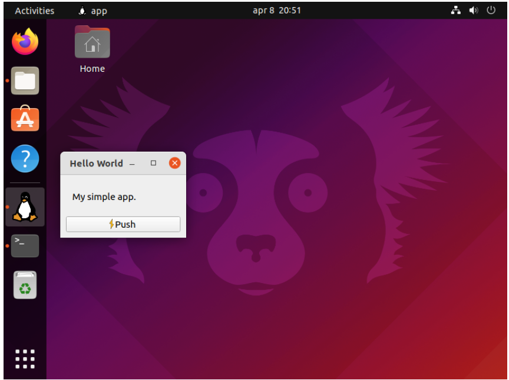

---
prev:
  text: '39. 创建 macOS 磁盘映像安装程序'
  link: '/PackagingAndDistribution/39'
next:
  false
---

## 40. 创建一个Linux软件包

在前一章中，我们使用 PyInstaller 将应用程序打包成一个 Linux 可执行文件，连同相关的数据文件。打包过程的输出是一个文件夹，可以与其他用户共享。然而，为了方便他们将其安装到自己的系统上，我们需要创建一个 Linux 包。

软件包是可分发的文件，允许用户在他们的 Linux 系统上安装软件。它们会自动将文件放置在正确的位置，并设置应用程序在任务栏/菜单中的条目，以便于启动应用程序。

在 Ubuntu（和 Debian）中，软件包被命名为 `.deb` 文件，在 Redhat 中是 `.rpm`，而在 Arch Linux 中是 `.pacman`。这些文件格式各不相同，但幸运的是，使用名为 fpm 的工具来构建它们的过程是相同的。[fpm](https://github.com/jordansissel/) 是由 Jordan Issel 开发的打包系统，它可以将一个文件夹（或文件列表）组装成一个 Linux 软件包。


> 在本章中，我们将逐步讲解创建 Linux 软件包的步骤，以 Ubuntu 的 `.deb` 文件为例。然而，得益于 fpm 的强大功能，您也可以使用相同的方法来处理其他 Linux 系统。


> 图266：Ubuntu 软件包，用于我们的“Hello World”应用程序


> 如果您等不及了，您可以先下载 [示例 Ubuntu包](https://downloads.pythonguis.com/hello-world.deb) 。

## 安装 fpm

fpm 工具是用 Ruby 编写的，使用它需要安装 Ruby。安装 Ruby 可以使用系统包管理器。

```bash
$ sudo apt-get install ruby
```

安装 Ruby 后，您可以使用 `gem` 工具安装 `fpm` 。

```bash
$ gem install fpm --user-install
```


> 如果您看到一个警告，提示您没有在 PATH 中添加 `~/.local/share/gem/ruby/2.7.0/bin`，那么您就需要 [将该路径添加到](https://askubuntu.com/a/60219) 您的 `.bashrc` 文件中。

安装完成后，您即可使用 `fpm`。您可以通过运行以下命令来检查它是否已安装并正常工作：

```bash
$ fpm --version
1.14.2
```

## 检查您的构建

在终端中，您可以切换到包含应用程序源文件的文件夹并运行PyInstaller 构建以生成 `dist` 文件夹。通过在文件管理器中打开 `dist` 文件夹并双击应用程序可执行文件，测试生成的构建是否按预期运行（它正常工作且图标显示正确）。

如果一切正常，您就可以开始打包应用程序了——如果出现问题，请返回并仔细检查所有内容。


> 在打包应用程序之前，始终建议先测试已构建的应用程序。这样，如果出现任何问题，您就能知道问题出在哪里！

现在让我们使用 `fpm` 打包我们的文件夹。

## 打包您的软件包

Linux 包用于安装各种应用程序，包括系统工具。正因如此，它们被设计成允许您将文件放置在 Linux 文件系统中的任何位置——而不同类型的文件有特定的正确存放位置。对于像我们这样的图形用户界面应用程序，我们可以将可执行文件和相关数据文件都放在同一个文件夹（`/opt`）下。但是，为了使我们的应用程序出现在菜单/搜索中，我们还需要在 `/usr/share/applications` 下安装一个 `.desktop` 文件。

确保文件最终存放在正确位置的最简单方法是，在文件夹中重建目标文件结构，然后告诉 `fpm` 使用该文件夹作为根目录进行打包。此过程也可通过脚本轻松自动化（详见后文）。

请您在项目根目录下，创建一个名为 `package` 的新文件夹及其子文件夹，这些子文件夹对应目标文件系统中的目录结构—— `/opt` 将存放我们的应用程序文件夹 `helloworld`， `/usr/share/applications` 将存放我们的 `.desktop` 文件，而 `/usr/share/icons…` 将存放我们的应用程序图标。

```bash
$ mkdir -p package/opt
$ mkdir -p package/usr/share/applications
$ mkdir -p package/usr/share/icons/hicolor/scalable/apps
```

接下来，使用递归方式（带 `-r` 参数以包含子文件夹）将 `dist/app`目录下的内容复制到`package/opt/hello-world`目录中—— `/opt/hello-world` 路径是应用程序安装后的目标目录。

```bash
$ cp -r dist/hello-world package/opt/hello-world
```


> 我们正在复制 `dist/hello-world` 文件夹。该文件夹的名称将取决于 PyInstaller 中配置的名称。

## 图标

我们已经为应用程序在运行时设置了图标，使用了 `penguin.svg` 文件。然而，我们希望应用程序在 `dock/menus` 中显示其图标。要正确实现这一点，我们需要将应用程序图标复制到 `/usr/share/icons` 目录下的特定位置。

此文件夹包含系统中安装的所有图标主题，但应用程序的默认图标始终放置在备用 `hicolor`主题中，位于 `/usr/share/icons/hicolor` 。在此文件夹内，有用于不同大小图标的多个文件夹。

```bash
$ ls /usr/share/icons/hicolor/
128x128/ 	256x256/ 	64x64/ 		scalable/
16x16/ 		32x32/ 		72x72/ 		symbolic/
192x192/ 	36x36/ 		96x96/
22x22/ 		48x48/ 		icon-theme.cache
24x24/ 		512x512/ 	index.theme
```

我们使用的是可缩放矢量图形（SVG）文件，因此我们的图标应放置在 `scalable` 文件夹下。如果您使用的是特定尺寸的PNG文件，请将其放置在正确的位置——并可自由添加多种不同尺寸，以确保您的应用程序图标在缩放时看起来良好。应用程序图标应放置在子文件夹 `apps` 中。

```bash
$ cp icons/penguin.svg
package/usr/share/icons/hicolor/scalable/apps/hello-world.svg
```


> 将图标的目标文件名命名为您的应用程序名称可以避免与其他文件冲突！这里我们将其命名为 `helloworld.svg`

## `.desktop` 文件

`.desktop` 文件是一个文本配置文件，用于向 Linux 桌面系统描述一个桌面应用程序——例如，应用程序的可执行文件位置、应用程序名称以及应显示的图标。您应为应用程序包含一个 `.desktop `文件，以使它们易于使用。以下是一个示例 `.desktop` 文件——将其添加到项目根目录中，命名为 `hello-world.desktop`，并可根据需要进行任何修改。

```python
[Desktop Entry]

# 此桌面文件所指的对象类型（例如可以是链接）
Type=Application

# 应用程序名称
Name=Hello World

# 工具提示在菜单中显示
Comment=A simple Hello World application.

# 可执行文件运行的路径（文件夹）
Path=/opt/hello-world

# 可执行文件（可包含参数）
Exec=/opt/hello-world/hello-world

# 条目的图标，使用目标文件系统路径
Icon=hello-world
```

现在 `hello-world.desktop` 文件已准备就绪，我们可以将其复制到我们的安装包中。

```bash
$ cp hello-world.desktop package/usr/share/applications
```

## 权限

软件包保留了打包时已安装文件的权限，但将以 `root` 用户身份进行安装。为了让普通用户能够运行该应用程序，您需要修改所创建文件的权限。

我们可以递归地为可执行文件和文件夹应用正确的权限 755 - 所有者可读/写/执行，组/其他人可读/执行。并为所有其他库文件和图标/桌面文件应用权限 644，所有者可读/写，组/其他人可读。

```bash
$ find package/opt/hello-world -type f -exec chmod 644 -- {} +
$ find package/opt/hello-world -type d -exec chmod 755 -- {} +
$ find package/usr/share -type f -exec chmod 644 -- {} +
$ chmod +x package/opt/hello-world/hello-world
```

## 构建您的软件包

现在，我们软件包中的“文件系统”部分一切就绪，我们可以开始构建软件包本身了。

在您的终端中输入以下内容。

```bash
fpm -C package -s dir -t deb -n "hello-world" -v 0.1.0 -p hello-world.deb
```

按照顺序，这些参数分别是：

- `-C`在搜索文件之前需要切换到的文件夹：我们的 `package` 文件夹
- `-s`要打包的源类型：在我们的案例中是 `dir` ，即一个文件夹。
- `-t`要构建的包类型：Debian/Ubuntu 的 `deb` 包
- `-n`应用程序的名称： “hello-world”
- `-v`应用程序的版本：0.1.0
- `-p`要输出的包名称：hello-world-deb


> 您可以通过修改 `-t` 参数来创建其他包类型（适用于其他Linux发行版）。有关更多命令行参数，请参阅 [fpm文档](https://fpm.readthedocs.io/en/latest/getting-started.html#using-it-to-package-an-executable) 。

几秒钟后，您应该会看到一条消息，表明软件包已创建。

```bash
$ fpm -C package -s dir -t deb -n "hello-world" -v 0.1.0 -p helloworld.deb
Created package {:path=>"hello-world.deb"}
```

## 安装

软件包已准备就绪！让我们开始安装吧。

```bash
$ sudo dpkg -i hello-world.deb
```

安装完成后，您将看到一些输出内容。

```bash
Selecting previously unselected package hello-world.
(Reading database ... 172208 files and directories currently installed.)
Preparing to unpack hello-world.deb ...
Unpacking hello-world (0.1.0) ...
Setting up hello-world (0.1.0) ...
```

安装完成后，您可以检查文件是否位于预期位置，位于 `/opt/hello-world` 目录下。

接下来，尝试从 `menu/Dock`  运行应用程序——您可以搜索“HelloWorld”，应用程序将被找到（得益于 `.desktop` 文件）。



> 图267：应用程序会在Ubuntu的搜索面板中显示，并且也会出现在其他环境的菜单中。

如果您运行该应用程序，图标将如预期般显示。



> 图268：应用程序正常运行，所有图标均按预期显示。

## 脚本化构建过程

我们已经详细介绍了如何从一个 PyQt6 应用程序构建可安装的 Ubuntu `.deb` 软件包的步骤。虽然一旦您掌握了方法，这个过程相对简单，但如果您需要经常进行这项工作，它可能会变得相当繁琐且容易出错。

为了避免问题，我建议使用简单的 Bash 脚本与 fpm 的自动化工具进行脚本化处理。

### `package.sh`

请您将文件保存到项目根目录，并使用 `chmod +x` 命令使其可执行。

*Listing 262. packaging/installer/linux/package.sh*

```sh
#!/bin/sh
# 创建文件夹.
[ -e package ] && rm -r package
mkdir -p package/opt
mkdir -p package/usr/share/applications
mkdir -p package/usr/share/icons/hicolor/scalable/apps

# 复制文件（更改图标名称，为非缩放图标添加行）
cp -r dist/hello-world package/opt/hello-world
cp icons/penguin.svg
package/usr/share/icons/hicolor/scalable/apps/hello-world.svg
cp hello-world.desktop package/usr/share/applications

# 更改权限
find package/opt/hello-world -type f -exec chmod 644 -- {} +
find package/opt/hello-world -type d -exec chmod 755 -- {} +
find package/usr/share -type f -exec chmod 644 -- {} +
chmod +x package/opt/hello-world/hello-world
```

### `.fpm 文件`

`fpm` 允许您将打包配置存储在配置文件中。文件名必须为 `.fpm`，且必须位于运行 fpm 工具的文件夹中。我们的配置如下。

*Listing 263. packaging/installer/linux/.fpm*

```.fpm
-C package
-s dir
-t deb
-n "hello-world"
-v 0.1.0
-p hello-world.deb
```


> 在执行 fpm 时，您可以通过传递命令行参数来覆盖任何您喜欢的选项，就像平时一样。

### 执行构建

有了这些脚本，我们的应用程序可以使用以下命令进行可重复打包：

```bash
pyinstaller hello-world.spec
./package.sh
fpm
```

您可以根据自己的项目需求，自由地进一步自定义这些构建脚本！

在本章中，我们详细介绍了如何从PyInstaller获取一个可运行的构建版本，并使用 `fpm` 将其打包成适用于Ubuntu的可分发Linux包。按照这些步骤操作，您应该能够将自己的应用程序打包，并使其可供他人使用。
