---
prev:
  text: '28. 运行外部命令及进程'
  link: '/ConcurrentExecution/28'
next:
  text: '30. 使用 Matplotlib 进行数据可视化'
  link: '/Plotting/30'
---

Python 的主要优势之一在于数据科学和可视化，它使用 Pandas、numpy 和 sklearn 等工具进行数据分析。使用 PyQt6 构建图形用户界面应用程序，您可以直接从应用程序中访问所有这些 Python 工具，从而构建复杂的数据驱动型应用程序和交互式仪表板。我们已经介绍了模型视图，它允许我们以列表和表格的形式显示数据。在本章中，我们将探讨这个难题的最后一块拼图——可视化数据。

在使用 PyQt6 开发应用程序时，您有两个主要选择——matplotlib（它也提供对 Pandas 图表的访问权限）和 PyQtGraph，后者使用 Qtnative 图形创建图表。在本章中，我们将探讨如何利用这些库在您的应用程序中可视化数据。

## 29. 使用 PyQtGraph 进行数据可视化

虽然您可以在 PyQt6 中嵌入 `matplotlib` 图表，但使用体验并不完全原生。对于简单且高度交互的绘图，您可能需要考虑使用 PyQtGraph 代替。PyQtGraph 基于 PyQt6 本机 `QGraphicsScene` 构建，可提供更好的绘图性能，特别是对于实时数据，同时提供交互性，并能够使用 Qt 图形控件轻松自定义绘图。

在本章中，我们将介绍使用 PyQtGraph 创建绘图控件的第一步，然后演示如何使用线条颜色、线条类型、轴标签、背景颜色和绘制多条线条来定制绘图。

## 开始使用

要使用 PyQtGraph 与 PyQt6，您首先需要将该包安装到您的 Python 环境中。您可以使用 `pip` 进行安装。

撰写本文时，PyQt6 还非常新，因此您需要使用 PyQtGraph 的开发者安装版本。

```bash
pip install git+https://github.com/pyqtgraph/pyqtgraph@master
```

安装完成后，您应该能够像往常一样导入该模块。

## 创建 PyQtGraph 控件

在 PyQtGraph 中，所有图都是使用 `PlotWidget` 控件创建的。该控件提供了一个包含的画布，可以在上面添加和配置任何类型的图。在后台，该图控件使用 Qt 本地的 `QGraphicsScene`，这意味着它快速、高效且易于与应用程序的其他部分集成。您可以像创建其他控件一样创建 `PlotWidget`

以下是基本模板应用程序的示例，该应用程序在一个 `QMainWindow` 中包含一个 `PlotWidget`。


> 在以下示例中，我们将创建 PyQtGraph 控件。但是，您也可以从 Qt Designer 中嵌入 PyQtGraph 控件。

*Listing 220. plotting/pyqtgraph_1.py*

```python
import sys

from PyQt6 import QtWidgets
import pyqtgraph as pg # 在导入Qt之后导入PyQtGraph


class MainWindow(QtWidgets.QMainWindow):
    def __init__(self):
        super().__init__()
        
        self.graphWidget = pg.PlotWidget()
        self.setCentralWidget(self.graphWidget)
        
        hour = [1, 2, 3, 4, 5, 6, 7, 8, 9, 10]
        temperature = [30, 32, 34, 32, 33, 31, 29, 32, 35, 45]
        
        # 绘制数据：x、y 值
        self.graphWidget.plot(hour, temperature)
        
        
app = QtWidgets.QApplication(sys.argv)
main = MainWindow()
main.show()
app.exec()
```


> 在以下所有示例中，我们使用 `import pyqtgraph as pg` 导入 PyQtGraph。这是 PyQtGraph示例中常见的约定，旨在保持代码整洁并减少重复输入。如果您更喜欢，也可以使用 `import pyqtgraph` 进行导入。

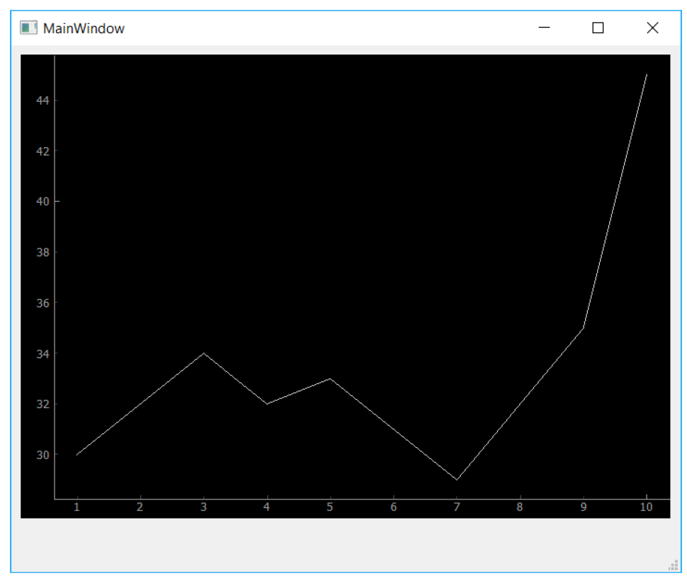

> 图216：显示虚拟数据的自定义 PyQtGraph 控件。

PyQtGraph 的默认绘图样式非常简单——黑色背景，一条细细的（几乎看不见的）白色线条。在下一节中，我们将看看 PyQtGraph 中有哪些可用的选项，以改善绘图的外观和可用性。

## 样式绘制

PyQtGraph 使用 Qt 的 `QGraphicsScene` 来绘制图形。这使我们能够访问所有标准的 Qt 线条和形状样式选项，以用于绘制图。然而，PyQtGraph 提供了一个 API，用于绘制图和管理图画布。

下面我们将介绍创建和自定义自己的图所需的最常见的样式功能。

### 背景颜色

从上面的应用程序骨架开始，我们可以更改背景颜色，方法是调用 `PlotWidget` 实例（在 `self.graphWidget` 中）的 `.setBackground` 方法。下面的代码将背景设置为白色，方法是传入字符串 ‘w’。

```python
self.graphWidget.setBackground('w')
```

您可以随时设置（并更新）图表的背景颜色。

*Listing 221. plotting/pyqtgraph_2.py*

```python
import sys

from PyQt6 import QtWidgets
import pyqtgraph as pg # 在导入Qt之后导入PyQtGraph


class MainWindow(QtWidgets.QMainWindow):
    def __init__(self):
        super().__init__()
        
        self.graphWidget = pg.PlotWidget()
        self.setCentralWidget(self.graphWidget)
        
        hour = [1, 2, 3, 4, 5, 6, 7, 8, 9, 10]
        temperature = [30, 32, 34, 32, 33, 31, 29, 32, 35, 45]
        
        self.graphWidget.setBackground("w")
        self.graphWidget.plot(hour, temperature)
        
        
app = QtWidgets.QApplication(sys.argv)
main = MainWindow()
main.show()
app.exec()
```

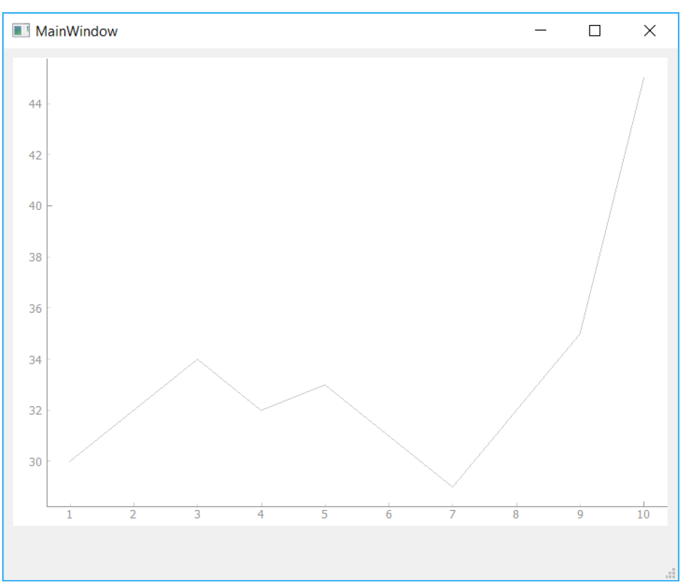

> 图217：将PyQtGraph的绘图背景改为白色

使用单个字母可以生成多种简单颜色，这些颜色基于 `Matplotlib` 中使用的标准颜色。它们大多较为常见，唯一例外的是'k'用于表示黑色。

*Table 7. Common color codes*

| 颜色                | 字母代号 |
| ------------------- | -------- |
| blue                | b        |
| green               | g        |
| red                 | r        |
| cyan (明亮的蓝绿色) | c        |
| magenta (亮粉色)    | m        |
| yellow              | y        |
| black               | k        |
| white               | w        |

除了这些单字母代码外，您还可以使用十六进制表示法设置颜色例如，使用字符串 `#672922`。

```python
self.graphWidget.setBackground('#bbccaa') # 十六进制
```

RGB 和 RGBA 值可以分别作为 3 元组或 4 元组传递，使用0-255 的值。

```python
self.graphWidget.setBackground((100,50,255)) # RGB each 0-255
self.graphWidget.setBackground((100,50,255,25)) # RGBA (A = alpha opacity)
```

最后，您还可以直接使用Qt的 `QColor`类型来指定颜色。

```python
self.graphWidget.setBackground(QtGui.QColor(100,50,254,25))
```

如果您在应用程序的其他地方使用特定的 `QColor` 对象，或者将图形的背景设置为图形用户界面的默认背景颜色，此功能非常有用。

```python
color = self.palette().color(QtGui.QPalette.Window) # 获取默认窗口背景，
self.graphWidget.setBackground(color)
```

### 线条颜色、宽度和样式

PyQtGraph 中的线条使用标准的 Qt `QPen` 类型绘制。这使您能够像在任何其他 `QGraphicsScene` 绘图中一样，对线条绘制拥有完全的控制权。要使用笔来绘制线条，您只需创建一个新的 `QPen` 实例，并将其传递给 `plot` 方法。

下面我们创建一个 `QPen` 对象，传入一个包含三个整数值的元组，指定一个RGB 值（全红）。我们也可以通过传入 ‘r’ 或一个 `QColor` 对象来定义它。然后我们将此对象传入 `plot` 函数的 pen 参数中。

```python
pen = pg.mkPen(color=(255, 0, 0))
self.graphWidget.plot(hour, temperature, pen=pen)
```

完整的代码如下所示：

```python
import sys

from PyQt6 import QtWidgets
import pyqtgraph as pg # 在导入Qt之后导入PyQtGraph


class MainWindow(QtWidgets.QMainWindow):
    def __init__(self):
        super().__init__()
        
        self.graphWidget = pg.PlotWidget()
        self.setCentralWidget(self.graphWidget)
        
        hour = [1, 2, 3, 4, 5, 6, 7, 8, 9, 10]
        temperature = [30, 32, 34, 32, 33, 31, 29, 32, 35, 45]
        
        self.graphWidget.setBackground("w")
        
        pen = pg.mkPen(color=(255, 0, 0))
        self.graphWidget.plot(hour, temperature, pen=pen)
        
        
app = QtWidgets.QApplication(sys.argv)
main = MainWindow()
main.show()
app.exec()
```

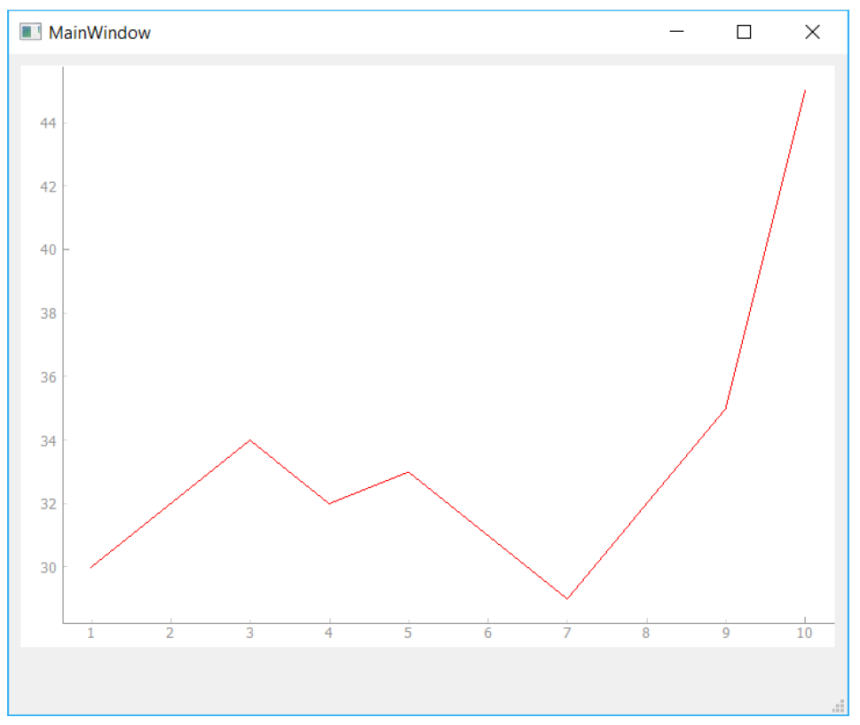

> 图218：更改线条颜色

通过更改 `QPen` 对象，我们可以更改线条的外观，包括使用标准 Qt 线条样式更改线条的像素宽度和样式（虚线、点线等）。例如，以下示例创建了一条 15 像素宽的红色虚线。

```python
pen = pg.mkPen(color=(255, 0, 0), width=15, style=QtCore.Qt.PenStyle.DashLine)
```

结果如下所示，显示一条15像素的红色虚线。

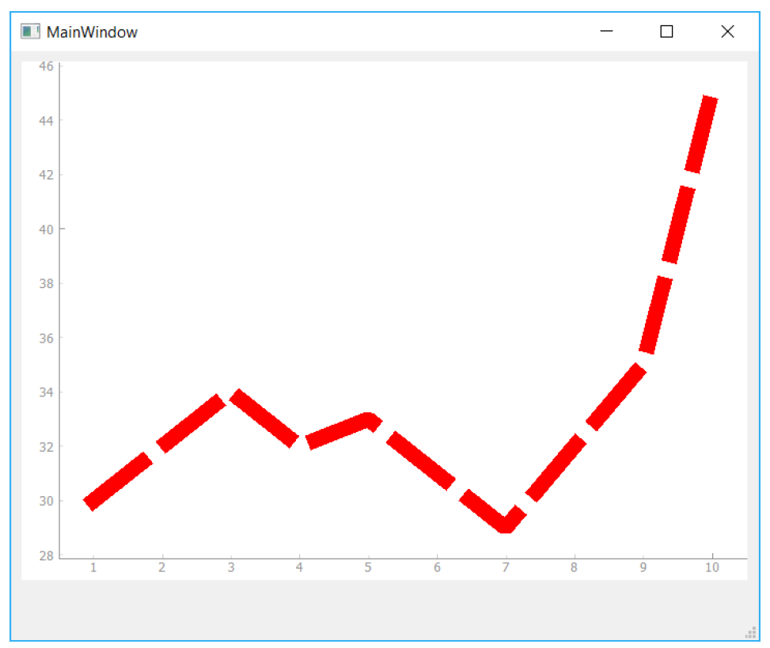

> 图219：更改线宽和样式。

您可以使用所有标准的 Qt 线条样式，包括 `Qt.PenStyle.SolidLine`、`Qt.PenStyle.DashLine`、`Qt.PenStyle.DotLine`、`Qt.PenStyle.DashDotLine` 和`Qt.PenStyle.DashDotDotLine`。下图显示了这些线条的示例，您可以在 [Qt 文档](https://doc.qt.io/qt-5/qpen.html#pen-style) 中阅读更多相关内容。

### 线条标记器

对于许多图表，在图表上添加标记（而非或替代线条）可能会有帮助。要在图表上绘制标记，可在调用 `.plot` 时传入要用作标记的符号，如下所示：

```python
self.graphWidget.plot(hour, temperature, symbol='+')
```

除了 `spmbol` 外，您还可以传递符号大小（`symbolSize`）、符号画笔（`symbolBrush`）和符号钢笔（`symbolPen`）参数。传递给 `symbolBrush` 的值可以是任何颜色，或 `QBrush` 类型，而符号钢笔可以传递任何颜色或 `QPen` 实例。钢笔用于绘制形状的轮廓，而**画笔**用于填充。

例如，下面的代码将生成一个大小为30的蓝色十字标记，位于一条粗厚的红色线条上。

```python
pen = pg.mkPen(color=(255, 0, 0), width=15, style=QtCore.Qt.PenStyle.DashLine)
self.graphWidget.plot(hour, temperature, pen=pen, symbol='+',symbolSize=30, symbolBrush=('b'))
```

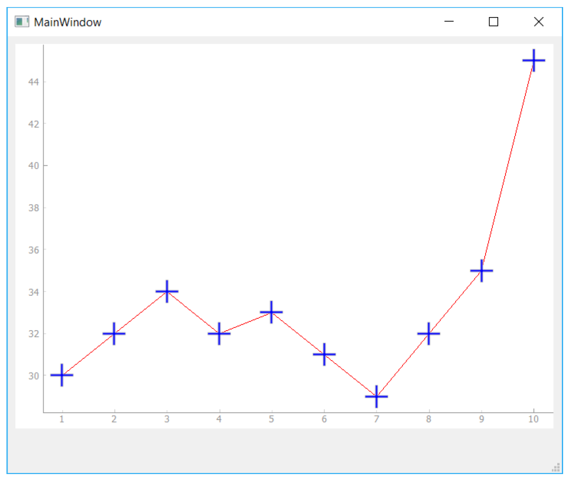

> 图220：每个数据点上都显示了符号。

除了 `+` 图标标记外，PyQtGraph还支持以下标准标记，如表中所示。这些标记均可按相同方式使用。

| 变量 | 标记的类型 |
| ---- | ---------- |
| o    | 圆形       |
| s    | 方形       |
| t    | 三角形     |
| d    | 菱形       |
| +    | 交叉点     |


> 如果您有更复杂的需求，还可以传入任何 QPainterPath 对象，从而能够绘制完全自定义的标记形状。

## 图表标题

图表标题对于提供图表所展示内容的上下文非常重要。在PyQtGraph中，您可以通过调用 `PlotWidget` 上的 `setTitle()` 方法，并传入标题字符串，来添加主图表标题。

```python
self.graphWidget.setTitle("Your Title Here")
```

您可以通过传递附加参数来为标题（以及 PyQtGraph 中的任何其他标签）应用文本样式，包括颜色、字体大小和粗细。可用的样式参数如下所示：

| 样式   | 类型                       |
| ------ | -------------------------- |
| color  | (`str`) e.g. `CCFF00`      |
| size   | (`str`) e.g. `8pt`         |
| bold   | (`bool`) `True` or `False` |
| italic |                            |

下面的代码将颜色设置为蓝色，字体大小为30pt。

```python
self.graphWidget.setTitle("Your Title Here", color="b", size="30pt")
```

如果您愿意，还可以使用 HTML 标签语法来设置标题样式，尽管这样会降低可读性。

```python
self.graphWidget.setTitle("<span style=\"color:blue;font-size:30pt\">Your Title Here</span>")
```

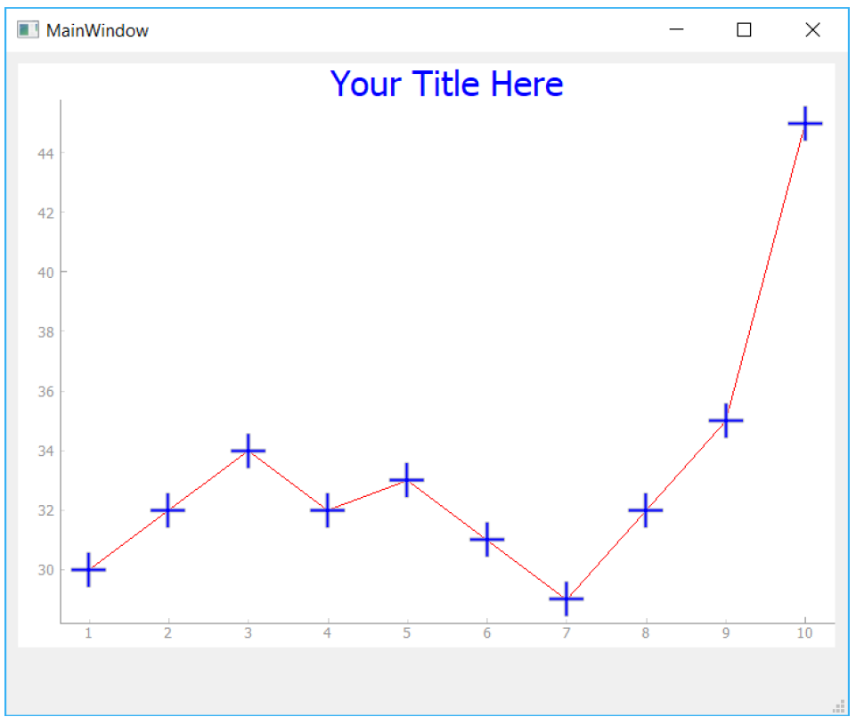

> 图221：带有样式标题的图例

## 坐标轴标题

与标题类似，我们可以使用 `setLabel()` 方法来创建轴标题。此方法需要两个参数：位置和文本。位置可以是 `left`、`right`、`top` 或  `bottom` 中的任意一个，用于描述轴上文本的位置。第二个参数文本是您希望用于标签的文本。

您可以将额外的样式参数传递给该方法。这些参数与标题的参数略有不同，因为它们需要是有效的 CSS 名称-值对。例如，大小现在是 `font-size`。由于名称 `font-size` 中包含连字符，因此您不能将其直接作为参数传递，而必须使用 `**dictionary` 方法

```python
styles = {'color':'r', 'font-size':'30pt'}
self.graphWidget.setLabel('left', 'Temperature (°C)', **styles)
self.graphWidget.setLabel('bottom', 'Hour (H)', **styles)
```

这些也支持 HTML 语法，您可以自由选用。

```python
self.graphWidget.setLabel('left', "<span style=\"color:red;fontsize:30px\">Temperature (°C)</span>")
self.graphWidget.setLabel('bottom', "<span style=\"color:red;fontsize:30px\">Hour (H)</span>")
```

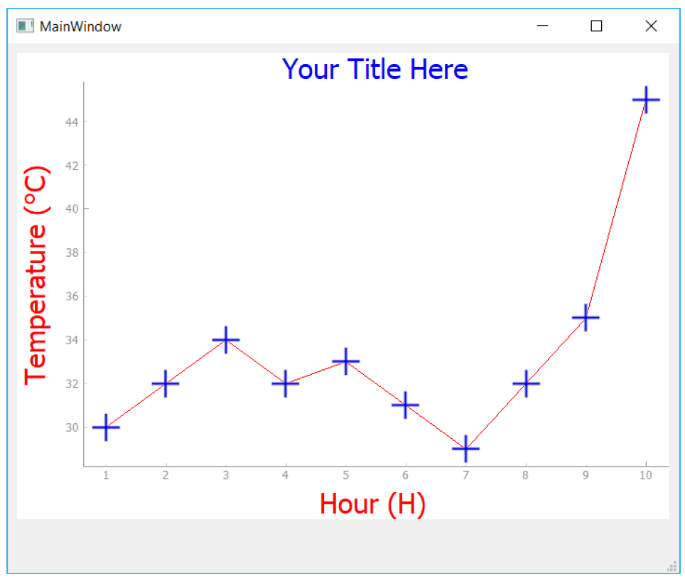

> 图222：自定义样式的坐标轴标签

## 图例

除了坐标轴和图例标题外，您通常还希望显示一个图例，用于标识特定线条所代表的内容。这在您开始向图表中添加多条线条时尤为重要。向图表添加图例可以通过调用 `PlotWidget` 的 `.addLegend` 方法实现，但在此之前，您需要在调用 `.plot()` 方法时为每条线条提供一个名称。

下面的示例将我们使用 `.plot()` 绘制的线条命名为“Sensor 1”。该名称将在图例中用于标识该线条。

```python
self.graphWidget.plot(hour, temperature, name = "Sensor 1", pen = NewPen, symbol='+', symbolSize=30, symbolBrush=('b'))
self.graphWidget.addLegend()
```

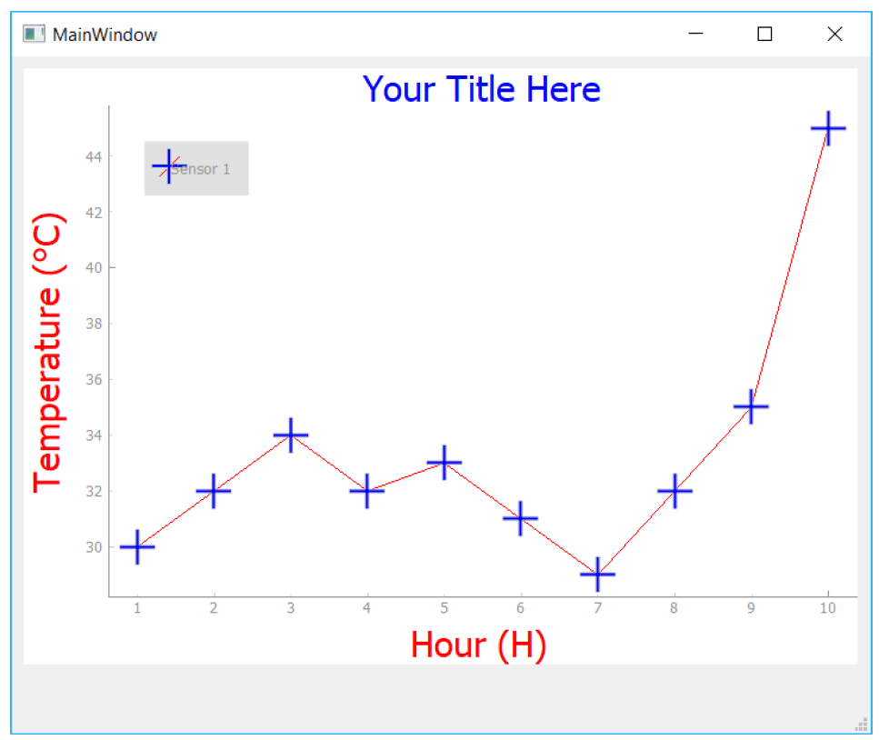

> 图223：带有图例的图表，显示单个项目。


> 图例默认显示在左上角。如果您希望移动图例，可以轻松地将图例拖动到其他位置。您还可以通过在创建图例时将一个2元组传递给 offset 参数来指定默认偏移量。

## 背景网格

添加背景网格可以使您的图表更易于阅读，尤其是在试图比较相对的 x 和 y 值时。您可以通过调用 `PlotWidget` 上的 `.showGrid` 方法来启用图表的背景网格。您可以独立地切换 x 和 y 网格。

以下内容将为X轴和Y轴创建网格。

```python
self.graphWidget.showGrid(x=True, y=True)
```

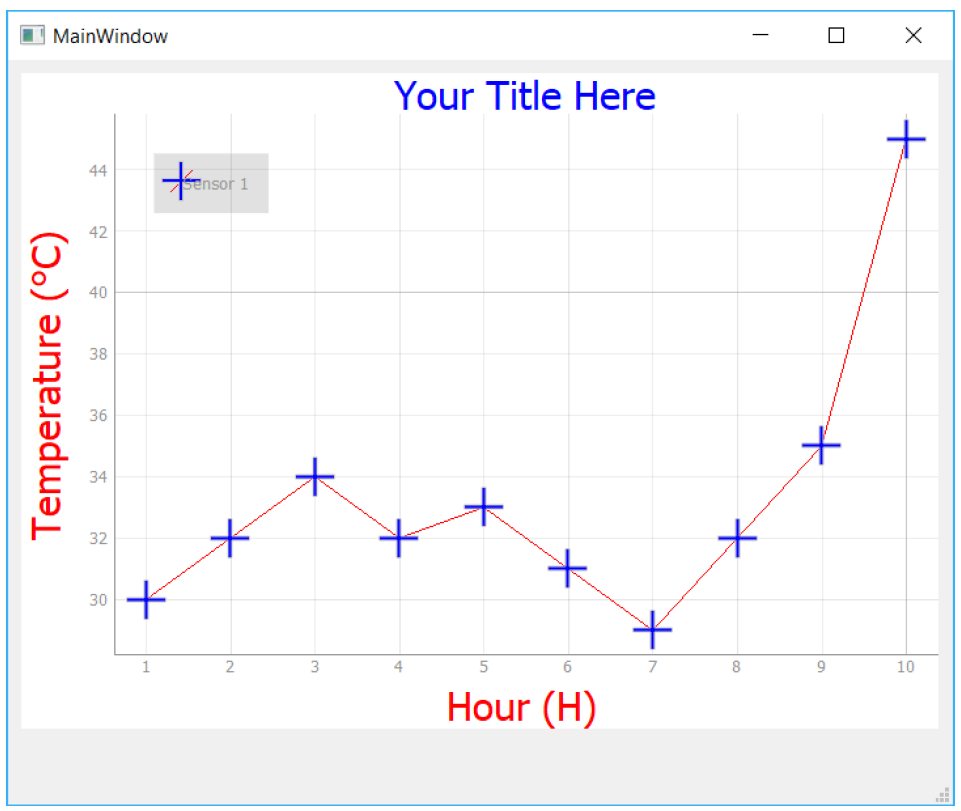

> 图224：背景网格

## 设置坐标轴的范围

有时，限制在图表上显示的数据范围，或将坐标轴锁定在固定范围（例如已知的最小值和最大值范围）可能是有用的。在 PyQtGraph 中，可以通过调用 `.setXRange()` 和 `.setYRange()` 方法实现这一点。这些方法会强制图表仅显示每个坐标轴上指定范围内的数据。

下面我们设置两个范围，每个轴一个。第一个参数是最小值，第二个参数是最大值。

```python
self.graphWidget.setXRange(5, 20, padding=0)
self.graphWidget.setYRange(30, 40, padding=0)
```

可选的填充参数会使范围设置得比指定的范围更大，具体取决于指定的百分比（默认值在0.02到0.1之间，具体取决于视图框的大小）。如果您想完全移除这个填充，请传入0。

```python
self.graphWidget.setXRange(5, 20, padding=0)
self.graphWidget.setYRange(30, 40, padding=0)
```

到目前为止的完整代码如下所示：

```python
import sys

from PyQt6 import QtWidgets
import pyqtgraph as pg # 在导入Qt之后导入PyQtGraph


class MainWindow(QtWidgets.QMainWindow):
    def __init__(self):
        super().__init__()
        
        self.graphWidget = pg.PlotWidget()
        self.setCentralWidget(self.graphWidget)
        
        hour = [1, 2, 3, 4, 5, 6, 7, 8, 9, 10]
        temperature = [30, 32, 34, 32, 33, 31, 29, 32, 35, 45]
        
        # 将背景颜色设置为白色
        self.graphWidget.setBackground("w")
        
        # 添加标题
        self.graphWidget.setTitle(
            "Your Title Here", color="b", size="30pt"
        )
        # 添加坐标轴标题
        styles = {"color": "#f00", "font-size": "20px"}
        self.graphWidget.setLabel("left", "Temperature (°C)", **
                                  styles)
        self.graphWidget.setLabel("bottom", "Hour (H)", **styles)
        # 添加图例
        self.graphWidget.addLegend()
        # 添加背景网格
        self.graphWidget.showGrid(x=True, y=True)
        # 设置范围
        self.graphWidget.setXRange(0, 10, padding=0)
        self.graphWidget.setYRange(20, 55, padding=0)
        
        pen = pg.mkPen(color=(255, 0, 0))
        self.graphWidget.plot(
            hour,
            temperature,
            name="Sensor 1",
            pen=pen,
            symbol="+",
            symbolSize=30,
            symbolBrush=("b"),
        )    
        
        
app = QtWidgets.QApplication(sys.argv)
main = MainWindow()
main.show()
app.exec()
```

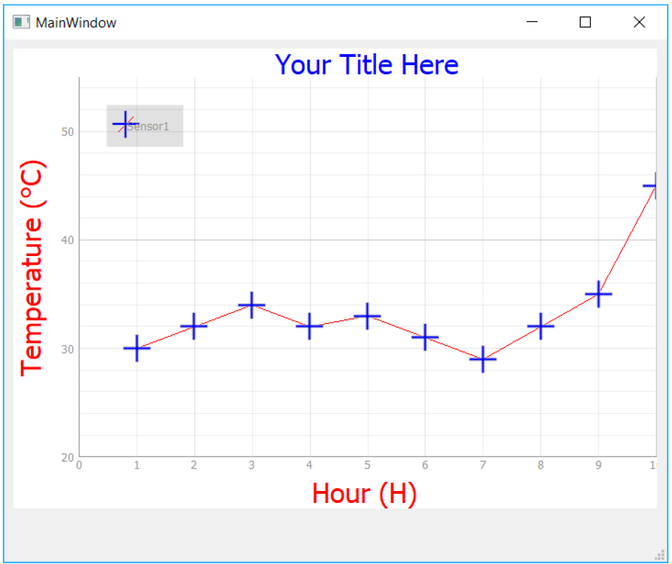

> 图225：限制轴的范围。

## 绘制多条线

绘图通常涉及多条线。在 PyQtGraph 中，这就像在同一个 `PlotWidget` 上多次调用 `.plot()` 一样简单。在以下示例中，我们将绘制两条类似的数据线，每条线使用相同的线样式、厚度等，但更改线颜色。

为了简化这一过程，我们可以在 `MainWindow` 上创建自己的自定义绘图方法。该方法接受用于绘图的 `x` 和 `y` 参数、用于图例的线条名称以及颜色参数。我们使用该颜色同时设置线条和标记的颜色。

```python
    def plot(self, x, y, plotname, color):
        pen = pg.mkPen(color=color)
        self.graphWidget.plot(x, y, name=plotname, pen=pen, symbol=
                              '+', symbolSize=30, symbolBrush=(color))
```

要绘制单独的线条，我们将创建一个名为 `temperature_2` 的新数组，并用与 `temperature`（现在为 `temperature_1` ）类似的随机数填充它。将这些线条并排绘制，我们可以将它们进行比较。现在，您可以调用 `plot` 函数两次，这将在图表上生成两条线。

```python
self.plot(hour, temperature_1, "Sensor1", 'r')
self.plot(hour, temperature_2, "Sensor2", 'b')
```

*Listing 224. plotting/pyqtgraph_5.py*

```python
import sys

from PyQt6 import QtWidgets
import pyqtgraph as pg # 在导入Qt之后导入PyQtGraph


class MainWindow(QtWidgets.QMainWindow):
    def __init__(self):
        super().__init__()
        
        self.graphWidget = pg.PlotWidget()
        self.setCentralWidget(self.graphWidget)
        
        hour = [1, 2, 3, 4, 5, 6, 7, 8, 9, 10]
        temperature = [30, 32, 34, 32, 33, 31, 29, 32, 35, 45]
        
        # 将背景颜色设置为白色
        self.graphWidget.setBackground("w")
        
        # 添加标题
        self.graphWidget.setTitle(
            "Your Title Here", color="b", size="30pt"
        )
        # 添加坐标轴标题
        styles = {"color": "#f00", "font-size": "20px"}
        self.graphWidget.setLabel("left", "Temperature (°C)", **
                                  styles)
        self.graphWidget.setLabel("bottom", "Hour (H)", **styles)
        # 添加图例
        self.graphWidget.addLegend()
        # 添加背景网格
        self.graphWidget.showGrid(x=True, y=True)
        # 设置范围
        self.graphWidget.setXRange(0, 10, padding=0)
        self.graphWidget.setYRange(20, 55, padding=0)
        
        self.plot(hour, temperature_1, "Sensor1", "r")
        self.plot(hour, temperature_2, "Sensor2", "b")
        
    def plot(self, x, y, plotname, color):
        pen = pg.mkPen(color=color)
        self.graphWidget.plot(
            x,
            y,
            name=plotname,
            pen=pen,
            symbol="+",
            symbolSize=30,
            symbolBrush=(color),
        )
        
        
app = QtWidgets.QApplication(sys.argv)
main = MainWindow()
main.show()
app.exec()
```

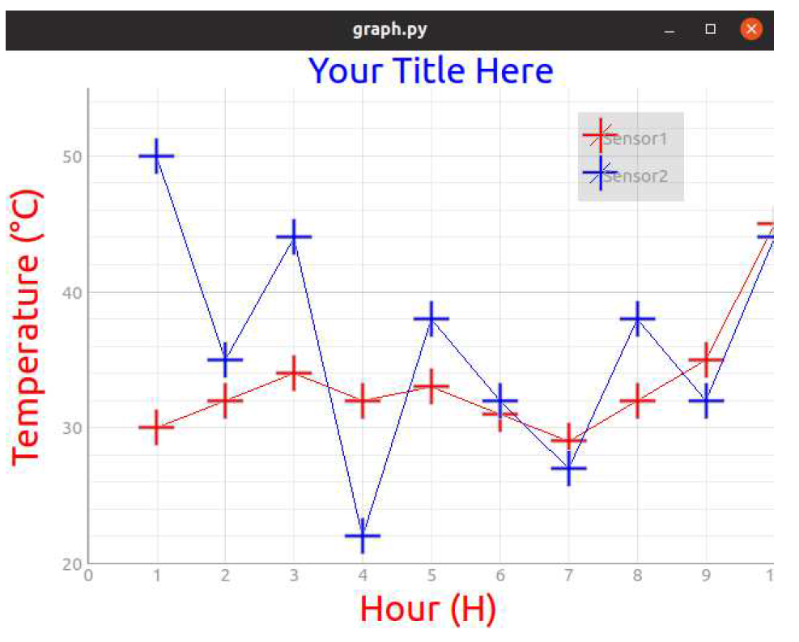

> 图226：包含两条线的图表


> 您可以尝试使用此功能，自定义您的标记、线条宽度、颜色及其他参数。

## 清空图表

最后，有时您可能需要定期清除并刷新绘图。您可以通过调用 `.clear()` 方法轻松实现这一点。

```python
self.graphWidget.clear()
```

这将从图中删除线条，但保持所有其他属性不变。

## 更新图表

虽然您可以简单地清除绘图区域并重新绘制所有元素，但这意味着Qt必须销毁并重新创建所有`QGraphicsScene` 对象。对于小型或简单的图形，这可能不会被注意到，但如果您想创建高性能的流式图形，最好直接更新数据。PyQtGraph 会获取新数据并更新绘制的线条以匹配，而不会影响图形中的其他元素。

要更新一条线，我们需要获取该线对象的引用。该引用在首次使用 `.plot` 方法创建线时返回，我们可以将其存储在变量中。请注意，这是对线对象的引用，而非对绘图的引用。

```python
my_line_ref = graphWidget.plot(x, y)
```

一旦我们获得了引用，更新图表只需调用 `.setData`方法，将新数据应用到该引用即可。

*Listing 225. plotting/pyqtgraph_6.py*

```python
import sys
from random import randint

from PyQt6 import QtWidgets
import pyqtgraph as pg # 在导入Qt之后导入PyQtGraph


class MainWindow(QtWidgets.QMainWindow):
    def __init__(self):
        super().__init__()
        
        self.graphWidget = pg.PlotWidget()
        self.setCentralWidget(self.graphWidget)
        
        self.x = list(range(100)) # 100个时间点
        self.y = [
            randint(0, 100) for _ in range(100)
        ] # 100个数据点
        
        self.graphWidget.setBackground("w")
        
        pen = pg.mkPen(color=(255, 0, 0))
        self.data_line = self.graphWidget.plot(
            self.x, self.y, pen=pen
        ) #1
        
        self.timer = QtCore.QTimer()
        self.timer.setInterval(50)
        self.timer.timeout.connect(self.update_plot_data)
        self.timer.start()
        
    def update_plot_data(self):
        self.x = self.x[1:] # 移除第一个 y 元素.
        self.x.append(
            self.x[-1] + 1
        ) # 添加一个比上一个值大1的新值.
        self.y = self.y[1:] # 删除第一个
        self.y.append(randint(0, 100)) # 添加一个新的随机值.
        self.data_line.setData(self.x, self.y) # 更新数据.
```

> 1. 这里我们引用了之前绘制的线，并将它存储为 `self.data_line` 。

我们使用 `QTimer` 每 50 毫秒更新一次数据，将触发器设置为调用自定义的槽方法 `update_plot_data`，在那里我们将更改数据。我们在  `__init__` 块中定义此计时器，因此它会自动启动。

如果运行该应用程序，您应该会看到一个图表，其中随机数据快速向左滚动，X 值也会同步更新并滚动，仿佛在流式传输数据。您可以用自己的真实数据替换随机数据，例如从实时传感器读数或 API 中获取。PyQtGraph 性能足够强大，可以支持使用此方法创建多个图表。

## 总结

在本章中，我们学习了如何使用 PyQtGraph 绘制简单的图表，并自定义线条、标记和标签。要全面了解 PyQtGraph 的方法和功能，请参阅 [PyQtGraph文档及API参考](http://www.pyqtgraph.org/documentation/)。[PyQtGraph在GitHub上的仓库](https://github.com/pyqtgraph/pyqtgraph) 中还包含了一系列更复杂的示例图表，这些示例位于Plotting.py文件中（如下所示）。

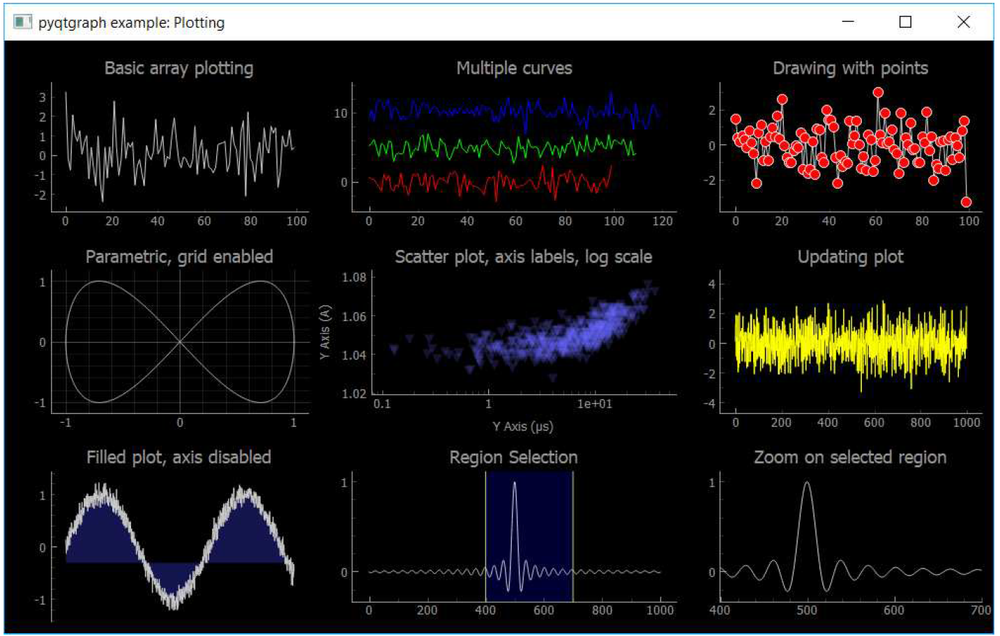

> 图227：示例图表摘自PyQtGraph文档。
