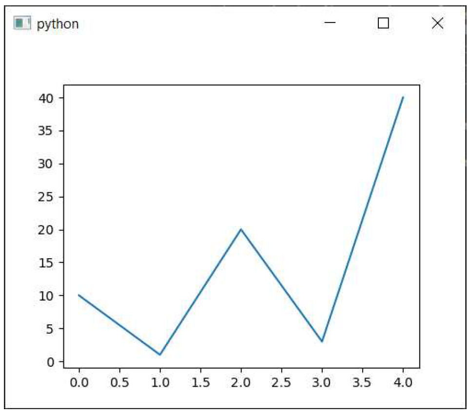
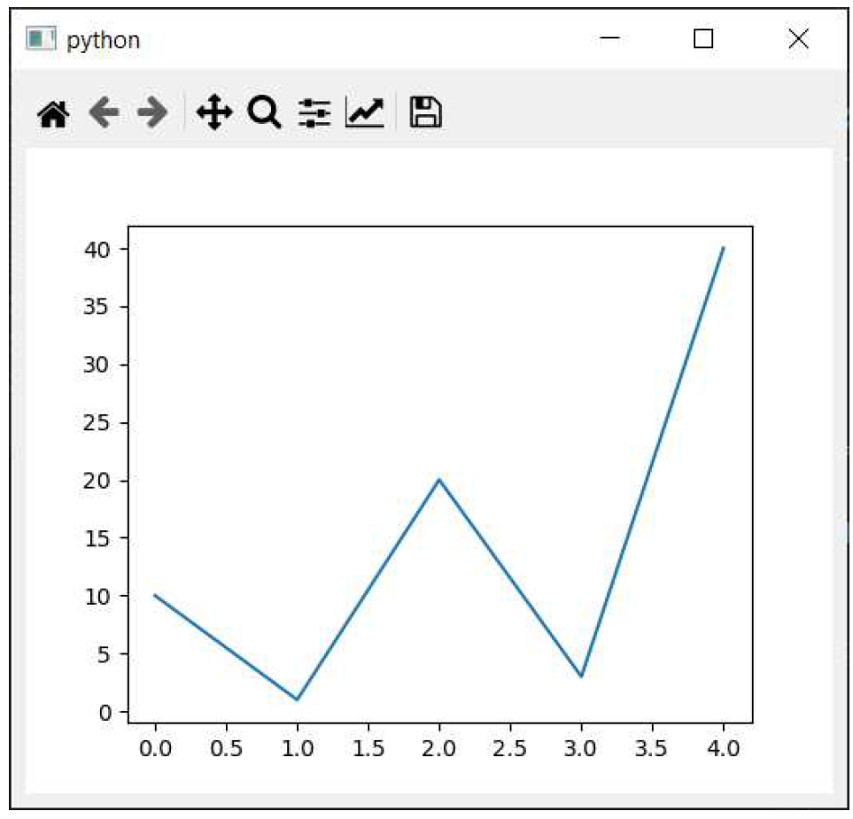
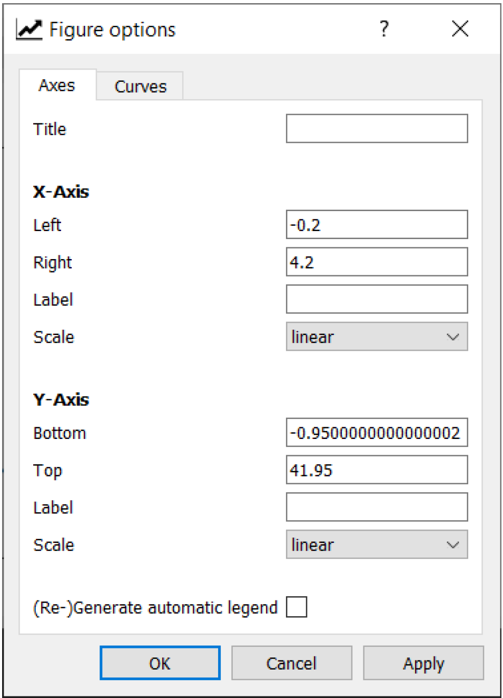
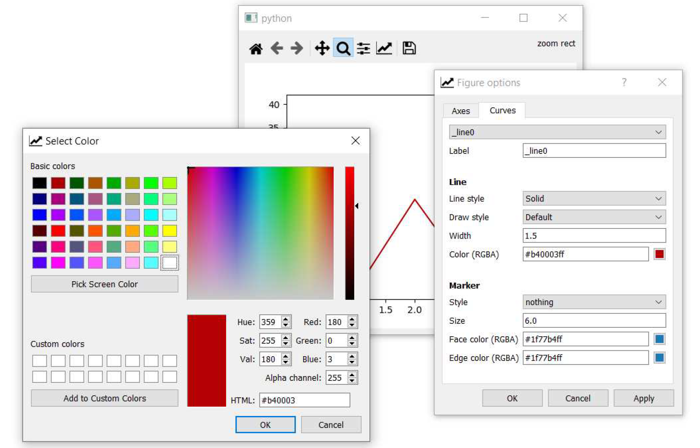
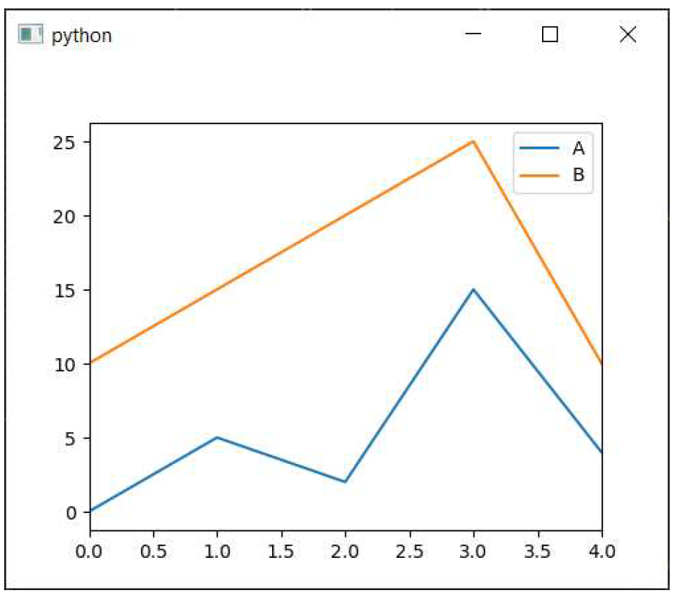
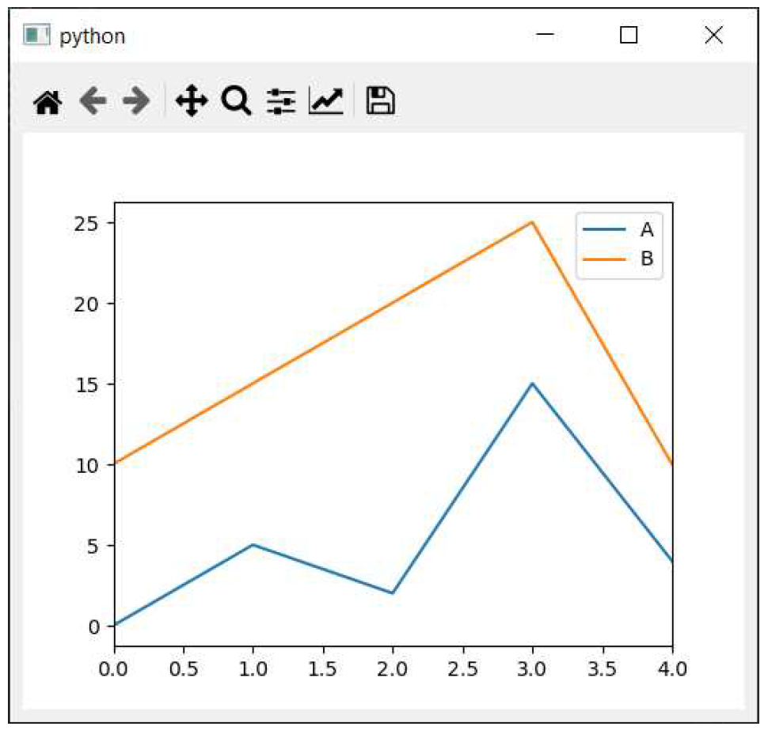

---
prev:
  text: '29. 使用 PyQtGraph 进行数据可视化'
  link: '/Plotting/29'
next:
  text: '31. 计时器'
  link: '/FurtherPyQt6Features/31'
---

## 30. 使用 Matplotlib 进行数据可视化

在前一部分中，我们介绍了如何使用PyQtGraph在PyQt6中进行绘图。该库使用Qt基于向量的QGraphicsScene 来绘制图表，并提供了交互式和高性能绘图的出色接口。

然而，还有另一个用于 Python 的绘图库，它被更广泛地使用，并提供了更丰富的绘图种类——[Matplotlib](https://www.matplotlib.org/)。如果您正在将现有的数据分析工具迁移到 PyQt6 图形用户界面，或者您只是想使用 Matplotlib 提供的各种绘图功能，那么您需要了解如何将 Matplotlib 绘图纳入您的应用程序。

在本章中，我们将介绍如何在 PyQt6 应用程序中嵌入 Matplotlib 图表。


> 许多其他 Python 库（如 [seaborn](https://github.com/mwaskom/seaborn) 和 [pandas](https://pandas.pydata.org/pandas-docs/version/0.13/visualization.html)）也使用 Matplotlib 进行绘图。这些绘图可以像这里示例中一样嵌入到 PyQt6 中，并且在绘图时传递的轴引用。本章末尾有一个 pandas 的示例。

## 安装 Matplotlib

以下示例假设您已安装 Matplotlib。如果未安装，您可以使用 `pip` 进行安装。

撰写本文时，PyQt6 还非常新。有一个实验性分支，其中包含[Qt6 支持](https://github.com/matplotlib/matplotlib/pull/19255)，您可以使用它 —

```bash
pip install git+https://github.com/anntzer/matplotlib.git@qt6
```

## 一个简单的例子

以下最简单的示例设置了一个 Matplotlib 画布 `FigureCanvasQTAgg`，该画布创建了 `Figure` 并向其中添加了一组轴。该画布对象也是一个 `QWidget`，因此可以像其他 Qt 控件一样直接嵌入到应用程序中。

*Listing 226. plotting/matplotlib_1.py*

```python
import sys

from PyQt6 import QtWidgets # 在导入matplotlib之前先导入PyQt6。

import matplotlib
from matplotlib.backends.backend_qtagg import FigureCanvasQTAgg
from matplotlib.figure import Figure

matplotlib.use("QtAgg")


class MplCanvas(FigureCanvasQTAgg):
    def __init__(self, parent=None, width=5, height=4, dpi=100):
        fig = Figure(figsize=(width, height), dpi=dpi)
        self.axes = fig.add_subplot(111)
        super().__init__(fig)
        
        
class MainWindow(QtWidgets.QMainWindow):
    def __init__(self):
        super().__init__()
        # 创建 maptlotlib FigureCanvasQTAgg 对象，该对象定义了一组坐标轴，即 self.axes.
        sc = MplCanvas(self, width=5, height=4, dpi=100)
        sc.axes.plot([0, 1, 2, 3, 4], [10, 1, 20, 3, 40])
        self.setCentralWidget(sc)
        
        self.show()
        
        
app = QtWidgets.QApplication(sys.argv)
w = MainWindow()
app.exec()
```

在这种情况下，我们使用 `.setCentralWidget()` 将 `MplCanvas` 控件添加到窗口作为中央控件。这意味着它将占据整个窗口，并随窗口一起调整大小。绘制的数据 `[0,1,2,3,4], [10,1,20,3,40]` 以两个数字列表（分别表示 x 和 y 坐标）的形式提供，符合 `.plot` 方法的要求。



> 图228：一个简单的图表

## 图表控制

在 PyQt6 中显示的 Matplotlib 图实际上是由 Agg 后端渲染为简单的（位图）图像。`FigureCanvasQTAgg` 类封装了这个后端，并将生成的图像显示在 Qt 控件上。这种架构的效果是，Qt 不知道线和其他绘图元素的位置，只知道在控件上点击和鼠标移动的 x、y 坐标。

然而，Matplotlib 内置了对 Qt 鼠标事件的处理和将其转换为图上的交互的支持。这可以通过一个自定义工具栏来控制，该工具栏可以与图一起添加到您的应用程序中。在本节中，我们将介绍如何添加这些控件，以便我们能够缩放、平移和从嵌入的 Matplotlib 图中获取数据。

完整的代码如下所示，它导入了工具栏控件 `NavigationToolbar2QT`，并将其添加到  `QVBoxLayout` 中的界面中。

*Listing 227. plotting/matplotlib_2.py*

```python
import sys
from PyQt6 import QtWidgets # 在导入matplotlib之前先导入PyQt6
import matplotlib
from matplotlib.backends.backend_qtagg import FigureCanvasQTAgg
from matplotlib.backends.backend_qtagg import (
NavigationToolbar2QT as NavigationToolbar,
)
from matplotlib.figure import Figure

matplotlib.use("QtAgg")


class MplCanvas(FigureCanvasQTAgg):
    def __init__(self, parent=None, width=5, height=4, dpi=100):
        fig = Figure(figsize=(width, height), dpi=dpi)
        self.axes = fig.add_subplot(111)
        super().__init__(fig)
        
        
class MainWindow(QtWidgets.QMainWindow):
    def __init__(self):
        super().__init__()
        
        sc = MplCanvas(self, width=5, height=4, dpi=100)
        sc.axes.plot([0, 1, 2, 3, 4], [10, 1, 20, 3, 40])
        
        # 创建工具栏，将画布作为第一个参数传递，父窗口(self, the MainWindow)作为第二个参数。
        toolbar = NavigationToolbar(sc, self)
        
        layout = QtWidgets.QVBoxLayout()
        layout.addWidget(toolbar)
        layout.addWidget(sc)
        
        # 创建一个占位符控件来容纳我们的工具栏和画布.
        widget = QtWidgets.QWidget()
        widget.setLayout(layout)
        self.setCentralWidget(widget)
        
        self.show()
        
        
app = QtWidgets.QApplication(sys.argv)
w = MainWindow()
app.exec()
```

我们将逐一说明这些变更。

首先，我们从 `matplotlib.backends.backend_qt5agg.NavigationToolbar2QT` 导入工具栏控件，并将其重命名为更简单的名称 `NavigationToolbar`。我们通过调用 `NavigationToolbar` 并传入两个参数来创建工具栏实例，第一个参数是画布对象 `sc` ，第二个参数是工具栏的父对象，在本例中是 `MainWindow` 对象 `self` 。传入画布对象可将创建的工具栏与之关联，从而实现对其的控制。生成的工具栏对象被存储在变量 `toolbar` 中。

我们需要在窗口中添加两个控件，一个在另一个上方，因此我们使用一个 `QVBoxLayout`。首先，我们将工具栏控件 `toolbar` 和画布控件 `sc` 添加到此布局中。最后，我们将此布局设置到我们的简单控件布局容器中，该容器被设置为窗口的中央控件。

运行上述代码将生成以下窗口布局，显示在底部的绘图和顶部的工具栏作为控件。



> 图229：带工具栏的Matplotlib画布

NavigationToolbar2QT 提供的按钮可用于控制以下操作：

- 首页、后退/前进、平移与缩放，用于在图中导航。后退/前进按钮可用于在导航步骤之间前后移动，例如先放大再点击后退按钮将返回上一个缩放级别。首页按钮可返回图的初始状态。
- 绘图边距/位置配置，可调整绘图在窗口内的位置。
- 轴/曲线样式编辑器，您可以在其中修改图标题和轴刻度，以及设置图线颜色和线样式。颜色选择使用平台默认的颜色选择器，允许选择任何可用的颜色。
- 保存，将生成的图形保存为图像（支持所有Matplotlib支持的格式）。

以下列出了其中一些配置设置：



> 图230：Matplotlib 图表选项



> 图231：Matplotlib 曲线选项

有关如何操作和配置Matplotlib图表的更多信息，请参阅官方 [Matplotlib工具栏文档](https://matplotlib.org/3.1.1/users/navigation_toolbar.html)。

## 更新图表

在应用程序中，您经常需要更新图表中显示的数据，无论是响应用户的输入还是来自 API 的更新数据。在 Matplotlib 中，有两种方法可以更新图表，您可以选择：

1. 清除并重新绘制画布（更简单，但速度较慢）
2. 通过保留绘制线的引用并更新数据

如果性能对您的应用程序很重要，建议您选择后者，但前者更简单。我们先从简单的清除并重绘方法开始：

### 清除并重新绘制

*Listing 228. plotting/matplotlib_3.py*

```python
import sys
from PyQt6 import QtWidgets # 在导入matplotlib之前先导入PyQt6
import matplotlib
from matplotlib.backends.backend_qtagg import FigureCanvasQTAgg
from matplotlib.backends.backend_qtagg import (
NavigationToolbar2QT as NavigationToolbar,
)
from matplotlib.figure import Figure

matplotlib.use("QtAgg")


class MplCanvas(FigureCanvasQTAgg):
    def __init__(self, parent=None, width=5, height=4, dpi=100):
        fig = Figure(figsize=(width, height), dpi=dpi)
        self.axes = fig.add_subplot(111)
        super().__init__(fig)
        
        
class MainWindow(QtWidgets.QMainWindow):
    def __init__(self):
        super().__init__()
        
        self.canvas = MplCanvas(self, width=5, height=4, dpi=100)
        self.setCentralWidget(self.canvas)
        
        n_data = 50
        self.xdata = list(range(n_data))
        self.ydata = [random.randint(0, 10) for i in range(n_data)]
        self.update_plot()
        
        self.show()
        
        # 设置一个定时器，通过调用 update_plot 函数触发重新绘制.
        self.timer = QtCore.QTimer()
        self.timer.setInterval(100)
        self.timer.timeout.connect(self.update_plot)
        self.timer.start()
        
    def update_plot(self):
        # 删除第一个 y 元素，并添加一个新的 y 元素.
        self.ydata = self.ydata[1:] + [random.randint(0, 10)]
        self.canvas.axes.cla() # 清空画布.
        self.canvas.axes.plot(self.xdata, self.ydata, "r")
        # 触发画布更新并重新绘制.
        self.canvas.draw()
        
        
app = QtWidgets.QApplication(sys.argv)
w = MainWindow()
app.exec()
```

在此示例中，我们将绘图操作移至 `update_plot` 方法中，以保持其独立性。在此方法中，我们对 `ydata` 数组的第一个值进行 `[1:]` 操作移除，然后追加一个0到10之间的随机整数。此操作会将数据向左滚动。

要重新绘制，我们只需调用 `axes.cla()` 清除坐标轴（整个画布），然后调用 `axes.plot(…)` 重新绘制数据，包括更新后的值。然后，通过调用 `canvas.draw()` 将生成的画布重新绘制到控件上。

`update_plot` 方法每 100 毫秒通过 `QTimer` 调用一次。`clear-andrefresh` 方法足够快，可以以这种速度保持绘图更新，但如我们将看到的，随着速度的提高，它会出现问题。

### 就地重绘

更新绘制线条所需的更改相对较少，仅需添加一个变量来存储并获取绘制线条的引用。更新后的 `MainWindow` 代码如下所示：

*Listing 229. plotting/matplotlib_4.py*

```python
class MainWindow(QtWidgets.QMainWindow):
    def __init__(self):
        super().__init__()
        self.canvas = MplCanvas(self, width=5, height=4, dpi=100)
        self.setCentralWidget(self.canvas)
        n_data = 50
        self.xdata = list(range(n_data))
        self.ydata = [random.randint(0, 10) for i in range(n_data)]
        
        # 我们需要将绘制的线条的引用保存在某个地方，以便我们可以将新数据应用到它上.
        self._plot_ref = None
        self.update_plot()
        
        self.show()
        
        # 设置一个定时器，通过调用 update_plot 函数触发重新绘制.
        self.timer = QtCore.QTimer()
        self.timer.setInterval(100)
        self.timer.timeout.connect(self.update_plot)
        self.timer.start()
        
    def update_plot(self):
        # 删除第一个 y 元素，并添加一个新的元素.
        self.ydata = self.ydata[1:] + [random.randint(0, 10)]
        
        # 注意：我们不再需要清除轴。.
        if self._plot_ref is None:
            # 第一次没有图表参考，所以做一个正常的图表.
            # .plot 返回一个线性引用列表，由于我们只获取一个，可以直接取第一个元素.
            plot_refs = self.canvas.axes.plot(
                self.xdata, self.ydata, "r"
            )
            self._plot_ref = plot_refs[0]
        else:
            # 我们有一个引用，可以使用它来更新该行的数据.
            self._plot_ref.set_ydata(self.ydata)
        # 触发画布更新并重新绘制.
        self.canvas.draw()
```

首先，我们需要一个变量来保存要更新的绘制线条的引用，这里我们将其命名为 `_plot_ref` 。我们初始化 `self._plot_ref` 为 `None`，这样我们可以在后续代码中检查其值以确定线条是否已绘制——如果值仍然为 `None`，则表示线条尚未绘制。


> 如果您需要绘制多条线，您可能希望使用列表或字典数据结构来存储多个引用，并跟踪每条线的具体信息。

最后，我们像之前一样更新 `ydata`数据，将其向左旋转并添加一个新的随机值。然后我们可以选择：

1. 如果 `self._plot_ref` 为 `None`（即尚未绘制该线），则绘制该线，并将引用存储在 `self._plot_ref` 中。
2. 通过调用 `self._plot_ref.set_ydata(self.ydata)` 来更新当前的线条。

在调用 .plot 时，我们会获得绘制线的引用。然而，`.plot` 方法会返回一个列表（以支持单次 `.plot` 调用绘制多条线的情况）。在我们的情况下，我们只绘制一条线，因此我们只需获取该列表中的第一个元素——一个 `Line2D` 对象。为了将这个单一值赋给我们的变量，我们可以先将它赋给一个临时变量 `plot_refs`，然后将第一个元素赋给我们的 `self._plot_ref` 变量。

```python
plot_refs = self.canvas.axes.plot(self.xdata, self.ydata, 'r')
self._plot_ref = plot_refs[0]
```

您还可以使用元组解包，从列表中提取第一个（也是唯一）元素：  

```python
self._plot_ref, = self.canvas.axes.plot(self.xdata, self.ydata, 'r')
```

如果您运行生成的代码，在当前速度下，这种方法与之前的方法在性能上不会有明显差异。然而，如果您尝试以更快的速度更新图表（例如每10毫秒一次），您会发现清除图表并重新绘制所需的时间更长，且更新速度无法跟上计时器。这种性能差异是否足以在您的应用程序中产生影响，取决于您正在构建的内容，并且您应该权衡保持和管理绘制线条的引用所带来的额外复杂性。

## 从 Pandas 中嵌入图表

Pandas 是一个专注于处理表格（数据框）和系列数据结构的 Python 包，对于数据分析工作流程特别有用。它内置了对 Matplotlib 绘图的支持，本文将简要介绍如何将这些绘图嵌入到 PyQt6 中。通过此方法，您可以开始构建基于 Pandas 的 PyQt6 数据分析应用程序

Pandas 的绘图函数可直接从 DataFrame 对象访问。该函数的签名较为复杂，提供了大量选项来控制绘图的具体方式。

```python
DataFrame.plot(
    x=None, y=None, kind='line', ax=None, subplots=False,
    sharex=None, sharey=False, layout=None, figsize=None,
    use_index=True, title=None, grid=None, legend=True, style=None,
    logx=False, logy=False, loglog=False, xticks=None, yticks=None,
    xlim=None, ylim=None, rot=None, fontsize=None, colormap=None,
    table=False, yerr=None, xerr=None, secondary_y=False,
    sort_columns=False, **kwargs
)
```

我们最感兴趣的参数是 `ax`，它允许我们传入自己的 `matplotlib.Axes` 实例，Pandas 将在此实例上绘制 `DataFrame`。

*Listing 230. plotting/matplotlib_5.py*

```python
import sys
from PyQt6 import (
    QtCore,
    QtWidgets,
) # 在导入matplotlib之前先导入PyQt6
import matplotlib
import pandas as pd
from matplotlib.backends.backend_qtagg import FigureCanvasQTAgg
from matplotlib.figure import Figure

matplotlib.use("QtAgg")


class MplCanvas(FigureCanvasQTAgg):
    def __init__(self, parent=None, width=5, height=4, dpi=100):
        fig = Figure(figsize=(width, height), dpi=dpi)
        self.axes = fig.add_subplot(111)
        super().__init__(fig)
        
        
class MainWindow(QtWidgets.QMainWindow):
    def __init__(self):
        super().__init__()
        
        # 创建 maptlotlib FigureCanvasQTAgg 对象，该对象定义了一组坐标轴，即 self.axes.
        sc = MplCanvas(self, width=5, height=4, dpi=100)
        # 创建一个包含简单数据和列名的 pandas DataFrame.
        df = pd.DataFrame(
            [
                [0, 10],
                [5, 15],
                [2, 20],
                [15, 25],
                [4, 10],
            ],
            columns=["A", "B"],
        )
        # p绘制 pandas DataFrame，传入 matplotlib Canvas 坐标轴.
        df.plot(ax=sc.axes)
        
        self.setCentralWidget(sc)
        self.show()
        
        
app = QtWidgets.QApplication(sys.argv)
w = MainWindow()
app.exec()
```

这里的关键步骤是在调用 `DataFrame` 的 `plot` 方法时传入画布坐标轴，即在行`df.plot(ax=sc.axes)` 中传入。您可以使用相同的模式来随时更新图表，不过需要注意的是，Pandas会清空并重新绘制整个画布，这意味着它并不适合高性能绘图。

通过Pandas生成的结果图如下所示：



> 图232：使用matplotlib Canvas生成的 pandas 图

与之前一样，您可以为使用Pandas生成的图表添加Matplotlib工具栏和控制支持，允许您实时缩放/平移并修改图表。以下代码将我们之前的工具栏示例与Pandas示例相结合：

*Listing 231. plotting/matplotlib_6.py*

```python
import sys
from PyQt6 import (
    QtCore,
    QtWidgets,
) # 在导入matplotlib之前先导入PyQt6
import matplotlib
import pandas as pd
from matplotlib.backends.backend_qtagg import FigureCanvasQTAgg
from matplotlib.backends.backend_qtagg import (
    NavigationToolbar2QT as NavigationToolbar,
)
from matplotlib.figure import Figure

matplotlib.use("QtAgg")


class MplCanvas(FigureCanvasQTAgg):
    def __init__(self, parent=None, width=5, height=4, dpi=100):
        fig = Figure(figsize=(width, height), dpi=dpi)
        self.axes = fig.add_subplot(111)
        super().__init__(fig)
        
        
class MainWindow(QtWidgets.QMainWindow):
    def __init__(self):
        super().__init__()
        
        # 创建 maptlotlib FigureCanvasQTAgg 对象，该对象定义了一组坐标轴，即 self.axes.
        sc = MplCanvas(self, width=5, height=4, dpi=100)
        # 创建一个包含简单数据和列名的 pandas DataFrame.
        df = pd.DataFrame(
            [
                [0, 10],
                [5, 15],
                [2, 20],
                [15, 25],
                [4, 10],
            ],
            columns=["A", "B"],
        )
        # p绘制 pandas DataFrame，传入 matplotlib Canvas 坐标轴.
        df.plot(ax=sc.axes)
        
        # 创建工具栏，将画布作为第一个参数传递，父窗口(self, the MainWindow)作为第二个参数.
        toolbar = NavigationToolbar(sc, self)
        
        layout = QtWidgets.QVBoxLayout()
        layout.addWidget(toolbar)
        layout.addWidget(sc)
        
        # 创建一个占位符控件来容纳我们的工具栏和画布.
        widget = QtWidgets.QWidget()
        widget.setLayout(layout)
        
        self.setCentralWidget(sc)
        self.show()
        
        
app = QtWidgets.QApplication(sys.argv)
w = MainWindow()
app.exec()
```

运行此代码后，您应看到以下窗口，其中显示了一个Pandas图表嵌入在PyQt6中，并配有Matplotlib工具栏



> 图233：使用matplotlib工具栏绘制 Pandas 图

## 接下来是什么？

在本章中，我们探讨了如何在 PyQt6 应用程序中嵌入 Matplotlib 图表。能够在应用程序中使用 Matplotlib 图表，使您能够从 Python 创建自定义数据分析和可视化工具。

Matplotlib 是一个庞大的库，内容过于丰富，无法在此详细展开。如果您对 Matplotlib 的绘图功能不熟悉，但想尝试使用，建议您查阅 [相关文档](https://matplotlib.org/) 和 [示例图表](https://matplotlib.org/3.1.1/gallery/index.html)，以了解其功能范围。
