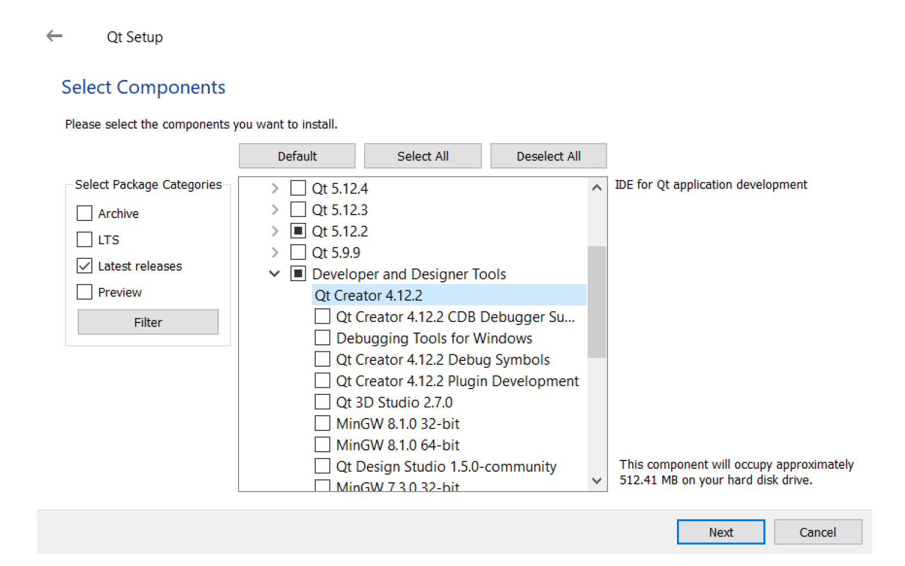
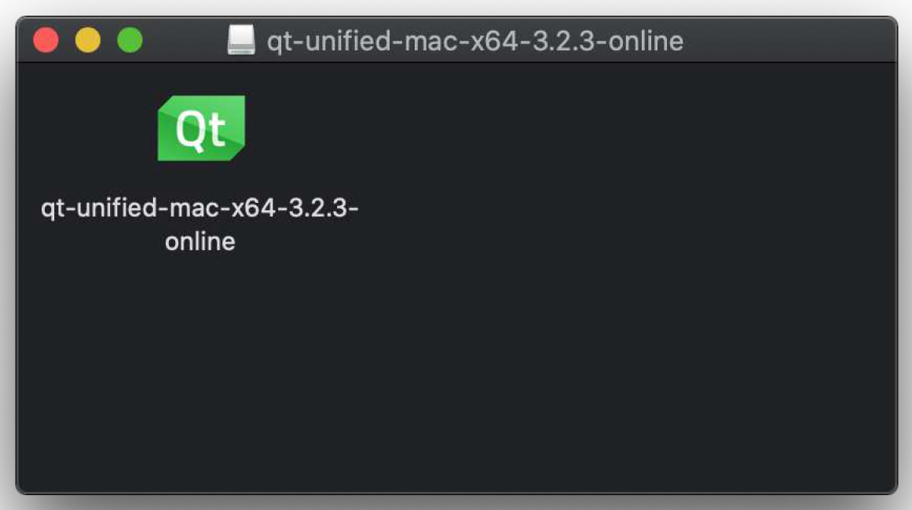
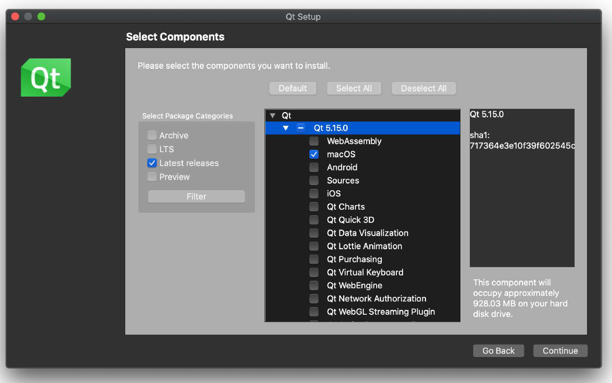
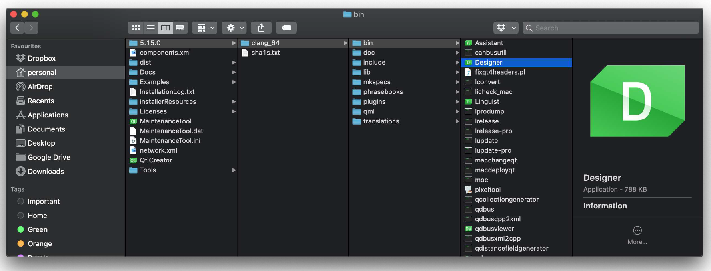
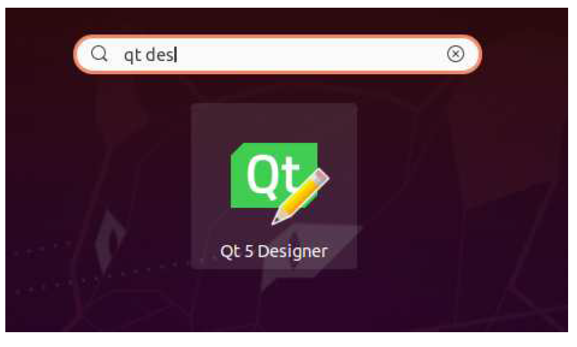

---
prev:
  text: '10. 事件'
  link: '/BasicPyQt6Features/10'
next:
  text: '12. 开始使用 Qt Designer'
  link: '/QtDesigner/12'
---

### 

到目前为止，我们一直使用 Python 创建应用程序。在许多情况下，这很有效，但随着应用程序的规模越来越大，或者界面越来越复杂，通过编程来定义所有控件会变得有些繁琐。好消息是，Qt 附带了一个图形化编辑器——Qt Designer——其中包含一个拖放式用户界面编辑器。使用 Qt Designer ，您可以可视化地定义你的用户界面，然后只需在后续阶段将应用程序逻辑与之关联即可。

在本章中，我们将介绍使用 Qt Designer  创建用户界面的基础知识、原理、布局和控件都是相同的，因此您可以应用已经学到的所有知识。您还需要了解 Python API，以便稍后连接应用程序逻辑。

## 11. 下载 Qt Designer

Qt Designer 包含在 Qt 的安装包中，可从 Qt下载页面获取。请您下载并运行适用于您系统的相应安装程序，并按照以下平台特定的说明操作。安装 Qt Designer 不会影响您的 PyQt6 安装。


> Qt Creator 与 Qt Designer
>
> 您可能还会看到关于 Qt Creator 的提及。Qt Creator 是一个功能齐全的Qt 项目集成开发环境（IDE），而 Qt Designer 是用户界面设计组件。Qt Designer 包含在 Qt Creator 中，因此您可以选择安装它，尽管它对 Python 项目没有额外价值。

## Windows系统

Qt Designer 在 Windows Qt 安装程序中未被提及，但会在安装任何版本的 Qt 核心库时自动安装。例如，在以下截图中，我们选择了安装 MSVC 2017 64 位版本的Qt —— 您的选择不会影响 Designer 的安装。


> 图六十八：安装 Qt 时，也会一并安装 Qt Designer。

如果您想安装 Qt Creator，它列在“开发者和设计师工具”类别下。令人困惑的是，Qt Designer 并未包含在此类别中。



> 图六十九：正在安装 Qt Creator 组件

## macOS系统

Qt Designer 在 macOS Qt 安装程序中未被提及，但会在安装任何版本的 Qt 核心库时自动安装。请从 Qt 官网下载安装程序——您可以选择开源版本。



> 图七十：您会在下载的 `.dmg` 文件中找到安装程序。

请您打开安装程序以开始安装。继续操作直至出现选择安装组件的界面。然后，在最新版本的Qt下选择macOS安装包。



> 图七十一：您只需使用最新版本的macOS安装包即可。

安装完成后，请打开您安装 Qt 的文件夹。Designer 的启动程序位于 `<版本>/clang_64/bin` 目录下。您会发现 QtCreator 也安装在 Qt 安装文件夹的根目录中。



> 图七十二：您可以在 `<版本>/clang_64/bin` 文件夹下找到Designer启动器。

您可以直接从当前位置运行Designer，或将其移动到Applications文件夹中，以便通过macOS启动台启动。

## Linux (Ubuntu & Debian)

您可以通过包管理器安装 Qt Designer。根据您的发行版和版本，您可以使用 Qt5 Designer 或 Qt6 Designer。您可以使用其中任何一个来开发 PyQt6 的用户界面设计。

您可以使用以下命令安装 Qt5 Designer：

```bash
sudo apt-get install qttools5-dev-tools
```

同理，您也可以安装Qt6 Designer，这次用：

```bash
sudo apt-get install designer-qt6
```

安装完成后，Qt Designer 将出现在启动器中。



> 图七十三：在 Ubuntu 启动器中的Qt Designer 