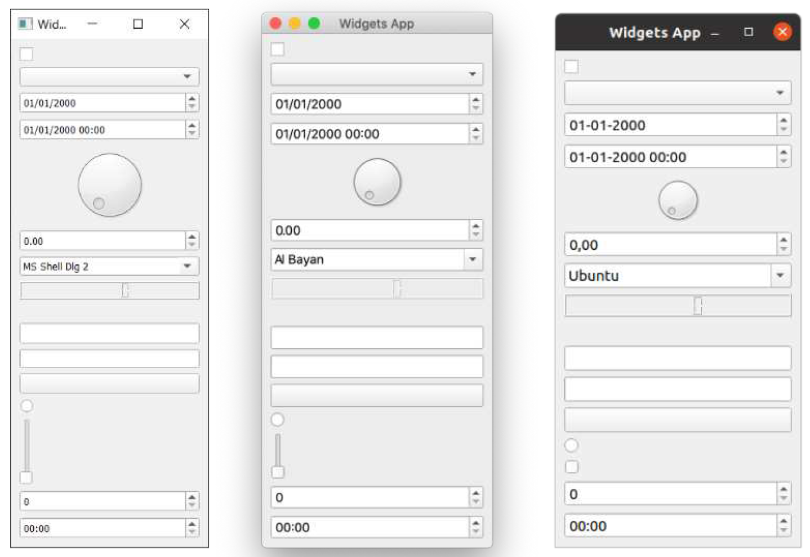

---
prev:
  text: '12. 开始使用 Qt Designer'
  link: '/QtDesigner/12'
next:
  text: '14. 调色板'
  link: '/Theming/14'
---

开箱即用的 Qt 应用程序看起来像平台原生应用程序。也就是说，它们采用的是运行所在操作系统的界面风格。这意味着它们在任何系统上都看起来很自然，可以给我们的用户带来自然的使用体验。但这也意味着它们看起来有些乏味。幸运的是，Qt 允许您完全控制应用程序中控件的外观。

无论您是想让您的应用程序脱颖而出，还是正在设计自定义控件并希望它们与应用程序相融合，本章我们将介绍如何在 PyQt6 中实现这些目标。

## 13. 样式

样式是 Qt 对应用程序进行广泛外观和感觉更改、修改控件显示和行为的方式。Qt 在应用程序在特定平台上运行时会自动应用特定于特定平台的样式，因此，在 macOS 上运行时，您的应用程序看起来像一个 macOS 应用程序，而在 Windows 上运行时，看起来像一个 Windows 应用程序。这些特定于平台的样式利用了主机平台上的本机控件，这意味着它们不能在其他平台上使用。

然而，平台样式并不是您为应用程序设计样式时唯一可选的选项。Qt 还附带了一个名为 Fusion 的跨平台样式，该样式为您的应用程序提供了一致的跨平台、现代的样式。

## Fusion

Qt 的 Fusion 样式为您带来了所有系统 UI 一致性的优势，但代价是与操作系统标准的一致性受到了一些影响。哪一个更重要，取决于您对正在创建的 UI 需要多少控制权、您对其进行了多少自定义以及您使用了哪些控件。

> Fusion 样式是一种与平台无关的样式，提供桌面化的外观和感觉。它实现了与 Qt 控件的 Fusion 样式相同的设计语言。
>
> ——Qt官方文档

要启用该样式，请在 `QApplication` 实例上调用 `.setStyle()`，并将样式名称（在本例中为 Fusion）作为字符串传递。

```python
app = QApplication(sys.argv)
app.setStyle('Fusion')
#...
app.exec()
```

下面显示了前面提到的控件列表示例，但应用了 Fusion 样式。



> 图八十九："Fusion”样式控件。它们在所有平台上看起来完全相同。


> 在 [Qt 文档](https://doc.qt.io/archives/qt-5.8/gallery-fusion.html)中还有更多应用了 Fusion 样式的控件示例。