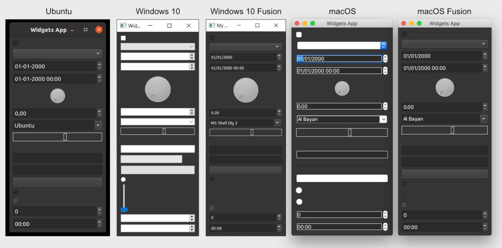
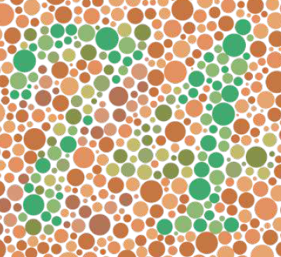
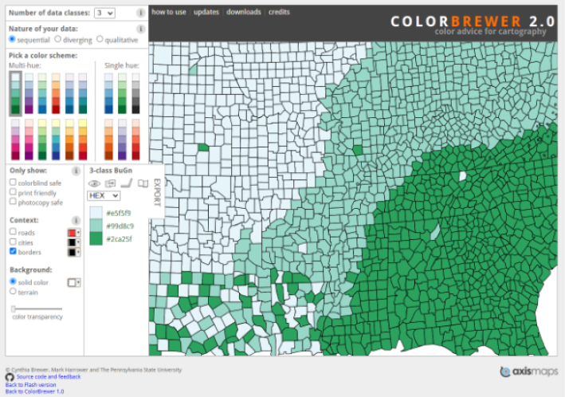
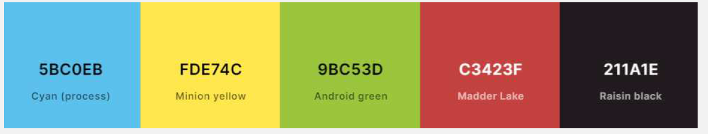

---
prev:
  text: '13. 样式'
  link: '/Theming/13'
next:
  text: '15. 图标'
  link: '/Theming/15'
---

## 14. 调色板

在 Qt 中用于绘制用户界面的颜色选择被称为调色板。应用程序级和控件特定的调色板都通过 QPalette对象进行管理。调色板可以在应用程序和控件级别设置，允许您设置全局标准调色板，并根据每个控件的情况进行覆盖。全局调色板通常由 Qt 主题（通常依赖于操作系统）定义，但您可以覆盖它来更改整个应用程序的外观。

活动全局调色板可通过 `QApplication.palette()` 方法或创建一个新的空 `QPalette` 实例来访问。例如——

```python
from PyQt6.QtGui import QPalette
palette = QPalette()
```

您可以通过调用 `palette.setColor(role, color)` 来修改调色板，其中 `role` 决定了颜色的用途，`QColor` 决定了要使用的颜色。使用的颜色可以是自定义的 `QColor` 对象，也可以是 `Qt.GlobalColor` 命名空间中的内置基本颜色之一。

```python
palette.setColor(QPalette.ColorRole.Window, QColor(53,53,53))
palette.setColor(QPalette.ColorRole.WindowText, Qt.GlobalColor.white)
```


> 在使用调色板时，Windows 10和 macOS 平台的特定主题存在一些限制。

角色(role)种类相当多。主要角色如下表所示——

*Table 4. Main roles*

| 常量                                 | 值   | 描述                                                         |
| ------------------------------------ | ---- | ------------------------------------------------------------ |
| `QPalette.ColorRole.Window`          | 10   | 窗口的背景颜色                                               |
| `QPalette.ColorRole.WindowText`      | 0    | 窗口的默认文本颜色                                           |
| `QPalette.ColorRole.Base`            | 9    | 文本输入控件、组合框下拉列表和工具栏句柄的背景。通常为白色或浅色 |
| `QPalette.ColorRole.AlternateBase`   | 16   | 第二种颜色，用于条纹（交替）行——例如 `QAbstractItemView.setAlternatingRowColors()` |
| `QPalette.ColorRole.ToolTipBase`     | 18   | `QToolTip` 和 `QWhatsThis` 悬停指示器的背景颜色。这两个提示均使用“非活动组”（见后文），因为它们不是活动窗口。 |
| `QPalette.ColorRole.ToolTipText`     | 19   | `QToolTip` 和 `QWhatsThis` 的前景色。这两个提示均使用“非活动”组（见后文），因为它们不是活动窗口。 |
| `QPalette.ColorRole.PlaceholderText` | 20   | 控件中占位符文本的颜色。                                     |
| `QPalette.ColorRole.Text`            | 6    | 使用 `Base` 颜色为控件设置文本颜色。必须与 Window 和 Base 形成良好的对比度。 |
| `QPalette.ColorRole.Button`          | 1    | 默认按钮背景颜色。此颜色可能与窗口颜色不同，但必须与按钮文字形成良好对比。 |
| `QPalette.ColorRole.ButtonText`      | 8    | 按钮上使用的文字颜色，必须与按钮颜色形成足够的对比度。       |
| `QPalette.ColorRole.BrightText`      | 7    | 与WindowText颜色差异显著，与黑色形成良好对比的文本颜色。在其他文本和WindowText颜色会导致对比度较差的情况下使用。 注意：不仅可以用于文本。 |


> 您不必在自定义调色板中修改或设置所有这些选项，这取决于应用程序中使用的控件，有些可以省略。

还有一些较小的角色集，用于控件的 3D 斜角和突出显示选定的条目或链接。

*Table 5. 3D bevel roles*

| 常量                          | 值   | 描述                                                         |
| ----------------------------- | ---- | ------------------------------------------------------------ |
| `QPalette.ColorRole.Light`    | 2    | 比 `Button` 颜色更浅                                         |
| `QPalette.ColorRole.Midlight` | 3    | 颜色深浅在 `Button` 和 `Light` 之间                          |
| `QPalette.ColorRole.Dark`     | 4    | 比 `Button` 颜色更深                                         |
| `QPalette.ColorRole.Mid`      | 5    | 颜色深浅在 `Button` 和 `Dark` 之间                           |
| `QPalette.ColorRole.Shadow`   | 11   | 一种非常深的颜色。在默认情况下，阴影颜色为`Qt.GlobalColor.black` |

*Table 6. Highlighting & links*

| 常量                                 | 值   | 描述                                                         |
| ------------------------------------ | ---- | ------------------------------------------------------------ |
| `QPalette.ColorRole.Highlight`       | 12   | 用于指示选中项或当前项的颜色。默认情况下，高亮颜色为 `Qt.GlobalColor.darkBlue` |
| `QPalette.ColorRole.HighlightedText` | 13   | 与高亮文本形成对比的文本颜色。默认情况下，高亮文本的颜色为`Qt.GlobalColor.white` |
| `QPalette.ColorRole.Link`            | 14   | 未访问超链接的文本颜色。默认情况下，链接颜色为 `Qt.GlobalColor.blue` |
| `QPalette.ColorRole.LinkVisited`     | 15   | 已访问超链接的文本颜色。默认情况下，已访问链接的颜色为 `Qt.GlobalColor.magenta` |


> 从技术上讲，对于未分配角色的控件绘制状态，还有一个`QPalette.NoRole` 值，在创建调色板时可以忽略它。

对于用户界面中在控件处于活动、非活动或禁用状态时会发生变化的部分，您必须为每个状态设置颜色。要实现这一点，您可以调用 `palette.setColor(group, role, color)` 方法，并传入额外的 `group` 参数。可用的组如下所示 

| 常量                                          | 值   |
| --------------------------------------------- | ---- |
| `QPalette.ColorGroup.Disabled`                | 1    |
| `QPalette.ColorGroup.Active`                  | 0    |
| `QPalette.ColorGroup.Inactive`                | 2    |
| `QPalette.ColorGroup.Normal` "Active"的同义词 | 0    |

例如，以下代码将禁用窗口的窗口文本颜色设置为调色板中的白色。

```python
palette.setColor(QPalette.ColorGroup.Disabled, QPalette.ColorRole.WindowText, Qt.GlobalColor.white)
```

一旦调色板被定义，您可以使用 `.setPalette()` 将它设置到 `QApplication` 对象上，以将其应用到您的应用程序或单个控件上。例如，以下示例将更改窗口文本和背景的颜色（这里使用 `QLabel` 添加了文本）。

*Listing 91. themes/palette_test.py*

```python
from PyQt6.QtWidgets import QApplication, QLabel
from PyQt6.QtGui import QPalette, QColor
from PyQt6.QtCore import Qt

import sys


app = QApplication(sys.argv)
palette = QPalette()
palette.setColor(QPalette.ColorRole.Window, QColor(0, 128, 255))
palette.setColor(QPalette.ColorRole.WindowText, Qt.GlobalColor.white)
app.setPalette(palette)

w = QLabel("Palette Test")
w.show()

app.exec()
```

运行时，会输出以下内容。窗口背景色变为浅蓝色，窗口文字为白色。


> 图九十：更改窗口和窗口文本的颜色

为了展示配色方案在实际中的应用并了解其局限性，我们将创建一个使用自定义深色配色方案的应用程序。


> 使用此调色板，所有控件都将以深色背景绘制，无论应用程序的深色模式状态如何。有关使用系统深色模式的信息，请参见后面部分。

虽然一般情况下应避免覆盖用户设置，但在某些类型的应用程序中，如照片查看器或视频编辑器，使用明亮的用户界面可能会干扰用户对颜色的判断。以下应用程序骨架使用了 [Jürgen Skrotzky](https://github.com/Jorgen-VikingGod/Qt-Frameless-Window-DarkStyle/blob/master/DarkStyle.cpp) 定制的配色方案，为应用程序提供全局深色主题。

```python
from PyQt6.QtWidgets import QApplication, QMainWindow
from PyQt6.QtGui import QPalette, QColor
from PyQt6.QtCore import Qt

import sys

darkPalette = QPalette()
darkPalette.setColor(QPalette.ColorRole.Window, QColor(53, 53, 53))
darkPalette.setColor(
    QPalette.ColorRole.WindowText, Qt.GlobalColor.white
)
darkPalette.setColor(
    QPalette.ColorGroup.Disabled,
    QPalette.ColorRole.WindowText,
    QColor(127, 127, 127),
)
darkPalette.setColor(QPalette.ColorRole.Base, QColor(42, 42, 42))
darkPalette.setColor(
    QPalette.ColorRole.AlternateBase, QColor(66, 66, 66)
)
darkPalette.setColor(
    QPalette.ColorRole.ToolTipBase, Qt.GlobalColor.white
)
darkPalette.setColor(
    QPalette.ColorRole.ToolTipText, Qt.GlobalColor.white
)
darkPalette.setColor(QPalette.ColorRole.Text, Qt.GlobalColor.white)
221
darkPalette.setColor(
    QPalette.ColorGroup.Disabled,
    QPalette.ColorRole.Text,
    QColor(127, 127, 127),
)
darkPalette.setColor(QPalette.ColorRole.Dark, QColor(35, 35, 35))
darkPalette.setColor(QPalette.ColorRole.Shadow, QColor(20, 20, 20))
darkPalette.setColor(QPalette.ColorRole.Button, QColor(53, 53, 53))
darkPalette.setColor(
    QPalette.ColorRole.ButtonText, Qt.GlobalColor.white
)
darkPalette.setColor(
    QPalette.ColorGroup.Disabled,
    QPalette.ColorRole.ButtonText,
    QColor(127, 127, 127),
)
darkPalette.setColor(QPalette.ColorRole.BrightText, Qt.GlobalColor.
                     red)
darkPalette.setColor(QPalette.ColorRole.Link, QColor(42, 130, 218))
darkPalette.setColor(QPalette.ColorRole.Highlight, QColor(42, 130,
                                                          218))
darkPalette.setColor(
    QPalette.ColorGroup.Disabled,
    QPalette.ColorRole.Highlight,
    QColor(80, 80, 80),
)
darkPalette.setColor(
    QPalette.ColorRole.HighlightedText, Qt.GlobalColor.white
)
darkPalette.setColor(
    QPalette.ColorGroup.Disabled,
    QPalette.ColorRole.HighlightedText,
    QColor(127, 127, 127),
)

app = QApplication(sys.argv)
app.setPalette(darkPalette)

w = QMainWindow() # 用您的 QMainWindow 实例替换此处。
w.show()

app.exec()
```

与之前一样，调色板构建完成后，必须应用才能生效。这里，我们通过调用 `app.setPalette()` 将它应用到整个应用程序。所有控件都将采用该主题。您可以使用此框架构建自己的应用程序。

在本书的代码示例中，您还可以找到 `themes/palette_dark_widgets.py` ，它使用此调色板再现了控件演示。每个平台上的结果如下所示。



> 图九十一：适用于不同平台和主题的自定义深色配色方案。

您会注意到，使用默认的 Windows 和 macOS 主题时，某些控件的颜色无法正确应用。这是因为这些主题使用平台本机控件来提供真正的本机体验。如果您想在 Windows 10 上使用深色或高度自定义的主题，建议在这些平台上使用 Fusion 样式。

## 深色模式

深色主题的操作系统和应用程序有助于减轻眼睛疲劳并减少睡眠干扰，尤其是在晚上工作时。Windows、macOS 和 Linux 均支持深色模式主题，而好消息是，如果您使用 PyQt6 开发应用程序，深色模式支持将自动包含在内。

## 可访问的颜色

当您开始开发自己的应用程序时，可能会忍不住想在设计中调整颜色——但请稍等！您的操作系统应该有一个标准主题，大多数软件都会遵循这个主题。Qt会自动识别这个颜色方案，并将其应用到您的应用程序中，帮助它们与系统风格保持一致。使用这些颜色有以下优势——

1. 您的应用程序在用户的桌面上将显得非常自然
2. 您的用户已经熟悉上下文颜色所代表的含义
3. 有人已经花时间设计了能够有效工作的颜色方案



> **不要低估#3的重要性！**设计良好的色彩方案非常困难，尤其是当您考虑无障碍问题时——而您应该考虑！

如果您想替换默认桌面配色方案，请确保收益大于成本，并且您已探索过其他选项，例如目标平台上内置的深色模式。

对于**数据可视化**应用，我推荐使用 Cynthia Brewer 的 Color Brewer颜色方案，这些方案兼具定性与定量方案，并专为最大程度的清晰度而设计。

对于**上下文颜色和高亮显示**，或任何其他只需少量颜色的情况——例如状态指示器——[coolors.co](https://coolors.co/) 网站允许您生成自定义的、协调良好的 4 色主题。



> Colorbrewer2.org 提供定量和定性色彩方案

请充分利用您的配色方案。简单而有效地使用颜色，尽可能限制您的配色方案。如果某些颜色在某个地方有特定含义，那么在所有地方都使用相同的含义。避免使用多种色调，除非这些色调有特定含义。



> 来自 coolors.co 的示例配色方案

---

**请务必**在应用程序中使用图形用户界面标准颜色。

使用自定义颜色时，**请务必**定义一种配色方案并坚持使用。

选择颜色和对比度时，**请务必**考虑色盲用户。

**请勿**将标准颜色用于非标准用途，例如红色代表“OK”。