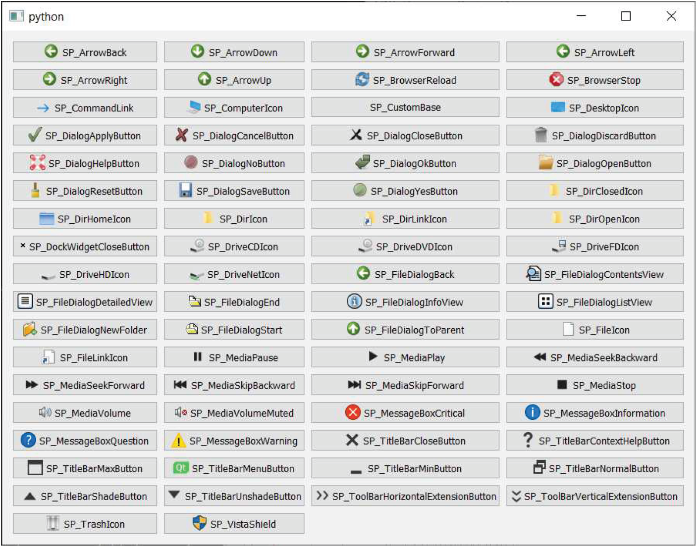
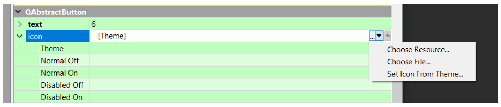
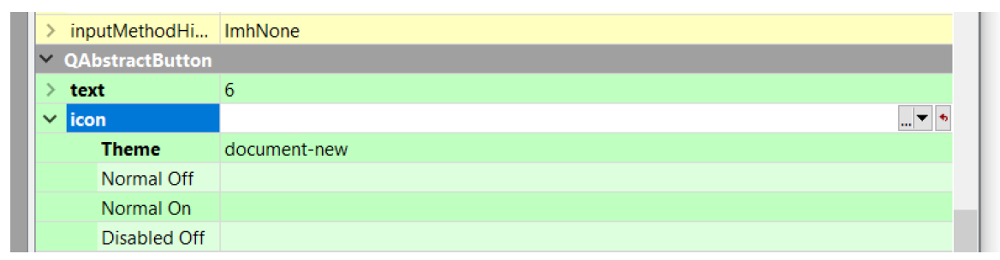
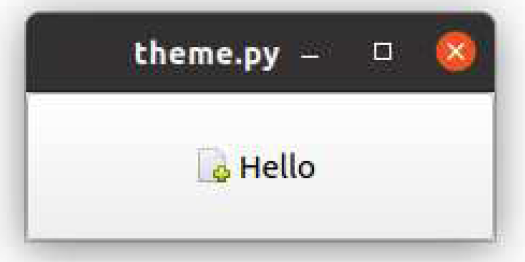

---
prev:
  text: '14. 调色板'
  link: '/Theming/14'
next:
  text: '16. Qt 样式表 (QSS)'
  link: '/Theming/16'
---

## 15. 图标

图标是用于辅助导航或理解的小型图片。它们通常出现在按钮上，可以与文本并列显示，或替代文本，也可以与菜单中的操作并列显示。通过使用易于识别的指示符，您可以使界面更易于使用。

在 PyQt6 中，您有多种不同的方式来获取并集成图标到应用程序中。本节将介绍这些选项以及各自的优缺点。

## Qt 标准图标

在应用程序中添加简单图标的最简单方法是使用Qt自带的内置图标。这组图标涵盖了多种标准使用场景，包括文件操作、前后箭头以及消息框指示器。

以下是内置图标的完整列表。



> 图九十二：Qt的内置图标

您会发现这组图标的适用范围较为有限。如果这对您正在开发的应用程序来说不是问题，或者您只需要为应用程序使用少量图标，那么这仍然可能是一个可行的选择。

通过当前应用程序样式使用 `QStyle.standardIcon(name)` 或 `QStyle.<constant>` 可以访问这些图标。内置图标名称的完整列表如下所示。

| SP_ArrowBack           | SP_DirIcon                | SP_MediaSkipBackward                |
| ---------------------- | ------------------------- | ----------------------------------- |
| SP_ArrowDown           | SP_DirLinkIcon            | SP_MediaSkipForward                 |
| SP_ArrowForward        | SP_DirOpenIcon            | SP_MediaStop                        |
| SP_ArrowLeft           | SP_DockWidgetCloseButton  | SP_MediaVolume                      |
| SP_ArrowRight          | SP_DriveCDIcon            | SP_MediaVolumeMuted                 |
| SP_ArrowUp             | SP_DriveDVDIcon           | SP_MessageBoxCritical               |
| SP_BrowserReload       | SP_DriveFDIcon            | SP_MessageBoxInformation            |
| SP_BrowserStop         | SP_DriveHDIcon            | SP_MessageBoxQuestion               |
| SP_CommandLink         | SP_DriveNetIcon           | SP_MessageBoxWarning                |
| SP_CustomBase          | SP_FileDialogContentsView | SP_TitleBarContextHelpButton        |
| SP_DesktopIcon         | SP_FileDialogDetailedView | SP_TitleBarMaxButton                |
| SP_DialogApplyButton   | SP_FileDialogEnd          | SP_TitleBarMenuButton               |
| SP_DialogCancelButton  | SP_FileDialogInfoView     | SP_TitleBarMinButton                |
| SP_DialogCloseButton   | SP_FileDialogListView     | SP_TitleBarNormalButton             |
| SP_DialogDiscardButton | SP_FileDialogNewFolder    | SP_TitleBarShadeButton              |
| SP_DialogHelpButton    | SP_FileDialogStart        | SP_TitleBarUnshadeButton            |
| SP_DialogNoButton      | SP_FileDialogToParent     | SP_ToolBarHorizontalExtensionButton |
| SP_DialogOkButton      | SP_FileIcon               | SP_ToolBarVerticalExtensionButton   |
| SP_DialogResetButton   | SP_FileLinkIcon           | SP_TrashIcon                        |
| SP_DialogSaveButton    | SP_MediaPause             | SP_VistaShield                      |
| SP_DialogYesButton     | SP_MediaPlay              | SP_DirClosedIcon                    |
| SP_MediaSeekBackward   | SP_DirHomeIcon            | SP_MediaSeekForward                 |

您可以通过以下方式直接通过 `QStyle` 命名空间访问这些图标。

```python
icon = QStyle.standardIcon(QStyle.SP_MessageBoxCritical)
button.setIcon(icon)
```

您也可以使用特定控件的样式对象。无论使用哪一个都无所谓，因为我们只是访问内置控件而已。

```python
style = button.style() # 从控件中获取 QStyle 对象
icon = style.standardIcon(style.SP_MessageBoxCritical)
button.setIcon(icon)
```

如果您在标准图标集找不到所需的图标，您需要使用以下所述的其他方法之一。


> 虽然您可以混合搭配不同图标集中的图标，但最好在整个应用程序中使用单一样式，以保持应用程序的连贯性。

## 图标文件

如果标准图标不符合您的需求，或者您需要一些不可用的图标，您可以使用任何自定义图标。图标可以是您平台上 Qt 支持的任何图像类型，尽管对于大多数使用场景，PNG 或 SVG 图像更可取。


> 要获取您平台上支持的图像格式列表，您可以调用 `QtGui.QImageReader.supportedImageFormats()` 方法。

### 图标集

如果您不是图形设计师，使用现成的图标集可以节省大量时间（和麻烦）。网上有成千上万种这样的图标集，其许可证因在开源软件或商业软件中的使用而异。

在这本书和示例应用程序中，我使用了 [Fugue](http://p.yusukekamiyamane.com/) 图标集，该图标集也可免费用于您的软件，但需注明作者。Tango图标集是一个为Linux系统开发的庞大图标集，但它没有许可要求，因此可以在任何平台上使用。

| 资源                                                         | 描述                                       | 许可证    |
| ------------------------------------------------------------ | ------------------------------------------ | --------- |
| [Fugue byp.yusukekamiyamane](http://p.yusukekamiyamane.com/) | 3,570 个 16x16 像素的 PNG 格式图标         | CC BY 3.0 |
| [Diagona byp.yusukekamiyamane](http://p.yusukekamiyamane.com/) | 400 个 16x16 和 10x10 的图标，格式为 PNG。 | CC BY 3.0 |
| [Tango Icons by The TangoDesktop Project](http://tango.freedesktop.org/Tango_Icon_Library) | 使用 Tango 项目颜色主题的图标。            | 公共领域  |


> 虽然您可以控制菜单和工具栏中使用的图标大小，但在大多数情况下，建议保持默认设置。菜单中图标的标准大小为20x20像素。


> 比这更小的尺寸也可行，图标会居中显示，而不是放大显示。

### 创造您自己的图标

如果您不喜欢现有图标集中的任何一个，或者希望为您的应用程序打造独特风格，当然可以自行设计图标。图标可使用任何标准图形设计软件创建，并保存为带透明背景的PNG图像。图标应为正方形，且分辨率需确保在应用程序中使用时无需进行缩放。

### 使用图标文件

一旦您拥有图标文件（无论是来自图标集还是自行绘制），即可通过创建 `QtGui.QIcon` 实例并直接传入图标文件名的方式，在 Qt 应用程序中使用这些图标。

```python
QtGui.QIcon("<filename>")
```

虽然您可以使用绝对路径（完整路径）和相对路径（部分路径）来指向您的文件，但绝对路径在分发应用程序时容易出现问题。相对路径只要图标文件存储在与脚本相同的相对位置即可正常工作，尽管在打包时管理这一点也可能较为困难。


> 为了创建图标实例，您必须已经创建了一个 `QApplication` 实例。为了确保这一点，您可以在源文件的顶部创建应用程序实例，或者在使用它们的控件或窗口的 `__init__` 中创建 `QIcon` 实例。

## 自由桌面规范图标（Linux）

在 Linux 桌面系统中，有一个名为“自由桌面规范”（Free Desktop Specification）的标准，它为特定操作的图标定义了标准名称。

如果您的应用程序使用了这些特定的图标名称（并从主题中加载图标），那么在 Linux 上，您的应用程序将使用当前在桌面上启用的图标集。此处的目标是确保所有应用程序具有相同的用户界面风格，同时保持可配置性。

要在 Qt Designer 中使用这些功能，您需要选择下拉菜单并选择“Set Icon From Theme…”



> 图九十三：选择图标主题

然后，请您输入您要使用的图标名称，例如 `document-new`（参见 [有效名称的完整列表](https://specifications.freedesktop.org/icon-naming-spec/latest/ar01s04.html)）。



> 图九十四：选择图标主题

在代码中，您可以通过以下方式从当前活动的 Linux 桌面主题中获取图标：`icon =QtGui.QIcon.fromTheme(“document-new”)` 。以下代码片段将生成一个小窗口（按钮），显示当前主题中的“新建文档”图标。

*Listing 92. icons/linux.py*

```python
from PyQt6.QtWidgets import QApplication, QPushButton
from PyQt6.QtGui import QIcon

import sys

app = QApplication(sys.argv)
button = QPushButton("Hello")
icon = QIcon.fromTheme("document-new")
button.setIcon(icon)
button.show()

app.exec()
```

生成的窗口在Ubuntu系统上将呈现如下外观，采用默认的图标主题。



> 图九十五：Linux 自由桌面规范 “文档新建” 图标

如果您正在开发跨平台应用程序，您仍然可以在 Linux 上使用这些标准图标。为此，请为 Windows 和 macOS 使用您自己的图标，并在 Qt Designer 中创建自定义主题，使用自由桌面规范的图标名称。

