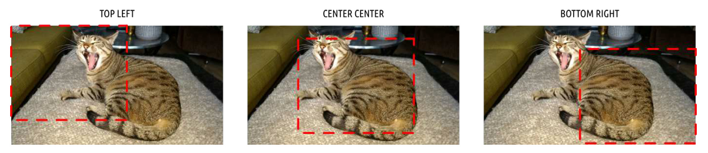

# 主题设计

开箱即用的 Qt 应用程序看起来像平台原生应用程序。也就是说，它们采用的是运行所在操作系统的界面风格。这意味着它们在任何系统上都看起来很自然，可以给我们的用户带来自然的使用体验。但这也意味着它们看起来有些乏味。幸运的是，Qt 允许您完全控制应用程序中控件的外观。

无论您是想让您的应用程序脱颖而出，还是正在设计自定义控件并希望它们与应用程序相融合，本章我们将介绍如何在 PyQt6 中实现这些目标。

## 13. 样式

样式是 Qt 对应用程序进行广泛外观和感觉更改、修改控件显示和行为的方式。Qt 在应用程序在特定平台上运行时会自动应用特定于特定平台的样式，因此，在 macOS 上运行时，您的应用程序看起来像一个 macOS 应用程序，而在 Windows 上运行时，看起来像一个 Windows 应用程序。这些特定于平台的样式利用了主机平台上的本机控件，这意味着它们不能在其他平台上使用。

然而，平台样式并不是您为应用程序设计样式时唯一可选的选项。Qt 还附带了一个名为 Fusion 的跨平台样式，该样式为您的应用程序提供了一致的跨平台、现代的样式。

### Fusion

Qt 的 Fusion 样式为您带来了所有系统 UI 一致性的优势，但代价是与操作系统标准的一致性受到了一些影响。哪一个更重要，取决于您对正在创建的 UI 需要多少控制权、您对其进行了多少自定义以及您使用了哪些控件。

> Fusion 样式是一种与平台无关的样式，提供桌面化的外观和感觉。它实现了与 Qt 控件的 Fusion 样式相同的设计语言。
>
> ——Qt官方文档

要启用该样式，请在 `QApplication` 实例上调用 `.setStyle()`，并将样式名称（在本例中为 Fusion）作为字符串传递。

```python
app = QApplication(sys.argv)
app.setStyle('Fusion')
#...
app.exec()
```

下面显示了前面提到的控件列表示例，但应用了 Fusion 样式。


> 图八十九："Fusion”样式控件。它们在所有平台上看起来完全相同。


> 在 [Qt 文档](https://doc.qt.io/archives/qt-5.8/gallery-fusion.html)中还有更多应用了 Fusion 样式的控件示例。

## 14. 调色板

在 Qt 中用于绘制用户界面的颜色选择被称为调色板。应用程序级和控件特定的调色板都通过 QPalette对象进行管理。调色板可以在应用程序和控件级别设置，允许您设置全局标准调色板，并根据每个控件的情况进行覆盖。全局调色板通常由 Qt 主题（通常依赖于操作系统）定义，但您可以覆盖它来更改整个应用程序的外观。

活动全局调色板可通过 `QApplication.palette()` 方法或创建一个新的空 `QPalette` 实例来访问。例如——

```python
from PyQt6.QtGui import QPalette
palette = QPalette()
```

您可以通过调用 `palette.setColor(role, color)` 来修改调色板，其中 `role` 决定了颜色的用途，`QColor` 决定了要使用的颜色。使用的颜色可以是自定义的 `QColor` 对象，也可以是 `Qt.GlobalColor` 命名空间中的内置基本颜色之一。

```python
palette.setColor(QPalette.ColorRole.Window, QColor(53,53,53))
palette.setColor(QPalette.ColorRole.WindowText, Qt.GlobalColor.white)
```


> 在使用调色板时，Windows 10和 macOS 平台的特定主题存在一些限制。

角色(role)种类相当多。主要角色如下表所示——

*Table 4. Main roles*

| 常量                                 | 值   | 描述                                                         |
| ------------------------------------ | ---- | ------------------------------------------------------------ |
| `QPalette.ColorRole.Window`          | 10   | 窗口的背景颜色                                               |
| `QPalette.ColorRole.WindowText`      | 0    | 窗口的默认文本颜色                                           |
| `QPalette.ColorRole.Base`            | 9    | 文本输入控件、组合框下拉列表和工具栏句柄的背景。通常为白色或浅色 |
| `QPalette.ColorRole.AlternateBase`   | 16   | 第二种颜色，用于条纹（交替）行——例如 `QAbstractItemView.setAlternatingRowColors()` |
| `QPalette.ColorRole.ToolTipBase`     | 18   | `QToolTip` 和 `QWhatsThis` 悬停指示器的背景颜色。这两个提示均使用“非活动组”（见后文），因为它们不是活动窗口。 |
| `QPalette.ColorRole.ToolTipText`     | 19   | `QToolTip` 和 `QWhatsThis` 的前景色。这两个提示均使用“非活动”组（见后文），因为它们不是活动窗口。 |
| `QPalette.ColorRole.PlaceholderText` | 20   | 控件中占位符文本的颜色。                                     |
| `QPalette.ColorRole.Text`            | 6    | 使用 `Base` 颜色为控件设置文本颜色。必须与 Window 和 Base 形成良好的对比度。 |
| `QPalette.ColorRole.Button`          | 1    | 默认按钮背景颜色。此颜色可能与窗口颜色不同，但必须与按钮文字形成良好对比。 |
| `QPalette.ColorRole.ButtonText`      | 8    | 按钮上使用的文字颜色，必须与按钮颜色形成足够的对比度。       |
| `QPalette.ColorRole.BrightText`      | 7    | 与WindowText颜色差异显著，与黑色形成良好对比的文本颜色。在其他文本和WindowText颜色会导致对比度较差的情况下使用。 注意：不仅可以用于文本。 |


> 您不必在自定义调色板中修改或设置所有这些选项，这取决于应用程序中使用的控件，有些可以省略。

还有一些较小的角色集，用于控件的 3D 斜角和突出显示选定的条目或链接。

*Table 5. 3D bevel roles*

| 常量                          | 值   | 描述                                                         |
| ----------------------------- | ---- | ------------------------------------------------------------ |
| `QPalette.ColorRole.Light`    | 2    | 比 `Button` 颜色更浅                                         |
| `QPalette.ColorRole.Midlight` | 3    | 颜色深浅在 `Button` 和 `Light` 之间                          |
| `QPalette.ColorRole.Dark`     | 4    | 比 `Button` 颜色更深                                         |
| `QPalette.ColorRole.Mid`      | 5    | 颜色深浅在 `Button` 和 `Dark` 之间                           |
| `QPalette.ColorRole.Shadow`   | 11   | 一种非常深的颜色。在默认情况下，阴影颜色为`Qt.GlobalColor.black` |

*Table 6. Highlighting & links*

| 常量                                 | 值   | 描述                                                         |
| ------------------------------------ | ---- | ------------------------------------------------------------ |
| `QPalette.ColorRole.Highlight`       | 12   | 用于指示选中项或当前项的颜色。默认情况下，高亮颜色为 `Qt.GlobalColor.darkBlue` |
| `QPalette.ColorRole.HighlightedText` | 13   | 与高亮文本形成对比的文本颜色。默认情况下，高亮文本的颜色为`Qt.GlobalColor.white` |
| `QPalette.ColorRole.Link`            | 14   | 未访问超链接的文本颜色。默认情况下，链接颜色为 `Qt.GlobalColor.blue` |
| `QPalette.ColorRole.LinkVisited`     | 15   | 已访问超链接的文本颜色。默认情况下，已访问链接的颜色为 `Qt.GlobalColor.magenta` |


> 从技术上讲，对于未分配角色的控件绘制状态，还有一个`QPalette.NoRole` 值，在创建调色板时可以忽略它。

对于用户界面中在控件处于活动、非活动或禁用状态时会发生变化的部分，您必须为每个状态设置颜色。要实现这一点，您可以调用 `palette.setColor(group, role, color)` 方法，并传入额外的 `group` 参数。可用的组如下所示 

| 常量                                          | 值   |
| --------------------------------------------- | ---- |
| `QPalette.ColorGroup.Disabled`                | 1    |
| `QPalette.ColorGroup.Active`                  | 0    |
| `QPalette.ColorGroup.Inactive`                | 2    |
| `QPalette.ColorGroup.Normal` "Active"的同义词 | 0    |

例如，以下代码将禁用窗口的窗口文本颜色设置为调色板中的白色。

```python
palette.setColor(QPalette.ColorGroup.Disabled, QPalette.ColorRole.WindowText, Qt.GlobalColor.white)
```

一旦调色板被定义，您可以使用 `.setPalette()` 将它设置到 `QApplication` 对象上，以将其应用到您的应用程序或单个控件上。例如，以下示例将更改窗口文本和背景的颜色（这里使用 `QLabel` 添加了文本）。

*Listing 91. themes/palette_test.py*

```python
from PyQt6.QtWidgets import QApplication, QLabel
from PyQt6.QtGui import QPalette, QColor
from PyQt6.QtCore import Qt

import sys


app = QApplication(sys.argv)
palette = QPalette()
palette.setColor(QPalette.ColorRole.Window, QColor(0, 128, 255))
palette.setColor(QPalette.ColorRole.WindowText, Qt.GlobalColor.white)
app.setPalette(palette)

w = QLabel("Palette Test")
w.show()

app.exec()
```

运行时，会输出以下内容。窗口背景色变为浅蓝色，窗口文字为白色。


> 图九十：更改窗口和窗口文本的颜色

为了展示配色方案在实际中的应用并了解其局限性，我们将创建一个使用自定义深色配色方案的应用程序。


> 使用此调色板，所有控件都将以深色背景绘制，无论应用程序的深色模式状态如何。有关使用系统深色模式的信息，请参见后面部分。

虽然一般情况下应避免覆盖用户设置，但在某些类型的应用程序中，如照片查看器或视频编辑器，使用明亮的用户界面可能会干扰用户对颜色的判断。以下应用程序骨架使用了 [Jürgen Skrotzky](https://github.com/Jorgen-VikingGod/Qt-Frameless-Window-DarkStyle/blob/master/DarkStyle.cpp) 定制的配色方案，为应用程序提供全局深色主题。

```python
from PyQt6.QtWidgets import QApplication, QMainWindow
from PyQt6.QtGui import QPalette, QColor
from PyQt6.QtCore import Qt

import sys

darkPalette = QPalette()
darkPalette.setColor(QPalette.ColorRole.Window, QColor(53, 53, 53))
darkPalette.setColor(
    QPalette.ColorRole.WindowText, Qt.GlobalColor.white
)
darkPalette.setColor(
    QPalette.ColorGroup.Disabled,
    QPalette.ColorRole.WindowText,
    QColor(127, 127, 127),
)
darkPalette.setColor(QPalette.ColorRole.Base, QColor(42, 42, 42))
darkPalette.setColor(
    QPalette.ColorRole.AlternateBase, QColor(66, 66, 66)
)
darkPalette.setColor(
    QPalette.ColorRole.ToolTipBase, Qt.GlobalColor.white
)
darkPalette.setColor(
    QPalette.ColorRole.ToolTipText, Qt.GlobalColor.white
)
darkPalette.setColor(QPalette.ColorRole.Text, Qt.GlobalColor.white)
221
darkPalette.setColor(
    QPalette.ColorGroup.Disabled,
    QPalette.ColorRole.Text,
    QColor(127, 127, 127),
)
darkPalette.setColor(QPalette.ColorRole.Dark, QColor(35, 35, 35))
darkPalette.setColor(QPalette.ColorRole.Shadow, QColor(20, 20, 20))
darkPalette.setColor(QPalette.ColorRole.Button, QColor(53, 53, 53))
darkPalette.setColor(
    QPalette.ColorRole.ButtonText, Qt.GlobalColor.white
)
darkPalette.setColor(
    QPalette.ColorGroup.Disabled,
    QPalette.ColorRole.ButtonText,
    QColor(127, 127, 127),
)
darkPalette.setColor(QPalette.ColorRole.BrightText, Qt.GlobalColor.
                     red)
darkPalette.setColor(QPalette.ColorRole.Link, QColor(42, 130, 218))
darkPalette.setColor(QPalette.ColorRole.Highlight, QColor(42, 130,
                                                          218))
darkPalette.setColor(
    QPalette.ColorGroup.Disabled,
    QPalette.ColorRole.Highlight,
    QColor(80, 80, 80),
)
darkPalette.setColor(
    QPalette.ColorRole.HighlightedText, Qt.GlobalColor.white
)
darkPalette.setColor(
    QPalette.ColorGroup.Disabled,
    QPalette.ColorRole.HighlightedText,
    QColor(127, 127, 127),
)

app = QApplication(sys.argv)
app.setPalette(darkPalette)

w = QMainWindow() # 用您的 QMainWindow 实例替换此处。
w.show()

app.exec()
```

与之前一样，调色板构建完成后，必须应用才能生效。这里，我们通过调用 `app.setPalette()` 将它应用到整个应用程序。所有控件都将采用该主题。您可以使用此框架构建自己的应用程序。

在本书的代码示例中，您还可以找到 `themes/palette_dark_widgets.py` ，它使用此调色板再现了控件演示。每个平台上的结果如下所示。


> 图九十一：适用于不同平台和主题的自定义深色配色方案。

您会注意到，使用默认的 Windows 和 macOS 主题时，某些控件的颜色无法正确应用。这是因为这些主题使用平台本机控件来提供真正的本机体验。如果您想在 Windows 10 上使用深色或高度自定义的主题，建议在这些平台上使用 Fusion 样式。

### 深色模式

深色主题的操作系统和应用程序有助于减轻眼睛疲劳并减少睡眠干扰，尤其是在晚上工作时。Windows、macOS 和 Linux 均支持深色模式主题，而好消息是，如果您使用 PyQt6 开发应用程序，深色模式支持将自动包含在内。

### 可访问的颜色

当您开始开发自己的应用程序时，可能会忍不住想在设计中调整颜色——但请稍等！您的操作系统应该有一个标准主题，大多数软件都会遵循这个主题。Qt会自动识别这个颜色方案，并将其应用到您的应用程序中，帮助它们与系统风格保持一致。使用这些颜色有以下优势——

1. 您的应用程序在用户的桌面上将显得非常自然
2. 您的用户已经熟悉上下文颜色所代表的含义
3. 有人已经花时间设计了能够有效工作的颜色方案


> **不要低估#3的重要性！**设计良好的色彩方案非常困难，尤其是当您考虑无障碍问题时——而您应该考虑！

如果您想替换默认桌面配色方案，请确保收益大于成本，并且您已探索过其他选项，例如目标平台上内置的深色模式。

对于**数据可视化**应用，我推荐使用 Cynthia Brewer 的 Color Brewer颜色方案，这些方案兼具定性与定量方案，并专为最大程度的清晰度而设计。

对于**上下文颜色和高亮显示**，或任何其他只需少量颜色的情况——例如状态指示器——[coolors.co](https://coolors.co/) 网站允许您生成自定义的、协调良好的 4 色主题。


> Colorbrewer2.org 提供定量和定性色彩方案

请充分利用您的配色方案。简单而有效地使用颜色，尽可能限制您的配色方案。如果某些颜色在某个地方有特定含义，那么在所有地方都使用相同的含义。避免使用多种色调，除非这些色调有特定含义。


> 来自 coolors.co 的示例配色方案

---

**请务必**在应用程序中使用图形用户界面标准颜色。

使用自定义颜色时，**请务必**定义一种配色方案并坚持使用。

选择颜色和对比度时，**请务必**考虑色盲用户。

**请勿**将标准颜色用于非标准用途，例如红色代表“OK”。

## 15. 图标

图标是用于辅助导航或理解的小型图片。它们通常出现在按钮上，可以与文本并列显示，或替代文本，也可以与菜单中的操作并列显示。通过使用易于识别的指示符，您可以使界面更易于使用。

在 PyQt6 中，您有多种不同的方式来获取并集成图标到应用程序中。本节将介绍这些选项以及各自的优缺点。

### Qt 标准图标

在应用程序中添加简单图标的最简单方法是使用Qt自带的内置图标。这组图标涵盖了多种标准使用场景，包括文件操作、前后箭头以及消息框指示器。

以下是内置图标的完整列表。


> 图九十二：Qt的内置图标

您会发现这组图标的适用范围较为有限。如果这对您正在开发的应用程序来说不是问题，或者您只需要为应用程序使用少量图标，那么这仍然可能是一个可行的选择。

通过当前应用程序样式使用 `QStyle.standardIcon(name)` 或 `QStyle.<constant>` 可以访问这些图标。内置图标名称的完整列表如下所示。

| SP_ArrowBack           | SP_DirIcon                | SP_MediaSkipBackward                |
| ---------------------- | ------------------------- | ----------------------------------- |
| SP_ArrowDown           | SP_DirLinkIcon            | SP_MediaSkipForward                 |
| SP_ArrowForward        | SP_DirOpenIcon            | SP_MediaStop                        |
| SP_ArrowLeft           | SP_DockWidgetCloseButton  | SP_MediaVolume                      |
| SP_ArrowRight          | SP_DriveCDIcon            | SP_MediaVolumeMuted                 |
| SP_ArrowUp             | SP_DriveDVDIcon           | SP_MessageBoxCritical               |
| SP_BrowserReload       | SP_DriveFDIcon            | SP_MessageBoxInformation            |
| SP_BrowserStop         | SP_DriveHDIcon            | SP_MessageBoxQuestion               |
| SP_CommandLink         | SP_DriveNetIcon           | SP_MessageBoxWarning                |
| SP_CustomBase          | SP_FileDialogContentsView | SP_TitleBarContextHelpButton        |
| SP_DesktopIcon         | SP_FileDialogDetailedView | SP_TitleBarMaxButton                |
| SP_DialogApplyButton   | SP_FileDialogEnd          | SP_TitleBarMenuButton               |
| SP_DialogCancelButton  | SP_FileDialogInfoView     | SP_TitleBarMinButton                |
| SP_DialogCloseButton   | SP_FileDialogListView     | SP_TitleBarNormalButton             |
| SP_DialogDiscardButton | SP_FileDialogNewFolder    | SP_TitleBarShadeButton              |
| SP_DialogHelpButton    | SP_FileDialogStart        | SP_TitleBarUnshadeButton            |
| SP_DialogNoButton      | SP_FileDialogToParent     | SP_ToolBarHorizontalExtensionButton |
| SP_DialogOkButton      | SP_FileIcon               | SP_ToolBarVerticalExtensionButton   |
| SP_DialogResetButton   | SP_FileLinkIcon           | SP_TrashIcon                        |
| SP_DialogSaveButton    | SP_MediaPause             | SP_VistaShield                      |
| SP_DialogYesButton     | SP_MediaPlay              | SP_DirClosedIcon                    |
| SP_MediaSeekBackward   | SP_DirHomeIcon            | SP_MediaSeekForward                 |

您可以通过以下方式直接通过 `QStyle` 命名空间访问这些图标。

```python
icon = QStyle.standardIcon(QStyle.SP_MessageBoxCritical)
button.setIcon(icon)
```

您也可以使用特定控件的样式对象。无论使用哪一个都无所谓，因为我们只是访问内置控件而已。

```python
style = button.style() # 从控件中获取 QStyle 对象
icon = style.standardIcon(style.SP_MessageBoxCritical)
button.setIcon(icon)
```

如果您在标准图标集找不到所需的图标，您需要使用以下所述的其他方法之一。


> 虽然您可以混合搭配不同图标集中的图标，但最好在整个应用程序中使用单一样式，以保持应用程序的连贯性。

### 图标文件

如果标准图标不符合您的需求，或者您需要一些不可用的图标，您可以使用任何自定义图标。图标可以是您平台上 Qt 支持的任何图像类型，尽管对于大多数使用场景，PNG 或 SVG 图像更可取。


> 要获取您平台上支持的图像格式列表，您可以调用 `QtGui.QImageReader.supportedImageFormats()` 方法。

#### 图标集

如果您不是图形设计师，使用现成的图标集可以节省大量时间（和麻烦）。网上有成千上万种这样的图标集，其许可证因在开源软件或商业软件中的使用而异。

在这本书和示例应用程序中，我使用了 [Fugue](http://p.yusukekamiyamane.com/) 图标集，该图标集也可免费用于您的软件，但需注明作者。Tango图标集是一个为Linux系统开发的庞大图标集，但它没有许可要求，因此可以在任何平台上使用。

| 资源                                                         | 描述                                       | 许可证    |
| ------------------------------------------------------------ | ------------------------------------------ | --------- |
| [Fugue byp.yusukekamiyamane](http://p.yusukekamiyamane.com/) | 3,570 个 16x16 像素的 PNG 格式图标         | CC BY 3.0 |
| [Diagona byp.yusukekamiyamane](http://p.yusukekamiyamane.com/) | 400 个 16x16 和 10x10 的图标，格式为 PNG。 | CC BY 3.0 |
| [Tango Icons by The TangoDesktop Project](http://tango.freedesktop.org/Tango_Icon_Library) | 使用 Tango 项目颜色主题的图标。            | 公共领域  |


> 虽然您可以控制菜单和工具栏中使用的图标大小，但在大多数情况下，建议保持默认设置。菜单中图标的标准大小为20x20像素。


> 比这更小的尺寸也可行，图标会居中显示，而不是放大显示。

#### 创造您自己的图标

如果您不喜欢现有图标集中的任何一个，或者希望为您的应用程序打造独特风格，当然可以自行设计图标。图标可使用任何标准图形设计软件创建，并保存为带透明背景的PNG图像。图标应为正方形，且分辨率需确保在应用程序中使用时无需进行缩放。

#### 使用图标文件

一旦您拥有图标文件（无论是来自图标集还是自行绘制），即可通过创建 `QtGui.QIcon` 实例并直接传入图标文件名的方式，在 Qt 应用程序中使用这些图标。

```python
QtGui.QIcon("<filename>")
```

虽然您可以使用绝对路径（完整路径）和相对路径（部分路径）来指向您的文件，但绝对路径在分发应用程序时容易出现问题。相对路径只要图标文件存储在与脚本相同的相对位置即可正常工作，尽管在打包时管理这一点也可能较为困难。


> 为了创建图标实例，您必须已经创建了一个 `QApplication` 实例。为了确保这一点，您可以在源文件的顶部创建应用程序实例，或者在使用它们的控件或窗口的 `__init__` 中创建 `QIcon` 实例。

### 自由桌面规范图标（Linux）

在 Linux 桌面系统中，有一个名为“自由桌面规范”（Free Desktop Specification）的标准，它为特定操作的图标定义了标准名称。

如果您的应用程序使用了这些特定的图标名称（并从主题中加载图标），那么在 Linux 上，您的应用程序将使用当前在桌面上启用的图标集。此处的目标是确保所有应用程序具有相同的用户界面风格，同时保持可配置性。

要在 Qt Designer 中使用这些功能，您需要选择下拉菜单并选择“Set Icon From Theme…”


> 图九十三：选择图标主题

然后，请您输入您要使用的图标名称，例如 `document-new`（参见 [有效名称的完整列表](https://specifications.freedesktop.org/icon-naming-spec/latest/ar01s04.html)）。


> 图九十四：选择图标主题

在代码中，您可以通过以下方式从当前活动的 Linux 桌面主题中获取图标：`icon =QtGui.QIcon.fromTheme(“document-new”)` 。以下代码片段将生成一个小窗口（按钮），显示当前主题中的“新建文档”图标。

*Listing 92. icons/linux.py*

```python
from PyQt6.QtWidgets import QApplication, QPushButton
from PyQt6.QtGui import QIcon

import sys

app = QApplication(sys.argv)
button = QPushButton("Hello")
icon = QIcon.fromTheme("document-new")
button.setIcon(icon)
button.show()

app.exec()
```

生成的窗口在Ubuntu系统上将呈现如下外观，采用默认的图标主题。


> 图九十五：Linux 自由桌面规范 “文档新建” 图标

如果您正在开发跨平台应用程序，您仍然可以在 Linux 上使用这些标准图标。为此，请为 Windows 和 macOS 使用您自己的图标，并在 Qt Designer 中创建自定义主题，使用自由桌面规范的图标名称。

## 16. Qt 样式表 (QSS)

到目前为止，我们已经了解了如何使用 `QPalette` 为 PyQt6 应用程序应用自定义颜色。然而，您还可以对 Qt6 中的控件外观进行许多其他自定义。系统提供了名为 Qt 样式表 (QSS) 的功能来实现这种自定义。

QSS 在概念上与用于设置网页样式的层叠样式表 (CSS) 非常相似，具有相似的语法和方法。在本节中，我们将介绍一些 QSS 的示例，以及如何使用它来修改控件的外观。


> 在控件上使用 QSS 会对性能产生轻微影响，因为在重绘控件时需要查找相应的规则。但是，除非您正在执行非常繁重的控件工作，否则这不会产生什么影响。

### 样式编辑器

为了使 QSS 规则的实际使用更容易一些，我们可以创建一个简单的演示应用程序，允许输入规则并将其应用于一些示例控件。我们将使用它来测试各种样式属性和规则。


> 样式查看器的源代码如下所示，但也可以从本书的源代码中获得。

*Listing 93. themes/qss_tester.py*

```python
import sys

from PyQt6.QtCore import Qt
from PyQt6.QtGui import QColor, QPalette
from PyQt6.QtWidgets import (
    QApplication,
    QCheckBox,
    QComboBox,
    QLabel,
    QLineEdit,
    QMainWindow,
    QPlainTextEdit,
    QPushButton,
    QSpinBox,
    QVBoxLayout,
    QWidget,
)


class MainWindow(QMainWindow):
    def __init__(self):
        super().__init__()
        
        self.setWindowTitle("QSS Tester")
        
        self.editor = QPlainTextEdit()
        self.editor.textChanged.connect(self.update_styles)
        
        layout = QVBoxLayout()
        layout.addWidget(self.editor)
        
        # 定义一套简单的控件
        cb = QCheckBox("Checkbox")
        layout.addWidget(cb)
        
        combo = QComboBox()
        combo.setObjectName("thecombo")
        combo.addItems(["First", "Second", "Third", "Fourth"])
        layout.addWidget(combo)
        
        sb = QSpinBox()
        sb.setRange(0, 99999)
        layout.addWidget(sb)
        
        l = QLabel("This is a label")
        layout.addWidget(l)
        
        le = QLineEdit()
        le.setObjectName("mylineedit")
        layout.addWidget(le)
        
        pb = QPushButton("Push me!")
        layout.addWidget(pb)
        
        self.container = QWidget()
        self.container.setLayout(layout)
        
        self.setCentralWidget(self.container)
        
    def update_styles(self):
        qss = self.editor.toPlainText()
        self.setStyleSheet(qss)
        
        
app = QApplication(sys.argv)
app.setStyle("Fusion")

w = MainWindow()
w.show()

app.exec()        
```

运行此应用程序后，您将看到以下窗口，顶部有一个文本编辑器（您可以在其中输入 QSS 规则），还有一组将应用这些规则的控件——我们稍后将介绍如何应用规则和继承。


> 图九十六：QSS测试应用程序，未应用任何规则。

请您尝试在顶部的框中输入以下样式规则，并将结果与截图进行比较，以确保其正常运行。

```css
QLabel { background-color: yellow }
```


> 图九十七：为QLabel应用背景颜色：黄色

```css
QLineEdit { background-color: rgb(255, 0, 0) }
```


> 图九十八：为QLineEdit应用背景颜色：rgb(255, 0, 0)（红色）

```css
QLineEdit {
    border-width: 7px;
    border-style: dashed;
    border-color: red;
}
```


> 图九十九：为QLineEdit应用虚线红色边框

接下来，我们将详细探讨这些 QSS 规则如何为控件设置样式，并逐步构建一些更复杂的规则集。


> [Qt 文档](https://doc.qt.io/qt-5/stylesheet-reference.html) 中提供了可样式化的控件的完整列表。

### 样式属性

接下来，我们将介绍可用于使用 QSS 设置控件样式的属性。这些属性已按逻辑分段，每段包含相互关联的属性，以便于理解。您可以使用刚刚创建的 QSS 规则测试器应用程序在各种控件上测试这些样式。

以下表格中使用的类型如下所示。其中一些是由其他条目组成的复合类型。


> 您可以暂时跳过此表格，但在解释每个属性的合法值时将需要将其作为参考。

| 属性           | 类型                                                         | 描述                                                         |
| -------------- | ------------------------------------------------------------ | ------------------------------------------------------------ |
| `Alignment`    | top, bottom, left, right, center                             | 水平和/或垂直对齐                                            |
| `Attachment`   | scroll, fixed                                                | 滚动或固定附件                                               |
| `Background`   | Brush, Url, Repeat, Alignment                                | 刷子类型、URL、重复次数、和对齐方式                          |
| `Boolean`      | 0, 1                                                         | True或者False                                                |
| `Border`       | Border Style, Length, Brush                                  | 简写边界属性                                                 |
| `Border Image` | none, Url Number, (stretch, repeat)                          | 由九个部分组成的图像（顶部左侧、顶部中央、顶部右侧、中部左侧、中部、中部右侧、底部左侧、底部中央和底部右侧） |
| `Border Style` | dashed, dot-dash, dot-dot-dash, dotted, double, groove, inset, outset, ridge, solid, none | 用于绘制边框的图案                                           |
| `Box Colors`   | Brush                                                        | 最多可指定四个 Brush 值，分别对应矩形框的顶部、右侧、底部和左侧边界。如果省略左侧颜色，则使用右侧颜色；如果省略底部颜色，则使用顶部颜色 |
| `Box Lengths`  | Length                                                       | 最多可指定四个 Length 值，分别对应矩形框的顶部、右侧、底部和左侧边界。如果省略左侧颜色，则使用右侧颜色；如果省略底部颜色，则使用顶部颜色 |
| `Brush`        | Color, Gradient, PaletteRole                                 | 颜色、渐变或调色板中的一个条目                               |
| `Color`        | rgb(r,g,b), rgba(r, g, b, a), hsv(h, s, v), hsva(h, s, v, a), hsl(h, s, l), hsla(h, s, l, a), #rrggbb, Color Name | 指定颜色为RGB（红、绿、蓝）、RGBA（红、绿、蓝、透明度）、HSV（色调、饱和度、明度）、HSVA（色调、饱和度、明度、透明度）、HSL（色调、饱和度、明度）、HSLA（色调、饱和度、明度、透明度）或命名颜色。rgb() 或 rgba() 语法可使用 0 到255 之间的整数值或百分比值 |
| `Font`         | (Font Style, Font Weight) Font Size                          | 简写字体属性                                                 |
| `Font Size`    | Length                                                       | 字体大小                                                     |
| `Font Style`   | normal, italic, oblique                                      | 字体样式                                                     |
| `Font Weight`  | normal, bold, 100, 200.., 900                                | 字体粗细                                                     |
| `Gradient`     | qlineargradient, qradialgradient, qconicalgradient           | 线性渐变，从起始点到终点。径向渐变，从焦点到围绕该焦点的圆上的终点。锥形渐变，围绕中心点。参见[QLinearGradient 文档](https://doc.qt.io/qt-5/stylesheet-reference.html#gradient) 以获取语法信息 |
| `Icon`         | Url(disabled, active, normal, selected)(on, off)             | URL、QIcon.Mode 和 QIcon.State 的列表。例如：`file-icon: url(file.png)，url(file_selected.png) selected;` |
| `Length`       | Number(px, pt, em, ex)                                       | 一个数字后跟一个测量单位。如果未指定单位，则在大部分情况下使用像素。单位包括：px：像素，pt：一点的大小（即1/72英寸），em：字体的em宽度（即字母'M'的宽度），ex：字体的ex宽度（即字母'x'的高度）。 |
| `Number`       | 一个十进制整数或实数                                         | 例如，123或者12.2312                                         |
| `Origin`       | margin, border, padding, content                             | 请参阅盒模型以获取更多详细信息                               |
| `PaletteRole`  | alternate-base, base, bright-text, button, button-text, dark, highlight, highlighted-text, light, link, link-visited, mid, midlight, shadow, text, window, window-text | 这些值与控件的 QPalette 中的颜色角色相对应，例如：`color: palette(dark);` |
| `Radius`       | Length                                                       | 一次或两次Length的出现                                       |
| `Repeat`       | repeat-x, repeat-y, no-repeat                                | repeat-x: 水平重复。 repeat-y: 垂直重复。 repeat: 水平和垂直重复。 no-repeat: 不重复。 |
| `Url`          | url(filename)                                                | filename是磁盘上文件的名称，或使用Qt资源系统存储的文件名称。 |

这些属性和类型的完整详细信息也可在 [QSS参考文档](https://doc.qt.io/Qt-5/stylesheet-reference.html#list-of-properties) 中找到。

#### 文本样式

我们首先来介绍文本属性，这些属性可用于修改文本的字体、颜色和样式（粗体、斜体、下划线）。这些属性可应用于任何控件或控件。

| 属性                         | 类型                                    | 描述                                                         |
| ---------------------------- | --------------------------------------- | ------------------------------------------------------------ |
| `color`                      | Brush (`QPaletteForeground`)            | 用于渲染文本的颜色                                           |
| `font`                       | Font                                    | 设置文本字体的简写符号。相当于指定字体家族、字体大小、字体样式和/或字体粗细 |
| `font-family`                | String                                  | 字体家族                                                     |
| `font-size`                  | Font Size                               | 字体大小。在此版本的Qt中，仅支持pt和px单位。                 |
| `font-style`                 | normal, italic, oblique                 | 字体样式                                                     |
| `font-weight`                | Font Weight                             | 字体粗细                                                     |
| `selection-background-color` | Brush (`QPaletteHighlight`)             | 选定文本或项的背景色                                         |
| `selection-color`            | Brush (`PaletteHighlightedText`)        | 选定文本或项的前景色                                         |
| `text-align`                 | Alignment                               | 文本和图标在控件内容中的对齐方式                             |
| `text-decoration`            | none, underline, overline, line-through | 额外的文本效果                                               |

下面的示例代码片段将 `QLineEdit` 的颜色设置为红色，选中文本的背景色设置为黄色，选中文本的颜色设置为蓝色。

```css
QLineEdit {
    color: red;
    selection-color: blue;
    selection-background-color: yellow;
}
```

请您在 QSS 测试器中尝试一下，看看对 `QLineEdit` 的影响，结果如下所示。请注意，只有目标控件（`QLineEdit`）受到样式的影响。


> 图一百：将文本样式应用于 QLineEdit

我们可以将此规则应用于两种不同的控件，将它们都作为目标，并用逗号分隔。

```css
QSpinBox, QLineEdit {
    color: red;
    selection-color: blue;
    selection-background-color: yellow;
}
```


> 图101：将文本样式应用于 QLineEdit 和 QSpinBox

在这个最后的例子中，我们将样式应用到 `QSpinBox`、`QLineEdit` 和 `QPushButton` 上，将字体设置为粗体和斜体，并将文本对齐方式设置为右对齐。

```css
QSpinBox, QLineEdit, QPushButton {
    color: red;
    selection-color: blue;
    selection-background-color: yellow;
    font-style: italic;
    font-weight: bold;
    text-align: right;
}
```

这会产生如下所示的结果。请注意，`text-align` 属性并未影响 `QSpinBox` 或 `QLineEdit` 的对齐方式。对于这两个控件，必须使用 `.setAlignment()` 方法来设置对齐方式，而不是使用样式。


> 图102：将文本样式应用于 QPushButton、QLineEdit 和 QSpinBox

#### 背景

除了设置文本样式外，您还可以使用纯色和图像设置控件背景的样式。对于图像，还有许多其他属性可用于定义图像在控件区域中的重复和定位方式。

| 属性                  | 类型（默认）         | 描述                                                         |
| --------------------- | -------------------- | ------------------------------------------------------------ |
| `background`          | Background           | 简写语法用于设置背景。等同于指定背景颜色、背景图像、背景重复方式和/或背景位置。参见背景起源、选区背景颜色、背景裁剪、背景附着和替代背景颜色 |
| `background-color`    | Brush                | 控件使用的背景颜色                                           |
| `background-image`    | Url                  | 控件使用的背景图像。图像的半透明部分允许背景颜色透过         |
| `background-repeat`   | Repeat (both)        | 背景图像是否以及如何重复以填充背景起始矩形                   |
| `background-position` | Alignment (top-left) | 背景图像在背景起始矩形内的对齐方式                           |
| `background-clip`     | Origin (border)      | 控件的矩形，背景在此处绘制                                   |
| `background-origin`   | Origin (padding)     | 控件的背景矩形，与背景位置和背景图像一起使用                 |

以下示例将指定的图像应用于我们用于输入规则的 `QPlainTextEdit` 的背景。

```css
QPlainTextEdit {
    color: white;
    background-image: url(../otje.jpg);
}
```

图片通过 `url()` 语法引用，传入文件的路径。这里我们使用 `../otje.jpg` 指向父目录中的文件。


> 图103：一张背景图片


> 虽然此语法与层叠样式表中使用的语法相同，但远程文件不能使用 URL 加载。

要定位控件中的背景，您可以使用 `background-position` 属性。该属性定义了图像与控件原点矩形上的同一点对齐的点。默认情况下，原点矩形是控件的填充区域。



> 图104：背景位置的示例

居中 `center` 是指图像的中心将沿两个轴与控件的中心对齐。

```css
QPlainTextEdit {
    color: white;
    background-image: url(../otje.jpg);
    background-position: center center;
}
```


> 图105：居中的背景图片

要将图像的右下角与控件的原始矩形的右下角对齐，您可以使用以下代码：

```css
QPlainTextEdit {
    color: white;
    background-image: url(../otje.jpg);
    background-position: bottom right;
}
```

`background-origin` 属性可用于修改起始矩形。该属性接受以下值之一：`margin`、`border`、`padding` 或 `content`，用于定义该特定框作为背景位置对齐的参考点。

为了理解这是什么意思，我们需要看看控件框模型。

#### 控件盒模型

“盒模型”一词描述了包围每个控件的框（矩形）之间的关系，以及这些框对控件之间的大小或布局的影响。每个 Qt 控件都由四个同心框包围——从内到外，分别是内容、填充、边框和边距。每个框都具有特定的属性，这些属性决定了框的大小、外观和位置。每个框的属性都由 Qt 控件的属性列表定义。


> 图106：盒模型

如果您增加内部框的大小就会增加外部框的大小。例如，增加控件的填充会增加内容和边框之间的空间，同时增加边框本身的尺寸。


> 图107：在右侧添加填充对其他框的影响

可用于修改各个框的属性如下所示

| 属性             | 类型（默认）                      | 描述                                                         |
| ---------------- | --------------------------------- | ------------------------------------------------------------ |
| `border`         | Border                            | 设置控件边框的简写符号。相当于指定边框颜色、边框样式和/或边框宽度。还有`border-top` , `border-right` ,  `border-bottom`  和 `borderleft`. |
| `border-color`   | Box Colors (`QPaletteForeground`) | 边框所有边缘的颜色。也包括：`border-top-color`、`border-right-color`、`border-bottom-color` 、`border-left-color` . 用于指定特定边缘的颜色。 |
| `border-image`   | Border Image                      | 用于填充边框的图像。该图像会被分割成九个部分，并在必要时进行适当拉伸。 |
| `border-radius`  | Radius                            | 边框角点的半径（曲线）。也包括`border-top-left-radius` , `border-top-right-radius` , `borderbottom-right-radius` 和 `border-bottomleft-radius`，用于指定特定角点的半径。 |
| `border-style`   | Border Style (none)               | 所有边框边缘的样式。此外，还有`border-top-style`、`border-right-styleborder-bottom-style` 和 `border-leftstyle`用于特殊的边缘 |
| `border-width`   | Box Lengths                       | 边框的宽度。也包括`bordertop-width` 、`border-right-width` 、`borderbottom-width` 和 `border-left-width` |
| `margin`         | Box Lengths                       | 控件的边距。还有 `margin-top`、 `margin-right` 、`margin-bottom` 和 `marginleft` |
| `outline`        |                                   | 围绕对象边界绘制的轮廓                                       |
| `outline-color`  | Color                             | 轮廓的颜色。参见border-color                                 |
| `outline-offset` | Length                            | 轮廓与控件边框之间的偏移量                                   |
| `outline-style`  |                                   | 指定用于绘制轮廓的图案。另请参阅border-style                 |
| `outline-radius` |                                   | 为轮廓添加圆角。还有`outline-bottom-left-radius` , `outline-bottom-right-radius` , `outlinetop-left-radius` 和 `outline-top-right-radius`填充框长度。还有 `padding-top`, `padding-right` , `padding-bottom` 和 `padding-left`，填充控件 |

以下示例修改了 `QPlainTextEdit` 控件的边距、边框和填充。

```css
QPlainTextEdit {
    margin: 10;
    padding: 10px;
    border: 5px solid red;
}
```


> 关于单位的说明
>
> 在此示例中，我们使用像素（px）作为填充和边框的单位。边距的值也以像素为单位，因为在未指定单位时，像素是默认单位。您还可以使用以下单位之一：
>
> • px 像素
>
> • pt 一"点"大小（即 1/72 英寸）
>
> • em 字体的 em 宽度（即 ‘M’ 的宽度）
>
> • ex 字体的 ex 宽度（即 ‘x’ 的高度）

在QSS测试器中查看结果时，您可以看到红色边框内的填充物和红色边框外的边距。


> 图108：盒模型

您还可以为轮廓添加半径以生成曲线边缘

```css
QPlainTextEdit {
    margin: 10;
    padding: 10px;
    border: 5px solid red;
    border-radius: 15px;
}
```


> 图109：边框半径为15像素（曲线）

#### 调整控件大小

您可以使用 QSS 控制控件的大小。但是，虽然有特定的 `width` 和 `height`属性（见下文），但这些属性仅用于指定子控件的大小。要控制控件，您必须使用 `max-` 和 `min-` 属性。

| 属性         | 类型（默认） | 描述                   |
| ------------ | ------------ | ---------------------- |
| `max-height` | Length       | 控件或子控件的最大高度 |
| `max-width`  | Length       | 控件或子控件的最大宽度 |
| `min-height` | Length       | 控件或子控件的最小高度 |
| `min-width`  | Length       | 控件或子控件的最小宽度 |

如果您指定的 `min-height` 属性值大于控件通常的高度，则该控件将被放大。

```css
QLineEdit {
    min-height: 50;
}
```


> 图110：为QLineEdit设置最小高度，以放大其显示区域。

但是，在设置 `min-height` 时，控件当然可以大于此值。要指定控件的确切大小，您可以同时指定尺寸的 `min-` 和 `max-`。

```css
QLineEdit {
    min-height: 50;
    max-height: 50;
}
```

这将把控件锁定到此高度，防止它随着内容的变化而改变大小。


> 使用此方法时请小心，否则可能会导致控件无法读取！

#### 控件的特定样式

到目前为止，我们所看到的样式都是通用的，可用于大多数控件。然而，还有许多可设置的控件特定属性。

| 属性                                         | 类型（默认）                                  | 描述                                                         |
| -------------------------------------------- | --------------------------------------------- | ------------------------------------------------------------ |
| `alternate-background-color`                 | Brush (`QPaletteAlternateBase`)               | 在 `QAbstractItemView` 子类中使用的替代背景色                |
| `background-attachment`                      | Attachment (scroll)                           | 确定在`QAbstractScrollArea` 中，背景图像是否会随着视线焦点滚动或固定 |
| `button-layout`                              | Number(`SH_DialogButtonLayout`)               | 按钮在 `QDialogButtonBox` 或 `QMessageBox` 中的布局。可能的值为 0（Windows）、1（Mac）、2（KDE）、3（Gnome）和 5（Android） |
| `dialogbuttonbox-buttonshave-icons`          | Boolean                                       | `QDialogButtonBox` 中的按钮是否显示图标。如果此属性设置为 1，`QDialogButtonBox` 中的按钮将显示图标；如果设置为 0，则不显示图标 |
| `gridline-color`                             | Color(`SH_Table_GridLineColor`)               | `QTableView` 中网格线的颜色                                  |
| `icon`                                       | Url+                                          | 控件图标。目前唯一支持此属性的控件是 `QPushButton`           |
| `icon-size`                                  | Length                                        | 控件中图标的宽度和高度                                       |
| `lineedit-password-character`                | Number(`SH_LineEdit_PasswordCharacter`)       | 作为 Unicode数字的`QLineEdit` 密码字符                       |
| `lineedit-password-mask-delay`               | Number(`SH_LineEdit_PasswordMaskDelay`)       | `QLineEdit` 密码掩码延迟（以毫秒为单位），即在应用密码掩码字符之前等待的时间 |
| `messagebox-text-interaction-flags`          | Number(`SH_MessageBox_TextInteractionFlags`)  | 消息框中文字的交互行为（来自 `Qt.TextInteractionFlags`）     |
| `opacity`                                    | Number(`SH_ToolTipLabel_Opacity`)             | 控件的不透明度（仅限工具提示） 0-255                         |
| `paint-alternating-rowcolors-for-empty-area` | bool                                          | `QTreeView` 是否会绘制数据末尾之后的交替行                   |
| `show-decoration-selected`                   | Boolean(`SH_ItemView_ShowDecorationSelected`) | 控制 `QListView` 中的选区是否覆盖整个行，还是仅限于文本的范围 |
| `titlebar-show-tooltipson-buttons`           | bool                                          | 是否在窗口标题栏按钮上显示工具提示                           |
| `widget-animation-duration`                  | Number                                        | 动画应持续的时间（毫秒）                                     |

这些仅适用于描述中指定的控件（或其子类）

### 目标定位

我们已经看到了各种不同的 QSS 属性，并根据它们的类型将它们应用到控件上。但是，如何针对单个控件，Qt 如何决定将哪些规则应用到哪些控件以及何时应用呢？接下来，我们将看看针对 QSS 规则的其他选项以及继承的效果。

| 类型                          | 例子                                 | 描述                                                         |
| ----------------------------- | ------------------------------------ | ------------------------------------------------------------ |
| 通用(Universal)               | `*`                                  | 匹配所有控件                                                 |
| 类型(Type)                    | `QPushButton`                        | `QPushButton` 类或其子类的实例                               |
| 属性(Property)                | `QPushButton[flat="false"]`          | 非平面的 `QPushButton` 实例。可与支持 `.toString()` 的任何属性进行比较。也可使用`class="classname"` |
| 属性值包含(Property contains) | `QPushButton[property~="something"]` | `QPushButton` 的实例，其中属性（`QString` 列表）不包含给定的值 |
| 类(Class)                     | `.QPushButton`                       | `QPushButton` 的实例，但不是子类                             |
| 编号(ID)                      | `QPushButton#okButton`               | 一个 `QPushButton` 实例，其对象名称为 okButton               |
| 后代(Descendant)              | `QDialog QPushButton`                | `QDialog` 的子对象（子对象、孙对象等）的 `QPushButton` 实例  |
| 子选择器(Child)               | `QDialog > QPushButton`              | `QPushButton` 的实例，这些实例是`QDialog` 的直接子元素       |

我们将依次查看这些定位规则，并使用我们的QSS 测试工具进行测试。

#### 类型(Type)

我们在 QSS 测试器中已经看到了类型定位的应用。在这里，我们针对各个控件的类型名称（例如 `QComboBox` 或 `QLineEdit`）设置了规则。


> 图111：针对QComboBox进行操作不会影响其他无关的控件类型。

然而，以这种方式定位类型也会定位该类型的任何子类。例如，我们可以定位 `QAbstractButton` 来定位任何从它派生的类型。

```css
QAbstractButton {
    background: orange;
}
```


> 图112：针对 QAbstractButton 进行操作会影响所有子类。

这种行为意味着所有控件都可以使用 `QWidget` 作为目标。例如，以下代码将所有控件的背景设置为红色。

```css
QWidget {
    background: red;
}
```


> 图113：通过父类选择QSS

#### 类(Class)

有时，您可能只想针对特定类别的控件，而不针对任何子类。为此，您可以使用类定位——在类型名称前添加一个` .`

以下针对 `QWidget` 实例，但不针对任何从 `QWidget` 派生的类。在我们的 QSS 测试器中，我们唯一的 `QWidget` 是用于保存布局的中央控件。因此，以下代码将该容器控件的背景颜色更改为橙色。

```css
.QWidget {
    background: orange;
}
```


> 图114：直接针对某个类进行操作不会影响其子类。

#### ID定位 `#`

所有 Qt 控件都有一个唯一标识它们的对象名称。在 Qt Designer 中创建控件时，您可以使用对象名称来指定该对象在父窗口中的名称。然而，这种关系只是为了方便起见——您可以在自己的代码中为控件设置任何对象名称。这些名称可用于将 QSS 规则直接应用到特定的控件。

在我们的QSS测试应用中，我们为`QComboBox` 和 `QLineEdit` 设置了ID用于测试。

```css
combo.setObjectName('thecombo')
le.setObjectName('mylineedit')
```

#### 属性(Property) `[property="<value>"]`

您可以使用任何可作为字符串（或其值具有 `.toString()` 方法）的控件属性来定位控件。这可用于定义控件上一些相当复杂的状态。

以下是一个简单的示例，通过文本标签定位到一个 `QPushButton`。

```css
QPushButton[text="Push me!"] {
    background: red;
}
```


> 图115：通过标签文本定位 QPushButton


> 通过可见文本来定位控件通常是一个非常糟糕的主意，因为当您尝试翻译应用程序或更改标签时，这会引入错误。

规则在样式表首次设置时应用于控件，不会对属性的更改做出响应。如果 QSS 规则所针对的属性被修改，您必须触发样式表的重新计算才能使其生效——例如，通过重新设置样式表。

#### 后代(Descendant)

要定位给定类型控件的子控件，可以将控件链接在一起。以下示例定位了 `QMainWindow` 的子控件 `QComboBox`，无论它是直接子控件，还是嵌套在其他控件或布局中。

```css
QMainWindow QComboBox {
    background: yellow;
}
```


> 图116：定位一个作为 QMainWindow 子窗口的 QCombobox

要定位所有子元素，您可以将全局选择器作为定位的最后一个元素使用。您还可以将多种类型组合起来，仅定位应用中存在该层次结构的位置。

```css
QMainWindow QWidget * {
    background: yellow;
}
```

在我们的 QSS 测试器应用程序中，我们有一个外部 `QMainWindow`，其中有一个 `QWidget` 中央控件来保存布局，然后是该布局中的控件。因此，上面的规则只匹配单个控件（它们都以 `QMainWindow` `QWidget`  为父控件，顺序如上）。


> 图117：定位一个作为 QMainWindow 子对象的 QComboBox

#### 子选择器(Child) `>`

您还可以使用 `>` 选择器来定位另一个控件的直接子控件。这只会匹配完全符合该层次结构的情况。

例如，以下代码仅针对直接位于 `QMainWindow` 下的 `QWidget` 容器。

```css
QMainWindow > QWidget {
    background: green;
}
```

但以下内容不会匹配任何内容，因为在我们的 QSS 应用程序中，`QComboBox` 控件不是 `QMainWindow` 的直接子元素。

```css
QMainWindow > QComboBox { /* 一个也不匹配 */
    background: yellow;
}
```


> 图118：定位一个作为QWidget的直接子元素的QComboBox

### 继承

样式表可应用于 `QApplication` 和控件，并适用于样式控件及其所有子控件。控件的有效样式表由其所有祖先（父级、祖父母级……一直到窗口）的样式表以及 `QApplication` 本身的样式表组合而成。

规则按照具体性顺序应用。这意味着，针对特定控件 ID 的规则将覆盖针对该类型所有控件的规则。例如，以下代码将 QSS 测试器应用程序中的 `QLineEdit` 的背景设置为蓝色——特定 ID 覆盖了通用控件规则。

```css
QLineEdit#mylineedit {
    background: blue;
}
QLineEdit {
    background: red;
}
```


> 图119：特定 ID 目标优先于通用控件目标。

如果存在两个冲突的规则，则控件自己的样式表将优先于继承的样式，较近的祖先将优先于较远的祖先，例如，父母将优先于祖父母。

#### 无继承属性

控件只受专门针对它们的规则的影响。虽然规则可以设置在父级上，但它们仍然必须引用目标控件才能对其产生影响。以以下规则为例：

```css
QLineEdit {
    background: red;
}
```

如果在 `QMainWindow` 上设置，该窗口中的所有 `QLineEdit` 对象将具有红色背景（假设没有其他规则）。然而，如果设置以下内容……

```css
QMainWindow {
    background: red;
}
```

…只有 `QMainWindow` 本身会被设置为红色背景。背景颜色本身不会传播到子控件。


> 图120：QSS 属性不会传播到子元素


> 如果子控件的背景为透明，则红色会透出来

除非被匹配规则所针对，否则控件将使用其默认系统样式值来设置每个属性。控件不会从父控件继承样式属性，即使在复合控件中也是如此，并且控件必须被规则直接针对才能受到规则的影响。


> 这与层叠样式表（CSS）不同，在层叠样式表中，元素可以从其父元素继承值。

### 伪选择器

到目前为止，我们已经介绍了静态样式，即使用属性来更改控件的默认外观。然而，QSS 还允许您根据动态控件状态来设置样式。一个例子就是当鼠标悬停在按钮上时出现的突出显示——突出显示有助于表明该控件已获得焦点，点击它后会做出响应。

操作样式还有许多其他用途，从可用性（突出显示数据行或特定选项卡）到数据层次结构的可视化。这些都可以通过在 QSS 中使用伪选择器来实现。伪选择器使 QSS 规则仅在特定情况下适用。

您可以对控件应用许多不同的伪选择器。其中一些（如 `:hover`）是通用的，可用于所有控件，而其他一些则是控件专用的。以下为完整列表：

| 伪状态               | 描述                                                         |
| -------------------- | ------------------------------------------------------------ |
| `:active`            | 控件是活动窗口的一部分                                       |
| `:adjoins-item`      | QTreeView 的分支(`::branch`)与项目相邻                       |
| `:adjoins-item`      | 在绘制 `QabstractItemView` 的每一行时，为每隔一行设置颜色（当 `QabstractItemView.alternatingRowColors()` 为 `True` 时） |
| `:bottom`            | 位于底部，例如一个将标签显示在底部的 `QTabBar`               |
| `:checked`           | 该项已选中，例如选中状态的 `QAbstractButton`                 |
| `:closable`          | 该项可以被关闭，例如 `QDockWidget` 具有 `QDockWidget.DockWidgetClosable` 启用 |
| `:closed`            | 该项处于关闭状态，例如 `QtreeView` 中未展开的项目            |
| `:default`           | 该项是默认操作，例如默认的 `QPushButton` 或 `QMenu` 中的默认操作 |
| `:disabled`          | 该项已禁用                                                   |
| `:editable`          | `QcomboBox` 可编辑                                           |
| `:enabled`           | 该项已启用                                                   |
| `:exclusive`         | 该项属于一个专属项组，例如菜单项在专属的 `QActionGroup` 中   |
| `:first`             | 该项是列表中的第一个项目，例如 `QtabBar` 中的第一个标签      |
| `:flat`              | 该项为平面元素，例如一个平面的 `QpushButton` 控              |
| `:floatable`         | 该项可以浮动，例如 `QDockWidget` 支持浮动功能，即 `QDockWidget.DockWidgetFloatable` 已启用 |
| `:focus`             | 该项已获得输入焦点                                           |
| `:has-children`      | 该项有子项，例如 `QTreeView` 中的项带有子项                  |
| `:has-siblings`      | 该项有兄弟项，例如 `QTreeView` 中的项带有兄弟项              |
| `:horizontal`        | 该项采用水平布局                                             |
| `:hover`             | 鼠标悬停在该项上                                             |
| `:indeterminate`     | 该项处于不确定状态，例如 `QCheckBox` 或 `QRadioButton` 部分被选中 |
| `:last`              | 该项是列表中的最后一项，例如 `QTabBar` 中的最后一个标签      |
| `:left`              | 该项位于左侧，例如一个 `QTabBar` ，其选项卡位于左侧          |
| `:maximized`         | 该项已最大化，例如已最大化的 `QMdiSubWindow`                 |
| `:middle`            | 该项位于列表中间，例如 `QTabBar` 中不在开头或结尾的选项卡    |
| `:minimized`         | 该项已最小化，例如已最小化的`QMdiSubWindow`                  |
| `:movable`           | 该项可以移动，例如 `QDockWidget` 启用了 `QDockWidget.DockWidgetMovable` |
| `:no-frame`          | 该项无边框，例如无边框的 `QSpinBox` 或 `QLineEdit`           |
| `:non-exclusive`     | 该项属于非独占项组的一部分，例如菜单项在非独占 `QActionGroup` 中 |
| `:off`               | 可以切换的项，这适用于处于“关闭”状态的项                     |
| `:on`                | 可以切换的项，这适用于处于“开启”状态的项                     |
| `:only-one`          | 该项是列表中的唯一一项，例如 `QTabBar` 中的一个单独标签      |
| `:open`              | 该项处于展开状态，例如 `QTreeView` 中的展开项目，或带有展开菜单的 `QComboBox` 或 `QPushButton` |
| `:next-selected`     | 下一项已被选中，例如 `QTabBar` 中选中的标签位于此项的旁边    |
| `:pressed`           | 该项正在通过鼠标进行点击操作                                 |
| `:previous-selected` | 上一个选项被选中，例如`QTabBar`中的选中标签旁边的标签        |
| `:read-only`         | 该项被标记为只读或不可编辑，例如只读的 `QLineEdit` 或不可编辑的 `QComboBox` |
| `:right`             | 该项位于右侧，例如一个`QTabBar`，其标签位于右侧              |
| `:selected`          | 该项已被选中，例如 `QTabBar` 中的选中标签或 `QMenu` 中的选中项 |
| `:top`               | 该项位于顶部，例如一个选项卡位于顶部的 `QTabBar`             |
| `:unchecked`         | 该项未被选中                                                 |
| `:vertical`          | 该项采用垂直布局                                             |
| `:window`            | 控件是一个窗口（即顶级控件）                                 |

我们可以使用 QSS 测试器来查看伪选择器的运行情况。例如，以下代码将使鼠标悬停在控件上时，`QPushButton` 的背景变为红色。

```css
QPushButton:hover {
    background: red;
}
```

以下代码将更改所有控件在有鼠标悬停时的背景

```css
*:hover {
    background: red;
}
```

悬停在控件上意味着其所有父级控件也处于悬停状态（鼠标位于其边界框内），如下图所示。


> 图121：左侧，悬停时 QPushButton 被高亮显示。右侧，当悬停一个控件时，所有父控件也会被悬停

您还可以使用 `! `来否定伪选择器。这意味着当该选择器不活动时，该规则将生效。例如以下示例…

```css
QPushButton:!hover {
    background: yellow;
}
```

…当鼠标未悬停在 QPushButton 上时，会将其设置为黄色。

您还可以将多个伪选择器串联使用。例如，以下代码将设置 `QCheckBox` 在被选中且未悬停时背景为绿色，被选中且悬停时背景为黄色。

```css
QCheckBox:checked:!hover {
    background: green;
}

QCheckBox:checked:hover {
    background: yellow;
}
```


> 图122：用于悬停状态的链式伪选择器

对于其他所有规则，您也可以使用 “,” 分隔符将它们串联起来，使定义的规则适用于多个情况。例如，以下代码将使复选框在被选中或悬停时背景变为绿色。

```css
QCheckBox:checked, QCheckBox:hover {
    background: yellow;
}
```

### 样式控件的子控件

许多控件是由其他子控件或控件组合而成。QSS 提供了直接处理这些子控件的语法，因此您可以单独对子控件进行样式更改。这些子控件可以使用 `::`（双冒号）选择器来处理，后跟给定子控件的标识符。

`QComboBox` 就是此类控件的一个很好的例子。以下样式片段将自定义样式直接应用于组合框右侧的向下箭头。

```css
QComboBox::drop-down {
    background: yellow;
    image: url('puzzle.png')
}
```


> 图123：使用QSS为QComboBox下拉列表设置背景和图标。

QSS 中提供了许多子控件选择器，如下所示。您会发现，其中许多仅适用于特定的控件（或控件类型）。

| 子控件选择器       | 描述                                                         |
| ------------------ | ------------------------------------------------------------ |
| `::add-line`       | 在 `QScrollBar` 上用于移动到下一行的按钮                     |
| `::add-page`       | 滑块与添加行之间的间距，适用于 `QScrollBar`                  |
| `::branch`         | `QTreeView` 的分支指示器                                     |
| `::chunk`          | `QProgressBar` 的进度块                                      |
| `::close-button`   | `QDockWidget` 或 `QTabBar` 的选项卡的关闭按钮                |
| `::corner`         | 在 `QAbstractScrollArea` 中的两个滚动条之间的区域            |
| `::down-arrow`     | `QComboBox`、`QHeaderView`、`QScrollBar` 或 `QSpinBox` 的下箭头 |
| `::down-button`    | `QScrollBar` 或 `QSpinBox` 的下拉按钮                        |
| `::drop-down`      | `QComboBox` 的下拉按钮                                       |
| `::float-button`   | `QDockWidget` 的浮动按钮                                     |
| `::groove`         | `QSlider` 的凹槽                                             |
| `::indicator`      | `QAbstractItemView`、`QCheckBox`、`QRadioButton`、可选中的 `QMenu` 项或可选中的 `QGroupBox` 的指示器 |
| `::handle`         | `QScrollBar`、`QSplitter` 或 `QSlider` 的滑块                |
| `::icon`           | `QAbstractItemView` 或 `QMenu` 的图标                        |
| `::item`           | `QAbstractItemView`、`QMenuBar`、`QMenu` 或 `QStatusBar` 的项 |
| `::left-arrow`     | `QScrollBar` 的左箭头                                        |
| `::left-corner`    | `QTabWidget` 的左上角，例如控制 `QTabWidget` 中的左上角控件  |
| `::menu-arrow`     | 带菜单的 `QToolButton` 的箭头                                |
| `::menu-button`    | `QToolButton` 的菜单按钮                                     |
| `::menu-indicator` | `QPushButton` 的菜单指示器                                   |
| `::right-arrow`    | `QMenu` 或 `QScrollBar` 的右箭头                             |
| `::pane`           | `QTabWidget` 的面板（框架）                                  |
| `::right-corner`   | `QTabWidget` 的右上角。例如，此控件可用于控制 `QTabWidget` 中右上角控件的位置 |
| `::scroller`       | `QMenu` 或 `QTabBar` 的滚动条                                |
| `::section`        | `QHeaderView` 的区域                                         |
| `::separator`      | `QMenu` 或 `QMainWindow` 中的分隔符                          |
| `::sub-line`       | 用于从 `QScrollBar` 中删除一行内容的按钮                     |
| `::sub-page`       | `QScrollBar` 的滑块与辅助线之间的区域                        |
| `::tab`            | `QTabBar` 或 `QToolBox` 的选项卡                             |
| `::tab-bar`        | `QTabWidget` 的选项卡栏。此子控件仅用于控制 `QTabWidget` 中的 `QTabBar` 的位置。要设置选项卡的样式，请使用 `::tab` 子控件 |
| `::tear`           | `QTabBar` 的分页指示器                                       |
| `::tearoff`        | `QMenu` 的可撕拉指示器                                       |
| `::text`           | `QAbstractItemView` 的文本                                   |
| `::title`          | `QGroupBox` 或 `QDockWidget` 的标题                          |
| `::up-arrow`       | `QHeaderView`（排序指示器）、`QScrollBar` 或 `QSpinBox` 的上箭头 |
| `::up-button`      | `QSpinBox` 的上箭头按钮                                      |

以下操作针对 `QSpinBox` 的上下按钮，分别将背景色设置为红色和绿色。

```css
QSpinBox::up-button {
    background: green;
}
QSpinBox::down-button {
    background: red;
}
```


> 图124：设置QSpinBox上下按钮的背景颜色。

上/下按钮内的箭头也可单独作为目标。下面我们使用自定义加号和减号图标设置它们——注意我们还需要调整按钮大小以适配。

```css
QSpinBox {
    min-height: 50;
}

QSpinBox::up-button {
    width: 50;
}

QSpinBox::up-arrow {
    image: url('plus.png');
}

QSpinBox::down-button {
    width: 50;
}

QSpinBox::down-arrow {
    image: url('minus.png')
}
```


> 图125：设置QSpinBox上下按钮的背景颜色。

#### 子控件伪状态

您可以像对待其他控件一样，使用伪状态来定位子控件。要做到这一点，只需将伪状态链接到控件之后即可。例如：

```css
QSpinBox::up-button:hover {
    background: green;
}

QSpinBox::down-button:hover {
    background: red;
}
```


> 图126：将子元素选择器与伪选择器结合使用。

#### 子控件的定位

使用 QSS，您还可以精确控制控件内部子控件的位置。这些控件允许根据其正常位置或相对于其父控件的绝对位置进行调整。下面我们将介绍这些定位方法。

| 属性       | 类型(默认)                   | 描述                                                         |
| ---------- | ---------------------------- | ------------------------------------------------------------ |
| `position` | relative, absolute(relative) | 使用左、右、上、下指定的偏移量是相对坐标还是绝对坐标         |
| `bottom`   | Length                       | 如果位置是相对的（默认值），则将子控件向上移动一定偏移量；指定 `bottom: y` 与指定 `top: -y` 相同。如果位置是绝对的，则 bottom 属性指定子控件的底部边缘相对于父控件底部边缘的位置（另见 `subcontrol-origin`） |
| `left`     | Length                       | 如果位置设置为相对定位，则将子控件向右移动指定的偏移量（即在左侧指定额外空间）。如果位置设置为绝对定位，则指定相对于父控件左边缘的距离 |
| `right`    | Length                       | 如果位置设置为相对定位，则将子控件向左移动给定的偏移量（即在右侧指定额外空间）。如果位置为绝对，则指定与父控件右边缘的距离 |
| `top`      | Length                       | 如果位置设置为相对定位，则将子控件向下移动给定的偏移量（即在上侧指定额外空间）。如果位置为绝对，则指定与父控件顶部边缘的距离 |

默认情况下，定位是相对的。在此模式下，left、right、top 和 bottom 属性定义了要添加到相应侧面的额外间距。这意味着，左侧会将控件向右移动。这可能会让人感到困惑。


> 为了帮助您记忆，可以将这些视为“向左添加空间”等等。

```css
QSpinBox {
    min-height: 100;
}

QSpinBox::up-button {
    width: 50;
}

QSpinBox::down-button {
    width: 50;
    left: 5;
}
```


> 图127：使用left调整子控件的位置

当位置设置为绝对时，左、右、上、下属性定义了控件与其父级相同边缘之间的间距。因此，例如，`top: 5`, `left: 5` 将控件的位置设置为其顶部和左侧边缘距离父级顶部和左侧边缘 5 像素。

```css
QSpinBox {
    min-height: 100;
}

QSpinBox::up-button {
    width: 50;
}

QSpinBox::down-button {
    position: absolute;
    width: 50;
    right: 25;
}
```

以下是使用绝对定位将下拉按钮放置在右侧25像素处的效果。


> 图128：调整子控件的绝对位置

这不是最实用的示例，但它展示了以这种方式定位子控件时的一个限制——你无法将子控件定位在其父控件的边界框之外。

#### 子控件的样式

最后，还有许多 QSS 属性专门针对子控件的样式设置。这些属性如下所示——请参阅具体受影响的控件和控件的描述。

| 属性                  | 类型(默认)       | 描述                                                         |
| --------------------- | ---------------- | ------------------------------------------------------------ |
| `image`               | Url+             | 在子控件的内容矩形中绘制的图像。设置子控件的图像属性会隐式设置子控件的宽度和高度（除非该图像是 SVG） |
| `image-position`      | alignment        | 图像的对齐方式。图像的位置可以通过相对定位或绝对定位来指定。请参阅相对定位和绝对定位的说明 |
| `height`              | Length           | 子控件的高度。如果您想要一个高度固定的控件，请将最小高度和最大高度设置为相同的值 |
| `spacing`             | Length           | 控件内的内部间距                                             |
| `subcontrol-origin`   | Origin (padding) | 父元素内子控件的起始矩形                                     |
| `subcontrol-position` | Alignment        | 子控件在由 `subcontrol-origin` 指定的起始矩形内的对齐方式    |
| `width`               | Length           | 子控件的宽度。如果您想要一个宽度固定的控件，请将最小宽度和最大宽度设置为相同的值 |

### 在Qt Designer中编辑样式表

到目前为止，我们看到的示例都是通过代码将 QSS 应用到控件上的。但是，您也可以在 Qt Designer 中为控件设置样式表。

要在 Qt Designer 中为控件设置 QSS 样式表，请右键单击该控件，然后从上下文菜单中选择“Change stylesheet…”。


> 图129：访问控件的 QSS 编辑器

这将打开以下窗口，您可以在其中以文本形式输入 QSS 规则，该规则将应用于此控件（以及符合该规则的任何子控件）。


> 图130：Qt Designer 中的 QSS 编辑器。

除了以文本形式输入规则外，Qt Designer 中的 QSS 编辑器还提供资源查找工具、颜色选择控件和渐变设计器。该工具（如下图所示）提供许多内置渐变，您可以将其添加到规则中，但您也可以根据需要定义自己的自定义渐变。


> 图131：Qt Designer 中的 QSS 渐变设计器。

梯度是通过QSS规则定义的，因此您可以将其复制并粘贴到其他地方（包括到您的代码中），以便在需要时重复使用。

*Listing 94. The Dutch flag using a QSS qlineargradient rule.*

```css
QWidget {
    background: qlineargradient(spread:pad, x1:0, y1:0, x2:0, y2:1, stop:0
        rgba(255, 0, 0, 255), stop:0.339795 rgba(255, 0, 0, 255), stop
        :0.339799 rgba(255, 255, 255, 255), stop:0.662444 rgba(255, 255, 255,
            255), stop:0.662469 rgba(0, 0, 255, 255), stop:1 rgba(0, 0, 255, 255))
}
```


> 图132：在Qt Designer中将“荷兰国旗”QSS渐变应用于QWidget
