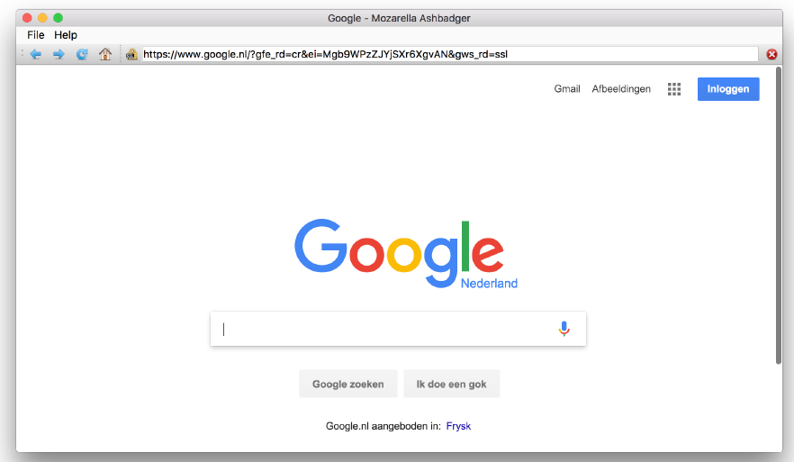
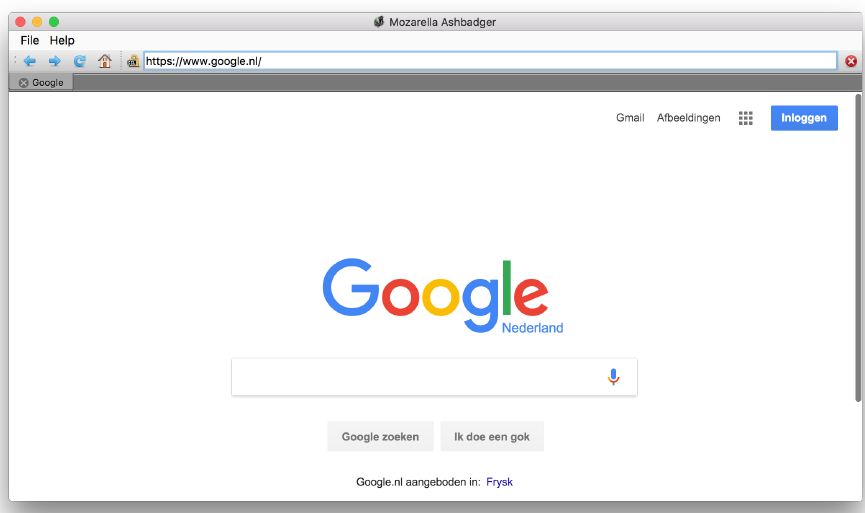
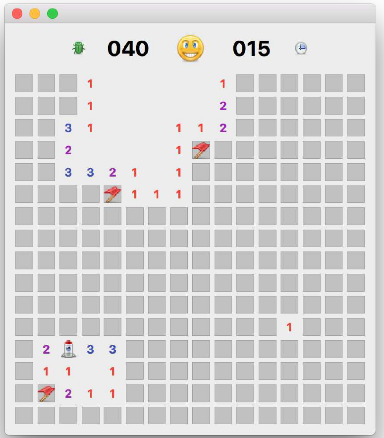
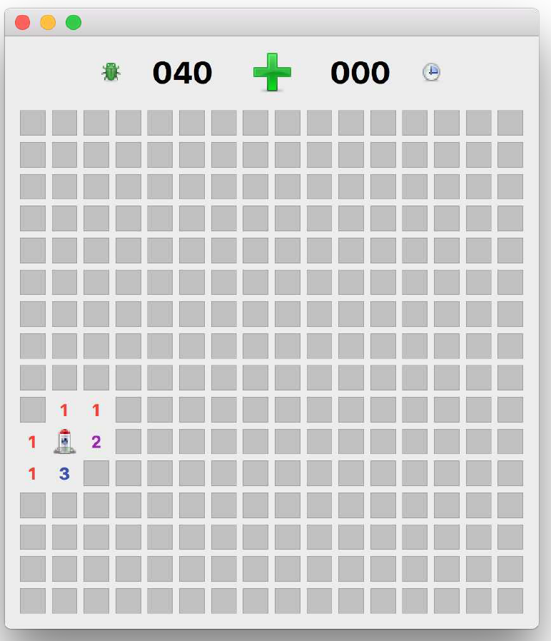
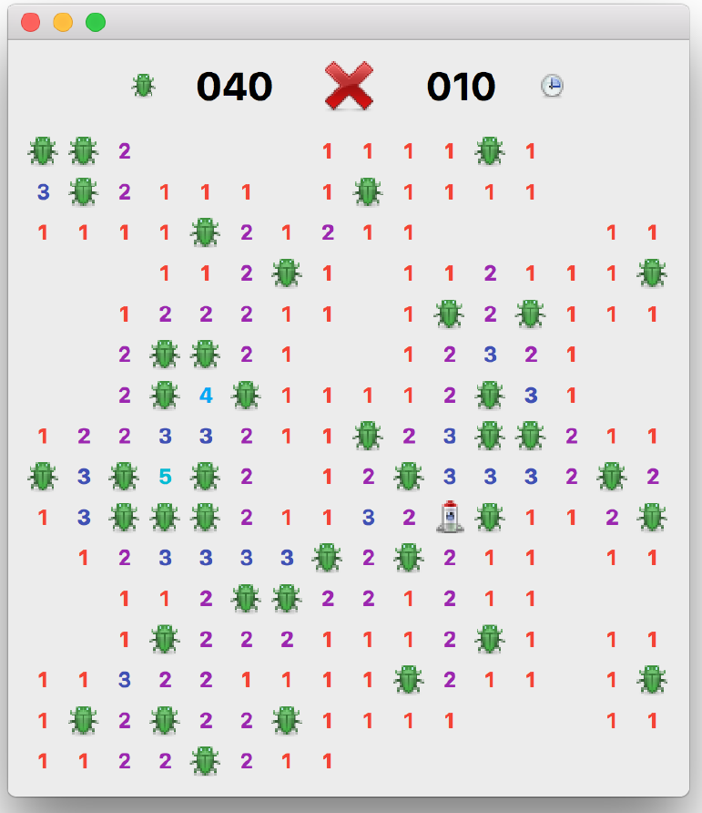

# 应用程序示例

到目前为止，您应该已经掌握了如何使用PyQt6构建简单应用程序的方法。为了展示如何将所学知识付诸实践，本章中包含了几个示例应用程序。这些应用程序功能齐全、简单易用，但在某些方面可能不够完善。您可以将它们作为灵感来源，进行拆解分析，并借此机会进行改进。请您继续阅读，我们将对每个应用程序的精彩部分进行详细讲解。

这两个应用程序的完整源代码均可下载，此外，您还可以在我的GitHub上的 [15分钟应用程序](https://github.com/pythonguis/15-minute-apps) 仓库中找到另外13个应用程序。祝您玩得愉快！

本书中还有其他一些微型应用程序的示例——例如绘图和待办事项应用程序——我鼓励您也要扩展这些应用程序，这是学习的最佳方式。

## 41. Mozzarella Ashbadger

Mozzarella Ashbadger 是网页浏览领域的最新革命！返回和前进！打印！保存文件！获取帮助！（您可能会需要它）。与其他浏览器的任何相似之处纯属巧合。



> 图269：Mozzarella Ashbadger


> 此应用程序利用了信号与槽、扩展信号和控件中介绍的功能。

Mozzarella Ashbadger 的源代码有两种形式，一种带有标签式浏览，另一种没有。添加标签会稍微增加信号处理的复杂性，因此我们首先介绍没有标签的版本。

要创建浏览器，我们需要安装一个额外的 PyQt6 组件 — PyQtWebEngine。您可以通过命令行使用 `pip` 进行安装，具体步骤如下：

```bash
pip3 install pyqt6-webengine
```

### 源代码

无标签浏览器的完整源代码包含在本书的下载内容中。浏览器代码的文件名为 `browser.py` 。

```bash
python3 browser.py
```

> 🚀 **运行它吧！** 在开始编写代码之前，请先探索 Mozzarella Ashbadger 的界面和功能。

### 浏览器控件

浏览器的核心是 `QWebEngineView`，我们从 `QtWebEngineWidgets` 导入它。它提供了一个完整的浏览器窗口，该窗口负责滑块下载页面的渲染。以下是 PyQt6 中使用网页浏览器控件所需的最低限度代码。

*Listing 264. app/browser_skeleton.py*

```python
import sys

from PyQt6.QtCore import QUrl
from PyQt6.QtWebEngineWidgets import QWebEngineView
from PyQt6.QtWidgets import QApplication, QMainWindow


class MainWindow(QMainWindow):
    def __init__(self):
        super().__init__()
        
        self.browser = QWebEngineView()
        self.browser.setUrl(QUrl("https://www.google.com"))
        
        self.setCentralWidget(self.browser)
        
        self.show()
        
        
app = QApplication(sys.argv)
window = MainWindow()

app.exec()
```

如果您稍微点击一下，您会发现浏览器表现得像预期的一样——链接正常工作，您可以与页面互动。然而，您也会注意到一些你习以为常的东西缺失了——比如地址栏、控制按钮或任何类型的界面。这使得使用起来有点棘手。

让我们把这个简陋的浏览器改造成一个稍微实用一点的工具吧！

### 路径

为了更方便地处理界面图标，我们可以首先定义一个“使用相对路径”（参见前面的章节）。它为 `icons` 数据文件和一个 `icon` 方法定义了一个单一的文件夹位置，用于创建图标的路径。这使我们能够使用 `Paths.icon()` 来加载浏览器界面的图标。

*Listing 265. app/paths.py*

```python
import os


class Paths:
    
    base = os.path.dirname(__file__)
    icons = os.path.join(base, "icons")
    
    # 文件加载器.
    @classmethod
    def icon(cls, filename):
        return os.path.join(cls.icons, filename)
```

请您将它与我们的浏览器保存在同一文件夹中，它可以导入为：

*Listing 266. app/browser.py*

```python
from paths import Paths
```

### 导航

现在这些都已就绪，我们可以添加一些界面控件，例如在 `QToolbar` 上使用一系列的 `QActions` 。我们将这些定义添加到 `QMainWindow` 的 `__init__` 块中。我们使用我们的 `Paths.icon()` 方法使用相对路径加载文件。

*Listing 267. app/browser.py*

```python
        navtb = QToolBar("Navigation")
        navtb.setIconSize(QSize(16, 16))
        self.addToolBar(navtb)
        
        back_btn = QAction(
            QIcon(Paths.icon("arrow-180.png")), "Back", self
        )
        back_btn.setStatusTip("Back to previous page")
        back_btn.triggered.connect(self.browser.back)
        navtb.addAction(back_btn)
```

`QWebEngineView` 包括用于前进、后退和重新加载导航的槽，我们可以将其直接连接到我们的动作的 `.triggered` 信号。

我们为剩余的控件使用相同的 `QAction` 结构。

*Listing 268. app/browser.py*

```python
        next_btn = QAction(
            QIcon(Paths.icon("arrow-000.png")), "Forward", self
        )
        next_btn.setStatusTip("Forward to next page")
        next_btn.triggered.connect(self.browser.forward)
        navtb.addAction(next_btn)
        
        reload_btn = QAction(
            QIcon(Paths.icon("arrow-circle-315.png")),
            "Reload",
            self,
        )
        reload_btn.setStatusTip("Reload page")
        reload_btn.triggered.connect(self.browser.reload)
        navtb.addAction(reload_btn)
        
        home_btn = QAction(QIcon(Paths.icon("home.png")), "Home", self)
        home_btn.setStatusTip("Go home")
        home_btn.triggered.connect(self.navigate_home)
        navtb.addAction(home_btn)
```

请注意，虽然前进、后退和重新加载可以使用内置槽，但导航主页按钮需要自定义槽函数。该槽函数在我们的 `QMainWindow` 类中定义，只需将浏览器的URL设置为谷歌主页即可。请注意，URL必须作为 `QUrl` 对象传递。

*Listing 269. app/browser.py*

```python
    def navigate_home(self):
        self.browser.setUrl(QUrl("http://www.google.com"))
```


> 挑战
>
> 尝试将主页导航位置设置为可配置。您可以创建一个带输入字段的 `QDialog` 对话框。

任何一款合格的网页浏览器都必须具备地址栏，并且需要提供一种方式来停止导航——无论是由于误操作，还是页面加载过慢。

*Listing 270. app/browser.py*

```python
        self.httpsicon = QLabel() # 是的，就像这样!
        self.httpsicon.setPixmap(QPixmap(Paths.icon("lock-nossl.png")))
        navtb.addWidget(self.httpsicon)
        
        self.urlbar = QLineEdit()
        self.urlbar.returnPressed.connect(self.navigate_to_url)
        navtb.addWidget(self.urlbar)
        
        stop_btn = QAction(
            QIcon(Paths.icon("cross-circle.png")), "Stop", self
        )
        stop_btn.setStatusTip("Stop loading current page")
        stop_btn.triggered.connect(self.browser.stop)
        navtb.addAction(stop_btn)
```

与之前一样，`QWebEngineView` 上提供了“停止”功能，我们只需将停止按钮的 `.triggered` 信号连接到现有的槽即可。但是，URL 栏的其他功能必须单独处理。

首先，我们添加一个 `QLabel` 来保存我们的 SSL 或非 SSL 图标，以指示页面是否安全。接下来，我们添加一个 URL 栏，它只是一个 `QLineEdit`。为了触发在输入（按回车键）时在栏中加载 URL，我们连接到控件上的 `.returnPressed` 信号，以驱动一个自定义槽函数，触发导航到指定的 URL。

*Listing 271. app/browser.py*

```python
    def navigate_to_url(self): # 未接收 URL
        q = QUrl(self.urlbar.text())
        if q.scheme() == "":
            q.setScheme("http")
            
        self.browser.setUrl(q)
```

我们还希望 URL 条能够根据页面变化进行更新。为此，我们可以使用 `QWebEngineView` 的 `.urlChanged` 和 `.loadFinished` 信号。我们在 `__init__` 块中按照以下方式设置了信号的连接：

*Listing 272. app/browser.py*

```python
        self.browser.urlChanged.connect(self.update_urlbar)
        self.browser.loadFinished.connect(self.update_title)
```

然后，我们定义这些信号的目标槽函数。第一个函数用于更新 URL 栏，它接受一个 `QUrl` 对象，并确定这是 `http` 还是 `https` URL，然后使用此信息设置 SSL 图标。


> 这是一种非常糟糕的测试连接是否“安全”的方法。要正确地进行测试，我们应该执行证书验证。

`QUrl` 被转换为字符串，URL 栏也更新为该值。请注意，我们还将光标位置设置回行首，以防止`QLineEdit` 控件滚动到行尾。

*Listing 273. app/browser.py*

```python
    def update_urlbar(self, q):
        
        if q.scheme() == "https":
            # 安全挂锁图标
            self.httpsicon.setPixmap(
                QPixmap(Paths.icon("lock-ssl.png"))
            )
            
        else:
            # 不安全的挂锁图标
            self.httpsicon.setPixmap(
                QPixmap(Paths.icon("lock-nossl.png"))
            )
            
        self.urlbar.setText(q.toString())
        self.urlbar.setCursorPosition(0)
```

另外，将应用程序窗口的标题更新为当前页面的标题也是一个不错的细节。我们可以使用 `browser.page().title()` 方法获取此信息，该方法返回当前加载的网页中 `<title></title>` 标签的内容。

*Listing 274. app/browser.py*

```python
    def update_title(self):
        title = self.browser.page().title()
        self.setWindowTitle("%s - Mozzarella Ashbadger" % title)
```

### 文件操作

使用 `self.menuBar().addMenu(“&File”)` 可以创建一个标准的“文件”菜单，将 F 键分配为 Alt 快捷键（与通常一样）。获得菜单对象后，我们可以将 `QAction` 对象分配给该对象以创建条目。我们在这里创建了两个基本条目，用于打开和保存 HTML 文件（来自本地磁盘）。这两个条目都需要自定义槽函数。

*Listing 275. app/browser.py*

```python
        file_menu = self.menuBar().addMenu("&File")
    
        open_file_action = QAction(
            QIcon(Paths.icon("disk--arrow.png")),
            "Open file...",
            self,
        )
        open_file_action.setStatusTip("Open from file")
        open_file_action.triggered.connect(self.open_file)
        file_menu.addAction(open_file_action)
        
        save_file_action = QAction(
            QIcon(Paths.icon("disk--pencil.png")),
            "Save Page As...",
            self,
        )
        save_file_action.setStatusTip("Save current page to file")
        save_file_action.triggered.connect(self.save_file)
        file_menu.addAction(save_file_action)
```

打开文件的槽函数使用内置的 `QFileDialog.getOpenFileName()` 函数创建一个文件打开对话框并获取一个名称。我们默认将名称限制为与 `*.htm` 或 `*.html` 匹配的文件。

我们使用标准的 Python 函数将文件读取到一个名为 `html` 的变量中，然后使用`.setHtml()` 将 HTML 内容加载到浏览器中。

*Listing 276. app/browser.py*

```python
    def open_file(self):
        filename, _ = QFileDialog.getOpenFileName(
            self,
            "Open file",
            "",
            "Hypertext Markup Language (*.htm *.html);;"
            "All files (*.*)",
        )
        
        if filename:
            with open(filename, "r") as f:
                html = f.read()
                
            self.browser.setHtml(html)
            self.urlbar.setText(filename)
```

同样地，为了保存当前页面的 HTML，我们使用内置的 `QFileDialog.getSaveFileName()` 方法获取文件名。不过这次我们通过 `self.browser.page().toHtml()` 获取 HTML。

这是一个异步方法，这意味着我们不会立即收到 HTML。相反，我们必须传递一个回调方法，该方法将在 HTML 准备就绪后接收它。在这里，我们创建了一个简单的 `writer` 函数，它使用本地范围中的文件名来处理它。

*Listing 277. app/browser.py*

```python
    def save_file(self):
        filename, _ = QFileDialog.getSaveFileName(
            self,
            "Save Page As",
            "",
            "Hypertext Markup Language (*.htm *html);;"
            "All files (*.*)",
        )
        
        if filename:
            # 定义回调方法以处理写入操作.
            def writer(html):
                with open(filename, "w") as f:
                    f.write(html)
                    
            self.browser.page().toHtml(writer)
```

### 打印

我们可以使用之前的方法在“文件”菜单中添加打印选项。同样，这需要一个自定义槽函数来执行打印操作。

*Listing 278. app/browser.py*

```python
        print_action = QAction(
            QIcon(Paths.icon("printer.png")), "Print...", self
        )
        print_action.setStatusTip("Print current page")
        print_action.triggered.connect(self.print_page)
        file_menu.addAction(print_action)
        
        # 创建我们的系统打印机实例.
        self.printer = QPrinter()
```

Qt 提供了一个基于 `QPrinter` 对象的完整打印框架，您可以在其上绘制要打印的页面。为了启动打印过程，我们首先为用户打开一个 `QPrintDialog`。这允许用户选择目标打印机并配置打印设置。

我们在 `__init__`中创建了 `QPrinter` 对象，并将其存储为 `self.printer`。在我们的打印处理方法中，我们将此打印机传递给 `QPrintDialog`，以便其可以被配置。如果对话框被接受，我们将（现在已配置的）打印机对象传递给 `self.browser.page().print` 以触发打印。

*Listing 279. app/browser.py*

```python
def print_page(self):
    page = self.browser.page()
    
    def callback(*args):
        pass
    
    dlg = QPrintDialog(self.printer)
    dlg.accepted.connect(callback)
    if dlg.exec() == QDialog.DialogCode.Accepted:
        page.print(self.printer, callback)
```

请注意，`.print` 方法还接受第二个参数——一个回调函数，该函数会接收打印操作的结果。这允许您在打印操作完成后显示一条通知，但在此示例中，我们只是静默地忽略了回调函数。

### 帮助

最后，为了完成标准界面，我们可以添加一个“帮助”菜单。它与之前一样，定义为两个自定义槽函数，一个用于显示“关于”对话框，另一个用于加载包含更多信息的“浏览器页面”。

*Listing 280. app/browser.py*

```python
        help_menu = self.menuBar().addMenu("&Help")
        about_action = QAction(
            QIcon(Paths.icon("question.png")),
            "About Mozzarella Ashbadger",
            self,
        )
        about_action.setStatusTip(
            "Find out more about Mozzarella Ashbadger"
        ) # 我真饿了!
        about_action.triggered.connect(self.about)
        help_menu.addAction(about_action)
        navigate_mozzarella_action = QAction(
            QIcon(Paths.icon("lifebuoy.png")),
            "Mozzarella Ashbadger Homepage",
            self,
        )
        navigate_mozzarella_action.setStatusTip(
            "Go to Mozzarella Ashbadger Homepage"
        )
        navigate_mozzarella_action.triggered.connect(
            self.navigate_mozzarella
        )
        help_menu.addAction(navigate_mozzarella_action)
```

我们定义了两个方法，作为“帮助”菜单信号的槽。第一个 `navigate_mozzarella` 打开一个页面，提供有关浏览器（或在本书的本例中）的更多信息。第二个创建并执行一个自定义的 `QDialog` 类 `AboutDialog`，我们将在下面进行定义。

*Listing 281. app/browser.py*

```python
    def navigate_mozzarella(self):
        self.browser.setUrl(QUrl("https://www.pythonguis.com/"))
        
    def about(self):
        dlg = AboutDialog()
        dlg.exec()
```

关于对话框的定义如下。该结构与本书前面介绍的结构相似，使用 `QDialogButtonBox` 和相关信号来处理用户输入，并使用一系列 `QLabels` 来显示应用程序信息和徽标。

这里唯一的技巧是将所有元素添加到布局中，然后在单个循环中遍历它们，将对齐方式设置为居中。这样可以避免在各个部分中重复设置。

*Listing 282. app/browser.py*

```python
class AboutDialog(QDialog):
    def __init__(self):
        super().__init__()
        
        QBtn = QDialogButtonBox.StandardButton.Ok # 不取消
        self.buttonBox = QDialogButtonBox(QBtn)
        self.buttonBox.accepted.connect(self.accept)
        self.buttonBox.rejected.connect(self.reject)
        
        layout = QVBoxLayout()
        
        title = QLabel("Mozzarella Ashbadger")
        font = title.font()
        font.setPointSize(20)
        title.setFont(font)
        
        layout.addWidget(title)
        
        logo = QLabel()
        logo.setPixmap(QPixmap(Paths.icon("ma-icon-128.png")))
        layout.addWidget(logo)
        
        layout.addWidget(QLabel("Version 23.35.211.233232"))
        layout.addWidget(QLabel("Copyright 2015 Mozzarella Inc."))
        
        for i in range(0, layout.count()):
            layout.itemAt(i).setAlignment(Qt.AlignmentFlag.AlignHCenter)
            
        layout.addWidget(self.buttonBox)
        
        self.setLayout(layout)
```

### 标签式浏览



> 图270：标签化的Mozzarella Ashbadger

### 源代码

本书的下载内容中包含了带标签页浏览器的完整源代码。浏览器代码的文件名为 `browser_tabs.py`。

> 🚀 **运行它吧！** 在开始编写代码之前，请先探索标签化的 Mozzarella Ashbadger 的界面和功能。

### 创建一个 `QTabWidget`

使用 `QTabWidget` 可以轻松地为浏览器添加标签页界面。它为多个控件（在本例中为 `QWebEngineView` 控件）提供了一个简单的容器，并内置了用于在控件之间切换的标签页界面。

我们在这里使用的两个自定义设置是 `.setDocumentMode(True)`，它在 macOS 上提供一个类似 Safari 的界面，以及 `.setTabsClosable(True)`，它允许用户在应用程序中关闭标签页。

我们还将 `QTabWidget` 信号 `tabBarDoubleClicked`、`currentChanged` 和 `tabCloseRequested `连接到自定义槽方法，以处理这些行为。

*Listing 283. app/browser_tabs.py*

```python
        self.tabs = QTabWidget()
        self.tabs.setDocumentMode(True)
        self.tabs.tabBarDoubleClicked.connect(self.tab_open_doubleclick)
        self.tabs.currentChanged.connect(self.current_tab_changed)
        self.tabs.setTabsClosable(True)
        self.tabs.tabCloseRequested.connect(self.close_current_tab)
        
        self.setCentralWidget(self.tabs)
```

这三种槽方法都接受一个 `i`（索引）参数，该参数指示信号来自哪个选项卡（按顺序）。

我们双击标签栏中的空白处（由索引 `-1`表示）来触发新标签的创建。要删除标签，我们直接使用索引来删除控件（以及标签），并进行简单的检查以确保至少有 2 个标签——关闭最后一个标签会导致您无法打开新标签。

`current_tab_changed` 处理程序使用 `self.tabs.currentWidget()` 结构来访问当前活动标签页的控件（`QWebEngineView` 浏览器），然后使用它来获取当前页面的 URL。

*Listing 284. app/browser_tabs.py*

```python
    def tab_open_doubleclick(self, i):
        if i == -1: # N点击后没有选项卡
            self.add_new_tab()
   
    def current_tab_changed(self, i):
        qurl = self.tabs.currentWidget().url()
        self.update_urlbar(qurl, self.tabs.currentWidget())
        self.update_title(self.tabs.currentWidget())  
        
    def close_current_tab(self, i):
        if self.tabs.count() < 2:
            return

        self.tabs.removeTab(i)
```

*Listing 285. app/browser_tabs.py*

```python
    def add_new_tab(self, qurl=None, label="Blank"):
        
        if qurl is None:
            qurl = QUrl("")
           
        browser = QWebEngineView()
        browser.setUrl(qurl)
        i = self.tabs.addTab(browser, label)
        
        self.tabs.setCurrentIndex(i)
```

### 信号和槽的变化

虽然 `QTabWidget` 和相关信号的设置很简单，但在浏览器槽方法中，事情就变得稍微复杂一些了。

以前我们只有一个 `QWebEngineView`，现在有多个视图，每个视图都有自己的信号。如果处理隐藏标签的信号，事情就会变得一团糟。例如，处理 `loadCompleted` 信号的槽必须检查源视图是否在可见标签中。

我们可以使用发送附加数据信号的技巧来实现这一点。在标签式浏览器中，我们使用 `lambda` 样式语法来实现这一点。

以下是在创建新的 `QWebEngineView` 时，在 `add_new_tab` 函数中实现此功能的示例：

*Listing 286. app/browser_tabs.py*

```python
        # 更复杂了！我们只希望在URL来自正确标签页时进行更新。
        browser.urlChanged.connect(
            lambda qurl, browser=browser: self.update_urlbar(
                qurl, browser
            )
        )
        
        browser.loadFinished.connect(
            lambda _, i=i, browser=browser: self.tabs.setTabText(
                i, browser.page().title()
            )
        )
```

如您所见，我们将 `lambda` 设置为 `urlChanged` 信号的槽，接受该信号发送的 `qurl` 参数。我们将最近创建的 `browser` 对象添加到 `update_urlbar` 函数中。

结果是，每当这个 `urlChanged` 信号触发时，`update_urlbar` 将同时收到新 URL 和它来自的浏览器。在槽方法中，我们可以检查以确保信号的来源与当前可见的浏览器相匹配，如果不匹配，我们只需丢弃该信号即可。

*Listing 287. app/browser_tabs.py*

```python
    def update_urlbar(self, q, browser=None):
        if browser != self.tabs.currentWidget():
            # 如果该信号不是来自当前选项卡，则忽略它
            return
        
        if q.scheme() == "https":
            # 安全挂锁图标
            self.httpsicon.setPixmap(
                QPixmap(Paths.icon("lock-ssl.png"))
            )
            
        else:
            # 不安全的挂锁图标
            self.httpsicon.setPixmap(
                QPixmap(Paths.icon("lock-nossl.png"))
            )
           
        self.urlbar.setText(q.toString())
        self.urlbar.setCursorPosition(0)
```

### 继续深入

现在您可以探索浏览器标签页版本的其余源代码，请特别注意 `self.tabs.currentWidget()` 的使用以及通过信号传递额外数据。这是您所学知识的一个很好的实际应用案例，所以尝试一下，看看您能否以有趣的方式打破/改进它。


> 挑战
>
> 您可能想尝试添加一些额外功能——
>
> - 书签（或收藏夹）——您可以将这些存储在一个简单的文本文件中，并在菜单中显示它们
> - 网站图标（Favicons）——这些小小的网站图标，在标签页上看起来会非常棒。
> - 查看源代码 ——添加一个菜单选项以查看页面源代码。
> - 在新标签页中打开 ——添加右键点击上下文菜单，或键盘快捷键，以在新标签页中打链接

## 42. Moonsweeper

探索神秘的 Q’tee 卫星，但不要太靠近外星人！

Moonsweeper 是一款单人解谜游戏。游戏的目标是探索您着陆的太空火箭周围的区域，同时避免过于靠近致命的 B’ug 外星人。您可靠的计数器会告诉你附近有多少 B’ug。


> 推荐阅读
>
> 此应用程序利用了信号与槽以及事件中的功能。



> 图271：Moonsweeper

这是一个以扫雷游戏为原型的简单单人探索游戏，其中您必须揭开所有方块而不触发隐藏的地雷。此实现使用自定义的 `QWidget` 对象表示方块，每个方块单独保存其状态，包括是否为地雷、当前状态以及相邻地雷的数量。在此版本中，地雷被替换为外星虫子（B’ug），但它们也可以是任何其他物体。

在许多扫雷变体中，初始回合被视为安全回合——如果您在第一次点击时触碰到地雷，它会被移动到其他地方。在这里我们稍微作弊一下，将玩家的首次操作固定在非地雷位置。这样做可以避免因首次操作错误而需要重新计算相邻格子的情况。我们可以将此解释为“火箭周围的初始探索”，使其听起来完全合理。


> 挑战！
>
> 如果您想实现这一点，可以在位置上捕获第一次点击，然后在处理点击之前生成地雷/相邻位置，但不包括您的位置。您需要让自定义控件访问父窗口对象

### 源代码

Moonsweeper 游戏的完整源代码包含在本书的下载内容中。游戏文件以 `minesweeper.py` 的名称保存。

```bash
python3 minesweeper.py
```

### 路径

为了更方便地处理界面图标，我们可以首先定义一个“使用相对路径”（参见前面的章节）。它为 `icons` 数据文件和一个 `icon` 方法定义了一个单一的文件夹位置，用于创建图标的路径。这使我们能够使用 `Paths.icon()` 来加载游戏界面的图标。

*Listing 288. app/paths.py*

```python
import os


class Paths:
    
    base = os.path.dirname(__file__)
    icons = os.path.join(base, "icons")
    
    # 文件加载器.
    @classmethod
    def icon(cls, filename):
        return os.path.join(cls.icons, filename)
```

与我们的 Moonsweeper 应用程序保存在同一文件夹中，它可以被导入为：

*Listing 289. app/moonsweeper.py*

```python
from paths import Paths
```

### 图标与颜色

现在路径已经定义，我们可以使用它们来加载一些图标，用于我们的游戏——一个虫子、一面旗帜、一枚火箭和一个时钟。我们还定义了一组颜色用于界面状态，以及一系列状态标志来跟踪游戏的进展——每个标志都关联一个笑脸图标。

*Listing 290. app/moonsweeper.py*

```python
IMG_BOMB = QImage(Paths.icon("bug.png"))
IMG_FLAG = QImage(Paths.icon("flag.png"))
IMG_START = QImage(Paths.icon("rocket.png"))
IMG_CLOCK = QImage(Paths.icon("clock-select.png"))

NUM_COLORS = {
    1: QColor("#f44336"),
    2: QColor("#9C27B0"),
    3: QColor("#3F51B5"),
    4: QColor("#03A9F4"),
    5: QColor("#00BCD4"),
    6: QColor("#4CAF50"),
    7: QColor("#E91E63"),
    8: QColor("#FF9800"),
}

STATUS_READY = 0
STATUS_PLAYING = 1
STATUS_FAILED = 2
STATUS_SUCCESS = 3

STATUS_ICONS = {
    STATUS_READY: Paths.icon("plus.png"),
    STATUS_PLAYING: Paths.icon("smiley.png"),
    STATUS_FAILED: Paths.icon("cross.png"),
    STATUS_SUCCESS: Paths.icon("smiley-lol.png"),
}
```

### 游戏区域

Moonsweeper 的游戏区域是一个 NxN 的网格，其中包含固定数量的矿井。我们使用的网格尺寸和矿井数量来自 Windows 版本《扫雷》的默认值。所使用的值如表所示：

*Table 14. Table Dimensions and mine counts*

| 难度等级 | 尺寸    | 地雷数量 |
| -------- | ------- | -------- |
| 简单     | 8 x 8   | 10       |
| 中等     | 16 x 16 | 40       |
| 困难     | 24 x 24 | 99       |

我们将这些值存储为文件顶部定义的常量 `LEVELS`。由于所有游戏区域均为正方形，因此只需存储一次值（8、16或24）。

*Listing 291. app/minesweeper.py*

```python
LEVELS = [("Easy", 8, 10), ("Medium", 16, 40), ("Hard", 24, 99)]
```

游戏网格可以以多种方式表示，例如使用一个二维的“列表的列表”来表示游戏位置的不同状态（地雷、已揭示、已标记）。

然而，在我们的实现中，我们将采用面向对象的方法，其中地图上的每个位置都包含自身相关的所有数据。进一步而言，我们可以让这些对象各自负责绘制自身。在Qt中，我们可以通过继承`QWidget` 类，并实现自定义绘制函数来实现这一点。

在介绍这些自定义控件的外观之前，我们将先介绍它们的结构和行为。由于我们的瓷砖对象是 `QWidget` 的子类，因此我们可以像其他控件一样对它们进行布局。为此，我们需要设置一个 `QGridLayout`。

*Listing 292. app/minesweeper.py*

```python
        self.grid = QGridLayout()
        self.grid.setSpacing(5)
        self.grid.setSizeConstraint(QLayout.SizeConstraint.SetFixedSize)
```

接下来，我们需要设置游戏区域，创建位置图块控件并将其添加到网格中。关卡的初始设置在自定义方法中定义，该方法从 `LEVELS` 读取数据，并将一些变量分配给窗口。窗口标题和地雷计数器更新后，网格的设置就开始了。

*Listing 293. app/minesweeper.py*

```python
    def set_level(self, level):
        self.level_name, self.b_size, self.n_mines = LEVELS[level]
        
        self.setWindowTitle("Moonsweeper - %s" % (self.level_name))
        self.mines.setText("%03d" % self.n_mines)
        
        self.clear_map()
        self.init_map()
        self.reset_map()
```

接下来我们将介绍设置功能。

我们这里使用了一个自定义的 `Pos` 类，我们稍后会详细介绍它。目前，您只需要知道它包含地图中相关位置的所有相关信息——例如，是否为地雷、是否已被揭示、是否被标记以及附近地雷的数量。

每个 `Pos` 对象还有 3 个自定义信号 `clicked`、`revealed` 和 `expandable`，我们将其连接到自定义槽方法。最后，我们调用 `resize` 来调整窗口的大小，以适应新内容。请注意，这实际上只有在窗口缩小时才需要——窗口会自动扩大。

*Listing 294. app/minesweeper.py*

```python
    def init_map(self):
        # 在地图上添加位置
        for x in range(0, self.b_size):
            for y in range(0, self.b_size):
                w = Pos(x, y)
                self.grid.addWidget(w, y, x)
                # 将信号连接到滑块扩展件.
                w.clicked.connect(self.trigger_start)
                w.revealed.connect(self.on_reveal)
                w.expandable.connect(self.expand_reveal)
                
            # 将调整大小操作放入事件队列，并在操作完成前将控制权交还给Qt.
            QTimer.singleShot(0, lambda: self.resize(1, 1)) #1
```

> 1. 单次定时器（`singleShot timer`）用于确保在Qt检测到新内容后再执行窗口大小调整。通过使用定时器，我们可以确保控制权在窗口大小调整发生前返回给Qt。

我们还需要实现 `init_map` 函数的逆函数，以从地图中移除瓷砖对象。在从较高层级移动到较低层级时，移除瓷砖将是必要的。在这里我们可以稍微聪明一点，只添加/移除那些达到正确尺寸所需的瓦片。但是，既然我们已经有了一个函数可以将所有瓦片添加到正确尺寸，我们可以稍微作弊一下。


> 挑战
>
> 更新此代码以添加/移除必要的瓷砖，以调整新关卡的尺寸。

请注意，我们使用 `self.grid.removeItem(c)` 将项目从网格中删除，并清除父级 `c.widget().setParent(None)`。第二步是必要的，因为添加项目时会将父级窗口指定为父级。仅删除它们会使它们漂浮在布局外的窗口中。

*Listing 295. app/minesweeper.py*

```python
    def clear_map(self):
        # 从地图上移除所有位置，直至达到最大容量.
        for x in range(0, LEVELS[-1][1]): #1
            for y in range(0, LEVELS[-1][1]):
                c = self.grid.itemAtPosition(y, x)
                if c: #2
                    c.widget().close()
                    self.grid.removeItem(c)
```

> 1. 为了确保我们能够处理所有尺寸的地图，我们采用最高级别的尺寸。
> 2. 如果网格中该位置没有内容，我们可以跳过它。

现在我们已经将位置瓷砖对象的网格布局到位，可以开始创建游戏板的初始条件。这个过程相当复杂，因此被分解为多个函数。我们将其命名为 `_reset`（前缀下划线是表示私有函数的约定，不供外部使用）。主函数 `reset_map` 依次调用这些函数来进行设置。

流程如下 

1. 移除所有地雷（并重置数据）并清空场地。
2. 在场地中添加新的地雷。
3. 计算每个位置相邻地雷的数量。
4. 添加起始标记（火箭）并触发初始探索。
5. 重置计时器。

*Listing 296. app/minesweeper.py*

```python
    def reset_map(self):
        self._reset_position_data()
        self._reset_add_mines()
        self._reset_calculate_adjacency()
        self._reset_add_starting_marker()
        self.update_timer()
```

以下将依次详细描述步骤1至5，并附上各步骤的代码.

第一步是重置地图上每个位置的数据。我们遍历棋盘上的每个位置，在每个点上调用控件的 `.reset()` 方法。`.reset()` 方法的代码在我们的自定义 `Pos` 类中定义，我们稍后会详细探讨。目前只需知道它会清除地雷、旗帜，并将位置设置为未揭示状态即可。

*Listing 297. app/minesweeper.py*

```python
    def _reset_position_data(self):
        # 清除所有地雷位置
        for x in range(0, self.b_size):
            for y in range(0, self.b_size):
                w = self.grid.itemAtPosition(y, x).widget()
                w.reset()
```

现在所有位置均为空，我们可以开始将地雷添加到地图了。地雷的最大数量 `n_mines` 由关卡设置定义，如前所述。

*Listing 298. app/minesweeper.py*

```python
    def _reset_add_mines(self):
        # 添加地雷位置
        positions = []
        while len(positions) < self.n_mines:
            x, y = (
                random.randint(0, self.b_size - 1),
                random.randint(0, self.b_size - 1),
            )
            if (x, y) not in positions:
                w = self.grid.itemAtPosition(y, x).widget()
                w.is_mine = True
                positions.append((x, y))
               
            # 计算终局条件
            self.end_game_n = (self.b_size * self.b_size) - (
                self.n_mines + 1
            )
            return positions
```

地雷就位后，我们可以计算每个位置的“邻近”数——即该点周围 3x3 网格内地雷的数量。自定义函数 `get_surrounding` 仅返回给定x和y位置周围的这些位置。我们统计其中 `is_mine == True`（即为地雷）的数量并存储


> 预计算
>
> 通过这种方式预计算相邻计数，有助于简化后续的显示逻辑。

*Listing 299. app/minesweeper.py*

```python
    def _reset_calculate_adjacency(self):
        def get_adjacency_n(x, y):
            positions = self.get_surrounding(x, y)
            return sum(1 for w in positions if w.is_mine)
        
        # 为位置添加相邻关系
        for x in range(0, self.b_size):
            for y in range(0, self.b_size):
                w = self.grid.itemAtPosition(y, x).widget()
                w.adjacent_n = get_adjacency_n(x, y)
```

起始标记用于确保第一步总是有效的。这通过对网格空间进行暴力搜索来实现，即随机尝试不同位置，直到找到一个不是地雷的位置。由于我们不知道需要尝试多少次，因此需要将此过程包裹在一个循环中。

一旦找到该位置，我们将它标记为起始位置，然后触发对所有周边位置的探索。我们退出循环，并重置就绪状态。

*Listing 300. app/minesweeper.py*

```python
    def _reset_add_starting_marker(self):
        # 放置起始标记.
        
        # 设置初始状态（.click 功能需要此设置）
        self.update_status(STATUS_READY)
        
        while True:
            x, y = (
                random.randint(0, self.b_size - 1),
                random.randint(0, self.b_size - 1),
            )
            w = self.grid.itemAtPosition(y, x).widget()
            # 我们不想从地雷上开始.
            if not w.is_mine:
                w.is_start = True
                w.is_revealed = True
                w.update()
                
                # 如果这些位置也不是地雷，则显示所有相关位置.
                for w in self.get_surrounding(x, y):
                    if not w.is_mine:
                        w.click()
                       
                break
                      
        # 初始点击后将状态重置为就绪.
        self.update_status(STATUS_READY)
```



> 图272：火箭的初步探索

### 位置瓷砖

如前所述，我们设计了游戏结构，使每个方块的位置都保存自己的状态信息。这意味着 `Pos` 对象处于理想的位置，可以处理与自身状态相关的交互反应的游戏逻辑。换句话说，这就是奥妙所在之处。

由于 `Pos` 类相对复杂，这里将其分解为主要主题，并依次进行讨论。初始化设置 `__init__` 块非常简单，接受 `x` 和 `y` 坐标并将其存储在对象中。`Pos` 坐标一旦创建就不会改变。

完成设置后，我们调用 `.reset()` 函数将所有对象属性重置为默认值，即零值。这将标记该地雷为非起始位置、非地雷、未揭示且未标记。我们还重置了相邻计数。

*Listing 301. app/minesweeper.py*

```python
class Pos(QWidget):
    
    expandable = pyqtSignal(int, int)
    revealed = pyqtSignal(object)
    clicked = pyqtSignal()
    
    def __init__(self, x, y):
        super().__init__()
        self.setFixedSize(QSize(20, 20))
        self.x = x
        self.y = y
        self.reset()

    def reset(self):
        self.is_start = False
        self.is_mine = False
        self.adjacent_n = 0
        self.is_revealed = False
        self.is_flagged = False
        
        self.update()
```

游戏玩法以鼠标与游戏场中的方块的交互为中心，因此检测鼠标点击并做出反应是至关重要的。在 Qt 中，我们通过检测 `mouseReleaseEvent` 来捕获鼠标点击。为了对我们的自定义 `Pos` 控件执行此操作，我们在类上定义了一个处理程序。该处理程序接收包含发生事件信息的 `QMouseEvent`。在此情况下，我们仅关注鼠标释放操作是来自左键还是右键。

对于左键点击，我们检查该方块是否已被标记或已揭开。如果它符合其中一种情况，我们将忽略该点击——使标记过的方块“安全”，无法被意外点击。如果方块未被标记，我们只需调用 `.click()` 方法（见后文）。

对于右键点击未显示的瓷砖，我们调用我们的 `.toggle_flag()` 方法来切换标志的状态。

*Listing 302. app/minesweeper.py*

```python
    def mouseReleaseEvent(self, e):
        if (
            e.button() == Qt.MouseButton.RightButton
            and not self.is_revealed
        ):
            self.toggle_flag()
            
        elif e.button() == Qt.MouseButton.LeftButton:
            # 阻止点击标记的雷区.
            if not self.is_flagged and not self.is_revealed:
                self.click()
```

由鼠标释放事件处理程序调用的方法如下所示：

`.toggle_flag` 处理程序仅将 `.is_flagged` 设置为其自身的反转值（`True` 变为 `False`，`False` 变为 `True`），从而实现其开关状态的切换。注意，我们必须调用 `.update()` 方法以强制重新绘制，因为状态已发生变化。我们还发出自定义的 `.clicked` 信号，该信号用于启动计时器，因为放置标志也应算作启动，而不仅仅是显示一个方块。

`.click()` 方法处理鼠标左键点击，并触发显示正方形。如果该位置相邻的地雷数量为零，则触发 `.expandable` 信号，开始自动扩展已探索区域（见下文）。最后，我们再次发出 `.clicked` 信号，以指示游戏开始。

最后，`.reveal()` 方法检查该方块是否已经显示，如果没有，则将 `.is_revealed` 设置为 `True`。再次调用 `.update()` 以触发控件的重绘。

可选的 `.revealed` 信号仅用于游戏结束时全地图的揭示。由于每次揭示都会触发进一步的查找，以查找哪些瓷砖也可以揭示，因此揭示整个地图会产生大量冗余的回调。通过在此处抑制信号，我们可以避免这种情况。

*Listing 303. app/minesweeper.py*

```python
    def toggle_flag(self):
        self.is_flagged = not self.is_flagged
        self.update()
        
        self.clicked.emit()
        
    def click(self):
        self.reveal()
        if self.adjacent_n == 0:
            self.expandable.emit(self.x, self.y)
           
        self.clicked.emit()
        
    def reveal(self, emit=True):
        if not self.is_revealed:
            self.is_revealed = True
            self.update()
          
        if emit:
                self.revealed.emit(self)
```

最后，我们为 `Pos` 控件定义了一个自定义的 `paintEvent` 方法，以处理当前位置状态的显示。如 前文所述，要在控件画布上执行自定义绘制，我们需要一个 `QPainter` 和 `event.rect()`，它提供了我们要绘制的边界——在本例中，是 `Pos` 控件的外边框。

已揭示的方块根据其类型（起始位置、炸弹或空格）以不同方式绘制。前两种类型分别由火箭和炸弹的图标表示。这些图标通过 `.drawPixmap` 方法绘制到方块的 `QRect` 中。注意：我们需要将`QImage` 常量转换为像素图，通过将 `QPixmap` 传递给 `QImage` 的 `.toPixmap()` 方法实现。


> QPixmap 与 QImages
>
> 您可能会想：“既然我们正在使用它们，为什么不直接将这些存储为 `QPixmap` 对象？我们不能这样做并将其存储在常量中，因为在您的 `QApplication` 启动并运行之前，您无法创建 `QPixmap` 对象

对于空位（非火箭、非炸弹），我们可选地显示相邻数，如果该数大于零。为了在 QPainter 上绘制文本，我们使用 `.drawText()` 方法，传入 `QRect`、对齐标志以及要绘制的数字作为字符串。我们为每个数字定义了标准颜色（存储在 `NUM_COLORS` 中），以提高易用性。

对于未显示的瓷砖，我们绘制一个瓷砖，通过用浅灰色填充一个矩形并绘制一个1像素宽的深灰色边框。如果 `.is_flagged` 被设置，我们还会在瓷砖上方绘制一个旗帜图标使用 `drawPixmap` 和瓷砖的 `QRect`。

*Listing 304. app/minesweeper.py*

```python
    def paintEvent(self, event):
        p = QPainter(self)
        p.setRenderHint(QPainter.RenderHint.Antialiasing)
        
        r = event.rect()
        
        if self.is_revealed:
            if self.is_start:
                p.drawPixmap(r, QPixmap(IMG_START))
                
            elif self.is_mine:
                p.drawPixmap(r, QPixmap(IMG_BOMB))
                
            elif self.adjacent_n > 0:
                pen = QPen(NUM_COLORS[self.adjacent_n])
                p.setPen(pen)
                f = p.font()
                f.setBold(True)
                p.setFont(f)
                p.drawText(
                    r,
                    Qt.AlignmentFlag.AlignHCenter
                    | Qt.AlignmentFlag.AlignVCenter,
                    str(self.adjacent_n),
                )
           
        else:
            p.fillRect(r, QBrush(Qt.GlobalColor.lightGray))
            pen = QPen(Qt.GlobalColor.gray)
            pen.setWidth(1)
            p.setPen(pen)
            p.drawRect(r)
            if self.is_flagged:
                p.drawPixmap(r, QPixmap(IMG_FLAG))
```

### 游戏过程

我们通常需要获取给定点周围的所有图块，因此我们为此定制了一个函数。它简单地遍历该点周围的 3x3 网格，并检查以确保我们不会超出网格边缘的范围（`0 ≥ x ≤ self.b_size`）。返回的列表包含每个周围位置的 `Pos` 控件。

*Listing 305. app/minesweeper.py*

```python
    def get_surrounding(self, x, y):
        positions = [
        for xi in range(max(0, x - 1), min(x + 2, self.b_size)):
            for yi in range(max(0, y - 1), min(y + 2, self.b_size)):
                if not (xi == x and yi == y):
                    positions.append(
                        self.grid.itemAtPosition(yi, xi).widget()
                    )
                   
        return positions
```

`expand_reveal` 方法在点击一个周围没有地雷的方块时触发。在这种情况下，我们希望将点击区域扩展到任何周围也没有地雷的区域，并揭示扩展区域边界周围的任何非地雷方块。

这可以通过查看点击方块周围的所有方块来实现，并对任何 `.n_adjacent == 0` 的方块触发 `.click()`。正常的游戏逻辑会接管并自动扩展区域。然而，这有些低效，会产生大量冗余信号（每个方块会为每个周围方块触发多达 9 个信号）。因此，我们需要一种更高效的方法来处理这些信号。

相反，我们使用一个独立的方法来确定要显示的区域，然后触发显示（使用 `.reveal()` 来避免 `.clicked` 信号）。

我们首先创建一个列表 `to_expand`，其中包含下一次迭代要检查的位置；一个列表 `to_reveal`，其中包含要显示的瓷砖控件；以及一个标志 `any_added`，用于确定何时退出循环。当 `to_reveal` 中没有添加新控件时，循环就会停止。

在循环内部，我们将 `any_added` 重置为 `False`，并清空 `to_expand` 列表，同时在 `l` 中保留一个临时存储空间用于迭代。

对于每个 `x` 和 `y` 位置，我们获取周围的 8 个控件。如果这些控件中任何一个不是地雷，并且尚未添加到 `to_reveal` 列表中，则将其添加到该列表中。这样可以确保扩展区域的边缘全部被揭示。如果该位置没有相邻的地雷，我们将坐标附加到 `to_expand`，以便在下次迭代时进行检查。

通过将任何非地雷方块添加到 `to_reveal` 中，并且仅展开那些尚未在 `to_reveal` 中存在的方块，我们可以确保不会访问同一方块超过一次。

*Listing 306. app/minesweeper.py*

```python
    def expand_reveal(self, x, y):
        """
        从初始点开始向外迭代，将新位置添加到队列中。这使我们能够一次性展开所有内容，而不是依赖多个回调.
        """
        to_expand = [(x, y)]
        to_reveal = []
        any_added = True
        
        while any_added:
            any_added = False
            to_expand, l = [], to_expand
            
            for x, y in l:
                positions = self.get_surrounding(x, y)
                for w in positions:
                    if not w.is_mine and w not in to_reveal:
                        to_reveal.append(w)
                        if w.adjacent_n == 0:
                            to_expand.append((w.x, w.y))
                            any_added = True
                           
        # 遍历并显示我们找到的所有位置.
        for w in to_reveal:
            w.reveal()
```

### 终局

终局状态在点击标题后进行的显示过程中被检测到。有两种可能的结果——

1. 地砖是地雷，游戏结束。
2. 地砖不是地雷，减少 `self.end_game_n` 。

此过程持续进行，直到 `self.end_game_n` 达到零，这将触发游戏结束流程，通过调用 `game_over` 或 `game_won` 函数来实现。成功或失败的触发条件是揭示地图并设置相关状态，在两种情况下均需执行此操作。

*Listing 307. app/minesweeper.py*

```python
    def on_reveal(self, w):
        if w.is_mine:
            self.game_over()
            
        else:
            self.end_game_n -= 1 # 减少剩余空位
            
            if self.end_game_n == 0:
                self.game_won()
                
    def game_over(self):
        self.reveal_map()
        self.update_status(STATUS_FAILED)
        
    def game_won(self):
        self.reveal_map()
        self.update_status(STATUS_SUCCESS)
```



> 图273：哦不。被B’ug吃掉了。

### 状态

Moonsweeper 的用户界面非常简单：一个显示屏显示地雷的数量，一个显示屏显示已过去的时间，以及一个用于启动/重新启动游戏的按钮。

这两个标签均被定义为 `QLabel` 对象，且使用相同的 `QFont` 字体大小和颜色。这些标签在 `QMainWindow` 对象上进行定义，以便我们可以在后续时间访问并更新它们。另外，还定义了两个额外的图标（时钟和地雷）作为 `QLabel` 对象。

该按钮是一个带有定义图标的 `QPushButton`，该图标在 `set_status` 中根据状态变化进行更新。`.pressed` 信号连接到自定义槽方法 `button_pressed`，该方法根据游戏状态以不同的方式处理信号。

*Listing 308. app/minesweeper.py*

```python
        self.mines = QLabel()
        self.mines.setAlignment(
            Qt.AlignmentFlag.AlignHCenter
            | Qt.AlignmentFlag.AlignVCenter
        )
        
        self.clock = QLabel()
        self.clock.setAlignment(
            Qt.AlignmentFlag.AlignHCenter
            | Qt.AlignmentFlag.AlignVCenter
        )
        
        f = self.mines.font()
        f.setPointSize(24)
        f.setWeight(QFont.Weight.Bold)
        self.mines.setFont(f)
        self.clock.setFont(f)
        
        self.clock.setText("000")
        
        self.button = QPushButton()
        self.button.setFixedSize(QSize(32, 32))
        self.button.setIconSize(QSize(32, 32))
        self.button.setIcon(QIcon(Paths.icon("smiley.png")))
        self.button.setFlat(True)
        
        self.button.pressed.connect(self.button_pressed)
        
        self.statusBar()
        l = QLabel()
        l.setPixmap(QPixmap.fromImage(IMG_BOMB))
        l.setAlignment(
            Qt.AlignmentFlag.AlignRight | Qt.AlignmentFlag
            .AlignVCenter
        )
        hb.addWidget(l)
        
        hb.addWidget(self.mines)
        hb.addWidget(self.button)
        hb.addWidget(self.clock)
        
        l = QLabel()
        l.setPixmap(QPixmap.fromImage(IMG_CLOCK))
        l.setAlignment(
            Qt.AlignmentFlag.AlignLeft | Qt.AlignmentFlag.AlignVCenter
        )
        hb.addWidget(l)
        
        vb = QVBoxLayout()
        vb.setSizeConstraint(QLayout.SizeConstraint.SetFixedSize)
        vb.addLayout(hb)
```

如果游戏当前正在进行中，且 `self.status == STATUS_PLAYING`，则按下按钮会被解释为“我放弃”，并触发游戏结束状态。

如果当前游戏状态为获胜（`self.status == STATUS_SUCCESS`）或失败（`self.status ==STATUS_FAILED`），则按下按钮被视为“重新尝试”，游戏地图将被重置。

*Listing 309. app/minesweeper.py*

```python
    def button_pressed(self):
        if self.status == STATUS_PLAYING:
            self.game_over()
            
        elif (
            self.status == STATUS_FAILED
            or self.status == STATUS_SUCCESS
        ):
            self.reset_map()
```

### 菜单

Moonsweeper 只有一个菜单，用于控制游戏。我们通过调用 `QMainWindow.menuBar()` 的 `.addMenu()` 方法来创建 `QMenu`，与通常操作一致。

第一个菜单项是一个标准的 `QAction` ，用于“新游戏”，其 `.triggered` 属性与 `.reset_map` 函数关联，该函数负责整个地图的初始化过程。对于新游戏，我们保留现有的棋盘大小和布局，因此无需重新初始化地图。

此外，我们添加了一个子菜单 “Levels”，其中包含 `LEVELS` 中定义的每个级别的 `QAction`。级别名称取自相同的常量，自定义状态消息由存储的尺寸构建。我们将动作 `.triggered` 信号连接到 `.set_level`，使用 `lambda` 方法丢弃默认信号数据，并传递级别编号。

*Listing 310. app/minesweeper.py*

```python
        game_menu = self.menuBar().addMenu("&Game")
    
        new_game_action = QAction("New game", self)
        new_game_action.setStatusTip(
            "Start a new game (your current game will be lost)"
        )
        new_game_action.triggered.connect(self.reset_map)
        game_menu.addAction(new_game_action)
        
        levels = game_menu.addMenu("Levels")
        for n, level in enumerate(LEVELS):
            level_action = QAction(level[0], self)
            level_action.setStatusTip(
                "{1}x{1} grid, with {2} mines".format(*level)
            )
            level_action.triggered.connect(
                lambda checked=None, n=n: self.set_level(n)
            )
            levels.addAction(level_action)
```

### 继续深入

请您查看我们尚未介绍的源代码的其余部分。


> 挑战
>
> 您还可以尝试进行以下修改——
>
> - 尝试修改图形，制作你自己的主题版扫雷游戏。
> - 添加对非正方形游戏区域的支持。矩形？不妨试试圆形！
> - 将计时器改为倒计时——在月球上与时间赛跑！
> - 添加道具：方块提供奖励、额外时间、无敌状态。
