# 打包与分发

> 设计只有在有人使用它时才算完成。
>
> ——布伦达·劳瑞尔（Brenda Laurel），博士

如果您无法与他人分享自己开发的应用程序，那么开发应用程序的乐趣就大打折扣了——无论是商业发布、在线分享，还是仅仅赠送给认识的人。分享您的应用程序，可以让其他人也能受益于您的辛勤工作！

将 Python 应用程序打包以供分发通常有点棘手，尤其是当目标平台是多个系统（Windows、macOS 和 Linux）时。这是因为需要将源代码、数据文件、Python 运行时以及所有相关库打包成一个能够在目标系统上可靠运行的包。幸运的是，有工具可以帮您解决这个问题！

在本章中，我们将逐步讲解如何打包应用程序以与他人分享。

## 37. 使用PyInstaller进行打包

PyInstaller 是一个跨平台的 PyQt6 打包系统，支持为 Windows、macOS 和 Linux 构建桌面应用程序。它会自动将您的 Python 应用程序以及任何相关的库和数据文件打包到一个独立的单文件可执行文件或可分发的文件夹中，您然后可以使用它来创建安装程序。

在本章中，我们将逐步演示如何使用 PyInstaller 打包一个 PyQt6 应用程序。我们即将构建的应用程序被我故意设计得非常简单，仅包含一个窗口和几个图标，但相同的流程可用于构建您自己的任何应用程序。我们将介绍如何以可重复的方式自定义应用程序名称、图标以及打包数据文件。我们还将探讨在构建自有应用程序时可能遇到的常见问题。

一旦我们将应用程序打包成可分发的可执行文件，我们将继续创建Windows安装程序、macOS磁盘映像和Linux包，这些都可以与他人分享。


> 本书的源代码下载包含适用于Windows、macOS和Ubuntu Linux的完整构建示例。


> 您始终需要在目标系统上编译您的应用程序。因此，如果您想要构建一个 Windows 可执行文件，您需要在 Windows 系统上进行此操作。

### 依赖

PyInstaller 默认支持 PyQt6，且截至本文撰写时，PyInstaller 的最新版本与 Python 3.6+ 兼容。无论您正在处理什么项目，都应能够打包您的应用程序。本教程假设您已安装了 Python 并配置了 `pip` 包管理器。

您可以使用 `pip` 安装 PyInstaller。

```bash
pip3 install PyInstaller
```

如果您在打包应用程序时遇到问题，您的第一步应该是使用以下命令将 PyInstaller 和 hooks 包更新到最新版本：

```bash
pip3 install --upgrade PyInstaller pyinstaller-hooks-contrib
```

挂钩模块包含针对常见 Python 包的特定打包说明和解决方法，并且比 PyInstaller 本身更新更频繁。

### 开始使用

从一开始就着手打包应用程序是个好主意，这样您就可以在开发过程中确认打包功能是否正常工作。这在添加额外依赖项时尤为重要。如果您只在最后才考虑打包问题，那么要准确定位问题所在可能会非常困难。

对于这个示例，我们将从一个简单的骨架应用程序开始，该应用程序目前不做任何有趣的事情。一旦我们完成了基本的打包过程，我们将开始扩展功能，并在每个步骤中确认构建过程仍然正常工作。

首先，为您的应用程序创建一个新文件夹，然后在名为 `app.py` 的文件中添加以下内容：

*Listing 247. packaging/basic/app.py*

```python
from PyQt6.QtWidgets import QMainWindow, QApplication, QPushButton

import sys


class MainWindow(QMainWindow):
    def __init__(self):
        super().__init__()
        
        self.setWindowTitle("Hello World")
        
        button = QPushButton("My simple app.")
        button.pressed.connect(self.close)
        
        self.setCentralWidget(button)
        self.show()
        
app = QApplication(sys.argv)
w = MainWindow()
app.exec()
```

这是一个基本的简易应用程序，它创建了一个自定义的 `QMainWindow` 并向其中添加了一个简单的 `QPushButton` 。点击该按钮将关闭窗口。您可以按照以下方式运行此应用程序：

```bash
python app.py
```

这应该会显示以下窗口

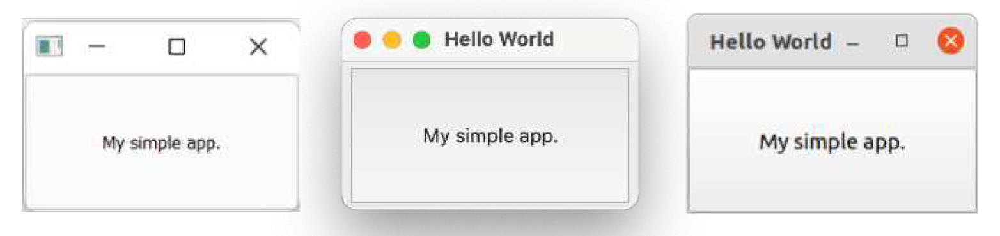

> 图243：适用于 Windows、macOS 和 Ubuntu Linux 的简单应用程序

### 构建基础应用程序

现在我们已经确认简单的应用程序可以正常运行，我们可以创建第一个测试构建。打开终端（shell）并导航到包含项目文件的文件夹。运行以下命令以创建 PyInstaller 构建。

```bash
pyinstaller --windowed app.py
```


> `--windowed` 命令行选项是构建 macOS 上的 `.app` 应用程序包以及在 Windows 上隐藏终端输出的必要条件。在 Linux 上该选项无效。

您将看到一系列输出消息，这些消息提供了关于PyInstaller正在执行什么操作的调试信息。这些信息对于排查构建过程中的问题非常有用，但如果不需要，也可以忽略。

*Listing 248. Output running pyinstaller on Windows*

```bash
> pyinstaller app.py
388 INFO: PyInstaller: 4.7
388 INFO: Python: 3.7.6
389 INFO: Platform: Windows-10-10.0.22000-SP0
392 INFO: wrote app.spec
394 INFO: UPX is not available.
405 INFO: Extending PYTHONPATH with paths
....etc.
```

构建完成后，查看您的文件夹，您会发现现在有了两个新的文件夹：`dist` 和 `build`。

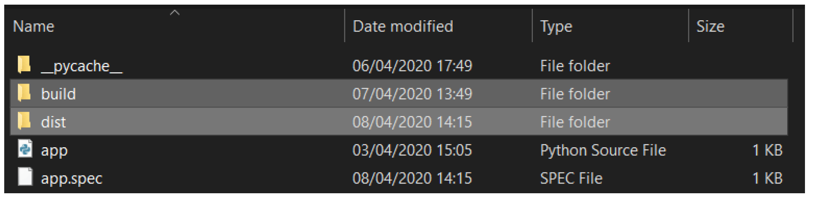

> 图244：PyInstaller 生成的 build 和 dist 文件夹

以下是文件夹结构的简要列表，展示了 `dist` 和 `build` 文件夹。实际文件会根据您构建的平台而有所不同，但整体结构始终保持一致。

```text
.
├── app.py
├── app.spec
├── build
│ 	└── app
│ 		├── localpycos
│ 		├── Analysis-00.toc
│ 		├── COLLECT-00.toc
│ 		├── EXE-00.toc
│ 		├── PKG-00.pkg
│ 		├── PKG-00.toc
│ 		├── PYZ-00.pyz
│ 		├── PYZ-00.toc
│ 		├── app
│ 		├── app.pkg
│ 		├── base_library.zip
│ 		├── warn-app.txt
│ 		└── xref-app.html
└── dist
	└── app
		├── lib-dynload
		...
```

构建文件夹由 PyInstaller 用于收集和准备打包文件，其中包含分析结果和一些额外的日志。对于大多数情况，您可以忽略此文件夹的内容，除非您正在尝试调试问题。

`dist`（即“分发”）文件夹包含待分发的文件。这包括您的应用程序，以可执行文件形式打包，以及任何关联的库（例如PyQt6）。运行您的应用程序所需的一切都将包含在此文件夹中，这意味着您可以将此文件夹分发给他人以运行您的应用程序。

您可以现在尝试自行运行已构建的应用程序，只需运行 `dist` 文件夹中的可执行文件名为 `app` 的文件。稍等片刻后，您将看到应用程序的熟悉窗口弹出，如下图所示。

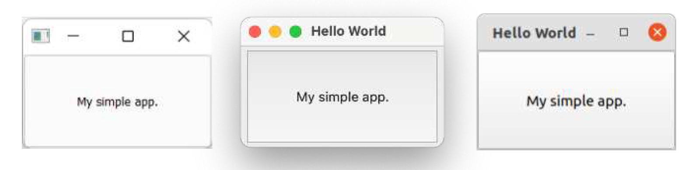

>  图245：简单应用程序，打包后即可运行。

在您的 Python 文件所在的同一文件夹中，与 `build` 和 `dist` 文件夹并列，PyInstaller 还会生成一个 `.spec` 文件。

### `.spec` 文件

`.spec` 文件包含 PyInstaller 用于打包应用程序的构建配置和指令。每个 PyInstaller 项目都有一个 `.spec`文件，该文件基于您在运行 `pyinstaller` 时传递的命令行选项生成。

当我们使用 `pyinstaller` 运行脚本时，除了传入我们的 Python 应用程序文件名外，没有传入其他任何内容。这意味着我们的 spec 文件目前仅包含默认配置。如果你打开它，您会看到类似于我们下面所示的内容。

*Listing 249. packaging/basic/app.spec*

```python
# -*- mode: python ; coding: utf-8 -*-


block_cipher = None


a = Analysis(['app.py'],
             pathex=[],
             binaries=[],
             datas=[],
             hiddenimports=[],
             hookspath=[],
             hooksconfig={},
             runtime_hooks=[],
             excludes=[],
             win_no_prefer_redirects=False,
             win_private_assemblies=False,
             cipher=block_cipher,
             noarchive=False)
pyz = PYZ(a.pure, a.zipped_data,
          cipher=block_cipher)

exe = EXE(pyz,
          a.scripts,
          [],
          exclude_binaries=True,
          name='app',
          debug=False,
          bootloader_ignore_signals=False,
          strip=False,
          upx=True,
          console=True,
          disable_windowed_traceback=False,
          target_arch=None,
          codesign_identity=None,
          entitlements_file=None )
coll = COLLECT(exe,a.binaries,
               a.zipfiles,
               a.datas,
               strip=False,
               upx=True,
               upx_exclude=[],
               name='app')
```

首先需要注意的是，这是一个 Python 文件，这意味着您可以编辑它并使用 Python 代码来计算设置的值。这在处理复杂构建时特别有用，例如当您针对不同平台进行构建时，希望根据条件定义要打包的额外库或依赖项。

如果您在 macOS 上进行构建，您还将有一个额外的 `BUNDLE` 块，用于构建 `.app` 包。该部分将大致如下所示：

```python
app = BUNDLE(coll,
             name='app.app',
             icon=None,
             bundle_identifier=None)
```

如果您在其他平台上开始构建，但希望以后针对 macOS 进行构建，您可以手动将以下内容添加到 `.spec` 文件的末尾：

一旦生成了 `.spec` 文件，您可以将该文件传递给 `pyinstaller` ，而不是您的脚本，以重复之前的构建过程。现在运行此命令以重新构建您的可执行文件。

```bash
pyinstaller app.spec
```

生成的构建结果将与用于生成 `.spec` 文件的构建完全相同（假设您未对项目进行任何修改）。对于许多 PyInstaller配置更改，您可以选择通过命令行参数传递参数，或修改现有的 `.spec` 文件。具体选择哪种方式由您决定，不过我建议对于更复杂的构建，最好直接编辑 `.spec` 文件。

### 调整构建过程

我们已经创建了一个非常简单的应用程序并构建了第一个可执行文件。现在我们将看看可以对构建过程进行的一些调整

#### 为您的应用程序命名

您可以做的最简单的更改之一就是为您的应用程序提供一个合适的“名称”。默认情况下，应用程序会采用源文件的名称（不包括扩展名），例如 `main` 或 `app`。这通常不是您希望为可执行文件命名的名称。

您可以通过编辑 `.spec` 文件并修改 `EXE` 和 `COLLECT` 块（以及 macOS 上的 `BUNDLE`）下的 `name=` 属性，为 PyInstaller 指定一个更友好的名称用于您的可执行文件（以及 `dist` 文件夹）。

*Listing 250. packaging/custom/hello-world.spec*

```python
exe = EXE(pyz,
          a.scripts,
          [],
          exclude_binaries=True,
          name='hello-world',
          debug=False,
          bootloader_ignore_signals=False,
          strip=False,
          upx=True,
          console=True,
          disable_windowed_traceback=False,
          target_arch=None,
          codesign_identity=None,
          entitlements_file=None )
coll = COLLECT(exe,
               a.binaries,
               a.zipfiles,
               a.datas,
               strip=False,
               upx=True,
               upx_exclude=[],
               name='hello-world')
```

`EXE` 下的名称是可执行文件的名称，而 `COLLECT`下的名称是输出文件夹的名称。


> 我建议您为可执行文件使用不包含空格的名称——请改用连字符或驼峰式命名法。

`BUNDLE` 块中指定的名称用于 macOS 应用程序包，该名称是应用程序在 Launchpad 和 Dock 中显示的用户可见名称。在我们的示例中，我们将应用程序可执行文件命名为 “hello-world”，但对于 `.app` 包，您可以使用更友好的 “Hello World.app”。

*Listing 251. packaging/custom/hello-world.spec*

```python
app = BUNDLE(coll,
             name='Hello World.app',
             icon=None,
             bundle_identifier=None)
```

或者，您可以重新运行 `pyinstaller` 命令，并传递 `-n` 或 `--name` 配置选项，同时提供您的 `app.py` 脚本。

```bash
pyinstaller --windowed -n "hello-world" app.py
# 或者
pyinstaller --windowed --name "hello-world" app.py
```

生成的可执行文件将命名为 `hello-world`，而展开后的构建文件将放置在 `dist\hello-world\` 文件夹中。`.spec` 文件的名称取自命令行中传递的名称，因此这也将为您创建一个新的 `spec` 文件，名为 `hello-world.spec`，位于您的根文件夹中。


> 如果您创建了一个新的 `.spec` 文件，请删除旧的文件以避免混淆！

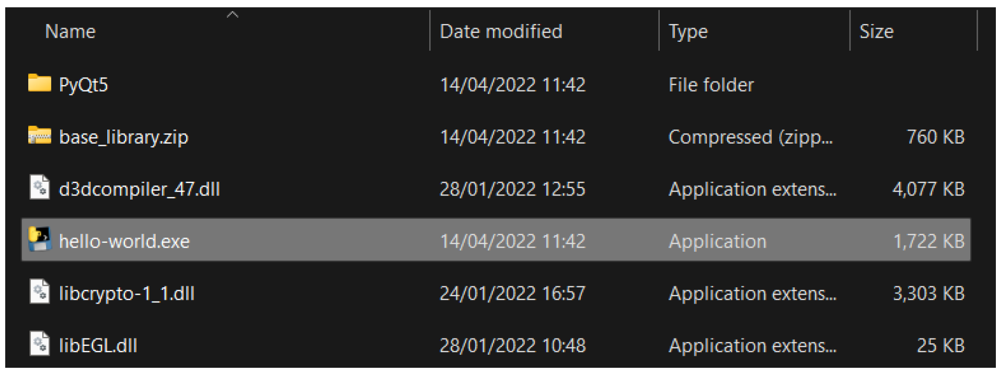

> 图246：带有自定义名称“hello-world”的应用程序。

#### 应用程序图标

另一个简单的改进是更改应用程序运行时显示的应用程序图标。我们可以设置应用程序窗口/任务栏的图标，这可以通过在代码中调用 `.setWindowIcon()` 实现。

*Listing 252. packaging/custom/app.py*

```python
from PyQt6.QtWidgets import QMainWindow, QApplication, QPushButton
from PyQt6.QtGui import QIcon

import sys


class MainWindow(QMainWindow):
    def __init__(self):
        super().__init__()
        
        self.setWindowTitle("Hello World")
        
        button = QPushButton("My simple app.")
        button.pressed.connect(self.close)
        
        self.setCentralWidget(button)
        self.show()
        
app = QApplication(sys.argv)
app.setWindowIcon(QIcon("icon.svg"))
w = MainWindow()
app.exec()
```

在此，我们向应用程序实例添加了 `.setWindowIcon` 调用。这定义了一个用于应用程序所有窗口的默认图标。如果您愿意，可以针对每个窗口单独覆盖此设置，通过在窗口本身调用 `.setWindowIcon` 来实现。将图标复制到与脚本相同的文件夹中。

如果您运行上述应用程序，现在应该会在Windows系统的窗口上看到图标，而在macOS或Ubuntu Linux系统中则会在Dock栏上看到图标。

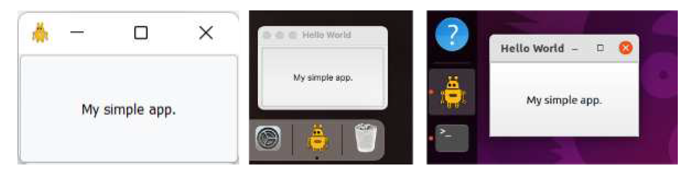

> 图247：显示自定义图标的窗口


> 关于图标的说明。
>
> 在此示例中，我们设置了一个单一的图标文件，使用可缩放矢量图形（SVG）文件，该文件在任何大小下都将保持清晰。您也可以使用位图图像，在这种情况下，您需要提供多种尺寸以确保图标始终保持清晰。在 Windows 上，您可以通过创建 ICO 文件来实现，该文件是包含多个图标的特殊文件。在 Linux 上，您可以在安装过程中提供多个不同的 PNG 文件（参见 Linux 打包部分）。在 macOS 上，多个图标尺寸由包含在 `.app` 包中的 ICNS 文件提供。
>
> 是的，这确实让人困惑！但幸运的是，Qt支持所有平台上的各种图标格式。


> 即使您没有看到图标，请继续阅读！

#### 处理相对路径

这里有一个需要注意的细节，可能并不明显。请您打开终端，切换到保存脚本的文件夹。然后像往常一样运行它：

```bash
python3 app.py
```

如果图标位于正确的位置，您应该能够看到它们。现在切换到父文件夹，并再次运行您的脚本（将 `<folder>` 替换为脚本所在文件夹的名称）。

```bash
cd ..
python3 <folder>/app.py
```

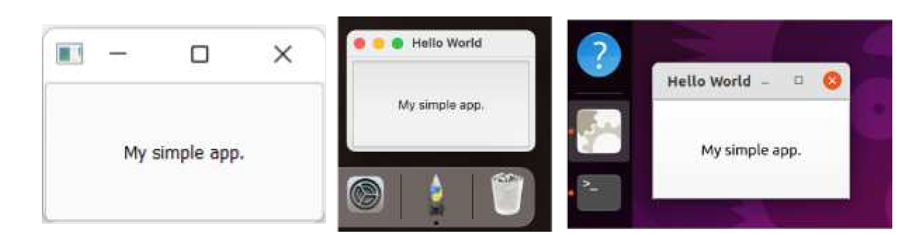

> 图248：缺少图标的窗口

图标没有显示。这是怎么回事？

我们使用相对路径来引用数据文件。这些路径相对于当前工作目录——不是脚本所在的文件夹，而是您运行脚本的文件夹。如果您从其他地方运行脚本，它将无法找到这些文件。


> 图标无法显示的一个常见原因是，在使用项目根目录作为当前工作目录的IDE中运行示例。

这是在应用程序打包前的一个小问题，但一旦安装后，您将无法知道应用程序运行时当前的工作目录是什么——如果工作目录错误，您的应用程序将无法找到其数据文件。我们需要在继续之前解决这个问题，可以通过将路径设置为相对于应用程序文件夹的相对路径来实现。

在下面的更新代码中，我们定义了一个新变量 `basedir`，使用 `os.path.dirname` 获取 `__file__` 所包含的文件夹，该文件夹包含当前 Python 文件的完整路径。然后，我们使用 `os.path.join()` 构建数据文件的相对路径。


> 请参阅“使用相对路径”部分以获取更多信息，以及在应用程序中使用相对路径的更可靠方法。

由于我们的 `app.py` 文件位于文件夹的根目录下，因此所有其他路径都是相对于该目录的。

*Listing 253. packaging/custom/app_relative_paths.py*

```python
import os
import sys

from PyQt6.QtGui import QIcon
from PyQt6.QtWidgets import QApplication, QMainWindow, QPushButton

basedir = os.path.dirname(__file__)


class MainWindow(QMainWindow):
    def __init__(self):
        super().__init__()
        
        self.setWindowTitle("Hello World")
        
        button = QPushButton("My simple app.")
        button.setIcon(QIcon(os.path.join(basedir, "icon.svg")))
        button.pressed.connect(self.close)
        
        self.setCentralWidget(button)
        self.show()
        
app = QApplication(sys.argv)
app.setWindowIcon(QIcon(os.path.join(basedir, "icon.svg")))
w = MainWindow()
app.exec()
```

请尝试从父文件夹重新运行您的应用程序——您会发现图标现在会如预期般显示，无论您从何处启动应用程序。

#### 任务栏图标（仅限Windows系统）

在 Windows 系统中，使用 `.setWindowIcon()` 方法可以正确设置窗口的图标。然而，由于 Windows 系统对窗口的跟踪和分组方式，有时图标可能不会在任务栏上显示。


> 如果对您有效，太好了！但当您分发应用程序时，它可能无法正常工作，因此请务必按照以下步骤操作！

当您运行应用程序时，Windows 会检查可执行文件并尝试确定其所属的“应用程序组”。默认情况下，所有 Python 脚本（包括您的应用程序）都会被归类到同一个“Python”组中，因此会显示 Python 图标。要阻止这种情况发生，我们需要为应用程序提供一个不同的应用程序标识符。

下面的代码通过调用 `SetCurrentProcessExplicitAppUserModelID()` 方法，并传入自定义的应用程序 ID 来实现这一点。

*Listing 254. packaging/custom/app_windows_taskbar.py*

```python
from PyQt6.QtWidgets import QMainWindow, QApplication, QPushButton
from PyQt6.QtGui import QIcon

import sys, os

basedir = os.path.dirname(__file__)

try: #1
    from ctypes import windll # 仅存在于Windows系统中.
    
    myappid = "mycompany.myproduct.subproduct.version" #2
    windll.shell32.SetCurrentProcessExplicitAppUserModelID(myappid)
except ImportError:
    pass


class MainWindow(QMainWindow):
    def __init__(self):
        super().__init__()
        
        self.setWindowTitle("Hello World")
        
        button = QPushButton("My simple app.")
        button.setIcon(QIcon(os.path.join(basedir, "icon.svg")))
        button.pressed.connect(self.close)
        
        self.setCentralWidget(button)
        self.show()
        
        
app = QApplication(sys.argv)
app.setWindowIcon(QIcon(os.path.join(basedir, "icon.svg")))
w = MainWindow()
app.exec()
```

> 1. 该代码被包裹在 `try/except` 块中，因为 `windll` 模块在非Windows平台上不可用。这使得您的应用程序可以在macOS和Linux上继续运行。
> 2. 为您的应用程序自定义应用程序标识符字符串。

上述列表显示了一个通用的 `mycompany.myproduct.subproduct.version` 字符串，但您应将其修改为与实际应用程序相符。此处填写的内容并不重要，但惯例是使用反向域名表示法，即使用 `com.mycompany` 作为公司标识符。

将此代码添加到您的脚本中，您的图标一定会显示在任务栏上。


> 图249：自定义图标显示在任务栏上

#### 可执行文件图标（仅限Windows系统）

现在，当应用程序运行时，图标显示正确。但是，您可能会注意到，您的应用程序可执行文件仍然使用不同的图标。在 Windows 系统中，应用程序可执行文件可以嵌入图标，以便更容易识别。默认图标是由 PyInstaller 提供的，但您可以用自己的图标替换它。

要为 Windows 可执行文件添加图标，您需要向 `EXE` 块提供一个 `.ico` 格式的文件。

*Listing 255. packaging/custom/hello-world-icons.spec*

```python
exe = EXE(pyz,
          a.scripts,
          [],
          exclude_binaries=True,
          name='hello-world',
          icon='icon.ico',
          debug=False,
          bootloader_ignore_signals=False,
          strip=False,
          upx=True,
          console=True,
          disable_windowed_traceback=False,
          target_arch=None,
          codesign_identity=None,
          entitlements_file=None )
```

要创建 .ico 文件，我建议您使用 [Greenfish Icon Editor Pro](http://greenfishsoftware.org/gfie.php)，这是一个免费且开源的工具，也可以为 Windows 创建图标。本书的下载内容中包含一个示例 `.ico` 文件。

如果您使用修改后的 `.spec` 文件运行 `pyinstaller` 构建，您会发现可执行文件现在有了自定义图标。

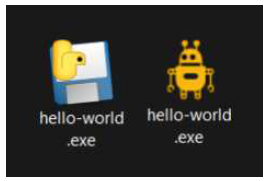

> 图250：Windows 可执行文件显示默认和自定义图标


> 您还可以通过在初始构建时向 pyinstaller 传递 `--icon icon.ico` 参数来提供图标。您可以通过这种方式提供多个图标，以支持 macOS 和 Windows。

#### macOS .app 应用程序包图标（仅限 macOS）

在 macOS 上，应用程序以 `.app` 包的形式分发，这些包可以拥有自己的图标。包图标用于在启动台和应用启动时在 Dock 上识别应用程序。PyInstaller 可以为您添加图标到应用程序包中，您只需将 ICNS 格式文件传递到 `.spec` 文件中的 `BUNDLE` 块即可。该图标随后将显示在生成的包中，并在应用启动时显示。

*Listing 256. packaging/custom/hello-world-icons.spec*

```python
app = BUNDLE(coll,
             name='Hello World.app',
             icon='icon.icns',
             bundle_identifier=None)
```

ICNS 是 macOS 系统中图标文件的文件格式。您可以在 macOS 系统上使用 [Icon Composer](https://github.com/lemonmojo/IconComposer2x/) 创建图标文件。您还可以在 Windows 系统上使用 [Greenfish Icon Editor Pro](http://greenfishsoftware.org/gfie.php) 创建 macOS 图标。

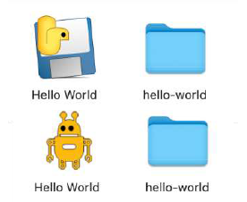

> 图251：macOS .app 应用程序包显示默认和自定义图标


> 您还可以通过在初始构建时向 `pyinstaller` 传递 `--icon icon.icns` 参数来提供图标。您可以通过这种方式提供多个图标，以支持 macOS 和 Windows。

在我们的示例中，应用程序启动时，包中的图标集将被 `.setWindowIcon` 调用替换。然而，在 macOS 上，您可以完全跳过 `.setWindowIcon()` 调用，只需通过 `.app` 包设置图标即可。

### 数据文件和资源

现在我们已经有一个可以正常运行的应用程序，它拥有自定义名称、自定义应用程序图标，以及一些调整，以确保该图标在所有平台上显示，并且无论应用程序从何处启动，都能正确显示。在这些设置就位后，最后一步是确保该图标正确打包到应用程序中，并且在从 `dist` 文件夹运行时继续显示。


> 试试看，它不会如您所愿。

问题是，我们的应用程序现在依赖于一个外部数据文件（图标文件），而该文件不属于我们的源代码。为了使应用程序正常运行，我们现在需要将该数据文件与应用程序一起分发。PyInstaller 可以帮助我们实现这一点，但我们需要告诉它要包含哪些内容，以及在输出中将它们放置在哪里。

在下一节中，我们将探讨管理与应用程序相关的数据文件的可用选项。这种方法不仅适用于图标文件，还可用于任何其他数据文件，包括您的应用程序所需的Qt Designer `.ui` 文件。

#### 使用PyInstaller打包数据文件

我们的应用程序现在依赖于一个图标文件。

*Listing 257. packaging/data-file/app.py*

```python
from PyQt6.QtWidgets import (
    QMainWindow,
    QApplication,
    QPushButton,
    QVBoxLayout,
    QLabel,
    QWidget,
)
from PyQt6.QtGui import QIcon

import sys, os

basedir = os.path.dirname(__file__)

try:
    from ctypes import windll # 仅存在于Windows系统中.
    
    myappid = "mycompany.myproduct.subproduct.version"
    windll.shell32.SetCurrentProcessExplicitAppUserModelID(myappid)
except ImportError:
    pass


class MainWindow(QMainWindow):
    def __init__(self):
        super().__init__()
        
        self.setWindowTitle("Hello World")
        layout = QVBoxLayout()
        label = QLabel("My simple app.")
        label.setMargin(10)
        layout.addWidget(label)
        
        button = QPushButton("Push")
        button.pressed.connect(self.close)
        layout.addWidget(button)
        
        container = QWidget()
        container.setLayout(layout)
        
        self.setCentralWidget(container)
        
        self.show()
        
        
app = QApplication(sys.argv)
app.setWindowIcon(QIcon(os.path.join(basedir, "icon.svg")))
w = MainWindow()
app.exec()
```

将此数据文件放入 `dist` 文件夹的最简单方法是直接告诉PyInstaller将其复制过去。PyInstaller支持指定要复制的单个文件路径列表，以及相对于 `dist/<应用程序名称>` 文件夹的文件夹路径，用于将文件复制到该位置。

与其他选项一样，这可以通过命令行参数指定，`--add-data`，您可以多次提供该参数。

```bash
pyinstaller --add-data "icon.svg:." --name "hello-world" app.py
```


> 路径分隔符因平台而异，在 Linux 或 Mac 上使用 `:` 而在 Windows 上使用 `;`

或者通过规格文件分析部分中的数据列表，以源位置和目标位置的元组形式。

```python
a = Analysis(['app.py'],
             pathex=[],
             binaries=[],
             datas=[('icon.svg', '.')],
             hiddenimports=[],
             hookspath=[],
             runtime_hooks=[],
             excludes=[],
             win_no_prefer_redirects=False,
             win_private_assemblies=False,
             cipher=block_cipher,
             noarchive=False)
```

然后使用以下命令执行 `.spec` 文件：

```bash
pyinstaller hello-world.spec
```

在两种情况下，我们都告诉 PyInstaller 将指定的文件 `icon.svg` 复制到 `.` 位置。这意味着输出文件夹 `dist`。如果需要，我们也可以在此指定其他位置。 如果您现在运行构建，您应该可以在输出文件夹 `dist` 中看到您的 `.svg` 文件，准备与您的应用程序一起分发。

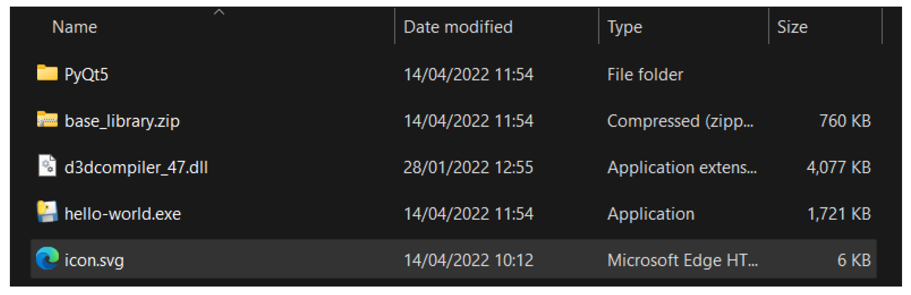

> 图252：被复制到 dist 文件夹的图标文件

如果您从 `dist` 目录运行应用程序，现在应该能看到预期的图标。

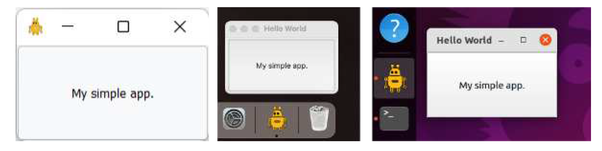

> 图253：窗口（Windows）和底栏（macOS 和 Ubuntu）上显示的图标


> 该文件必须使用相对路径在Qt中加载，并且其相对位置与EXE文件的相对位置相同，与它在 `.py` 文件中的相对位置相同，以确保其正常工作。


> 如果您在 Windows 机器上开始构建，您的 `.spec` 文件可能会包含使用双反斜杠 `\\` 的路径。这在其他平台上无法正常工作，因此您应该将这些路径替换为单正斜杠 `/`，因为单正斜杠在所有平台上都有效。

#### 打包数据文件夹

通常，您会有多个数据文件需要包含在您的打包文件中。最新版本的PyInstaller允许您像打包文件一样打包文件夹，同时保留子文件夹结构。为了演示如何打包数据文件夹，让我们在应用程序中添加几个按钮并为它们添加图标。我们可以将这些图标放在一个名为 `icons` 的文件夹下。

*Listing 258. packaging/data-folder/app.py*

```python
from PyQt6.QtWidgets import (
    QMainWindow,
    QApplication,
    QLabel,
    QVBoxLayout,
    QPushButton,
    QWidget,
)
from PyQt6.QtGui import QIcon
import sys, os

basedir = os.path.dirname(__file__)

try:
    from ctypes import windll # 仅存在于Windows系统中.
    myappid = "mycompany.myproduct.subproduct.version"
    windll.shell32.SetCurrentProcessExplicitAppUserModelID(myappid)
except ImportError:
    pass


class MainWindow(QMainWindow):
    def __init__(self):
        super().__init__()
        
        self.setWindowTitle("Hello World")
        layout = QVBoxLayout()
        label = QLabel("My simple app.")
        label.setMargin(10)
        layout.addWidget(label)
        
        button_close = QPushButton("Close")
        button_close.setIcon(
            QIcon(os.path.join(basedir, "icons", "lightning.svg"))
        )
        button_close.pressed.connect(self.close)
        layout.addWidget(button_close)
        
        button_maximize = QPushButton("Maximize")
        button_maximize.setIcon(
            QIcon(os.path.join(basedir, "icons", "uparrow.svg"))
        )
        button_maximize.pressed.connect(self.showMaximized)
        layout.addWidget(button_maximize)
        
        container = QWidget()
        container.setLayout(layout)
        
        self.setCentralWidget(container)
        
        self.show()
        
        
app = QApplication(sys.argv)
app.setWindowIcon(QIcon(os.path.join(basedir, "icons", "icon.svg")))
w = MainWindow()
app.exec()
```


> 此代码中包含了Windows任务栏图标的修复程序，如果您不是在为Windows构建应用程序，可以跳过它。

图标（均为SVG文件）存储在名为“icons”的子文件夹中。

```text
.
├── app.py
└── icons
	└── lightning.svg
	└── uparrow.svg
	└── icon.svg
```

如果您运行此程序，将看到以下窗口，其中按钮上带有图标，窗口或 Dock 栏中也有一个图标。

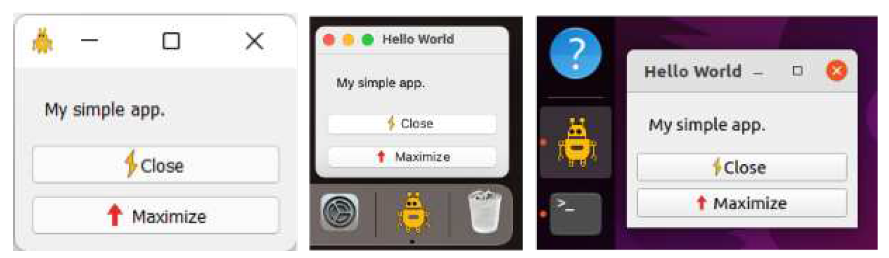

> 图254：带有多个图标的窗口

要将 `icons` 文件夹复制到我们的构建应用程序中，我们只需将该文件夹添加到我们的 `.spec` 文件的 `Analysis` 块中。对于单个文件，我们将其作为元组添加，其中包含源路径（来自我们的项目文件夹）和目标文件夹，该目标文件夹位于生成的 `dist` 文件夹下。

*Listing 259. packaging/data-folder/hello-world.spec*

```python
# -*- mode: python ; coding: utf-8 -*-


block_cipher = None


a = Analysis(['app.py'],
             pathex=[],
             binaries=[],
             datas=[('icons', 'icons')],
             hiddenimports=[],
             hookspath=[],
             hooksconfig={},
             runtime_hooks=[],
             excludes=[],
             win_no_prefer_redirects=False,
             win_private_assemblies=False,
             cipher=block_cipher,
             noarchive=False)
pyz = PYZ(a.pure, a.zipped_data,
          cipher=block_cipher)

exe = EXE(pyz,
          a.scripts,
          [],
          exclude_binaries=True,
          name='hello-world',
          icon='icons/icon.ico',
          debug=False,
          bootloader_ignore_signals=False,
          strip=False,
          upx=True,
          console=False,
          disable_windowed_traceback=False,
          target_arch=None,
          codesign_identity=None,
          entitlements_file=None )
coll = COLLECT(exe,
               a.binaries,
               a.zipfiles,
               a.datas,
               strip=False,
               upx=True,
               upx_exclude=[],
               name='hello-world')
app = BUNDLE(coll,
             name='Hello World.app',
             icon='icons/icon.icns',
             bundle_identifier=None)
```

如果您使用这个规格文件运行构建，你会发现图标文件夹已被复制到 `dist` 文件夹中。如果您从该文件夹运行应用程序——或从任何其他位置运行——图标将如预期显示，因为相对路径在新的位置仍然正确。

### 总结

随着这些更改的实施，您现在可以跨所有平台可重复地构建您的应用程序。在接下来的章节中，我们将继续探讨如何将已构建的可执行文件打包成可用的安装程序。

到目前为止，我们已经逐步介绍了如何在您自己的平台上使用PyInstaller构建应用程序。通常，您可能希望为所有平台构建您的应用程序。

如前所述，您只能在特定平台上为该平台构建软件——即，如果您想构建一个 Windows 可执行文件，您需要在 Windows 系统上进行构建。然而，理想情况下，您希望能够使用同一个 `.spec` 文件来完成这一操作，以简化维护工作。如果您想支持多个平台，现在也可以在其他系统上测试您的 `.spec` 文件，以确保构建配置正确。如果出现问题，请查阅本章中各平台的特定说明。

## 38. 使用InstallForge创建Windows安装程序

到目前为止，我们一直使用PyInstaller来打包应用程序以供分发。打包过程的输出结果是一个名为`dist` 的文件夹，其中包含应用程序运行所需的所有文件。虽然您可以将此文件夹作为ZIP文件分享给用户，但这并非最佳的用户体验。

Windows 桌面应用程序通常随安装程序一起分发，安装程序负责将可执行文件（以及任何其他文件）放置到正确的位置，并添加“开始”菜单快捷方式。接下来，我们将探讨如何使用我们的 `dist` 文件夹来创建一个可运行的Windows安装程序。

为了创建我们的安装程序，我们将使用一个名为 [InstallForge](https://installforge.net/) 的工具。InstallForge是免费的，可以从 [本页](https://installforge.net/download/) 下载。本书下载中的InstallForge工作配置可作为 `Hello World.ifp` 文件获取，但请注意源路径需要根据您的系统进行更新。


> 如果您急于尝试，可以先下载 [示例Windows安装程序](https://downloads.pythonguis.com/DemoAppInstallforge.exe)。

我们将逐步演示使用InstallForge创建安装程序的基本步骤。

### 通用设置

当您首次运行InstallForge时，将看到此“通用”(General)选项卡。在此，您可以输入应用程序的基本信息，包括名称、程序版本、公司和网站。

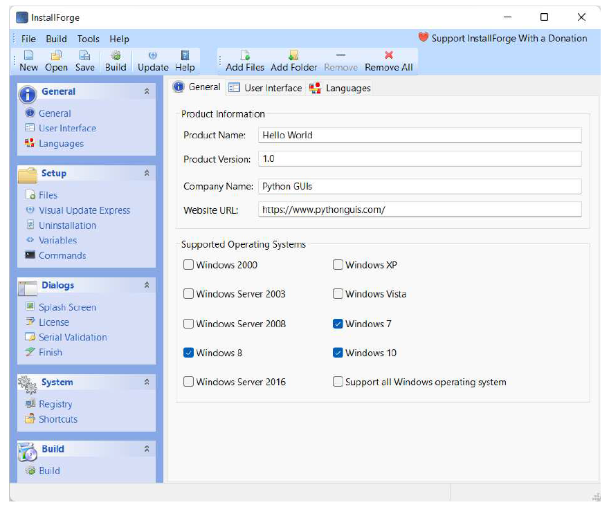

> 图255：InstallForge 初始视图，显示通用设置

您还可以选择安装程序的目标平台，从目前可用的各种版本的Windows 中进行选择。这确保用户只能将您的应用程序安装在与之兼容的 Windows 版本上。


> 这里没有什么神奇之处，在安装程序中选择额外的平台并不会让您的应用程序在这些平台上运行！您需要在安装程序中启用这些平台之前，先确保您的应用程序可以在目标版本的Windows上运行。

### 选定安装文件

点击左侧边栏以打开“Setup”下的“Files”页面。在此处您可以指定要打包到安装程序中的文件。

在工具栏上点击“Add Files…”并选择PyInstaller生成的 `dist/hello-world` 目录下的所有文件。弹出的文件浏览器支持多文件选择，因此您可以一次性添加所有文件，但需要单独添加文件夹。您可以点击“添加文件夹…”并添加 `dist/hello-world` 目录下的任何文件夹，例如您的 `icons` 文件夹和其他库文件夹。

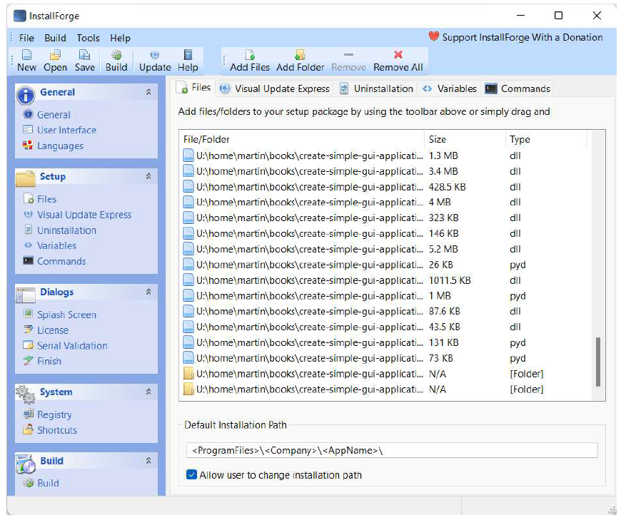

> 图256：在InstallForge文件视图中，将所有要打包的文件和文件夹添加进去。


> 所选文件夹的内容将被递归包含，您无需选择子文件夹。

完成后，您可以滚动列表到底部，确保以下文件夹被列出以包含在内：`dist/helloworld` 下的所有文件和文件夹都应存在。但 `dist/hello-world` 文件夹本身不应被列出。

默认安装路径可以保持不变。尖括号中的值，例如 `<company>` 是变量，将从配置中自动填充。接下来，建议允许用户卸载您的应用程序。尽管它无疑很棒，但用户未来可能希望卸载它。您可以在“卸载”选项卡中通过勾选复选框来实现此功能。这也将使应用程序出现在Windows“添加或删除程序”列表中。

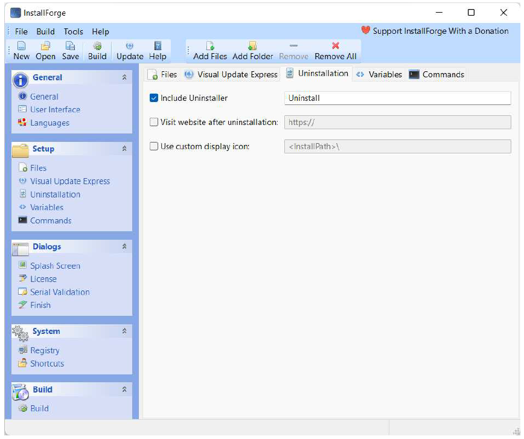

> 图257：InstallForge 为您的应用程序添加卸载程序

### 对话框

“对话框”部分可用于向用户显示自定义消息、启动画面或许可证信息。 “完成”选项卡可用于控制安装程序完成后发生的事情，在此处为用户提供在安装完成后运行程序的选项会很有帮助。

要实现这一点，您需要勾选“Run program”旁边的复选框，并将您自己的应用程序 EXE 文件添加到该框中。由于 `<installpath>\` 已经指定，我们只需添加 `hello-world.exe` 即可。在首次启动时，可以使用参数向程序传递任何参数。

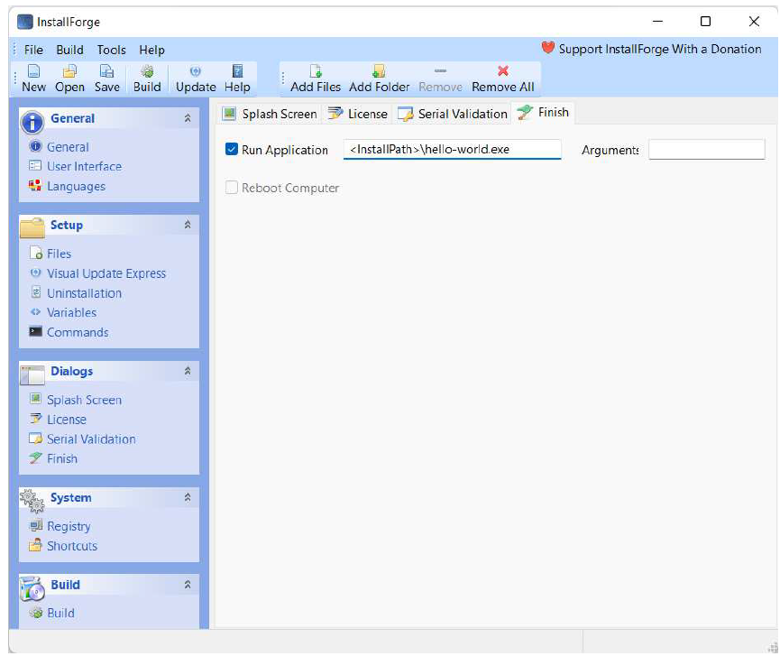

> 图258：InstallForge 在安装完成后配置可选的运行程序。

### 系统

在“System”下选择“System”可以打开快捷方式编辑器。在这里，您可以为开始菜单和桌面设置快捷方式。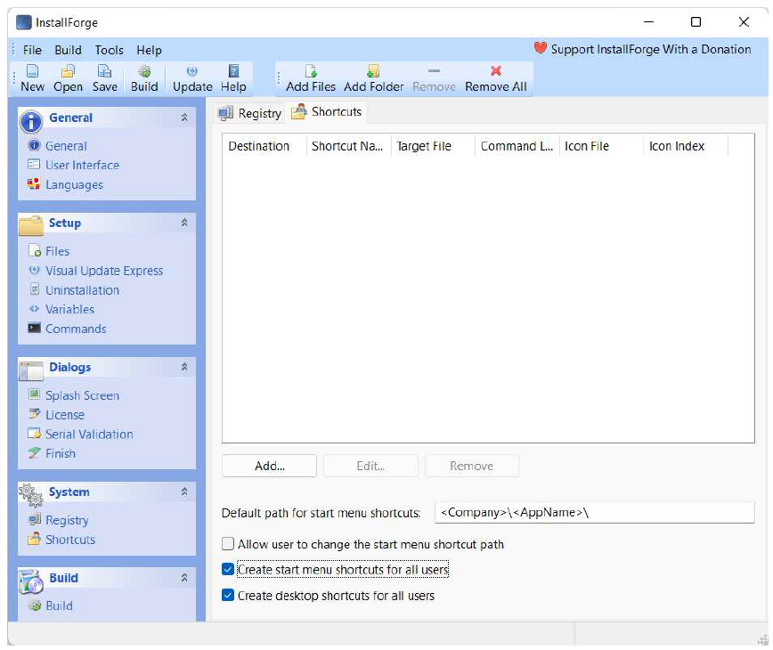

> 图259：InstallForge 配置快捷方式，用于开始菜单和桌面

点击“Add…”可以添加应用程序的新快捷方式。选择“开始菜单” (Start
menu) 或“桌面” (Desktop) 快捷方式，并填写名称和目标文件。这是应用程序安装后EXE文件的最终路径。由于 `<installpath>\` 已指定，您只需在末尾添加应用程序的EXE文件名，例如 `hello-world.exe` 。

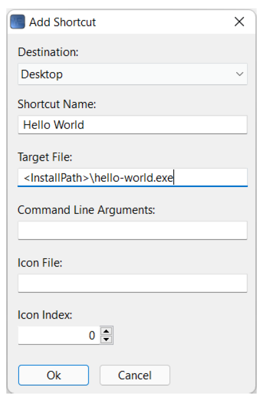

> 图260：InstallForge，添加快捷方式

### 构建

基本设置完成后，您现在可以开始构建安装程序了。


> 此时您可以保存您的InstallForge项目，以便将来可以从相同的设置重新构建安装程序。

点击底部“Build”部分以打开构建面板

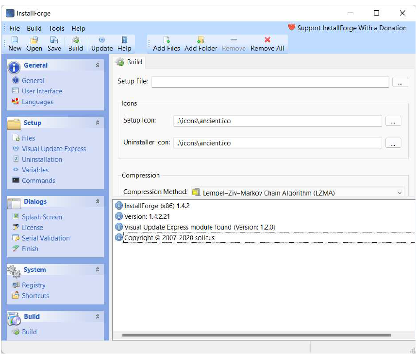

> 图261：InstallForge，随时准备构建

点击工具栏上的“构建”图标以启动构建过程。如果您尚未指定安装程序文件的位置，系统将提示您选择一个。这是您希望保存**完成的安装程序**的位置。构建过程将开始，这会收集并压缩文件到安装程序中。

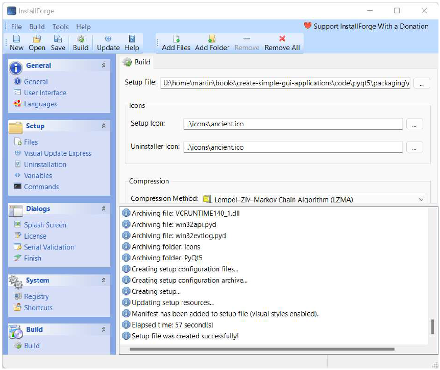

> 图262：InstallForge，构建完成

完成后，系统将提示您运行安装程序。这是可选项，但是相当必要，因为您可以通过这样来检验您的安装程序是否可以正常运行。

### 运行安装程序

安装程序本身应该不会有意外，运行正常。根据在InstallForge中选择的选项，您可能会看到额外的面板或选项。

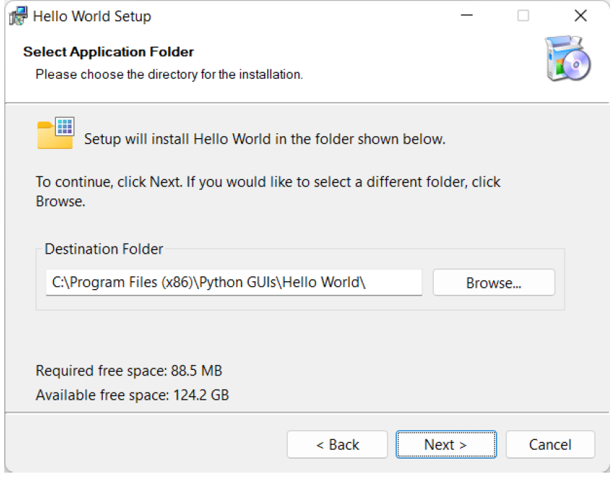

> 图263：InstallForge，运行生成的安装程序

请您按照安装程序的提示完成安装。您可选择在安装程序的最后一步直接运行该应用程序，或在开始菜单中找到它。

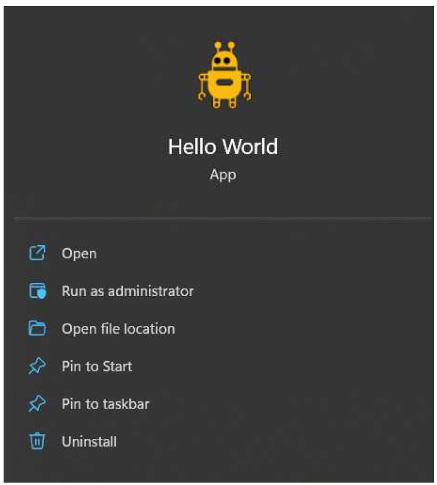

> 图264：在 Windows 11 的开始菜单中显示“Hello World”程序。

### 总结

在前一章中，我们介绍了如何使用 PyInstaller 将您的 PyQt6 应用程序打包成可分发的可执行文件。在本章中，我们使用已打包的 PyInstaller 应用程序，并逐步演示了如何使用 InstallForge 构建该应用程序的安装程序。按照这些步骤操作，您应该能够将自己的应用程序打包，并使其在 Windows 系统上可供他人使用。


> 另一个用于构建 Windows 安装程序的流行工具是 [NSIS](https://nsis.sourceforge.io/Main_Page) ，它是一个可脚本化的安装程序，这意味着您可以通过编写自定义脚本来配置其行为。如果您需要频繁构建应用程序并希望自动化该过程，那么它绝对值得一试。

## 39. 创建 macOS 磁盘映像安装程序 

在前一章中，我们使用 PyInstaller 从我们的应用程序构建了一个 macOS `.app` 文件。打开这个 `.app` 文件会运行你的应用程序，理论上您可以直接将它分发给其他人。然而，有一个问题——macOS `.app` 文件实际上只是带有特殊扩展名的文件夹。这意味着它们不适合直接分享——最终用户需要下载文件夹内的所有单独文件。

解决方案是将 `.app` 文件封装在 Zip 文件（`.zip`）或磁盘映像文件（`.dmg`）中。大多数商业软件都采用磁盘映像格式，因为这样可以包含一个快捷方式，指向用户的“应用程序”文件夹，使用户能够通过拖放操作将应用程序直接拖入该文件夹。这种做法如今已非常普遍，以至于许多用户如果遇到其他格式可能会感到困惑。我们还是遵循这一惯例吧。


> 如果您等不及了，您可以先下载 [示例 macOS 磁盘映像](https://downloads.pythonguis.com/DemoAppMacOS.dmg) 。

### 创建DMG文件

自行创建DMG文件相对简单，但我建议您首先使用可通过Homebrew安装的工具 `create-dmg` 。该工具以简单的命令行工具形式安装，您只需传入几个参数即可生成DMG安装程序。

您可以使用 Homebrew 安装 `create-dmg` 包。

```bash
brew install create-dmg
```

安装完成后，您即可使用 `create-dmg` Bash 脚本。以下是部分选项示例，可通过运行 `create-dmg --help` 命令查看完整列表：

```bash
--volname <name>: set volume name (displayed in the Finder sidebar and window title)
--volicon <icon.icns>: set volume icon
--background <pic.png>: set folder background image (provide png, gif, jpg)
--window-pos <x> <y>: set position the folder window
--window-size <width> <height>: set size of the folder window
--text-size <text_size>: set window text size (10-16)
--icon-size <icon_size>: set window icons size (up to 128)
--icon <file_name> <x> <y>: set position of the file's icon
--hide-extension <file_name>: hide the extension of file
--app-drop-link <x> <y>: make a drop link to Applications, at location x, y
--eula <eula_file>: attach a license file to the dmg
--no-internet-enable: disable automatic mount&copy
--format: specify the final image format (default is UDZO)
--add-file <target_name> <file|folder> <x> <y>: add additional file or folder (can be used multiple times)
--disk-image-size <x>: set the disk image size manually to x MB
--version: show tool version number
-h, --help: display the help
```


> 卷是磁盘的术语名称，因此卷名称是您希望为磁盘映像（DMG）本身命名的名称。

除了上述选项外，您还需要指定DMG文件的输出名称以及输入文件夹——即包含由PyInstaller生成的 `.app` 文件的文件夹。

下面我们将使用 `create-dmg` 工具为我们的 Hello World 应用程序创建一个安装程序 DMG 文件。我们这里只使用了部分可用选项——设置磁盘卷的名称和图标、调整窗口的位置和大小、设置应用程序的图标，以及添加 `/Applications` 目标目录链接。这是您为自己的应用程序设置的最低要求，如果您愿意，可以进一步自定义这些设置。

由于 `create-dmg` 会将指定文件夹中的所有文件复制到 DMG 中，因此您需要确保 `.app` 文件位于一个单独的文件夹中。我建议创建一个名为 `dmg` 的文件夹，并将生成的 `.app` 包复制到该文件夹中。下面我编写了一个小型脚本用于打包操作，其中包含一个测试，用于检查并删除任何之前生成的 DMG 文件。

*Listing 260. packaging/installer/mac/makedmg.sh*

```sh
#!/bin/sh
test -f "Hello World.dmg" && rm "Hello World.dmg"
test -d "dist/dmg" && rm -rf "dist/dmg"
# 创建 dmg 文件夹并复制我们的 .app 包到其中.
mkdir -p "dist/dmg"
cp -r "dist/Hello World.app" "dist/dmg"
# 创建 dmg 文件.
create-dmg \
  --volname "Hello World" \
  --volicon "icons/icon.icns" \
  --window-pos 200 120 \
  --window-size 800 400 \
  --icon-size 100 \
  --icon "Hello World.app" 200 190 \
  --hide-extension "Hello World.app" \
  --app-drop-link 600 185 \
  "Hello World.dmg" \
  "dist/dmg/"
```

请您将此内容保存到项目根目录，命名为 `build-dmg.sh`，然后将其设为可执行文件。使用以下命令：

```bash
$ chmod +x build-dmg.sh
```

然后执行脚本以构建包。

```bash
$ ./build-dmg.sh
```

`create-dmg` 进程将开始运行，并在当前目录中生成一个 DMG 文件，其名称与您为输出文件指定的名称一致（即最后一个参数，带 `.dmg` 扩展名）。现在您可以将生成的 DMG 文件分发给其他 macOS 用户了！

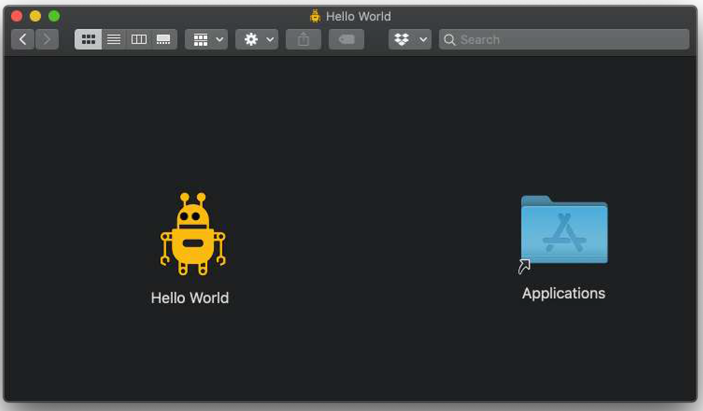

> 图265：生成的磁盘映像显示我们的 `.app` 包和Applications快捷方式。您可以将应用程序拖动到目标位置以进行安装。


> 有关 `create-dmg` 的更多信息，请参阅 [Github 上的文档](https://github.com/create-dmg/create-dmg) 。

## 40. 创建一个Linux软件包

在前一章中，我们使用 PyInstaller 将应用程序打包成一个 Linux 可执行文件，连同相关的数据文件。打包过程的输出是一个文件夹，可以与其他用户共享。然而，为了方便他们将其安装到自己的系统上，我们需要创建一个 Linux 包。

软件包是可分发的文件，允许用户在他们的 Linux 系统上安装软件。它们会自动将文件放置在正确的位置，并设置应用程序在任务栏/菜单中的条目，以便于启动应用程序。

在 Ubuntu（和 Debian）中，软件包被命名为 `.deb` 文件，在 Redhat 中是 `.rpm`，而在 Arch Linux 中是 `.pacman`。这些文件格式各不相同，但幸运的是，使用名为 fpm 的工具来构建它们的过程是相同的。[fpm](https://github.com/jordansissel/) 是由 Jordan Issel 开发的打包系统，它可以将一个文件夹（或文件列表）组装成一个 Linux 软件包。


> 在本章中，我们将逐步讲解创建 Linux 软件包的步骤，以 Ubuntu 的 `.deb` 文件为例。然而，得益于 fpm 的强大功能，您也可以使用相同的方法来处理其他 Linux 系统。


> 图266：Ubuntu 软件包，用于我们的“Hello World”应用程序


> 如果您等不及了，您可以先下载 [示例 Ubuntu包](https://downloads.pythonguis.com/hello-world.deb) 。

### 安装 fpm

fpm 工具是用 Ruby 编写的，使用它需要安装 Ruby。安装 Ruby 可以使用系统包管理器。

```bash
$ sudo apt-get install ruby
```

安装 Ruby 后，您可以使用 `gem` 工具安装 `fpm` 。

```bash
$ gem install fpm --user-install
```


> 如果您看到一个警告，提示您没有在 PATH 中添加 `~/.local/share/gem/ruby/2.7.0/bin`，那么您就需要 [将该路径添加到](https://askubuntu.com/a/60219) 您的 `.bashrc` 文件中。

安装完成后，您即可使用 `fpm`。您可以通过运行以下命令来检查它是否已安装并正常工作：

```bash
$ fpm --version
1.14.2
```

### 检查您的构建

在终端中，您可以切换到包含应用程序源文件的文件夹并运行PyInstaller 构建以生成 `dist` 文件夹。通过在文件管理器中打开 `dist` 文件夹并双击应用程序可执行文件，测试生成的构建是否按预期运行（它正常工作且图标显示正确）。

如果一切正常，您就可以开始打包应用程序了——如果出现问题，请返回并仔细检查所有内容。


> 在打包应用程序之前，始终建议先测试已构建的应用程序。这样，如果出现任何问题，您就能知道问题出在哪里！

现在让我们使用 `fpm` 打包我们的文件夹。

### 打包您的软件包

Linux 包用于安装各种应用程序，包括系统工具。正因如此，它们被设计成允许您将文件放置在 Linux 文件系统中的任何位置——而不同类型的文件有特定的正确存放位置。对于像我们这样的图形用户界面应用程序，我们可以将可执行文件和相关数据文件都放在同一个文件夹（`/opt`）下。但是，为了使我们的应用程序出现在菜单/搜索中，我们还需要在 `/usr/share/applications` 下安装一个 `.desktop` 文件。

确保文件最终存放在正确位置的最简单方法是，在文件夹中重建目标文件结构，然后告诉 `fpm` 使用该文件夹作为根目录进行打包。此过程也可通过脚本轻松自动化（详见后文）。

请您在项目根目录下，创建一个名为 `package` 的新文件夹及其子文件夹，这些子文件夹对应目标文件系统中的目录结构—— `/opt` 将存放我们的应用程序文件夹 `helloworld`， `/usr/share/applications` 将存放我们的 `.desktop` 文件，而 `/usr/share/icons…` 将存放我们的应用程序图标。

```bash
$ mkdir -p package/opt
$ mkdir -p package/usr/share/applications
$ mkdir -p package/usr/share/icons/hicolor/scalable/apps
```

接下来，使用递归方式（带 `-r` 参数以包含子文件夹）将 `dist/app`目录下的内容复制到`package/opt/hello-world`目录中—— `/opt/hello-world` 路径是应用程序安装后的目标目录。

```bash
$ cp -r dist/hello-world package/opt/hello-world
```


> 我们正在复制 `dist/hello-world` 文件夹。该文件夹的名称将取决于 PyInstaller 中配置的名称。

### 图标

我们已经为应用程序在运行时设置了图标，使用了 `penguin.svg` 文件。然而，我们希望应用程序在 `dock/menus` 中显示其图标。要正确实现这一点，我们需要将应用程序图标复制到 `/usr/share/icons` 目录下的特定位置。

此文件夹包含系统中安装的所有图标主题，但应用程序的默认图标始终放置在备用 `hicolor`主题中，位于 `/usr/share/icons/hicolor` 。在此文件夹内，有用于不同大小图标的多个文件夹。

```bash
$ ls /usr/share/icons/hicolor/
128x128/ 	256x256/ 	64x64/ 		scalable/
16x16/ 		32x32/ 		72x72/ 		symbolic/
192x192/ 	36x36/ 		96x96/
22x22/ 		48x48/ 		icon-theme.cache
24x24/ 		512x512/ 	index.theme
```

我们使用的是可缩放矢量图形（SVG）文件，因此我们的图标应放置在 `scalable` 文件夹下。如果您使用的是特定尺寸的PNG文件，请将其放置在正确的位置——并可自由添加多种不同尺寸，以确保您的应用程序图标在缩放时看起来良好。应用程序图标应放置在子文件夹 `apps` 中。

```bash
$ cp icons/penguin.svg
package/usr/share/icons/hicolor/scalable/apps/hello-world.svg
```


> 将图标的目标文件名命名为您的应用程序名称可以避免与其他文件冲突！这里我们将其命名为 `helloworld.svg`

### `.desktop` 文件

`.desktop` 文件是一个文本配置文件，用于向 Linux 桌面系统描述一个桌面应用程序——例如，应用程序的可执行文件位置、应用程序名称以及应显示的图标。您应为应用程序包含一个 `.desktop `文件，以使它们易于使用。以下是一个示例 `.desktop` 文件——将其添加到项目根目录中，命名为 `hello-world.desktop`，并可根据需要进行任何修改。

```python
[Desktop Entry]

# 此桌面文件所指的对象类型（例如可以是链接）
Type=Application

# 应用程序名称
Name=Hello World

# 工具提示在菜单中显示
Comment=A simple Hello World application.

# 可执行文件运行的路径（文件夹）
Path=/opt/hello-world

# 可执行文件（可包含参数）
Exec=/opt/hello-world/hello-world

# 条目的图标，使用目标文件系统路径
Icon=hello-world
```

现在 `hello-world.desktop` 文件已准备就绪，我们可以将其复制到我们的安装包中。

```bash
$ cp hello-world.desktop package/usr/share/applications
```

### 权限

软件包保留了打包时已安装文件的权限，但将以 `root` 用户身份进行安装。为了让普通用户能够运行该应用程序，您需要修改所创建文件的权限。

我们可以递归地为可执行文件和文件夹应用正确的权限 755 - 所有者可读/写/执行，组/其他人可读/执行。并为所有其他库文件和图标/桌面文件应用权限 644，所有者可读/写，组/其他人可读。

```bash
$ find package/opt/hello-world -type f -exec chmod 644 -- {} +
$ find package/opt/hello-world -type d -exec chmod 755 -- {} +
$ find package/usr/share -type f -exec chmod 644 -- {} +
$ chmod +x package/opt/hello-world/hello-world
```

### 构建您的软件包

现在，我们软件包中的“文件系统”部分一切就绪，我们可以开始构建软件包本身了。

在您的终端中输入以下内容。

```bash
fpm -C package -s dir -t deb -n "hello-world" -v 0.1.0 -p hello-world.deb
```

按照顺序，这些参数分别是：

- `-C`在搜索文件之前需要切换到的文件夹：我们的 `package` 文件夹
- `-s`要打包的源类型：在我们的案例中是 `dir` ，即一个文件夹。
- `-t`要构建的包类型：Debian/Ubuntu 的 `deb` 包
- `-n`应用程序的名称： “hello-world”
- `-v`应用程序的版本：0.1.0
- `-p`要输出的包名称：hello-world-deb


> 您可以通过修改 `-t` 参数来创建其他包类型（适用于其他Linux发行版）。有关更多命令行参数，请参阅 [fpm文档](https://fpm.readthedocs.io/en/latest/getting-started.html#using-it-to-package-an-executable) 。

几秒钟后，您应该会看到一条消息，表明软件包已创建。

```bash
$ fpm -C package -s dir -t deb -n "hello-world" -v 0.1.0 -p helloworld.deb
Created package {:path=>"hello-world.deb"}
```

### 安装

软件包已准备就绪！让我们开始安装吧。

```bash
$ sudo dpkg -i hello-world.deb
```

安装完成后，您将看到一些输出内容。

```bash
Selecting previously unselected package hello-world.
(Reading database ... 172208 files and directories currently installed.)
Preparing to unpack hello-world.deb ...
Unpacking hello-world (0.1.0) ...
Setting up hello-world (0.1.0) ...
```

安装完成后，您可以检查文件是否位于预期位置，位于 `/opt/hello-world` 目录下。

接下来，尝试从 `menu/Dock`  运行应用程序——您可以搜索“HelloWorld”，应用程序将被找到（得益于 `.desktop` 文件）。

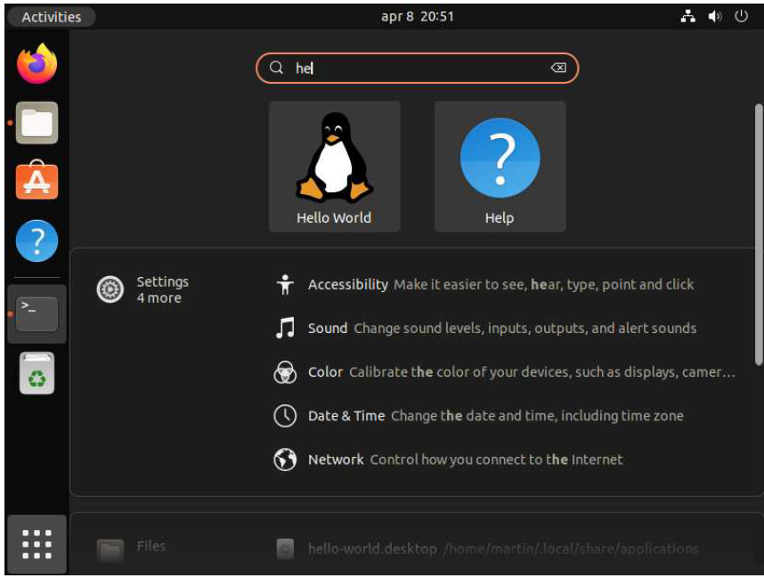

> 图267：应用程序会在Ubuntu的搜索面板中显示，并且也会出现在其他环境的菜单中。

如果您运行该应用程序，图标将如预期般显示。

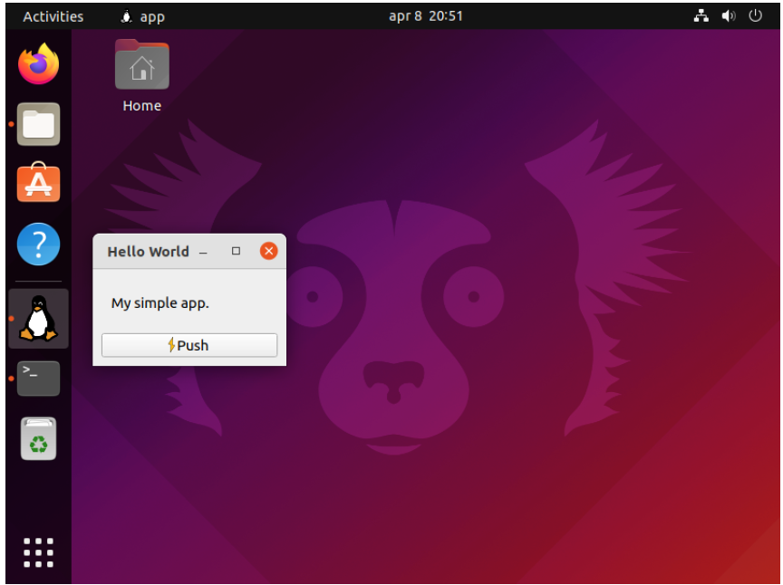

> 图268：应用程序正常运行，所有图标均按预期显示。

### 脚本化构建过程

我们已经详细介绍了如何从一个 PyQt6 应用程序构建可安装的 Ubuntu `.deb` 软件包的步骤。虽然一旦您掌握了方法，这个过程相对简单，但如果您需要经常进行这项工作，它可能会变得相当繁琐且容易出错。

为了避免问题，我建议使用简单的 Bash 脚本与 fpm 的自动化工具进行脚本化处理。

#### `package.sh`

请您将文件保存到项目根目录，并使用 `chmod +x` 命令使其可执行。

*Listing 262. packaging/installer/linux/package.sh*

```sh
#!/bin/sh
# 创建文件夹.
[ -e package ] && rm -r package
mkdir -p package/opt
mkdir -p package/usr/share/applications
mkdir -p package/usr/share/icons/hicolor/scalable/apps

# 复制文件（更改图标名称，为非缩放图标添加行）
cp -r dist/hello-world package/opt/hello-world
cp icons/penguin.svg
package/usr/share/icons/hicolor/scalable/apps/hello-world.svg
cp hello-world.desktop package/usr/share/applications

# 更改权限
find package/opt/hello-world -type f -exec chmod 644 -- {} +
find package/opt/hello-world -type d -exec chmod 755 -- {} +
find package/usr/share -type f -exec chmod 644 -- {} +
chmod +x package/opt/hello-world/hello-world
```

#### `.fpm 文件`

`fpm` 允许您将打包配置存储在配置文件中。文件名必须为 `.fpm`，且必须位于运行 fpm 工具的文件夹中。我们的配置如下。

*Listing 263. packaging/installer/linux/.fpm*

```.fpm
-C package
-s dir
-t deb
-n "hello-world"
-v 0.1.0
-p hello-world.deb
```


> 在执行 fpm 时，您可以通过传递命令行参数来覆盖任何您喜欢的选项，就像平时一样。

#### 执行构建

有了这些脚本，我们的应用程序可以使用以下命令进行可重复打包：

```bash
pyinstaller hello-world.spec
./package.sh
fpm
```

您可以根据自己的项目需求，自由地进一步自定义这些构建脚本！

在本章中，我们详细介绍了如何从PyInstaller获取一个可运行的构建版本，并使用 `fpm` 将其打包成适用于Ubuntu的可分发Linux包。按照这些步骤操作，您应该能够将自己的应用程序打包，并使其可供他人使用。
