# 模型视图架构

> …只要设计得当，这些功能就能以较低的成本实现。
>
> ——丹尼斯·里奇(Dennis Ritchie，C语言之父)

当您开始使用 PyQt6 构建更复杂的应用程序时，您可能会遇到将控件与数据保持同步的问题。

存储在控件（例如简单的 `QListWidget`）中的数据在 Python 中难以操作——更改需要先获取项目、获取数据，然后再将其设置回原位。对此问题的默认解决方案是在 Python 中保留外部数据表示形式，然后将更新复制到数据和控件，或者直接根据数据重写整个控件。当您开始处理较大的数据时，这种方法可能会对应用程序的性能产生影响。

幸运的是，Qt 为此提供了一个解决方案——ModelViews(模型视图架构)。ModelViews 是标准显示控件的强大替代方案，它使用标准化的模型接口与数据源进行交互——从简单的数据结构到外部数据库。这可以隔离您的数据，意味着您可以将其保存在任何您喜欢的结构中，而视图则负责呈现和更新。

本章介绍了Qt模型视图架构的关键方面，并利用它在PyQt6中构建一个简单的桌面待办事项应用程序。

## 17. 模型视图架构 —— 模型视图控制器

模型-视图-控制器（Model–View–Controller, MVC）是一种用于开发用户界面的架构模式。它将应用程序划分为三个相互关联的部分，将数据的内部表示与数据如何呈现给用户以及如何从用户接收数据分离。

MVC模式将界面划分为以下组件——

- **模型**，包含应用程序正在处理的数据结构。
- **视图**是向用户展示的任何信息表示形式，无论是图形还是表格。同一数据可以有多个视图。
- **控制器**接受用户输入，将其转换为命令并应用于模型或视图。

在 Qt 领域，视图与控制器之间的区别有些模糊。Qt 通过操作系统接受来自用户的输入事件，并将这些事件委托给控件（控制器）进行处理。然而，控件也会将自己的状态滑块呈现给用户，因此它们完全属于视图。与其纠结于如何划分界限，Qt 更倾向于将视图与控制器视为一个整体。然而，控件也处理向用户显示自己的状态，将它们直接放在视图中。与其纠结于如何划分界限，不如在 Qt 中将视图和控制器合并在一起，创建一个模型/视图控制器架构——为了简单起见，称为“模型视图”。

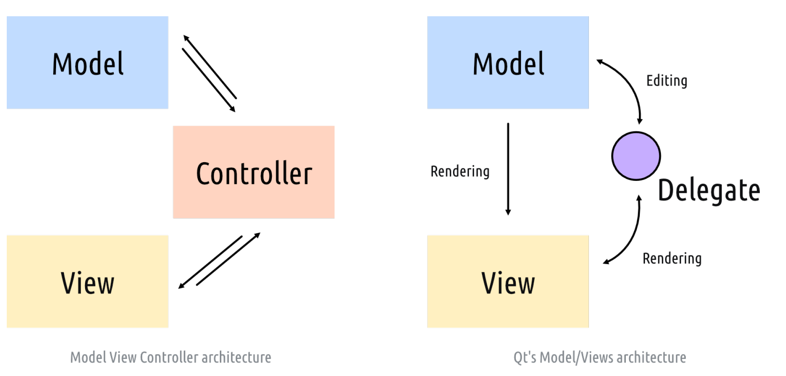

> 图133：MVC 模型与 Qt 模型/视图架构的比较

重要的是，数据本身与数据呈现方式之间的区别得到了保留。

### 模型视图

模型充当数据存储与视图控制器之间的接口。模型存储数据（或对其的引用），并通过一个标准化的 API (应用程序接口)将这些数据呈现出来，视图随后消费并将其呈现给用户。多个视图可以共享相同的数据，并以完全不同的方式呈现它。

您可以使用任何“数据存储”来构建模型，例如标准的Python列表或字典，或数据库（通过Qt本身或SQLAlchemy）——这完全由您决定。

这两个部分主要负责——

1. **模型**存储数据或对数据的引用，并返回单个或记录的范围，以及相关的元数据或显示指令。
2. **视图**从模型请求数据，并将返回的结果显示在控件上。

## 18. 一个简单的模型视图——待办事项列表

为了演示如何在实际中使用 ModelViews ，我们将实现一个非常简单的桌面待办事项列表。该列表将包含一个 `QListView` 用于显示待办事项列表，一个 `QLineEdit` 用于输入新事项，以及一组按钮用于添加、删除或标记事项为已完成。


> 本示例的文件位于源代码中。

### 用户界面

该简洁的用户界面使用Qt Creator进行布局，并保存为 `mainwindow.ui` 文件。该 `.ui` 文件已包含在本书的下载内容中。


> 图134：在Qt Creator中设计用户界面

请您按照之前所述，使用命令行工具将 `.ui` 文件转换为 Python 文件。

这将生成一个名为 `MainWindow.py` 的文件，其中包含我们在 Qt Designer 中设计的自定义窗口类。该文件可像普通文件一样导入到我们的应用程序代码中——一个用于显示用户界面的基本骨架应用程序示例如下所示：

*Listing 95. model-views/todo_skeleton.py*

```python
import sys

from PyQt6 import QtCore, QtGui, QtWidgets
from PyQt6.QtCore import Qt

from MainWindow import Ui_MainWindow


class MainWindow(QtWidgets.QMainWindow, Ui_MainWindow):
    def __init__(self):
        super().__init__()
        self.setupUi(self)
        
        
app = QtWidgets.QApplication(sys.argv)
window = MainWindow()
window.show()
app.exec()
```

> 🚀 **运行它吧！** 您会看到窗口弹出，不过目前还无法使用任何功能

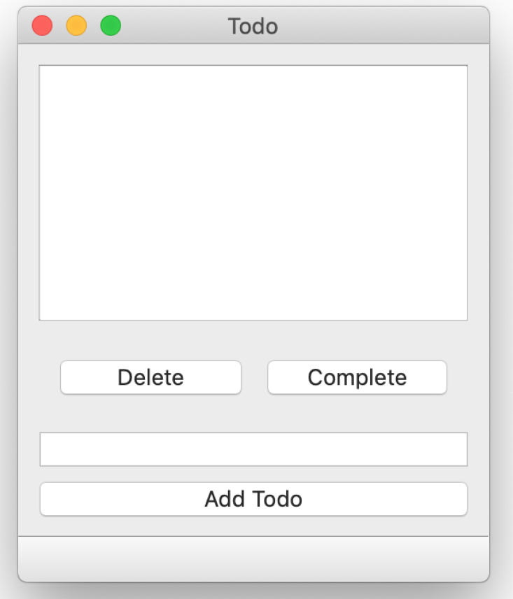

> 图135：主窗口

界面中的控件被赋予了下表中所示的 ID：

| 对象名称         | 类型          | 描述                                             |
| ---------------- | ------------- | ------------------------------------------------ |
| `todoView`       | `QListView`   | 当前待办事项列表                                 |
| `todoEdit`       | `QLineEdit`   | 创建新待办事项的文本输入框                       |
| `addButton`      | `QPushButton` | 创建新的待办事项，将其添加到待办事项列表中       |
| `deleteButton`   | `QPushButton` | 删除当前选中的待办事项，将其从待办事项列表中移除 |
| `completeButton` | `QPushButton` | 将当前选中的待办事项标记为已完成                 |

我们将使用这些标识符在后续步骤中与应用程序逻辑进行关联。

### 模型

我们通过从基础实现类继承来定义自定义模型，从而能够专注于模型中独特的部分。Qt 提供了多种不同的模型基础类，包括列表、树和表格（适用于电子表格）。

在此示例中，我们将结果显示到 `QListView` 中。与此对应的基础模型是  `QAbstractListModel`。我们的模型轮廓定义如下：

*Listing 96. model-views/todo_1.py*

```python
class TodoModel(QAbstractListModel):
    def __init__(self, todos=None):
        super().__init__()
        self.todos = todos or []
        
    def data(self, index, role):
        if role == Qt.ItemDataRole.DisplayRole:
            status, text = self.todos[index.row()]
            return text
        
    def rowCount(self, index):
        return len(self.todos)
```

`.todos` 变量是我们的数据存储。`rowcount()` 和 `data()` 方法是列表模型必须实现的标准模型方法。我们将在下面依次介绍这些方法。

#### .todos list

我们的模型数据存储为 `.todos`，这是一个简单的 Python 列表，其中我们将存储一个元组，格式为 `[(bool, str), (bool, str), (bool, str)]`，其中 `bool` 表示条目的完成状态，`str` 表示待办事项的文本内容。

我们在启动时将 `self.todo` 初始化为空列表，除非通过 `todos` 关键字参数传入了一个列表。


> 如果提供的 `todos` 为真（即除空列表、布尔值 `False` 或默认值 None 以外的任何值），`self.todos = todos or []` 就会将 `self.todos` 设置为这个值，否则会将其设置为空列表 `[]`。

要创建此模型的实例，我们可以简单地执行以下操作：

```python
model = TodoModel() #创建一个空的待办事项列表
```

或者传递一个现有的列表：

```python
todos = [(False, 'an item'), (False, 'another item')]
model = TodoModel(todos)
```

#### .rowcount()

`.rowcount()` 方法由视图调用，用于获取当前数据中的行数。视图需要此信息以确定其可从数据存储中请求的最大索引（`rowcount - 1`）。由于我们使用 Python 列表作为数据存储，该方法的返回值即为列表的 `len()` 值。

#### .data()

这是模型的核心，它处理来自视图的数据请求，并返回相应的结果。它接收两个参数 `index` 和 `role`。

`index` 是视图请求的数据的位置/坐标，可通过两种方法 `.row()` 和 `.column()` 获取每个维度中的位置。对于列表视图，列可以忽略。


> 对于我们的 `QListView`，列始终为0，可以忽略。但是，对于2D数据，例如在电子表格视图中，您需要使用此列。

`role` 是一个标志，指示视图请求的数据类型。这是因为 `.data()` 方法实际上承担的责任不仅仅是核心数据。它还处理样式信息、工具提示、状态栏等请求——基本上是任何可以由数据本身提供的信息。

`Qt.ItemDataRole.DisplayRole` 的命名有些奇怪，但这表明视图正在向我们请求“请提供要显示的数据”。`data` 还可以接收其他角色，以进行样式设置或请求“可编辑”格式的数据。

| 角色                             | 值   | 描述                                                         |
| -------------------------------- | ---- | ------------------------------------------------------------ |
| `Qt.ItemDataRole.DisplayRole`    | `0`  | 以文本形式渲染的关键数据。 [QString](https://doc.qt.io/qt-5/qstring.html) |
| `Qt.ItemDataRole.DecorationRole` | `1`  | 要以图标形式渲染为装饰的数据。[QColor](https://doc.qt.io/qt-5/qcolor.html)、[QIcon](https://doc.qt.io/qt-5/qicon.html) 或 [QPixmap](https://doc.qt.io/qt-5/qpixmap.html) |
| `Qt.ItemDataRole.EditRole`       | `2`  | 以适合在编辑器中编辑的格式呈现的数据。 [QString](https://doc.qt.io/qt-5/qstring.html) |
| `Qt.ItemDataRole.ToolTipRole`    | `3`  | 项目工具提示中显示的数据. [QString](https://doc.qt.io/qt-5/qstring.html) |
| `Qt.ItemDataRole.StatusTipRole`  | `4`  | 状态栏中显示的数据.[QString](https://doc.qt.io/qt-5/qstring.html) |
| `Qt.ItemDataRole.WhatsThisRole`  | `5`  | 在“这是什么？”模式下显示的项目数据.[QString](https://doc.qt.io/qt-5/qstring.html) |
| `Qt.ItemDataRole.SizeHintRole`   | `13` | 用于提供给视图的项的尺寸提示. [Qsize](https://doc.qt.io/qt-5/qsize.html) |

要查看可用的所有角色列表，请参阅 [Qt ItemDataRole 文档](https://doc.qt.io/qt-5/qt.html#ItemDataRole-enum)。我们的待办事项列表仅使用 `Qt.ItemDataRole.DisplayRole` 和 `Qt.ItemDataRole.DecorationRole`。

### 基本实现

下面的代码展示了我们在应用程序骨架中创建的基本模型，该模型包含将模型显示在界面的必要代码——尽管目前它是空的！我们将在此基础上添加模型代码和应用程序逻辑。

*Listing 97. model-views/todo_1b.py*

```python
import sys

from PyQt6.QtCore import QAbstractListModel, Qt
from PyQt6.QtWidgets import QApplication, QMainWindow

from MainWindow import Ui_MainWindow


class TodoModel(QAbstractListModel):
    def __init__(self, todos=None):
        super().__init__()
        self.todos = todos or []
        
    def data(self, index, role):
        if role == Qt.ItemDataRole.DisplayRole:
            status, text = self.todos[index.row()]
            return text
        
    def rowCount(self, index):
        return len(self.todos)
    
class MainWindow(QMainWindow, Ui_MainWindow):
    def __init__(self):
        super().__init__()
        self.setupUi(self)
        self.model = TodoModel()
        self.todoView.setModel(self.model)
        
        
app = QApplication(sys.argv)
window = MainWindow()
window.show()
app.exec()
```

我们按照之前的方式定义`TodoModel` 并初始化 `MainWindow` 对象。在 `MainWindow` 的`__init__`方法中，我们创建 `TodoModel` 的实例并将其设置为 `todo_view`。将此文件保存为 `todo.py` 并使用以下命令运行：

```python
python3 todo.py
```

虽然目前还看不到太多内容，但 `QListView` 和我们的模型实际上已经开始工作了。如果您在`MainWindow` 类中的 `TodoModel` 中添加一些默认数据，您就会看到它出现在列表中。

```python
self.model = TodoModel(todos=[(False, 'my first todo')])
```

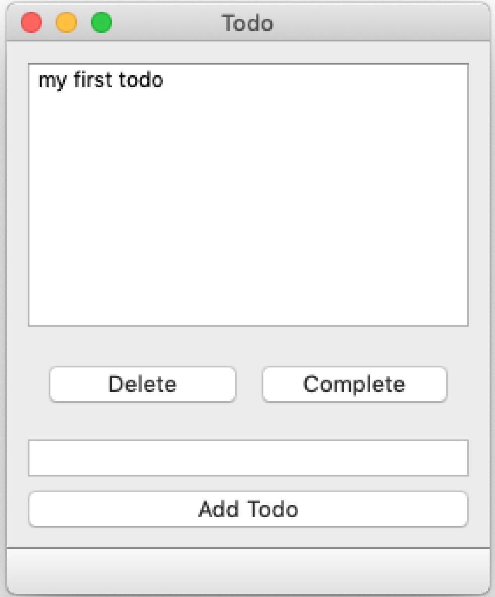

> 图136：QListView 显示硬编码的待办事项

您可以继续手动添加项目，它们将按顺序显示在 `QListView` 中。接下来，我们将实现从应用程序内部添加项目的功能。

首先在 `MainWindow` 上创建一个名为 `add` 的新方法。这是我们的回调函数，它将负责将输入中的当前文本作为新待办事项添加。将此方法连接到 `__init__` 块末尾的 `addButton.pressed` 信号。

*Listing 98. model-views/todo_2.py*

```python
class MainWindow(QMainWindow, Ui_MainWindow):
    def __init__(self):
        super().__init__()
        self.setupUi(self)
        self.model = TodoModel()
        self.todoView.setModel(self.model)
        # 连接到按钮.
        self.addButton.pressed.connect(self.add)
        
    def add(self):
        """
        将一项内容添加到我们的待办事项列表中，从 QLineEdit .todoEdit 中获取文本，然后清除它。
        """
        text = self.todoEdit.text()
        # 清楚字符串末尾的尾随空格
        text = text.strip()
        if text: # 不要添加空字符串
            # 通过模型访问该列表
            self.model.todos.append((False, text))
            # 触发刷新
            self.model.layoutChanged.emit() #1
            # 清空输入(input)
            self.todoEdit.setText("")
```

> 1. 这里，我们发出一个模型信号 `.layoutChanged`，让视图知道数据的形状已经改变。这会触发整个视图的刷新。如果您省略了这一行，待办事项仍然会被添加，但 `QListView` 不会更新。

如果只是数据发生了改变，但行/列数未受影响，则可以使用 `.dataChanged()` 信号。这也会使用左上角和右下角的位置来定义数据中发生改变的区域，以避免重新绘制整个视图。

### 连接其他操作

现在，我们可以连接按钮的其余信号，并添加辅助函数来执行删除和完成操作。我们像之前一样将按钮信号添加到 `__init__` 块中。

```python
        self.addButton.pressed.connect(self.add)
        self.deleteButton.pressed.connect(self.delete)
        self.completeButton.pressed.connect(self.complete)
```

然后定义一个新的 `delete` 方法，如下所示 ——

*Listing 99. model-views/todo_3.py*

```python
class MainWindow(QMainWindow, Ui_MainWindow):
    
    def delete(self):
        indexes = self.todoView.selectedIndexes()
        if indexes:
            # 索引是一个单选模式下的单项列表
            index = indexes[0]
            # 删除该项并刷新
            del self.model.todos[index.row()]
            self.model.layoutChanged.emit()
            # 清除选中项（因其已不再有效）
            self.todoView.clearSelection()
```

我们使用 `self.todoView.selectedIndexes` 来获取索引（实际上是一个单项列表，因为我们处于单选模式），然后使用 `.row()` 作为索引进入我们模型上的待办事项列表。我们使用 Python 的 `del` 操作符删除索引项，然后触发 `layoutChanged` 信号，因为数据的形状已经发生了改变。

最后，我们清除活动选择，因为您选择的项现在已不存在，且该位置本身可能已超出范围（如果您选择了最后一个项）。


> 您可以让操作更智能一些，改为选择列表中相邻的项。

`complete` 方法如下所示 —

*Listing 100. model-views/todo_4.py*

```python
class MainWindow(QMainWindow, Ui_MainWindow):
    def complete(self):
        indexes = self.todoView.selectedIndexes()
        if indexes:
            index = indexes[0]
            row = index.row()
            status, text = self.model.todos[row]
            self.model.todos[row] = (True, text)
            # .dataChanged 方法接受左上角和右下角坐标，且这两个坐标相等。
            # 对于单一选择。
            self.model.dataChanged.emit(index, index)
            # 清除选中内容（因其已不再有效）。
            self.todoView.clearSelection()
```

这与删除操作使用相同的索引，但这次我们从模型 `.todos` 列表中获取该项，然后将状态替换为 `True`。


> 我们必须进行这种查找替换操作，因为我们的数据以Python元组的形式存储，元组是不可变的。

与标准 Qt 控件的关键区别在于，我们直接对数据进行更改，只需通知 Qt 发生了某些更改即可——控件状态的更新由滑块自动完成。

### 使用 DecorationRole

如果您运行该应用程序，您会发现添加和删除功能均可正常使用，但尽管完成项的功能正常，视图中却没有相应的显示提示。我们需要更新模型，为视图提供一个指示器，用于显示项已完成的状态。更新后的模型如下所示。

*Listing 101. model-views/todo_5.py*

```python
import os

basedir = os.path.dirname(__file__)

tick = QImage(os.path.join(basedir, "tick.png"))

class TodoModel(QAbstractListModel):
    def __init__(self, *args, todos=None, **kwargs):
        super(TodoModel, self).__init__(*args, **kwargs)
        self.todos = todos or []
        
    def data(self, index, role):
        if role == Qt.ItemDataRole.DisplayRole:
            status, text = self.todos[index.row()]
            return text
        
        if role == Qt.ItemDataRole.DecorationRole:
            status, text = self.todos[index.row()]
            if status:
                return tick
            
     def rowCount(self, index):
        return len(self.todos)
```


> 我们使用之前介绍的 `basedir` 技术加载图标，以确保无论脚本在何处运行，路径都是正确的。我使用的图标来自 [p.yusukekamiyamane](http://p.yusukekamiyamane.com/) 的Fugue图标集。

我们使用一个勾选图标 `tick.png` 来表示已完成的项目，并将该图标加载到名为 `tick` 的 `QImage` 对象中。在模型中，我们实现了对 `Qt.ItemDataRole.DecorationRole` 的处理程序，该处理程序会为状态为 `True`（表示已完成）的行返回勾选图标。


> 除了图标，您还可以返回一种颜色，例如：`QtGui.QColor(‘green’)`，它将被绘制为实心正方形。

运行该应用后，您现在应该能够将项目标记为已完成。

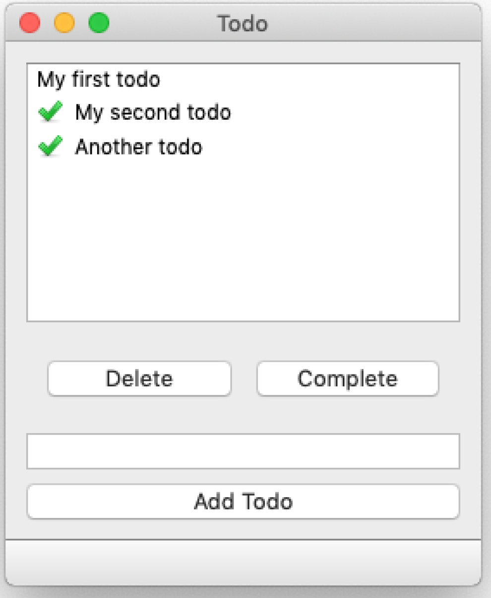

> 图137：全部完成

### 持久化数据存储

我们的待办事项应用程序运行良好，但它有一个致命缺陷——它会在您关闭应用程序后立即忘记你的待办事项。虽然认为自己没有事情可做可能会带来短暂的平静感，但从长远来看，这可能不是一个好主意。

解决方案是实现某种持久化数据存储。最简单的方法是使用简单的文件存储，我们在启动时从JSON或Pickle文件中加载项，并写回任何更改。

为此，我们在 `MainWindow` 类中定义两个新方法—— `load` 和 `save` 。这两个方法分别从名为 `data.json` 的 JSON 文件（如果存在，则忽略文件不存在时的错误）中加载数据到  `self.model.todos`，并将当前的 `self.model.todos` 写入到同一个文件中。

*Listing 102. model-views/todo_6.py*

```python
    def load(self):
        try:
            with open("data.json", "r") as f:
                self.model.todos = json.load(f)
        except Exception:
            pass
        
    def save(self):
        with open("data.json", "w") as f:
            data = json.dump(self.model.todos, f)
```

要持久化数据的更改，我们需要在任何修改数据的方法末尾添加 `.save()` 处理程序，并在模型创建后在 `__init__` 块中添加 `.load()` 处理程序。

最终的代码如下所示——

*Listing 103. mode-views/todo_complete.py*

```python
import json
import os
import sys

from PyQt6.QtCore import QAbstractListModel, Qt
from PyQt6.QtGui import QImage
from PyQt6.QtWidgets import QApplication, QMainWindow
from MainWindow import Ui_MainWindow

basedir = os.path.dirname(__file__)

tick = QImage(os.path.join(basedir, "tick.png"))


class TodoModel(QAbstractListModel):
    def __init__(self, todos=None):
        super().__init__()
        self.todos = todos or []
        
    def data(self, index, role):
        if role == Qt.ItemDataRole.DisplayRole:
            status, text = self.todos[index.row()]
            return text
        
        if role == Qt.ItemDataRole.DecorationRole:
            status, text = self.todos[index.row()]
            if status:
                return tick
            
    def rowCount(self, index):
        return len(self.todos)
    
    
class MainWindow(QMainWindow, Ui_MainWindow):
    def __init__(self):
        super().__init__()
        self.setupUi(self)
        self.model = TodoModel()
        self.load()
        self.todoView.setModel(self.model)
        self.addButton.pressed.connect(self.add)
        self.deleteButton.pressed.connect(self.delete)
        self.completeButton.pressed.connect(self.complete)
        
    def add(self):
        """
        将一项内容添加到我们的待办事项列表中，从 QLineEdit .todoEdit 中获取文本，然后清除它。
        """
        text = self.todoEdit.text()
        # 清楚字符串末尾的尾随空格
        text = text.strip()
        if text: # 不要添加空字符串
            # 通过模型访问该列表
            self.model.todos.append((False, text))
            # 触发刷新
            self.model.layoutChanged.emit() #1
            # 清空输入(input)
            self.todoEdit.setText("")
            self.save()
            
    def delete(self):
        indexes = self.todoView.selectedIndexes()
        if indexes:
            # 索引是一个单选模式下的单项列表
            index = indexes[0]
            # 删除该项并刷新
            del self.model.todos[index.row()]
            self.model.layoutChanged.emit()
            # 清除选中项（因其已不再有效）
            self.todoView.clearSelection()
            self.save()
            
    def complete(self):
        indexes = self.todoView.selectedIndexes()
        if indexes:
            index = indexes[0]
            row = index.row()
            status, text = self.model.todos[row]
            self.model.todos[row] = (True, text)
            # .dataChanged 方法接受左上角和右下角坐标，且这两个坐标相等。
            # 对于单一选择。
            self.model.dataChanged.emit(index, index)
            # 清除选中内容（因其已不再有效）。
            self.todoView.clearSelection()
            self.save()
            
    def load(self):
        try:
            with open("data.json", "r") as f:
                self.model.todos = json.load(f)
        except Exception:
            pass
        
    def save(self):
        with open("data.json", "w") as f:
            data = json.dump(self.model.todos, f)
            
            
app = QApplication(sys.argv)
window = MainWindow()
window.show()
app.exec()
```

如果您的应用程序中的数据有可能变得庞大或复杂，您可能更倾向于使用实际的数据库来存储它。Qt 提供了与 SQL 数据库交互的模型，我们稍后将详细介绍。


> 另一个有趣的 `QListView` 示例请参见我的 [媒体播放器应用程序示例](https://www.pythonguis.com/apps/failamp-multimedia-player/)。该示例使用Qt内置的 `QMediaPlaylist` 作为数据存储，其内容通过 `QListView` 进行显示。

## 19. 使用numpy和pandas处理模型视图中的表格数据

在上一节中，我们介绍了模型视图（Model View）架构。然而，我们仅涉及了模型视图中的一种——`QListView`。在PyQt6中，还有另外两种模型视图可用——`QTableView` 和`QTreeView`，它们分别提供表格（类似Excel）和树形（类似文件目录浏览器）视图，且均使用相同的 `QStandardItemModel` 。

在本节中，我们将探讨如何使用PyQt6中的 `QTableView` 来建模数据、格式化显示值以及添加条件格式化。

您可以使用模型视图与任何数据源配合使用，只要您的模型能够以Qt能够识别的格式返回数据。在Python中处理表格数据为我们加载和处理数据提供了多种可能性。我们将从一个简单的嵌套列表开始，然后逐步整合您的Qt应用程序与流行的 numpy 和 pandas 库。这将为您构建以数据为中心的应用程序奠定坚实的基础。

### `QTableView` 入门指南

`QTableView` 是一个 Qt 视图控件，以类似电子表格的表格视图显示数据。与模型视图架构中的所有控件一样，它使用单独的模型向视图提供数据和呈现信息。模型中的数据可以根据需要进行更新，视图会收到这些更改的通知，从而重新绘制/显示更改。通过自定义模型，可以对数据的呈现方式进行大量控制。

要使用该模型，我们需要一个基本的应用程序结构和一些示例数据。下文展示了一个简单的示例，其中定义了一个自定义模型，并使用一个简单的嵌套列表作为数据存储。

*Listing 104. tableview_demo.py*

```python
import sys
from PyQt6 import QtCore, QtGui, QtWidgets
from PyQt6.QtCore import Qt


class TableModel(QtCore.QAbstractTableModel):
    def __init__(self, data):
        super().__init__()
        self._data = data
        
    def data(self, index, role):
        if role == Qt.ItemDataRole.DisplayRole:
            # 请参见下文的嵌套列表数据结构。
            # .row() 方法用于访问外部列表中的元素。
            # .column() 方法用于访问子列表中的元素。
            return self._data[index.row()][index.column()]
        
    def rowCount(self, index):
        # 外部列表的长度。
        return len(self._data)
    
    def columnCount(self, index):
        # 以下代码取第一个子列表，并返回其长度（仅在所有行长度相等时有效）
        return len(self._data[0])
    
    
class MainWindow(QtWidgets.QMainWindow):
    def __init__(self):
        super().__init__()
        
        self.table = QtWidgets.QTableView()
        
        data = [
            [4, 1, 3, 3, 7],
            [9, 1, 5, 3, 8],
            [2, 1, 5, 3, 9],
        ]
        
        self.model = TableModel(data)
        self.table.setModel(self.model)
        self.setCentralWidget(self.table)
        
        
app = QtWidgets.QApplication(sys.argv)
window = MainWindow()
window.show()
app.exec()
```

与之前的模型视图示例一样，我们创建 `QTableView` 控件，然后创建自定义模型的实例（我们编写该模型以接受数据源作为参数），然后将模型设置到视图上。这就是我们需要做的全部工作——视图控件现在使用模型来获取数据，并确定如何绘制数据。

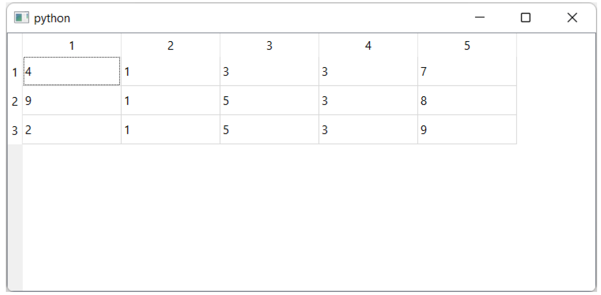

> 图138：基本表格示例

### 嵌套 `list` 作为二维数据存储结构

对于一张表格，您需要一个二维数据结构，包含列和行。如上例所示，您可以使用嵌套Python列表来建模一个简单的二维数据结构。我们将花一点时间来查看这个数据结构及其局限性，如下所示——

```python
table = [
    [4, 1, 3, 3, 7],
    [9, 1, 5, 3, 8],
    [2, 1, 5, 3, 9],
]
```

嵌套列表是一个“值的列表集合”——一个外层列表包含多个子列表，而这些子列表本身又包含值。由于这种结构，要访问单个值（或“单元格”），必须进行两次索引操作：首先返回一个内部 `list` 对象，然后再次对该 `list` 进行索引。

典型的布局是外层列表存放行，每个嵌套列表存放列的值。采用这种布局时，索引操作首先按行索引，然后按列索引——因此上述示例是一个3行5列的表格。值得注意的是，这种布局与源代码中的视觉布局相匹配。

对该表的第一次索引操作将返回一个嵌套子列表——

```python
row = 2
col = 4

>>> table[row]
[2, 1, 5, 3, 9]
```

然后再次对其进行索引以返回值 —

```python
>>> table[row][col]
9
```

请注意，使用此类结构无法直接返回整列数据，您需要遍历所有行。不过，您当然可以根据实际需求，将索引与列的关联关系进行调整，即根据是否更适合按列或按行访问数据，将第一个索引作为列进行使用。

```python
table = [
    [4, 9, 2],
    [1, 1, 1],
    [3, 5, 5],
    [3, 3, 2],
    [7, 8, 9],
]

row = 4 # 反转
col = 2 # 反转

>>> table[col]
[3, 5, 5]

>>> table[col][row]
9
```


> 该数据结构并未强制要求行或列的长度一致——一行可以包含5个元素，另一行则可能包含200个元素。然而，不一致的情况会导致表格视图出现错误。若您需要处理大型或复杂的数据表，请参阅后文的替代数据存储方案。

接下来，我们将更详细地探讨我们的自定义 `TableModel` ，并了解它如何与这个简单的数据结构配合使用，以显示相应的值。

### 编写自定义的 `QAbstractTableModel`

在模型视图架构中，模型负责提供用于视图显示的数据和展示元数据。为了在数据对象和视图之间进行交互，我们需要编写自己的自定义模型，该模型能够理解数据的结构。

要编写自定义模型，我们可以创建 `QAbstractTableModel` 的子类。自定义表格模型仅需实现三个方法：`data`、`rowCount` 和 `columnCount`。第一个方法返回表格中指定位置的数据（或呈现信息），后两个方法必须返回数据源维度的单个整数值。

```python
class TableModel(QtCore.QAbstractTableModel):
    
    def __init__(self, data):
        super(TableModel, self).__init__()
        self._data = data
        
    def data(self, index, role):
        if role == Qt.ItemDataRole.DisplayRole:
            # 请参见下文的嵌套列表数据结构。
            # .row() 方法用于访问外部列表中的元素。
            # .column() 方法用于访问子列表中的元素。
            return self._data[index.row()][index.column()]
        
    def rowCount(self, index):
        # 外部列表的长度。
        return len(self._data)
    
    def columnCount(self, index):
        # 以下代码取第一个子列表，并返回其长度（仅在所有行长度相等时有效）
        return len(self._data[0])
```


> QtCore.QAbstractTableModel 是一个抽象基类，这意味着它没有实现这些方法。如果您尝试直接使用它，它将无法工作，所以您必须继承它。

在 `__init__` 构造函数中，我们接受一个参数 `data`，并将其存储为实例属性 `self._data`，这样我们就可以从方法中访问它。传入的 `data` 结构是通过引用存储的，因此任何外部更改都会反映在这里。


> 要通知模型发生的变化，您需要使用 `self.model.layoutChanged.emit()` 触发模型的 `layoutChanged` 信号。

`data` 方法带两个参数 `index` 和 `role`。`index` 参数指定当前请求信息的表中位置，并提供 `.row()` 和 `.column()` 两个方法，分别返回视图中的行号和列号。在示例中，数据以嵌套列表形式存储，行号和列号用于按以下方式索引：`data[row][column]`。

视图对源数据的结构一无所知，而模型负责在视图的行和列与您自己的数据存储中的相应位置之间进行转换。

角色参数描述了方法在本次调用中应返回何种信息。为了获取要显示的数据，视图会调用该模型的数据方法，并指定角色为 `Qt.ItemDataRole.DisplayRole`。然而，角色还可以有其他许多值，包括 `Qt.ItemDataRole.BackgroundRole`、`Qt.ItemDataRole.CheckStateRole`、`Qt.ItemDataRole.DecorationRole`、`Qt.ItemDataRole.CheckStateRole`、`Qt.ItemDataRole.DecorationRole`、`Qt.ItemDataRole.FontRole`、`Qt.ItemDataRole.TextAlignmentRole` 和`Qt.ItemDataRole.ForegroundRole`，每个角色都期望返回特定值（详见后文）。


> `Qt.ItemDataRole.DisplayRole` 实际上期望返回一个字符串，尽管其他基本的 Python 类型，包括 `flaot`、`int` 和 `bool`，也将使用它们的默认字符串表示形式进行显示。然而，将这些类型格式化为自定义字符串通常更可取。

我们将稍后介绍如何使用这些其他角色类型，目前只需知道在返回用于显示的数据之前，您**必须**确保角色类型为 `Qt.ItemDataRole.DisplayRole`。

两个自定义方法 `columnCount` 和 `rowCount` 分别返回数据结构中的列数和行数。在我们这里使用的嵌套列表结构中，行数就等于外层列表中的元素个数，而列数等于内层列表中**某一个**列表的元素个数——假设所有内层列表的元素个数都相同。


> 如果这些方法返回的值过高，您会看到越界错误，如果返回的值过低，您将看到表格被截断。

### 数字和日期的格式设置

模型返回用于显示的数据预计为字符串。虽然整数（`int`）和浮点数（`float`）也会显示，但它们将使用默认的字符串表示形式，而复杂的 Python 类型则不会。要显示这些类型，或覆盖浮点数、整数或布尔值的默认格式化，您必须自行将这些类型格式化为字符串。

您可能会想通过将数据提前转换为字符串表来实现这一点。然而，这样做会使您难以继续处理表中的数据，无论是进行计算还是更新。

相反，您应该使用模型的数据方法按需进行字符串转换。通过这种方式，您可以继续使用原始数据，同时对数据的呈现方式拥有完全控制权——包括通过配置在运行时动态更改呈现方式。

以下是一个简单的自定义格式化器，它会从我们的数据表中查找值，并根据数据的 Python 类型以多种不同方式显示它们。

*Listing 105. tableview_format_1.py*

```python
import sys
from datetime import datetime #1

from PyQt6 import QtCore, QtGui, QtWidgets
from PyQt6.QtCore import Qt


class TableModel(QtCore.QAbstractTableModel):
    def __init__(self, data):
        super().__init__()
        self._data = data
        
    def data(self, index, role):
        if role == Qt.ItemDataRole.DisplayRole:
            # 获取原始值
            value = self._data[index.row()][index.column()]
            
            # 根据类型进行检查并相应渲染。
            if isinstance(value, datetime):
                # 渲染时间格式为 YYY-MM-DD。
                return value.strftime("%Y-%m-%d")
            
            if isinstance(value, float):
                # 将float类型保留小数点后两位
                return "%.2f" % value
            
            if isinstance(value, str):
                # 使用引号渲染字符串
                return '"%s"' % value
            
            # 默认值（未在上述内容中捕获的任何内容：例如int）
            return value
        
    def rowCount(self, index):
        return len(self._data)
    
    def columnCount(self, index):
        return len(self._data[0])
```

> 请注意文件开头的额外导入语句 `from datetime import datetime`。

请与下方的修改后示例数据配合使用，以查看其实际效果。

```python
data = [
    [4, 9, 2],
    [1, -1, 'hello'],
    [3.023, 5, -5],
    [3, 3, datetime(2017,10,1)],
    [7.555, 8, 9],
]
```

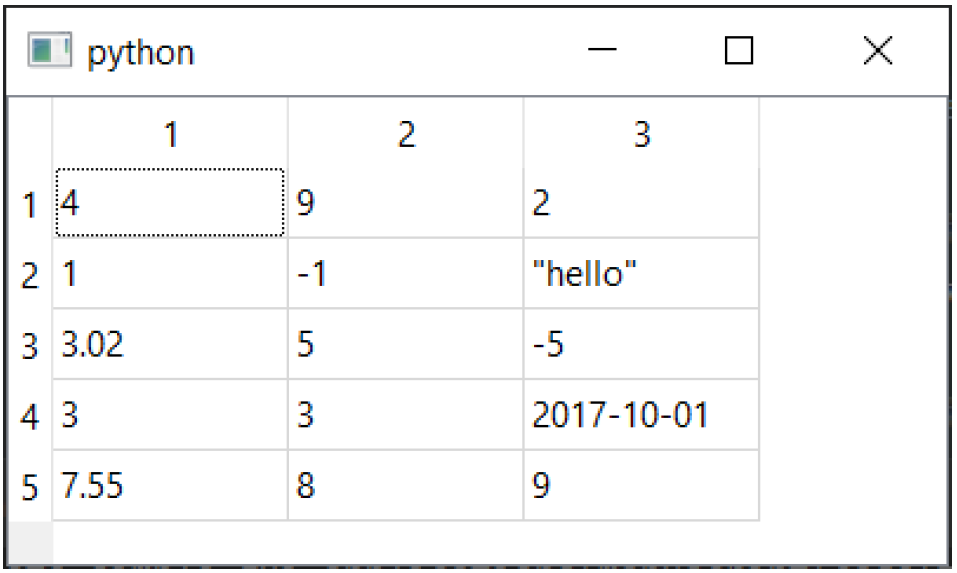

> 图139：自定义数据格式化

到目前为止，我们只探讨了如何自定义数据本身的格式。然而，模型接口为用户提供了对表格单元格显示方式的更多控制权，包括颜色和图标。在接下来的部分，我们将探讨如何利用模型来自定义 `QTableView` 的外观。

### 具有角色的样式和颜色

使用颜色和图标来突出显示数据表中的单元格可以帮助用户更轻松地查找和理解数据，或帮助用户选择或标记感兴趣的数据。Qt 允许从模型中完全控制所有这些功能，通过响应数据方法中的相关角色来实现。

针对各种角色类型，预期返回的类型如下所示：

| 角色                                | 类型                                         |
| ----------------------------------- | -------------------------------------------- |
| `Qt.ItemDataRole.BackgroundRole`    | `QBrush`(也可以是 `QColor` )                 |
| `Qt.ItemDataRole.CheckStateRole`    | `Qt.CheckState`                              |
| `Qt.ItemDataRole.DecorationRole`    | `QIcon` , `QPixmap` , `QColor`               |
| `Qt.ItemDataRole.DisplayRole`       | `QString`(也可以是 `int` , `float` , `bool`) |
| `Qt.ItemDataRole.FontRole`          | `QFont`                                      |
| `Qt.ItemDataRole.SizeHintRole`      | `QSize`                                      |
| `Qt.ItemDataRole.TextAlignmentRole` | `Qt.Alignment`                               |
| `Qt.ItemDataRole.ForegroundRole`    | `QBrush`(也可以是 `QColor` )                 |

通过响应特定的角色和索引组合，我们可以修改表格中特定单元格、列或行的外观——例如，为第三列中的所有单元格设置蓝色背景。

*Listing 106. tableview_format_2.py*

```python
   def data(self, index, role):
        if(
            role == Qt.ItemDataRole.BackgroundRole
            and index.column() == 2
        ):
            # 请参见下文的数据结构。
            return QtGui.QColor(Qt.GlobalColor.blue)
        
        # 现有的 `if role == Qt.ItemDataRole.DisplayRole:` 代码块已隐藏，以提高可读性。
```

通过使用索引从我们自己的数据中查找值，我们还可以根据数据中的值自定义外观。下面我们将介绍一些更常见的使用场景。

#### 文本对齐

在之前的格式化示例中，我们使用文本格式化将浮点数显示为小数点后2位。然而，在显示数字时，右对齐数字也是一种常见做法，这样可以更方便地比较不同数字列表中的数值。这可以通过在响应 `Qt.ItemDataRole.TextAlignmentRole` 时返回 `Qt.Alignment.AlignRight` 来实现，适用于任何数值类型。

修改后的数据方法如下所示。我们检查 `role == Qt.ItemDataRole.TextAlignmentRole`，并像之前一样通过索引查找值，然后确定值是否为数值。如果是，我们可以返回`Qt.Alignment.AlignVCenter + Qt.Alignment.AlignRight`，以实现垂直居中对齐和水平右对齐。

*Listing 107. tableview_format_3.py*

```python
    def data(self, index, role):
        if role == Qt.ItemDataRole.TextAlignmentRole:
            value = self._data[index.row()][index.column()]
            
            if isinstance(value, int) or isinstance(value, float):
                # 右对齐，垂直居中
                return(
                    Qt.AlignmentFlag.AlignVCenter
                    | Qt.AlignmentFlag.AlignRight
                )
                
        # 现有的 `if role == Qt.ItemDataRole.DisplayRole:` 代码块已隐藏，以提高可读性。
```


> 其他对齐方式也是可能的，包括`Qt.Alignment.AlignHCenter` 的实现水平居中对齐。您可以通过按位或运算将它们组合在一起，例如 `Qt.Alignment.AlignBottom | Qt.Alignment.AlignRight`。

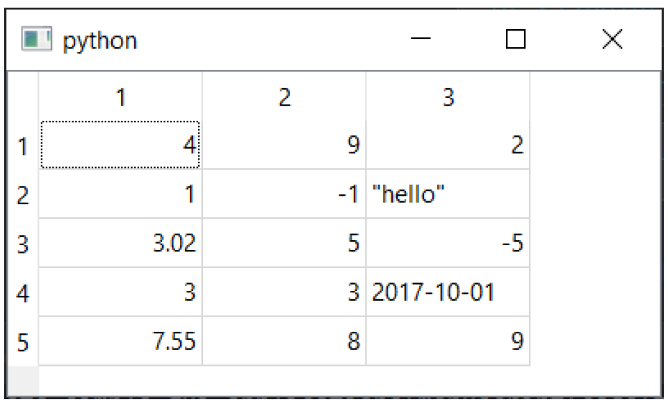

> 图140：QTableView 的单元格对齐

#### 文本颜色

如果您使用过Excel等电子表格软件，您可能对“条件格式化”这一概念有所了解。条件格式化是指您可以应用于单元格（或行、列）的规则，这些规则会根据单元格的值自动更改其文本和背景颜色。

这有助于可视化数据，例如使用红色表示负数，或通过从蓝到红的渐变色来突出显示数值范围（例如低至高）。

首先，下面的示例实现了一个处理程序，用于检查索引单元格中的值是否为数值且小于零。如果满足条件，则该处理程序返回文本（前景）颜色为红色。

*Listing 108. tableview_format_4.py*

```python
    def data(self, index, role):
        if role == Qt.ItemDataRole.ForegroundRole:
            value = self._data[index.row()][index.column()]
            
            if(
                isinstance(value, int) or isinstance(value, float)
            ) and value < 0:
                return QtGui.QColor("red")
            
            
         # 现有的 `if role == Qt.ItemDataRole.DisplayRole:` 代码块已隐藏，以提高可读性。
```

如果你将此添加到模型的数据处理程序中，所有负数现在将以红色显示。

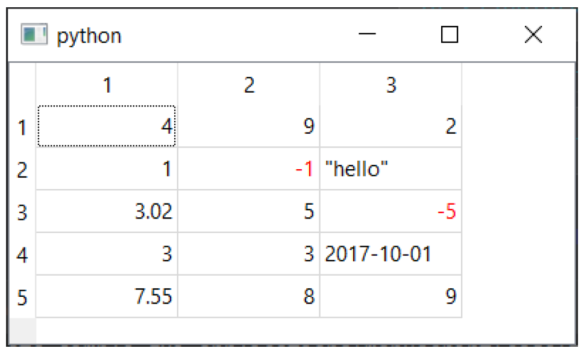

> 图141：QTableView 的文本格式设置，负数使用红色显示

#### 数值范围渐变

同样的原理可以用于对表格中的数值应用渐变色，例如，突出显示较低和较高的值。首先，我们定义颜色标尺，该标尺来自 [colorbrewer2.org](http://colorbrewer2.org/#type=diverging&scheme=RdBu&n=11)。

```python
COLORS = ['#053061', '#2166ac', '#4393c3', '#92c5de', '#d1e5f0',
'#f7f7f7', '#fddbc7', '#f4a582', '#d6604d', '#b2182b', '#67001f']
```

接下来，我们定义自定义处理函数，这次针对 `Qt.ItemDataRole.BackgroundRole`。该函数获取指定索引处的值，验证其为数值类型，然后执行一系列操作将其限制在 0…10 的范围内，以便用于索引我们的列表。

*Listing 109. tableview_format_5.py*

```python
    def data(self, index, role):
        if role == Qt.ItemDataRole.BackgroundRole:
            value = self._data[index.row()][index.column()]
            if isinstance(value, int) or isinstance(value, float):
                value = int(value) # 将值转换为整数以进行索引操作。
                
                # 将范围限制为-5到+5，然后转换为0到10。
                value = max(-5, value) # 值小于-5的变为-5
                value = min(5, value) # 值大于+5时，变为+5
                value = value + 5 # -5变为0，+5变为+10
                
                return QtGui.QColor(COLORS[value])
            
        # 现有的 `if role == Qt.ItemDataRole.DisplayRole:` 代码块已隐藏，以提高可读性。
```

这里用于将值转换为梯度的逻辑非常基础，会截取高/低值，且不调整数据范围。然而，您可以根据需要进行调整，只要您的处理函数最终返回的是 `QColor` 或 `QBrush` 即可。

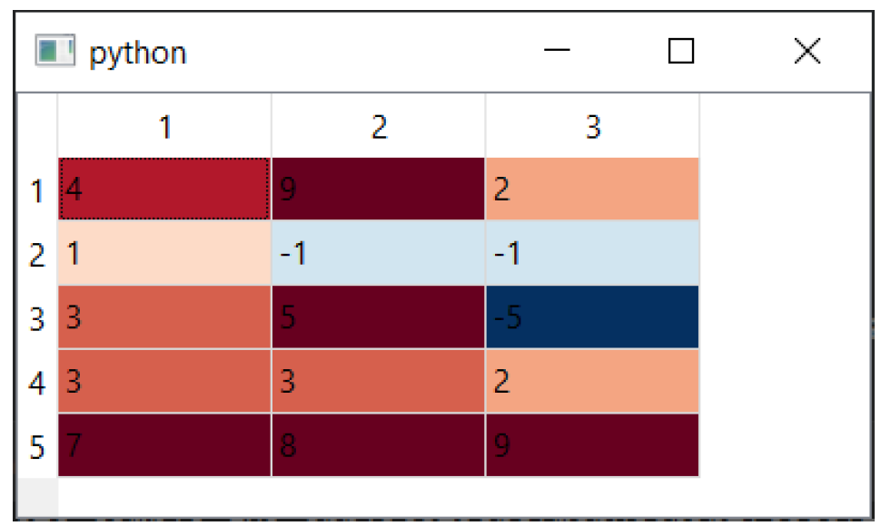

> 图142：带数字范围颜色渐变的QTableView

#### 图标与图像装饰

每个表格单元格包含一个小型装饰区域，可用于在数据左侧显示图标、图像或纯色块。此区域可用于指示数据类型，例如日历图标表示日期、勾号和叉号表示布尔值，或用于对数值范围进行更微妙的条件格式化。

以下是一些这些想法的简单实现。

##### 使用图标表示布尔/日期数据类型

对于日期，我们将使用 Python 的内置 `datetime` 类型。首先，在文件开头添加以下 import 语句以导入该类型。

```python
from datetime import datetime
```

然后，更新数据（在 `MainWindow.__init__` 中设置）以添加日期时间和布尔值（`True` 或 `False` 值），例如。

```python
data = [
    [True, 9, 2],
    [1, 0, -1],
    [3, 5, False],
    [3, 3, 2],
    [datetime(2019, 5, 4), 8, 9],
]
```

这些设置完成后，您可以更新模型数据方法，以显示图标和格式化日期（适用于日期类型），使用以下代码：

*Listing 110. tableview_format_6.py*

```python
import os

basedir = os.path.dirname(__file__)

class TableModel(QtCore.QAbstractTableModel):
    def __init__(self, data):
        super().__init__()
        self._data = data
        
    def data(self, index, role):
        if role == Qt.ItemDataRole.DisplayRole:
            value = self._data[index.row()][index.column()]
            if isinstance(value, datetime):
                return value.strftime("%Y-%m-%d")
            
            return value
        
        if role == Qt.ItemDataRole.DecorationRole:
            value = self._data[index.row()][index.column()]
            if isinstance(value, datetime):
                return QtGui.QIcon(
                    os.path.join(basedir, "calendar.png")
                )
                
    def rowCount(self, index):
        return len(self._data)
    
    def columnCount(self, index):
        return len(self._data[0])
```


> 我们使用之前介绍的 `basedir` 技术加载图标，以确保无论脚本如何运行，路径都是正确的。

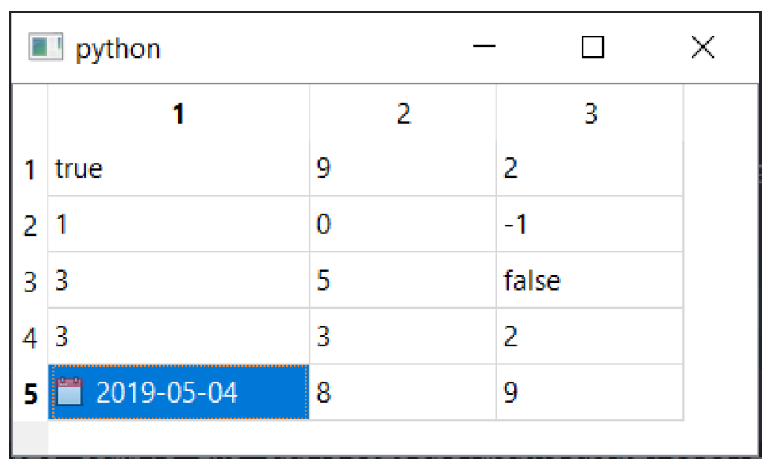

> 图143：QTableView 的格式化日期并显示指示图标

以下展示了如何使用勾选框和叉号分别表示布尔值的真（`True`）和假（`False`）

*Listing 111. tableview_format_7.py*

```python
    def data(self, index, role):
        if role == Qt.ItemDataRole.DecorationRole:
            value = self._data[index.row()][index.column()]
            if isinstance(value, bool):
                if value:
                    return QtGui.QIcon("tick.png")
                
                return QtGui.QIcon("cross.png")
```

当然，您可以将以上内容组合在一起，或者将 `Qt.ItemDataRole.DecorationRole` 和 `Qt.ItemDataRole.DisplayRole` 滑块进行任意组合。通常情况下，将每种类型归入同一个 if 分支会比较简单，或者随着模型的复杂程度增加，可以创建子方法来处理每种角色。

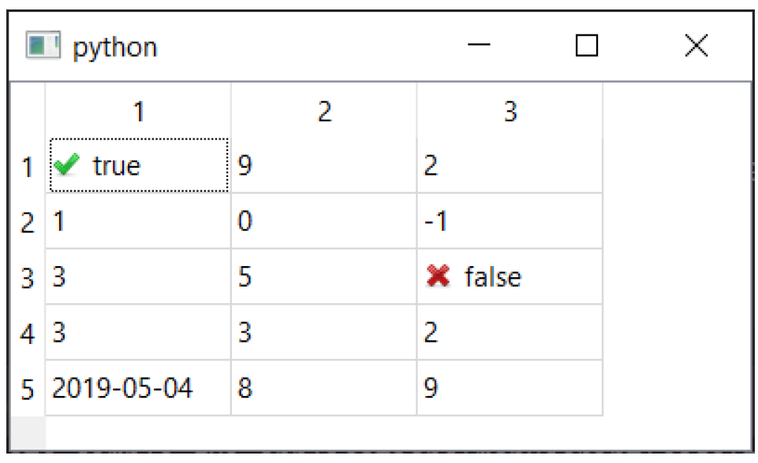

> 图144：QTableView 的布尔指示器

##### 色块

如果您为 `Qt.ItemDataRole.DecorationRole` 返回 `QColor`，则单元格左侧的图标位置将显示一个小方块。这与之前的 `Qt.ItemDataRole.BackgroundRole` 条件格式化示例完全相同，只是现在需要处理和响应 `Qt.ItemDataRole.DecorationRole`。

*Listing 112. tableview_format_8.py*

```python
    def data(self, index, role):
        if role == Qt.ItemDataRole.DecorationRole:
            value = self._data[index.row()][index.column()]
            
            if isinstance(value, datetime):
                return QtGui.QIcon(
                    os.path.join(basedir, "calendar.png")
                )
                
            if isinstance(value, bool):
                if value:
                    return QtGui.QIcon(
                        os.path.join(basedir, "tick.png")
                    )
                    
                return QtGui.QIcon(os.path.join(basedir, "cross.png"))
            
            if isinstance(value, int) or isinstance(value, float):
                value = int(value)
                
                # 将范围限制为-5到+5，然后转换为0到10。
                value = max(-5, value) # 值小于-5的变为-5
                value = min(5, value) # 值大于+5时，变为+5
                value = value + 5 # -5变为0，+5变为+10
                
                return QtGui.QColor(COLORS[value])
```

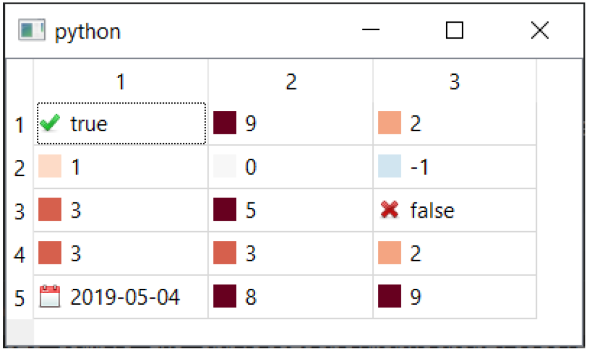

> 图145：QTableView 颜色块装饰

### 备选的 Python 数据结构

到目前为止，我们在示例中一直使用简单的嵌套 Python 列表来存储数据以供显示。对于简单的数据表，这种方法是可行的。然而，如果您正在处理大型数据表，Python 还提供了一些其他更好的选项，这些选项还附带额外的好处。在接下来的部分中，我们将探讨两个 Python 数据表库——numpy 和 pandas——以及如何将它们与 Qt 集成。

#### Numpy

Numpy 是一个库，为 Python 中的大型多维数组或矩阵数据结构提供支持。它对大型数组的高效、高性能处理，使 numpy 成为科学和数学应用的理想选择。这也使 numpy 数组成为 PyQt6 中大型、单类型数据表的良好数据存储。

##### 使用numpy作为数据源

为了支持 numpy 数组，我们需要对模型进行一系列修改，首先修改数据方法中的索引逻辑，然后调整行数和列数的计算方式，以适应 `rowCount` 和 `columnCount` 的计算。

标准的numpy API提供了对2D数组的元素级访问，通过在同一个切片操作中传入行和列，例如`_data[index.row(), index.column()]`。这比分两步进行索引操作更高效，如列表嵌套列表的示例所示。

在 NumPy 中，数组的维度可以通过 `.shape` 属性获取，该属性会返回一个元组，其中包含沿每个轴的维度。我们可以通过从该元组中选择正确的元素来获取每个轴的长度，例如 `_data.shape[0]` 即可获取第一个轴的大小。

以下完整示例演示了如何使用Qt的 `QTableView` 通过自定义模型显示一个 numpy 数组。

*Listing 113. model-views/tableview_numpy.py*

```python
import sys

import numpy as np
from PyQt6 import QtCore, QtGui, QtWidgets
from PyQt6.QtCore import Qt


class TableModel(QtCore.QAbstractTableModel):
    def __init__(self, data):
        super().__init__()
        self._data = data
        
    def data(self, index, role):
        if role == Qt.ItemDataRole.DisplayRole:
            # self._data[index.row()][index.column()] 也行
            value = self._data[index.row(), index.column()]
            return str(value)
        
    def rowCount(self, index):
        return self._data.shape[0]
    
    def columnCount(self, index):
        return self._data.shape[1]
    
    
class MainWindow(QtWidgets.QMainWindow):
    def __init__(self):
        super().__init__()
        
        self.table = QtWidgets.QTableView()
        data = np.array(
            [
                [1, 9, 2],
                [1, 0, -1],
                [3, 5, 2],
                [3, 3, 2],
                [5, 8, 9],
            ]
        )
        
        self.model = TableModel(data)
        self.table.setModel(self.model)
        
        self.setCentralWidget(self.table)
        self.setGeometry(600, 100, 400, 200)
        
        
app = QtWidgets.QApplication(sys.argv)
window = MainWindow()
window.show()
app.exec()
```


> 虽然简单的 Python 类型（如 `int` 和 `float`）会直接显示，无需转换为字符串，但 numpy 会使用自己的类型（例如 `numpy.int32`）来表示数组值。为了显示这些值，我们**必须**先将其转换为字符串。

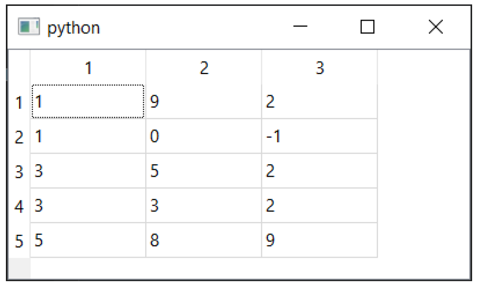

> 图146：使用 numpy 数组的QTableView


> 使用 `QTableView` 只能显示二维数组，然而如果您拥有更高维度的数据结构，您可以将 `QTableView` 与带标签或滚动条的用户界面结合使用，以实现对这些更高维度的访问和显示。

#### Pandas

Pandas 是一个常用于数据处理和分析的 Python 库。它提供了一个便捷的 API，用于从各种数据源加载二维表格数据并对其进行数据分析。通过将 numpy 的 `DataTable` 用作您的 `QTableView` 模型，您可以直接在应用程序中使用这些 API 加载和分析数据。

##### 使用Pandas作为数据源

将模型修改为与 numpy 兼容的改动相对较小，仅需对 `data` 方法中的索引进行调整，以及对 `rowCount` 和 `columnCount` 进行修改。`rowCount` 和 `columnCount` 的改动与 numpy 完全一致，使用 pandas 中的 `_data.shape` 元组来表示数据的维度。

对于索引操作，我们使用 pandas 的 `.iloc` 方法，用于索引位置——即通过列和/或行索引进行查找。这通过将行和列传递给 `_data.iloc[index.row(), index.column()]` 切片来实现。

以下完整示例演示了如何通过自定义模型使用Qt 的 `QTableView`显示 pandas 数据框。

*Listing 114. model-views/tableview_pandas.py*

```python
import sys

import pandas as pd
from PyQt6 import QtCore, QtGui, QtWidgets
from PyQt6.QtCore import Qt


class TableModel(QtCore.QAbstractTableModel):
    def __init__(self, data):
        super().__init__()
        self._data = data
        
    def data(self, index, role):
        if role == Qt.ItemDataRole.DisplayRole:
            value = self._data.iloc[index.row(), index.column()]
            return str(value)
        
    def rowCount(self, index):
        return self._data.shape[0]
    
    def columnCount(self, index):
        return self._data.shape[1]
    
    def headerData(self, section, orientation, role):
        if role == Qt.ItemDataRole.DisplayRole:
            if orientation == Qt.Orientation.Horizontal:
                return str(self._data.columns[section])
            
            if orientation == Qt.Orientation.Vertical:
                return str(self._data.index[section])
            
            
class MainWindow(QtWidgets.QMainWindow):
    def __init__(self):
        super().__init__()
        
        self.table = QtWidgets.QTableView()
        
        data = pd.DataFrame(
            [
                [1, 9, 2],
                [1, 0, -1],
                [3, 5, 2],
                [3, 3, 2],
                [5, 8, 9],
            ],
            columns=["A", "B", "C"],
            index=["Row 1", "Row 2", "Row 3", "Row 4", "Row 5"],
        )
        
        self.model = TableModel(data)
        self.table.setModel(self.model)
        
        self.setCentralWidget(self.table)
        self.setGeometry(600, 100, 400, 200)
        
        
app = QtWidgets.QApplication(sys.argv)
window = MainWindow()
window.show()
app.exec()
```

一个有趣的扩展是使用 `QTableView` 的表格标题来显示行和 pandas 列标题的值，这些值可以分别从 `DataFrame.index` 和 `DataFrame.columns` 中获取。

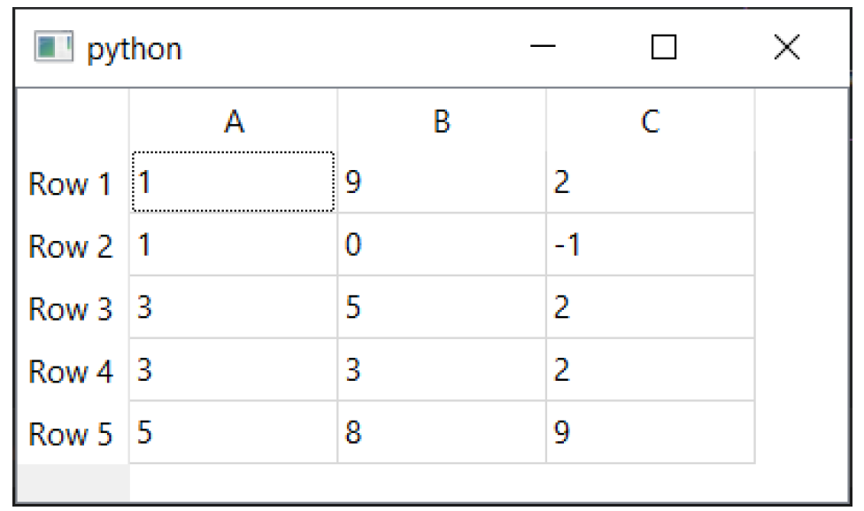

> 图147：QTableView 支持 pandas DataTable，包含列和行标题。

为此，我们需要在自定义的 `headerData` 方法中实现 `Qt.ItemDataRole.DisplayRole` 处理程序。它接收 `section` ，它包含行/列的索引（0…n）、`orientation`（可为 `Qt.Orientations.Horizontal` 用于列标题，或 `Qt.Orientations.Vertical` 用于行标题），以及与数据方法中相同的 `role` 参数。


> `headerData` 方法还接受其他参数，这些参数可用于进一步自定义标题的样式。

### 总结

在本章中，我们介绍了如何使用 QTableView 和自定义模型在应用程序中显示表格数据的基础知识。随后，我们进一步演示了如何格式化数据以及使用图标和颜色装饰单元格。最后，我们演示了如何使用 ·QTableView· 处理来自 numpy 和 pandas 结构的表格数据，包括显示自定义的列和行标题。


> 如果您想对表格数据进行计算，请查看 25. 使用线程池。

## 20. 使用Qt模型查询SQL数据库

到目前为止，我们一直使用表格模型来访问应用程序自身加载或存储的数据——从简单的列表列表到 numpy 和 pandas 表格。然而，所有这些方法都有一个共同点，即您所查看的数据必须完全加载到内存中。

为了简化与 SQL 数据库的交互，Qt 提供了一些 SQL 模型，这些模型可以连接到视图，以显示 SQL 查询或数据库表的输出。在本章中，我们将介绍两种方法——在 `QTableView` 中显示数据库数据，以及使用 `QDataWidgetMapper` 将数据库字段映射到 Qt 控件。

您选择哪种模型取决于您是否需要对数据库进行只读访问、读写访问，还是带有关联关系的只读访问（查询多个表）。在接下来的章节中，我们将依次探讨这些选项。

以下示例基于此简单框架，展示了在窗口中显示表格视图，但未设置模型。

*Listing 115. databases/tableview.py*

```python
import os
import sys

from PyQt6.QtCore import Qt
from PyQt6.QtWidgets import QApplication, QMainWindow, QTableView


class MainWindow(QMainWindow):
    def __init__(self):
        super().__init__()
        
        self.table = QTableView()
        
        # self.model = ?
        # self.table.setModel(self.model)
        
        self.setCentralWidget(self.table)
        
        
app = QApplication(sys.argv)
window = MainWindow()
window.show()
app.exec()
```

在连接模型之前，运行此操作只会显示一个空窗口。


> 对于这些示例，我们使用了本书下载中包含的 SQLite 文件数据库示例 `file.sqlite`。


> 您可以使用自己的数据库，包括SQLite数据库或数据库服务器（如PostgreSQL、MySQL等）。有关如何连接到远程服务器的详细说明，请参阅后文的使用 `QSqlDatabase` 进行身份验证。

### 连接到数据库

要在应用程序中显示数据库中的数据，您必须首先与数据库建立连接。Qt 支持服务器型数据库（如 PostgreSQL 或 MySQL）和文件型数据库（如 SQLite），两者的区别仅在于配置方式不同。

对于所有这些示例，我们使用的是 [Chinook示例数据库](https://github.com/lerocha/chinook-database)——一个专为测试和演示设计的示例数据库。该数据库模拟了一家数字媒体商店，包含艺术家、专辑、媒体曲目、发票和客户等表。


> 本书附带了该数据库的SQLite版本副本，命名为 `chinook.sqlite`。您也可以从[这里](https://github.com/lerocha/chinook-database/raw/master/ChinookDatabase/DataSources/Chinook_Sqlite.sqlite)下载最新版本。

```python
import os

from PyQt6.QtSql import QSqlDatabase

basedir = os.path.dirname(__file__)

db = QSqlDatabase("QSQLITE")
db.setDatabaseName(os.path.join(basedir, "chinook.sqlite"))
db.open()
```


> 您将此代码放置的位置取决于您的应用程序。通常，您希望创建一个数据库连接并在整个应用程序中使用它——在这种情况下，最好创建一个单独的模块，例如 `db.py` 来存放此代码（以及其他相关功能）。

对于所有数据库，操作流程相同——创建数据库对象，设置名称，然后打开数据库以初始化连接。然而，如果您想连接到远程数据库，则需要额外设置一些参数。请参阅后文的使用`QSqlDatabase`进行身份验证以获取更多信息。

### 使用 `QSqlTableModel` 显示表格

将应用程序连接到数据库后，您可以做的最简单的事情就是在应用程序中显示一张表。为此，我们可以使用 `QSqlTableModel`。该模型直接从表中显示数据，并支持编辑功能。

首先，我们需要创建表模型的实例，并传入我们上面创建的数据库对象。然后，我们需要设置要查询数据的源表——这是数据库中表的名称，这里是<表名>。最后，我们需要调用模型的 `.select()` 方法。

```python
model = QSqlTableModel(db=db)
model.setTable('<table name>')
model.select()
```

通过调用 `.select()` 方法，我们指示模型查询数据库并保留查询结果，以便后续显示。要将这些数据显示在 `QTableView` 中，只需将其传递给视图的 `.setModel()` 方法即可。

```python
table = QTableView()
table.setModel(self.model)
```

数据将以表格形式显示，并可通过滚动条进行浏览。请参见下文的完整代码，该代码加载数据库并在视图中显示专辑表。

*Listing 116. tableview_tablemodel.py*

```python
import os
import sys

from PyQt6.QtCore import QSize, Qt
from PyQt6.QtSql import QSqlDatabase, QSqlTableModel
from PyQt6.QtWidgets import QApplication, QMainWindow, QTableView

basedir = os.path.dirname(__file__)

db = QSqlDatabase("QSQLITE")
db.setDatabaseName(os.path.join(basedir, "chinook.sqlite"))
db.open()


class MainWindow(QMainWindow):
    def __init__(self):
        super().__init__()
        
        self.table = QTableView()
        
        self.model = QSqlTableModel(db=db)
        
        self.table.setModel(self.model)
        
        self.model.setTable("Track")
        self.model.select()
        
        self.setMinimumSize(QSize(1024, 600))
        self.setCentralWidget(self.table)
        
        
app = QApplication(sys.argv)
window = MainWindow()
window.show()
app.exec()
```

运行后，您将看到以下窗口。

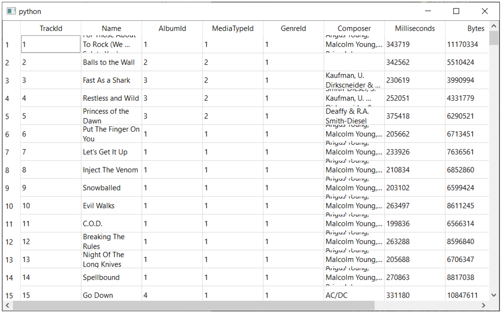

> 图148：在QTableView中显示的专辑表。


> 您可以通过拖动右侧边缘来调整列的宽度。通过双击右侧边缘，可以调整列的宽度以适应内容。

#### 编辑数据

数据库中的数据在 `QTableView` 中默认可编辑——只需双击任何单元格，即可修改其内容。修改内容将在编辑完成后立即保存回数据库。

Qt 提供了一些对编辑行为的控制，您可以根据所构建的应用程序类型进行调整。Qt 将这些行为称为“编辑策略”，它们可以是以下之一：

| 编辑策略                                     | 描述                                                         |
| -------------------------------------------- | ------------------------------------------------------------ |
| `QSqlTableModel.EditStrategy.OnFieldChange`  | 当用户取消选中已编辑的单元格时，更改会自动应用。             |
| `QSqlTableModel.EditStrategy.OnRowChange`    | 当用户选择不同的行时，更改会自动应用。                       |
| `QSqlTableModel.EditStrategy.OnManualSubmit` | 更改会被缓存在模型中，并仅在调用 `.submitAll()` 时写入数据库，或在调用 `revertAll()` 时被丢弃。 |

您可以通过调用 `.setEditStrategy` 方法来设置模型的当前编辑策略。例如 

```python
self.model.setEditStrategy(QSqlTableModel.EditStrategy.OnRowChange)
```

#### 列排序

要按指定列对表格进行排序，我们可以调用模型上的 `.setSort()` 方法，传入列索引和 `Qt.SortOrder.AscendingOrder` 或 `Qt.SortOrder.DescendingOrder`。

*Listing 117. databases/tableview_tablemodel_sort.py*

```python
        self.model.setTable("Track")
        self.model.setSort(2, Qt.SortOrder.DescendingOrder)
        self.model.select()
```

这必须在调用 `.select()` 之前完成。如果您希望在获取数据后进行排序，您可以再次调用 `.select()` 来刷新数据。

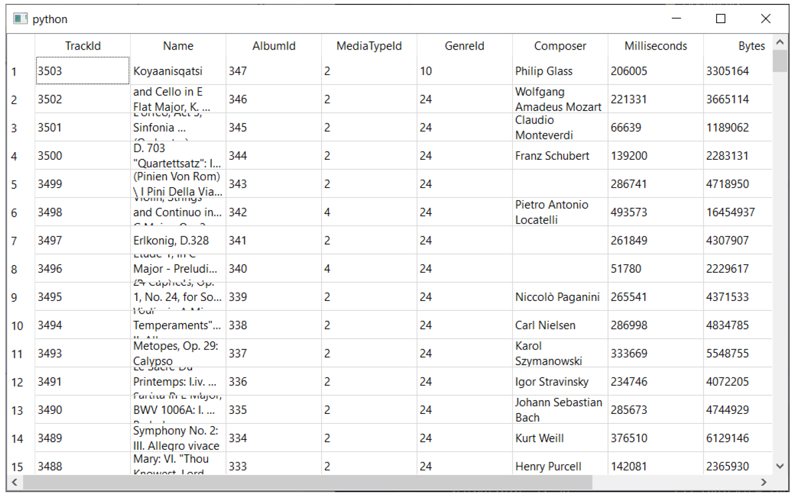

> 图149：根据列索引2（`album_id`）对专辑表进行排序。

您可能更倾向于使用列名而非列索引对表格进行排序。要实现这一点，您可以通过列名查询列索引。

*Listing 118. databases/tableview_tablemodel_sortname.py*

```python
        self.model.setTable("Track")
        idx = self.model.fieldIndex("Milliseconds")
        self.model.setSort(idx, Qt.SortOrder.DescendingOrder)
        self.model.select()
```

表格现已按毫秒列 (`milliseconds`) 进行排序。

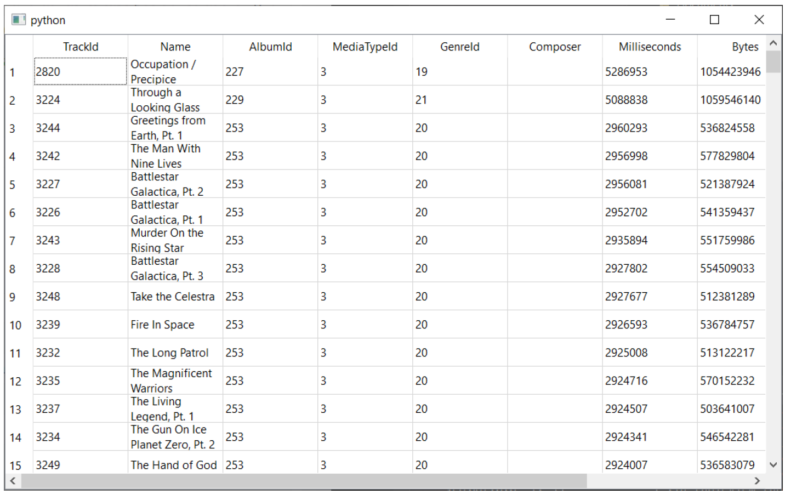

> 图150：按毫秒列排序的专辑表。

#### 列标题

默认情况下，表格中的列标题来自数据库中的列名。通常这并不太利于用户使用，因此您可以使用 `.setHeaderData` 方法替换它们，传入列索引、方向（水平（顶部）或垂直（左侧）标题）以及标签。

*Listing 119. database/tableview_tablemodel_titles.py*

```python
        self.model.setTable("Track")
        self.model.setHeaderData(1, Qt.Orientation.Horizontal, "Name")
        self.model.setHeaderData(
            2, Qt.Orientation.Horizontal, "Album (ID)"
        )
        self.model.setHeaderData(
            3, Qt.Orientation.Horizontal, "Media Type (ID)"
        )
        self.model.setHeaderData(
            4, Qt.Orientation.Horizontal, "Genre (ID)"
        )
        self.model.setHeaderData(
            5, Qt.Orientation.Horizontal, "Composer"
        )
        self.model.select()
```

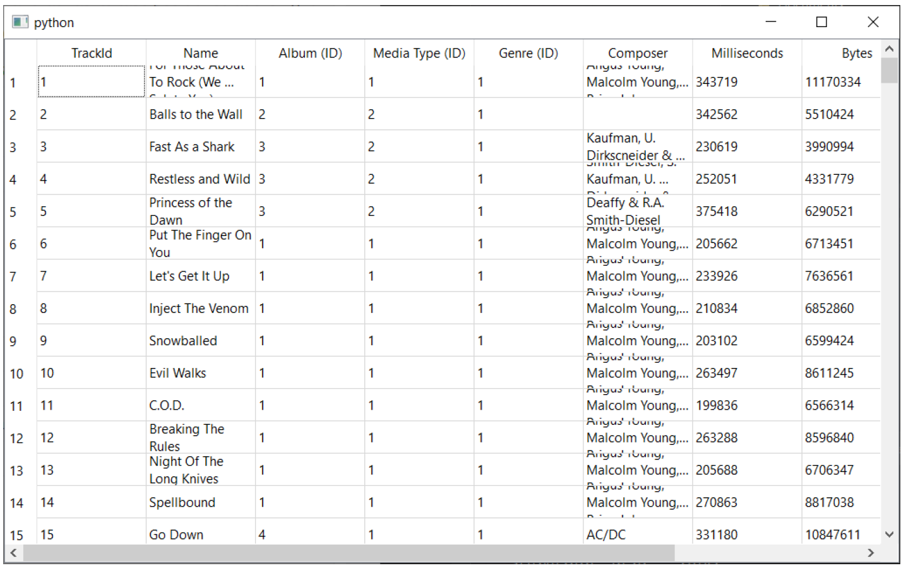

> 图151：带有更美观的列标题的专辑表。

与排序时类似，使用列索引来实现这一点并不总是方便的。如果数据库中的列顺序发生变化，您在应用程序中设置的名称将与之不一致。

与之前一样，我们可以使用 `.fieldIndex()` 方法来查找给定名称的索引。您可以更进一步，定义一个 Python 字典，其中包含列名和标题，以便在设置模型时一次性应用。

*Listing 120. database/tableview_tablemodel_titlesname.py*

```python
        self.model.setTable("Track")
        column_titles = {
            "Name": "Name",
            "AlbumId": "Album (ID)",
            "MediaTypeId": "Media Type (ID)",
            "GenreId": "Genre (ID)",
            "Composer": "Composer",
        }
        for n, t in column_titles.items():
            idx = self.model.fieldIndex(n)
            self.model.setHeaderData(idx, Qt.Orientation.Horizontal,t)
            
        self.model.select()
```

#### 选择列

通常您可能不需要显示表格中的所有列。您可以通过从模型中移除列来选择要显示的列。要实现这一点，请调用 `.removeColumns()` 方法，传入要移除的第一列的索引以及后续要移除的列数。例如：

```python
self.model.removeColumns(2, 5)
```

一旦删除列，它们将不再显示在表格中。您可以使用与列标签相同的名称查找方法，通过名称删除列。

```python
columns_to_remove = ['name', 'something']

for cn in columns_to_remove:
    idx = self.model.fieldIndex(cn)
    self.model.removeColumns(idx, 1)
```


> 以这种方式删除列仅会将其从视图中移除。若需通过SQL过滤列，请参阅下方的查询模型。

#### 筛选表格

我们可以调用模型上的 `.setFilter()` 方法来过滤表格，传入一个描述过滤条件的参数。过滤条件参数可以是任何有效的 SQL `WHERE` 子句，但不需要在前面添加 `WHERE`。例如，`name=“Martin”` 用于精确匹配，或 `name LIKE “Ma%”` 用于匹配以 “Ma” 开头的字段。

如果您对 SQL 不熟悉，以下是一些示例搜索模式，您可以使用它们来执行不同类型的搜索。

| 搜索模式            | 描述                       |
| ------------------- | -------------------------- |
| `field="{}"`        | 字段与字符串完全匹配。     |
| `field LIKE "{}%"`  | 字段以给定的字符串开头。   |
| `field LIKE "%{}"`  | 字段以给定的字符串结尾。   |
| `field LIKE "%{}%"` | 字段包含在给定的字符串中。 |

在每个示例中，`{}` 表示搜索字符串，您必须使用 Python 进行插值：`“{}”.format(search_str)`。与排序不同，过滤操作将自动应用于数据，无需再次调用 `.select()` 方法。


> 如果 `.select()` 尚未被调用，则过滤器将在首次调用时应用。

在下面的示例中，我们添加了一个 `QLineEdit` 字段，并将其连接到搜索轨道名称字段的表。我们将行编辑更改信号连接到构建，并将其应用到模型。

*Listing 121. databases/tableview_tablemodel_filter.py*

```python
import os
import sys

from PyQt6.QtCore import QSize, Qt
from PyQt6.QtSql import QSqlDatabase, QSqlTableModel
from PyQt6.QtWidgets import (
    QApplication,
    QLineEdit,
    QMainWindow,
    QTableView,
    QVBoxLayout,
    QWidget,
)

basedir = os.path.dirname(__file__)

db = QSqlDatabase("QSQLITE")
db.setDatabaseName(os.path.join(basedir, "chinook.sqlite"))
db.open()


class MainWindow(QMainWindow):
    def __init__(self):
        super().__init__()
        
        container = QWidget()
        layout = QVBoxLayout()
        
        self.search = QLineEdit()
        self.search.textChanged.connect(self.update_filter)
        self.table = QTableView()
        
        layout.addWidget(self.search)
        layout.addWidget(self.table)
        container.setLayout(layout)
        
        self.model = QSqlTableModel(db=db)
        
        self.table.setModel(self.model)
        
        self.model.setTable("Track")
        self.model.select()
        
        self.setMinimumSize(QSize(1024, 600))
        self.setCentralWidget(container)
        
    def update_filter(self, s):
        filter_str = 'Name LIKE "%{}%"'.format(s)
        self.model.setFilter(filter_str)
        
        
app = QApplication(sys.argv)
window = MainWindow()
window.show()
app.exec()
```

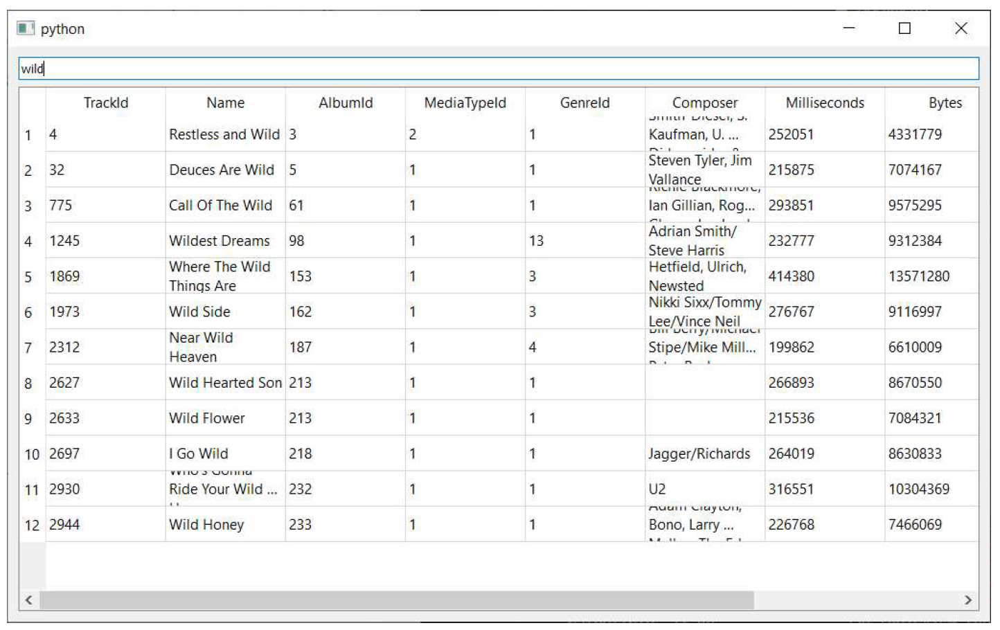

> 图152：按名称过滤专辑表


> 这容易受到SQL注入攻击。

虽然这种方法可行，但这其实是一种非常糟糕的在表中启用搜索功能的方式，因为用户可以构造无效或恶意的SQL语句。例如，尝试在搜索框中输入单个字符 `“` ——过滤功能将停止工作，并且在重新启动应用程序之前无法再次正常工作。

这是因为您创建了一个无效的 SQL 语句，例如：

```sql
'name LIKE "%"%"'
```

解决此问题的理想方法是使用参数化查询，将输入的转义工作交给数据库，以确保不会传递任何危险或格式错误的内容。然而，Qt过滤器接口不支持此功能，我们只能传递一个字符串。

对于简单的纯文本搜索，我们可以直接移除字符串中的任何非字母数字字符或空格。这是否合适将取决于您的具体使用场景。

```python
import re

s = re.sub('[\W_]+', '', s)
query = 'field="%s"' % s
```

将上述内容应用到我们示例中的过滤方法中，我们得到以下代码：

*Listing 122. databases/tableview_tablemodel_filter_clean.py*

```python
    def update_filter(self, s):
        s = re.sub("[\W_]+", "", s)
        filter_str = 'Name LIKE "%{}%"'.format(s)
        self.model.setFilter(filter_str)
```

请再次运行示例，并输入`“ ` —— 以及您能想到的任何其他垃圾内容。您应该会发现搜索功能仍然正常工作。

### 使用 `QSqlRelationalTableModel` 显示相关数据

在之前的示例中，我们使用了 `QSqlTableModel` 来显示单个表中的数据。然而，在关系型数据库中，表之间可以存在关联关系，并且通常有必要能够直接查看相关数据。

关系数据库中的关系通过外键进行处理。外键是一个（通常为）数字值，存储在一个表的列中，引用另一个表中行中的主键。

在我们的示例跟踪表中，外键的示例可以是 `album_id` 或 `genre_id`。这两者都是数值，分别指向专辑表和类型表中的记录。将这些值（如 1、2、3 等）显示给用户是没有帮助的，因为它们本身没有意义。

更理想的做法是提取专辑名称或音乐类型，并在表格视图中显示。为此，我们可以使用`QSqlRelationalTableModel`。

该模型的设置与前一个模型完全相同。要定义关系，我们调用 `.setRelation()` 方法，传入列索引和一个 `QSqlRelation` 对象。

```python
from PyQt6.QtSql import QSqlRelation, QSqlRelationalTableModel

self.model = QSqlRelationalTableModel(db=db)

relation = QSqlRelation('<related_table>',
                        '<related_table_foreign_key_column', '<column_to_display>')
self.model.setRelation(<column>, relation)
```

`QSqlRelation` 对象接受三个参数，第一个是我们要从中提取数据的关联表，第二个是该表中的外键列，最后一个是我们要从中提取数据的列。

对于我们的测试数据库中的专辑表，以下操作将从相关表中提取数据，分别对应专辑ID、媒体类型ID和流派ID（对应表中的第3、4、5列）。

*Listing 123. databases/tableview_relationalmodel.py*

```python
        self.model.setTable("Track")
        self.model.setRelation(
            2, QSqlRelation("Album", "AlbumId", "Title")
        )
        self.model.setRelation(
            3, QSqlRelation("MediaType", "MediaTypeId", "Name")
        )
        self.model.setRelation(
            4, QSqlRelation("Genre", "GenreId", "Name")
        )
        self.model.select()
```

运行后，您会发现三个`_id` 列已被从相关表中提取的数据替换。这些列将采用相关字段的名称，如果不冲突，否则将为其生成一个名称。

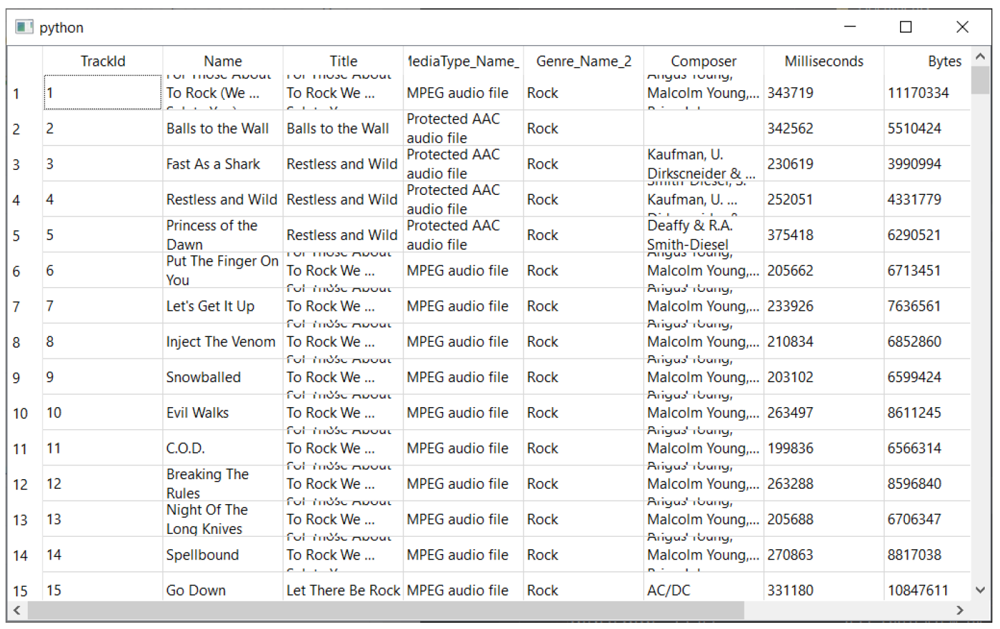

> 图153：显示相关字段的数据。

### 使用 `QSqlRelationalDelegate` 编辑相关字段。

如果您尝试编辑 `QSqlRelationalTableModel` 中的字段，您会发现一个问题——虽然您可以编辑基础表（这里是 Tracks）中的字段，但您对相关字段（例如 Album Title）所做的任何修改都不会被保存。这些字段目前只是对数据的视图。

相关字段的有效值受相关表中值的限制 —— 为了获得更多选择，我们需要向相关表中添加另一行。由于选项受到限制，通常有必要将选择项显示在 `QComboBox` 中。Qt 提供了一个模型项委托，可以为我们完成此查找和显示操作 —— `QSqlRelationalDelegate`

*Listing 124. databases/tableview_relationalmodel_delegate.py*

```python
        self.model.setTable("Track")
        self.model.setRelation(
            2, QSqlRelation("Album", "AlbumId", "Title")
        )
        self.model.setRelation(
            3, QSqlRelation("MediaType", "MediaTypeId", "Name")
        )
        self.model.setRelation(
            4, QSqlRelation("Genre", "GenreId", "Name")
        )
        
        delegate = QSqlRelationalDelegate(self.table)
        self.table.setItemDelegate(delegate)
        
        self.model.select()
```

该委托会自动处理任何关系字段的映射。我们只需创建一个传递 `QTableView` 实例的委托，然后将生成的委托设置到模型上，一切都会自动完成。

运行此操作时，您将在编辑相关字段时看到下拉菜单。

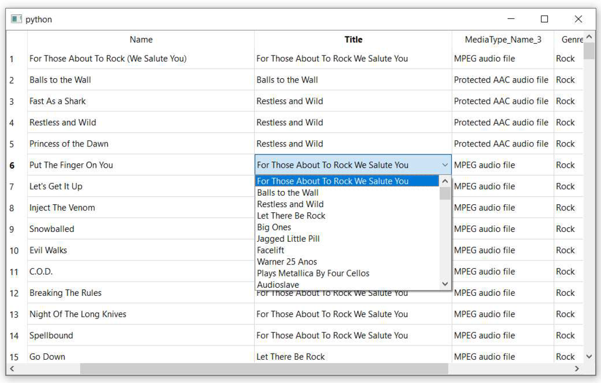

> 图154：通过下拉列表使相关字段可编辑，使用QSqlRelationalDelegate。

### 使用 `QSqlQueryModel` 进行通用查询

到目前为止，我们一直在 `QTableView` 中显示整个数据库表，并支持一些可选的列过滤和排序功能。然而，Qt 还允许使用 `QSqlQueryModel` 显示更复杂的查询。在本节中，我们将探讨如何使用 `QSqlQueryModel` 显示 SQL 查询，首先从简单的单表查询开始，然后逐步过渡到关系查询和参数化查询。

使用此模型进行查询的过程略有不同。与将数据库直接传递给模型构造函数不同，这里我们首先创建一个`QSqlQuery`对象，该对象接受数据库连接，然后将该对象传递给模型。

```python
query = QSqlQuery("SELECT name, composer FROM track ", db=db)
```

这意味着您可以使用单个 `QSqlQueryModel` 对不同数据库执行查询。该查询的完整示例如下所示：

*Listing 125. databases/tableview_querymodel.py*

```python
import os
import sys

from PyQt6.QtCore import QSize, Qt
from PyQt6.QtSql import QSqlDatabase, QSqlQuery, QSqlQueryModel
from PyQt6.QtWidgets import QApplication, QMainWindow, QTableView

basedir = os.path.dirname(__file__)

db = QSqlDatabase("QSQLITE")
db.setDatabaseName(os.path.join(basedir, "chinook.sqlite"))
db.open()


class MainWindow(QMainWindow):
    def __init__(self):
        super().__init__()
        
        self.table = QTableView()
        
        self.model = QSqlQueryModel()
        self.table.setModel(self.model)
        
        query = QSqlQuery("SELECT Name, Composer FROM track ", db=db)
        
        self.model.setQuery(query)
        
        self.setMinimumSize(QSize(1024, 600))
        self.setCentralWidget(self.table)
        
        
app = QApplication(sys.argv)
window = MainWindow()
window.show()
app.exec()
```

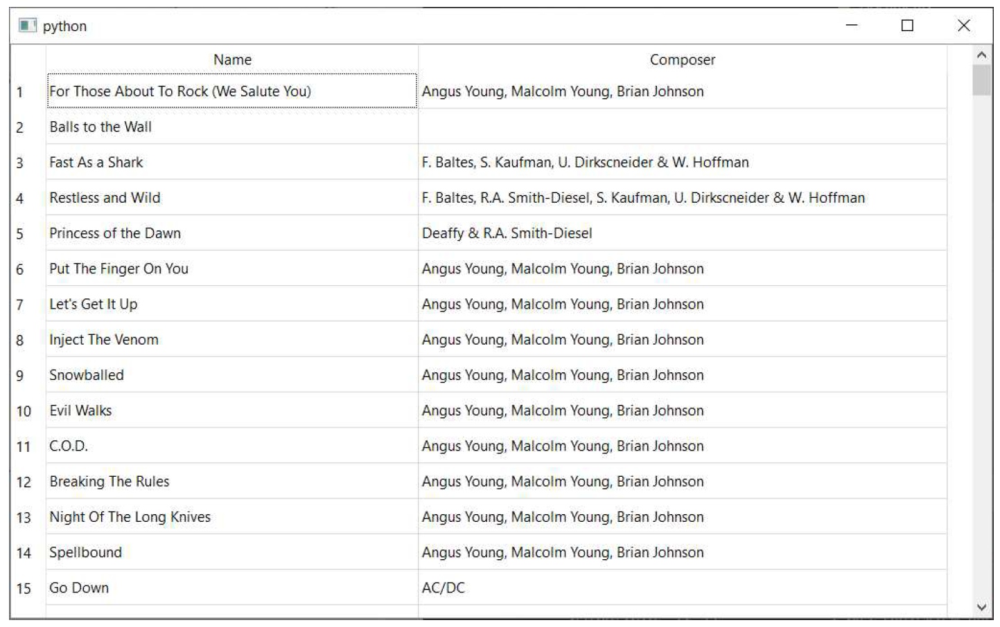

> 图155：执行一个简单的查询

在这个第一个示例中，我们对专辑表执行了一个非常简单的查询，仅返回该表中的两个字段。然而，`QSqlQuery` 对象可用于执行更复杂的查询，包括跨表连接和参数化查询——在参数化查询中，我们可以传递值来修改查询。


> 参数化查询可保护您的应用免受SQL注入攻击。

在下面的示例中，我们扩展了简单的查询，以在专辑表中添加一个相关查找。此外，我们绑定了一个专辑标题参数，该参数用于对专辑表进行包含搜索。

*Listing 126. databases/tableview_querymodel_parameter.py*

```python
import os
import sys

from PyQt6.QtCore import QSize, Qt
from PyQt6.QtSql import QSqlDatabase, QSqlQuery, QSqlQueryModel
from PyQt6.QtWidgets import QApplication, QMainWindow, QTableView

basedir = os.path.dirname(__file__)

db = QSqlDatabase("QSQLITE")
db.setDatabaseName(os.path.join(basedir, "chinook.sqlite"))
db.open()


class MainWindow(QMainWindow):
    def __init__(self):
        super().__init__()
        
        self.table = QTableView()
        
        self.model = QSqlQueryModel()
        self.table.setModel(self.model)
        
        query = QSqlQuery(db=db)
        query.prepare(
            "SELECT Name, Composer, Album.Title FROM Track "
            "INNER JOIN Album ON Track.AlbumId = Album.AlbumId "
            "WHERE Album.Title LIKE '%' || :album_title || '%' "
        )
        query.bindValue(":album_title", "Sinatra")
        query.exec()
        
        self.model.setQuery(query)
        self.setMinimumSize(QSize(1024, 600))
        self.setCentralWidget(self.table)
        
        
app = QApplication(sys.argv)
window = MainWindow()
window.show()
app.exec()
```

现在我们想要向查询中添加参数，不能直接将查询传递给 `QSqlQuery`，因为这样会立即执行查询，而不会进行参数替换。相反，我们需要将查询传递给 `.prepare()` 方法，告知驱动程序识别查询中的参数并等待值的传入。

接下来，我们使用 `.bindValue()` 方法绑定每个参数，最后调用 `query.exec()` 方法在数据库中执行查询。

此参数化查询等同于以下 SQL 语句：

```sql
SELECT Name, Composer, Album.Title FROM Track
INNER JOIN Album ON Track.AlbumId = Album.AlbumId
WHERE Album.Title LIKE '%Sinatra%'
```

这将得到以下结果 

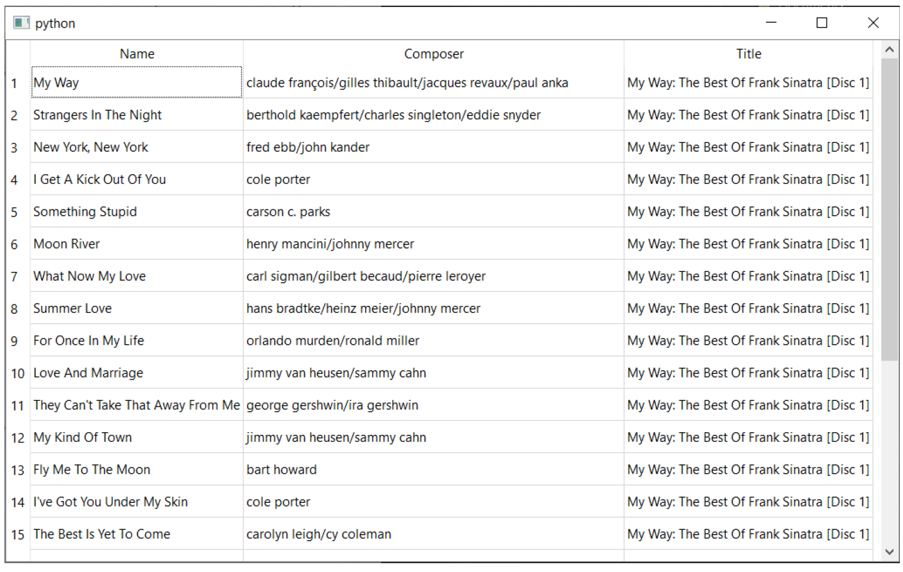

> 图156：参数化查询的结果

在最后一个示例中，我们添加了三个搜索字段——一个用于歌曲标题、一个用于艺术家、一个用于专辑标题。我们将这些字段的 `.textChanged` 信号连接到一个自定义方法，该方法更新查询的参数。

*Listing 127. databases/tableview_querymodel_search.py*

```python
import os
import sys

from PyQt6.QtCore import QSize, Qt
from PyQt6.QtSql import QSqlDatabase, QSqlQuery, QSqlQueryModel
from PyQt6.QtWidgets import (
    QApplication,
    QHBoxLayout,
    QLineEdit,
    QMainWindow,
    QTableView,
    QVBoxLayout,
    QWidget,
)

basedir = os.path.dirname(__file__)

db = QSqlDatabase("QSQLITE")
db.setDatabaseName(os.path.join(basedir, "chinook.sqlite"))
db.open()


class MainWindow(QMainWindow):
    def __init__(self):
        super().__init__()

        container = QWidget()
        layout_search = QHBoxLayout()

        self.track = QLineEdit()
        self.track.setPlaceholderText("Track name...")
        self.track.textChanged.connect(self.update_query)

        self.composer = QLineEdit()
        self.composer.setPlaceholderText("Artist name...")
        self.composer.textChanged.connect(self.update_query)

        self.album = QLineEdit()
        self.album.setPlaceholderText("Album name...")
        self.album.textChanged.connect(self.update_query)

        layout_search.addWidget(self.track)
        layout_search.addWidget(self.composer)
        layout_search.addWidget(self.album)

        layout_view = QVBoxLayout()
        layout_view.addLayout(layout_search)

        self.table = QTableView()

        layout_view.addWidget(self.table)

        container.setLayout(layout_view)
        self.model = QSqlQueryModel()
        self.table.setModel(self.model)
        
        self.query = QSqlQuery(db=db)
        self.query.prepare(
            "SELECT Name, Composer, Album.Title FROM Track "
            "INNER JOIN Album ON Track.AlbumId=Album.AlbumId WHERE "
            "Track.Name LIKE '%' || :track_name || '%' AND "
            "Track.Composer LIKE '%' || :track_composer || '%' AND "
            "Album.Title LIKE '%' || :album_title || '%'"
        )
        
        self.update_query()
        
        self.setMinimumSize(QSize(1024, 600))
        self.setCentralWidget(container)
        
    def update_query(self, s=None):
        
        # 从控件中获取文本值。
        track_name = self.track.text()
        track_composer = self.composer.text()
        album_title = self.album.text()
        
        self.query.bindValue(":track_name", track_name)
        self.query.bindValue(":track_composer", track_composer)
        self.query.bindValue(":album_title", album_title)
        
        self.query.exec()
        self.model.setQuery(self.query)
        
        
app = QApplication(sys.argv)
window = MainWindow()
window.show()
app.exec()
```

如果您运行此功能，您可以使用每个字段独立搜索数据库，且每次搜索查询更改时，结果将自动更新。

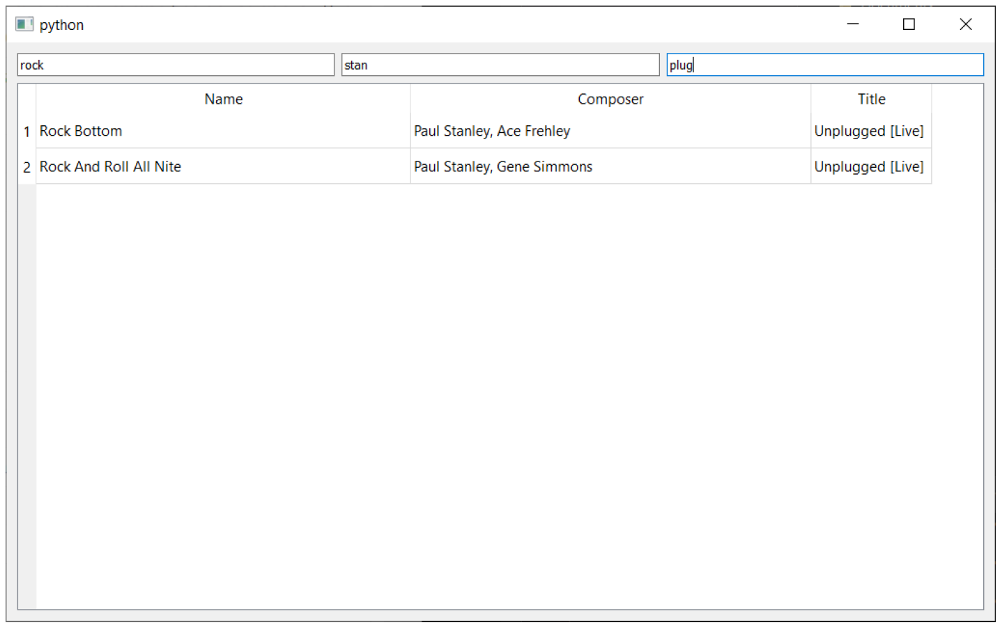

> 图157：多参数搜索查询的结果

### `QDataWidgetMapper`

到目前为止，我们在所有示例中都使用 `QTableView` 以表格形式显示了数据库的输出数据。虽然这种方式通常适合查看数据，但在进行数据输入或编辑时，通常更倾向于以表单形式显示输入内容，这样用户可以直接输入并通过Tab键在字段间切换。


> 这被称为创建、读取、更新和删除（CRUD）操作及接口。

完整的示例代码如下所示。

*Listing 128. databases/widget_mapper.py*

```python
import os
import sys

from PyQt6.QtCore import QSize, Qt
from PyQt6.QtSql import QSqlDatabase, QSqlTableModel
from PyQt6.QtWidgets import (
    QApplication,
    QComboBox,
    QDataWidgetMapper,
    QDoubleSpinBox,
    QFormLayout,
    QLabel,
    QLineEdit,
    QMainWindow,
    QSpinBox,
    QWidget,
)

basedir = os.path.dirname(__file__)

db = QSqlDatabase("QSQLITE")
db.setDatabaseName(os.path.join(basedir, "chinook.sqlite"))
db.open()


class MainWindow(QMainWindow):
    def __init__(self):
        super().__init__()
        
        form = QFormLayout()
        
        self.track_id = QSpinBox()
        self.track_id.setRange(0, 2147483647)
        self.track_id.setDisabled(True)
        self.name = QLineEdit()
        self.album = QComboBox()
        self.media_type = QComboBox()
        self.genre = QComboBox()
        self.composer = QLineEdit()
        
        self.milliseconds = QSpinBox()
        self.milliseconds.setRange(0, 2147483647) #1
        self.milliseconds.setSingleStep(1)
        
        self.bytes = QSpinBox()
        self.bytes.setRange(0, 2147483647)
        self.bytes.setSingleStep(1)
        
        self.unit_price = QDoubleSpinBox()
        self.unit_price.setRange(0, 999)
        self.unit_price.setSingleStep(0.01)
        self.unit_price.setPrefix("$")
        form.addRow(QLabel("Track ID"), self.track_id)
        form.addRow(QLabel("Track name"), self.name)
        form.addRow(QLabel("Composer"), self.composer)
        form.addRow(QLabel("Milliseconds"), self.milliseconds)
        form.addRow(QLabel("Bytes"), self.bytes)
        form.addRow(QLabel("Unit Price"), self.unit_price)
        
        self.model = QSqlTableModel(db=db)
        
        self.mapper = QDataWidgetMapper() #2
        self.mapper.setModel(self.model)
        
        self.mapper.addMapping(self.track_id, 0) #3
        self.mapper.addMapping(self.name, 1)
        self.mapper.addMapping(self.composer, 5)
        self.mapper.addMapping(self.milliseconds, 6)
        self.mapper.addMapping(self.bytes, 7)
        self.mapper.addMapping(self.unit_price, 8)
        
        self.model.setTable("Track")
        self.model.select() #4
        
        self.mapper.toFirst() #5
        
        self.setMinimumSize(QSize(400, 400))
        
        widget = QWidget()
        widget.setLayout(form)
        self.setCentralWidget(widget)
        
app = QApplication(sys.argv)
window = MainWindow()
window.show()
app.exec()
```

> 1. 控件必须配置为接受表中的所有有效值。
> 2. 所有控件使用一个 `QDataWidgetMapper`。
> 3. 控件映射到 `_columns`。
> 4. 执行选择以填充模型。
> 5. 将映射器向前移动到第一个记录

运行此示例后，您将看到以下窗口。`self.mapper.toFirst()` 调用选择表中的第一条记录，然后将其显示在映射的控件中。

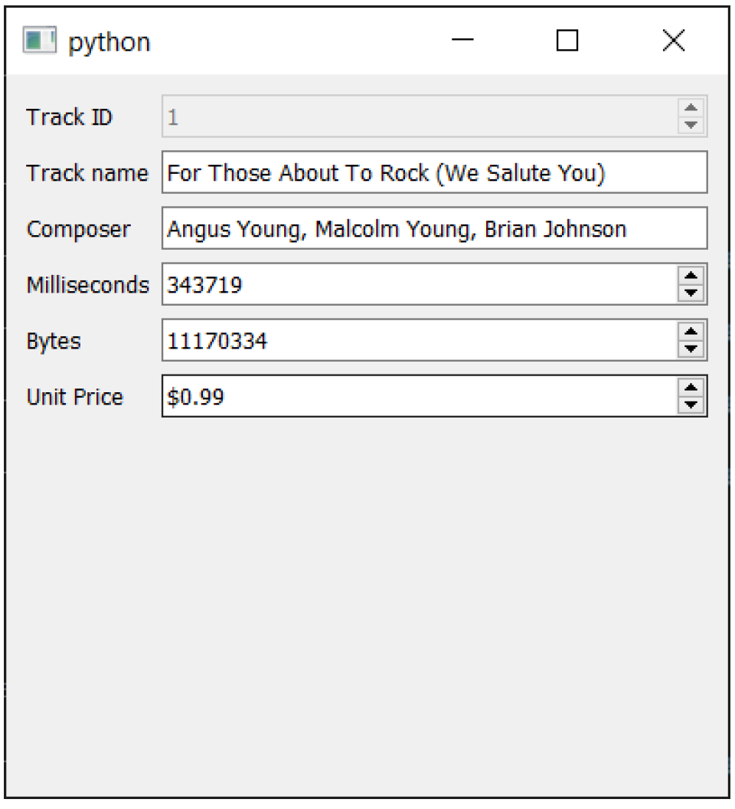

> 图158：通过映射控件查看记录

目前，我们无法更改正在查看的记录，也无法保存对记录所做的任何更改。为了实现这一点，我们可以添加 3 个按钮——分别用于浏览记录的前一个和下一个，以及保存更改到数据库。为此，我们可以将一些 `QPushButton` 控件连接到映射器槽 `.toPrevious`、`.toNext` 和 `.submit`。

请您更新 `__init__` 方法的结尾，添加以下内容，将控件添加到现有的布局中

*Listing 129. databases/widget_mapper_controls.py*

```python
        self.setMinimumSize(QSize(400, 400))
    
        controls = QHBoxLayout()
        
        prev_rec = QPushButton("Previous")
        prev_rec.clicked.connect(self.mapper.toPrevious)
        
        next_rec = QPushButton("Next")
        next_rec.clicked.connect(self.mapper.toNext)
        
        save_rec = QPushButton("Save Changes")
        save_rec.clicked.connect(self.mapper.submit)
        
        controls.addWidget(prev_rec)
        controls.addWidget(next_rec)
        controls.addWidget(save_rec)
        
        layout.addLayout(form)
        layout.addLayout(controls)
        
        widget = QWidget()
        widget.setLayout(layout)
        self.setCentralWidget(widget)
```

您还需要更新文件顶部的导入语句，以导入 `QPushButton` 和 `QHBoxLayout`

*Listing 130. databases/widget_mapper_controls.py*

```python
from PyQt6.QtWidgets import (
    QApplication,
    QComboBox,
    QDataWidgetMapper,
    QDoubleSpinBox,
    QFormLayout,
    QHBoxLayout,
    QLabel,
    QLineEdit,
    QMainWindow,
    QPushButton,
    QSpinBox,
    QVBoxLayout,
    QWidget,
)
```

现在您可以浏览专辑表中的记录，修改专辑数据并提交这些更改到数据库。此示例的完整源代码位于书籍源代码中的 `databases/widget_mapper_controls.py` 文件中。

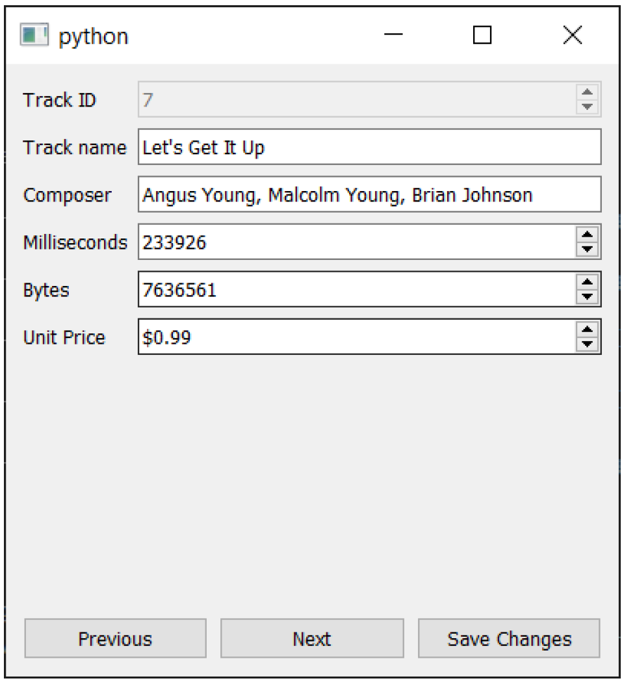

> 图159：您可以使用上一页/下一页控制按钮来查看记录，还可以点击保存以提交。

### 使用 `QSqlDatabase` 进行身份验证

到目前为止，我们在示例中使用了 SQLite 数据库文件。但通常情况下，您可能希望连接到远程 SQL 服务器。这需要添加一些额外参数，包括数据库所在的主机名，以及适当的用户名和密码。

```python
# 建立数据库连接。
db = QSqlDatabase('<driver>')
db.setHostName('<localhost>')
db.setDatabaseName('<databasename>')
db.setUserName('<username>')
db.setPassword('<password>')
db.open()
```

注意：`<driver>` 的值可以是以下任何一个 `[‘QSQLITE’,‘QMYSQL’, ‘QMYSQL3’, ‘QODBC’, ‘QODBC3’, ‘QPSQL’, ‘QPSQL7’]`。要获取系统上的此列表，请运行 `QSqlDatabase.drivers()`。

就这样！一旦连接建立，模型将与之前完全相同地运作。
