# 自定义控件

如我们所见，Qt 内置了各种控件，您可以使用这些控件来构建应用程序。即使如此，有时这些简单的控件还是不够用——也许您需要一些自定义类型的输入，或者希望以独特的方式可视化数据。在 Qt 中，您可以自由创建自己的控件，无论是从头开始创建，还是组合现有控件。

在本章中，我们将了解如何使用位图图形和自定义信号来创建您自己的控件

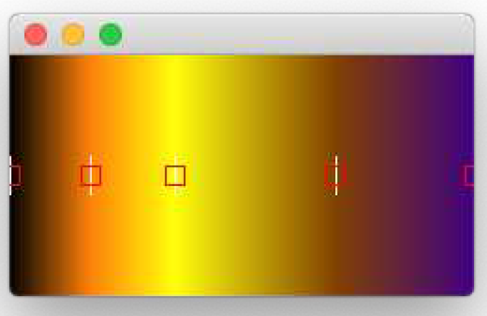

> 图160：自定义颜色渐变输入，我们库中的控件之一


> 您可能还想查看我们的 [自定义控件库](https://www.pythonguis.com/widgets/)。

## 21. Qt 中的位图图形

在 PyQt6 中创建自定义控件的第一步是了解位图（基于像素）图形操作。所有标准控件都以位图的形式绘制在构成控件形状的矩形“画布”上。一旦您了解了其工作原理，就可以绘制任何您喜欢的自定义控件！

位图是由像素组成的矩形网格，其中每个像素（及其颜色）由一定数量的“位”来表示。它们与矢量图形不同，矢量图形中图像以一系列线条（或矢量）绘图形状的形式存储，这些形状用于构成图像。如果您在屏幕上查看矢量图形，它们正在被栅格化——转换为位图图像——以像素形式显示在屏幕上。

在本教程中，我们将介绍 `QPainter`，这是 Qt 用于执行位图图形操作的 API，也是绘制您自己的控件的基础。我们将介绍一些基本的绘图操作，最后将它们整合在一起，创建我们自己的小绘图应用程序。

### `QPainter`

Qt 中的位图绘图操作通过 `QPainter` 类进行处理。这是一个通用接口，可用于在各种表面上绘图，包括 `QPixmap` 等。在本章中，我们将介绍 `QPainter` 的绘图方法，首先在 `QPixmap` 表面上使用基本操作，然后利用所学知识构建一个简单的 Paint 应用程序。

为了便于演示，我们将使用以下存根应用程序，该应用程序负责创建容器（`QLabel`）、创建像素图画布、将像素图画布设置到容器中，并将容器添加到主窗口。

*Listing 131. bitmap/stub.py*

```python
import sys

from PyQt6.QtCore import Qt
from PyQt6.QtGui import QPixmap
from PyQt6.QtWidgets import QApplication, QLabel, QMainWindow


class MainWindow(QMainWindow):
    def __init__(self):
        super().__init__()
        
        self.label = QLabel()
        self.canvas = QPixmap(400, 300) #1
        self.canvas.fill(Qt.GlobalColor.white) #2
        
        self.setCentralWidget(self.label)
        self.draw_something()
        
    def draw_something(self):
        pass
    
    
app = QApplication(sys.argv)
window = MainWindow()
window.show()
app.exec()
```

> 1. 创建我们将要绘制的 `QPixmap` 对象。
> 2. 用白色填充整个画布（以便我们能看到我们的线条）。


> 为什么使用 `QLabel` 进行绘制？`QLabel` 控件还可以用于显示图像，它是显示 `QPixmap` 的最简单的控件。

我们需要先用白色填充画布，因为根据平台和当前的深色模式，背景颜色可能从浅灰色到黑色不等。我们可以从绘制一些非常简单的内容开始。

*Listing 132. /bitmap/line.py*

```python
import sys

from PyQt6.QtCore import Qt
from PyQt6.QtGui import QPainter, QPixmap
from PyQt6.QtWidgets import QApplication, QLabel, QMainWindow


class MainWindow(QMainWindow):
    def __init__(self):
        super().__init__()
        
        self.label = QLabel()
        self.canvas = QPixmap(400, 300) #1
        self.canvas.fill(Qt.GlobalColor.white) #2
        self.label.setPixmap(self.canvas)
        self.setCentralWidget(self.label)
        self.draw_something()
        
    def draw_something(self):
        painter = QPainter(self.canvas)
        painter.drawLine(10, 10, 300, 200) #3
        painter.end()
        self.label.setPixmap(self.canvas)
        
        
app = QApplication(sys.argv)
window = MainWindow()
window.show()
app.exec()
```

> 1. 创建我们将要绘制的 `QPixmap` 对象。
> 2. 用白色填充整个画布（以便我们能看到我们的线条）
> 3. 从 (10, 10) 到 (300, 200) 画一条直线。坐标为 (x, y)，其中 (0, 0) 在左上角。

将此内容保存到文件中并运行，您应该会看到以下内容——窗口框架内的一条黑色

线

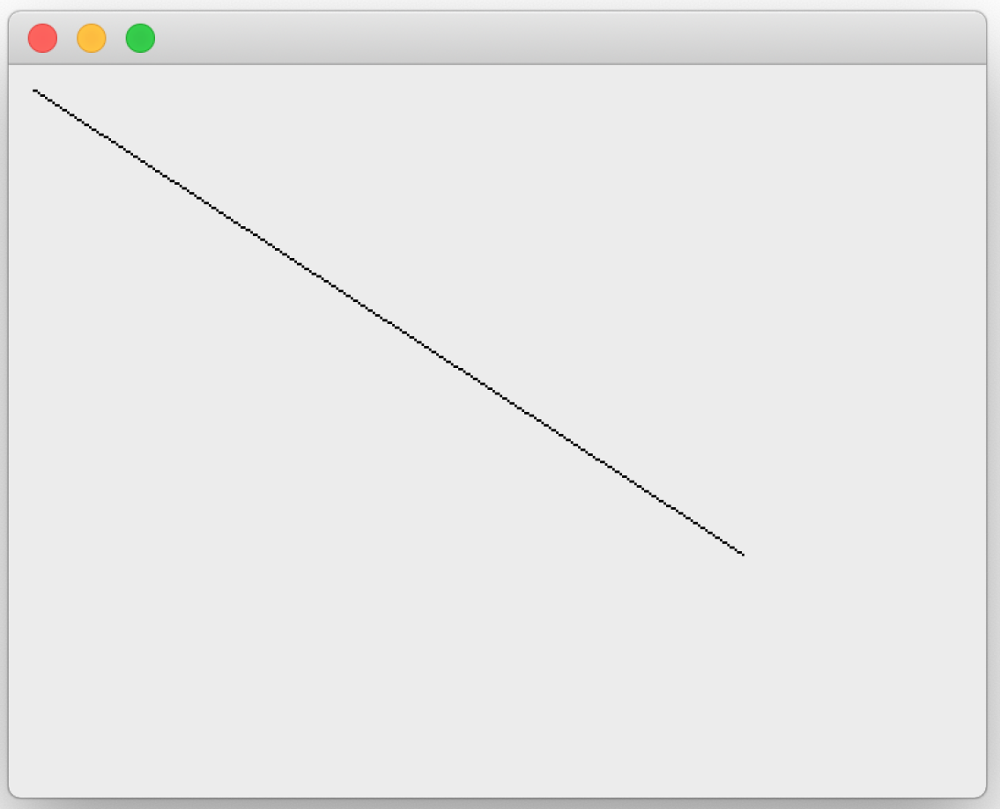

> 图161：画布上的一条黑色直线。

所有绘制操作均在 `draw_something` 方法中完成——我们创建一个 `QPainter` 实例，传入画布（`self.label.pixmap()`），然后发出绘制直线的命令。最后调用 `.end()` 方法关闭绘图器并应用更改。


> 通常情况下，您还需要调用 `.update()` 来触发控件的刷新，但由于我们在应用程序窗口显示之前就进行了绘制，因此刷新会自动发生。

`QPainter` 的坐标系将 (0, 0) 置于画布的左上角，其中 x 值向右增加，y 值向下增加。这可能与您习惯的图形绘制不同，因为在图形绘制中，(0, 0) 通常位于左下角。

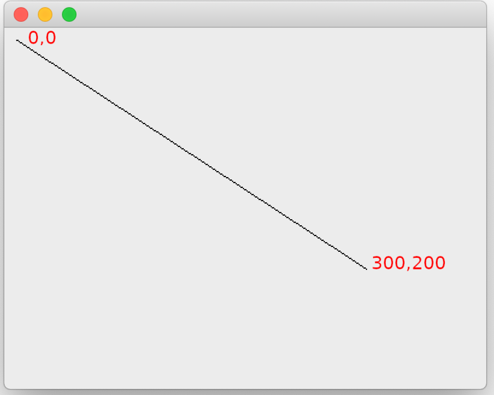

> 图162：标注有坐标的黑色线条

### 绘制基本图形

`QPainter` 提供了大量用于在位图表面上绘制形状和线条的方法（在 5.12 版本中，有 192 个 `QPainter` 专用的非事件方法）。好消息是，其中大多数都是重载方法，它们只是调用相同基类方法的不同方式。

例如，有5种不同的 `drawLine` 方法，它们都绘制相同的线，但定义要绘制内容的坐标的方式不同。

| 方法                       | 描述                                                         |
| -------------------------- | ------------------------------------------------------------ |
| `drawLine(line)`           | 绘制一个 `QLine` 实例                                        |
| `drawLine(line)`           | 绘制一个 `QLineF` 实例                                       |
| `drawLine(x1, y1, x2, y2)` | 在 (x1, y2) 和 (x2, y2) 之间画一条直线。（两者均为 `int`）   |
| `drawLine(p1, p2)`         | 在 (x1, y2) 和 (x2, y2) 之间画一条直线。（两者均为 `QPoint`） |
| `drawLine(p1, p2)`         | 在 (x1, y2) 和 (x2, y2) 之间画一条直线。（两者均为 `QPointF`） |

如果您在想 `QLine` 和 `QLineF` 有什么区别，那么后者的坐标是浮点数。这在其他计算结果是浮点数时很方便，但其他情况下则不然。

忽略 F 变体，我们有三种独特的方式来绘制一条直线——使用直线对象、使用两组坐标 `(x1, y1)` 和 `(x2, y2)`，或者使用两个 `QPoint` 对象。当您发现 `QLine` 本身被定义为`QLine(const QPoint &p1, const QPoint & p2)`或 `QLine(int x1, int y1, int x2, int y2)`时，您会发现它们实际上是完全相同的东西。不同的调用签名只是为了方便。


> 给定坐标 x1, y1, x2, y2，两个 `QPoint` 对象将被定义为 `QPoint(x1, y1)` 和 `QPoint(x2, y2)`。

因此，排除重复项后，我们得到以下绘图操作：`drawArc`、`drawChord`、`drawConvexPolygon`、`drawEllipse`、`drawLine`、`drawPath`、`drawPie`、`drawPoint`、`drawPolygon`、`drawPolyline`、`drawRect`、`drawRects` 和 `drawRoundedRect`。为了避免被过多的内容淹没，我们将首先专注于基本形状和线条，待掌握基础后再回过头来处理更复杂的操作。


> 对于每个示例，请在您的示例应用程序中替换 `draw_something` 方法，然后重新运行以查看输出结果。

#### `drawPoint`

这会在画布上的指定位置绘制一个点或像素。每次调用 `drawPoint` 方法都会绘制一个像素。您可以用以下代码替换您的 `draw_something` 代码：

*Listing 133. bitmap/point.py*

```python
    def draw_something(self):
        painter = QPainter(self.canvas)
        painter.drawPoint(200, 150)
        painter.end()
        self.label.setPixmap(self.canvas)
```

如果您重新运行该文件，您会看到一个窗口，但这次窗口中央有一个单一的点，颜色为黑色。您可能需要移动窗口来找到它。

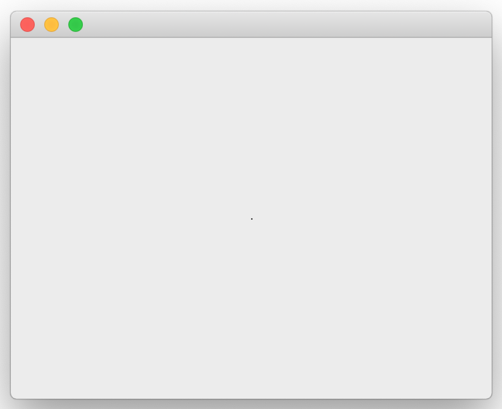

> 图163：使用QPainter绘制单个点（像素）

这看起来确实没什么特别的。为了让事情更有趣，我们可以更改我们正在绘制的点的颜色和大小。在 PyQt6 中，线条的颜色和粗细是通过 `QPainter` 上的活动画笔来定义的。您可以通过创建一个 `QPen` 实例并应用它来设置这些属性。

*Listing 134. bitmap/point_with_pen.py*

```python
    def draw_something(self):
        painter = QPainter(self.canvas)
        pen = QPen()
        pen.setWidth(40)
        pen.setColor(QColor("red"))
        painter.setPen(pen)
        painter.drawPoint(200, 150)
        painter.end()
        self.label.setPixmap(self.canvas)
```

这将产生一个稍显有趣的结果。

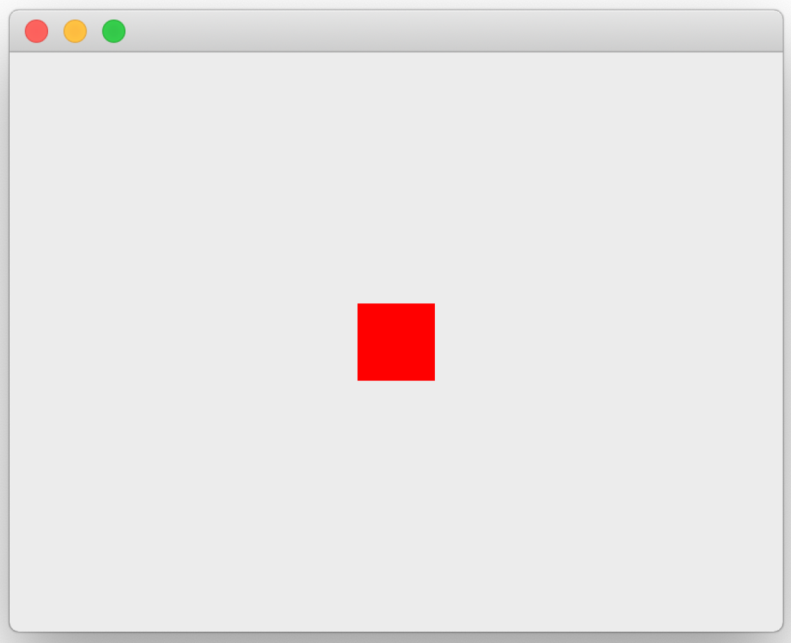

> 图164：一个大红点

您可以自由地使用 `QPainter` 执行多次绘制操作，直到绘图器结束。在画布上绘制非常快速——这里我们正在随机绘制 10000 个点。

*Listing 135. bitmap/points.py*

```python
from random import choice, randint #1

    def draw_something(self):
        painter = QPainter(self.canvas)
        pen = QPen()
        pen.setWidth(3)
        painter.setPen(pen)
        
        for n in range(10000):
            painter.drawPoint(
                200 + randint(-100, 100),
                150 + randint(-100, 100), # x # y
            )
        painter.end()
        self.label.setPixmap(self.canvas)
```

> 1. 在文件开头添加此导入语句

这些点宽度为3像素，颜色为黑色（默认画笔）。

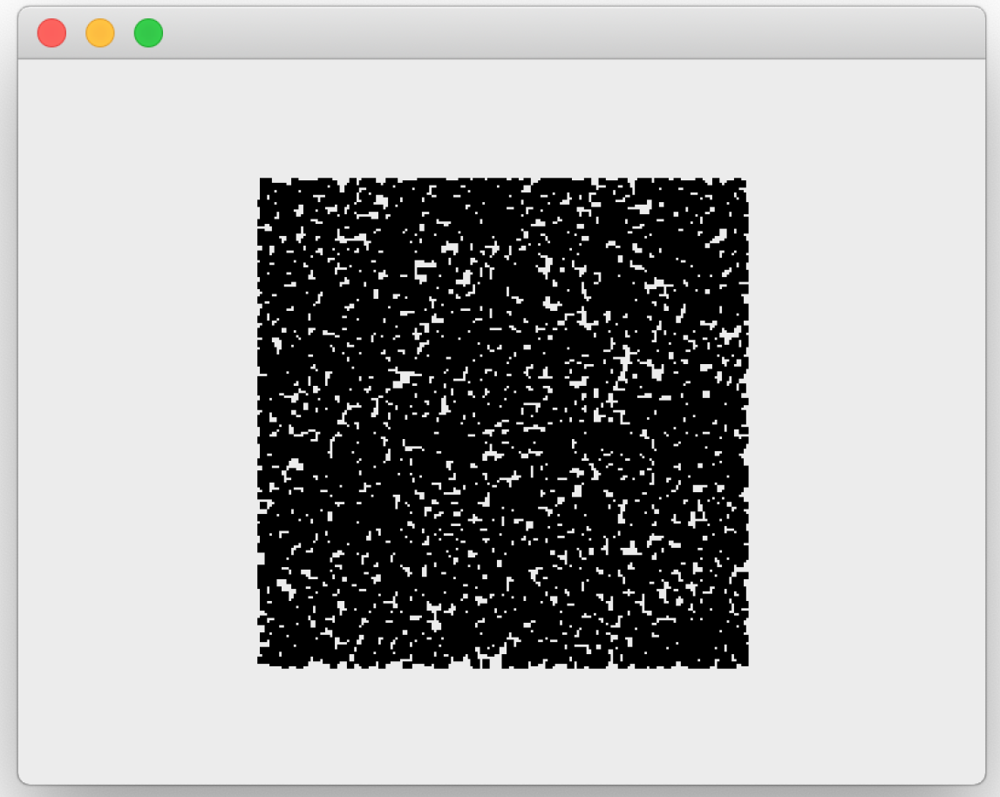

> 图165：画布上10000个3像素的点

在绘图过程中，您经常需要更新当前的画笔——例如，以不同颜色绘制多个点，同时保持其他特性（如宽度）不变。为了实现这一点，而无需每次都重新创建一个新的 `QPen` 实例，您可以从 `QPainter` 中获取当前活动的画笔，使用 `pen = painter.pen()`。您还可以多次重新应用现有的画笔，每次都对其进行修改。

*Listing 136. bitmap/points_color.py*

```python
    def draw_something(self):
        colors = [
            "#FFD141",
            "#376F9F",
            "#0D1F2D",
            "#E9EBEF",
            "#EB5160",
        ]
        
        painter = QPainter(self.canvas)
        pen = QPen()
        pen.setWidth(3)
        painter.setPen(pen)
        
        for n in range(10000):
            # pen = painter.pen() 您可以在这里获取活动笔。
            pen.setColor(QColor(choice(colors)))
            painter.setPen(pen)
            painter.drawPoint(
                200 + randint(-100, 100),
                150 + randint(-100, 100), # x # y
            )
    painter.end()
    self.label.setPixmap(self.canvas)
```

将生成以下输出

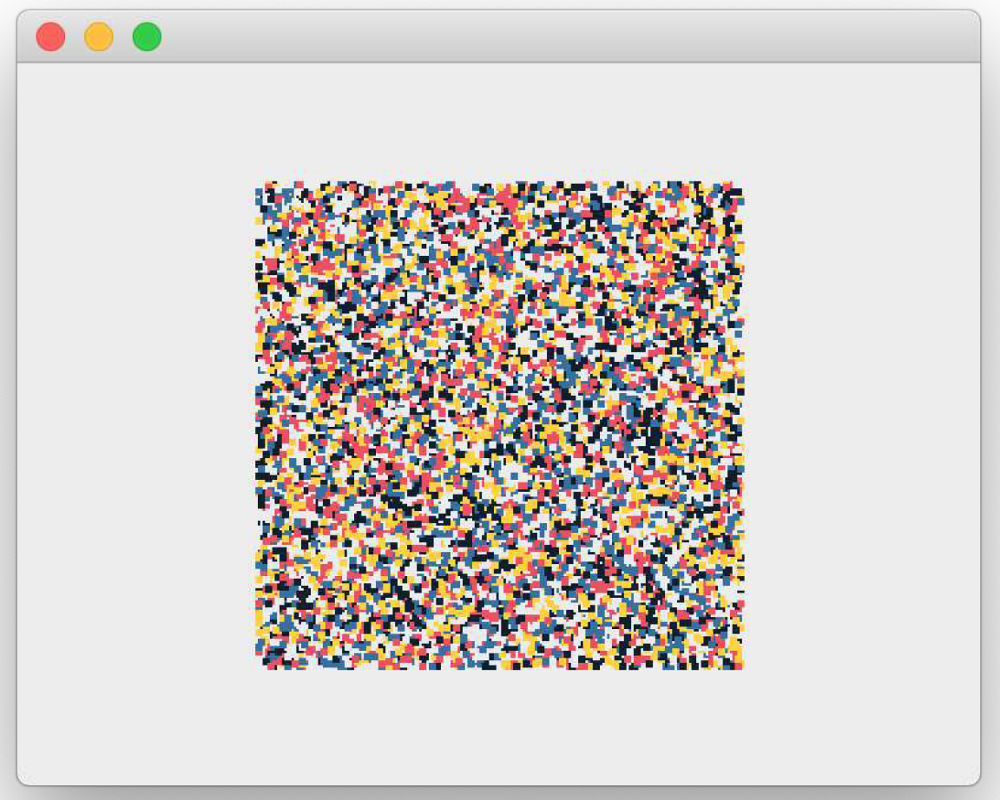

> 图166：随机分布的三像素宽的点


> 在 `QPainter` 上只能有一个 `QPen` 处于活动状态——即当前的笔。

这大概就是用画笔在屏幕上画点能带来的全部乐趣了，所以我们接下来要看看其他一些绘图操作。

#### `drawLine`

我们在画布上已经画了一条线来测试功能是否正常。但我们尚未尝试将画笔设置为控制线条外观。

*Listing 137. bitmap/line_with_pen.py*

```python
    def draw_something(self):
        painter = QPainter(self.canvas)
        pen = QPen()
        pen.setWidth(15)
        pen.setColor(QColor("blue"))
        painter.setPen(pen)
        painter.drawLine(QPoint(100, 100), QPoint(300, 200))
        painter.end()
        self.label.setPixmap(self.canvas)
```

在此示例中，我们还使用 `QPoint` 来定义要用直线连接的两个点，而不是分别传入 `x1、y1、x2、y2` 参数——请记住，这两种方法在功能上是完全相同的。

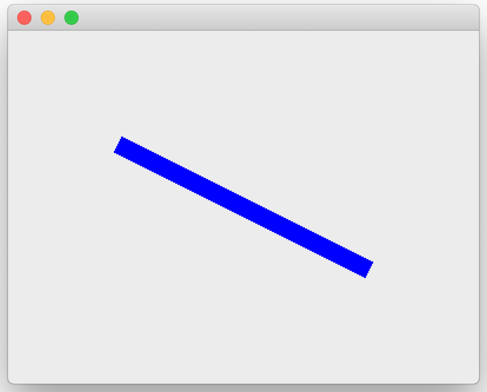

> 图167：一个蓝色的粗线

#### `drawRect`, `drawRects` 和 `drawRoundedRect`

这些函数均用于绘制矩形，矩形可通过一系列点定义，或通过 `QRect` 或 `QRectF` 实例定义。

*Listing 138. bitmap/rect.py*

```python
    def draw_something(self):
        painter = QPainter(self.canvas)
        pen = QPen()
        pen.setWidth(3)
        pen.setColor(QColor("#EB5160"))
        painter.setPen(pen)
        painter.drawRect(50, 50, 100, 100)
        painter.drawRect(60, 60, 150, 100)
        painter.drawRect(70, 70, 100, 150)
        painter.drawRect(80, 80, 150, 100)
        painter.drawRect(90, 90, 100, 150)
        painter.end()
        self.label.setPixmap(self.canvas)
```


> 正方形只是一个宽度和高度相等的矩形。

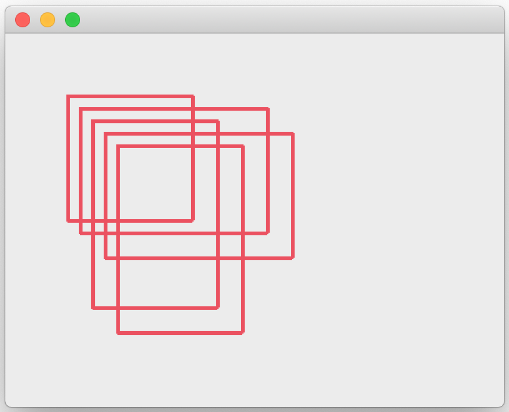

> 图168：画出来的矩形

您还可以将多个对 `drawRect` 的调用替换为对 `drawRects` 的单次调用，并传入多个 `QRect` 对象。这将产生完全相同的结果。

```python
painter.drawRects(
    QtCore.QRect(50, 50, 100, 100),
    QtCore.QRect(60, 60, 150, 100),
    QtCore.QRect(70, 70, 100, 150),
    QtCore.QRect(80, 80, 150, 100),
    QtCore.QRect(90, 90, 100, 150),
)
```

在 PyQt6 中，可以通过设置当前活动的绘图刷来填充绘制的形状，将 `QBrush` 实例传递给 `painter.setBrush()` 方法。以下示例将所有矩形填充为带图案的黄色。

*Listing 139. bitmap/rect_with_brush.py*

```python
    def draw_something(self):
        painter = QPainter(self.canvas)
        pen = QPen()
        pen.setWidth(3)
        pen.setColor(QColor("#376F9F"))
        painter.setPen(pen)
        brush = QBrush()
        brush.setColor(QColor("#FFD141"))
        brush.setStyle(Qt.BrushStyle.Dense1Pattern)
        painter.setBrush(brush)
        painter.drawRects(
            QRect(50, 50, 100, 100),
            QRect(60, 60, 150, 100),
            QRect(70, 70, 100, 150),
            QRect(80, 80, 150, 100),
            QRect(90, 90, 100, 150),
        )
        painter.end()
        self.label.setPixmap(self.canvas)
```

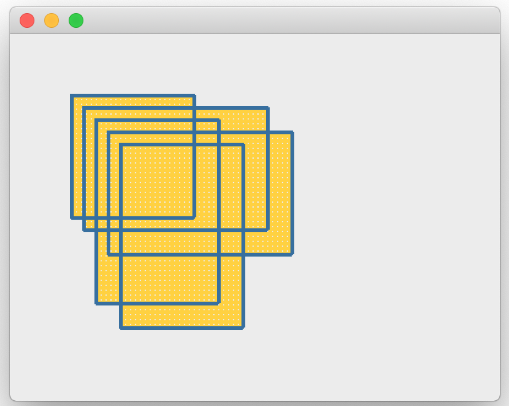

> 图169：被填上颜色的矩形

至于笔，一个画家只能使用一支画笔，但您可以在绘画时在它们之间切换或更改它们。有 [许多画笔样式图案](https://doc.qt.io/qt-5/qt.html#BrushStyle-enum) 可供选择。您可能最常使用的是 `Qt.BrushStyle.SolidPattern`。


> 您必须设置样式才能看到任何填充，因为默认值为 `Qt.BrushStyle.NoBrush`。

`drawRoundedRect` 方法绘制一个矩形，但带有圆角，因此需要额外传入两个参数，分别表示角点的 x 和 y 半径。

*Listing 140. bitmap/roundrect.py*

```python
    def draw_something(self):
        painter = QPainter(self.canvas)
        pen = QPen()
        pen.setWidth(3)
        pen.setColor(QColor("#376F9F"))
        painter.setPen(pen)
        painter.drawRoundedRect(40, 40, 100, 100, 10, 10)
        painter.drawRoundedRect(80, 80, 100, 100, 10, 50)
        painter.drawRoundedRect(120, 120, 100, 100, 50, 10)
        painter.drawRoundedRect(160, 160, 100, 100, 50, 50)
        painter.end()
        self.label.setPixmap(self.canvas)
```

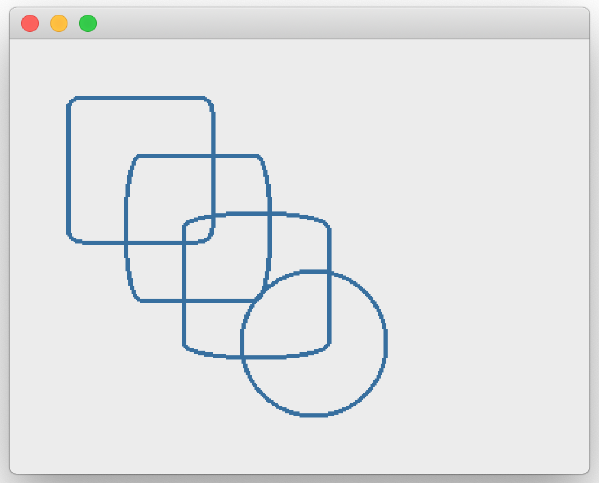

> 图170：圆角矩形


> 有一个可选的最后一个参数，用于在 x 和 y 轴的椭圆半径之间切换，这些半径以绝对像素值定义，`Qt.SizeMode.RelativeSize`（默认值）或相对于矩形的大小（作为 0…100 的值传递）。您可以传递 `Qt.SizeMode.RelativeSize` 以启用此功能。

#### `drawEllipse`

我们现在要介绍的最后一个原始绘制方法是 `drawEllipse`，它可以用于绘制椭圆或圆。


> 圆只是一个宽度和高度相等的椭圆。

*Listing 141. bitmap/ellipse.py*

```python
    def draw_something(self):
        painter = QPainter(self.canvas)
        pen = QPen()
        pen.setWidth(3)
        pen.setColor(QColor(204, 0, 0)) # r, g, b
        painter.setPen(pen)
        
        painter.drawEllipse(10, 10, 100, 100)
        painter.drawEllipse(10, 10, 150, 200)
        painter.drawEllipse(10, 10, 200, 300)
        painter.end()
        
        self.label.setPixmap(self.canvas)
```

在此示例中，`drawEllipse` 方法接受 4 个参数，其中前两个参数是矩形左上角的 x和 y 坐标，该矩形用于绘制椭圆，而后两个参数分别是该矩形的宽度和高度。

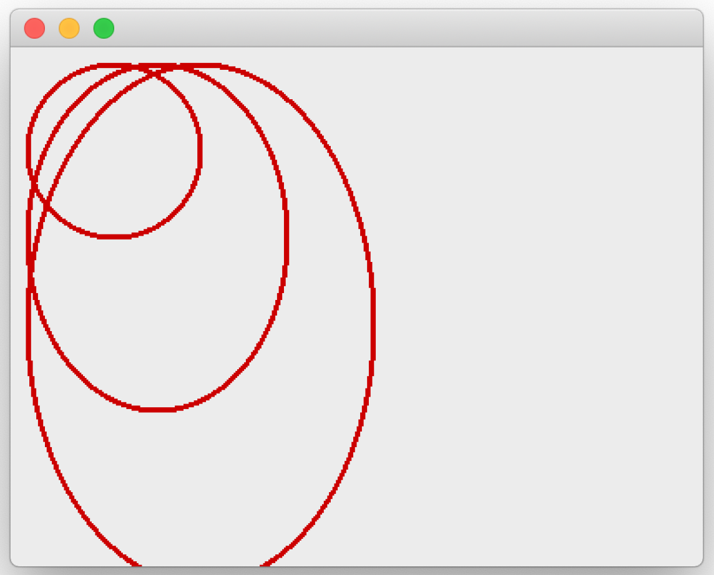

> 图171：使用x、y、宽度、高度或 `QRect` 绘制椭圆


> 您可以通过传递一个 `QRect` 来实现相同的效果。

还有另一种调用签名，它将椭圆的中心作为第一个参数，以 `QPoint` 或 `QPointF` 对象的形式提供，然后是 x 和 y 半径。下面的示例展示了它的使用方式

```python
painter.drawEllipse(QtCore.QPoint(100, 100), 10, 10)
painter.drawEllipse(QtCore.QPoint(100, 100), 15, 20)
painter.drawEllipse(QtCore.QPoint(100, 100), 20, 30)
painter.drawEllipse(QtCore.QPoint(100, 100), 25, 40)
painter.drawEllipse(QtCore.QPoint(100, 100), 30, 50)
painter.drawEllipse(QtCore.QPoint(100, 100), 35, 60)
```

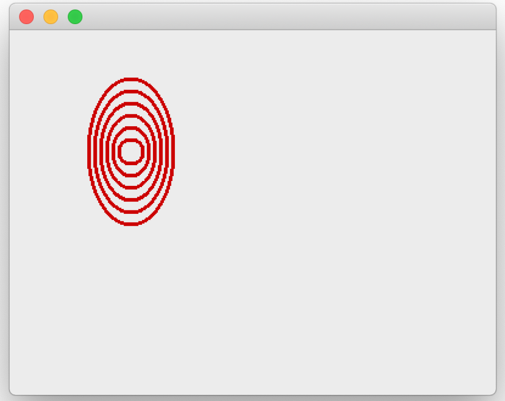

> 图172：使用点和半径绘制椭圆

您可以使用与矩形相同的 `QBrush` 方法来填充椭圆。

#### 文本

最后，我们将简要介绍 `QPainter` 的文本绘制方法。要控制 `QPainter` 的当前字体，您可以使用 `setFont` 方法并传入一个 `QFont` 实例。通过此方法，您可以控制文本的字体家族、字重和字号（以及其他属性）。文本的颜色仍由当前画笔定义，但画笔的宽度不会产生影响。

*Listing 142. bitmap/text.py*

```python
    def draw_something(self):
        painter = QPainter(self.canvas)
        
        pen = QPen()
        pen.setWidth(1)
        pen.setColor(QColor("green"))
        painter.setPen(pen)
        
        font = QFont()
        font.setFamily("Times")
        font.setBold(True)
        font.setPointSize(40)
        painter.setFont(font)
        
        painter.drawText(100, 100, "Hello, world!")
        painter.end()
        self.label.setPixmap(self.canvas)
```


> 您还可以使用 `QPoint` 或 `QPointF` 指定位置。

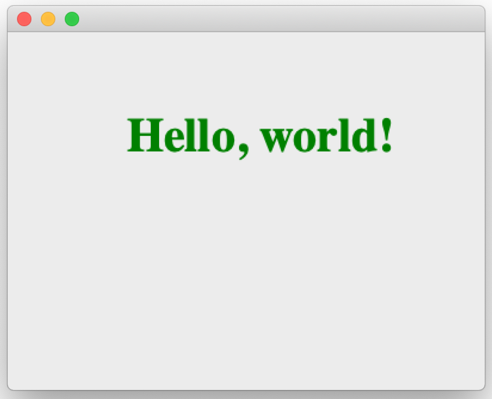

> 图173：位图文本“Hello World”示例

还有一些方法可以在指定区域内绘制文本。这里，参数定义了边界框的 x 和 y 位置以及宽度和高度。超出此框的文本将被裁剪（隐藏）。第 5 个参数标志可用于控制文本在框内的对齐方式等其他设置。

```python
painter.drawText(100, 100, 100, 100, Qt.AlignmentFlag.AlignHCenter,
                 'Hello, world!')
```

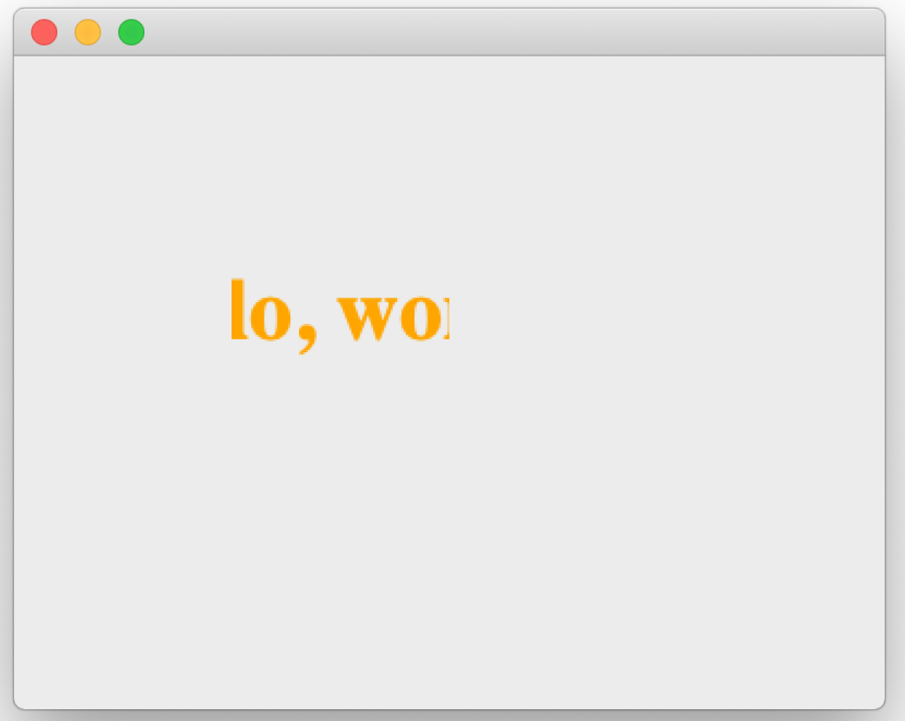

> 图174：在drawText中裁剪边界框

您可以通过在画家上设置活动字体来完全控制文本的显示。通过 `QFont` 对象设置活动字体。您还可以 [查看 QFont 文档](https://doc.qt.io/archives/qt-4.8/qfont.html) 以获取更多信息。

### 用QPainter玩点小花样

这部分内容有点复杂，所以让我们稍作休息，做点有趣的事情。到目前为止，我们一直通过程序化方式定义在 `QPixmap` 表面上执行的绘制操作。但我们同样可以根据用户输入进行绘制——例如允许用户在画布上随意涂鸦。让我们利用迄今为止学到的知识，构建一个简单的绘图应用程序。

我们可以从相同的简单应用程序框架开始，在 `MainWindow` 类中替换 `draw` 方法，添加一个`mouseMoveEvent` 处理程序。在这里，我们获取用户鼠标的当前位置，并将其绘制到画布上。

*Listing 143. bitmap/paint_start.py*

```python
import sys

from PyQt6.QtCore import Qt
from PyQt6.QtGui import QPainter, QPixmap
from PyQt6.QtWidgets import QApplication, QLabel, QMainWindow


class MainWindow(QMainWindow):
    def __init__(self):
        super().__init__()
        
        self.label = QLabel()
        self.canvas = QPixmap(400, 300)
        self.canvas.fill(Qt.GlobalColor.white)
        self.label.setPixmap(self.canvas)
        self.setCentralWidget(self.label)
        
    def mouseMoveEvent(self, e):
        pos = e.position()
        painter = QPainter(self.canvas)
        painter.drawPoint(pos.x(), pos.y())
        painter.end()
        self.label.setPixmap(self.canvas)
        
        
app = QApplication(sys.argv)
window = MainWindow()
window.show()
app.exec()
```


> 默认情况下，控件仅在按下鼠标按钮时接收鼠标移动事件，除非启用了鼠标跟踪。这可以通过 `.setMouseTracking` 方法进行配置——将该方法设置为 `True`（默认值为 `False`）将持续跟踪鼠标。

如果您保存并运行这个程序，您应该能够将鼠标移动到屏幕上并点击来绘制单个点。它应该看起来像这样——

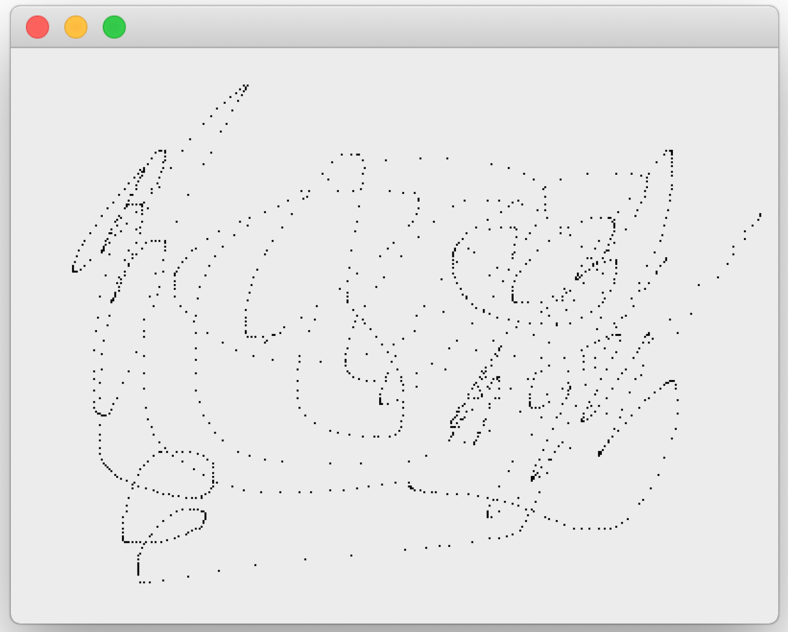

> 图175：绘制单个鼠标移动事件点

这里的问题是，当您快速移动鼠标时，它实际上会在屏幕上的不同位置之间跳跃，而不是平滑地从一个位置移动到另一个位置。鼠标移动事件（`mouseMoveEvent`）会在鼠标所在的每个位置触发，但这不足以绘制一条连续的线，除非您移动得非常缓慢。

解决这个问题的办法是画线而不是点。在每个事件中，我们只需从我们所在的位置（之前的 `.x()` 和 `.y()`）到我们现在的位置（当前的 `.x()` 和 `.y()`）画一条线。我们可以自己跟踪 `last_x` 和 `last_y` 来做到这一点。

我们还需要在释放鼠标时忘记上一个位置，否则在将鼠标在页面上移动后，我们将从该位置开始再次绘制——即无法断开线条。

*Listing 144. bitmap/paint_line.py*

```python
import sys

from PyQt6.QtCore import Qt
from PyQt6.QtGui import QPainter, QPixmap
from PyQt6.QtWidgets import QApplication, QLabel, QMainWindow


class MainWindow(QMainWindow):
    def __init__(self):
        super().__init__()
        
        self.label = QLabel()
        self.canvas = QPixmap(400, 300)
        self.canvas.fill(Qt.GlobalColor.white)
        self.label.setPixmap(self.canvas)
        self.setCentralWidget(self.label)
        
        self.last_x, self.last_y = None, None
        
    def mouseMoveEvent(self, e):
        pos = e.position()
        if self.last_x is None: # 第一个事件
            self.last_x = pos.x()
            self.last_y = pos.y()
            return # 在第一次时忽略它
        
        painter = QPainter(self.canvas)
        painter.drawLine(self.last_x, self.last_y, pos.x(), pos.y())
        painter.end()
        
        self.label.setPixmap(self.canvas)
        # 下次更新时更新源地址
        self.last_x = pos.x()
        self.last_y = pos.y()
        
    def mouseReleaseEvent(self, e):
        self.last_x = None
        self.last_y = None
        
        
app = QApplication(sys.argv)
window = MainWindow()
window.show()
app.exec()
```

如果您运行这个程序，您应该能够像预期那样在屏幕上涂鸦。

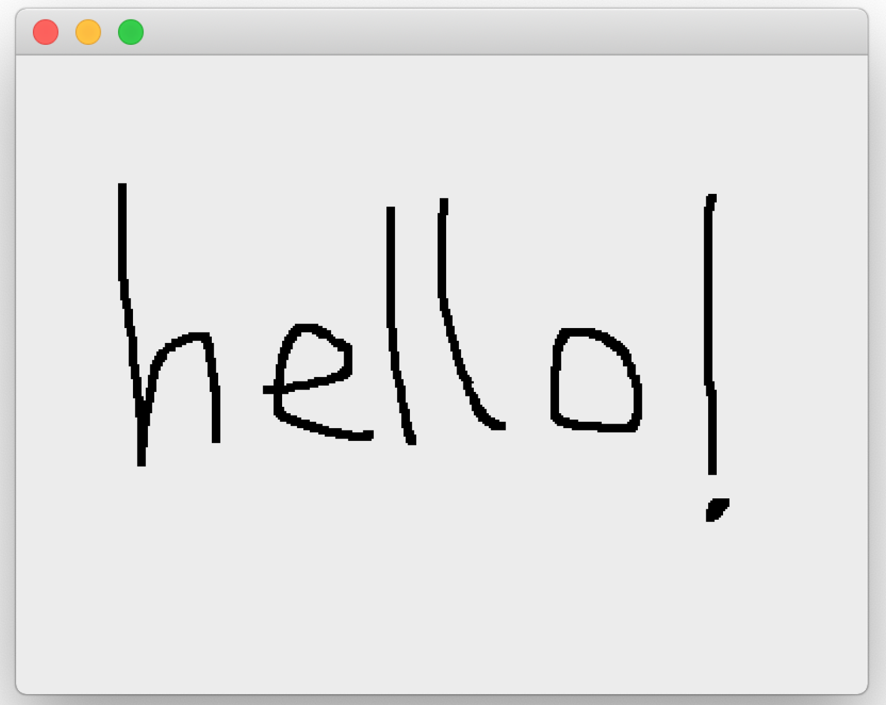

> 图176：使用鼠标进行绘图，采用连续线条。

目前效果还略显单调，因此我们添加一个简单的调色板，以便能够更改笔的颜色。

这需要进行一些重新设计，以确保鼠标位置能够被准确检测到。到目前为止，我们一直在 `QMainWindow` 上使用 `mouseMoveEvent`。当窗口中只有一个控件时，这没问题——只要您不调整窗口的大小，容器和单个嵌套控件的坐标就会对齐。但是，如果我们在布局中添加其他控件，情况就不同了—— `QLabel` 的坐标会从窗口偏移，我们就会在错误的位置绘制。然而，如果我们在布局中添加其他控件，情况就不会如此了——`QLabel` 的坐标将与窗口偏移，我们将在错误的位置绘制。

这很容易解决，只需将鼠标处理移到 `QLabel` 本身即可——它的事件坐标总是相对于自身而言的。我们将它作为一个单独的 `Canvas` 对象进行包装，该对象负责创建像素图表面，设置 x 和 y 位置，并保存当前的笔颜色（默认设置为黑色）。


> 这个独立的 `Canvas` 是一个可直接使用的绘图表面，你可以在自己的应用程序中使用它。

*Listing 145. bitmap/paint.py*

```python
import sys

from PyQt6.QtCore import QPoint, QSize, Qt
from PyQt6.QtGui import QColor, QPainter, QPen, QPixmap
from PyQt6.QtWidgets import (
QApplication,
QHBoxLayout,
QLabel,
QMainWindow,
QPushButton,
QVBoxLayout,
QWidget,
)

class Canvas(QLabel):
    def __init__(self):
        super().__init__()
        self._pixmap = QPixmap(600, 300)
        self._pixmap.fill(Qt.GlobalColor.white)
        self.setPixmap(self._pixmap)
        
        self.last_x, self.last_y = None, None
        self.pen_color = QColor("#000000")
        
    def set_pen_color(self, c):
        self.pen_color = QColor(c)
        
    def mouseMoveEvent(self, e):
        pos = e.position()
        if self.last_x is None: # 第一个事件
            self.last_x = pos.x()
            self.last_y = pos.y()
            return # 在第一次时将它忽略
        
        painter = QPainter(self._pixmap)
        p = painter.pen()
        p.setWidth(4)
        p.setColor(self.pen_color)
        painter.setPen(p)
        painter.drawLine(self.last_x, self.last_y, pos.x(), pos.y())
        painter.end()
        self.setPixmap(self._pixmap)
        
        # 下次更新时更新源地址
        self.last_x = pos.x()
        self.last_y = pos.y()
        
    def mouseReleaseEvent(self, e):
        self.last_x = None
        self.last_y = None
```

对于颜色选择，我们将基于 `QPushButton` 创建一个自定义控件。该控件接受一个颜色参数，该参数可以是 `QColor` 实例、颜色名称（“red”、black）或十六进制值。该颜色设置在控件的背景上，以便识别。我们可以使用标准的 `QPushButton.pressed` 信号将其连接到任何操作。

*Listing 146. bitmap/paint.py*

```python
COLORS = [
    # 17种底色 https://lospec.com/palette-list/17undertones
    "#000000",
    "#141923",
    "#414168",
    "#3a7fa7",
    "#35e3e3",
    "#8fd970",
    "#5ebb49",
    "#458352",
    "#dcd37b",
    "#fffee5",
    "#ffd035",
    "#cc9245",
    "#a15c3e",
    "#a42f3b",
    "#f45b7a",
    "#c24998",
    "#81588d",
    "#bcb0c2",
    "#ffffff",
]
class QPaletteButton(QPushButton):
    def __init__(self, color):
        super().__init__()
        self.setFixedSize(QSize(24, 24))
        self.color = color
        self.setStyleSheet("background-color: %s;" % color)
```

定义了这两个新部分后，我们只需遍历颜色列表，为每个颜色创建一个 `QPaletteButton`，并传递颜色即可。然后将它的 `pressed` 信号连接到画布上的 `set_pen_color` 处理程序（通过 `lambda` 间接传递额外的颜色数据），并将其添加到调色板布局中。

*Listing 147. bitmap/paint.py*

```python
class MainWindow(QMainWindow):
    def __init__(self):
        super().__init__()
        
        self.canvas = Canvas()
        
        w = QWidget()
        l = QVBoxLayout()
        w.setLayout(l)
        l.addWidget(self.canvas)
        
        palette = QHBoxLayout()
        self.add_palette_buttons(palette)
        l.addLayout(palette)
        
        self.setCentralWidget(w)
        
    def add_palette_buttons(self, layout):
        for c in COLORS:
            b = QPaletteButton(c)
            b.pressed.connect(lambda c=c: self.canvas.set_pen_color(
                c))
            layout.addWidget(b)
            
            
app = QApplication(sys.argv)
window = MainWindow()
window.show()
app.exec()
```

这将为您提供一个功能齐全的多色绘画应用程序，您可以在画布上画线并从颜色调色板中选择颜色。

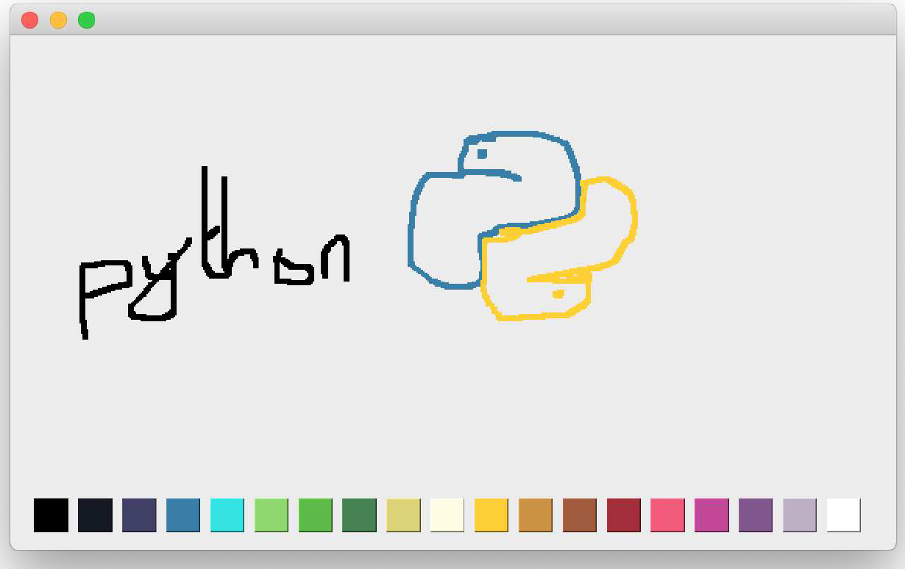

> 图177：遗憾的是，这并不能让您的画技变得优秀。

#### 喷雾效果

为了增加一点趣味，您可以用以下代码替换 `mouseMoveEvent`，以使用“喷雾罐”效果代替直线绘制。这是通过使用 `random.gauss` 生成当前鼠标位置周围的一系列正态分布点来模拟的，然后我们使用 `drawPoint` 绘制这些点。

*Listing 148. bitmap/spraypaint.py*

```python
import random
import sys

from PyQt6.QtCore import QSize, Qt
from PyQt6.QtGui import QColor, QPainter, QPen, QPixmap
from PyQt6.QtWidgets import (
    QApplication,
    QHBoxLayout,
    QLabel,
    QMainWindow,
    QPushButton,
    QVBoxLayout,
    QWidget,
)
SPRAY_PARTICLES = 100
SPRAY_DIAMETER = 10

class Canvas(QLabel):
    def __init__(self):
        super().__init__()
        self._pixmap = QPixmap(600, 300)
        self._pixmap.fill(Qt.GlobalColor.white)
        self.setPixmap(self._pixmap)
        
        self.pen_color = QColor("#000000")
        
    def set_pen_color(self, c):
        self.pen_color = QColor(c)
        
    def mouseMoveEvent(self, e):
        pos = e.position()
        painter = QPainter(self._pixmap)
        p = painter.pen()
        p.setWidth(1)
        p.setColor(self.pen_color)
        painter.setPen(p)
        
        for n in range(SPRAY_PARTICLES):
            xo = random.gauss(0, SPRAY_DIAMETER)
            yo = random.gauss(0, SPRAY_DIAMETER)
            painter.drawPoint(pos.x() + xo, pos.y() + yo)
            
        self.setPixmap(self._pixmap)
```


> 对于喷雾罐，我们无需追踪上一次的位置，因为我们总是围绕当前点进行喷涂。

我们在文件顶部定义 `SPRAY_PARTICLES` 和 `SPRAY_DIAMETER` 变量，并导入随机标准库模块。下图显示了使用以下设置时的喷雾行为：

```python
import random

SPRAY_PARTICLES = 100
SPRAY_DIAMETER = 10
```

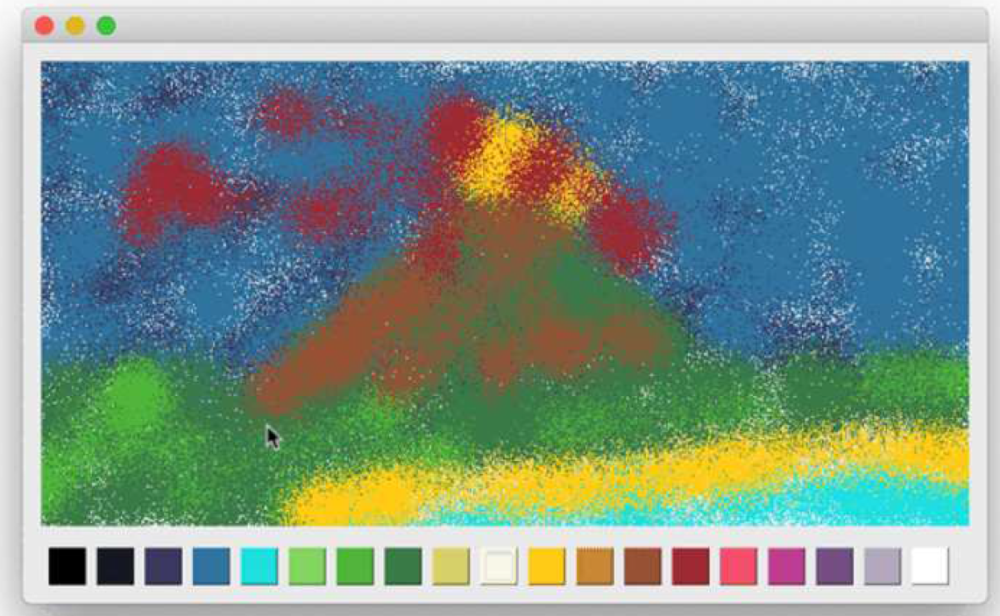

> 图178：请叫我毕加索

如果您想挑战一下自己，可以尝试添加一个额外的按钮来在绘制和喷涂模式之间切换，或者添加一个输入控件来定义笔刷/喷涂的直径。


> 要获取一个使用 Python 和 Qt 编写的完整功能绘图应用程序，请访问我们在 GitHub 上“Minute apps”仓库中的 [Piecasso](https://github.com/learnpyqt/15-minute-apps/tree/master/paint)。

通过本介绍，您应该已经对 `QPainter` 的功能有了一个大致的了解。如上所述，该系统是所有控件绘制的基础。如果您想进一步了解，可以查看控件的 `.paint()` 方法，该方法接收一个 `QPainter` 实例，以允许控件在自身上进行绘制。您在这里学到的相同方法可以在 `.paint()` 中使用，以绘制一些基本的自定义控件。

## 22. 创建自定义控件

在上一章中，我们介绍了 `QPainter`，并学习了一些基本的位图绘制操作，您可以使用这些操作在 `QPainter` 表面（例如 `QPixmap`）上绘制点、线、矩形和圆。使用 `QPainter` 在表面上绘制图形的过程实际上是 Qt 中所有控件绘制的基础。现在您已经了解如何使用 `QPainter`，您知道如何绘制自己的自定义控件了！在本章中，我们将运用迄今为止所学到的知识，构建一个全新的自定义控件。在本章中，我们将运用迄今为止所学到的知识，构建一个全新的自定义控件——一个可自定义的带刻度盘控制的 `PowerBar` 仪表。

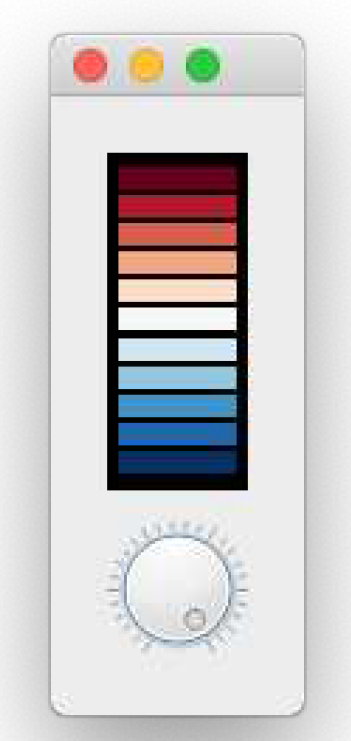

> 图179： `PowerBar` 仪表

该控件实际上是一个复合控件和自定义控件的混合体，因为我们使用内置的 Qt `QDial` 组件来绘制拨盘，而电源条则由我们自己绘制。然后，我们将这两个部分组合到一个父控件中 ，该控件可以无缝地放入任何应用程序中，而无需了解其组合方式。最终的控件提供了常见的`QAbstractSlider` 接口，并添加了一些用于配置条形显示的功能。

按照这个示例，您将能够构建自己的自定义控件——无论它们是内置控件的组合，还是完全新颖的自绘制控件。

### 开始

正如我们之前所看到的，复合控件只是应用了布局的控件，其本身包含 >1 个其他控件。最终的“控件”可以像其他控件一样使用，内部结构可以根据需要隐藏或显示。

以下是我们 PowerBar 控件的轮廓——我们将从这个轮廓草稿开始逐步构建我们的自定义控件。

*Listing 149. custom-widgets/stub.py*

```python
import sys

from PyQt6 import QtCore, QtGui, QtWidgets
from PyQt6.QtCore import Qt


class _Bar(QtWidgets.QWidget):
    pass

class PowerBar(QtWidgets.QWidget):
    """
    用于显示电源条和拨号盘的自定义 Qt 控件。
    演示复合和自定义绘制的控件。
    """
    
    def __init__(self, parent=None, steps=5):
        super().__init__(parent)
        
        layout = QtWidgets.QVBoxLayout()
        self._bar = _Bar()
        layout.addWidget(self._bar)
        
        self._dial = QtWidgets.QDial()
        layout.addWidget(self._dial)
        
        self.setLayout(layout)
        
        
app = QtWidgets.QApplication(sys.argv)
volume = PowerBar()
volume.show()
app.exec()
```

这只是定义了我们的自定义电源条在`_Bar` 对象中定义——这里只是未更改的 `QWidget` 子类。`PowerBar` 控件（完整的控件）结合了这一点，使用 `QVBoxLayout` 与内置的 `QDial` 一起显示它们。


> 我们无需创建 `QMainWindow`，因为任何没有父控件的控件都是一个独立的窗口。我们的自定义 `PowerBar` 控件将显示为一个普通的窗口。

您可以随时运行此文件来查看控件的运行情况。现在运行它，您应该会看到如下内容：

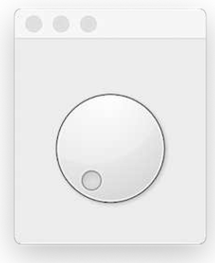

> 图180：PowerBar 旋钮。

如果将窗口向下拉伸，您会发现拨号盘上方比下方有更多空间——这是由我们的（目前不可见的）`_Bar` 控件占用的。

### `paintEvent`

`paintEvent` 处理程序是 PyQt6 中所有控件绘制的核心。控件的每次完整和部分重绘都是通过 `paintEvent` 触发的，该事件由控件滑块处理以绘制自身。`paintEvent` 可以由以下因素触发：

- 调用了 [repaint()](https://doc.qt.io/qt-5/qwidget.html#repaint) 或 [update()](https://doc.qt.io/qt-5/qwidget.html#update)
- 控件被遮挡，现在已露出
- 控件已调整大小

——但还有许多其他原因也会导致这种情况。重要的是，当 `paintEvent` 被触发时，您的控件能够重新绘制它。

如果控件足够简单（就像我们的控件一样），通常只需在发生任何变化时重新绘制整个控件即可。但对于更复杂的控件，这种方法效率非常低。对于这些情况，`paintEvent` 包括需要更新的特定区域。我们将在后面更复杂的示例中使用此方法。

现在，我们将做一件非常简单的事情，用一种颜色填充整个控件。这样，我们就可以看到要绘制条形图的区域了。请您将以下代码添加到 `_Bar` 类中。

*Listing 150. custom-widgets/powerbar_1.py*

```python
    def paintEvent(self, e):
        painter = QtGui.QPainter(self)
        brush = QtGui.QBrush()
        brush.setColor(QtGui.QColor("black"))
        brush.setStyle(Qt.BrushStyle.SolidPattern)
        rect = QtCore.QRect(
            0,
            0,
            painter.device().width(),
            painter.device().height(),
        )
        painter.fillRect(rect, brush)
```

### 定位

现在，我们可以看到 `_Bar` 控件，可以调整其位置和大小。如果拖动窗口形状，您应该会看到两个控件改变形状以适应可用空间。这是我们想要的效果，但 `QDial` 也垂直扩展得比应该的更多，留出了我们可以用来放置条形图的空白空间。

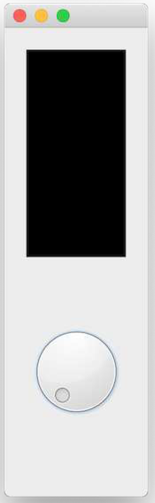

> 图181：PowerBar 伸展并留出了空间

我们可以对 `_Bar` 控件使用 `setSizePolicy`，以确保它尽可能地扩展。通过使用 `QSizePolicy.MinimumExpanding`，提供的 `sizeHint` 将被用作最小值，控件将尽可能地扩展。

*Listing 151. custom-widgets/powerbar_2.py*

```python
class _Bar(QtWidgets.QWidget):
    def __init__(self):
        super().__init__()
        
        self.setSizePolicy(
            QtWidgets.QSizePolicy.Policy.MinimumExpanding,
            QtWidgets.QSizePolicy.Policy.MinimumExpanding,
        )
        
    def sizeHint(self):
        return QtCore.QSize(40, 120)
    
    def paintEvent(self, e):
        painter = QtGui.QPainter(self)
        brush = QtGui.QBrush()
        brush.setColor(QtGui.QColor("black"))
        brush.setStyle(Qt.BrushStyle.SolidPattern)
        rect = QtCore.QRect(
            0,
            0,
            painter.device().width(),
            painter.device().height(),
        )
        painter.fillRect(rect, brush)
```

虽然 `QDial` 控件的大小调整还有些不理想，但我们的条形图现在可以扩展到填满所有可用空间了。

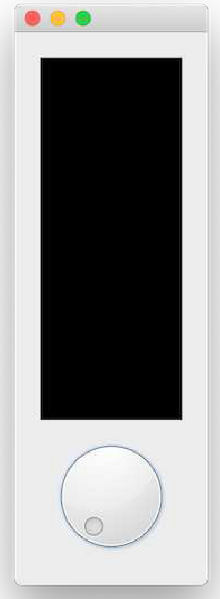

> 图182：PowerBar 的政策设置为 QSizePolicy.MinimumExpanding。

定位完成后，我们现在可以继续定义绘制方法，在控件顶部（目前为黑色）绘制 PowerBar 计量表。

### 更新显示

现在，我们的画布已经完全填充为黑色，接下来，我们将使用 `QPainter` 绘制命令在控件上实际绘制一些内容。

在开始绘制条形图之前，我们需要进行一些测试，以确保我们可以使用刻度盘的值更新显示。请将以下代码添加到 `_Bar.paintEvent` 中：

*Listing 152. custom-widgets/powerbar_3.py*

```python
    def paintEvent(self, e):
        painter = QtGui.QPainter(self)
        
        brush = QtGui.QBrush()
        brush.setColor(QtGui.QColor("black"))
        brush.setStyle(Qt.BrushStyle.SolidPattern)
        rect = QtCore.QRect(
            0,
            0,
            painter.device().width(),
            painter.device().height(),
        )
        painter.fillRect(rect, brush)
        
        # 获取当前状态。
        dial = self.parent()._dial
        vmin, vmax = dial.minimum(), dial.maximum()
        value = dial.value()
        
        pen = painter.pen()
        pen.setColor(QtGui.QColor("red"))
        painter.setPen(pen)
        
        font = painter.font()
        font.setFamily("Times")
        font.setPointSize(18)
        painter.setFont(font)
        
        painter.drawText(
            25, 25, "{}-->{}<--{}".format(vmin, value, vmax)
        )
        painter.end()
```

这会像之前一样绘制黑色背景，然后使用 `.parent()` 访问我们的父级 `PowerBar` 控件，并通过 `_dial` 访问 `QDial`。在那里我们可以获得当前值以及允许的最小值和最大值。最后，我们使用绘图器绘制这些值，就像之前部分一样。


> 我们在这里将当前值、最小值和最大值的处理交给 `QDial`，但我们也可以自己存储这些值，并使用来自/发往拨盘的信号来保持同步。

运行这个程序，转动旋钮，然后……什么也没发生。尽管我们已经定义了 `paintEvent` 处理程序，但当旋钮发生变化时，我们并没有触发重新绘制。


> 您可以通过调整窗口大小强制刷新，一旦您这样做，您应该会看到文本出现。很巧妙，但用户体验很糟糕——“只需调整应用程序大小即可查看设置！”

要解决这个问题，我们需要将 `_Bar` 控件与 `dial` 上的值变化挂钩，以响应地重新绘制自身。我们可以使用 `QDial.valueChanged` 信号来做到这一点，将它与一个自定义槽方法挂钩，该方法调用 `.refresh()`，从而触发完全重绘。

请您将以下方法添加到 `_Bar` 控件中

*Listing 153. custom-widgets/powerbar_4.py*

```python
    def _trigger_refresh(self):
        self.update()
```

…并将以下内容添加到父级 `PowerBar` 控件的 `__init__` 块中。

*Listing 154. custom-widgets/powerbar_4.py*

```python
        self._dial = QtWidgets.QDial()
        self._dial.valueChanged.connect(self._bar._trigger_refresh)
        layout.addWidget(self._dial)
```

如果您现在重新运行代码，您应该会看到显示屏会自动更新，当您转动旋钮时（用鼠标点击并拖动）当前值将以文本形式显示。

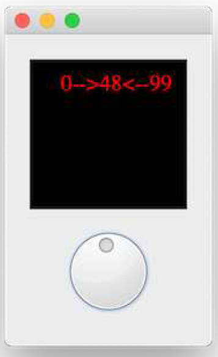

> 图183：PowerBar 以文本形式显示当前值

### 绘制条

现在我们已经实现了显示屏的更新并显示指针的当前值，我们可以继续绘制实际的条形显示。这部分稍微复杂一些，需要一些数学计算来确定条形的位置，但我们会一步步讲解，以便大家明白其中的原理。

下图显示了我们的目标——一系列 N 个框，从控件边缘内嵌，之间留有空格。

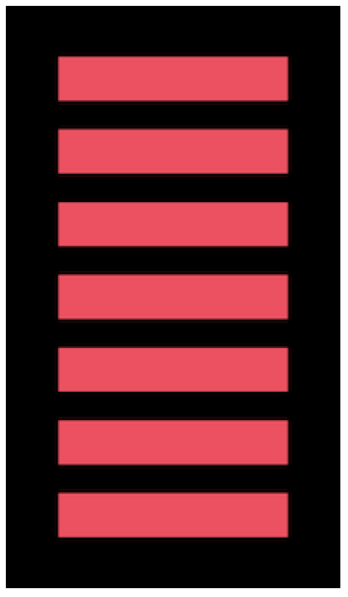

> 图184：我们正在努力实现的条形图分段及布局方案

#### 计算要绘制的内容

要绘制的框的数量由当前值决定——以及它在 `QDial` 配置的最小值和最大值之间的位置。我们在上面的示例中已经有了这些信息。

```python
dial = self.parent()._dial
vmin, vmax = dial.minimum(), dial.maximum()
value = dial.value()
```

如果值位于 `vmin` 和 `vmax` 的中间，则我们希望绘制一半的框。（如果总共有4个框，则绘制2个）。如果值为 `vmax` ，则我们希望绘制所有框。

要实现这一点，我们首先将 `value` 转换为0到1之间的数值，其中 `0 = vmin`，`1 = vmax`。我们首先从值中减去 `vmin`，以将可能 `value` 的范围调整为从零开始——即从 `vmin…vmax` 调整为 `0…(vmax-vmin)`。将此值除以 `vmax-vmin` （新的最大值）即可得到一个介于0和1之间的数值。

然后，将这个值（下文称为 `pc`）乘以步长，即可得到一个介于 0 和 5 之间的数值——即需要绘制的方块数量。

```python
pc = (value - vmin) / (vmax - vmin)
n_steps_to_draw = int(pc * 5)
```

我们将结果包装为整数以将其转换为整数（向下取整）以去除任何部分的框。

请您在您的绘制事件中更新 `drawText` 方法以写出这个数字。

*Listing 155. custom-widgets/powerbar_5.py*

```python
    def paintEvent(self, e):
        painter = QtGui.QPainter(self)
        
        brush = QtGui.QBrush()
        brush.setColor(QtGui.QColor("black"))
        brush.setStyle(Qt.BrushStyle.SolidPattern)
        rect = QtCore.QRect(
            0,
            0,
            painter.device().width(),
            painter.device().height(),
        )
        painter.fillRect(rect, brush)
        
        # 获取当前状态。
        dial = self.parent()._dial
        vmin, vmax = dial.minimum(), dial.maximum()
        value = dial.value()
        
        pen = painter.pen()
        pen.setColor(QtGui.QColor("red"))
        painter.setPen(pen)
        
        font = painter.font()
        font.setFamily("Times")
        font.setPointSize(18)
        painter.setFont(font)
        
        pc = (value - vmin) / (vmax - vmin)
        n_steps_to_draw = int(pc * 5)
        painter.drawText(25, 25, "{}".format(n_steps_to_draw))
        painter.end()
```

当您转动旋钮时，现在您将看到一个介于0和5之间的数字。

#### 绘制框体

接下来，我们希望将这个数字 0…5 转换为画布上绘制的条形数量。首先，删除 `drawText`、字体和画笔设置，因为我们不再需要这些。

为了准确绘制，我们需要知道画布的大小，即控件的大小。我们还将在边缘添加一些填充，以便在黑色背景上为块的边缘留出空间。


> `QPainter` 中的所有测量单位均为像素。

*Listing 156. custom-widgets/powerbar_6.py*

```python
        padding = 5
        # 定义我们的画布.
        d_height = painter.device().height() - (padding * 2)
        d_width = painter.device().width() - (padding * 2)
```

我们获取高度和宽度，然后从每个值中减去 `2 * padding` ——这里是 2 倍，因为我们同时对左右（以及上下）边缘进行填充。这样就得到了最终的有效画布区域，分别存储在 `d_height` 和 `d_width` 中。

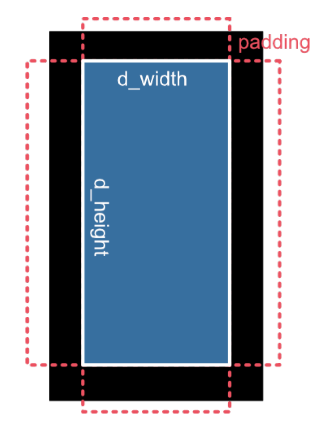

> 图185：布局外部的填充部分

我们需要将 `d_height` 分成5等份，每份对应一个块——我们可以通过`d_height / 5`来计算这个高度。此外，由于我们希望在块之间留有间隙，我们需要计算这个步长中有多少被间隙（顶部和底部，因此减半）占用，有多少是实际的块。

*Listing 157. custom-widgets/powerbar_6.py*

```python
        step_size = d_height / 5
        bar_height = step_size * 0.6
```

这些值是我们绘制画布上方块所需的全部信息。为此，我们使用 `range` 函数从 0 开始计数，直到步数减 1，然后为每个方块绘制一个 `fillRect` 区域。

*Listing 158. custom-widgets/powerbar_6.py*

```python
        brush.setColor(QtGui.QColor("red"))

        for n in range(n_steps_to_draw):
            ypos = (1 + n) * step_size
            rect = QtCore.QRect(
                padding,
                padding + d_height - int(ypos),
                d_width,
                int(bar_height),
            )
            painter.fillRect(rect, brush)
```

在块的放置计算中涉及大量内容，因此我们先逐一分析这些步骤。

用于绘制填充矩形的 `fillRect` 被定义为一个 `QRect` 对象，我们依次向其传入左侧 x 坐标、顶部 y 坐标、宽度和高度。

宽度是整个画布宽度减去填充，我们之前已经计算并存储在 `d_width` 中。左侧 x 同样只是控件左侧的 `padding` 的值（5px）。

我们计算的栏杆高度 `bar_height` 为 `step_size` 的 0.6 倍。

这使得参数  `d_height - ((1 + n) * step_size)` 确定要绘制的矩形的顶部 y 位置。这是在绘制方块时唯一会变化的计算。


> 请记住，`QPainter` 中的 y 坐标从顶部开始，并向下增加。这意味着在 `d_height` 处绘制将对应于画布的最底部。


> 要在最底部绘制一个块，我们必须从 `d_height-step_size` 开始绘制，即向上绘制一个块以留出空间向下绘制。

在我们的条计量器中，我们依次绘制方块，从底部开始并向上绘制。因此，我们的第一个方块必须放置在 `d_height-step_size` 处，而第二个方块放置在 `d_height-(step_size*2)` 处。我们的循环从 0 开始向上迭代，因此我们可以使用以下公式实现这一点：

```python
ypos = (1 + n) * step_size
y = d_height - ypos
```

这将生成以下布局。


在下图中，当前的n值已被打印在框上，并且一个蓝色的框已被绘制在完整的 `step_size` 周围，这样您可以看到填充和间隔符的实际效果。

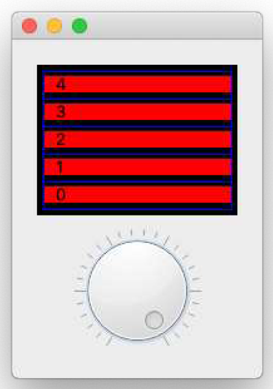

> 图186：显示每个段落所占用的整个区域（蓝色部分）

将以上内容整合在一起，就会得到以下代码，运行后将生成一个带红色块的工作电源条控件。您可以来回拖动滚轮，条形将随之上下移动。

*Listing 159. custom-widgets/powerbar_6b.py*

```python
import sys

from PyQt6 import QtCore, QtGui, QtWidgets
from PyQt6.QtCore import Qt


class _Bar(QtWidgets.QWidget):
    def __init__(self):
        super().__init__()
        
        self.setSizePolicy(
            QtWidgets.QSizePolicy.Policy.MinimumExpanding,
            QtWidgets.QSizePolicy.Policy.MinimumExpanding,
        )
        
    def sizeHint(self):
        return QtCore.QSize(40, 120)
    
    def paintEvent(self, e):
        painter = QtGui.QPainter(self)
        
        brush = QtGui.QBrush()
        brush.setColor(QtGui.QColor("black"))
        brush.setStyle(Qt.BrushStyle.SolidPattern)
        rect = QtCore.QRect(
            0,
            0,
            painter.device().width(),
            painter.device().height(),
        )
        painter.fillRect(rect, brush)
        
        # 获取当前状态.
        dial = self.parent()._dial
        vmin, vmax = dial.minimum(), dial.maximum()
        value = dial.value()
        
        pc = (value - vmin) / (vmax - vmin)
        n_steps_to_draw = int(pc * 5)
        
        padding = 5
        
        # 定义我们的画布.
        d_height = painter.device().height() - (padding * 2)
        d_width = painter.device().width() - (padding * 2)
        
        step_size = d_height / 5
        bar_height = step_size * 0.6
        
        brush.setColor(QtGui.QColor("red"))
        
        for n in range(n_steps_to_draw):
            ypos = (1 + n) * step_size
            rect = QtCore.QRect(
                padding,
                padding + d_height - int(ypos),
                d_width,
                int(bar_height),
            )
            painter.fillRect(rect, brush)
            painter.end()
            
    def _trigger_refresh(self):
        self.update()
class PowerBar(QtWidgets.QWidget):
    """
    自定义 Qt 控件，用于显示电源条和拨盘。
    演示复合和自定义绘制的控件.
    """
    
    def __init__(self, parent=None, steps=5):
        super().__init__(parent)
        
        layout = QtWidgets.QVBoxLayout()
        self._bar = _Bar()
        layout.addWidget(self._bar)
        
        self._dial = QtWidgets.QDial()
        self._dial.valueChanged.connect(self._bar._trigger_refresh)
        layout.addWidget(self._dial)
        
        self.setLayout(layout)
        
        
app = QtWidgets.QApplication(sys.argv)
volume = PowerBar()
volume.show()
app.exec()
```

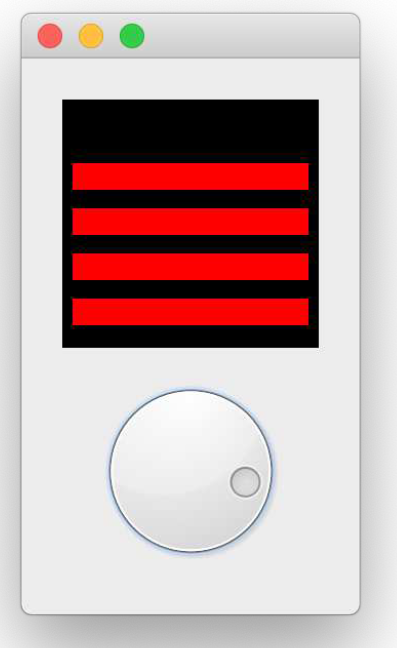

> 图187：基础版全功能PowerBar

这已经可以完成工作了，但我们可以更进一步，提供更多自定义选项，添加一些用户体验改进，并改进与我们的控件配合使用的 API。

### 自定义条

现在，我们已经拥有了一个可通过旋钮控制的电源条。但在创建控件时，最好提供一些选项来配置控件的行为，以使其更加灵活。在本部分中，我们将添加一些方法来设置可自定义的分段数、颜色、填充和间距。首先，我们需要创建一个可自定义的电源条。

我们将提供定制化的元素包括——

| 选项              | 描述                                                    |
| ----------------- | ------------------------------------------------------- |
| 条数              | 控件上显示多少个条？                                    |
| 颜色              | 每个条的颜色各不相同                                    |
| 背景色            | 绘图画布的颜色（默认黑色）                              |
| 填充              | 控件边缘周围的空间，在条和画布边缘之间                  |
| 条高度 / 条百分比 | 条中实心部分的比例（0…1）（其余部分为相邻条之间的间隔） |

我们可以将这些属性存储在 `_bar` 对象上，并在 `paintEvent` 方法中使用它们来更改其行为。

`_Bar.__init__` 已更新，可接受初始参数，用于指定条形图的条数（作为整数）或条形图的颜色（作为 `QColor` 列表、十六进制值或名称）。如果提供数字，所有条形图将被涂成红色。如果提供颜色列表，条形图的数量将根据颜色列表的长度确定。默认值为 `self._bar_solid_colors`。如果提供数字，所有条形将被设置为红色。如果提供颜色列表，条形数量将根据颜色列表的长度确定。`self._bar_solid_percent`、`self._background_color`、`self._padding` 的默认值也已设置。

*Listing 160. custom-widgets/powerbar_7.py*

```python
class _Bar(QtWidgets.QWidget):
    def __init__(self, steps):
        super().__init__()
        self.setSizePolicy(
            QtWidgets.QSizePolicy.Policy.MinimumExpanding,
            QtWidgets.QSizePolicy.Policy.MinimumExpanding,
        )
        
        if isinstance(steps, list):
            # 颜色列表。
            self.n_steps = len(steps)
            self.steps = steps
            
        elif isinstance(steps, int):
            # 条数，默认颜色为红色。
            self.n_steps = steps
            self.steps = ["red"] * steps
            
        else:
            raise TypeError("steps must be a list or int")
            
        self._bar_solid_percent = 0.8
        self._background_color = QtGui.QColor("black")
        self._padding = 4 # 边缘周围有n像素的间隙。
```

同样，我们更新 `PowerBar.__init__` 以接受 `steps` 参数，并将其传递下去。

*Listing 161. custom-widgets/powerbar_7.py*

```python
class PowerBar(QtWidgets.QWidget):
    """
    自定义 Qt 控件，用于显示电源条和拨盘。
    演示复合和自定义绘制的控件.
    """
    def __init__(self, parent=None, steps=5):
        super().__init__(parent)
        
        layout = QtWidgets.QVBoxLayout()
        self._bar = _Bar(steps)
        
        layout.addWidget(self._bar)
        
        self._dial = QtWidgets.QDial()
        self._dial.valueChanged.connect(self._bar._trigger_refresh)
        layout.addWidget(self._dial)
        
        self.setLayout(layout)
```

现在我们已经准备好参数来更新 `paintEvent` 方法。修改后的代码如下所示。

*Listing 162. custom-widgets/powerbar_7.py*

```python
    def paintEvent(self, e):
        painter = QtGui.QPainter(self)
        
        brush = QtGui.QBrush()
        brush.setColor(self._background_color)
        brush.setStyle(Qt.BrushStyle.SolidPattern)
        rect = QtCore.QRect(
            0,
            0,
            painter.device().width(),
            painter.device().height(),
        )
        painter.fillRect(rect, brush)
        
        # 获取当前状态.
        dial = self.parent()._dial
        vmin, vmax = dial.minimum(), dial.maximum()
        value = dial.value()
        
        # 定义我们的画布.
        d_height = painter.device().height() - (self._padding * 2)
        d_width = painter.device().width() - (self._padding * 2)
        
        # 绘制条.
        step_size = d_height / self.n_steps
        bar_height = step_size * self._bar_solid_percent
        
        # 根据范围内的值计算y轴停止位置.
        pc = (value - vmin) / (vmax - vmin)
        n_steps_to_draw = int(pc * self.n_steps)
        
        for n in range(n_steps_to_draw):
            brush.setColor(QtGui.QColor(self.steps[n]))
            ypos = (1 + n) * step_size
            rect = QtCore.QRect(
                self._padding,
                self._padding + d_height - int(ypos),
                d_width,
                int(bar_height),
            )
            painter.fillRect(rect, brush)
            
         painter.end()
```

现在您可以尝试为 `PowerBar` 的 `__init__` 方法传入不同的值，例如增加条数或提供颜色列表。以下是一些示例：


> 一个不错的十六进制颜色调色板来源是 [Bokeh库](https://github.com/bokeh/bokeh/blob/master/bokeh/palettes.py)。

```python
PowerBar(10)
PowerBar(3)
PowerBar(["#5e4fa2", "#3288bd", "#66c2a5", "#abdda4", "#e6f598",
"#ffffbf", "#fee08b", "#fdae61", "#f46d43", "#d53e4f", "#9e0142"])
PowerBar(["#a63603", "#e6550d", "#fd8d3c", "#fdae6b", "#fdd0a2",
"#feedde"])
```

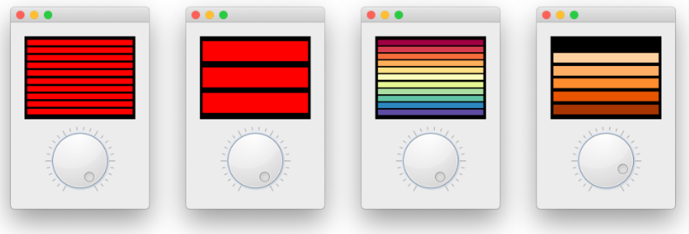

> 图188：一些PowerBar示例

您可以通过修改变量（例如：`self._bar_solid_percent`）来调整填充设置，但提供专门的方法来设置这些参数会更方便。


> 我们遵循 Qt 标准，使用驼峰式命名法为这些外部方法命名，以与从 `QDial` 继承的其他方法保持一致。

*Listing 163. custom-widgets/powerbar_8.py*

```python
    def setColor(self, color):
        self._bar.steps = [color] * self._bar.n_steps
        self._bar.update()
        
    def setColors(self, colors):
        self._bar.n_steps = len(colors)
        self._bar.steps = colors
        self._bar.update()
        
    def setBarPadding(self, i):
        self._bar._padding = int(i)
        self._bar.update()
        
    def setBarSolidPercent(self, f):
        self._bar._bar_solid_percent = float(f)
        self._bar.update()
        
    def setBackgroundColor(self, color):
        self._bar._background_color = QtGui.QColor(color)
        self._bar.update()
```

在每种情况下，我们都设置了 `_bar` 对象上的私有变量，然后调用 `_bar.update()` 来触发控件的重绘。该方法支持将颜色更改为单一颜色，或更新颜色列表——设置颜色列表也可用于更改条形图的数量。


> 目前没有方法可以设置条数，因为扩展颜色列表会比较复杂。不过您可以尝试自己添加！

以下是一个示例，使用25像素的填充、实心条形图和灰色背景。

```python
bar = PowerBar(["#49006a", "#7a0177", "#ae017e", "#dd3497", "#f768a1",
"#fa9fb5", "#fcc5c0", "#fde0dd", "#fff7f3"])
bar.setBarPadding(2)
bar.setBarSolidPercent(0.9)
bar.setBackgroundColor('gray')
```

使用这些设置，您将获得以下结果。

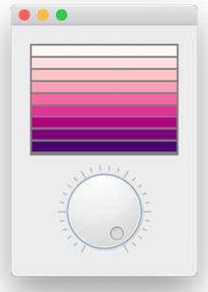

> 图189：配置PowerBar

#### 添加 QAbstractSlider 接口

我们添加了用于配置电源条行为的方法。但我们目前无法从控件中配置标准 `QDial` 方法，例如设置最小值、最大值或步长。我们可以处理并为所有这些添加包装方法，但很快就会变得非常繁琐。

```python
# 单个包装的示例，我们需要30多个这样的包装.
def setNotchesVisible(self, b):
    return self._dial.setNotchesVisible(b)
```

相反，我们可以在外部控件上添加一个小处理程序，以自动查找 `QDial` 实例上的方法（或属性），如果它们不直接存在于我们的类中。这样，我们就可以实现自己的方法，同时仍然可以免费获得 `QAbstractSlider` 的所有优点。

包装器如下所示，通过自定义的 `__getattr__` 方法实现。

*Listing 164. custom-widgets/powerbar_8.py*

```python
    def __getattr__(self, name):
        if name in self.__dict__:
            return self[name]
        
        try:
            return getattr(self._dial, name)
        except AttributeError:
            raise AttributeError(
                "'{}' object has no attribute '{}'".format(
                    self.__class__.__name__, name
                )
            )
```

访问属性（或方法）时——例如，当我们调用`PowerBar.setNotchesVisible(true)` 时，Python 在内部使用 `__getattr__` 从当前对象获取属性。该处理程序通过对象字典 `self.__dict__` 完成此操作。我们已覆盖此方法，以提供自定义处理逻辑。

现在，当我们调用 `PowerBar.setNotchesVisible(true)` 时，这个处理程序首先检查当前对象（一个 `PowerBar` 实例）是否存在 `.setNotchesVisible` 方法，如果存在，则使用它。如果不存在，它会调用 `self._dial` 的 `getattr()` 方法，而不是返回在那里找到的内容。这使我们能够从自定义 `PowerBar` 控件访问 `QDial` 的所有方法。这样，我们就可以从自定义的`PowerBar`控件访问 `QDial` 的所有方法了。

如果 `QDial` 也没有该属性，并引发 `AttributeError`，我们将捕获该错误，并从我们的自定义控件中再次引发该错误，因为该错误属于该控件。


> 这适用于任何属性或方法，包括信号。因此，标准 `QDial` 信号（如 `.valueChanged`）也可用。

由于这些更改，我们还可以简化 `paintEvent` 中的代码，直接从 `.parent()` 获取当前状态，而不是通过 `.parent()._dial`。这不会改变任何行为，但可以使代码更加易读。

*Listing 165. custom-widgets/powerbar_8.py*

```python
    def paintEvent(self, e):
        painter = QtGui.QPainter(self)
        
        brush = QtGui.QBrush()
        brush.setColor(self._background_color)
        brush.setStyle(Qt.BrushStyle.SolidPattern)
        rect = QtCore.QRect(
            0,
            0,
            painter.device().width(),
            painter.device().height(),
        )
        painter.fillRect(rect, brush)
        
        # 获取当前状态.
        parent = self.parent()
        vmin, vmax = parent.minimum(), parent.maximum()
        value = parent.value()
        
        # 定义我们的画布.
        d_height = painter.device().height() - (self._padding * 2)
        d_width = painter.device().width() - (self._padding * 2)
        
        # 绘制条.
        step_size = d_height / self.n_steps
        bar_height = step_size * self._bar_solid_percent
        
        # 根据范围内的值计算y轴停止位置.
        pc = (value - vmin) / (vmax - vmin)
        n_steps_to_draw = int(pc * self.n_steps)
        
        for n in range(n_steps_to_draw):
            brush.setColor(QtGui.QColor(self.steps[n]))
            ypos = (1 + n) * step_size
            rect = QtCore.QRect(
                self._padding,
                self._padding + d_height - int(ypos),
                d_width,
                int(bar_height),
            )
            painter.fillRect(rect, brush)
        
        painter.end()
```

#### 从仪表显示屏更新

目前，您可以通过旋转拨盘来更新 `PowerBar` 仪表盘的当前值。但如果您还能通过点击电源条上的某个位置，或者上下拖动鼠标来更新该值，那就更好了。为此，我们可以更新我们的 `_Bar` 控件，使其能够处理鼠标事件。

*Listing 166. custom-widgets/powerbar_9.py*

```python
class _Bar(QtWidgets.QWidget):
    
    clickedValue = QtCore.pyqtSignal(int)
    def _calculate_clicked_value(self, e):
        parent = self.parent()
        vmin, vmax = parent.minimum(), parent.maximum()
        d_height = self.size().height() + (self._padding * 2)
        step_size = d_height / self.n_steps
        click_y = e.y() - self._padding - step_size / 2
        
        pc = (d_height - click_y) / d_height
        value = int(vmin + pc * (vmax - vmin))
        self.clickedValue.emit(value)
    
    def mouseMoveEvent(self, e):
        self._calculate_clicked_value(e)
   
def mousePressEvent(self, e):
        self._calculate_clicked_value(e)
```

在 PowerBar 控件的 `__init__` 块中，我们可以连接到 `Bar.clickedValue` 信号，并将值发送到 `self._dial.setValue`，以设置刻度盘上的当前值。

```python
# 获取仪表上的点击事件反馈.
self._bar.clickedValue.connect(self._dial.setValue)
```

现在运行该控件，您就可以在条形区域中点击，值会更新，拨盘也会同步旋转。

#### 最终代码

以下是我们的 PowerBar 计量表控件的完整最终代码，名为 `PowerBar`

*Listing 167. custom-widgets/powerbar.py*

```python
from PyQt6 import QtCore, QtGui, QtWidgets
from PyQt6.QtCore import Qt


class _Bar(QtWidgets.QWidget):
    
    clickedValue = QtCore.pyqtSignal(int)
    
    def __init__(self, steps):
        super().__init__()
        
        self.setSizePolicy(
            QtWidgets.QSizePolicy.Policy.MinimumExpanding,
            QtWidgets.QSizePolicy.Policy.MinimumExpanding,
        )
        
        if isinstance(steps, list):
            # 颜色列表.
            self.n_steps = len(steps)
            self.steps = steps
            
        elif isinstance(steps, int):
            # 整数字条数，默认颜色为红色.
            self.n_steps = steps
            self.steps = ["red"] * steps
            
        else:
            raise TypeError("steps must be a list or int")
            
        self._bar_solid_percent = 0.8
        self._background_color = QtGui.QColor("black")
        self._padding = 4 # 边缘周围的n像素间隙.
        
    def paintEvent(self, e):
        painter = QtGui.QPainter(self)
        
        brush = QtGui.QBrush()
        brush.setColor(self._background_color)
        brush.setStyle(Qt.BrushStyle.SolidPattern)
        rect = QtCore.QRect(
            0,
            0,
            painter.device().width(),
            painter.device().height(),
        )
        painter.fillRect(rect, brush)
        
        # 获取当前状态.
        parent = self.parent()
        vmin, vmax = parent.minimum(), parent.maximum()
        value = parent.value()
        
        # 定义我们的画布.
        d_height = painter.device().height() - (self._padding * 2)
        d_width = painter.device().width() - (self._padding * 2)
        
        # 绘制条.
        step_size = d_height / self.n_steps
        bar_height = step_size * self._bar_solid_percent
        
        # 根据范围内的值计算y轴停止位置.
        pc = (value - vmin) / (vmax - vmin)
        n_steps_to_draw = int(pc * self.n_steps)
        for n in range(n_steps_to_draw):
            brush.setColor(QtGui.QColor(self.steps[n]))
            ypos = (1 + n) * step_size
            rect = QtCore.QRect(
                self._padding,
                self._padding + d_height - int(ypos),
                d_width,
                int(bar_height),
            )
            painter.fillRect(rect, brush)
            
        painter.end()
        
    def sizeHint(self):
        return QtCore.QSize(40, 120)
    
    def _trigger_refresh(self):
        self.update()
        
    def _calculate_clicked_value(self, e):
        parent = self.parent()
        vmin, vmax = parent.minimum(), parent.maximum()
        d_height = self.size().height() + (self._padding * 2)
        step_size = d_height / self.n_steps
        click_y = e.y() - self._padding - step_size / 2
        
        pc = (d_height - click_y) / d_height
        value = int(vmin + pc * (vmax - vmin))
        self.clickedValue.emit(value)
        
    def mouseMoveEvent(self, e):
        self._calculate_clicked_value(e)
        
    def mousePressEvent(self, e):
        self._calculate_clicked_value(e)
        

class PowerBar(QtWidgets.QWidget):
    """
    自定义 Qt 控件，用于显示电源条和拨盘。
    演示复合和自定义绘制的控件.
    """
    def __init__(self, parent=None, steps=5):
        super().__init__(parent)
        
        layout = QtWidgets.QVBoxLayout()
        self._bar = _Bar(steps)
        layout.addWidget(self._bar)
        # 创建 QDial 控件并设置默认值.
        # - 我们为该类提供了访问器方法，以便进行重写.
        self._dial = QtWidgets.QDial()
        self._dial.setNotchesVisible(True)
        self._dial.setWrapping(False)
        self._dial.valueChanged.connect(self._bar._trigger_refresh)
        # 从仪表上的点击事件中获取反馈.
        self._bar.clickedValue.connect(self._dial.setValue)
        layout.addWidget(self._dial)
        self.setLayout(layout)
        
    def __getattr__(self, name):
        if name in self.__dict__:
            return self[name]
        
        try:
            return getattr(self._dial, name)
        except AttributeError:
            raise AttributeError(
                "'{}' object has no attribute '{}'".format(
                    self.__class__.__name__, name
                )
            )
            
    def setColor(self, color):
        self._bar.steps = [color] * self._bar.n_steps
        self._bar.update()
        
    def setColors(self, colors):
        self._bar.n_steps = len(colors)
        self._bar.steps = colors
        self._bar.update()
        
    def setBarPadding(self, i):
        self._bar._padding = int(i)
        self._bar.update()

    def setBarSolidPercent(self, f):
        self._bar._bar_solid_percent = float(f)
        self._bar.update()
        
    def setBackgroundColor(self, color):
        self._bar._background_color = QtGui.QColor(color)
        self._bar.update()
```

您会注意到，此版本的文件不会创建 `QApplication` 或 `PowerBar` 本身的实例——它旨在作为库使用。您可以将此文件添加到自己的项目中，然后使用 `from powerbar import PowerBar` 导入，以便在自己的应用程序中使用此控件。下面的示例将 `PowerBar` 添加到标准的主窗口布局中。

*Listing 168. custom-widgets/powerbar_demo.py*

```python
import sys
from PyQt6.QtWidgets import (
    QApplication,
    QMainWindow,
    QVBoxLayout,
    QWidget,
)

from powerbar import PowerBar


class MainWindow(QMainWindow):
    def __init__(self):
        super().__init__()
        
        layout = QVBoxLayout()
        
        powerbar = PowerBar(steps=10)
        layout.addWidget(powerbar)
        
        container = QWidget()
        container.setLayout(layout)
        self.setCentralWidget(container)
        
app = QApplication(sys.argv)
w = MainWindow()
w.show()
app.exec()
```

您应该能够将许多这些想法运用到创建自己的自定义控件中。更多示例，请参阅 [学习 PyQt 控件库](https://www.pythonguis.com/widgets/) ——这些控件均为开源，可免费用于您自己的项目。

## 23. 在 Qt Designer 中使用自定义控件

在上一章中，我们构建了一个自定义的 `PowerBar` 控件。生成的控件可以像任何内置控件一样，通过导入和添加到布局中，直接在您自己的应用程序中使用。但是，如果您使用 Qt Designer 构建应用程序用户界面该怎么办？您也可以在那里添加自定义控件吗？

答案是——是的！

在本章中，我们将逐步介绍如何将自定义控件添加到您自己的 Qt Designer 应用程序中。这个过程可能会有些复杂，但只要按照以下步骤操作，您就可以在 Designer 中创建的用户界面中使用任何自定义控件。


> 您可以使用相同的方法从其他库（例如 PyQtGraph 或 matplotlib）添加自定义控件。

### 背景

首先需要了解的是，您无法在 Qt Designer 中加载和显示自定义控件。Designer 中可用的控件是内置的，它无法解释您的 Python 代码来发现您创建的内容。

相反，要将控件插入到用户界面中，您需要添加占位符控件，然后告诉 Designer，您希望在应用程序运行时用自定义控件替换占位符。

在 Qt Designer 中，您会看到占位符。您可以更改与同类型控件相同的参数，这些参数将传递到自定义控件。在 Python 应用程序中加载用户界面时，PyQt6 会将自定义控件替换到相应位置。

在 Qt 中，替换占位控件的过程被称为“推广”(promoting)。内置控件被推广为自定义控件。

### 编写可推广的自定义控件

通过推广控件，您可以将 Qt Designer 中使用的占位控件替换为自己的自定义控件。在实现自定义控件时，您必须从另一个现有的 PyQt6 控件继承子类，即使该控件是基础 `QWidget` 也是如此。您还必须确保自定义控件实现了您子类的控件的默认构造函数。在大多数情况下，这只是意味着将父类作为 `__init__` 方法的第一个参数接受。您还必须确保自定义控件实现了您子类的控件的默认构造函数。在大多数情况下，这只是意味着将父类作为 `__init__` 方法的第一个参数接受。


> 如果自定义控件引发了错误，请在编译后的 UI 文件中检查 PyQt6 试图传递的参数。

要提升为自定义控件，自定义控件必须位于与编译后的 UI 将被导入的文件分开的文件中。但是，如果您愿意，可以在同一个文件中定义多个自定义控件。


> 此限制是为了避免循环导入——如果您的应用程序文件导入编译后的 UI 文件，而该 UI 文件又反过来导入您的应用程序文件，这种情况将无法正常工作。

在文件中定义自定义控件后，请记下文件名和类名。您需要这些信息来在 Qt Designer 中推广该控件。

#### 在 Designer 中创建和推广控件

请您选择您希望自定义控件在用户界面中显示的位置，然后添加占位符控件。这里没有固定规则，但通常情况下，如果您的自定义控件继承自另一个 Qt 控件，则使用该控件作为占位符。例如，如果您基于 `QLabel` 创建了一个自定义控件，则使用 Label 作为占位符。这样，您就可以在 Designer 中访问标签的标准属性，以自定义您的自定义控件。

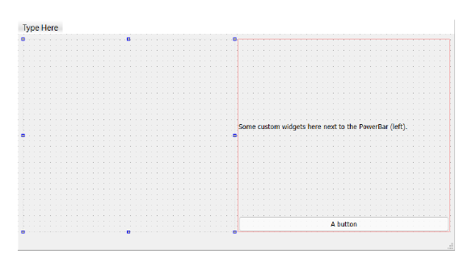

> 图190：简单的 UI 布局，左侧有一个占位符控件


> 您无法在设计器中更改任何自定义控件属性——Qt 设计器对您的自定义控件及其工作原理一无所知。请在代码中进行更改！

添加控件后，您可以对其进行推广。选择您想要推广的控件，右键单击，然后选择“Promote to …”。

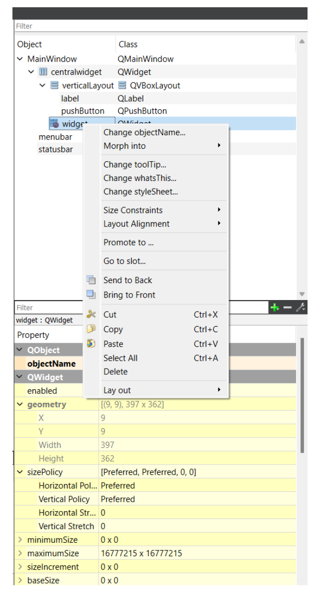

> 图191：通过右键菜单推广控件

在对话框底部，您可以添加一个新推广类。输入类名——自定义控件的 Python 类名，例如 `PowerBar`——以及包含该类的 Python 文件作为头文件，省略 `.py` 后缀。


> Qt 会根据类名自动建议文件名，但会添加 `.h`（C++ 标准的头文件后缀）。您必须删除 `.h`，即使文件名正确。

如果您的自定义控件是在子文件夹中的类中定义的，则提供完整的 Python 点表示法到文件，与您对其他导入操作一样。例如，您可能将文件放置在 `ui/widgets/powerbar.py` 下，然后输入 `ui.widgets.powerbar` 作为头文件

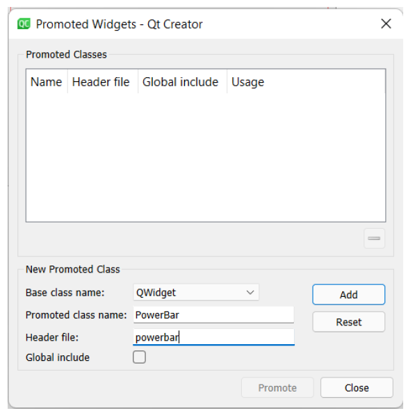

> 图192：添加类名和头文件

请您点击“Add”来定义推广操作。然后，您可以在顶部的列表中选择促销活动，并点击“Promote”来实际推广您的控件。

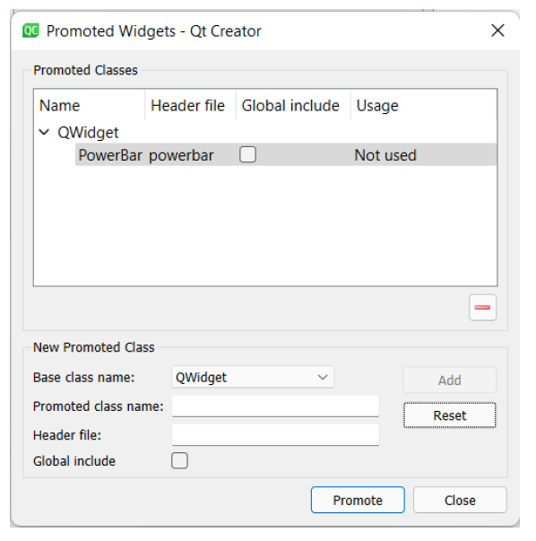

> 图193：选择推广操作并将其应用到您的控件中

控件将被推广，并显示其新类名（此处为 `PowerBar`）。

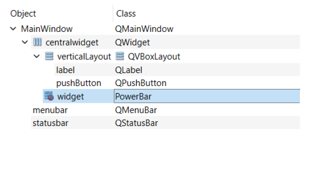

> 图194：在 UI 层叠结构中显示的推广控件

保存 UI 文件，并使用 `pyuic` 工具进行编译，与之前操作相同。

```bash
pyuic6 mainwindow.ui -o MainWindow.py
```

打开生成的文件，您会看到自定义的 `PowerBar` 类现在被用于在 `setupUi` 方法中构建控件，并且文件底部添加了一个新的导入。

```python
class Ui_MainWindow(object):
    def setupUi(self, MainWindow):
        # etc...
        self.widget = PowerBar(self.centralwidget)
        
    # etc...
    
    def retranslateUi(self, MainWindow):
        _translate = QtCore.QCoreApplication.translate
        MainWindow.setWindowTitle(_translate("MainWindow",
                                             "MainWindow"))
        self.label.setText(_translate("MainWindow", "Some custom
                                      widgets here next to the PowerBar (left)."))
                                      self.pushButton.setText(_translate("MainWindow", "A button"))
                                      from powerbar import PowerBar
```

您可以像往常一样使用编译后的 UI 文件。您无需将自定义控件导入应用程序，因为编译后的 UI 文件中已经包含了该控件的滑块。

*Listing 169. custom-widgets/promote_test.py*

```python
import random
import sys

from PyQt6.QtCore import Qt
from PyQt6.QtWidgets import QApplication, QMainWindow

from MainWindow import Ui_MainWindow


class MainWindow(QMainWindow, Ui_MainWindow):
    def __init__(self):
        super().__init__()
        self.setupUi(self)
        self.show()
        
        
app = QApplication(sys.argv)
w = MainWindow()
app.exec()
```

运行应用程序时，自定义控件将被加载并自动出现在正确的位置。

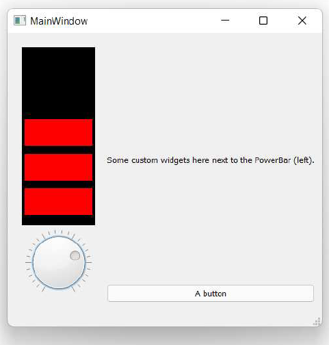

> 图195：应用程序中显示的 PowerBar 自定义控件


> 您看到的绝大多数错误都与导入相关。第一步应始终是检查编译后UI文件底部的导入语句，以确认其合理性。目标文件是否可达？

#### 第三方控件

您也可以使用相同的技术将其他第三方控件添加到您的应用程序中。该过程完全相同，您只需引用控件的完全限定 Python 导入路径，并使用适当的类名即可。以下是一些常见第三方控件的配置示例


> 我们将在后续章节中详细讲解如何使用这些库！

##### PyQtGraph

在 Qt Designer 中，将 `PlotWidget` 作为推广的类名，将 `pyqtgraph` 作为头文件。使用 `QWidget` 作为占位控件。PyQtGraph 绘图控件将在生成的 UI 文件中按原样工作。

请参阅本书源代码下载中的 `custom-widgets/pyqtgraph_demo.py` 文件，了解可运行的演示程序。

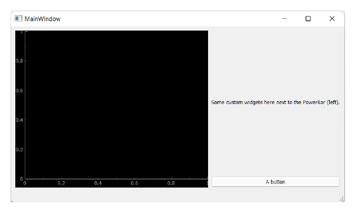

> 图196：通过控件推广添加了 PyQtGraph 绘图控件

##### Matplotlib

`matplotlib` 的自定义控件 `FigureCanvasQTAgg` 不能直接在 Qt Designer 中使用，因为构造函数不接受父对象作为第一个参数，而是期望一个 `Figure` 对象。

我们可以通过添加一个简单的包装类来解决这个问题，该类定义如下。

*Listing 170. custom-widgets/mpl.py*

```python
from matplotlib.backends.backend_qtagg import FigureCanvasQTAgg
from matplotlib.figure import Figure


class MplCanvas(FigureCanvasQTAgg):
    def __init__(self, parent=None, width=5, height=4, dpi=100):
        fig = Figure(figsize=(width, height), dpi=dpi)
        self.axes = fig.add_subplot(111)
        super().__init__(fig)
```

请您将此文件添加到名为 `mpl.py` 的项目中，然后在 Qt Designer 中使用 `MplCanvas` 作为推广的类名，使用 `mpl` 作为头文件。使用 `QWidget` 作为占位控件。

请参阅本书源代码下载中的 `custom-widgets/matplotlib_demo.py` 文件，了解可运行的演示程序。

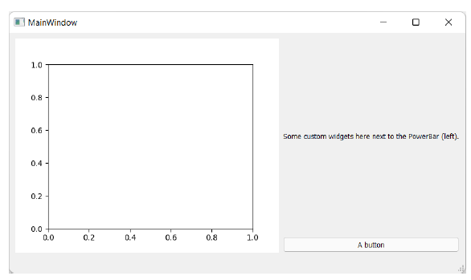

> 图197：通过控件推广添加的 matplotlib 控件

使用这些技术，您应该能够在 PyQt6 应用程序中使用任何自定义控件。

### 熟悉度与拟物化设计

在构建用户界面时，最强大的工具之一就是熟悉感。也就是说，让用户觉得你的界面是他们之前使用过的。熟悉的界面通常被描述为直观的。在屏幕上移动鼠标指针并点击方形凸起本身并没有什么直观之处。但是，经过多年的重复操作，这种行为本身就变得非常熟悉了。

在用户界面中寻找熟悉感导致了拟物化设计。拟物化设计是指将非功能性设计元素应用于物体，而这些设计元素是功能性的。这意味着使用常见的界面元素，或者制作看起来像真实物体的界面。虽然近年来图形用户界面趋势又回到了抽象的“扁平化”设计，但所有现代用户界面都保留了拟物化的元素。

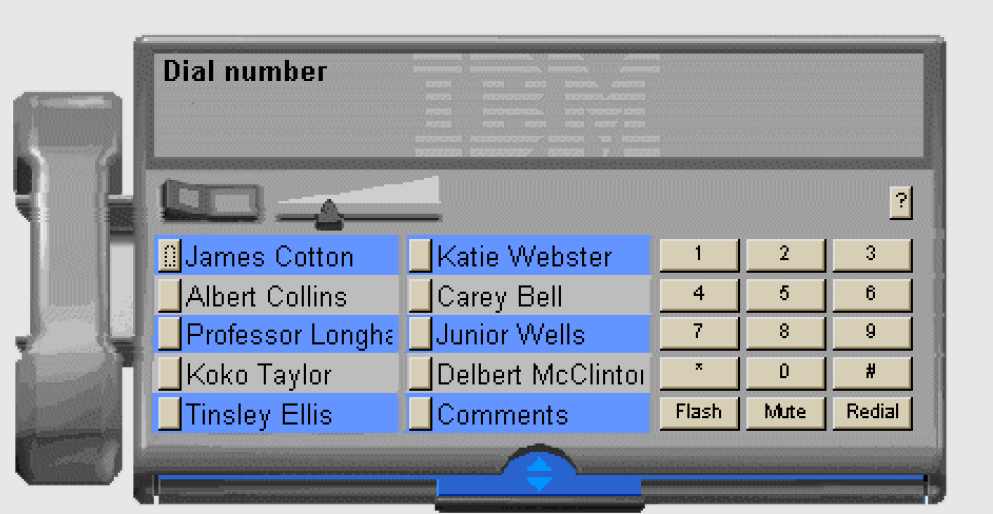

> RealPhone — IBM RealThings™ 系列产品之一

现代桌面计算器就是一个很好的例子。当我们进行计算时，我们会将结果显示在底部。那么为什么计算器的屏幕会位于顶部呢？因为如果屏幕位于底部，它会被您的手挡住。因此，屏幕的位置是出于功能性考虑。

对于计算机上的计算器，这个位置被保留下来，尽管它已经不再具有功能性——鼠标指针不会遮挡屏幕，输入通常通过键盘进行。但如果您打开一个计算器，发现屏幕在底部，您就会感到困惑。它看起来像是倒置的。尽管完全可用，但它看起来奇怪或反直觉。这就是拟物主义的本质——通过利用用户对现有物体的熟悉感，使用户界面感觉更直观。

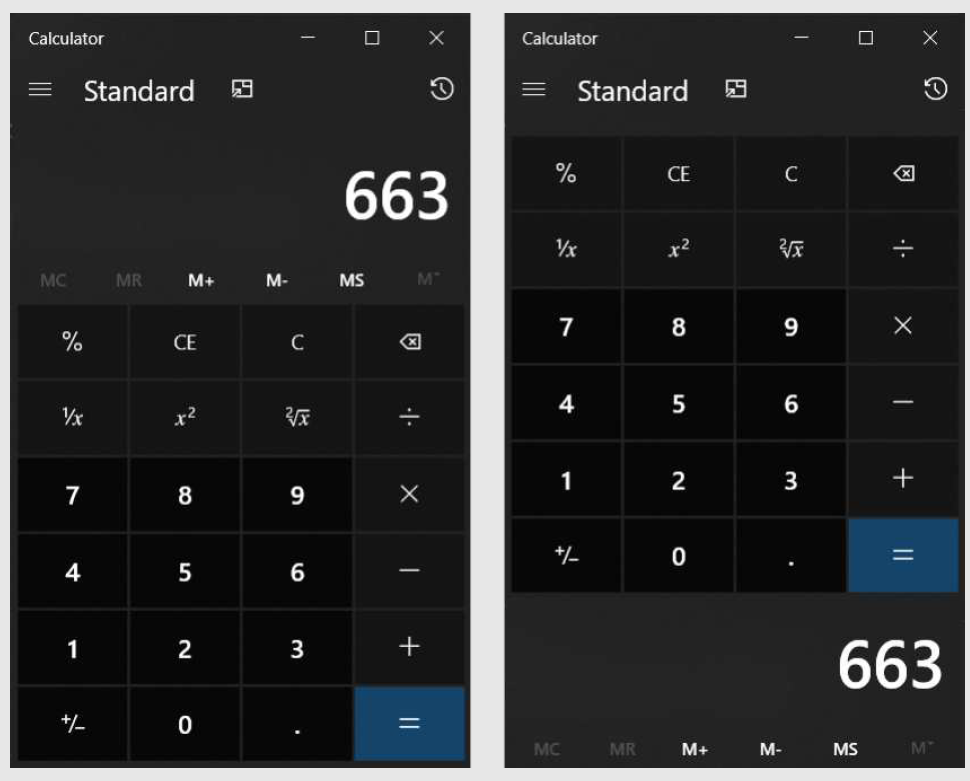

> 计算器与倒置计算器（Windows 10）

您的软件在这一尺度上的位置由你自行决定。关键在于要了解现有的接口，并在可能的情况下充分利用它们来提升你自己应用程序的易用性。您的用户会因此感激不尽！

---

- **请务必**在设计自己的界面时适当地借鉴现有界面的设计元素。
- **请务必**在需要提升用户体验的地方适当地加入拟物化设计元素。
