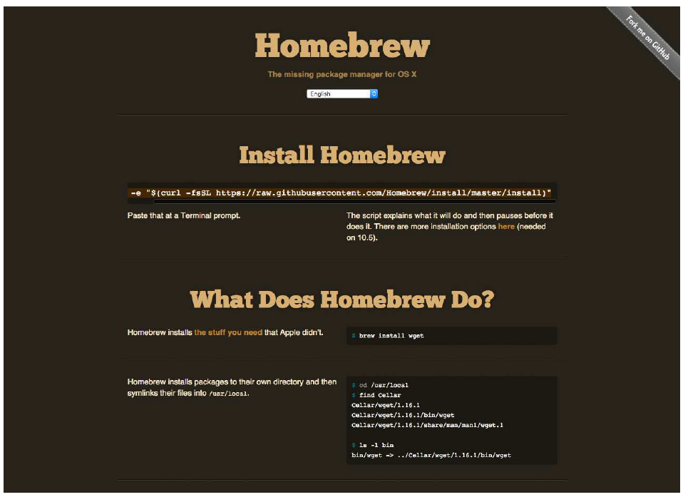

# 附录A：安装 PyQt6

在开始编码之前，您需要先在系统上安装好 PyQt6。如果尚未安装 PyQt6，以下各节将指导您在 Windows、macOS 和 Linux 系统上完成安装。


> 请注意，以下说明**仅**适用于安装**GPL 许可**版本的 PyQt。如果您需要在非 GPL 项目中使用 PyQt，您需要从 [Riverbank Computing](https://www.riverbankcomputing.com/) 购买替代许可以发布您的软件。

## 在 Windows 系统上的安装

PyQt6 对于 Windows 系统的安装方式与其他应用程序或库类似。自 Qt 5.6 起，可通过 Python 包存档（PyPi）安装 PyQt6。要从 Python 3 安装 PyQt6，只需运行以下命令：

```bash
pip3 install pyqt6
```

安装完成后，您应该能够运行 Python 并导入 PyQt6。

请注意，如果您想使用 Qt Designer 或 Qt Creator，您需要从 [Qt 下载网站](https://qt.io/download) 下载这些工具。

## 在 macOS 系统上的安装

如果您已经在 macOS 上安装了可用的 Python 3，您可以继续安装 PyQt6，就像安装其他 Python 包一样，使用以下命令：

```bash
pip3 install pyqt6
```

如果您尚未安装 Python 3，则需要先进行安装。您可以从 [Python 官方网站](https://www.python.org/) 下载适用于 macOS 的 Python 3 安装程序。安装完成后，您应能够使用上述 `pip3 install` 命令安装PyQt6。

另一个选择是使用Homebrew。Homebrew是macOS上用于管理命令行软件的包管理器。Homebrew的仓库中同时提供了Python 3和PyQt6。



> 图274：Homebrew — macOS 系统中缺失的包管理器

要安装 Homebrew，请在命令行中执行以下操作：

```bash
ruby -e "$(curl -fsSL https://raw.githubusercontent.com/Homebrew/install/master/install)"
```


> 您也可以从Homebrew的官网复制并粘贴此内容。

安装 Homebrew 后，您可以使用以下命令安装 Python：

```bash
brew install python3
```

安装 Python 后，您可以像往常一样安装 PyQt6，使用 `pip3 install pyqt6`，或者选择使用 Homebrew 进行安装，使用：

```bash
brew install pyqt6
```

## 在 Linux 系统上的安装

在 Linux 上安装 PyQt6 的最简单方法是使用 Python 的 pip 包管理工具，与安装其他包的方式相同。对于 Python 3 安装，我们通常称为 pip3。

```bash
pip3 install pyqt6
```

安装完成后，您应该能够运行 python3（或 python，具体取决于您的系统）并导入 PyQt6。

# 附录B：将 C++ 示例翻译为 Python

在使用PyQt6编写应用程序时，我们实际上是在使用Qt编写应用程序。

PyQt6 作为 Qt 库的包装器，将 Python 方法调用转换为 C++，处理类型转换，并透明地创建 Python 对象来代表应用程序中的 Qt 对象。所有这些巧妙的设计使您可以在编写大部分 Python 代码时使用 Qt（如果忽略驼峰式命名法的话）。

虽然网上有很多PyQt6示例代码，但Qt C++示例代码要多得多。核心文档是为C++编写的。该库是用C++编写的。这意味着，有时当您想要了解如何实现某项功能时，您找到的唯一资源可能是C++教程或一些C++代码。

您能使用它吗？当然可以！如果您没有C++（或类似C的语言）的经验，那么代码看起来可能像天书一样。但在您熟悉Python之前，Python可能也看起来有点像天书。你您需要会写C++就能阅读它。理解和解读比编写更容易。

只需稍作努力，您就能将任何 C++ 示例代码转换为功能完整的 Python 的 PyQt6 代码。在本章中，我们将选取一段 Qt5 代码，并逐步将其转换为可正常运行的 Python 代码。

## 示例代码

我们先从以下代码块开始，创建一个简单的窗口，其中包含一个 `QPushButton` 和一个 `QLineEdit`。按下按钮将清除行编辑内容。这看起来非常令人兴奋，但其中包含将 Qt 示例转换为 PyQt6 的几个关键部分，即控件、布局和信号。

```c++
#include <QtWidgets>

int main(int argc, char *argv[])
{
    QApplication app(argc, argv);
    QWidget window;
    QLineEdit *lineEdit = new QLineEdit();
    QPushButton *button = new QPushButton("Clear");
    QHBoxLayout *layout = new QHBoxLayout();
    layout->addWidget(lineEdit);
    layout->addWidget(button);
    
    QObject::connect(&button, &QPushButton::pressed,
                     &lineEdit, &QLineEdit::clear);
    window.setLayout(layout);
    window.setWindowTitle("Why?");
    window.show();
    return app.exec();
}
```


> 请记住，没有父控件的 Qt 控件总是单独的窗口。这里，我们创建了一个作为 `QWidget` 的单个窗口。

下面我们将逐步讲解如何将这段代码转换为Python代码。

## 导入语句

在 C++ 中，导入（import）被称为包含（include）。它们位于文件的顶部，与 Python 类似（尽管只是出于惯例），并且看起来像这样——

```c++
#include <QtWidgets>
```

在 C 类语言中，`#` 表示 `include` 是预处理指令，而不是注释。`<> `之间的值是要导入的模块的名称。请注意，与 Python 不同，导入模块会将该模块的所有内容都放在全局命名空间中。这相当于在 Python 中执行以下操作：

```python
from PyQt6.QtWidgets import *
```

像这样的全局导入在 Python 中通常是不被推荐的，您应该改用以下方式之一：

1. 仅导入所需的对象，或
2. 导入模块本身并通过它引用其子对象

```python
from PyQt6.QtWidgets import QApplication, QWidget, QLineEdit, QPushButton, QHBoxLayout
```

或者，换一种说法……

```python
from PyQt6 import QtWidgets
```

……然后引用为 `QtWidgets.QApplication()`。您在自己的代码中选择哪种样式完全取决于您的喜好，但在本例中，我们将遵循第一种样式。将此应用于代码后，到目前为止，我们得到了以下结果。

```c++
from PyQt6.QtWidgets import (
    QApplication, QWidget, QLineEdit, QPushButton, QHBoxLayout
)

int main(int argc, char *argv[])
{
    QApplication app(argc, argv);
    QWidget window;
    QLineEdit *lineEdit = new QLineEdit();
    QPushButton *button = new QPushButton("Clear");
    QHBoxLayout *layout = new QHBoxLayout();
    layout->addWidget(lineEdit);
    layout->addWidget(button);
    QObject::connect(&button, &QPushButton::pressed,
                     &lineEdit, &QLineEdit::clear);
    window.setLayout(layout);
    window.setWindowTitle("Why?");
    window.show();
    return app.exec();
}
```


> 由于我们是通过迭代方式进行修改，因此代码在最终完成前都不会正常工作。

## int main(int argc, char *argv[])

每个 C++ 程序都需要一个 `main(){}` 代码块，其中包含应用程序执行时首先运行的代码。在 Python 中，模块顶层的任何代码（即未嵌套在函数、类或方法内部的代码）将在脚本执行时被运行。

```c++
from PyQt6.QtWidgets import (
    QApplication, QWidget, QLineEdit, QPushButton, QHBoxLayout
)
    
QApplication app(argc, argv);
QWidget window;
QLineEdit *lineEdit = new QLineEdit();
QPushButton *button = new QPushButton("Clear");
QHBoxLayout *layout = new QHBoxLayout();
layout->addWidget(lineEdit);
layout->addWidget(button);
QObject::connect(&button, &QPushButton::pressed,
                 &lineEdit, &QLineEdit::clear);
window.setLayout(layout);
window.setWindowTitle("Why?");
window.show();
app.exec();
```

您可能在 Python 应用程序代码中见过以下代码块，它也被称为`__main__` 块。

```python
if __name__ == '__main__':
# ...your code here...
```

然而，这种方式的工作原理略有不同。虽然当脚本被执行时，这个块会被执行，但任何未缩进的代码也会被执行。这个块的实际目的是防止在模块被导入时执行这段代码，而不是作为脚本执行。

您可以将代码嵌套在这个代码块中，尽管除非您的文件将被作为模块导入，否则这并非严格必要。

## C++ 类型

Python 是一种动态类型语言，这意味着您可以在变量定义后更改其类型。例如，以下代码是完全有效的 Python。

```python
a = 1
a = 'my string'
a = [1,2,3]
```

许多其他语言，包括C++在内，都是静态类型的，这意味着一旦定义了变量的类型，就不能再更改它。例如，以下代码绝对不是有效的C++代码。

```c++
int a = 1;
a = 'my string';
```

上述内容突显了静态类型语言的直接后果：在创建变量时定义其类型。

在 C++ 中，这是通过在定义变量时在变量声明行上显式提供类型装饰器来实现的，位于 `int` 之上。

在类似以下的语句中，第一个名称是正在被创建的类型（类）的名称，而语句的其余部分用于定义该类型。

```c++
QApplication app(argc, argv);
QWidget window;

QLineEdit *lineEdit = new QLineEdit();
QPushButton *button = new QPushButton("Clear");
QHBoxLayout *layout = new QHBoxLayout();
```

在 Python 中，我们不需要这些类型定义，因此可以直接删除它们。

```python
lineEdit = new QLineEdit();
button = new QPushButton("Clear");
layout = new QHBoxLayout();
```

对于应用程序和窗口，原理完全相同。然而，如果您不熟悉C++，可能不会立即意识到这些代码行正在创建一个变量。

在 C++ 中，使用 `new` 创建对象与不使用 `new` 创建对象之间存在差异，但在 Python 中，您无需关心这一点，可以将它们视为等价的。

```c++
QWidget *window = new QWidget();
QWidget window;
QApplication *app = new QApplication(argc, argv);
QApplication app;
```

要转换为 Python，请从左侧获取类名（例如 `QApplication`），并将其放置在开括号和闭括号`()`之前，如果它们不存在，则添加它们。然后将变量名移到左侧，并添加一个 `=` 。对于 `window`，我们应该这样——

```python
window = QWidget()
```

在 Python 中，`QApplication` 仅接受一个参数，即来自 `sys.argv`（等同于 `argv`）的参数列表。这为我们提供了以下代码 

```python
import sys
app = QApplication(sys.argv);
```

到目前为止，我们的完整代码块看起来如下所示。

```c++
from PyQt6.QtWidgets import (
    QApplication, QWidget, QLineEdit, QPushButton, QHBoxLayout
)
    
import sys
app = QApplication(argc, argv);
window = QWidget()
lineEdit = QLineEdit();
button = QPushButton("Clear");
layout = QHBoxLayout();
layout->addWidget(lineEdit);
layout->addWidget(button);
QObject::connect(&button, &QPushButton::pressed,
                 &lineEdit, &QLineEdit::clear);
window.setLayout(layout);
window.setWindowTitle("Why?");
window.show();
app.exec();
```

## 信号

信号是使示例正常运行的关键，但遗憾的是，C++ 语法对于 Qt 信号来说有些复杂。我们正在使用的示例信号如下所示。

```c++
QObject::connect(&button, &QPushButton::pressed,
                 &lineEdit, &QLineEdit::clear);
```

如果您不熟悉 C++，这段内容可能很难理解。但如果我们移除所有语法，就会清晰得多。

```c++
connect(button, QPushButton.pressed, lineEdit, QLineEdit.clear)
// or...
connect(<from object>, <from signal>, <to object>, <to slot>>)
```

从左到右依次为：我们连接的对象、我们连接的信号、我们连接的对象，最后是我们连接的对象上的槽（或函数）。这相当于在 PyQt6 中编写以下代码：

```python
button.pressed.connect(lineedit.clear)
```

进行该更改后，我们在进行中的代码中将获得以下内容：

```c++
from PyQt6.QtWidgets import (
    QApplication, QWidget, QLineEdit, QPushButton, QHBoxLayout
)
app = QApplication(sys.argv)
window = QWidget()
lineEdit = QLineEdit()
button = QPushButton("Clear")
layout = QHBoxLayout()
layout->addWidget(lineEdit);
layout->addWidget(button);

button.pressed.connect(lineEdit.clear)
    
window.setLayout(layout);
window.setWindowTitle("Why?");
window.show();
app.exec();
```

## 语法

到目前为止，我们已经处理了所有特别棘手的部分，因此可以进行最后的语法校正。这些操作只需简单的搜索替换即可完成。

首先搜索所有 `->` 或 `::` 的实例，并替换为 `.` .。您会发现 C++ 代码在某些地方也使用了 `.`  ——这与这些变量更简化的创建方式有关（`new` 与否）。同样，您可以在这里忽略这一点，并简单地使用 `.` 代替。

```python
layout.addWidget(lineEdit);
layout.addWidget(button);
```

最后，删除所有行尾的分号（`;`）标记。

```python
layout.addWidget(lineEdit)
layout.addWidget(button)
```


> 从技术上讲，您不需要这样做，因为 `;` 是 Python 中有效的行结束符。只是没有必要。

以下代码现在在Python上运行正常。

```python
import sys

from PyQt6.QtWidgets import (
    QApplication,
    QHBoxLayout,
    QLineEdit,
    QPushButton,
    QWidget,
)

app = QApplication(sys.argv)
window = QWidget()
lineEdit = QLineEdit()
button = QPushButton("Clear")
layout = QHBoxLayout()
layout.addWidget(lineEdit)
layout.addWidget(button)

button.pressed.connect(lineEdit.clear)

window.setLayout(layout)
window.setWindowTitle("Why?")
window.show()
app.exec()
```

在 Python 代码中，通常（尽管不是必需的）会继承窗口类，以便初始化代码可以包含在 `__init__` 块中。下面的代码已重新组织为这种结构，将除创建窗口对象（现在为 `MyWindow`）和 `app`，以及 `app.exec()` 调用之外的所有内容移至 `__init__` 块中。

```python
import sys

from PyQt6.QtWidgets import (
    QApplication,
    QHBoxLayout,
    QLineEdit,
    QPushButton,
    QWidget,
)


class MyWindow(QWidget):
    def __init__(self, *args, **kwargs):
        super().__init__(*args, **kwargs)
        
        lineEdit = QLineEdit()
        button = QPushButton("Clear")
        layout = QHBoxLayout()
        layout.addWidget(lineEdit)
        layout.addWidget(button)
        
        button.pressed.connect(lineEdit.clear)
        
        self.setLayout(layout)
        self.setWindowTitle("Why?")
        self.show()
        
        
app = QApplication(sys.argv)
window = MyWindow()
app.exec()
```

## 将该流程应用于您自己的代码

这是一个非常简单的示例，然而如果您遵循相同的流程，您可以可靠地将任何C++ Qt代码转换为其Python等价代码。在转换您自己的代码示例时，尽量遵循这种分步方法，以最大限度地减少遗漏内容或意外破坏代码的风险。如果您最终得到一段能够运行的Python代码，但它与原代码存在细微差异，那么调试起来可能会很困难。


> 如果您有需要帮助翻译的代码示例，您可以随时与我联系，我会尽力为您提供帮助。

# 附录C：PyQt6 和 PySide6 两者有何不同？

如果您开始使用Qt6构建Python应用程序，您应该很快就会发现，实际上您可以使用两个包来实现这一点——PyQt6和PySide6。

在本章中，我将详细解释为什么会出现这种情况，以及您是否需要关心这一点（剧透：您真的不需要关心），同时也会介绍（少数）差异以及如何绕过这些差异。到本章结束时，您应该能够自如地复用PyQt6和PySide6教程中的代码示例来构建您的应用程序，无论您自己使用的是哪个包。

## 背景

为什么有两个库？

PyQt 由 [Riverbank Computing Ltd.](https://www.riverbankcomputing.com/software/pyqt/intro) 的 Phil Thompson 开发，并已存在了很长时间，支持回溯至 2.x 版本的 Qt。在2009 年，当时拥有 Qt 工具包的诺基亚公司希望将 Qt 的 Python 绑定以更宽松的 LGPL 许可证形式提供。由于无法与 Riverbank 达成协议（Riverbank 因此会损失收入，这可以理解），他们随后发布了自己开发的绑定库 _PySide。


> 它被称为PySide，因为“side”在芬兰语中意为“粘合剂”。

这两个接口基本上是等效的，但随着时间的推移，PySide 的开发进度逐渐落后于 PyQt。这一差距在 Qt 5 发布后尤为明显——PyQt 的 Qt5 版本（PyQt5）自 2016 年中旬起便已可用，而 PySide2 的首个稳定版本则在两年后才发布。考虑到这一点，许多 Python 上的 Qt5 示例使用 PyQt5 就不足为奇了——仅仅是因为它已经可用。

然而，Qt 项目最近已将 PySide 作为官方的 [Qt for Python 发布版本](https://www.qt.io/qt-for-python)，这应能确保其未来的发展前景。当 Qt6 发布时，两个 Python 绑定版本均在短时间内同步推出。

|              | PyQt6                    | PySide6  |
| ------------ | ------------------------ | -------- |
| 首个稳定版本 | 2021.1                   | 2020.12  |
| 开发者       | Riverbank Computing Ltd. | Qt       |
| 许可证       | GPL 许可证或商业许可证   | LGPL     |
| 平台         | Python 3                 | Python 3 |

您应该使用哪一个？坦白说，其实并没有太大区别。

这两个包都封装了同一个库——Qt6——因此它们的API有99.9%是相同的（见下文的少量差异）。您使用其中一个库学到的任何内容都可轻松应用于使用另一个库的项目。此外，无论您选择使用哪个库，都值得熟悉另一个库，以便您能够充分利用所有可用的在线资源——例如，使用 PyQt6 教程来构建您的 PySide6 应用程序，反之亦然。

在本短章中，我将简要介绍这两个包之间的几个显著差异，并解释如何编写能够与两者无缝兼容的代码。阅读本章后，您应该能够将任何在线的 PyQt6 示例转换为与 PySide6 兼容的代码。

## 许可证

两个版本之间的主要区别在于许可协议——PyQt6可通过GPL或商业许可协议获取，而PySide6则采用LGPL许可协议。

如果您计划将您的软件本身在GPL许可证下发布，或者您正在开发不会分发的软件，PyQt6的GPL要求很可能不会成为问题。然而，如果您希望分发您的软件但不分享源代码，您需要从Riverbank购买PyQt6的商业许可证或使用PySide6。


> Qt本身可通过Qt商业许可证、GPL 2.0、GPL3.0和LGPL 3.0许可证获取。

## 命名空间和枚举

PyQt6 引入的一项重大变更之一是需要使用完全限定名来引用枚举和标志。此前，在 PyQt5 和 PySide2 中，您可以使用快捷方式——例如 `Qt.DecorationRole`、`Qt.AlignLeft`。在 PyQt6 中，这些现在分别是 `Qt.ItemDataRole.DisplayRole` 和 `Qt.Alignment.AlignLeft`。这一变更影响了 Qt 中所有枚举类型和标志组。在 PySide6 中，长名称和短名称均继续支持。

## UI 文件

这两个库之间的另一个主要区别在于它们对从 Qt Creator/Designer 导出的 `.ui` 文件的加载方式。PyQt6 提供了 uic 子模块，可用于直接加载 UI 文件以生成对象。这看起来非常符合 Python 的风格（如果忽略驼峰式命名法的话）。

```python
import sys
from PyQt6 import QtWidgets, uic

app = QtWidgets.QApplication(sys.argv)

window = uic.loadUi("mainwindow.ui")
window.show()
app.exec()
```

使用 PySide6 时，代码会多出一行，因为您需要先创建一个`QUILoader` 对象。不幸的是，这两个接口的 API 也有所不同（`.load` 与 `.loadUI`）。

```python
import sys
from PySide6 import QtCore, QtGui, QtWidgets
from PySide6.QtUiTools import QUiLoader

loader = QUiLoader()

app = QtWidgets.QApplication(sys.argv)
window = loader.load("mainwindow.ui", None)
window.show()
app.exec()
```

要在 PyQt6 中将 UI 加载到现有对象上，例如在您的 `QMainWindow.init` 中，您可以调用 `uic.loadUI`，并将 `self`（现有控件）作为第二个参数传递。

```python
import sys
from PyQt6 import QtCore, QtGui, QtWidgets
from PyQt6 import uic


class MainWindow(QtWidgets.QMainWindow):
    
    def __init__(self, *args, **kwargs):
        super().__init__(*args, **kwargs)
        uic.loadUi("mainwindow.ui", self)
        
        
app = QtWidgets.QApplication(sys.argv)
window = MainWindow()
window.show()
app.exec()
```

PySide6 加载器不支持此功能—— `.load` 的第二个参数是您正在创建的控件的父控件。这会阻止您将自定义代码添加到控件的 `__init__` 块中，但您可以使用一个单独的函数来解决这个问题。

```python
import sys
from PySide6 import QtWidgets
from PySide6.QtUiTools import QUiLoader

loader = QUiLoader()

def mainwindow_setup(w):
    w.setWindowTitle("MainWindow Title")
    
app = QtWidgets.QApplication(sys.argv)

window = loader.load("mainwindow.ui", None)
mainwindow_setup(window)
window.show()
app.exec()
```

## 将UI文件转换为Python

两者都提供了相同的脚本，用于从 Qt Designer `.ui` 文件生成可导入 Python 的模块。对于 PyQt6，该脚本名为 `pyuic5` 

```bash
pyuic6 mainwindow.ui -o MainWindow.py
```

然后，您可以导入 `UI_MainWindow` 对象，并通过多继承方式从您使用的基类（例如 `QMainWindow`）派生子类，然后调用 `self.setupUI(self)` 来设置用户界面。

```python
import sys
from PyQt6 import QtWidgets
from MainWindow import Ui_MainWindow


class MainWindow(QtWidgets.QMainWindow, Ui_MainWindow):
    
    def __init__(self, *args, **kwargs):
        super().__init__(*args, **kwargs)
        self.setupUi(self)
        
        
app = QtWidgets.QApplication(sys.argv)
window = MainWindow()
window.show()
app.exec()
```

对于 PySide6，其名称为 `pyside6-uic` 

```bash
pyside6-uic mainwindow.ui -o MainWindow.py
```

后续设置完全相同。

```python
import sys
from PyQt6 import QtWidgets
from MainWindow import Ui_MainWindow


class MainWindow(QtWidgets.QMainWindow, Ui_MainWindow):
    
    def __init__(self, *args, **kwargs):
        super().__init__(*args, **kwargs)
        self.setupUi(self)
        
        
app = QtWidgets.QApplication(sys.argv)
window = MainWindow()
window.show()
app.exec()
```


> 有关在 PyQt6 或 PySide6 中使用 Qt Designer 的更多信息，请参阅 Qt Creator 章节。

## exec() 还是 exec_()

`.exec()` 方法用于 Qt 中启动 `QApplication` 或对话框的事件循环。在 Python 2.7 中，`exec` 是关键字，因此无法用于变量、函数或方法名称。PyQt4 和 PySide 中采用的解决方案是将 `.exec` 的使用改为 `.exec_()` 以避免此冲突。

Python 3 移除了 `exec` 关键字，释放了该名称以便重新使用。因此，从 Qt6 开始，所有 `.exec()` 调用都与 Qt 本身中的命名方式一致。然而，PySide6 仍然支持 `.exec_()`，因此如果您在某些代码中看到这个，不要感到惊讶。

## 槽与信号

在两个库中，定义自定义槽和信号时使用的语法略有不同。PySide6 在 `Signal` 和 `Slot` 名称下提供了此接口，而 PyQt6 则分别在 `pyqtSignal` 和 `pyqtSlot` 名称下提供了此接口。它们在定义槽和信号时的行为完全相同。

以下 PyQt6 和 PySide6 示例是相同的——

```python
my_custom_signal = pyqtSignal() # PyQt6
my_custom_signal = Signal() # PySide6

my_other_signal = pyqtSignal(int) # PyQt6
my_other_signal = Signal(int) # PySide6
```

或者对于一个槽——

```python
@pyqtslot
def my_custom_slot():
    pass

@Slot
def my_custom_slot():
    pass
```

如果您想确保 PyQt6 和 PySide6 之间的一致性，可以使用以下导入模式，以便 PyQt6 也能使用 `Signal` 和 `@Slot` 样式。

```python
from PyQt6.QtCore import pyqtSignal as Signal, pyqtSlot as Slot
```


> 当然，您也可以从 `PySide6.QtCore` 导入 `Signal` 作为 `pyqtSignal`，导入 `Slot` 作为 `pyqtSlot`，尽管这会有些令人困惑。

## QMouseEvent

在 PyQt6 中，`QMouseEvent` 对象不再具有用于访问事件位置的 `.pos()`、`.x()` 或 `.y()` 缩写属性方法。您必须使用 `.position(`) 属性来获取 `QPoint` 对象，并访问其上的 `.x()` 或 `.y()` 方法。`.position()` 方法在 PySide6 中也可用。

## PySide6 中存在但 PyQt6 中不存在的功能

从 Qt 6 开始，PySide 支持两个 Python 功能标志，以帮助代码更符合 Python 风格，使用蛇形变量名 (`snake_case`)，并能够直接分配和访问属性，而不是使用 getter/setter 函数。下面的示例显示了这些更改对代码的影响：

*Listing 311. Standard PySide6 code*

```python
table = QTableWidget()
table.setColumnCount(2)

button = QPushButton("Add")
button.setEnabled(False)

layout = QVBoxLayout()
layout.addWidget(table)
layout.addWidget(button)
```

相同的代码，但启用了 `snake_case` 和 `true_property`。

*Listing 312. PySide6 code with Snake case & properties.*

```python
from __feature__ import snake_case, true_property

table = QTableWidget()
table.column_count = 2

button = QPushButton("Add")
button.enabled = False

layout = QVBoxLayout()
layout.add_widget(table)
layout.add_widget(button)
```

这些功能标志对代码可读性有所提升，然而由于它们在 PyQt6 中不被支持，这使得在不同库之间进行迁移变得更加困难。

## 在两种库中都支持的特性


> 如果您正在开发独立的应用程序，则无需担心这个问题。只需使用您偏好的任何 API 即可。

如果您正在编写一个与 PyQt6 和 PySide6 兼容的库、控件或其他工具，只需添加两组导入即可轻松实现。

```python
import sys

if 'PyQt6' in sys.modules:
    # PyQt6
    from PyQt6 import QtGui, QtWidgets, QtCore
    from PyQt6.QtCore import pyqtSignal as Signal, pyqtSlot as Slot
    
else:
    # PySide6
    from PySide6 import QtGui, QtWidgets, QtCore
    from PySide6.QtCore import Signal, Slot
```

这是我们的自定义控件库中使用的方法，我们通过导入一个库来支持 PyQt6 和 PySide6。唯一需要注意的是，在导入该库时，必须确保先导入 PyQt6（如上行或更早行），以确保它位于 `sys.modules` 中。

为了弥补PyQt6中缺少简写枚举和标志，您可以自行生成这些内容。例如，以下代码将为每个枚举对象的元素复制引用，直至其父对象，使其可像在PyQt5、PySide2和PySide6中一样访问。该代码仅需在PyQt6环境下运行。

```python
enums = [
    (QtCore.Qt, 'Alignment'),
    (QtCore.Qt, 'ApplicationAttribute'),
    (QtCore.Qt, 'CheckState'),
    (QtCore.Qt, 'CursorShape'),
    (QtWidgets.QSizePolicy, 'Policy'),
]

# 使用长名称进行查找（例如 QtCore.Qt.CheckState.Checked，用于 PyQt6）并以短名称存储（例如 QtCore.Checked，用于 PyQt5、PySide2 且被 PySide6 接受）。
for module, enum_name in enums:
    for entry in getattr(module, enum_name):
        setattr(module, entry.name, entry)
```

或者，您可以定义一个自定义函数来处理命名空间查找

```python
def _enum(obj, name):
    parent, child = name.split('.')
    result = getattr(obj, child, False)
    if result: # 仅使用短名称进行查找.
        return result
    
    obj = getattr(obj, parent) # 获取父节点，然后获取子节点.
    return getattr(obj, child)
```

当传入一个对象和一个与 PyQt6 兼容的长格式名称时，此函数将在 PyQt6 和 PySide6 上均返回正确的枚举值或标志。

```python
>>> _enum(PySide6.QtCore.Qt, 'Alignment.AlignLeft')
PySide6.QtCore.Qt.AlignmentFlag.AlignLeft
>>> _enum(PyQt6.QtCore.Qt, 'Alignment.AlignLeft')
<Alignment.AlignLeft: 1>
```

如果您在多个文件中这样做，可能会有点麻烦。一个不错的解决方案是将导入逻辑和自定义适配方法移动到一个单独的文件中，例如在项目根目录下命名为 `qt.py`。该模块从两个库中的一个导入 Qt 模块（`QtCore`、`QtGui`、`QtWidgets` 等），然后您可以从那里导入到你的应用程序中。

`qt.py` 文件的内容与我们之前使用的相同 —

```python
import sys
if 'PyQt6' in sys.modules:
    # PyQt6
    from PyQt6 import QtGui, QtWidgets, QtCore
    from PyQt6.QtCore import pyqtSignal as Signal, pyqtSlot as Slot
else:
    # PySide6
    from PySide6 import QtGui, QtWidgets, QtCore
    from PySide6.QtCore import Signal, Slot
    
    
def _enum(obj, name):
    parent, child = name.split('.')
    result = getattr(obj, child, False)
    if result: # 仅使用短名称进行查找.
        return result
    
    obj = getattr(obj, parent) # 获取父节点，然后获取子节点.
    return getattr(obj, child)
```

您必须记得在if语句的两支分支中添加您使用的其他PyQt6模块（如browser、multimedia等）。随后，您可以按照以下方式将Qt6导入到您自己的应用程序中：

```python
from .qt import QtGui, QtWidgets, QtCore, _enum
```

…并且它将能够在两个库之间无缝运行。

## 这就是全部了

没什么好说的了——这两个库确实非常相似。不过，如果您在使用PyQt6/PySide6时遇到任何其他示例或功能，而这些内容难以直接转换，请随时与我联系。

# 附录D：下一步是什么？

本书涵盖了使用 Python 开始创建图形用户界面应用程序所需了解的关键知识。如果您已经阅读到这里，那么您应该已经准备好创建自己的应用程序了！

但在构建应用程序时，还有许多东西需要探索。为了帮助您实现这一目标，我会在 [配套网站](https://www.pythonguis.com/) 上定期发布技巧、教程和代码片段。与本书一样，所有示例均获得 MIT 许可，可自由融入您自己的应用程序中。您可能还对加入我的 [Python 图形用户界面学院](https://academy.pythonguis.com/) 感兴趣，在那里，我提供了涵盖本书主题及更多内容的视频教程！

感谢阅读，如有任何反馈或建议，请随时告诉我！

## 获取更新内容

如果您直接从我这里购买了这本书，您将自动获得本书的更新。如果您在其他地方购买了这本书，您可以将收据发送给我以获取未来更新的访问权限。

## 参考文档

| 资源                                                         |
| ------------------------------------------------------------ |
| [Qt6 文档](http://doc.qt.io/qt-6/)                           |
| [PyQt6 库文档](http://pyqt.sourceforge.net/Docs/PyQt6/)      |
| [PySide “Qt for Python” 库文档](https://doc.qt.io/qtforpython/) |

## 版权

本书版权©2022 Martin Fitzpatrick。本书中的所有代码示例均可免费用于您自己的编程项目，无需许可证。

本书的翻译版本为 [Drtxdt](https://github.com/Drtxdt) 发起的项目，在 [Github](https://github.com/Drtxdt/Qt6-book-translation) 开源，不收取任何费用